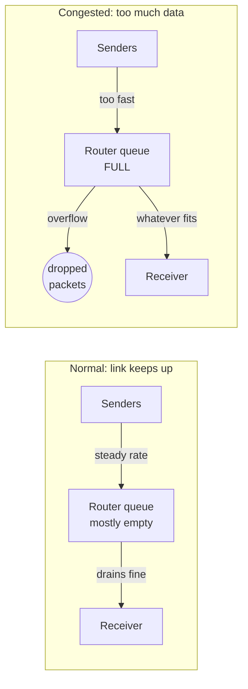
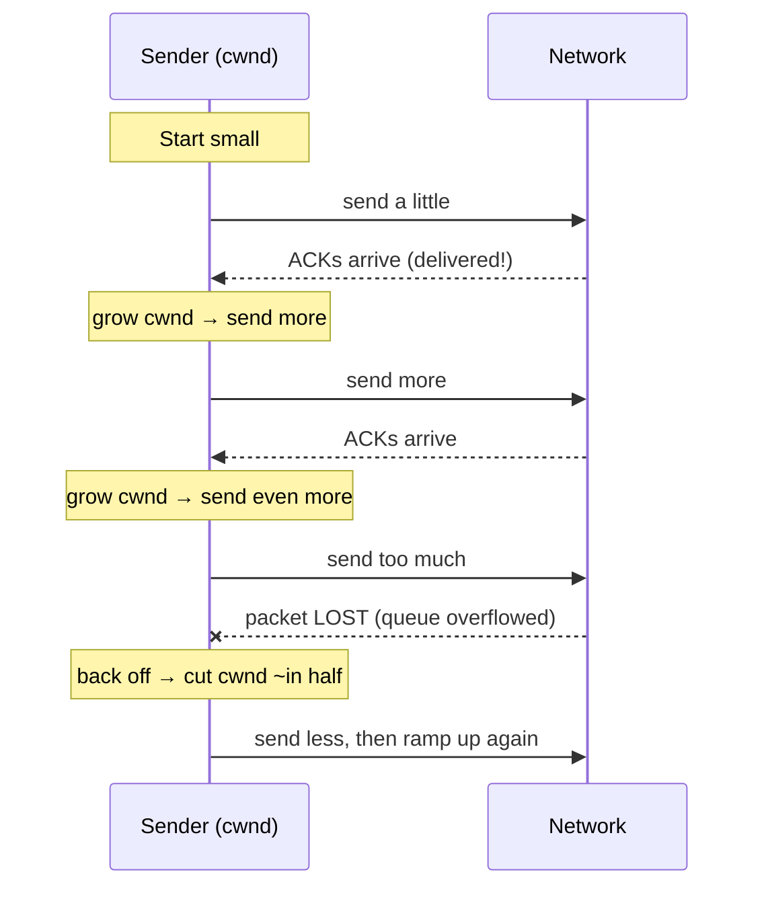

# Congestion Control & TCP Tuning — Junior

<!-- level-focus -->
At junior level, focus on this question:

> How can I apply **Congestion Control & TCP Tuning** in one small example and prove the result?

Use the smallest realistic scenario that exposes the decision and its failure behavior.
## 1. What "congestion" means

Data does not travel from sender to receiver in one hop. It passes through a chain of **routers**, and each router has a limited **outgoing link speed** and a small memory area called a **queue** (or buffer) where packets wait their turn.

As long as packets arrive at a router no faster than the link can drain them, the queue stays short and everything flows smoothly. But when many senders push data at once, packets can arrive **faster than the link drains them**. The queue fills up. Once the queue is full, the router has nowhere to put new packets, so it simply **drops** them. That is congestion: too much data chasing too little link capacity, ending in overflowing queues and lost packets.

The important insight for a beginner: a **lost packet is usually a signal, not just bad luck**. On a wired network, packets are rarely lost to random corruption. When TCP sees loss, it treats that as the network saying "you are sending too fast."

## 2. Why we need congestion control

Imagine every connection just blasted data as fast as its machine could produce it. Two bad things happen:

- **Congestion collapse.** Queues overflow, packets drop, senders retransmit the lost data, those retransmissions add *even more* traffic, more drops happen, and useful throughput crashes toward zero. The network spends all its capacity carrying doomed copies of packets. This actually happened to the early internet in 1986, which is why congestion control was added.
- **Unfairness.** A greedy sender would grab all the bandwidth and starve everyone else. There would be no way for many connections to share one link peacefully.

Congestion control solves both. Each sender continuously estimates how much the network can take, ramps up to use available capacity, and backs off when it sees loss — so the network stays useful and multiple flows share links roughly fairly, **without any central coordinator**.

## 3. The core idea: ramp up, back off

TCP keeps a private number called the **congestion window** (`cwnd`). It is the sender's own guess of how much unacknowledged data is safe to have "in flight" on the network at once. `cwnd` is not sent to anyone — it lives on the sender and controls the pace.

The loop is simple:

- **Every time an acknowledgement (ACK) arrives**, the network proved it delivered that data, so the sender grows `cwnd` a little and sends slightly more next time.
- **When a packet is lost** (detected via missing ACKs or duplicate ACKs), the sender treats it as congestion and **shrinks `cwnd`** — often cutting it roughly in half — then starts probing upward again.

This produces the classic "sawtooth" shape: `cwnd` climbs steadily, hits a loss, drops, and climbs again — forever hunting for the current safe sending rate as conditions change.

## 4. Slow start in one paragraph

When a connection first opens, TCP has no idea how fast the path is, so it does not start at full speed — it starts tiny (just a few packets) and grows **exponentially**: for every ACK received it increases `cwnd`, roughly *doubling* the amount in flight each round trip. Despite the name, "slow start" ramps up fast; it is "slow" only because it *begins* small instead of dumping everything at once. This phase continues until TCP either hits a loss or reaches a threshold, at which point it switches to a gentler, slower growth mode so it does not blow past the network's limit.

## 5. Flow control vs congestion control

Beginners constantly mix these two up because both **limit how fast the sender sends**. The difference is *who* is being protected and *who* signals the limit.

- **Flow control** protects the **receiver**. A slow or busy receiver could be overwhelmed if the sender fires data faster than it can read and process it. So the receiver advertises a **receive window** (`rwnd`) in every packet — literally "I have room for this many more bytes right now." The sender must never exceed it.
- **Congestion control** protects the **network** (the routers in between). No one advertises capacity here; the sender *infers* it from ACKs and losses and maintains its own `cwnd`.

TCP obeys **both at the same time**. The amount it may send is the **smaller** of the two windows:

> data in flight ≤ min(`rwnd`, `cwnd`)

| Aspect | Flow Control | Congestion Control |
|---|---|---|
| Protects | The **receiver** | The **network** (routers, links) |
| Problem it prevents | Overwhelming a slow receiver | Overflowing router queues, packet loss |
| Window used | `rwnd` (receive window) | `cwnd` (congestion window) |
| Who sets the limit | Receiver **advertises** it explicitly | Sender **estimates** it from ACKs/loss |
| Signal | Window field in each TCP header | Missing/duplicate ACKs, loss |
| Present in TCP header? | Yes, sent on the wire | No, private to the sender |

The rule to remember: **`rwnd` comes from the other end; `cwnd` comes from the sender's own guesswork; TCP always respects the tighter of the two.**

## 6. What "tuning" means

TCP works out of the box, but its defaults are compromises. "Tuning" means adjusting a few knobs so a connection performs better for a given situation — usually more throughput on fast, long-distance links, or lower latency for interactive traffic. The two knobs a junior engineer meets first:

- **Buffer sizes (send/receive buffers).** To keep a fast, high-latency link busy, the sender must have enough data "in flight" to fill the entire round trip. If the operating system's buffers are too small, `cwnd` gets capped early and the link sits half-idle even though bandwidth is free. Bigger buffers on high-speed long-distance paths let TCP open its window wide enough to use the pipe. (Too big wastes memory and can add delay, so it is a balance — more on that at higher tiers.)
- **Picking a congestion-control algorithm.** "Ramp up, back off" is the shape, but the exact rules differ between algorithms. Classic **Reno** cuts hard on any loss. Modern **CUBIC** (the Linux default) grows more aggressively to fill fast links. **BBR** (from Google) ignores loss as the main signal and instead measures the path's actual bandwidth and delay. On Linux the choice is a system setting; swapping it can meaningfully change throughput on the same link.

For now the takeaway is just: *tuning = choosing buffer sizes and an algorithm so TCP's built-in feedback loop performs well for your specific network and traffic.*

## 7. Key terms

| Term | Meaning |
|---|---|
| **Congestion** | Too much data for a link; router queues overflow and packets drop. |
| **Congestion collapse** | Retransmissions pile onto an already-overloaded network, crashing useful throughput. |
| **`cwnd` (congestion window)** | Sender's private estimate of how much data is safe in flight; grows on ACKs, shrinks on loss. |
| **`rwnd` (receive window)** | Receiver-advertised limit of how much it can accept; protects the receiver. |
| **In flight** | Data sent but not yet acknowledged. |
| **Slow start** | Opening phase that starts tiny and grows the window exponentially each round trip. |
| **ACK** | Acknowledgement; proof a packet was delivered, and the main "keep going" signal. |
| **Packet loss** | Usually a congestion signal on wired networks, not random corruption. |

---

**Recap:** congestion is queue overflow from too much data; congestion control avoids collapse and keeps links fair by having each sender ramp `cwnd` up on ACKs and back off on loss; flow control (`rwnd`, receiver-driven) is a separate limit obeyed at the same time; and tuning means picking buffer sizes and an algorithm so this loop performs well.

*Next step:* [Congestion Control & TCP Tuning — Middle](middle.md)

---

## Apply it

1. Choose one small, known input for **Congestion Control & TCP Tuning**.
2. Predict the output or observable behavior.
3. Run the smallest example or probe that exercises the concept.
4. Change one input to trigger a failure or boundary case.
5. Explain the evidence using the guide's vocabulary.

## Verify your work

- Record the exact input, command or code path, and output.
- Repeat the probe and confirm the result is consistent.
- Show one expected success and one expected failure.
- Resolve any difference between the prediction and the evidence.

## Review questions

- What problem does Congestion Control & TCP Tuning solve in the example?
- Which input changes the observed result, and why?
- What is the smallest useful success check?
- Which beginner mistake would your evidence catch?
