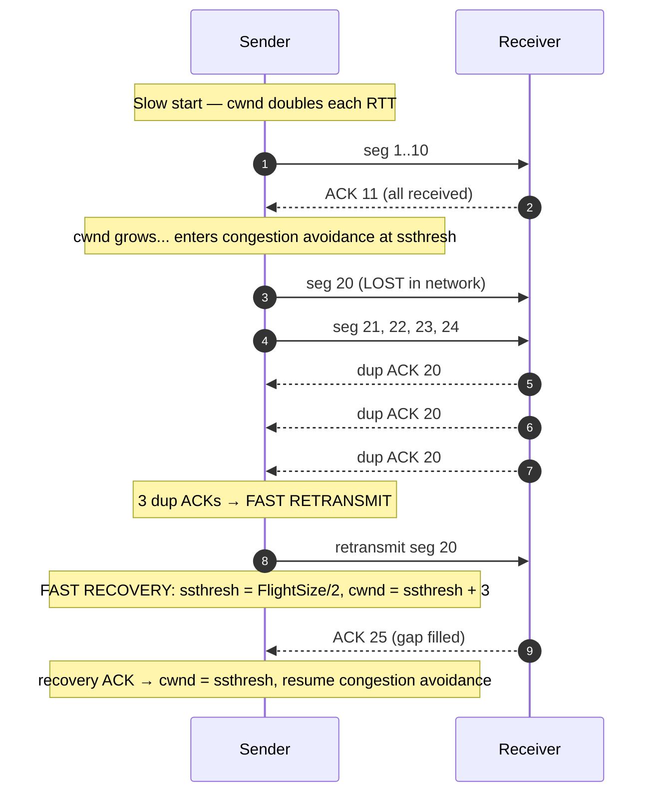

# Congestion Control & TCP Tuning — Middle

<!-- level-focus -->
At middle level, focus on this question:

> Where does **Congestion Control & TCP Tuning** belong in a maintainable component, and which trade-off selects the design?

Use the smallest realistic scenario that exposes the decision and its failure behavior.
## 1. The two windows: cwnd vs rwnd

At any moment a TCP sender may have at most **W** bytes of unacknowledged data "in flight." That limit is the minimum of two independent windows:

- **Receive window (`rwnd`)** — advertised by the *receiver* in every ACK. It says "I have this much free buffer space." It protects the receiver from being overrun. This is **flow control**.
- **Congestion window (`cwnd`)** — maintained privately by the *sender*. It is the sender's estimate of how much the *network* can absorb without dropping packets. This is **congestion control**.

The effective window is:

```
effective_window = min(cwnd, rwnd)
```

`rwnd` is a number on the wire; `cwnd` never leaves the sender's own memory. Congestion control is entirely the story of how `cwnd` moves. If `rwnd` is the bottleneck you have a flow-control problem (fix: bigger receive buffers). If `cwnd` is the bottleneck the network is telling you to slow down.

A second sender-side variable governs the mode of operation: the **slow-start threshold (`ssthresh`)**. When `cwnd < ssthresh` the connection is in slow start; when `cwnd >= ssthresh` it is in congestion avoidance.

---

## 2. Slow start: exponential probing

At connection open the sender knows nothing about the path, so it starts small — an **initial window (IW)** of a few segments (modern Linux uses IW10, ten segments). It then grows `cwnd` aggressively to find the ceiling quickly.

The rule: **for every ACK received, increase `cwnd` by one segment (one MSS).**

Because a full window of data produces roughly a full window of ACKs one RTT later, `cwnd` **doubles every round trip**:

```
RTT 0:  cwnd = 10   (send 10 segments)
RTT 1:  cwnd = 20   (each of 10 ACKs adds 1)
RTT 2:  cwnd = 40
RTT 3:  cwnd = 80   ...
```

This is exponential growth in per-RTT terms. It is called "slow" start only relative to the historical alternative of blasting a full receive window immediately — slow start is the *ramp* that replaced that. Growth continues until one of three things happens:

1. `cwnd` reaches `ssthresh` → switch to congestion avoidance.
2. A loss is detected → back off (see §4).
3. `cwnd` reaches `rwnd` → the receiver is now the limit.

---

## 3. Congestion avoidance: AIMD

Once past `ssthresh`, doubling every RTT is too reckless near the network's limit. The sender switches to **additive increase**: grow `cwnd` by roughly **one MSS per RTT**, not per ACK.

The per-ACK approximation used in practice:

```
cwnd += MSS * MSS / cwnd    (per ACK)
```

Summed over one window's worth of ACKs, this adds about one MSS per RTT — a gentle linear climb.

On loss, the sender applies **multiplicative decrease**: it halves the window. Together this is **AIMD — Additive Increase, Multiplicative Decrease** — the algorithm behind TCP Reno. Plotted over time, `cwnd` traces the classic **sawtooth**: a slow linear rise, a sharp halving at loss, then another rise. AIMD is what lets many competing flows converge toward a fair, stable share of a link: additive increase probes gently, multiplicative decrease responds hard, and the two together damp oscillation.

---

## 4. Detecting loss: 3 dup ACKs vs timeout

TCP has no "packet lost" signal from the network — it infers loss from the ACK stream. There are two distinct signals, and they mean very different things about network health.

TCP ACKs are **cumulative**: an ACK for byte N means "I have everything up to N." If a segment is lost but later segments arrive, the receiver keeps re-acknowledging the last in-order byte it holds — producing **duplicate ACKs**. Three duplicate ACKs (i.e. the same ACK number four times total) is the sender's cue that one segment was probably dropped while the pipe kept flowing.

A **retransmission timeout (RTO)** is the harsher signal: no ACK arrived at all before the timer expired. This suggests the pipe is empty — heavy loss, or the path collapsed.

| Property | 3 duplicate ACKs | Timeout (RTO) |
|---|---|---|
| What it means | One segment lost, others still arriving | Silence — nothing getting through |
| Network state implied | Mild congestion; pipe still flowing | Severe congestion or path failure |
| ACK clock | Still running | Lost |
| Sender response | Fast retransmit + fast recovery | Retransmit, collapse `cwnd` to 1 MSS |
| `ssthresh` after | max(FlightSize / 2, 2·MSS) | max(FlightSize / 2, 2·MSS) |
| `cwnd` after | `ssthresh` + 3·MSS (inflated) | 1 MSS → restart slow start |
| Recovery speed | Fast — no full ramp | Slow — full slow start again |

The key asymmetry: **three dup ACKs is a mild signal handled gracefully; a timeout is a severe signal handled brutally.** A connection that repeatedly times out will never build throughput, because it keeps restarting from `cwnd = 1`.

---

## 5. Fast retransmit and fast recovery

The pair of optimizations (RFC 5681, <https://www.rfc-editor.org/rfc/rfc5681>) that keep a single loss from triggering the expensive timeout path:

**Fast retransmit** — on the third duplicate ACK, retransmit the missing segment *immediately*, without waiting for the RTO. The dup ACKs are proof the pipe is still delivering, so there is no reason to wait.

**Fast recovery** — because data is still flowing, do *not* drop to slow start. Instead:

1. Set `ssthresh = max(FlightSize / 2, 2·MSS)`.
2. Set `cwnd = ssthresh + 3·MSS` (the "+3" credits the three segments that have provably left the network — the ones that generated the dup ACKs).
3. For each *additional* duplicate ACK, inflate `cwnd` by 1 MSS and send new data if the window allows (each dup ACK means another segment has left the pipe).
4. When the ACK for the retransmitted segment arrives ("recovery ACK"), **deflate**: set `cwnd = ssthresh` and return to congestion avoidance.

Net effect: a single loss halves the window and resumes from there, rather than collapsing to `cwnd = 1`. The sawtooth's teeth stay shallow.



---

## 6. Reno vs NewReno

Plain **Reno** handles one loss per window well, but stumbles when *multiple* segments are lost in the same window. The recovery ACK that fills the first gap is only a *partial ACK* — it does not cover the whole window. Reno mistakes it for full recovery, exits fast recovery too early, and often the next loss then triggers a timeout.

**NewReno** fixes this without requiring SACK. It remembers the highest sequence number sent when recovery began (the "recover" point). A partial ACK — one that advances but does not yet reach `recover` — is treated as evidence of *another* hole: NewReno immediately retransmits the next missing segment and **stays in fast recovery**. It only exits when an ACK finally covers `recover`. This lets NewReno repair multiple losses at roughly one segment per RTT, all within a single recovery episode, avoiding the timeout. NewReno is the baseline behavior most stacks implement; SACK-based recovery improves on it further by naming exactly which segments arrived.

---

## 7. Tracing a connection end to end

Putting the phases together for a single bulk transfer:

| Phase | Trigger to enter | `cwnd` behavior | Increase rule | Exit condition |
|---|---|---|---|---|
| **Slow start** | Connection open, or after RTO | Exponential (×2 per RTT) | +1 MSS per ACK | `cwnd ≥ ssthresh`, or loss |
| **Congestion avoidance** | `cwnd ≥ ssthresh` | Linear (+1 MSS per RTT) | +MSS²/cwnd per ACK | Loss detected |
| **Fast recovery** | 3 dup ACKs | Inflate then deflate to `ssthresh` | +1 MSS per extra dup ACK | Recovery ACK arrives |

A typical life cycle:

1. **Open.** `cwnd = IW` (10), `ssthresh` large. Slow start.
2. **Ramp.** `cwnd` doubles each RTT: 10 → 20 → 40 → 80.
3. **First loss (3 dup ACKs) at cwnd = 80.** `ssthresh = 40`, fast retransmit, fast recovery, resume congestion avoidance at `cwnd ≈ 40`.
4. **Linear climb.** 40 → 41 → 42 … probing gently for more headroom.
5. **Next loss (3 dup ACKs).** Halve again → sawtooth continues indefinitely.
6. **A timeout instead (severe loss).** `ssthresh = FlightSize/2`, `cwnd = 1 MSS`, back to slow start from the bottom — the throughput plunges and must ramp all over again.

Every timeout is expensive; the whole design goal of fast retransmit/recovery is to keep the connection on the dup-ACK path and out of the timeout path.

---

## 8. Bandwidth-Delay Product and buffer sizing

A window-based protocol can only keep a link full if it is allowed to have *at least one link's worth of data in flight*. That amount is the **Bandwidth-Delay Product (BDP)**:

```
BDP (bytes) = bandwidth (bytes/s) × RTT (s)
```

Example: a 1 Gbit/s path with 80 ms RTT.

```
BDP = (1e9 / 8) bytes/s × 0.080 s = 12.5 MB
```

To saturate that pipe the sender must be permitted **12.5 MB of unacknowledged data at once**. That requires two things simultaneously:

- `cwnd` must be allowed to grow to ~12.5 MB (congestion control must not cap it lower).
- **The socket buffers must be ≥ BDP.** The send buffer holds unacknowledged data waiting for ACKs; the receive buffer backs the advertised `rwnd`. If either buffer is smaller than BDP, `min(cwnd, rwnd)` — or the send buffer — caps the window below BDP and the link sits idle waiting for ACKs.

This is the classic "long fat network" (LFN) trap: a fast link with high latency where default 64 KB buffers throttle throughput to a small fraction of capacity, no matter how good the congestion algorithm is. On the 12.5 MB BDP path, a 64 KB buffer caps throughput at roughly `64 KB / 80 ms ≈ 6.4 Mbit/s` — under 1% of the link. **Buffers ≥ BDP are a precondition for the congestion algorithm to even matter.**

---

## 9. Tuning knobs

Practical levers on Linux, from most to least commonly touched:

**Socket buffer sizes.** The receive and send buffers cap `rwnd` and in-flight data.

- Autotuning (default, strongly preferred): the kernel grows buffers up to a ceiling based on observed BDP. Controlled by `net.ipv4.tcp_rmem` and `net.ipv4.tcp_wmem` (each a `min default max` triple). Raise the *max* to allow larger windows on LFN paths.
- Manual override per socket: `setsockopt(SO_RCVBUF)` / `setsockopt(SO_SNDBUF)`. Setting these explicitly **disables autotuning for that socket** — usually a mistake unless you know the exact BDP. Prefer raising the autotuning ceiling instead.
- `net.core.rmem_max` / `net.core.wmem_max` bound what a socket may request.

**Window scaling.** The TCP header's window field is 16 bits — max 64 KB — far below any modern BDP. The **window scale option** (`net.ipv4.tcp_window_scaling`, on by default) multiplies it up to gigabytes. It must be enabled or large buffers are pointless.

**Congestion algorithm selection.**

```
sysctl net.ipv4.tcp_congestion_control          # show current (e.g. cubic)
sysctl net.ipv4.tcp_available_congestion_control # what's loaded
sysctl -w net.ipv4.tcp_congestion_control=bbr    # switch system-wide
```

CUBIC is the modern Linux default (a loss-based algorithm that grows more aggressively than Reno on high-BDP links). BBR is a model-based alternative. Choosing between them is a senior-tier concern — the point here is knowing the knob exists and lives at `net.ipv4.tcp_congestion_control`.

**Initial window** (`IW10`) and **RTO minimums** are further knobs but are rarely changed outside specialized deployments.

---

## Apply it

1. Find a real component where **Congestion Control & TCP Tuning** affects an interface or dependency.
2. Write two plausible choices and the constraint that favors each one.
3. Make the smallest reversible change at that boundary.
4. Exercise the component alone, then exercise the integrated flow.
5. Keep the decision note with the evidence that selected the option.

## Verify your work

- A focused check proves the local behavior.
- An integrated check proves callers and dependencies still agree.
- Logs, traces, compiler output, or benchmarks expose the boundary.
- Reverting the change restores the previous behavior without unrelated edits.

## Review questions

- Which boundary is most affected by Congestion Control & TCP Tuning?
- What constraint would make you choose the alternative design?
- How would you isolate a local defect from an integration defect?
- What evidence shows that the change remains maintainable?
