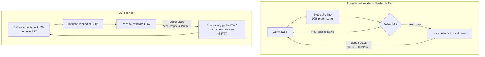
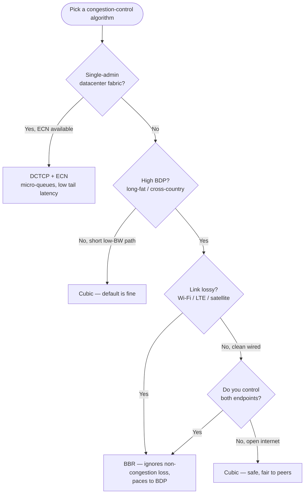

# Congestion Control & TCP Tuning — Senior

<!-- level-focus -->
At senior level, focus on this question:

> Which system invariant is affected by **Congestion Control & TCP Tuning** under failure, load, and change?

Use the smallest realistic scenario that exposes the decision and its failure behavior.
## 1. The Control Loop and What Signal It Reads

Every congestion-control algorithm is a feedback loop that adjusts one number — the **congestion window** (`cwnd`), how many bytes may be in flight before an ACK returns. Throughput is bounded by `cwnd / RTT`, so the whole game is: keep `cwnd` as large as the path can carry without overrunning it.

What differs between algorithms is the **signal** they treat as "the path is full":

- **Packet loss** — a dropped segment (detected via duplicate ACKs or timeout) means a buffer somewhere overflowed.
- **Delay / RTT inflation** — rising round-trip time means a queue is building *before* it overflows.
- **A bandwidth × RTT model** — actively estimate the path's delivery rate and minimum RTT, and pace to that estimate rather than reacting to a symptom.

The choice of signal determines everything downstream: how aggressive the sender is, how much latency it induces, and how it behaves on lossy links. A senior reads a network profile and asks "which signal is *honest* here?" On a clean wired path, loss genuinely means congestion. On a Wi-Fi or LTE link, loss is often just radio corruption — treating it as congestion needlessly throttles you.

---

## 2. Loss-Based vs Delay-Based vs Model-Based

**Loss-based (Reno, Cubic).** Grow `cwnd` until a packet drops, then cut. Reno cuts `cwnd` in half (multiplicative decrease) and grows linearly (additive increase) — the classic AIMD sawtooth. Cubic replaces the linear growth with a cubic function of time since the last loss: it ramps back toward the previous ceiling fast, plateaus near it, then probes cautiously above. Loss-based control **maximizes utilization of whatever buffer exists** but only learns the limit by hitting it — which means it deliberately fills queues.

**Delay-based (Vegas).** Watch RTT. If the current RTT exceeds the observed minimum, a queue is forming, so back off *before* loss. Vegas keeps queues short and latency low — but it is too polite: when it shares a bottleneck with a loss-based flow, the loss-based flow keeps pushing until loss, Vegas sees the rising RTT and yields, and Vegas gets starved. This "friendliness gap" is why pure delay-based control never won the public internet.

**Model-based (BBR).** Google's BBR sidesteps the loss-vs-delay dichotomy. It continuously estimates two things: **bottleneck bandwidth** (max delivery rate seen) and **minimum RTT** (propagation delay with no queue). Their product is the **bandwidth-delay product (BDP)** — the ideal amount of data in flight. BBR paces sending to match estimated bandwidth and caps in-flight data near the BDP, so it fills the *pipe* without filling the *buffer*. It periodically probes for more bandwidth and periodically drains to re-measure min-RTT. It largely ignores loss as a congestion signal, which is its superpower on lossy links and its controversy on shared ones.

The mental model:

- Loss-based: "push until it breaks, then retreat." Fills buffers.
- Delay-based: "retreat at the first sign of a queue." Too timid to compete.
- Model-based: "measure the pipe, pace to it." Aims to sit at the knee of the curve.

---

## 3. The Bufferbloat Problem

Bufferbloat is the defining pathology that motivates most of modern congestion-control research, and it is the single most important concept in this tier.

**The cause.** Router and modem vendors, for years, installed huge packet buffers, reasoning that dropping packets is bad, so more buffer must be better. Combine that with a loss-based sender whose entire strategy is "grow until loss," and you get a disaster: the sender fills the giant buffer to the brim before it ever sees a drop. A full buffer that takes, say, 1–2 seconds to drain adds that entire delay to *every* packet crossing it — including latency-sensitive traffic sharing the link.

**The symptom.** A single large upload (a loss-based flow filling a bloated home-router buffer) makes video calls stutter and web pages crawl, even though there's "plenty of bandwidth." Throughput is fine; latency is destroyed. Classic diagnostic: run a bandwidth test and watch ping RTT jump from 20 ms to 800 ms while the test runs.

**Why loss-based control causes it.** The algorithm *needs* the queue to be full to detect the limit. Bigger buffer → bigger standing queue → more latency. The buffer being large is precisely what makes it harmful.

**The mitigations:**

- **AQM (Active Queue Management)** — drop or mark packets *before* the buffer is full, so senders get the congestion signal early and the standing queue stays small. **CoDel** (Controlled Delay) targets a queue *sojourn time* (~5 ms) rather than a queue *length*, adapting to any link speed. **FQ** (Fair Queuing) isolates flows so one bulk transfer can't monopolize the queue and starve interactive flows; **fq_codel** combines both and is a sane default.
- **ECN (Explicit Congestion Notification)** — instead of dropping to signal congestion, the router *marks* a bit in the header. The sender reacts as if to loss, but nothing is actually lost — no retransmit, no goodput hit. ECN needs both endpoints and the path to cooperate.
- **BBR** — by capping in-flight data at the BDP rather than growing until loss, BBR *avoids creating the standing queue in the first place*, which is a sender-side answer to a problem AQM solves in the middle of the network.

The contrast the diagram encodes: loss-based control's stable operating point is a *full* buffer; BBR's is an *empty* one at the same throughput.

---

## 4. Algorithm Comparison

| Algorithm | Congestion signal | Optimizes for | Best fit | Main weakness |
|-----------|-------------------|---------------|----------|---------------|
| **Reno** | Packet loss (AIMD) | Simplicity, fairness | Teaching, low-BDP links | Slow to fill high-BDP pipes; sawtooth underutilizes |
| **Cubic** | Packet loss (cubic growth) | Throughput on high-BDP wired paths | General internet, Linux default | Fills buffers → bufferbloat; over-reacts to non-congestion loss |
| **Vegas** | RTT increase (delay) | Low latency, small queues | Homogeneous delay-based networks | Starved when competing with loss-based flows |
| **BBR** | BW × min-RTT model | Goodput at low latency | High-BDP, lossy, cross-country, mobile | Can be unfair to Cubic; v1 mis-estimates min-RTT with deep buffers |
| **DCTCP** | ECN marks (fine-grained) | Ultra-low latency in datacenter | Single-admin datacenter fabric | Requires ECN + switch config end-to-end; not for the open internet |

Read the table as a signal-selection matrix: pick the algorithm whose signal is the truest indicator of congestion on *your* path.

---

## 5. Why Cubic Is the Linux Default — and Where BBR Wins

**Why Cubic is the default.** Cubic is the pragmatic center of gravity for the general internet. Its cubic growth function lets it recover to a large window quickly after loss, so it fills high-BDP pipes far better than Reno while staying reasonably fair to other Cubic flows (which is almost everything else on the internet). It needs no path or peer cooperation, no ECN, no tuning — it just works acceptably everywhere. For a server whose traffic distribution is "the entire internet, mostly reasonable wired paths," Cubic is the safe default, and that is exactly why Linux ships it.

**Where BBR wins.** BBR's advantage appears precisely where Cubic's loss signal lies:

- **High-BDP paths (long fat networks).** Cross-country or intercontinental links with high bandwidth and high RTT need a huge window; Cubic's loss-triggered cuts repeatedly knock it down. BBR paces to the measured BDP and holds throughput steady.
- **Lossy links (Wi-Fi, LTE/5G, satellite).** Random radio loss makes Cubic slam the brakes for no congestion reason. BBR treats loss as noise and keeps the pipe full — often 2–20× more goodput on a link with a few percent loss.
- **Latency-sensitive bulk transfer.** BBR delivers high throughput *without* the standing queue, so it doesn't wreck the RTT of flows sharing the bottleneck.

The honest caveat: BBR (especially v1) can be **unfair to Cubic** on a shared bottleneck — it can grab more than its share because it doesn't back off on the loss that Cubic respects. It can also over-estimate bandwidth into deep buffers. BBRv2/v3 add ECN-awareness and better loss handling to close these gaps. The senior decision is: deploy BBR where *you control both ends or the path is yours* (CDN edge to origin, mobile clients to your servers) and be deliberate about deploying it into ecosystems full of Cubic flows.

---

## 6. Choosing by Network Profile

The choice reduces to a few questions about the path.

The two decisive axes are **BDP** (does the path need a big window Cubic struggles to hold?) and **loss character** (is loss real congestion or radio noise?). DCTCP is a special case gated on you owning the whole fabric.

---

## 7. Tuning for Real Workloads

Algorithm choice is one knob; the surrounding stack matters as much.

**Long fat networks (LFN).** A path with high bandwidth × high RTT has a large BDP — sometimes megabytes. TCP's classic 16-bit window field maxes at 64 KB, nowhere near enough. **Window scaling** (RFC 7323) is the enabling option; ensure it's on and that OS socket buffers (`net.ipv4.tcp_rmem` / `tcp_wmem` and their autotuning ceilings) are large enough to actually hold a full BDP of data in flight. If the buffer caps below the BDP, throughput is limited by memory, not the network, no matter which algorithm you pick. This is the most common "why is my transcontinental transfer slow" root cause.

**Datacenter.** Inside a fabric you own, use **DCTCP with ECN**. Switches mark packets based on tiny queue thresholds, and DCTCP reacts *proportionally* to the fraction of marked packets rather than halving on a single loss. The result is very short queues and very low tail latency — critical for incast-heavy, request/response RPC traffic. This only works because you control every switch and endpoint; it is not an open-internet strategy.

**CDN / edge.** At the edge, BBR is a popular choice: clients arrive over lossy mobile and long-haul paths where Cubic's loss sensitivity hurts, and the CDN operator controls the server end. Cloudflare, Google, and others run BBR at the edge for exactly this reason. The edge-to-origin leg (your own backbone) is also a good BBR candidate since you own both ends.

**General web server.** Leave Cubic on, enable window scaling and buffer autotuning, enable ECN if your path supports it, and enable `fq` / `fq_codel` on egress to keep your own queue from bloating. That covers the majority of workloads with zero exotic tuning.

---

## 8. Congestion Control Meets TLS, HTTP/2 and QUIC

Congestion control doesn't live in isolation — it interacts badly with layers stacked on top of a single TCP connection.

**Head-of-line blocking.** HTTP/2 multiplexes many logical streams over one TCP connection. TCP guarantees in-order byte delivery, so if *one* packet is lost, TCP stalls delivery of *everything* behind it — including bytes belonging to unrelated HTTP/2 streams that already arrived. One lost packet blocks the whole connection. TLS makes this worse because the byte stream must be decrypted in order. On a lossy link, HTTP/2-over-TCP can perform *worse* than HTTP/1.1's multiple connections, because HTTP/1.1's parallel TCP flows fail independently.

**Why QUIC moves congestion control to userspace.** HTTP/3 runs over QUIC, which runs over UDP. QUIC implements streams, loss recovery, and congestion control *itself*, in userspace, with per-stream flow control. A lost packet only blocks the stream it belonged to — other streams keep flowing. Because congestion control is in the application (not the kernel), operators can deploy and iterate on algorithms (BBR variants, tuned pacing) without waiting for kernel upgrades across a fleet, and can tailor them per-connection. QUIC also folds the TLS 1.3 handshake into the transport handshake, cutting round trips.

The senior framing: **HTTP/2 solved application-layer HOL blocking but sat on top of transport-layer HOL blocking; QUIC dissolves the transport layer's version by owning loss recovery per-stream.** If your users are on lossy mobile networks, HTTP/3 is often the bigger win than any TCP algorithm swap — because it changes what a single loss costs.

---

## 9. When Tuning Beats a CDN — and When It Doesn't

The most senior instinct is knowing when *not* to tune.

**Reach for a CDN first when** the problem is *distance and content*: static assets, cacheable API responses, or serving a global audience from one region. A CDN terminates TCP close to the user, so the RTT of the congestion-control loop is tiny and Cubic works great over that short leg; the CDN's own optimized stack (often BBR, tuned buffers, HTTP/3) handles the long-haul leg between edge and origin. You get 90% of the benefit of expert tuning with a config change and no kernel risk. For most web workloads, "use a CDN" is the correct, boring answer.

**Tuning is worth it when** a CDN can't help because the traffic is:

- **Non-cacheable and long-lived** — large uploads, backups, replication, database streaming, video ingest. There's no cache to hit; the bytes must cross the long path.
- **Between infrastructure you own** — datacenter-to-datacenter replication, edge-to-origin backhaul. Here DCTCP or BBR with proper buffer sizing directly moves throughput and tail latency, and you control both ends.
- **Latency-bound at the transport layer** — an interactive service where bufferbloat or Cubic's sawtooth is measurably hurting p99. Enabling `fq_codel` and switching to BBR can drop tail latency without touching application code.

The decision rule: **if the bytes are cacheable or the audience is far, buy distance reduction (CDN); if the bytes are uncacheable and cross a path you own, tune the transport.** Don't hand-tune congestion control to serve cat pictures — put them on a CDN and spend your attention on the replication link that has no other answer.

---

## 10. Measuring What Matters

You cannot tune what you don't measure, and the headline "bandwidth" number lies.

- **Goodput** — application-useful bytes per second, *excluding* retransmits and protocol overhead. This is what the user experiences. Throughput can look healthy while goodput is poor because half the packets are retransmits.
- **RTT under load** — measure latency *while the link is busy*, not idle. The gap between idle RTT and loaded RTT is your bufferbloat number. A link that's 20 ms idle and 500 ms loaded has a queue problem, full stop.
- **Retransmit rate** — high retransmits signal real loss (or a loss-based algorithm on a lossy link fighting phantom congestion). On Linux, `ss -ti` exposes per-socket `retrans`, `cwnd`, `rtt`, and the active congestion-control algorithm.
- **p99 / p999 tail latency** — averages hide the pathology. Bufferbloat and incast show up in the tail, and the tail is what breaks SLOs.

Tools worth knowing: `ss -ti` for live per-connection state; the **flent** / RRUL test for bufferbloat (loads the link and plots latency simultaneously); `tcp_probe`/eBPF tracing for cwnd evolution. The discipline: change one variable, measure goodput *and* loaded RTT *and* retransmits together, because improving one at the expense of another (e.g. more throughput but wrecked latency) is a regression, not a win.

---

## 11. Senior Takeaways

- Congestion control is a feedback loop; the algorithm is defined by the **signal** it trusts — loss, delay, or a bandwidth-delay model. Pick the signal that is honest on your path.
- **Bufferbloat** is the pathology to understand deeply: loss-based control *needs* full buffers to work, over-buffered devices turn that into seconds of latency, and AQM (CoDel/FQ), ECN, and BBR are the three answers.
- **Cubic** is the right default for the open internet; **BBR** wins on high-BDP, lossy, and cross-country/mobile paths and where you own both ends — with a fairness caveat against Cubic.
- Tuning is stack-wide: window scaling and big buffers for LFNs, DCTCP+ECN for datacenters, BBR + fq_codel for edges. The algorithm alone is not the fix.
- HTTP/2's multiplexing sits on top of TCP's head-of-line blocking; **QUIC/HTTP/3 moves congestion control to userspace and makes a single loss cost only one stream** — often the bigger mobile win than any TCP swap.
- Know when *not* to tune: cacheable or far-away traffic belongs on a **CDN**; hand-tune the transport only for uncacheable bytes crossing paths you own.
- Measure **goodput, loaded RTT, retransmits, and tail latency together** — the raw bandwidth number hides every problem worth solving.

*Next step:* [Congestion Control & TCP Tuning — Professional](professional.md)

---

## Apply it

1. State the system invariant that **Congestion Control & TCP Tuning** must protect.
2. Mark ownership, state, and failure propagation at each boundary.
3. Compare two designs under load, dependency failure, and future change.
4. Define recovery and compatibility behavior before implementation.
5. Test the riskiest assumption with a focused experiment.

## Verify your work

- The experiment supports the design with evidence, not preference.
- Failure injection shows the blast radius and recovery path.
- Compatibility checks cover old and new callers or data.
- Operational signals reveal invariant violations and recovery progress.

## Review questions

- Which invariant must remain true when Congestion Control & TCP Tuning fails?
- Where should recovery responsibility live, and why?
- Which assumption deserves an experiment before implementation?
- How can the design evolve without changing every consumer at once?
