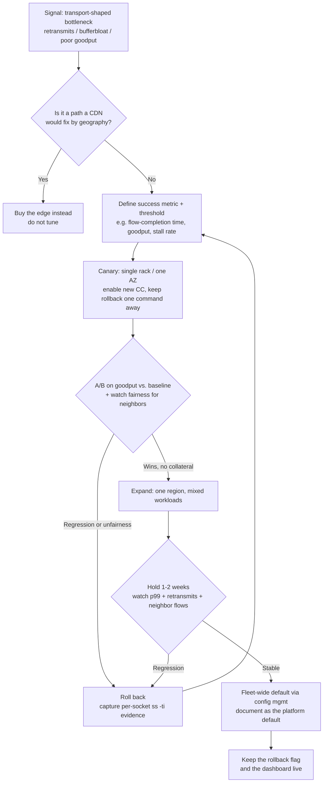

# Congestion Control & TCP Tuning — Staff

At staff level, congestion control stops being a `sysctl` question and becomes a portfolio-allocation question: is transport tuning the highest-leverage use of scarce platform engineering time, or is it a rabbit hole that a CDN vendor already solved for a rounding-error fraction of an engineer-year? Your job is not to know that BBR exists — a senior knows that. Your job is to decide *whether the fleet should care*, to protect the org from tuning that helps one team and quietly harms its neighbors, and to make the safe default the path of least resistance so no app team ever hand-rolls a socket option in production.

This file is about judgment, blast radius, and framing — not about `cwnd` math.

---

## Table of Contents

1. [Is this even the bottleneck? The diagnosis-first discipline](#1-is-this-even-the-bottleneck-the-diagnosis-first-discipline)
2. [Buy vs. build: CDN/edge offload vs. in-house tuning](#2-buy-vs-build-cdnedge-offload-vs-in-house-tuning)
3. [Rolling out a fleet-wide CC change safely](#3-rolling-out-a-fleet-wide-cc-change-safely)
4. [Fairness: BBR vs. Cubic and the neighbor problem](#4-fairness-bbr-vs-cubic-and-the-neighbor-problem)
5. [Tuning as a platform capability vs. per-team knobs](#5-tuning-as-a-platform-capability-vs-per-team-knobs)
6. [Sane defaults so app teams never touch a socket option](#6-sane-defaults-so-app-teams-never-touch-a-socket-option)
7. [Framing to leadership: latency, revenue, and diminishing returns](#7-framing-to-leadership-latency-revenue-and-diminishing-returns)
8. [Staff checklist](#8-staff-checklist)

---

## 1. Is this even the bottleneck? The diagnosis-first discipline

The most expensive mistake in transport tuning is tuning transport when the problem lives somewhere else. p99 latency that is actually a slow database query, a GC pause, a cold cache, or a thread-pool starvation event will not move one millisecond because you enabled BBR — but you will have spent two weeks and shipped kernel-level risk to prove it.

The staff discipline is to **refuse to touch a single knob until the evidence points at the transport.** Congestion control matters when *and only when* you are moving meaningful bytes over links with non-trivial RTT and non-trivial loss. If your median RTT is 2 ms and your loss rate is 0.001%, the congestion controller is already running at line rate and there is nothing to win.

Signals that actually implicate transport, gathered *before* proposing any change:

- **Retransmit rate.** `netstat -s` / `nstat` deltas for segment retransmits, or `ss -ti` per-socket. A retransmit rate above ~1–2% on a path you care about is a real signal; near-zero means loss-based control is not your problem.
- **RTT and its variance.** `ss -ti` reports smoothed RTT and RTT variance per connection. High, *stable* RTT is geography (buy an edge); high, *jittery* RTT under load smells like bufferbloat, which is where BBR-class controllers actually help.
- **Goodput vs. bandwidth-delay product.** Are flows filling the BDP (`cwnd × MSS` vs. `bandwidth × RTT`)? If `cwnd` is capped small under loss, you have a congestion-control-shaped problem. If `cwnd` is large and goodput is still low, look up the stack.
- **Where the time goes.** Break the request into DNS → TCP handshake → TLS → TTFB → transfer. If transfer is a sliver of total, transport tuning cannot help — you have a server-think-time or round-trip-count problem (fix that with HTTP/2, connection reuse, or fewer round trips, not with `cwnd` tuning).

Write the numbers down *before* the change and commit to the exact metric that must move. "We'll enable BBR and see" is not an experiment; "we expect flow-completion time for objects >1 MB on cross-region paths to improve by ≥15% at p75 goodput, and retransmit-triggered stalls to drop" is. If you cannot name the metric and the threshold up front, you are not ready to tune — you are ready to measure.

---

## 2. Buy vs. build: CDN/edge offload vs. in-house tuning

The single biggest lever on last-mile transport performance is usually **not a knob you own — it is proximity.** A CDN or edge PoP terminates the client's TCP/TLS close to them, runs a well-tuned, professionally maintained stack, and turns one long, lossy, high-RTT path into two short ones (client↔edge, edge↔origin). That collapses the RTT that congestion control is fighting against in the first place. For most public-internet, user-facing byte delivery, buying the edge dominates any in-house sysctl work you could do — you are renting the outcome of a team whose entire job is transport.

In-house kernel tuning earns its keep in the places a CDN *cannot* reach: your own backbone and inter-DC traffic, storage/replication fabrics, large internal data movement (analytics, backups, model shipping), and any bulk transfer between machines you own on both ends. That is exactly the traffic no vendor terminates, and exactly where a fleet-wide BBR or buffer-sizing change pays off across every team at once.

| Signal | Lean CDN/edge offload | Lean in-house tuning |
|---|---|---|
| Traffic type | Public-internet, user-facing assets/API | Internal DC↔DC, replication, bulk transfer |
| Who controls both endpoints | Only the origin | Both ends are your fleet |
| Dominant cost | RTT from client geography | Loss/bufferbloat on links you own |
| Fix that helps most | Terminate closer to the user | Change the controller / buffers fleet-wide |
| Team cost to sustain | Vendor contract + config | Ongoing kernel/platform ownership |
| Blast radius of a mistake | Contained to CDN config | Fleet-wide kernel behavior |
| Compliance / data residency | May constrain vendor choice | Fully in your control |

The trap is treating these as competitors. They are not: **offload the last mile to the edge, and own the tuning of the traffic no edge will ever see.** A staff engineer who proposes hand-tuning `cwnd` to fix mobile-client latency — traffic a CDN would have fixed with geography — is optimizing the wrong layer. One who leaves the storage-replication fabric on stock loss-based control because "we have a CDN" is leaving fleet-wide throughput on the table.

---

## 3. Rolling out a fleet-wide CC change safely

Enabling BBR (or resizing buffers, or changing initial `cwnd`) across a fleet is a kernel behavior change on every machine. It is a *deploy*, and it deserves deploy discipline: reversible, staged, measured, and owned. The default congestion controller is one of the highest-blast-radius single settings on a Linux host — treat "flip `net.ipv4.tcp_congestion_control`" with the same gravity as a library upgrade in the hot path.

Non-negotiables for the rollout:

- **One-command rollback, always live.** The change must be a config-managed toggle, not a hand-edited `sysctl`. If reverting requires a human to SSH into hosts, you do not have a safe rollout — you have a landmine.
- **A/B on goodput, not on vibes.** Split comparable hosts, hold the workload constant, and compare the metric you committed to in §1. Loss-based and rate-based controllers behave differently under different loss regimes; a win on a lossy path can be a wash on a clean one, so measure on the paths that motivated the change.
- **Watch the neighbors, not just yourself.** A CC change that improves your goodput by stealing capacity from co-tenant flows on a shared link is not a win — it is a fairness regression you have exported to another team (see §4). Instrument the *shared link's* aggregate behavior, not only your flows.
- **Stage by blast radius.** Rack → AZ → region → fleet, with a hold period at each step long enough to catch slow-burn regressions (a full traffic cycle, including peak). Never let the canary and the fleet-wide flip happen in the same change window.

---

## 4. Fairness: BBR vs. Cubic and the neighbor problem

The uncomfortable truth a staff engineer must own: **a controller that is better for you can be worse for the people sharing your link.** Loss-based controllers (Cubic, Reno) back off when they see loss. Rate/model-based controllers (BBR) build a model of the path's bandwidth and RTT and can hold their sending rate through loss that would make a Cubic flow yield. On a shared bottleneck, that can mean a BBR flow claims more than its fair share of a link co-occupied by Cubic flows — you win, and your neighbor's throughput quietly craters.

This is not a reason to never use BBR. It is a reason to know *whose link you are on* before you deploy it fleet-wide:

- **Links where you own all the flows** (your own inter-DC fabric, your storage replication): fairness against strangers is a non-issue — everything on the wire is yours, and you can reason about the aggregate. This is the safe home for aggressive controllers.
- **Shared public paths and multi-tenant links**: BBR's behavior against other tenants' loss-based flows is a real externality. If you are one tenant among many on a link you do not control end-to-end, "we improved our goodput" may translate to "we degraded a neighbor," and that neighbor may be another team in your own company or a peering partner whose complaint lands on your director's desk.

The staff move is to make fairness an explicit acceptance criterion of the rollout, not an afterthought. During the A/B (§3), measure the aggregate behavior of the shared bottleneck and any co-tenant flows you can observe. If enabling the aggressive controller improves your numbers *and* degrades the shared link's fairness, that is a trade you must surface and get a decision on — not one you make silently because your dashboard turned green. Aggressive tuning that externalizes cost onto neighbors is how a "performance win" becomes an incident review.

---

## 5. Tuning as a platform capability vs. per-team knobs

The organizational failure mode is **N teams each discovering transport tuning independently.** Team A sets a jumbo initial `cwnd` in a startup script, Team B bakes a custom controller into their base image, Team C copies a `sysctl` blog post from 2014 into their Ansible. Now every incident involving latency requires archaeology to find out which of a dozen bespoke transport configs is in play, no two hosts behave the same, and the knowledge lives in individuals' heads. This does not scale and it is not debuggable.

The staff position is that **kernel and network tuning is a platform capability, owned centrally, exposed as a small set of vetted profiles — not a per-team knob.** Concretely:

- **One owner for transport defaults.** The platform/infra team owns the default congestion controller, buffer sizing, and the handful of TCP sysctls that matter, applied uniformly through config management. Teams inherit; they do not each reinvent.
- **Profiles, not raw knobs.** Expose intent-level choices ("bulk-transfer profile," "low-latency-RPC profile") that map to a vetted set of settings, rather than letting teams set arbitrary socket options. A profile is reviewable, testable, and rollable-back; a scattered `setsockopt` is none of those.
- **Escape hatch with review.** A team with a genuinely unusual workload can request a deviation — but it goes through the platform team, gets documented, and becomes either a new profile or a rejected experiment. The point is not to forbid tuning; it is to make sure every tuned host is a *known* tuned host.
- **Centralize the expertise.** Transport tuning is deep, rarely-exercised knowledge. Duplicating it across every product team means every team maintains a skill they use once a year and get wrong. Concentrating it in one team means the org has one place that is genuinely good at it, and one dashboard that tells the truth.

The test of whether you have this right: when a latency incident starts, can someone say in thirty seconds exactly which transport profile every involved host is running, and roll it back centrally? If the answer requires spelunking through per-team scripts, you have knobs where you should have a platform.

---

## 6. Sane defaults so app teams never touch a socket option

The most valuable artifact a staff engineer ships here is not a tuned kernel — it is a **default good enough that no app team is ever tempted to hand-roll one.** Every `setsockopt` in application code is a small permanent liability: it encodes a transport assumption into product code, it drifts from the platform's defaults, and it turns into a "why is this one service weird?" mystery two years later when its author has left.

Prevent that by making the default carry its own weight:

- **Ship sane defaults in the platform, not in app code.** Connection reuse / keep-alive, sensible timeouts, the chosen congestion controller, and buffer sizing belong in the base image and the standard client libraries — inherited automatically, tuned once, tuned centrally.
- **Document the defaults and *why*.** A short, discoverable page that says "the fleet default controller is X because our traffic is mostly Y; here is when to ask for a different profile" stops the copy-paste-from-a-blog reflex before it starts. The absence of this doc is why teams hand-roll — they cannot find the sanctioned answer, so they invent one.
- **Make the right thing the easy thing.** If using the platform's connection-pooling client is easier than opening a raw socket, teams will use it. If the sanctioned low-latency profile is a one-line label on a deployment, no one writes a bespoke `sysctl`. Defaults win by being frictionless, not by being mandated.
- **Audit for drift.** Periodically scan for app-level socket options and custom transport sysctls in team repos and images. Each one is either a gap in your default (fix the default) or an unowned deviation (fold it into a profile or remove it).

The goal state: an app team ships a service, gets good transport behavior for free, and never learns what a congestion controller is. That is the win — not that everyone becomes a transport expert, but that almost no one has to.

---

## 7. Framing to leadership: latency, revenue, and diminishing returns

Leadership does not fund `cwnd`. It funds outcomes. The framing that lands is the one that connects transport work to a number the business already cares about — and, crucially, one that is *honest about diminishing returns* so you keep your credibility for the next ask.

The real chain: **latency → conversion/engagement/revenue.** Faster byte delivery improves flow-completion time, which improves page load and time-to-interactive, which measurably moves conversion, bounce, and engagement for user-facing products, and moves job throughput / cost for internal batch pipelines. That is the sentence to say — not "we want to enable BBR."

But the staff duty is to frame the *curve*, not just the direction:

- **The first fix is cheap and huge; the tenth is expensive and tiny.** Terminating traffic at the edge, turning on connection reuse, and shipping a sane default controller are enormous wins for modest effort. Hand-tuning the last few percent of `cwnd` behavior on a niche path is weeks of expert time for a change no dashboard will notice. Say this out loud so leadership funds the cheap wins and does not mistake the plateau for a broken team.
- **Name the point where buying beats building.** Past a certain point, the marginal latency win costs more in engineer-time than buying more edge presence or a better CDN tier. That crossover is a real, defensible line — draw it, and recommend stopping (or buying) on the far side of it.
- **Tie the ask to a committed metric, then report against it.** "We expect ≥X% improvement in flow-completion time on paths Y, at a cost of Z engineer-weeks, and here is where we'll stop." Then come back and show whether X happened. A staff engineer who reports honestly that a tuning effort hit diminishing returns and recommends stopping is *more* fundable next time, not less.

The anti-pattern is selling transport tuning as an open-ended source of wins. It is not. It is a curve that starts steep and flattens hard. Your credibility comes from being the person who knows where the flat part starts and refuses to spend the org's time on it.

---

## 8. Staff checklist

- [ ] No knob is touched until retransmit rate, RTT/variance, and goodput-vs-BDP evidence point at the transport — and the success metric and threshold are written down first.
- [ ] Last-mile, user-facing latency is solved with edge/CDN proximity; in-house tuning is reserved for traffic you own on both ends.
- [ ] Any fleet-wide CC change is a config-managed, one-command-reversible deploy, staged rack → AZ → region → fleet with a hold at each step.
- [ ] The A/B measures goodput against a real baseline *and* the fairness impact on co-tenant flows on shared links.
- [ ] BBR-class aggressive controllers are deployed on links you own end-to-end; their neighbor-fairness externality is an explicit, surfaced decision on shared paths.
- [ ] Transport tuning is a centrally owned platform capability exposed as vetted profiles, not per-team `setsockopt` and copy-pasted sysctls.
- [ ] Sane defaults ship in the base image and standard clients, are documented with rationale, and are audited for drift so app teams never hand-roll transport config.
- [ ] Leadership framing ties latency to revenue *and* names the diminishing-returns point and the buy-vs-build crossover — with a committed metric reported honestly afterward.

---

*Next step:* [Congestion Control & TCP Tuning — Interview](interview.md)
