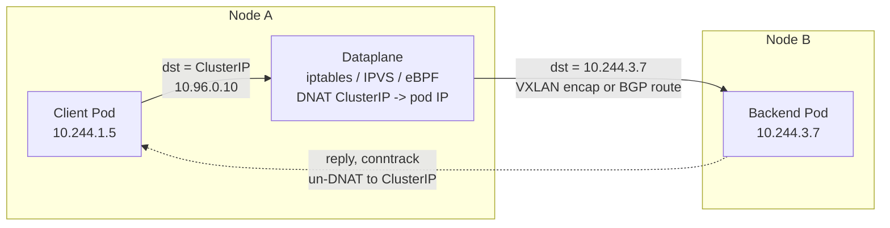

# Container & Overlay Networking — Interview

A tiered question bank, from mechanics up to staff-level judgment. Each answer is a self-contained paragraph you can speak in an interview.

1. How does a single container get a network interface?
2. Why does multi-host container networking need an overlay?
3. What is the CNI, and what does it actually do?
4. Explain VXLAN encapsulation: VNI, VTEP, and the overhead.
5. Why does VXLAN cause the classic MTU bug?
6. Overlay vs underlay/routed networking — when do you pick each?
7. How does a Calico BGP (routed) fabric move a packet without encapsulation?
8. Pod IP vs Service ClusterIP — what is the difference?
9. Trace a packet from a pod to a Service to a remote backend pod.
10. kube-proxy: iptables vs IPVS vs eBPF — what changes?
11. Why does eBPF/Cilium replace kube-proxy at scale?
12. Identity-based vs IP-based network policy — why does identity win?
13. How does a service mesh sidecar interact with the CNI dataplane?
14. Multi-cluster networking — what are the real options?
15. (Staff) How do you choose a CNI for a new platform?
16. (Staff) Debug an encapsulated-network black hole.

---

## Q1: How does a single container get a network interface?

The kernel gives each container its own **network namespace** (`netns`) — an isolated copy of the interfaces, routing table, and iptables/conntrack state, so `eth0` inside the container is unrelated to the host's `eth0`. Connectivity is provided by a **veth pair**: a virtual cable with two ends, one placed inside the container's namespace (appearing as `eth0`) and one left in the host namespace. The host end is plugged into a **Linux bridge** (e.g. `docker0` or `cni0`), which acts as a software L2 switch connecting all containers on that host. The container gets an IP from a per-host subnet, a default route pointing at the bridge, and outbound traffic to the outside world is NATed (SNAT/masquerade) to the host IP. That is the entire single-host story: namespace for isolation, veth for the wire, bridge for the switch, NAT for egress.

## Q2: Why does multi-host container networking need an overlay?

On one host the bridge handles everything, but the moment pods live on different hosts you have two problems. First, each host allocates pod IPs from its own subnet, and the physical network (the "underlay") has no idea those pod subnets exist — a packet destined for `10.244.3.7` would be dropped by the top-of-rack switch because that route was never advertised. Second, cloud fabrics and many datacenter networks won't route arbitrary pod CIDRs you invented. An **overlay** solves this by tunneling: the pod-to-pod packet is wrapped inside an outer packet addressed host-to-host, so the underlay only ever sees ordinary node IPs it already knows how to route. The alternative — a **routed** approach — is to make the underlay aware of pod routes (via BGP), avoiding tunnels entirely; that only works when you control the fabric.

## Q3: What is the CNI, and what does it actually do?

**CNI (Container Network Interface)** is a thin spec, not a product: a contract between the container runtime (kubelet/containerd) and a network plugin. When a pod is created, the runtime calls the plugin's `ADD` command, handing it the pod's netns path and a JSON config; the plugin is responsible for creating the veth, moving one end into the netns, assigning an IP (usually via an IPAM sub-plugin), setting up routes, and returning the result. On teardown it calls `DEL`. CNI deliberately does *nothing* about how packets cross hosts — that policy is the plugin's business. This is why "which CNI?" is a real architectural decision: Flannel gives you a simple VXLAN overlay, Calico gives you routed BGP plus policy, Cilium gives you eBPF-based routing, policy, and load-balancing. Same interface, radically different dataplanes.

## Q4: Explain VXLAN encapsulation: VNI, VTEP, and the overhead.

VXLAN (Virtual Extensible LAN) tunnels an L2 Ethernet frame inside a UDP packet so it can cross an L3 network. The original pod frame is prefixed with a **VXLAN header** carrying a 24-bit **VNI (VXLAN Network Identifier)** that segregates virtual networks, then wrapped in UDP, then in an outer IP/Ethernet header addressed node-to-node. The endpoint that does the wrapping and unwrapping is the **VTEP (VXLAN Tunnel Endpoint)** — in Kubernetes this is a `flannel.1` / `vxlan.calico` device on each node. The VTEP must map "destination pod → which node's VTEP" and rewrite the outer headers accordingly. The cost is a fixed **50 bytes of overhead** (8 VXLAN + 8 UDP + 20 outer IPv4 + 14 outer Ethernet), which is where the next question's pain comes from.

## Q5: Why does VXLAN cause the classic MTU bug?

Because that 50-byte header eats into your usable payload. If the node NIC MTU is the standard 1500 bytes, a VXLAN tunnel can only carry ~1450 bytes of inner payload — so the pod-facing interface must advertise an MTU of **1450**, not 1500. When operators forget, the failure is nasty and intermittent: small packets (SSH handshakes, health checks, DNS) work fine, so the cluster looks healthy, but large transfers hang — a big TCP segment gets encapsulated, exceeds the underlay MTU, and is either dropped or requires fragmentation that firewalls silently discard. The symptom is "TLS handshake completes but the response body never arrives" or "curl hangs on large files." Fixes: set the CNI MTU correctly (CNIs usually auto-detect and subtract 50), or enable **jumbo frames** (MTU 9000) on the underlay so the overhead is negligible.

## Q6: Overlay vs underlay/routed networking — when do you pick each?

| Dimension | Overlay (VXLAN/Geneve) | Routed / Underlay (BGP) |
|---|---|---|
| Encapsulation | Yes — 50B header per packet | None — native packets |
| Performance | Extra CPU for encap/decap, MTU loss | Line-rate, no MTU penalty |
| Fabric requirements | Works on *any* L3 network | Underlay must accept pod routes (BGP/ECMP) |
| Pod IP visibility | Pod IPs hidden from network | Pod IPs are real, routable, visible |
| Cloud portability | Runs anywhere, incl. across VPCs | Often blocked by cloud L3 (needs cloud-native mode) |
| Operational complexity | Simple to stand up | Requires network-team coordination |
| Debuggability | Harder — traffic is tunneled | Easier — packets are what they say |

Pick an **overlay** when you don't control the underlay or need to span heterogeneous/cloud networks quickly. Pick **routed** when you own the fabric, want maximum performance and observability, and can coordinate BGP peering — pod IPs become first-class citizens the physical network can see and firewall. Many teams start on an overlay for speed and migrate to routed once scale or performance demands it.

## Q7: How does a Calico BGP (routed) fabric move a packet without encapsulation?

Calico in BGP mode treats every node as a router. Each node runs a BGP speaker (BIRD, historically, or Calico's own) that **advertises the pod CIDR it owns** to its peers — either to other nodes in a full mesh, to route reflectors, or directly to the top-of-rack switches. Once those routes propagate, the underlay itself knows that `10.244.3.0/24` lives behind node B's IP, so a pod-to-pod packet is routed hop-by-hop as an ordinary IP packet with no wrapper. On the destination node, a `/32` route sends it straight into the target pod's veth. Because there's no tunnel, there's no MTU tax and no encap CPU, and you can point `tcpdump` at the wire and see real pod IPs. The trade-off is the BGP dependency: it needs the physical network (or a cloud that supports it) to accept those advertisements. Where it can't (crossing subnets/VPCs), Calico falls back to **IP-in-IP** or VXLAN encapsulation for just those routes.

## Q8: Pod IP vs Service ClusterIP — what is the difference?

A **pod IP** is a real, routable address assigned to a pod's interface; you can send packets to it directly, but it's ephemeral — reschedule the pod and the IP changes, so nothing should depend on it. A **Service ClusterIP** is a stable *virtual* IP that is never assigned to any interface at all; no pod, node, or NIC actually owns it. It exists only as a rule in every node's dataplane (iptables/IPVS/eBPF) that says "traffic to this ClusterIP:port should be DNAT'd to one of these healthy backend pod IPs." So a ClusterIP is a load-balancing abstraction with a DNS name, decoupling clients from the churning set of pod IPs behind it. Clients resolve the Service name to the ClusterIP via cluster DNS and never learn or care about individual pod IPs.

## Q9: Trace a packet from a pod to a Service to a remote backend pod.

The client pod resolves `svc.ns.svc.cluster.local` to a ClusterIP and sends a packet to it. That packet leaves the pod's veth and hits the **local node's dataplane**, where kube-proxy (or Cilium) has installed rules for that ClusterIP. The dataplane picks a healthy backend and **DNATs** the destination from ClusterIP to a real backend pod IP, recording the translation in the connection-tracking table. If the chosen backend is on a remote node, the now-pod-addressed packet is handed to the CNI, which either **encapsulates it (VXLAN)** or **routes it natively (BGP)** across to the target node. There it is delivered into the backend pod's veth. Return traffic follows conntrack in reverse: the reply's source is un-DNAT'd back to the ClusterIP so the client sees a coherent conversation. The load-balancing decision happens once, on the *source* node, before the packet ever leaves.

## Q10: kube-proxy — iptables vs IPVS vs eBPF, what changes?

All three implement the same abstraction (ClusterIP → backend DNAT) but with different data structures and cost. **iptables** mode expands every Service and endpoint into a long linear chain of rules; matching a packet walks the chain sequentially, so lookup is **O(n)** in the number of rules, and a config change requires rewriting and reloading large rule sets. **IPVS** mode uses the kernel's in-built L4 load balancer backed by **hash tables**, giving roughly **O(1)** lookups and real scheduling algorithms (round-robin, least-conn, etc.), which scales to tens of thousands of Services far better. **eBPF** mode (Cilium) skips kube-proxy's rules entirely, attaching programs at the socket or tc/XDP layer that do the Service lookup in an eBPF hash map — O(1), with less per-packet overhead and the ability to short-circuit load balancing at connect() time.

| Mode | Lookup cost | Backend data structure | Rule-update cost | Scale ceiling |
|---|---|---|---|---|
| iptables | O(n) linear scan | Sequential rule chains | Rewrite large chains | Poor (1000s of Services) |
| IPVS | O(1) hash | Kernel hash tables | Incremental | Good (10k+ Services) |
| eBPF (Cilium) | O(1) map lookup | eBPF hash maps | Map update, no reload | Best, kube-proxy-free |

## Q11: Why does eBPF/Cilium replace kube-proxy at scale?

The killer problem is iptables' **O(n)** behavior. In a large cluster with tens of thousands of Services and endpoints, kube-proxy generates enormous iptables rule sets; every endpoint change forces a re-computation and atomic reload of those chains, which can take seconds and stall — during which Service updates lag reality and packets traverse a linear rule chain. eBPF sidesteps this: Cilium installs Service state in **eBPF hash maps** with O(1) lookups, updates them incrementally (no full reload), and can enforce the load-balancing decision right at the socket layer so intra-node traffic never even builds a full packet path. The result is flatter latency, faster convergence on endpoint churn, and lower CPU — which is why "kube-proxy-free" (Cilium replacing kube-proxy outright) is now common at scale. It also unifies routing, policy, and load balancing in one dataplane instead of layering them on iptables and conntrack.

## Q12: Identity-based vs IP-based network policy — why does identity win?

Traditional firewalls filter on **IP addresses**, but in Kubernetes pod IPs are ephemeral and recycled constantly — a rule that allows `10.244.1.5` is meaningless the moment that pod dies and its IP is reassigned to something else. **Identity-based** policy (Cilium's model) instead derives a stable **security identity** from the pod's labels (e.g. `app=payments, env=prod`) and enforces rules against that identity, which the dataplane resolves to whatever IPs currently carry it. This is both correct under churn and dramatically more efficient: instead of rules-per-IP, you get rules-per-identity, and the identity count is far smaller and far more stable than the IP count. It also expresses intent the way humans think ("frontend may talk to backend"), survives rescheduling automatically, and can extend to L7 (allow `GET /api` but not `DELETE`) rather than being stuck at L3/L4.

## Q13: How does a service mesh sidecar interact with the CNI dataplane?

A mesh like Istio (Envoy sidecars) sits *above* the CNI, not instead of it — the CNI still gives the pod its IP and cross-node connectivity. What the mesh adds is **transparent traffic interception**: an init container (or a CNI plugin) installs iptables rules inside the pod's netns that redirect all inbound and outbound traffic to the local Envoy proxy, which then does mTLS, retries, and L7 routing before the packet leaves. So a pod-to-pod call now traverses two extra userspace hops (source Envoy → dest Envoy), which costs latency and CPU. This is exactly why **eBPF and ambient/sidecar-less meshes** are rising: eBPF can do the redirection in-kernel (avoiding the double iptables/conntrack pass), and ambient-mode meshes move L4 handling to a per-node proxy and only insert an L7 proxy when needed. The interview point: mesh and CNI are layered concerns — CNI owns connectivity, the mesh owns policy/identity/observability on top — and the interception mechanism (iptables vs eBPF) is where they collide on performance.

## Q14: Multi-cluster networking — what are the real options?

There are three broad patterns. **Flat/routable pod networks** (Cilium Cluster Mesh, Submariner) make pod and Service IPs directly reachable across clusters, typically by tunneling between clusters or peering their fabrics, so a pod in cluster A can call a pod in cluster B as if local — powerful but requires non-overlapping CIDRs and tight network coupling. **Gateway/east-west proxy** patterns (Istio multi-cluster, mesh gateways) don't flatten the network; instead each cluster exposes a gateway and cross-cluster calls hop through it with mTLS, which is more loosely coupled and firewall-friendly but adds a proxy hop and its own service-discovery federation. **Service-level exposure** (just expose the far Service via a LoadBalancer / DNS) is the simplest and most decoupled but loses pod-level policy and identity. The choice hinges on how much you need cross-cluster identity, policy, and low latency versus how much network coupling and CIDR coordination you can tolerate.

## Q15: (Staff) How do you choose a CNI for a new platform?

Start from constraints, not features. **What underlay do you control?** If you're on a cloud with no BGP and overlapping VPCs, an overlay (or the cloud-native CNI like AWS VPC CNI) may be forced; if you own the fabric, routed BGP buys performance and pod-IP visibility. **What scale and churn?** Large clusters with heavy endpoint turnover push you toward eBPF/Cilium to escape iptables' O(n) reload cliff. **What policy and identity needs?** If you need L7 policy, identity-based rules, and rich observability, Cilium is compelling; if you just need L3/L4 policy on a simple fabric, Calico is proven. **What's the operational reality?** Flannel is trivial to run but does nothing about policy; a routed BGP setup demands network-team partnership. **What integrates with the rest of the stack** — the mesh, the observability pipeline, the cloud LB? I'd weight portability and blast radius heavily: pick the dataplane whose failure modes your team can actually debug, benchmark it under realistic Service counts and MTU, and avoid coupling to anything you can't operate. The wrong answer is "the trendiest CNI"; the right answer names the two or three constraints that dominate and justifies the pick against them.

## Q16: (Staff) Debug an encapsulated-network black hole.

The signature of an overlay black hole is *selective* failure: DNS and small requests work, connections establish, but large payloads or specific pod-to-pod paths hang — classic **MTU / fragmentation**. My method is to bisect the packet path. First, does the pod resolve DNS and reach the Service ClusterIP? If small packets flow but large ones stall, suspect MTU: check the CNI-assigned pod MTU against the node NIC MTU minus the 50-byte VXLAN overhead, and test with `ping -M do -s <size>` to find the drop threshold. If nothing flows at all between two nodes, `tcpdump` the underlay on the sending node's VTEP interface — do you see encapsulated UDP (VXLAN port 8472/4789) leaving? Then capture on the receiving node — does it arrive, and is it decapsulated? A gap here points to a firewall/security-group blocking the VXLAN UDP port between nodes, a missing VTEP FDB/ARP entry, or asymmetric routing. Also check conntrack for dropped/invalid entries and verify the CNI agent is healthy on both nodes (a crashed agent stops programming routes). The discipline is: prove L3 reachability of the *node* IPs first, then the tunnel, then decap, then the inner delivery — and treat "works small, hangs big" as MTU until disproven.

---

*Next step:* [BGP & Internet Routing — Junior](../bgp-and-internet-routing/junior.md)
