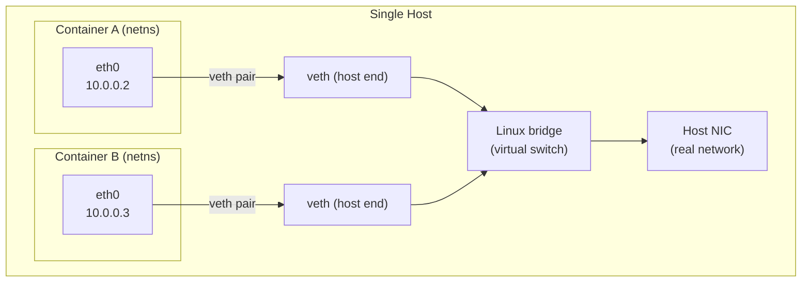
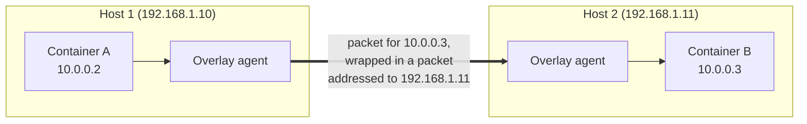

# Container & Overlay Networking — Junior

<!-- level-focus -->
At junior level, focus on this question:

> How can I apply **Container & Overlay Networking** in one small example and prove the result?

Use the smallest realistic scenario that exposes the decision and its failure behavior.
## 1. The problem: an isolated container has no network

Isolation is the whole point of a container, and it applies to the network too. When a container starts, it does **not** automatically share the host's network. By default it sees only a loopback interface (`lo`) — it can talk to itself and nothing else.

So we have three escalating problems to solve:

- **Inside one container:** give it an interface and an IP so it can send packets at all.
- **Same host:** let two containers on the same machine reach each other.
- **Across hosts:** let a container on machine A reach a container on machine B, even though they are on physically separate networks.

Each step builds on the one before it. We start with the Linux primitive that makes isolation possible.

---

## 2. Network namespaces: a private network per container

A **network namespace** is a Linux kernel feature that gives a process its own independent copy of the network stack: its own interfaces, its own IP addresses, its own routing table, and its own firewall rules. Two namespaces are invisible to each other unless you deliberately connect them.

Each container runs inside its own network namespace. That is why one container cannot see another container's IP `127.0.0.1` service, and why a container starts life with just a lonely loopback interface. The namespace is the "box." The rest of this topic is about drilling holes in the box in a controlled way.

---

## 3. veth pairs and the bridge: wiring one host

To connect the isolated namespace to the outside, Linux uses a **virtual ethernet (veth) pair**. A veth pair is like a virtual patch cable with two ends: whatever goes in one end comes out the other. One end lives **inside** the container's namespace (it appears as `eth0` in the container), and the other end lives in the **host's** namespace.

But a cable needs something to plug into. On the host we create a **Linux bridge** — a virtual switch. Every container's host-side veth end plugs into this bridge. Now all containers on that host share one virtual switch, so they can reach each other, and the bridge connects onward to the host's real network card for outside traffic.

Read the diagram as a chain: **container `eth0` → veth pair → host-side veth → bridge → host NIC**. Container A reaches Container B by sending a packet out its `eth0`, across the veth pair, onto the bridge, and back down the other veth into Container B. This is fast and simple because everything happens inside one machine.

---

## 4. Why multiple hosts is hard

The single-host picture breaks the moment your containers live on different machines. Suppose Container A (`10.0.0.2`) on Host 1 wants to reach Container B (`10.0.0.3`) on Host 2. Two things go wrong:

- **The bridges are not connected.** Host 1's bridge and Host 2's bridge are separate virtual switches with no cable between them. A packet for `10.0.0.3` has nowhere to go.
- **The real network does not know about container IPs.** The physical network routes traffic between *host* addresses (say `192.168.1.10` and `192.168.1.11`). It has never heard of `10.0.0.3`. To the physical routers, that address is meaningless.

We could try to manually configure routes on every host for every other host's container ranges, but that is fragile and does not scale as containers come and go. We need a general mechanism that makes containers on different hosts behave as if they were all on one big flat network.

---

## 5. Overlay networks: a flat virtual network on top of the real one

An **overlay network** is a virtual network built *on top of* the real physical network (the "underlay"). It creates the illusion that every container sits on one shared, flat network — regardless of which host it actually runs on.

The trick, in plain terms: when Container A sends a packet to Container B on another host, the overlay software on Host 1 wraps that packet inside another packet addressed to **Host 2** (a host-to-host address the real network *does* understand). The real network delivers it to Host 2, where the overlay software unwraps it and hands the original packet to Container B. This wrapping is called **encapsulation** — the deep details are the Middle tier's job; here just hold the idea that the container's packet rides *inside* a host-to-host packet.

From Container A's point of view, it simply sent a packet to `10.0.0.3` and it arrived — it never learns that the packet crossed a physical network in disguise. That transparency is exactly what makes overlays useful: application developers get one flat address space and stop caring where anything is scheduled.

---

## 6. Kubernetes: pod IPs, Services, and CNI

Kubernetes builds directly on these ideas and adds firm rules. Its networking model requires that **every pod gets its own unique IP address**, and that **any pod can reach any other pod by that IP without network address translation** — across all hosts in the cluster. In effect, Kubernetes mandates a flat pod network, which an overlay (or an equivalent routing setup) provides.

Two kinds of IP matter at this tier:

- **Pod IP** — belongs to a single pod. It is real and routable within the cluster, but it is **ephemeral**: when a pod is replaced (a crash, a redeploy, a scale event), the new pod gets a **different** IP. You cannot hard-code a pod IP anywhere.
- **Service IP** (a *ClusterIP*) — a **stable, virtual** address that fronts a group of pods. Clients connect to the Service IP, and Kubernetes forwards each connection to one of the healthy pods behind it. Pods come and go; the Service IP stays put. This is how one part of an app reliably reaches another.

**CNI (Container Network Interface)** is the standard plugin system that actually wires all this up. When Kubernetes creates a pod, it calls the configured CNI plugin, and the plugin does the low-level work: create the network namespace connection, set up the veth pair, assign the pod its IP, and program the routes or overlay so the pod can reach the rest of the cluster. Different plugins (for example Calico or Flannel) implement this differently — some use an overlay, some use plain routing — but they all speak the same CNI interface, so Kubernetes does not need to care which one you picked. See the CNI concept in the official docs at kubernetes.io.

---

## 7. Comparison tables

**Single-host bridge vs multi-host overlay**

| Aspect | Single-host bridge | Multi-host overlay |
| --- | --- | --- |
| Scope | Containers on one machine | Containers across many machines |
| Core mechanism | veth pair + Linux bridge | Encapsulation over the real network |
| Does the physical network see container IPs? | Not needed — traffic stays local | No — it only sees host-to-host packets |
| Setup complexity | Low | Higher (agents + encapsulation on every host) |
| Failure if a host goes down | Only that host's containers | Only that host's containers; others keep talking |

**Pod IP vs Service IP (ClusterIP)**

| Property | Pod IP | Service IP (ClusterIP) |
| --- | --- | --- |
| What it addresses | One specific pod | A group of pods behind a Service |
| Stability | Ephemeral — changes when the pod is recreated | Stable — outlives individual pods |
| Safe to hard-code? | No | Yes (or better, use the Service's DNS name) |
| Backed by real interface? | Yes (assigned by CNI) | No — it is a virtual address that forwards on |
| Typical use | Direct pod-to-pod traffic, debugging | The normal way one service reaches another |

---

## Apply it

1. Choose one small, known input for **Container & Overlay Networking**.
2. Predict the output or observable behavior.
3. Run the smallest example or probe that exercises the concept.
4. Change one input to trigger a failure or boundary case.
5. Explain the evidence using the guide's vocabulary.

## Verify your work

- Record the exact input, command or code path, and output.
- Repeat the probe and confirm the result is consistent.
- Show one expected success and one expected failure.
- Resolve any difference between the prediction and the evidence.

## Review questions

- What problem does Container & Overlay Networking solve in the example?
- Which input changes the observed result, and why?
- What is the smallest useful success check?
- Which beginner mistake would your evidence catch?
