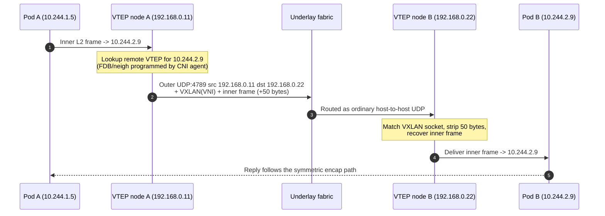
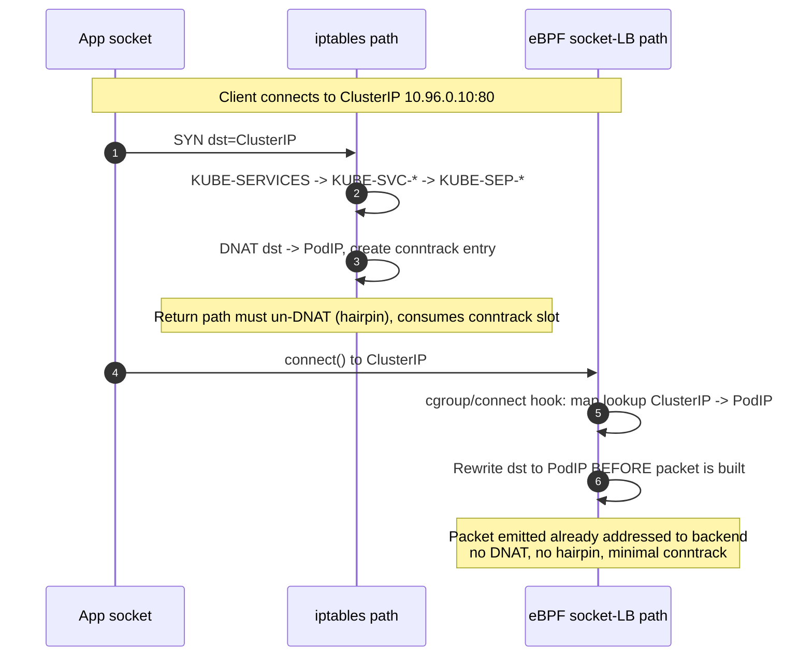

# Container & Overlay Networking — Professional

<!-- level-focus -->
At professional level, focus on this question:

> How should teams adopt and operate **Container & Overlay Networking** with measurable outcomes and limited coordination?

Use the smallest realistic scenario that exposes the decision and its failure behavior.
## 1. The Two Problems: Address Allocation and Reachability

Every container network solves two orthogonal problems, and confusing them is the root of most operational pain.

- **IPAM (IP Address Management):** each container (or Kubernetes Pod) must receive an IP address that is unique within its addressing domain. In Kubernetes the flat "every Pod gets a real IP, every Pod can reach every other Pod without NAT" model means the Pod CIDR must be partitioned across nodes without collision.
- **Reachability:** a packet destined for a Pod IP on another host must physically arrive there. The underlying physical network (the *underlay*) usually knows nothing about Pod CIDRs. Two families of answers exist:
  - **Overlay:** wrap the Pod-to-Pod packet inside an outer packet addressed host-to-host, so the underlay only ever routes host IPs it already understands. VXLAN, Geneve, and IP-in-IP are overlays.
  - **Native routing:** teach the underlay (or at least the top-of-rack switch) the Pod routes directly, typically via BGP, so no encapsulation is needed.

Overlays trade CPU and MTU for zero underlay cooperation; native routing trades a routing-protocol relationship with your network team for a flat, un-encapsulated, full-MTU datapath. The rest of this document is largely about the mechanics and costs of each choice.

---

## 2. VXLAN Frame Format and the 50-Byte Tax

VXLAN (Virtual eXtensible LAN, **RFC 7348**) tunnels an entire Ethernet L2 frame inside a UDP datagram. The original inner frame is left untouched; a stack of new headers is prepended.

The wire layout, outermost to innermost:

```
+-----------------------------------------------------------+
| Outer Ethernet header            (14 bytes, no 802.1Q)    |
+-----------------------------------------------------------+
| Outer IPv4 header                (20 bytes)               |
+-----------------------------------------------------------+
| Outer UDP header                 (8 bytes)                |
|   dst port = 4789 (IANA VXLAN)                            |
|   src port = hash(inner flow)  -> for underlay ECMP       |
+-----------------------------------------------------------+
| VXLAN header                     (8 bytes)                |
|   Flags (I bit set) | reserved                            |
|   VNI (24 bits) | reserved (8 bits)                       |
+-----------------------------------------------------------+
| Inner Ethernet frame  (the original L2 frame, unchanged) |
|   Inner IP / TCP / payload ...                            |
+-----------------------------------------------------------+
```

Key fields:

- **UDP destination port 4789** — the IANA-assigned VXLAN port. Encapsulating in UDP (rather than a new IP protocol number) is deliberate: middleboxes, NICs, and ECMP hashing all understand UDP.
- **UDP source port** — set to a hash of the *inner* flow's 5-tuple. The underlay's ECMP/LAG hashing sees only outer headers, so varying the source port is what lets many tunneled flows spread across multiple physical paths instead of pinning to one link.
- **VNI (VXLAN Network Identifier)** — 24 bits, giving ~16.7 million logical segments versus the 4094 usable VLAN IDs (12-bit 802.1Q). The VNI is the "which virtual network" label; the same physical fabric can carry millions of isolated L2 domains.
- The **I flag** must be set to mark the VNI valid; reserved fields are transmitted as zero.

**The 50-byte overhead** for IPv4 VXLAN:

| Header | Bytes |
|---|---|
| Outer Ethernet | 14 |
| Outer IPv4 | 20 |
| Outer UDP | 8 |
| VXLAN | 8 |
| **Total** | **50** |

Over IPv6 the outer IP header is 40 bytes, so the overhead is **70 bytes**. This tax is the single most important number in overlay operations, because it directly constrains MTU (see §4).

---

## 3. VTEP Encapsulation and Decapsulation

The endpoint that adds and strips VXLAN headers is a **VTEP** (VXLAN Tunnel Endpoint). In a Kubernetes overlay it is typically a virtual interface on each node (for example a Linux `vxlan` device named `flannel.1`, `vxlan.calico`, or `cilium_vxlan`), owning the node's underlay IP.

Encapsulation path (egress from a Pod on node A to a Pod on node B):

1. Pod A emits a normal L2 frame toward the Pod B MAC; it egresses via the veth into the node's bridge/routing layer.
2. The route table or bridge FDB directs the frame to the local VTEP.
3. The VTEP resolves **which remote VTEP** owns the destination Pod. This is the *control plane* question: the mapping of inner MAC/IP → remote VTEP underlay IP is populated either by a flood-and-learn multicast group (rare in k8s), or — far more commonly — programmed directly by the CNI agent from cluster state (the ARP/FDB/neigh tables are filled from Node objects, so there is no learning traffic).
4. The VTEP prepends the VXLAN + outer UDP/IP/Ethernet headers, source = node A underlay IP, destination = node B underlay IP, UDP src port = inner-flow hash, VNI = the network's identifier.
5. The now-ordinary UDP packet is handed to the normal host routing stack and traverses the underlay.

Decapsulation path on node B:

1. The packet arrives on node B's physical NIC addressed to node B's underlay IP, UDP dst port 4789.
2. The kernel matches the VXLAN socket, strips the 50 bytes, and recovers the original inner frame.
3. The inner frame is injected as if it had arrived on the local VTEP; normal bridging/routing delivers it into Pod B's veth.

The diagram below stages one encapsulated round-trip.



---

## 4. MTU Math and Fragmentation Hazards

The overlay's 50-byte overhead must come out of somewhere. The physical NIC has a fixed MTU (commonly 1500, or 9000 with jumbo frames). Whatever the underlay MTU is, the **inner** (Pod-facing) MTU must be reduced by the encapsulation overhead:

```
inner_MTU = underlay_MTU − encap_overhead
```

For VXLAN over a standard 1500-byte underlay:

```
1500 − 50 = 1450  (Pod MTU for IPv4 VXLAN)
1500 − 70 = 1430  (Pod MTU for IPv6 VXLAN)
```

If the Pod interface is left at 1500 while the underlay is 1500, a full-size Pod packet becomes a 1550-byte outer packet that **exceeds the underlay MTU**. What happens next is the classic overlay pathology:

- If the outer IP header has the **Don't Fragment** bit set (the common default), the first router that cannot forward it drops it and returns **ICMP "Fragmentation Needed"** (Path MTU Discovery). If that ICMP is filtered by a firewall — extremely common — the sender never learns, and you get a **PMTU black hole**: small packets and TCP handshakes succeed, but the first large data segment silently vanishes. The symptom is "connections hang after the SYN/ACK" or "curl works but large POST bodies stall."
- If DF is not set, the underlay router fragments, doubling packet counts and destroying performance.

The correct fix is to set the Pod/veth MTU to the computed inner value so TCP MSS is negotiated small enough. CNI plugins do this automatically, and many also enforce it via **MSS clamping** on the egress path. Jumbo frames (9000-byte underlay → 8950 Pod MTU) largely eliminate the tax as a throughput concern, at the cost of requiring end-to-end jumbo support in the physical fabric.

---

## 5. The CNI Specification, Precisely

The **Container Network Interface (CNI) spec** (a CNCF project) defines the contract between a container runtime (kubelet, containerd, CRI-O) and a network plugin. CNI is deliberately minimal: it is a set of executables invoked with JSON on stdin and environment variables, returning JSON on stdout.

**Operations.** A plugin is an executable that must implement:

- **ADD** — attach the container to the network: create the interface inside the container's network namespace, request an IP from IPAM, wire up routes, and return the resulting configuration.
- **DEL** — reverse ADD: release the IP and tear down interfaces. Must be idempotent (called on cleanup even if ADD partially failed).
- **CHECK** — verify that the network state established by a prior ADD still holds (interface present, IP still assigned). Used for reconciliation.
- **VERSION** — report supported spec versions.

**Invocation contract.** The runtime passes parameters via environment variables:

- `CNI_COMMAND` — `ADD`, `DEL`, `CHECK`, or `VERSION`.
- `CNI_CONTAINERID` — unique container ID.
- `CNI_NETNS` — a **network-namespace handle**, typically a filesystem path such as `/var/run/netns/cni-<uuid>` (a bind-mounted `nsfd`). The plugin does its interface creation *inside* this namespace.
- `CNI_IFNAME` — the interface name to create inside the container (e.g. `eth0`).
- `CNI_PATH` — directories to search for plugin binaries.

The **network configuration** (the "netconf" JSON) is piped to stdin: it names the plugin `type`, the network `name`, the CNI `cniVersion`, and plugin-specific fields.

**IPAM as a sub-plugin.** Address management is factored out. The netconf carries an `ipam` block with its own `type` (e.g. `host-local`, `dhcp`, or a CNI's built-in IPAM). The main plugin invokes the IPAM plugin, which returns an **IPAM result** — the allocated IPs, gateways, and routes — that the main plugin folds into its final result. This separation lets one L2/L3 plugin work with many allocation strategies.

**Chained plugins (conflist).** A `plugins` array (a "conflist") is executed in order, each plugin receiving the `prevResult` of the previous one on stdin and returning an augmented result. This composition is how, for example, a main CNI plugin sets up the interface, then a `bandwidth` plugin adds traffic shaping, then a `portmap` plugin installs hostPort DNAT rules — each a small, single-purpose binary.

**The result JSON.** On success a plugin prints a result containing `interfaces` (name, MAC, sandbox), `ips` (address, gateway, and which interface each belongs to), `routes`, and `dns`. Errors are returned as a structured JSON object with a numeric `code` and a human-readable `msg` — not merely a nonzero exit.

The elegance is that CNI knows nothing about VXLAN, BGP, or eBPF. Whether the plugin builds an overlay or peers BGP to the ToR is entirely opaque to kubelet; the contract is just "given this netns, make it networked, and tell me the result."

---

## 6. kube-proxy Datapaths: iptables vs IPVS vs eBPF

A Kubernetes `Service` is a stable virtual IP (ClusterIP) fronting a set of Pod endpoints that churn constantly. Something must translate `ClusterIP:port` into one of the live backend Pod IPs. Historically this is `kube-proxy`, and it has three datapath generations.

### iptables mode

`kube-proxy` programs the kernel's netfilter tables. A packet to a ClusterIP traverses a chain hierarchy: `KUBE-SERVICES` → a per-service `KUBE-SVC-*` chain → one of several per-endpoint `KUBE-SEP-*` chains, which performs the **DNAT** to a concrete Pod IP. Load balancing is achieved with the `statistic` module's `--mode random --probability` matches: the first endpoint jumps with probability 1/N, the next with 1/(N−1) of the remainder, and so on, yielding uniform selection.

The fatal property is **O(n) rule scaling**. Because netfilter evaluates rules sequentially, a Service with many endpoints — and a cluster with thousands of Services — produces tens of thousands of rules that must be linearly traversed and, worse, **reprogrammed as a monolithic table** on endpoint churn. Update latency grows with rule count; large clusters see multi-second control-plane stalls when Services change en masse.

### IPVS mode

IPVS (IP Virtual Server) is the Linux kernel's purpose-built L4 load balancer, built on netfilter but using **hash tables** rather than sequential rule lists. Service lookup is effectively **O(1)** regardless of Service count, and rule updates are incremental. IPVS also exposes **real load-balancing algorithms** — round-robin (`rr`), weighted round-robin (`wrr`), least-connection (`lc`), weighted least-connection (`wlc`), source hashing (`sh`), and more — instead of iptables' random-probability approximation. IPVS still relies on iptables for some peripheral cases (masquerade, packet filtering), so it does not fully escape netfilter, but it removes the O(n) service-lookup bottleneck.

### eBPF mode (Cilium replacing kube-proxy)

Cilium can **replace kube-proxy entirely** with an eBPF datapath. Instead of DNAT in the forwarding path, service translation happens at the **socket layer**: an eBPF program attached to the cgroup `connect()`/`sendmsg()` hooks rewrites the destination from ClusterIP to a chosen backend Pod IP *before the packet is ever built*. Consequences:

- **No DNAT hairpin.** Because the address is translated at `connect()` time, the packet is emitted already destined for the real backend — there is no per-packet DNAT and no return-path un-DNAT, avoiding conntrack for many local cases.
- **Per-endpoint eBPF maps.** Service→backend mappings live in eBPF hash maps keyed for O(1) lookup, updated incrementally, with none of iptables' full-table reprogramming.
- **Bypassing netfilter.** The datapath runs at tc/XDP hooks (§7), so packets can skip the entire iptables chain traversal.

### Comparison

| Dimension | iptables | IPVS | eBPF (Cilium) |
|---|---|---|---|
| Data structure | Sequential netfilter chains | Kernel hash tables | eBPF hash maps |
| Service lookup cost | O(n) linear scan | O(1) hash | O(1) map lookup |
| Rule/update on churn | Reprogram monolithic table | Incremental | Incremental map write |
| Load-balancing algo | Random probability only | rr, wrr, lc, wlc, sh, ... | Programmable (maglev, random, ...) |
| Where translation happens | DNAT in forwarding path | Virtual-server forwarding | Socket-layer `connect()` |
| DNAT hairpin / return NAT | Yes | Yes | Avoided for socket-LB path |
| Netfilter dependency | Entire datapath | Partial (masq/filter) | Can bypass entirely |
| Scaling ceiling | Thousands of rules → stalls | Tens of thousands of svcs OK | Highest; map-bound |

There is no universally correct choice: iptables is the most portable and battle-tested default; IPVS is the pragmatic upgrade for large service counts on stock kernels; the eBPF path offers the best scaling and lowest per-packet cost but couples you to a specific CNI (Cilium) and a modern kernel. See kubernetes.io for the supported `--proxy-mode` values and cilium.io for kube-proxy-replacement details.

---

## 7. The eBPF/XDP Datapath

eBPF lets you attach verified, JIT-compiled programs to kernel hook points, with **maps** (hash tables, arrays, LRU caches, LPM tries) as the shared state between programs and user space. For networking, two hook families matter.

- **tc (traffic control) hooks** — programs attached at the ingress/egress of a network device, after `sk_buff` allocation. This is where most CNI policy, service translation, and encapsulation logic runs, because the full `sk_buff` metadata is available.
- **XDP (eXpress Data Path) hooks** — programs that run at the **earliest possible point**, in the NIC driver's receive path (or even offloaded onto SmartNIC hardware), *before* an `sk_buff` is allocated. XDP verdicts include `XDP_DROP`, `XDP_PASS`, `XDP_TX` (reflect out the same NIC), and `XDP_REDIRECT`. Because it acts before the kernel builds any per-packet socket structure, XDP is the fastest place to drop DDoS floods or bounce load-balanced traffic.

**Bypassing netfilter.** The reason eBPF datapaths outrun iptables is not just algorithmic (maps vs chains) but architectural: an eBPF program at XDP or tc can make a full forwarding decision — lookup backend, rewrite headers, redirect — **without the packet ever entering the netfilter/conntrack machinery**. The expensive, sequential `KUBE-*` chain traversal simply does not happen.

The two service-resolution styles contrast sharply:



---

## 8. Conntrack Pressure

The kernel's connection tracker (`nf_conntrack`) records every flow it sees so that stateful NAT and return traffic can be matched. Every DNAT'd Service connection, every masqueraded egress, and every overlay flow can consume a conntrack entry.

The table has a hard maximum (`nf_conntrack_max`). Under high connection rates — think a service mesh sidecar fanning out, or a proxy handling many short-lived HTTP connections — the table fills. When it does, the kernel logs `nf_conntrack: table full, dropping packet`, and **new connections are silently dropped** while existing ones continue. The symptoms mimic random packet loss and are notoriously hard to diagnose.

Pressure is worsened by:

- **iptables/IPVS DNAT**, which requires a conntrack entry per Service flow, plus a matching reverse (un-DNAT) entry.
- **UDP overlays**, which create long-lived conntrack entries because UDP has no natural close.
- Short **TIME_WAIT/close** timeouts filling faster than they drain at high churn.

This is a direct argument for the eBPF socket-LB approach (§6, §7): by translating at `connect()` and avoiding DNAT/hairpin, it removes a large class of conntrack entries entirely, both reducing memory pressure and cutting per-packet CPU. When staying on netfilter, mitigation is to raise `nf_conntrack_max`, tune bucket sizes and timeouts, and avoid gratuitous masquerading (native routing needs none).

---

## 9. Encapsulation Alternatives and Native Routing

VXLAN is the default overlay, but it is not the only one, and overlays themselves are avoidable.

- **Geneve (Generic Network Virtualization Encapsulation)** — like VXLAN, a UDP-based L2-in-UDP tunnel, but with a **variable-length TLV options field** after the base header. This extensibility lets a control plane carry arbitrary metadata (security identity, policy tags) in-band with the packet, which is exactly why identity-aware datapaths (e.g. Cilium's Geneve mode, OVN) favor it. The cost is a slightly larger and variable header.
- **IP-in-IP (IPIP)** — the minimal L3 overlay: the inner IP packet is wrapped in an **outer IP header only** (protocol number 4), no UDP, no L2. Overhead is just 20 bytes. It is lighter than VXLAN but loses the UDP source-port entropy that VXLAN uses for underlay ECMP, so multipath spreading is weaker, and some clouds filter the IPIP protocol number.
- **Native routing (no encapsulation)** — the Pod CIDR is advertised to the physical network via **BGP peering to the top-of-rack switch**. Each node announces "my Pod subnet is reachable via me"; the ToR installs those routes, and Pod-to-Pod packets traverse the fabric **un-encapsulated at full MTU**, with zero encap CPU. This is Calico's BGP mode and Cilium's native-routing mode. The trade-off is operational: it requires the underlay to accept Pod routes (a relationship with the network team, an AS design, route-reflector topology at scale) and the fabric must have enough routing-table capacity for the Pod prefixes.

| Scheme | Outer headers | Overhead (IPv4) | Underlay ECMP entropy | Underlay must know Pod routes? |
|---|---|---|---|---|
| VXLAN (RFC 7348) | Eth + IP + UDP + VXLAN | 50 B | Good (UDP src-port hash) | No |
| Geneve | Eth + IP + UDP + Geneve(+TLVs) | ~50 B + options | Good (UDP src-port hash) | No |
| IP-in-IP | IP only | 20 B | Weak (no UDP entropy) | No |
| Native routing (BGP) | none | 0 B | Native (fabric ECMP on real flow) | Yes |

The decision is a straight line: if you cannot touch the underlay, use an overlay (VXLAN for ubiquity, Geneve for in-band metadata, IPIP for minimal overhead); if you can peer BGP to the fabric, native routing gives the fastest, full-MTU, lowest-CPU datapath.

---

## 10. Direct Server Return

**Direct Server Return (DSR)**, also called Direct Routing, is a load-balancing datapath optimization for the north-south (external client → cluster) path. In the ordinary path, both request and response traverse the load balancer: the LB DNATs the client's packet to a backend, and the backend's reply returns *through the LB* so it can un-DNAT and restore the LB's VIP as the source.

DSR breaks that symmetry. The load balancer forwards the request to the backend **without rewriting the source**, typically by encapsulating or MAC-rewriting so the destination is the backend while the original client IP is preserved. The backend then replies **directly to the client**, spoofing the VIP as its source address — the response never passes back through the load balancer.

Why this matters:

- **Asymmetric traffic:** responses (large payloads) usually dwarf requests (small). Removing the return path from the LB roughly halves — often far more than halves — the LB's bandwidth and CPU load, because it only ever sees the small request side.
- **Client IP preservation:** because the source IP is never NATed, the backend sees the true client address without needing `X-Forwarded-For` or PROXY protocol.
- **No return-path bottleneck / no conntrack on the reply direction at the LB.**

The cost is configuration rigor: backends must be told to accept and answer for the VIP (a loopback-bound VIP with ARP suppression, or IP/MAC-level tricks so the VIP does not leak into the fabric), and asymmetric routing must be permitted end to end. Modern eBPF datapaths implement DSR modes (for example Cilium's DSR option for external Service traffic) precisely to keep client IP and shed return-path load at scale.

---

## Apply it

1. Define the user or business outcome that **Container & Overlay Networking** should improve.
2. Assign one owner for code, contracts, operations, and incidents.
3. Split delivery into reversible increments that produce evidence early.
4. Publish responsibilities, escalation paths, and compatibility windows.
5. Stop or expand only when the agreed measures support that decision.

## Verify your work

- Each increment has an owner, rollback path, and observable exit condition.
- Adoption, reliability, delivery time, and coordination cost are measured.
- Incident and migration exercises prove that responsibility is executable.
- The old path is removed only after telemetry proves it is unused.

## Review questions

- Which measurable outcome justifies investing in Container & Overlay Networking?
- Which team owns the full lifecycle and incident response?
- What reversible increment produces the earliest useful evidence?
- Which exit condition proves that migration or adoption is complete?
