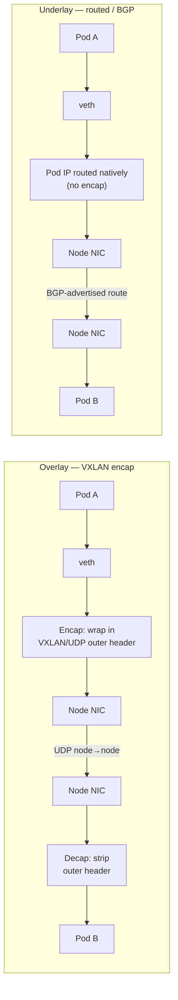
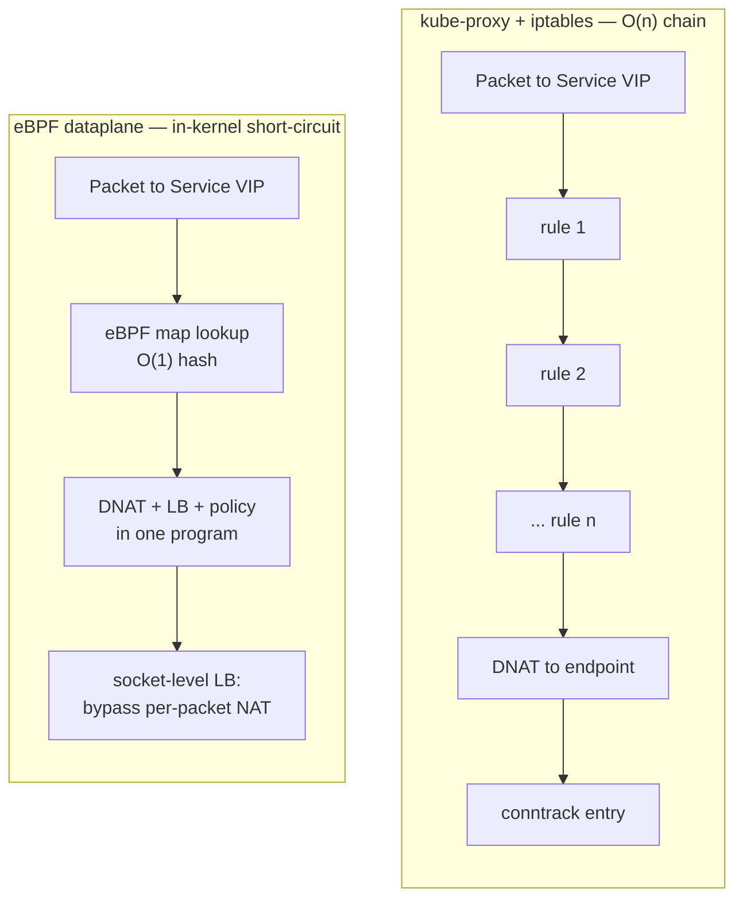

# Container & Overlay Networking — Senior

<!-- level-focus -->
At senior level, focus on this question:

> Which system invariant is affected by **Container & Overlay Networking** under failure, load, and change?

Use the smallest realistic scenario that exposes the decision and its failure behavior.
## 1. The core axis: overlay vs underlay

Every container network makes one foundational choice: does pod traffic ride *inside* another packet (overlay), or does the physical/cloud network route pod IPs *natively* (underlay/routed)?

**Overlay (encapsulated).** Pod packets are wrapped in an outer header — VXLAN (UDP/8472) or Geneve — and tunneled node-to-node. The underlying network only ever sees node-to-node UDP; it neither knows nor cares about pod IPs. This is why overlays are the "works anywhere" default: no coordination with the network team, no BGP peering, pod CIDRs can overlap the infra's IP space freely.

**Underlay / routed (native pod IPs).** Pod IPs are real, routable addresses in the fabric. Reachability comes from routing, not tunneling — typically BGP advertising each node's pod CIDR (Calico), or the cloud's own VPC routing handing each pod a real VPC IP (AWS VPC CNI, GKE native routing). No encap header, so the packet on the wire is the pod's actual packet.

The staged contrast: the overlay path pays an encap/decap step and carries an extra header on the wire; the underlay path is a straight route lookup but *demands* that the fabric knows how to route pod IPs.

| Dimension | Overlay (VXLAN/Geneve) | Underlay / routed (BGP, VPC-native) |
|---|---|---|
| Packet on the wire | Pod packet + 50B outer header | Native pod packet |
| Infra requirement | None — tunnels over any L3 | Fabric must route pod CIDRs (BGP peering or cloud VPC support) |
| Per-packet cost | Encap + decap CPU, extra header | Route lookup only |
| MTU impact | Effective MTU reduced ~50B | None |
| IP space | Pod CIDR can overlap infra | Pod IPs consume real fabric/VPC IPs |
| Observability from fabric | Sees only node-to-node UDP | Sees real pod IPs (better tracing/firewalling) |
| Typical failure mode | MTU black-holing, encap CPU | IP exhaustion, route-table/ARP scale limits |

**Senior framing.** Overlay trades a small, constant per-packet tax for zero infra coordination. Underlay trades infra coupling (BGP config, VPC IP budget) for wire-native performance and fabric-level visibility. On bare metal you weigh encap CPU against running BGP; in a cloud you weigh VPC IP exhaustion against the simplicity of native routing. There is no universally correct answer — there is a correct answer *for your fabric and scale*.

---

## 2. Encapsulation overhead and the MTU trap

The single most common production incident in overlay networking is not a routing bug — it is MTU. VXLAN adds roughly **50 bytes** of outer headers (outer Ethernet + IP + UDP + VXLAN). If nodes have a 1500-byte MTU and pods are also configured for 1500, then a full-size pod packet plus 50 bytes of encap is 1550 bytes — larger than the link can carry.

Two failure modes follow:

- **Fragmentation** — the packet is split, doubling packet count and hammering throughput, if fragmentation is even allowed.
- **Silent black-holing** — the far more insidious outcome. With `DF` (Don't Fragment) set and PMTUD broken (ICMP "fragmentation needed" dropped by a firewall or a cloud middlebox), oversized packets are dropped with no error surfaced to the application. Small packets (health checks, control-plane, `curl` of a small page) succeed; large transfers hang. The classic signature: "the TLS handshake works but the actual response stalls," or "small `GET`s are fine, large `POST`s time out."

The fix is to make the encap overhead explicit, not implicit:

- Set the **pod/CNI MTU** to the underlying MTU minus the encap overhead (e.g. 1500 − 50 = 1450 for VXLAN over a standard link).
- Or, where the fabric supports it, enable **jumbo frames** (9000 MTU) on the underlay so the ~50B tax is negligible.
- Never assume the default is right after a fabric change — a new NIC, a VPN leg, a cloud interconnect, or a nested-virtualization hop can each shave bytes off the real path MTU and reactivate the black hole.

Underlay/routed dataplanes sidestep this entirely: with no encap header, the pod MTU can equal the link MTU. This is a genuine, recurring operational advantage of going routed — one fewer footgun that pages you at 2 a.m.

---

## 3. Why eBPF dataplanes replace iptables/kube-proxy at scale

The traditional Kubernetes service dataplane is `kube-proxy` writing `iptables` (or `ipvs`) rules. It works, and at small scale it is invisible. At scale it becomes a bottleneck for structural reasons.

**The iptables problem.** `iptables` rules are evaluated as a **linear O(n) chain**. Every Service and every backend endpoint expands the rule set. With thousands of Services and tens of thousands of endpoints, the chain grows into the tens of thousands of rules, and:

- **Rule evaluation is sequential** — matching a packet may traverse a long chain.
- **Updates are not incremental** — historically `iptables` reloads rewrite and re-atomically-swap large tables, so a single endpoint change can force a costly full reprogram. As churn rises (rolling deploys, autoscaling), the control-plane latency to converge on the correct dataplane grows, and pods can briefly send traffic to stale endpoints.
- **Conntrack pressure** — the connection-tracking table (`nf_conntrack`) has finite capacity; high connection rates fill it and drop new connections (`nf_conntrack: table full`).

**Why eBPF wins.** An eBPF dataplane (Cilium is the reference implementation — see cilium.io) attaches programs at the socket, TC, and/or XDP hooks and does routing, load balancing, and policy **inside the kernel via hash-map lookups** rather than a linear rule chain:

- **Service load balancing is O(1)** — a map lookup, not a chain walk.
- **Updates are incremental** — a changed endpoint is a map update, not a table rewrite, so convergence stays cheap under churn.
- **Policy, NAT, and LB fuse** into the same in-kernel path rather than layering separate `iptables` chains.
- **Socket-level load balancing** can translate the destination once at `connect()` time, so per-packet NAT and much conntrack cost disappear for in-cluster traffic.
- It can run **kube-proxy-free**, removing that component and its rule-blowup entirely.

The trade-off eBPF asks for is a **modern kernel** and operational familiarity with a newer, deeper technology (harder to eyeball a `bpftool` map dump than `iptables -L`). But at large node/Service/endpoint counts, the O(n)→O(1) shift and incremental updates are not a micro-optimization — they are what keeps the dataplane converged.

---

## 4. Network policy: IP-based vs identity-based

Kubernetes `NetworkPolicy` is expressed in terms of pod selectors, but the *enforcement* can be implemented two very different ways, and the difference matters at scale.

**IP-based enforcement.** The controller resolves selectors to the current set of pod IPs and programs firewall rules against those IPs. The problem: pod IPs are ephemeral. Every scale event, reschedule, or rollout changes the IP set, forcing the policy to be re-resolved and re-programmed on every node. At high churn this is a lot of dataplane rewriting, and there is always a convergence window where an IP has been reused by a different workload but the rule hasn't caught up — a genuine correctness and security concern.

**Identity-based enforcement.** The dataplane assigns each workload a **security identity** derived from its labels, decoupled from its IP. Policy is expressed and enforced against identities; the IP→identity mapping is distributed separately. When a pod is rescheduled to a new IP, only the mapping updates — the policy rules referencing the identity do not churn. This scales far better under high pod turnover and closes the IP-reuse race. Cilium's model is the canonical example; it also enables **L7-aware policy** (e.g. allow only `GET /api/*` between two identities), which pure IP/port firewalling cannot express.

**Senior takeaway.** If your environment has heavy autoscaling, frequent deploys, or strict multi-tenant isolation requirements, identity-based policy is not a nicety — it is what makes policy enforcement stay correct and cheap under churn. If policy is light and workloads are stable, IP-based enforcement is perfectly adequate.

---

## 5. Service mesh dataplane interaction

A service mesh adds mTLS, L7 routing, and observability — and it necessarily interacts with (and sometimes duplicates) the CNI dataplane. The senior question is *who does what to the packet, and how many times*.

**Sidecar model (classic).** Each pod gets an injected proxy (e.g. Envoy). Traffic is redirected into the sidecar (traditionally via `iptables` redirect inside the pod netns), which terminates and originates mTLS and does L7 routing. Costs: a proxy container per pod (memory + CPU multiplied by pod count), added latency from the extra hops (app → local sidecar → remote sidecar → app), and the `iptables` redirect interacting with whatever the CNI is doing.

**Ambient / sidecar-less model.** mTLS and L4 handling move to a **per-node** component, with L7 processing handled by a shared proxy only when needed, rather than one proxy per pod. This cuts the per-pod overhead and the injection complexity. When the mesh and the CNI share an eBPF dataplane, the redirection into the mesh can happen in-kernel rather than via per-pod `iptables`, avoiding double-NAT and reducing hops.

**The interaction to reason about:**

- **Who terminates mTLS** — sidecar, node agent, or an eBPF-integrated path? This determines where the crypto CPU lands and how many proxy hops a request takes.
- **Encap-on-encap** — a mesh's mTLS running over an overlay's VXLAN means two layers of wrapping; re-examine MTU and per-packet CPU under that combination.
- **Policy ownership** — if both the CNI (L3/L4 identity policy) and the mesh (L7 policy + mTLS) enforce, define clearly which layer owns which decision to avoid gaps or contradictory rules.

There is real value in the CNI and mesh sharing one dataplane: fewer redirections, one identity model, and consistent observability rather than two overlapping telemetry stacks.

---

## 6. Multi-cluster and cross-cloud networking

Single-cluster pod networking is table stakes; senior design usually spans clusters and clouds.

Key decisions:

- **Pod CIDR non-overlap.** For clusters to route to each other's pods directly, their pod CIDRs must not collide. Overlapping CIDRs force SNAT/gateway translation at the boundary and break direct pod-to-pod addressing. Plan the global address scheme *before* the second cluster exists.
- **Connectivity substrate.** Options range from direct routed reachability (VPC peering, transit gateway, BGP between clusters) to encapsulated cluster-mesh tunnels that connect pod networks across otherwise-isolated fabrics. Cross-cloud usually means a tunneled/encrypted mesh because you cannot assume shared L3.
- **Encryption in transit.** Across cloud or datacenter boundaries you generally want the pod traffic encrypted — either the CNI's transparent encryption (WireGuard/IPsec) or the mesh's mTLS. Decide which owns it; running both wastes CPU.
- **Cross-cluster service discovery and failover.** How does a Service in cluster A reach or fail over to backends in cluster B? Global service abstractions (cluster-mesh global services, or multi-cluster Service APIs) let a Service load-balance across clusters — but they add another convergence and health-signal path to reason about.
- **Latency and locality.** East-west across regions/clouds is expensive and slow. Prefer topology-aware routing that keeps traffic local and only spills cross-cluster on failure, not by default.

---

## 7. Choosing a CNI

The three archetypes cover most real decisions:

| Attribute | Calico | Cilium | Cloud VPC CNI (e.g. AWS VPC CNI) |
|---|---|---|---|
| Primary dataplane | iptables/eBPF; BGP routing | eBPF (kube-proxy-free) | Cloud ENI / native VPC routing |
| Default mode | Routed (BGP) or VXLAN/IPIP overlay | Routed or VXLAN/Geneve overlay | Native VPC IPs (no overlay) |
| Encap overhead | None if routed; ~50B if overlay | None if routed; ~50B if overlay | None (native) |
| Policy model | Kubernetes + Calico policy (L3/L4, some L7) | Identity-based, L3–L7, DNS-aware | Delegates to security groups / basic policy |
| Service LB at scale | iptables/ipvs or eBPF | eBPF O(1), kube-proxy-free | kube-proxy (unless paired) |
| Observability | Flow logs | Deep (Hubble flow visibility, L7) | Cloud-native (VPC flow logs) |
| Best fit | On-prem/bare-metal with BGP fabric; policy-heavy | Large scale, eBPF, mesh integration, deep L7 observability | Managed cloud, want native VPC IPs & security-group integration |
| Main watch-out | BGP operational burden | Kernel version, learning curve | **VPC IP exhaustion**, ENI-per-node limits |

**How to actually decide:**

- **Bare metal / on-prem with a routable fabric and a network team comfortable with BGP** → Calico in routed mode gives native pod IPs and no encap tax.
- **Large scale, want kube-proxy-free O(1) LB, identity-based + L7 policy, and mesh/observability integration** → Cilium; you are paying with a modern-kernel requirement and eBPF operational depth.
- **Managed cloud where you want pods as first-class VPC citizens** (security groups, VPC flow logs, load-balancer integration) → the cloud VPC CNI; but budget your VPC IP space carefully — the classic failure is **pod IP / ENI exhaustion** starving the cluster of schedulable capacity.

The meta-point: the CNI choice is downstream of your *fabric* (routable or not), your *scale* (does iptables blow up), your *policy* requirements (IP vs identity, L4 vs L7), and your *IP budget*. Pick the fabric constraint first.

---

## 8. East-west scale and observability

At scale, east-west (pod-to-pod, service-to-service) traffic dwarfs north-south, and it is where the dataplane choices above pay off or bite.

- **LB efficiency dominates** — every east-west call hits the service dataplane. O(n) iptables chains multiply that cost across the whole cluster; O(1) eBPF LB keeps it flat. This is the single biggest scale lever.
- **Conntrack is a shared, finite resource** — high east-west connection rates (short-lived RPCs, retries, health checks) fill `nf_conntrack`. Socket-level LB and connection reuse (keep-alive, HTTP/2, mesh pooling) reduce pressure; monitor conntrack utilization as a first-class metric.
- **Observability without a proxy tax** — traditionally, L7 visibility meant a sidecar on every hop. eBPF-based flow observability (e.g. Cilium's Hubble) exposes L3–L7 flows, drops, and policy verdicts from the kernel path without per-pod proxies, so you can answer "which identity talked to which, and what did policy do" at scale without doubling your footprint.
- **Policy verdict visibility** — at scale, a dropped connection is often a policy misconfiguration, not a network fault. A dataplane that surfaces *why* a packet was allowed or denied (identity, rule, L7 verb) turns hours of tcpdump into a single query. Treat this as a design requirement, not an afterthought.

The through-line: at east-west scale, the dataplane's **algorithmic complexity, conntrack behavior, and built-in observability** are the properties that decide whether the network stays healthy and debuggable — which is exactly why the eBPF-vs-iptables and identity-vs-IP decisions from earlier sections converge here.

---

## 9. Decision checklist

- **Is my fabric routable for pod IPs?** If yes and IP budget allows → prefer underlay/routed (no encap, no MTU trap, fabric-native visibility). If no → overlay, and set MTU explicitly.
- **Did I subtract encap overhead from MTU?** ~50B for VXLAN. Verify large transfers, not just small requests. Consider jumbo frames.
- **Will iptables blow up at my Service/endpoint/churn levels?** If yes → eBPF, kube-proxy-free.
- **Is policy heavy and churn high?** → identity-based enforcement over IP-based.
- **Do I run a mesh?** Define who terminates mTLS, count the proxy hops, and re-check MTU for encap-on-encap. Prefer a shared dataplane where possible.
- **Multi-cluster/cross-cloud?** Non-overlapping CIDRs up front; pick one owner for cross-boundary encryption; keep traffic local by default.
- **Can I see policy verdicts and flows at scale** without a per-pod proxy tax?

*Next step:* [Container & Overlay Networking — Professional](professional.md)

---

## Apply it

1. State the system invariant that **Container & Overlay Networking** must protect.
2. Mark ownership, state, and failure propagation at each boundary.
3. Compare two designs under load, dependency failure, and future change.
4. Define recovery and compatibility behavior before implementation.
5. Test the riskiest assumption with a focused experiment.

## Verify your work

- The experiment supports the design with evidence, not preference.
- Failure injection shows the blast radius and recovery path.
- Compatibility checks cover old and new callers or data.
- Operational signals reveal invariant violations and recovery progress.

## Review questions

- Which invariant must remain true when Container & Overlay Networking fails?
- Where should recovery responsibility live, and why?
- Which assumption deserves an experiment before implementation?
- How can the design evolve without changing every consumer at once?
