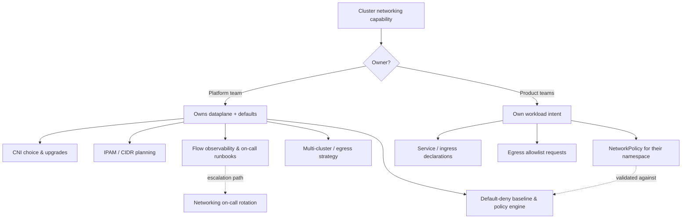
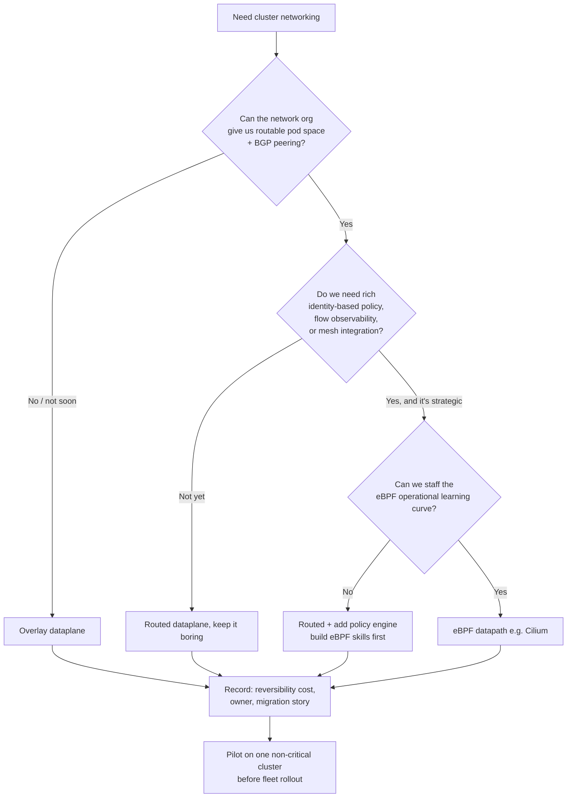

# Container & Overlay Networking — Staff

Cluster networking is not a feature you ship; it is a substrate everything else runs on. The dataplane you pick — an overlay, a routed fabric, an eBPF datapath — becomes a load-bearing wall. Swapping it later means re-plumbing every pod, every network policy, every observability hook, and often coordinating a maintenance window across teams that never think about packets. This tier is about the *judgment* of owning that substrate: who decides, what the decision costs over years, and how you frame a cluster-wide-blast-radius technology to leadership that only hears about it when it breaks.

---

## Contents

1. [The commitment: dataplane as a long-lived platform decision](#1-the-commitment)
2. [Platform-owned networking vs team choice](#2-platform-owned-vs-team-choice)
3. [The complexity budget: overlay simplicity vs routed clarity](#3-the-complexity-budget)
4. [CNI / dataplane selection as a staged decision](#4-cni-dataplane-selection)
5. [Security posture: identity-based policy as a zero-trust lever](#5-security-posture)
6. [Multi-cluster / multi-cloud strategy and cost](#6-multi-cluster-and-cost)
7. [Debuggability and the on-call burden of encapsulation](#7-debuggability-and-on-call)
8. [When to adopt eBPF (Cilium) vs stay with defaults](#8-when-to-adopt-ebpf)
9. [Framing to leadership](#9-framing-to-leadership)
10. [Staff signals and anti-patterns](#10-staff-signals)

---

## 1. The commitment: dataplane as a long-lived platform decision {#1-the-commitment}

Most infrastructure choices are reversible on a quarter's notice. The CNI is not. Three properties make it sticky:

- **Everything binds to it.** Network policy enforcement, service load-balancing, IPAM, egress gateways, and increasingly your observability (flow logs, service maps) and your service mesh all consume the dataplane's model. A migration touches all of them at once.
- **The failure mode is cluster-wide.** A bad application deploy blasts one service. A bad dataplane change can partition every pod on every node simultaneously. The blast radius is the whole cluster, sometimes the whole fleet if you roll it uniformly.
- **The knowledge is scarce.** Very few engineers can debug an encapsulated packet drop across an MTU boundary. That scarcity means the decision quietly picks *which* on-call skills your org must grow and retain for years.

The staff move is to treat the CNI choice with the same gravity as a database engine choice: written decision record, explicit reversibility cost, named owner, and a deprecation/migration story you could actually execute if you had to. If nobody can answer "how would we move off this in two years," you have made a permanent decision by accident.

---

## 2. Platform-owned networking vs team choice {#2-platform-owned-vs-team-choice}

The first organizational fork: does the platform team own cluster networking as a capability, or does each product team pick and run its own?

For anything past a handful of clusters, the answer is **platform-owned**. Networking has strong negative economies of fragmentation: three teams running three CNIs means three sets of failure modes, three on-call playbooks, three security-policy models to audit, and no shared muscle for the 2 a.m. MTU black hole. It also means no consistent identity model to build zero-trust on top of.

The responsibility split below is the target operating model — a paved road, not a police state.

The line to hold: **the platform owns the mechanism and the defaults; teams own their intent expressed within guardrails.** A product team should be able to say "my service talks to Postgres and the payments API" without knowing whether that runs over VXLAN or BGP. If they *have* to know, the abstraction has leaked and you have quietly re-federated ownership.

| Dimension | Platform-owned | Team-by-team choice |
|---|---|---|
| Failure-mode surface | One model, deep expertise | N models, shallow everywhere |
| On-call | Central rotation, real runbooks | Each team debugs packets alone |
| Security policy | Uniform default-deny, auditable | Inconsistent, gaps between teams |
| Upgrade coordination | Planned, staged fleet-wide | Ad hoc, drift accumulates |
| Fits when | >~5 clusters, shared compliance | Isolated experiments, org can't staff a platform team |

Team-choice is defensible only at genuinely small scale or for a truly isolated blast-radius (a research cluster). At org scale it is how you end up with a networking outage that no single team can own.

---

## 3. The complexity budget: overlay simplicity vs routed clarity {#3-the-complexity-budget}

Every dataplane spends your complexity budget somewhere. The core trade is *bootstrap simplicity* versus *operational clarity*, and they pull in opposite directions.

**Overlays** (VXLAN / Geneve / IP-in-IP encapsulation) are simple to stand up: they run on top of whatever the underlying network already does, so they need nothing from the network org. Pods get an address space that floats above the physical topology. The cost is deferred and lands on your on-call: encapsulated packets are opaque to the physical network's tooling, MTU math is subtle (the encap header eats bytes, and a misconfigured MTU produces intermittent "large payloads hang, small ones work" black holes that are notoriously hard to diagnose), and every hop adds encapsulation/decapsulation overhead.

**Routed / BGP** dataplanes advertise pod networks as real routes into the physical fabric. Packets on the wire are just packets — your existing network observability, firewalls, and traceroute all work. The cost is upfront and *organizational*: you need the network team to allocate routable address space, accept BGP peering, and coordinate CIDR planning. That cooperation is often the real blocker, not the technology.

| Signal | Lean overlay | Lean routed / BGP |
|---|---|---|
| Network org cooperation | Unavailable / slow | Available and willing to peer |
| Routable IP space | Scarce / can't get pod CIDRs on the fabric | Ample, can allocate real routes |
| Team maturity on packet debugging | Low | Have or will build the skill |
| Underlay you don't control (some managed/multi-cloud) | Common — overlay abstracts it | Harder to arrange |
| Priority | Ship the cluster this quarter | Long-term debuggability & throughput |
| Who pays the cost | On-call, later | Network org, now |

The staff framing: an overlay borrows against your future on-call budget to buy speed now. That can be exactly right for an early platform — but name the debt out loud, and revisit it before the fleet is large enough that the MTU black hole is a fleet-wide incident rather than a curiosity.

---

## 4. CNI / dataplane selection as a staged decision {#4-cni-dataplane-selection}

Don't pick a CNI from a feature matrix. Stage the decision by the constraints that are hardest to change, gating on the organizational reality first.

Two disciplines make this staff-grade rather than an architecture-astronaut exercise:

- **Gate on the org constraint first.** Whether the network team will peer BGP is a harder fact to change than any software feature. Decide against reality, not against a wishlist.
- **Pilot before fleet.** Never roll a new dataplane uniformly across the fleet — that is the definition of correlated blast radius. Prove it on one non-critical cluster, build the runbook, then stage.

---

## 5. Security posture: identity-based policy as a zero-trust lever {#5-security-posture}

The dataplane is where zero-trust network segmentation actually gets enforced, so its policy model is a security decision, not just a plumbing one.

The weak model is IP/CIDR-based rules. In a cluster where pods are ephemeral and IPs churn constantly, CIDR rules are brittle, over-broad, and lie about intent — an allow-rule for a pod's current IP means nothing once that pod reschedules. The strong model is **identity-based policy**: rules expressed against workload identity (labels/service accounts/identities) rather than addresses, so "payments may talk to ledger" stays true no matter where either pod lands.

This is the lever that turns a flat pod network into a segmented one. A flat network means any compromised pod can reach every other pod — the blast radius of a single container escape is the entire cluster. A **default-deny baseline** with explicit, identity-scoped allows shrinks that to only the paths teams have declared. Owning the default-deny posture is a platform responsibility precisely because no product team will opt into it unilaterally; it has to be the paved road's floor.

The staff judgment is to treat network policy as a product with a rollout, not a flag you flip. Default-deny applied blindly is an instant self-inflicted outage. The path is: observe real flows first, generate candidate policies from observed traffic, run in a warn/audit mode, then enforce — with the platform owning the baseline and teams owning their namespace's allows within it.

---

## 6. Multi-cluster / multi-cloud strategy and cost {#6-multi-cluster-and-cost}

The moment you have more than one cluster, networking becomes a strategy question with a line item on the cloud bill.

Two forces to weigh explicitly:

- **Topology cost.** Cross-AZ and especially cross-region / egress traffic is billed and adds latency. A naively "flat" multi-cluster mesh where any pod freely reaches any other pod across zones will quietly generate a large cross-AZ transfer bill and a wide failure-coupling surface. The cheaper and more resilient default is *locality-aware* routing: keep traffic in-zone when possible, cross zones only deliberately.
- **Connectivity model.** Options range from independent clusters with explicit gateways between them, to cluster meshes with shared identity and cross-cluster service discovery, to multi-cloud fabrics. More integration buys developer convenience and failover; it costs coupling, a bigger blast radius, and more egress.

| Concern | Cheaper / lower-coupling | More integrated |
|---|---|---|
| Cross-AZ / egress cost | Locality-aware, minimize crossings | Flat mesh leaks $ across zones |
| Blast radius | Clusters fail independently | Shared fabric couples failures |
| Dev experience | Explicit gateways, more friction | Transparent cross-cluster services |
| Identity | Per-cluster | Shared identity across clusters |

The staff framing to a finance-aware leadership: multi-cluster networking is a place where an architecture default silently sets a recurring cost. Make the cross-zone traffic policy a deliberate decision with a dollar figure attached, not an emergent property of a flat network.

---

## 7. Debuggability and the on-call burden of encapsulation {#7-debuggability-and-on-call}

The most under-priced cost of an overlay is what it does to incident response. When packets are encapsulated:

- Physical-network tooling sees encap traffic, not your pod traffic — `traceroute`, firewall logs, and mirror/capture points are all looking at the wrong layer.
- The classic failure — the **MTU black hole** — is maximally cruel: small packets pass, large ones vanish, so health checks are green while real payloads intermittently hang. This burns hours and demands exactly the scarce skill from §1.
- Adding a layer adds a place for things to break: the encap path, the underlay, and the interaction between them.

The organizational consequence is that an overlay raises the *floor* of expertise your on-call rotation must maintain, forever. That is a staffing commitment, not a one-time setup. Two things de-risk it:

- **Invest in flow observability up front**, not after the first bad incident. A service map / flow-log capability that decodes the overlay turns "packets vanish somewhere" into "policy X on node Y dropped it." An eBPF datapath tends to make this dramatically better (see §8), which is often its strongest justification.
- **Write and drill the runbooks** (MTU verification, policy-drop diagnosis, IPAM exhaustion) *before* you need them, and keep them in the platform team, not scattered per product team.

The judgment: if you choose an overlay, you have implicitly signed up to staff and train a networking on-call capability. Budget for that explicitly, or the debuggability cost shows up as burnout and long MTTR instead of a line in a plan.

---

## 8. When to adopt eBPF (Cilium) vs stay with defaults {#8-when-to-adopt-ebpf}

eBPF-based dataplanes (Cilium being the prominent one) are attractive for real reasons: identity-based policy at L3–L7, high-performance datapath that can bypass slower legacy paths, and — most valuably at staff scale — deep flow observability and service maps that directly attack the debuggability problem in §7.

The counter-weight is a genuine operational learning curve. An eBPF datapath is more powerful *and* more novel; debugging it requires understanding a programmable kernel datapath, which is a different (and rarer) skill than reading iptables rules. Adopting it is itself a §1-scale commitment.

The honest decision rule:

- **Stay with the boring default** when your needs are basic connectivity plus simple policy, the team is small, and you have no compelling observability or L7-policy driver. Boring is a feature; the default is well-trodden and the on-call knowledge is common.
- **Adopt eBPF** when identity-aware policy, L7 visibility, or flow observability is *strategic* — e.g. you are building zero-trust segmentation (§5) or drowning in the encapsulated-debugging problem (§7) — **and** you can fund the learning curve, ideally piloted on one cluster first.

The anti-pattern is adopting eBPF for résumé/novelty reasons on a platform whose actual need is "pods can talk and we have a few policies." That spends the §1 commitment budget on capability you don't use, and lands the learning-curve cost on an unprepared on-call.

---

## 9. Framing to leadership {#9-framing-to-leadership}

Leadership does not want a CNI tutorial. It wants to understand risk, cost, and reversibility. Translate:

- **Blast radius, in their language.** "A networking change can take down every service in the cluster at once — unlike an app deploy, which affects one service. That's why we pilot, stage, and never roll it fleet-wide in one shot." This justifies the seemingly slow rollout discipline before an incident forces the conversation.
- **The commitment framing.** "This is a database-class decision: hard to reverse, everything binds to it. We're recording the reversibility cost and owner now so it isn't a permanent choice made by accident." This gets you the time to decide well.
- **Cost as a knob, not a surprise.** "Cross-zone pod traffic has a dollar cost. We're setting a deliberate locality policy so it doesn't grow silently." (§6) Finance-literate framing buys goodwill.
- **On-call as a staffing ask.** "An overlay is faster to launch but requires us to maintain a scarce packet-debugging skill on rotation. Here's what staffing that costs, versus buying operational clarity with a routed fabric that needs the network team's cooperation." (§3, §7)

The through-line: present networking decisions as **risk and reversibility trade-offs with named owners and dollar figures**, not as technology preferences. That is what earns a staff engineer the mandate to own the substrate.

---

## 10. Staff signals and anti-patterns {#10-staff-signals}

**Signals of staff-grade judgment**

- Treats the CNI/dataplane as a database-class, hard-to-reverse commitment with a written decision record, named owner, and an actual migration story.
- Holds the platform-owns-mechanism / teams-own-intent line, and keeps the dataplane an abstraction teams don't have to know about.
- Names the complexity-budget trade out loud: overlay borrows against future on-call; routed borrows the network org's cooperation now.
- Gates the dataplane decision on the organizational constraint (will the network team peer?) before the feature matrix.
- Owns default-deny identity-based policy as a paved-road floor, rolled out via observe → audit → enforce.
- Budgets multi-cluster cross-zone traffic as a deliberate, priced decision.
- Adopts eBPF for a strategic observability/policy driver with a funded learning curve and a pilot — not for novelty.
- Frames the whole thing to leadership as blast radius, reversibility, and cost.

**Anti-patterns**

- Letting every team pick its own CNI at fleet scale, then having no one able to own a cluster-wide networking outage.
- Choosing an overlay for speed without ever naming or revisiting the on-call debt, until the MTU black hole becomes a fleet-wide incident.
- Rolling a new dataplane uniformly across the fleet with no pilot — manufacturing correlated blast radius.
- Flipping default-deny on blindly and self-inflicting an outage instead of staging it from observed flows.
- Flat multi-cluster meshes that silently run up cross-AZ egress bills and couple failures across zones.
- Adopting eBPF for résumé reasons on a platform that only needs basic connectivity.
- Presenting networking to leadership as a technology preference, so the org only learns it's load-bearing during the outage.

---

*Next step:* [Container & Overlay Networking — Interview](interview.md)
