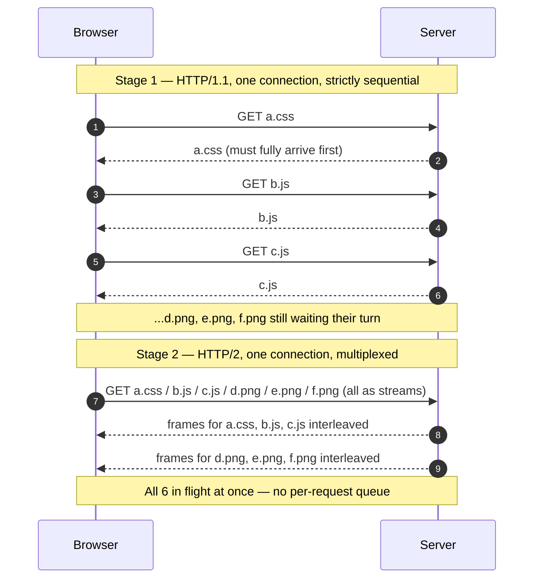

# HTTP Evolution (1.1 / 2 / 3 / QUIC) — Junior

<!-- level-focus -->
At junior level, focus on this question:

> How can I apply **HTTP Evolution (1.1 / 2 / 3 / QUIC)** in one small example and prove the result?

Use the smallest realistic scenario that exposes the decision and its failure behavior.
## 1. What HTTP actually is

HTTP is a **request/response** protocol. The browser sends a *request* ("please give me `/index.html`") and the server sends back a *response* (the file, plus some metadata). That metadata — the content type, the length, caching rules, cookies — travels in **headers**, which are just labeled lines of text that come before the actual body of the message.

A single modern web page is almost never *one* request. Loading, say, a news article's homepage might pull down:

- 1 HTML document
- 5 CSS stylesheets
- 20 JavaScript files
- 40 images
- a handful of fonts

That is easily **60–100 separate requests** for one page. So the interesting question is never "how fast is one request?" — it is "how fast can the browser get through *all* of them?" Every version of HTTP is really an answer to that second question.

One more thing to hold in your head: HTTP does not move bytes across the internet by itself. It sits **on top of** a *transport protocol* that handles the actual delivery. For decades that transport was **TCP**. Remember that word — the biggest jump in this story (HTTP/3) is really a change of transport, not a change of HTTP's ideas.

## 2. HTTP/1.1: the text protocol we grew up on

HTTP/1.1 arrived in 1997 and quietly ran most of the web for the next twenty years. Two things define it.

**It is plain text.** A request literally looks like human-readable lines:

- `GET /styles/main.css HTTP/1.1`
- `Host: example.com`
- `User-Agent: Mozilla/5.0 ...`
- `Accept: text/css`

This was great for humans and for debugging — you could read it, type it by hand, log it. But text is verbose, and those headers get repeated on *every single request*. If you send 80 requests to the same site, you re-send nearly the same `User-Agent`, `Accept`, and cookie lines 80 times. That is wasted bandwidth.

**It reuses connections with keep-alive.** Opening a fresh TCP connection is not free — it takes a back-and-forth "handshake" before any data flows, plus more back-and-forth if the site uses HTTPS. HTTP/1.0 opened a new connection for every request and closed it right after, paying that setup cost over and over. HTTP/1.1 fixed the worst of this with **keep-alive**: after a response finishes, the connection stays open and the next request reuses it. That saved a huge amount of handshaking.

But keep-alive has a strict rule: **one request at a time, per connection.** You send a request, you wait for the whole response to come back, *then* you send the next one. The connection is a single-lane road, and cars go through one behind the other.

## 3. The queue problem (head-of-line blocking)

That "one at a time" rule is the central weakness of HTTP/1.1. It creates a queue, and the industry name for the queue's pain is **head-of-line blocking**: if the request at the *front* of the line is slow, everything *behind* it just waits, even if those later responses are tiny and ready to go.

Imagine the checkout line at a store with a single cashier. If the person at the front has a full cart and a coupon dispute, the ten people behind them with one item each are stuck. Their items aren't the problem — the *ordering* is.

The web's answer in the HTTP/1.1 era was a workaround: **open more connections.** If one connection is a single-lane road, open six of them and you have six lanes. Browsers settled on roughly **6 parallel connections per hostname**. This helped, but it is a blunt tool:

- Six lanes still means only six things download at once. Our 60-request page still queues badly.
- Each connection pays its own handshake setup cost.
- Each connection re-sends those repeated headers independently.
- Sites started sharding assets across `img1.example.com`, `img2.example.com`, etc. just to unlock *more* browser connection limits — an ugly hack that added its own DNS and setup overhead.

So by the mid-2010s the picture was clear: HTTP/1.1 forced a choice between waiting in one long queue or juggling a pile of expensive, wasteful parallel connections. Neither is good. That is the exact pain HTTP/2 was designed to remove.

## 4. HTTP/2: one connection, many requests at once

HTTP/2 (standardized 2015, built on Google's earlier "SPDY" experiment) keeps HTTP's *meaning* identical — same `GET`, same headers, same status codes — but completely changes *how the bytes are packaged and sent*. Three ideas do the heavy lifting.

**Binary framing.** Instead of sending requests as lines of text, HTTP/2 chops every message into small, labeled binary chunks called **frames**. Each frame carries a **stream ID** — a tag saying which request or response it belongs to. This sounds like a technical detail, but it is the foundation for everything else: once every chunk is labeled, the browser and server can interleave chunks from many different requests on one wire and still sort them back out correctly.

**Multiplexing.** This is the headline feature. Because every frame is labeled with a stream ID, HTTP/2 sends **many requests and responses at the same time over a single connection**. Request #1's chunks and request #5's chunks can be interleaved on the wire; the receiver reassembles each stream by its ID. The single-lane road became a multi-lane highway *without opening a second connection*. No more 6-connection limit, no more domain sharding hacks.

**Header compression (HPACK).** Remember those bulky headers re-sent on every request? HTTP/2 compresses them and, crucially, remembers headers it has already seen. If your `User-Agent` and cookies are identical to the last request, HTTP/2 sends a tiny reference instead of the whole thing. On a page with dozens of requests, this alone saves a meaningful chunk of bytes.

There are a couple more perks worth naming briefly: **stream prioritization** lets the browser hint that the CSS needed to render the page matters more than a footer image, and **server push** allowed a server to send files it knew you'd need before you asked (this feature was later deprecated because it was hard to use well — don't lean on it).

The net effect: **one connection, one handshake, dozens of requests flowing in parallel, smaller headers.** For a typical asset-heavy page, HTTP/2 is a clear win over HTTP/1.1.

## 5. Staged picture: 6 assets, HTTP/1.1 vs HTTP/2

Let's make multiplexing concrete. Say a page needs 6 assets (`a.css`, `b.js`, `c.js`, `d.png`, `e.png`, `f.png`) and, to keep the picture simple, we're looking at a **single connection**.

Under **HTTP/1.1**, that one connection handles the 6 assets strictly in order — request one, wait for the full response, then the next. Under **HTTP/2**, the same single connection carries all 6 as interleaved streams that arrive together.

**How to read this:** In Stage 1, each response must fully arrive before the next request goes out — six sequential trips. (Real HTTP/1.1 browsers soften this by opening ~6 connections, but that just means six separate single-lane queues, not true sharing.) In Stage 2, the browser fires all six requests immediately and the server streams their frames back interleaved on the *same* connection. Slow assets no longer block fast ones sitting behind them in a single application-level queue.

## 6. The problem HTTP/2 could not fix

HTTP/2 solved head-of-line blocking **at the HTTP layer** — no more application-level queue. But there is a *lower* layer, and the queue moved down into it.

Recall that HTTP/2 still runs on **TCP**. And TCP has its own rule: it delivers bytes **in exact order, with no gaps**. If packet #37 gets lost on the network, TCP will *hold back* packets #38, #39, #40 — even if they've already arrived — until #37 is re-sent and fills the gap. TCP hands data to the application only as a perfect, in-order stream.

Now combine that with multiplexing. HTTP/2 put *all* your streams onto one TCP connection. So if a single packet is lost, TCP stalls the entire connection — and **every** multiplexed stream freezes, even the ones whose data already made it across intact.

This is **TCP head-of-line blocking**, and it is sneaky: HTTP/2 removed the queue you could see (in the application) but inherited a queue you can't (in the transport). On a clean, fast network you'll never notice. On a flaky mobile connection with packet loss, HTTP/2 can actually behave *worse* than six independent HTTP/1.1 connections — because with six connections, a lost packet only stalls one of them, while the other five keep flowing.

The root cause isn't HTTP/2's design. It's that **TCP doesn't know about streams.** TCP sees one undifferentiated byte stream and enforces order on the whole thing. To truly fix this, you'd have to teach the transport about independent streams — or replace the transport. That's exactly what HTTP/3 does.

## 7. HTTP/3 and QUIC: leaving TCP behind

HTTP/3 (standardized 2022) makes the boldest move in the whole story: it stops using TCP. Instead it runs on a new transport protocol called **QUIC**, which itself is built on top of **UDP**.

Why UDP? UDP is the internet's "just send this packet, no promises" transport. It has no built-in ordering and no built-in reliability — which sounds worse, but it's the point. UDP is a *blank slate*. QUIC uses that blank slate to build a **smarter** reliability layer than TCP's, one that understands streams. Here's what QUIC brings:

**Stream-aware transport (the real fix).** QUIC knows about independent streams and delivers each one on its own. If a packet carrying stream #4's data is lost, QUIC re-sends it — but streams #1, #2, and #3 keep flowing, unblocked. A lost packet only stalls the *one* stream it belonged to, not the whole connection. This is the head-of-line-blocking cure that HTTP/2 couldn't reach, because now the transport itself understands the streams.

**Faster connection setup.** With traditional HTTPS-over-TCP, you pay for a TCP handshake *and then* a TLS (encryption) handshake — two separate round trips before any real data moves. QUIC **merges the transport and encryption handshakes into one**, so a new connection is ready in a single round trip. And for a server you've talked to before, QUIC supports **0-RTT** — sending useful data in the very first packet, with essentially no setup wait. On high-latency connections (mobile, distant servers) this is a big, visible speed-up.

**Always encrypted.** QUIC has TLS 1.3 encryption baked in as a mandatory part of the protocol — there is no unencrypted QUIC. Security isn't a layer bolted on top; it's part of the transport itself.

**Connection migration.** Because QUIC identifies a connection by an ID rather than by the exact IP-address-and-port combo TCP uses, your session can survive a network change. Walk out of Wi-Fi range onto cellular, and your download can continue on the same QUIC connection instead of dropping and restarting. TCP cannot do this — change networks and its connection is dead.

One honest caveat: because QUIC rides on UDP and moves a lot of logic into user space, some of its cost lands on the CPU rather than the network, and older firewalls occasionally block or throttle UDP. In practice the major browsers and CDNs have made HTTP/3 the default for a large share of the modern web, so these rough edges are mostly smoothed over — but it's why HTTP/3 didn't simply replace HTTP/2 overnight.

## 8. Side-by-side comparison

| Aspect | HTTP/1.1 (1997) | HTTP/2 (2015) | HTTP/3 (2022) |
|---|---|---|---|
| Transport | TCP | TCP | **QUIC over UDP** |
| Message format | Plain text | Binary frames | Binary frames |
| Requests per connection | One at a time (queued) | Many, multiplexed | Many, multiplexed |
| Typical connections/page | ~6 per hostname | 1 | 1 |
| Header handling | Full text, repeated every request | Compressed (HPACK) | Compressed (QPACK) |
| Application-layer HOL blocking | Yes (the queue) | **Fixed** | Fixed |
| Transport-layer HOL blocking | Present but 6 separate queues | **Yes — one lost packet stalls all streams** | **Fixed — loss only stalls its own stream** |
| Connection setup | TCP + TLS (multiple round trips) | TCP + TLS (multiple round trips) | **Merged handshake, 1-RTT; 0-RTT on resume** |
| Encryption | Optional (HTTPS added separately) | Effectively required by browsers | **Mandatory (TLS 1.3 built in)** |
| Survives network change | No | No | **Yes (connection migration)** |
| Best case | Simple / few requests | Fast, clean networks | Lossy / mobile / high-latency networks |

A useful way to remember the arc: **HTTP/2 fixed the queue you could see; HTTP/3 fixed the queue you couldn't.**

## 9. Why each step happened

Each version was a response to a specific, concrete pain — not change for its own sake.

**HTTP/1.0 → 1.1 happened because handshakes were wasteful.** Opening and closing a connection per request meant paying setup costs constantly. Keep-alive let one connection serve many requests. *Problem solved: repeated connection overhead. Problem left behind: one-at-a-time queuing per connection.*

**HTTP/1.1 → 2 happened because pages exploded in size.** A page with 80 assets on a one-lane connection is agony, and the "open 6 connections + shard your domains" workaround was wasteful and fragile. Multiplexing let one connection carry everything in parallel, and header compression cut the repeated-metadata tax. *Problem solved: the application-layer queue and the connection-count hacks. Problem left behind: TCP still stalls all streams on any packet loss.*

**HTTP/2 → 3 happened because TCP was the wrong foundation for multiplexing.** Putting many streams on one TCP connection meant one lost packet froze all of them, hurting exactly the flaky mobile networks that were becoming the majority of traffic. Also, stacking TCP and TLS handshakes made every new connection slow to start. QUIC replaced the transport entirely: stream-aware delivery kills transport HOL blocking, a merged handshake cuts setup time, and connection migration survives network switches. *Problem solved: transport HOL blocking and slow setup. Cost accepted: more CPU work and occasional UDP-unfriendly middleboxes.*

Notice the pattern: **each fix reveals the next bottleneck.** Speed up the application layer and the transport becomes the limit. Fix the transport and CPU/deployment become the concerns. This is normal and healthy — you can only see the next problem clearly once the current one is gone.

## 10. Key takeaways

- **HTTP is a request/response protocol, and real pages make dozens of requests.** Every HTTP version is an answer to "how fast can we get through *all* the requests?"
- **HTTP/1.1 is text-based, reuses connections with keep-alive, but sends one request at a time per connection** — creating an application-layer queue (head-of-line blocking). Browsers worked around it with ~6 parallel connections, which is wasteful.
- **HTTP/2 introduced binary framing, multiplexing, and header compression.** Many requests share one connection in parallel, killing the application-layer queue and the need for connection-sharding hacks.
- **HTTP/2's hidden flaw is TCP.** TCP delivers bytes in strict order, so a single lost packet stalls *every* multiplexed stream — the queue moved down into the transport where HTTP/2 couldn't fix it.
- **HTTP/3 switches to QUIC (over UDP)**, a stream-aware transport that stalls only the affected stream on packet loss, merges the connection + encryption handshakes for faster setup (with 0-RTT resumption), is always encrypted, and can survive network changes via connection migration.
- **Mental model:** HTTP/1.1 = single-lane road with a queue. HTTP/2 = multi-lane highway on one connection, but the whole highway freezes on a pothole (packet loss). HTTP/3 = independent lanes that keep moving even when one hits a pothole.
- **Each version solved the previous one's biggest pain and exposed the next.** That's the throughline of the whole evolution.

*Next step:* [Middle level](middle.md)

---

## Apply it

1. Choose one small, known input for **HTTP Evolution (1.1 / 2 / 3 / QUIC)**.
2. Predict the output or observable behavior.
3. Run the smallest example or probe that exercises the concept.
4. Change one input to trigger a failure or boundary case.
5. Explain the evidence using the guide's vocabulary.

## Verify your work

- Record the exact input, command or code path, and output.
- Repeat the probe and confirm the result is consistent.
- Show one expected success and one expected failure.
- Resolve any difference between the prediction and the evidence.

## Review questions

- What problem does HTTP Evolution (1.1 / 2 / 3 / QUIC) solve in the example?
- Which input changes the observed result, and why?
- What is the smallest useful success check?
- Which beginner mistake would your evidence catch?
