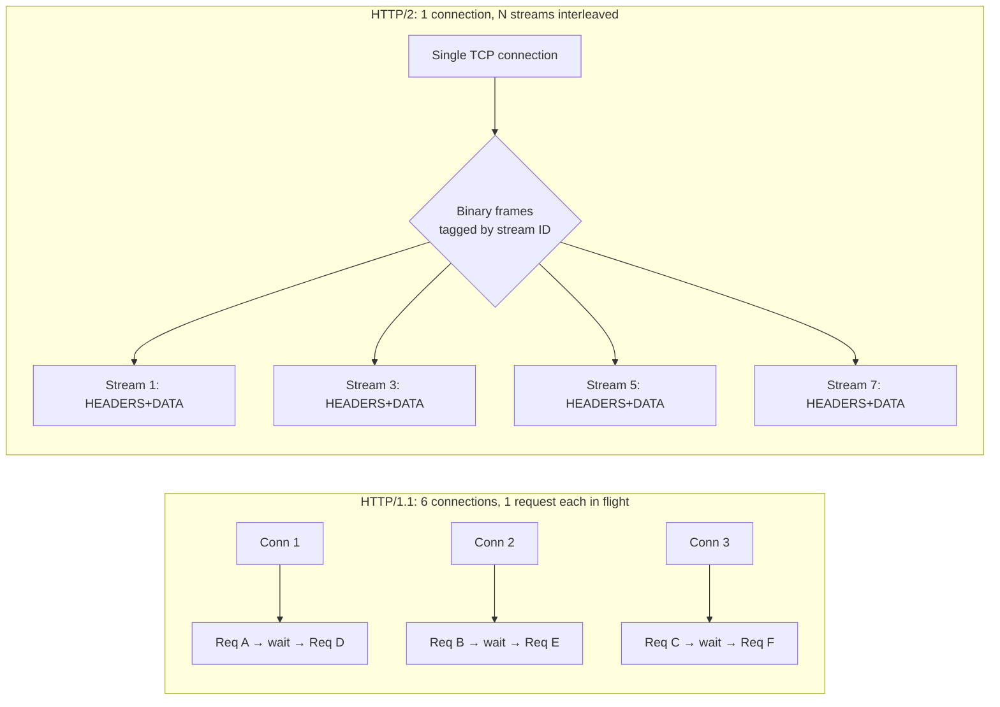
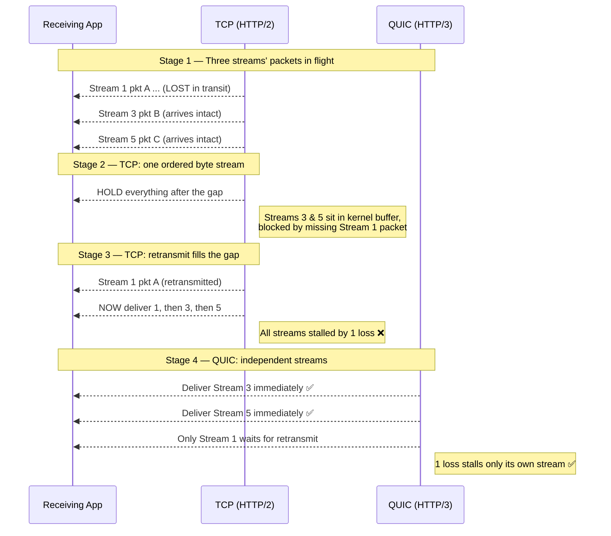

# HTTP Evolution (1.1 / 2 / 3 / QUIC) — Middle

<!-- level-focus -->
At middle level, focus on this question:

> Where does **HTTP Evolution (1.1 / 2 / 3 / QUIC)** belong in a maintainable component, and which trade-off selects the design?

Use the smallest realistic scenario that exposes the decision and its failure behavior.
## 1. The constant vs. the transport

Before diving into versions, fix one mental model: **HTTP semantics are separate from HTTP transport.** A `GET /users/42` with an `Authorization` header returning `200 OK` and a JSON body is identical in intent across HTTP/1.1, /2, and /3. What differs is how that request/response is *serialized and delivered* over the network.

- **HTTP/1.1** serializes requests as human-readable ASCII text over one TCP connection.
- **HTTP/2** serializes the same semantics into binary *frames* multiplexed over one TCP connection.
- **HTTP/3** serializes into binary frames over *QUIC*, a new transport built on UDP.

Because the semantics are stable, migrating versions is mostly an infrastructure concern (load balancers, CDNs, TLS termination) rather than an application-code rewrite. Your handlers rarely change. This is why the evolution is best understood as three answers to one question: *how do we push more concurrent request/response pairs through a connection without them interfering with each other?*

---

## 2. HTTP/1.1 and its limits

HTTP/1.1 (1997) introduced **persistent connections** (`Connection: keep-alive`) so a TCP connection could be reused across requests instead of reopening for every asset. That was a huge win over HTTP/1.0. But it carried one structural limitation that defines everything after it.

**One in-flight request per connection.** On a single HTTP/1.1 connection, request 2 cannot be sent until response 1 has fully arrived. Requests are strictly serialized: request, wait for full response, next request. This is fine for a single document but terrible for a modern page that pulls dozens of CSS, JS, image, and font files.

HTTP/1.1 did specify **pipelining** — sending request 2 before response 1 returns — but responses must still come back *in request order*. If request 1 is a slow database query, requests 2–10 sit behind it even though they're ready. This is **application-level head-of-line (HOL) blocking**: a slow response blocks everything queued behind it. Pipelining was so buggy across proxies and servers that browsers disabled it. In practice, pipelining is dead.

So HTTP/1.1's effective concurrency per connection is **one**. The only lever left is opening *more connections*.

**Browsers open ~6 connections per origin.** To parallelize, browsers open a small pool — historically capped at around 6 connections per origin (`scheme://host:port`). Six connections means at most six requests in flight to one origin at a time. Every connection costs a TCP handshake (1 RTT) plus a TLS handshake (1–2 RTTs), and each maintains its own congestion-control state that has to warm up independently. On a page needing 80 resources from one origin, the browser processes them roughly six at a time, and the tail latency is dominated by the slowest requests in each wave.

---

## 3. The workarounds we shipped for HTTP/1.1

Because the ~6-connection cap was the hard ceiling, the industry built an entire performance culture around *tricking* the browser into more parallelism and fewer requests. These are worth knowing because HTTP/2 makes most of them counterproductive.

- **Domain sharding.** Serve assets from multiple hostnames (`static1.example.com`, `static2.example.com`, `static3.example.com`) that all resolve to the same servers. Since the ~6-connection limit is *per origin*, three shards gave you ~18 parallel connections. The cost: extra DNS lookups and extra TCP+TLS handshakes, each with cold congestion windows.
- **Spriting.** Combine many small images into one big "sprite sheet" and use CSS `background-position` to show slices. One request instead of fifty.
- **Concatenation and bundling.** Merge all JS into one file and all CSS into one file. Fewer requests, at the cost of cache granularity — change one line and the whole bundle is invalidated.
- **Inlining.** Embed small assets directly in HTML (base64 data URIs, inline `<style>`/`<script>`). Saves a round trip but the inlined bytes can't be cached separately.

Every one of these trades cacheability, complexity, or wasted bytes for fewer round trips. They exist *only* because HTTP/1.1 makes requests expensive. Under HTTP/2, sharding actively hurts (it splits multiplexing across connections and fragments congestion control), and bundling/spriting give diminishing returns. A common HTTP/2 migration mistake is leaving these hacks in place.

---

## 4. HTTP/2: binary framing and streams

HTTP/2 (2015, standardized as RFC 7540) keeps one TCP connection but changes what flows over it. Instead of text, HTTP/2 defines a **binary framing layer**. Every message is chopped into frames, and frames are the atomic unit of the connection.

Key concepts:

- **Frame** — the smallest unit. Each frame has a type (`HEADERS`, `DATA`, `SETTINGS`, `WINDOW_UPDATE`, `RST_STREAM`, `PING`, etc.), a length, flags, and a **stream identifier**.
- **Stream** — a bidirectional, independent sequence of frames within the connection, identified by an integer. A single request/response pair lives on one stream.
- **Multiplexing** — because every frame is tagged with its stream ID, frames from many streams can be **interleaved** on the wire. The receiver reassembles each stream from its tagged frames.

This is the headline feature: **many requests share one connection concurrently.** Request 1's `DATA` frames and request 2's `HEADERS` frames can be interleaved arbitrarily. There is no request-order requirement — response 5 can finish before response 2. This dissolves the *application-level* HOL blocking of HTTP/1.1 and eliminates the need for the ~6-connection pool. One connection now carries hundreds of concurrent streams.

Concretely, on a page with 80 assets, HTTP/2 fetches them over a *single* connection, all streams in flight at once, with one warmed-up congestion window shared across everything. The domain-sharding and bundling hacks become obsolete or harmful.

---

## 5. HPACK: header compression

HTTP request headers are surprisingly heavy. Cookies, `User-Agent`, `Accept`, `Authorization`, and custom headers can total 500–1500 bytes *per request*, and they repeat almost identically across every request to the same origin. In HTTP/1.1 these bytes were sent uncompressed, in full, every time.

HTTP/2 introduces **HPACK** (RFC 7541), a header-specific compression scheme:

- **Static table** — a fixed, predefined table of ~61 common header name/value pairs (e.g., `:method: GET`, `:status: 200`, `accept-encoding: gzip, deflate`). Instead of sending the literal, the sender sends a small index.
- **Dynamic table** — headers seen on the connection are added to a per-connection table on both ends. The next time the same header appears, only its index is sent, not the full text.
- **Huffman coding** — literal values that aren't in a table are Huffman-encoded to shrink them further.

The effect: after the first request, repeated headers cost a byte or two instead of hundreds. On header-heavy APIs (large cookies, JWT auth), HPACK often reduces total header bytes by 80–90%.

HPACK was deliberately designed to resist the **CRIME** attack (a compression side-channel that leaked secrets in HTTP/2's predecessor SPDY): it avoids compressing attacker-controlled data against secret data in a way that reveals length. HTTP/3 uses a variant called **QPACK**, redesigned so that header compression doesn't itself reintroduce head-of-line blocking across QUIC's independent streams.

---

## 6. Server push and prioritization

**Server push** let a server proactively send resources the client hadn't yet requested. The idea: when the browser asks for `index.html`, the server already knows it will need `style.css` and `app.js`, so it *pushes* them in the same round trip using `PUSH_PROMISE` frames — no waiting for the client to parse the HTML and request them.

In practice, server push **failed and is effectively deprecated.** Chrome removed support in 2022, and most stacks disabled it. The reasons:

- **Over-pushing.** Servers routinely pushed resources the client already had cached, wasting bandwidth on bytes the client would have `304`'d or skipped entirely.
- **Cache awareness.** The server couldn't reliably know the client's cache state, so it guessed — and guessed wrong.
- **Complexity for marginal gain.** The prioritization and cancellation logic was hard to get right.

The problem push tried to solve — telling the client "you'll need this next" — is now addressed more cheaply by **`103 Early Hints`** and `<link rel="preload">`, which *hint* to the client to request the resource itself (respecting its own cache) rather than blindly shipping bytes.

**Prioritization** addresses a different question: when many streams compete for one connection's bandwidth, which frames go first? You want the critical CSS and above-the-fold JS to arrive before a footer image. HTTP/2 shipped a complex tree-based priority scheme (dependencies and weights) that servers implemented inconsistently and often ignored. HTTP/3 replaced it with a far simpler scheme (RFC 9218): an **urgency** level (0–7) plus an **incremental** flag, expressed via the `Priority` header. Simpler, and actually deployable.

---

## 7. The remaining weakness: TCP head-of-line blocking

HTTP/2 eliminated *application-level* HOL blocking — but only moved the problem down a layer. HTTP/2 runs over TCP, and **TCP delivers a single, strictly-ordered byte stream.** TCP has no idea that this byte stream carries many independent HTTP/2 streams; to TCP it's all one sequence of bytes.

Here's the failure mode. Frames from streams 1, 3, and 5 are interleaved on the wire. Suppose a single packet carrying part of stream 1's data is **lost**. TCP guarantees in-order delivery, so it *holds back every byte that arrives after the gap* — including the perfectly intact frames belonging to streams 3 and 5 — until the lost packet is retransmitted and the gap is filled. The application never sees streams 3 and 5's data, even though it's sitting in the kernel's receive buffer, ready.

So a single lost packet stalls *all* multiplexed streams. This is **TCP-level (transport-level) head-of-line blocking.** On a clean, low-loss network it's invisible. On a lossy or high-latency network — mobile, congested Wi-Fi, cross-continent links — it can make HTTP/2 perform *worse* than HTTP/1.1's six independent connections, because with six connections a loss on one connection only stalls that connection's requests, not all of them. HTTP/2 concentrated everything onto one TCP connection, which is great until that connection stutters.

This is the exact problem HTTP/3 exists to solve, and it cannot be solved without changing the transport, because TCP's ordering guarantee is baked into the OS kernel and every middlebox on the path.

---

## 8. HTTP/3 and QUIC

HTTP/3 (RFC 9114) doesn't run over TCP at all. It runs over **QUIC** (RFC 9000), a new transport protocol built on **UDP**. UDP is used because it's an unordered, connectionless datagram protocol that middleboxes already pass through — QUIC then reimplements the reliability, ordering, congestion control, and security that TCP+TLS provided, but *per stream* instead of per connection, and in user space instead of the kernel.

The critical design change: **QUIC streams are independent.** QUIC understands the concept of streams natively (TCP does not). Each stream has its own delivery ordering. When a packet carrying stream 1's data is lost, QUIC knows that only stream 1 is affected. Streams 3 and 5, whose packets arrived intact, are delivered to the application *immediately*. The loss on stream 1 does not block the others.

This is the payoff: HTTP/3 removes transport-level HOL blocking. One lost packet stalls exactly one stream, not the whole connection — finally delivering the multiplexing that HTTP/2 promised but couldn't guarantee under loss.

Other QUIC properties that fall out of this design:

- **TLS 1.3 is mandatory and integrated.** QUIC doesn't layer TLS on top; encryption is built into the transport. There is no unencrypted QUIC. This also merges the transport and crypto handshakes (see next section).
- **User-space evolution.** Because QUIC lives in user space (in the application/library, not the kernel), it can be updated by shipping a new app or library version rather than waiting years for OS and middlebox upgrades. TCP innovation is glacial precisely because it's stuck in kernels and hardware.
- **Connection IDs instead of the 4-tuple.** TCP identifies a connection by `(src IP, src port, dst IP, dst port)`. QUIC identifies it by a **Connection ID** carried inside the packet, which enables connection migration (below).

---

## 9. Diagram: TCP HOL blocking vs. independent QUIC streams

The staged diagram below contrasts what happens to three multiplexed streams when a single packet is lost, first under HTTP/2-over-TCP, then under HTTP/3-over-QUIC.

Read it top to bottom: TCP holds intact streams 3 and 5 hostage to stream 1's lost packet (stages 1–3); QUIC releases 3 and 5 the instant they arrive and isolates the stall to stream 1 (stage 4).

---

## 10. Connection setup: 1-RTT, 0-RTT, and migration

Handshake latency is where HTTP/3 wins on *every* network, not just lossy ones.

**The TCP+TLS baseline.** To open a secure HTTP/2 connection you pay two sequential handshakes: TCP's SYN/SYN-ACK/ACK (**1 RTT**) then the TLS 1.3 handshake (**1 RTT**, or 2 for older TLS). That's roughly **2 RTTs before the first byte of your request goes out.** On a 100 ms round-trip link, that's ~200 ms of pure setup latency before anything useful happens.

**QUIC 1-RTT.** QUIC merges the transport and TLS 1.3 handshakes into a single exchange. A fresh connection is established in **1 RTT** — you send your first request in the same flight that completes the handshake. Half the setup latency of TCP+TLS.

**QUIC 0-RTT.** If the client has connected to this server before, it can cache the session parameters and send **application data in the very first packet — 0 RTT of setup.** The request arrives with the handshake. The tradeoff: 0-RTT data is vulnerable to **replay attacks** (an attacker can re-send the captured 0-RTT packet), so it must be restricted to *idempotent, safe* operations — `GET`s, not `POST`s that charge a credit card. Servers must enforce this. (TLS 1.3 over TCP also offers 0-RTT resumption, but QUIC's is the more commonly deployed path.)

**Connection migration.** Because TCP identifies a connection by its 4-tuple, changing your IP address (walking from Wi-Fi to cellular, or a NAT rebinding your port) **breaks the TCP connection** — it must be torn down and re-established from scratch, handshakes and all. QUIC identifies a connection by a **Connection ID** embedded in packets, independent of IP/port. So when your phone switches from Wi-Fi to LTE, QUIC recognizes the same Connection ID arriving from a new address and **continues the existing connection seamlessly** — no new handshake, no interrupted downloads, no dropped stream state. For mobile clients this is a substantial reliability and latency win.

---

## 11. Per-version feature comparison

| Feature | HTTP/1.1 | HTTP/2 | HTTP/3 |
|---|---|---|---|
| Year / RFC | 1997 (RFC 2068/2616) | 2015 (RFC 7540) | 2022 (RFC 9114) |
| Transport | TCP | TCP | QUIC over UDP |
| Wire format | Text (ASCII) | Binary frames | Binary frames |
| Concurrency per connection | 1 (pipelining dead) | Many streams (multiplexed) | Many streams (multiplexed) |
| Typical connections per origin | ~6 | 1 | 1 |
| App-level HOL blocking | Yes (serialized) | No | No |
| Transport-level HOL blocking | N/A (1 req/conn) | **Yes** (one loss stalls all streams) | **No** (independent streams) |
| Header compression | None | HPACK | QPACK |
| Encryption | Optional (TLS separate) | Optional in spec, TLS in practice | Mandatory (TLS 1.3 integrated) |
| Handshake to first request | ~2 RTT (TCP+TLS) | ~2 RTT (TCP+TLS) | 1 RTT, or 0-RTT resumed |
| Server push | No | Yes (deprecated) | No |
| Prioritization | Request order only | Tree/weight scheme (unreliable) | Urgency + incremental (RFC 9218) |
| Connection migration | No (breaks on IP change) | No | Yes (Connection ID) |
| Where it runs | Kernel (TCP) | Kernel (TCP) | User space (evolvable) |

The table makes the through-line obvious: each version removes one bottleneck and, sometimes, exposes the next one down. HTTP/2 killed application HOL blocking but revealed TCP HOL blocking; HTTP/3 killed that by leaving TCP entirely.

---

## 12. Practical decisions and gotchas

Knowing the mechanics is only useful if it changes what you deploy. A few concrete rules:

- **Undo HTTP/1.1 hacks when you enable HTTP/2 or /3.** Domain sharding *fights* multiplexing by splitting streams across connections and fragmenting congestion control. Aggressive bundling hurts cache granularity. Serve assets from one origin and let multiplexing do its job. Re-test — don't assume every hack is neutral.
- **HTTP/2 and /3 need HTTPS in practice.** No mainstream browser speaks HTTP/2 or /3 over plaintext. TLS isn't optional in the real deployment path (and is literally mandatory in QUIC).
- **HTTP/3 is discovered, not requested directly.** A browser connects over HTTP/2 first, then sees the **`Alt-Svc`** response header (or an HTTPS DNS record) advertising HTTP/3 availability, and switches on subsequent connections. So HTTP/3 rollout is an "opportunistic upgrade," and you keep HTTP/2 as the fallback for networks that block UDP.
- **UDP can be blocked or throttled.** Some corporate firewalls and networks block or rate-limit UDP, or deprioritize it. Always keep HTTP/2 as a fallback; QUIC clients fall back to TCP when UDP fails ("happy eyeballs"–style racing).
- **QUIC costs more CPU.** Because QUIC runs in user space and encrypts every packet individually, it's more CPU-intensive per byte than kernel TCP with hardware offload. At very high throughput on a server this matters; measure before assuming HTTP/3 is a pure win for east-west or high-bandwidth traffic.
- **HTTP/2 shines on clean networks; HTTP/3 shines on lossy/mobile ones.** The biggest HTTP/3 gains show up exactly where TCP HOL blocking and connection migration matter: mobile, high-latency, and lossy links. On a fast, reliable datacenter LAN the difference is smaller.
- **Server push is a dead end — don't build on it.** Use `103 Early Hints` and `preload` links instead. They achieve the "prefetch what's coming" goal while respecting the client's cache.

---

## Apply it

1. Find a real component where **HTTP Evolution (1.1 / 2 / 3 / QUIC)** affects an interface or dependency.
2. Write two plausible choices and the constraint that favors each one.
3. Make the smallest reversible change at that boundary.
4. Exercise the component alone, then exercise the integrated flow.
5. Keep the decision note with the evidence that selected the option.

## Verify your work

- A focused check proves the local behavior.
- An integrated check proves callers and dependencies still agree.
- Logs, traces, compiler output, or benchmarks expose the boundary.
- Reverting the change restores the previous behavior without unrelated edits.

## Review questions

- Which boundary is most affected by HTTP Evolution (1.1 / 2 / 3 / QUIC)?
- What constraint would make you choose the alternative design?
- How would you isolate a local defect from an integration defect?
- What evidence shows that the change remains maintainable?
