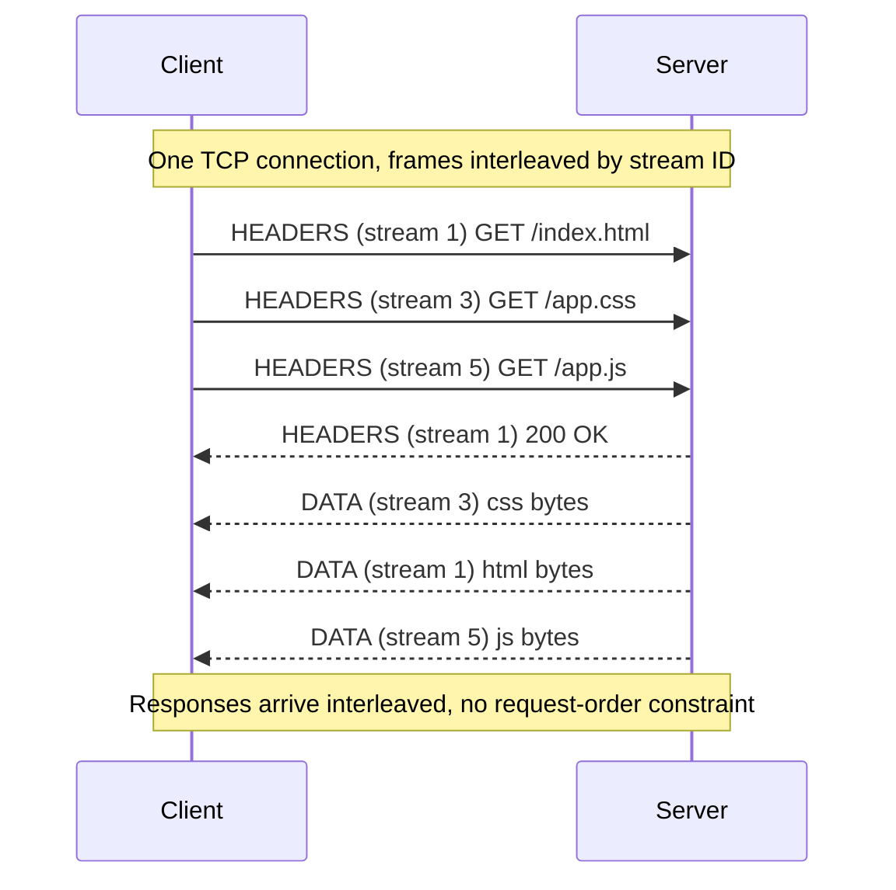

# HTTP Evolution (1.1 / 2 / 3 / QUIC) — Theory and Formal Foundations

<!-- level-focus -->
At professional level, focus on this question:

> How should teams adopt and operate **HTTP Evolution (1.1 / 2 / 3 / QUIC) — Theory and Formal Foundations** with measurable outcomes and limited coordination?

Use the smallest realistic scenario that exposes the decision and its failure behavior.
## 1. The core problem: multiplexing onto an ordered byte stream

A single HTTP client typically wants many objects at once: an HTML document, its stylesheets, scripts, fonts, images. The transport underneath has historically been TCP, which offers exactly one abstraction: a **reliable, in-order byte stream**. TCP does not know about messages; it guarantees only that byte *n* is delivered before byte *n+1* to the application, and that no byte is lost.

This creates a mismatch. The application has *k* logically independent transfers; the transport gives it *one* totally-ordered channel. Any scheme that carries the *k* transfers over that one channel must decide how to interleave them, and — critically — it inherits the channel's ordering guarantee whether it wants it or not. If transfers A and B are interleaved on one TCP connection and a segment belonging to A is lost, TCP will withhold *all* subsequently-received bytes — including B's — from the application until A's segment is retransmitted. B was never lost, but B waits. This is **transport-layer head-of-line (HOL) blocking**, and it is the invariant that the entire arc from HTTP/1.1 to HTTP/3 is fighting.

The three eras represent three answers:

- **HTTP/1.1** — don't multiplex on one connection; open several TCP connections, one request in flight per connection.
- **HTTP/2** — multiplex many streams onto one TCP connection at the application layer, gaining header compression and concurrency but keeping TCP's single ordered stream underneath.
- **HTTP/3** — replace TCP with QUIC, a transport that provides *many* independently-ordered streams natively, so a loss on one stream cannot stall another.

Everything below is detail on those three answers.

## 2. HTTP/1.1: text framing and application-layer HOL

HTTP/1.1 is a line-oriented text protocol. A request is a request-line, CRLF-delimited header fields, a blank line, then an optional body whose length is given by `Content-Length` or `Transfer-Encoding: chunked`. There is no binary framing layer: the *message boundaries are the framing*.

Because a message occupies the connection from its first byte to its last, HTTP/1.1 is fundamentally **one request-response at a time per connection**. Pipelining — sending request 2 before response 1 arrives — was specified but is effectively dead: responses must return *in request order*, so a slow response 1 blocks responses 2..k behind it. This is **application-layer HOL blocking**: not a lost packet, but a slow *response* at the head of the queue stalling ready responses behind it.

The deployed workaround was connection parallelism: browsers open ~6 TCP connections per origin and spray requests across them. This has real costs. Each connection pays its own TCP three-way handshake and TLS handshake, maintains its own congestion-control state (so connections compete rather than share a bandwidth estimate), and consumes server memory. Header fields — often 500–800 bytes of cookies, user-agent, and accept lists — are re-sent uncompressed on *every* request. HTTP/2 was designed to make one connection do the work of six.

## 3. HTTP/2 framing: frames, streams, and stream IDs

HTTP/2 (RFC 9113) inserts a **binary framing layer** between HTTP semantics and TCP. All communication is expressed as **frames**. Every frame has a fixed 9-octet header: a 24-bit length, an 8-bit type, an 8-bit flags field, and a 31-bit stream identifier (with one reserved bit). The key frame types:

| Frame | Purpose |
|-------|---------|
| `HEADERS` | Opens a stream; carries an HPACK-compressed header block |
| `DATA` | Carries a message body payload |
| `SETTINGS` | Connection-level configuration (window sizes, max streams) |
| `WINDOW_UPDATE` | Grants additional flow-control credit |
| `RST_STREAM` | Abruptly terminates a single stream |
| `PRIORITY` | (Deprecated) declares dependency/weight in the priority tree |
| `PING` | Liveness / RTT measurement |
| `GOAWAY` | Graceful connection shutdown, names last-processed stream |
| `PUSH_PROMISE` | Server push (also effectively deprecated) |

A **stream** is an independent, bidirectional sequence of frames within the connection, carrying exactly one request/response exchange. Streams are identified by the 31-bit stream ID. The ID space encodes *who* opened the stream and enforces monotonicity:

- **Client-initiated streams use odd IDs; server-initiated (push) use even IDs.** Stream 0 is reserved for connection-level control frames.
- Stream IDs must be **strictly increasing** for each endpoint. Reusing or decreasing an ID is a connection error. This lets the peer reason about which streams a `GOAWAY` covers and detect stale frames.

Frames from different streams are interleaved freely on the wire; the receiver demultiplexes by stream ID and reassembles each stream's frame sequence. This is genuine concurrency at the HTTP layer — dozens of requests in flight on *one* TCP connection, with no per-message ordering constraint between streams. The framing is binary and self-describing, so a receiver can locate frame boundaries without parsing HTTP text.



## 4. HTTP/2 flow control: per-stream and per-connection windows

Multiplexing many streams over one connection reintroduces a resource-allocation problem TCP had solved for a single stream: a fast sender can overwhelm a slow receiver, or one greedy stream can starve others. HTTP/2 answers with **credit-based flow control operating at two levels**, applied only to `DATA` frames (header frames are not flow-controlled, which matters later).

Each direction maintains:

1. A **connection-level window** — the total unacknowledged `DATA` bytes allowed across all streams combined.
2. A **per-stream window** — the unacknowledged `DATA` bytes allowed on each individual stream.

A sender may transmit a `DATA` frame only if it fits within *both* the stream window *and* the connection window; both are debited. The receiver replenishes credit by sending `WINDOW_UPDATE` frames — stream 0 for connection credit, or the specific stream ID for stream credit. Initial window sizes default to 65,535 bytes and are advertised via `SETTINGS_INITIAL_WINDOW_SIZE`.

The two-level design is deliberate. The connection window bounds total memory the receiver must buffer. The per-stream window lets the receiver *deprioritize* a stream it isn't ready to consume — for example, a browser that paused a background download — by withholding that stream's credit while still granting credit to foreground streams. Without per-stream windows, a single unconsumed response could exhaust the connection window and stall everything.

Note the layering hazard: HTTP/2 flow control sits *on top of* TCP's own flow control. Two independent windowing systems govern the same bytes, and mis-tuned HTTP/2 windows (e.g. a tiny 64 KB default over a high-bandwidth-delay-product path) can throttle throughput below what TCP alone would allow. This is a recurring operational surprise.

## 5. HTTP/2 priority: the tree that nobody could implement

Streams are concurrent, but the server has finite bandwidth and must choose *which* stream's frames to emit next. HTTP/2's original answer was a **priority tree**: each stream declares a *dependency* on another stream (a parent) and a *weight* (1–256). Children of the same parent share bandwidth in proportion to weight; a stream's frames should be sent before those of its dependents. The intent was that a browser could say "fetch the CSS before the below-the-fold images," expressing a full dependency DAG so the server scheduled bytes to minimize render time.

In practice this failed. The tree was **stateful, mutable, and mandatory to track** even though servers were free to ignore it; browsers implemented it inconsistently; reprioritization races and reference cycles created edge cases few servers handled correctly. RFC 9113 formally **deprecated** the `PRIORITY` frame and the dependency-tree scheme. The replacement is the far simpler *Extensible Prioritization Scheme* (RFC 9218): two parameters — `urgency` (a small integer) and `incremental` (a boolean) — carried in a `Priority` header field or a `PRIORITY_UPDATE` frame. The lesson is a general one in protocol design: **a coordination mechanism that is expensive to implement correctly and optional to honor will be honored badly.** HTTP/3 adopted the RFC 9218 scheme from the start rather than porting the tree.

## 6. HPACK: compression under a CRIME threat model

HTTP header fields are hugely repetitive: the same cookies, `user-agent`, and `accept-*` lists recur on nearly every request. HTTP/1.1 re-sent them in full each time. HTTP/2 introduces **HPACK** (RFC 7541), a stateful header-compression format designed specifically to be *safe against compression side-channel attacks*.

HPACK uses three mechanisms:

1. **Static table** — a fixed, predefined table of 61 common header field entries (`:method: GET`, `:status: 200`, `accept-encoding: gzip, deflate`, …). A single index references a full name+value or a name alone.
2. **Dynamic table** — a per-connection, FIFO-evicting table into which the encoder inserts previously-seen fields. Once inserted, a header costs a single index reference. The table has a size bound negotiated via `SETTINGS_HEADER_TABLE_SIZE`; inserting evicts oldest entries.
3. **Huffman coding** — a static Huffman table for string literals not covered by an index.

The design is dominated by the **CRIME** attack. CRIME (2012) showed that when a secret (a session cookie) and attacker-controlled data are compressed *together* using a general-purpose compressor like DEFLATE, the *compressed length* leaks information: an attacker-guessed prefix that matches the secret compresses smaller, revealing the secret byte-by-byte. HPACK's defenses are direct responses:

- It is **not** a general LZ77/DEFLATE compressor. It compresses only via *whole-field* table indexing and per-string Huffman coding — there is no cross-field back-reference matching that could correlate attacker input with a secret.
- Sensitive fields can be marked **"never indexed"**, forbidding their insertion into the dynamic table and into any intermediary's table, so their presence never influences the compression of other fields.

HPACK is thus a security-constrained compressor: it trades away DEFLATE-style ratio for the guarantee that compressed size does not leak secrets across fields. This constraint — a *stateful, insertion-order-sensitive* table shared by encoder and decoder — is exactly what makes HPACK impossible to reuse unchanged over QUIC, as §11 explains.

## 7. The residual failure: TCP head-of-line blocking

HTTP/2 solved application-layer HOL blocking (§2): streams are independent at the HTTP layer, so a slow response does not block others. It solved header bloat with HPACK. It collapsed six connections to one. And yet, under packet loss, HTTP/2 can perform *worse* than HTTP/1.1's six connections. Why?

Because all of HTTP/2's independent streams ride a **single TCP connection**, and TCP delivers **one ordered byte stream**. When a TCP segment is lost, the receiver's TCP stack has bytes from *later* segments sitting in its buffer but cannot deliver them to the HTTP/2 layer — TCP guarantees in-order delivery, so it withholds everything after the gap until the lost segment is retransmitted (one RTT minimum). Those withheld bytes may belong to five other streams that had no loss of their own. The HTTP/2 layer is *ready* to process them; TCP refuses to hand them up.

This is **transport-layer HOL blocking**, and it is architecturally invisible to HTTP/2: the multiplexing lives *above* TCP, but the ordering constraint lives *inside* TCP, where HTTP/2 cannot reach it. With six HTTP/1.1 connections, a loss on connection 3 stalls only connection 3's single transfer; the other five proceed. HTTP/2's single connection concentrates all loss impact onto every stream at once. On lossy networks (mobile, congested Wi-Fi) this can make HTTP/2 a regression.

The only fix is to move stream independence *below* the reliability/ordering boundary — into the transport itself. That transport is QUIC.

## 8. QUIC transport: independent streams over UDP

QUIC (RFC 9000) is a new transport built on UDP that provides what TCP structurally cannot: **many independently-ordered, independently-reliable streams within a single connection**. HTTP/3 (RFC 9114) is the HTTP mapping onto QUIC — but the crucial work happens in the transport.

QUIC runs over UDP because UDP is the only widely-deployable substrate that middleboxes pass and that user-space code can fully control. On top of UDP, QUIC implements its own reliability, congestion control, ordering, and — integrated, not layered — encryption. The central object is the **stream**: like an HTTP/2 stream, it is an ordered byte sequence carrying one request/response. Unlike HTTP/2, ordering is guaranteed *only within* a stream. QUIC delivers each stream's bytes in order to the application, but places **no ordering relationship between streams**.

Stream IDs in QUIC are 62-bit variable-length integers whose two least-significant bits encode initiator and directionality: bit 0 selects client (0) vs. server (1) initiated; bit 1 selects bidirectional (0) vs. unidirectional (1). This lets both peers open streams without ID collisions and lets the receiver classify a stream from its ID alone. Concurrency is bounded per stream-type by transport parameters (`initial_max_streams_bidi`, etc.), replenished by `MAX_STREAMS` frames — the QUIC analogue of HTTP/2's stream limits, plus per-stream and connection-level flow control frames (`MAX_STREAM_DATA`, `MAX_DATA`) that mirror §4's two-level model.

The consequence: when a UDP datagram carrying stream A's data is lost, QUIC still delivers already-received data for streams B, C, D to the application immediately. Only stream A waits for its retransmission. **Transport-layer HOL blocking is eliminated at the source** — not worked around, but structurally removed, because the reliability/ordering boundary now sits *per stream* instead of *per connection*.

## 9. Packet numbers, loss recovery, and per-stream independence

The mechanism that makes per-stream independence work is QUIC's separation of **packets** from **streams**. A QUIC packet carries *frames*; `STREAM` frames carry stream data (with an explicit offset), and many streams' frames can share one packet. Loss detection and recovery operate on **packets**, while ordering operates on **stream offsets**. Decoupling these two is the whole trick.

QUIC packets carry a monotonically increasing **packet number** that is *never reused* — even a retransmission gets a *new* packet number. TCP conflated its sequence number with both loss detection and byte ordering, which created the *retransmission ambiguity problem*: TCP cannot tell whether an ACK acknowledges the original segment or its retransmission, corrupting RTT estimation (Karn's algorithm was a partial patch). QUIC's monotonic, non-reused packet numbers make every acknowledgment unambiguous, yielding precise RTT samples and cleaner loss detection. QUIC ACK frames also carry explicit ACK ranges and an ACK delay, richer than TCP's cumulative ACK.

Loss recovery then works like this: if packet 42 is deemed lost, QUIC does *not* retransmit packet 42. It re-sends the *frames* that packet 42 carried — the lost stream data at its original offsets — inside a *new* packet with a fresh number. Because ordering is tracked by stream offset, and reliability by packet number, a loss on one stream's `STREAM` frame requires retransmitting only that stream's data. Other streams whose frames arrived in *different* packets are delivered without waiting.

```mermaid
sequenceDiagram
    participant S as Server
    participant N as Network
    participant C as Client
    Note over S,C: Stage 1 — three streams' data sent in separate packets
    S->>N: Packet 10 [STREAM A off=0]
    S->>N: Packet 11 [STREAM B off=0]
    S->>N: Packet 12 [STREAM C off=0]
    Note over N: Stage 2 — Packet 11 (stream B) is LOST
    N->>C: Packet 10 delivered
    N--xC: Packet 11 dropped
    N->>C: Packet 12 delivered
    Note over C: Stage 3 — A and C delivered to app NOW; only B waits
    C-->>C: Deliver stream A (in order)
    C-->>C: Deliver stream C (in order)
    C->>S: ACK 10,12 (gap at 11)
    Note over S,C: Stage 4 — retransmit B's frame in a NEW packet number
    S->>C: Packet 13 [STREAM B off=0]  (fresh packet number)
    C-->>C: Deliver stream B
```

Contrast the same loss under HTTP/2: the lost segment is at some TCP byte offset, and TCP blocks delivery of *all* higher offsets — streams A and C included — until retransmission. QUIC's stage 3 (delivering A and C immediately) is precisely what TCP cannot do.

## 10. Connection IDs, migration, and integrated TLS 1.3

A TCP connection is identified by the 4-tuple (source IP, source port, dest IP, dest port). Change any element — say a phone moving from Wi-Fi to cellular, which changes its source IP — and the TCP connection breaks; a new handshake is required. QUIC decouples connection identity from the network path using **Connection IDs (CIDs)**: opaque identifiers each endpoint chooses for the other to use. A packet is associated with a connection by its CID, *not* its IP/port tuple.

This enables **connection migration**. When the client's address changes, its packets still carry the same destination CID, so the server recognizes the connection and continues it — no re-handshake, no lost state. The server validates the new path (an anti-amplification/anti-spoofing check via `PATH_CHALLENGE`/`PATH_RESPONSE`) before committing full bandwidth to it. CIDs are also issued in pools and rotated to prevent an on-path observer from linking a user across paths by tracking a stable CID — a deliberate privacy property.

QUIC further **integrates the TLS 1.3 handshake** into the transport handshake rather than layering TLS over a separately-established connection (RFC 9001). In the TCP+TLS stack, you pay a TCP handshake (1 RTT) *then* a TLS 1.3 handshake (1 RTT) — two round trips before the first byte of application data. QUIC folds the cryptographic handshake into the transport handshake: TLS 1.3 handshake messages travel inside QUIC `CRYPTO` frames in the very first flight, so a full QUIC handshake completes in **1 RTT**, and connection resumption enables **0-RTT** (§12). Encryption is not optional in QUIC — nearly the entire packet, including most of the header, is authenticated and encrypted, which also denies middleboxes the ability to inspect or ossify the protocol.

## 11. QPACK: HPACK that survives reordering

HPACK (§6) cannot be used unchanged over QUIC, and the reason is a clean illustration of the whole ordering theme. HPACK's dynamic table is **stateful and order-dependent**: the decoder must apply the encoder's insertions and evictions in *exactly the same order* the encoder made them, because an index reference means "the *N*th entry in the table *as it stands right now*." HPACK assumes a single totally-ordered byte stream (TCP) where header blocks arrive in send order.

QUIC breaks that assumption. Each HTTP/3 request rides its own stream, and streams are delivered *independently* — stream 7's `HEADERS` may reach the decoder before stream 3's, even though stream 3 was sent first. If stream 3 inserted a dynamic-table entry that stream 7 references by index, and stream 7 is decoded first, the index points at the wrong entry — or nothing. Naively running HPACK over QUIC would reintroduce HOL blocking (the decoder would have to *wait* for the earlier stream, re-serializing what QUIC just parallelized), defeating the entire point of HTTP/3.

**QPACK (RFC 9204)** redesigns the compressor to tolerate reordering:

- Dynamic-table updates travel on a **dedicated, ordered unidirectional stream** (the *encoder stream*), separate from the request streams. The decoder acknowledges insertions on a *decoder stream*.
- Each request's header block carries a **Required Insert Count** — the minimum dynamic-table size the decoder needs before that block can be decoded. A block referencing a not-yet-received insertion *can* block, but only that one block, and the encoder controls exposure to this risk.
- The encoder chooses a **trade-off**: it may reference dynamic entries (best compression, but risks a block waiting on the encoder stream) or avoid references to entries the decoder hasn't acknowledged (no blocking, slightly worse ratio). This is a *tunable* HOL-blocking-vs-ratio dial that HPACK never needed because TCP gave it ordering for free.

QPACK keeps HPACK's static table (expanded to 99 entries for HTTP/3), Huffman coding, and the CRIME-motivated "never-indexed" safety, but restructures the *dynamic* state so that inter-stream reordering — the feature that makes QUIC fast — cannot corrupt decoding.

## 12. 0-RTT and the replay-security boundary

Because QUIC integrates TLS 1.3, it inherits TLS 1.3's **0-RTT resumption**. On a first connection, the server can hand the client a resumption secret. On a *subsequent* connection to the same server, the client can encrypt application data with a key derived from that secret and send it in the *very first flight* — before the handshake completes. The server can begin processing the request having spent **zero round trips** on setup. For latency-sensitive workloads this is transformative: a repeat visitor's first request executes immediately.

The catch is fundamental, not incidental. 0-RTT data is sent *before* the server has proven the connection is live and *before* any anti-replay guarantee is in place. An on-path attacker can **capture the encrypted 0-RTT flight and replay it** — resend the identical bytes to the server, possibly many times. The server cannot distinguish a replay from the original within the 0-RTT window, because both are validly encrypted under the same resumption secret. This yields two limits:

1. **Replay safety.** 0-RTT must only carry requests that are safe to execute more than once — *idempotent* operations. `GET` of a cacheable resource is fine; a `POST` that charges a credit card or a request that mutates server state is not. Applications must refuse non-idempotent methods in early data, deferring them until the handshake completes (RFC 9114 requires exactly this discipline for HTTP/3).
2. **No forward secrecy for early data.** 0-RTT data is protected by a key derived from the resumption secret, not from a fresh Diffie-Hellman exchange, so it lacks the forward-secrecy property of the main handshake keys. Servers additionally deploy single-use anti-replay caches to bound (not eliminate) replay, but the protocol-level guarantee is only "safe if idempotent."

0-RTT is therefore a *conditional* optimization: available, powerful, but gated behind an application-level obligation to send only replay-safe requests in early data. The boundary is where correctness meets latency, and it must be enforced by the HTTP layer.

## 13. Head-of-line blocking, resolved by layer

The single clearest way to see the arc of HTTP evolution is to line the versions up against *where* HOL blocking occurs and *why*.

| Property | HTTP/1.1 | HTTP/2 | HTTP/3 (QUIC) |
|---|---|---|---|
| Transport | TCP, ~6 connections/origin | TCP, 1 connection | QUIC over UDP, 1 connection |
| Multiplexing layer | none (1 req/conn in flight) | application (framing layer) | transport (native streams) |
| App-layer HOL (slow response blocks queue) | **Present** — ordered responses per conn | Eliminated — independent streams | Eliminated — independent streams |
| Transport HOL (lost packet blocks unrelated data) | Per-connection only (loss stalls 1 transfer) | **Present & amplified** — one TCP stream stalls *all* streams | **Eliminated** — per-stream ordering |
| Header compression | none (re-sent in full) | HPACK (order-dependent, TCP-safe) | QPACK (reorder-tolerant) |
| Handshake to first byte | TCP (1) + TLS (1) = 2 RTT | TCP (1) + TLS (1) = 2 RTT | 1 RTT; **0-RTT** on resumption |
| Connection survives IP change | No (4-tuple bound) | No (4-tuple bound) | Yes (Connection ID migration) |
| Encryption | optional (HTTPS) | optional (HTTPS) | mandatory, integrated |

Read the two HOL rows together and the design becomes a theorem. Application-layer HOL is defeated the moment multiplexing exists (HTTP/2 onward). Transport-layer HOL is defeated *only* when independent ordering is pushed below the reliability boundary — which requires replacing TCP, which QUIC does. HTTP/2 sits in the uncomfortable middle: it removed the HOL blocking it could see (application layer) while *concentrating* the HOL blocking it couldn't (transport layer), which is why on lossy links it can lose to HTTP/1.1's naive connection parallelism. HTTP/3 is the version where *both* HOL sources are structurally gone.

The invariant to remember: **HOL blocking is a property of the lowest layer that enforces total order across otherwise-independent work.** Move the ordering boundary to be per-stream, and the blocking dissolves. Every other feature — QPACK's redesign, packet-number decoupling, connection migration — exists to make per-stream ordering *implementable* on real, encrypted, migrating networks.

## 14. Synthesis

HTTP's three wire formats are three positions of a single dial: **the granularity of the ordering-and-reliability boundary.**

- HTTP/1.1 sets the boundary at the *connection*, and uses many connections to get concurrency, paying handshake, memory, and header-bloat costs, and suffering application-layer HOL within each connection.
- HTTP/2 keeps the boundary at the connection (still TCP) but adds an application-layer multiplexing plane above it — binary frames, streams with monotone IDs, two-level flow control, HPACK. It eliminates application HOL and header bloat, but the connection-granular ordering boundary now amplifies transport HOL across all streams under loss.
- HTTP/3 moves the boundary to the *stream* by replacing TCP with QUIC. Packet numbers decouple reliability from ordering; per-stream offsets localize retransmission; QPACK rebuilds compression to tolerate reordering; connection IDs decouple identity from path; integrated TLS 1.3 collapses the handshake and enables replay-gated 0-RTT.

Nothing in the request/response *semantics* changed across any of this. The entire evolution is transport engineering in service of one goal: let *k* independent transfers actually be independent — in ordering, in loss recovery, and in compression state — so that a problem with one never becomes a problem with all. RFC 9113 (HTTP/2), RFC 9000 (QUIC), and RFC 9114 (HTTP/3) are best read as successive refinements of exactly that boundary.

---


---

## Apply it

1. Define the user or business outcome that **HTTP Evolution (1.1 / 2 / 3 / QUIC) — Theory and Formal Foundations** should improve.
2. Assign one owner for code, contracts, operations, and incidents.
3. Split delivery into reversible increments that produce evidence early.
4. Publish responsibilities, escalation paths, and compatibility windows.
5. Stop or expand only when the agreed measures support that decision.

## Verify your work

- Each increment has an owner, rollback path, and observable exit condition.
- Adoption, reliability, delivery time, and coordination cost are measured.
- Incident and migration exercises prove that responsibility is executable.
- The old path is removed only after telemetry proves it is unused.

## Review questions

- Which measurable outcome justifies investing in HTTP Evolution (1.1 / 2 / 3 / QUIC) — Theory and Formal Foundations?
- Which team owns the full lifecycle and incident response?
- What reversible increment produces the earliest useful evidence?
- Which exit condition proves that migration or adoption is complete?
