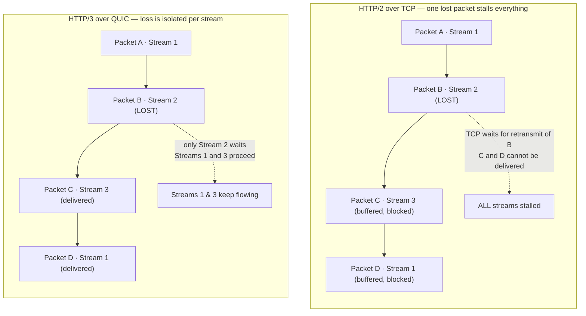

# HTTP Evolution (1.1 / 2 / 3 / QUIC) — Senior

<!-- level-focus -->
At senior level, focus on this question:

> Which system invariant is affected by **HTTP Evolution (1.1 / 2 / 3 / QUIC)** under failure, load, and change?

Use the smallest realistic scenario that exposes the decision and its failure behavior.
## 1. The one-paragraph mental model

Each HTTP version solves the *previous* version's dominant bottleneck.

- **HTTP/1.1** gives you one in-flight request per TCP connection (pipelining never worked in practice). Browsers work around this by opening ~6 parallel connections per origin.
- **HTTP/2** multiplexes many concurrent streams over **one** TCP connection, killing per-connection overhead and enabling header compression (HPACK). But all streams share one TCP byte-stream, so a single lost packet stalls *every* stream — **TCP head-of-line (HOL) blocking**.
- **HTTP/3** keeps HTTP/2's semantics (streams, header compression via QPACK, server push) but runs over **QUIC**, a userspace transport on UDP with per-stream flow control and loss recovery. A lost packet stalls only the stream that owns those bytes.

The evolution is a straight line: fewer connections → shared transport → independent streams within the shared transport. Every version trades a solved problem for a new operational cost. Your job is deciding whether that trade is worth it *for your traffic and your team*.

---

## 2. Where HTTP/2 actually helps (and where it doesn't)

HTTP/2's wins are almost entirely about **connection amortization** and **many concurrent small transfers**. The benefit scales with the number of resources and the round-trip time of the link.

**Where HTTP/2 clearly wins:**

- **Many small assets over a high-latency link.** A page pulling 80 small JS/CSS/image files over HTTP/1.1 is bottlenecked by the 6-connection browser limit and by each connection paying a TCP + TLS handshake. HTTP/2 fetches all 80 concurrently on one connection with one handshake. On a 150 ms RTT mobile link this can cut page-load time by 30–50%.
- **API gateways fanning out.** One client connection multiplexing dozens of concurrent API calls avoids connection-pool thrash.
- **Header-heavy traffic.** HPACK compresses repeated headers (cookies, auth tokens, user-agent) that HTTP/1.1 re-sends verbatim on every request. For chatty APIs with large cookies this alone is meaningful.

**Where HTTP/2 gives you little or nothing:**

- **A single large download.** One 2 GB file is one stream. There is nothing to multiplex, no headers to amortize. HTTP/2 adds a small amount of framing overhead and can even be *slower* than HTTP/1.1 under loss because of HOL blocking (see §3). Use HTTP/1.1 or range requests here.
- **Low-latency LAN traffic between two services.** On a sub-1 ms link the handshake amortization HTTP/2 offers is nearly free anyway. The multiplexing helps only if you'd otherwise open many connections — which for service-to-service gRPC you would (see §9).
- **Server Push.** Effectively dead. Chrome removed it; the cache-awareness problem (pushing assets the client already has) made it a net loss. Use `103 Early Hints` + preload instead. Do not build a strategy around push.

The senior takeaway: HTTP/2's benefit is a function of `(resource_count × RTT)`. When that product is large, upgrade. When it's small (one big object, or a fast LAN), the gain rounds to zero and you should choose the version that's *easier to operate and debug*.

---

## 3. The TCP head-of-line blocking problem, quantified

This is the single most important concept for reasoning about HTTP/2 vs HTTP/3, so let's make it concrete.

TCP delivers a **single, ordered byte stream**. When a segment is lost, TCP must retransmit it and cannot deliver *any* later bytes to the application until the gap is filled — even if those later bytes have already arrived in the receiver's buffer. HTTP/2 layers N independent logical streams *on top of* that one byte stream. So a single dropped packet freezes **all** N streams until recovery completes.

The stall is roughly one retransmission's worth of latency. On a lossy path, retransmission takes on the order of one RTT (plus RTO if the loss detection is duplicate-ACK-starved). Concretely:

| Scenario | HTTP/1.1 (6 conns) | HTTP/2 (1 conn) | HTTP/3 (QUIC) |
|---|---|---|---|
| 0% loss, 20 ms RTT | baseline | faster (1 handshake) | ~same as H2 |
| 1% loss, 150 ms RTT | loss affects 1 of 6 conns | **loss stalls all streams** | loss stalls 1 stream only |
| 2% loss, 200 ms RTT (mobile) | degraded but parallel | **severely degraded** | best of the three |
| Single large file | fine | fine (no multiplexing) | fine |

Why HTTP/1.1's six connections partially *hide* the problem: a packet lost on connection 3 only stalls connection 3; the other five keep flowing. HTTP/2's "one connection" design deliberately gives that up for handshake savings — a great trade on clean networks and a bad one on lossy ones.

The math that drove QUIC's design: as loss rate rises, the *expected* number of streams affected by an HOL stall goes to 100% under HTTP/2 (all streams share the transport) but stays bounded under HTTP/3 (each stream recovers independently). At 2% loss and high RTT — i.e. a typical congested cellular network — HTTP/2 can regress to *worse* than HTTP/1.1's multi-connection model, which is exactly the regime QUIC targets.



> 🎞️ **See it animated:** [HPBN — HTTP/2 & transport HOL blocking (High Performance Browser Networking, free online)](https://hpbn.co/http2/)

---

## 4. HTTP/3 and QUIC: what changes, what it costs

QUIC is a transport protocol built on UDP that folds together what used to be TCP + TLS + HTTP/2's stream layer. The headline properties you're buying:

- **Independent streams.** Solves TCP HOL blocking (§3). This is the entire reason QUIC exists.
- **0-RTT / 1-RTT handshake.** TLS 1.3 is baked in; the crypto and transport handshakes are combined. A returning client can send data in the first flight (0-RTT), versus TCP's SYN + TLS's extra round trips.
- **Connection migration.** A QUIC connection is identified by a Connection ID, not the 4-tuple. When a phone switches from Wi-Fi to cellular (IP changes), the connection *survives* instead of being torn down and re-handshaked. This is a large, real win for mobile.
- **Encrypted transport metadata.** Most of the transport header is encrypted, which improves privacy — and, as we'll see in §10, wrecks your existing observability tooling.

**What it costs you — the parts juniors miss:**

- **CPU.** TCP runs in the kernel with decades of NIC hardware offload (segmentation, checksums, GRO/GSO). QUIC runs in **userspace** on UDP, so packet handling, encryption, and loss recovery burn application CPU. Early real-world numbers put QUIC at roughly **2–3× the CPU per byte** of TCP; UDP GSO and kernel offload work has narrowed but not closed that gap. At CDN/edge scale this is a capacity-planning line item, not a rounding error. Budget for it before you flip the switch on high-throughput endpoints.
- **UDP path hazards.** Some middleboxes, corporate firewalls, and cheap home routers throttle or block UDP, or rate-limit it below TCP. HTTP/3 must always be able to fall back to HTTP/2 over TCP.
- **Maturity of your stack.** CDN and browser support is now excellent (Cloudflare, Fastly, Google, Akamai all serve H3; Chrome/Firefox/Safari all speak it). But your *own* internal LB/proxy layer may not: older nginx builds, some service meshes, and many L4/L7 appliances have partial or immature QUIC support. Verify every hop, not just the browser.
- **Observability regression.** Covered in §10 — this is often the deciding cost for internal traffic.

The clean decision rule: **HTTP/3 pays off in direct proportion to your users' network badness.** Consumer mobile, lossy last-mile, high-RTT emerging markets, users who roam between networks — big wins. Datacenter-internal traffic on clean fiber — the transport gains are near zero and the CPU + observability costs are all downside.

---

## 5. Connection coalescing and its pitfalls

HTTP/2 and HTTP/3 let a client reuse **one** connection for **multiple hostnames** — *connection coalescing* — when two conditions hold:

1. The hostnames resolve such that the client believes they can share a connection (for HTTP/2 the practical rule is the served TLS certificate is valid for both names, e.g. a wildcard or SAN covering `a.example.com` and `b.example.com`).
2. They connect to the same server (same IP for the origin, per the browser's coalescing logic).

When it works, coalescing is a real win: `img.example.com`, `api.example.com`, and `static.example.com` under one `*.example.com` cert share a single multiplexed connection, saving handshakes and connection setup.

**The pitfalls that bite in production:**

- **Domain sharding backfires.** The old HTTP/1.1 optimization was to shard assets across `cdn1`, `cdn2`, `cdn3` to escape the 6-connection-per-origin limit. Under HTTP/2 this is *counterproductive*: you now pay multiple handshakes and defeat HPACK's shared header state and prioritization. When you move to HTTP/2, **un-shard** your domains.
- **Coalescing to the wrong backend.** If `a.example.com` and `b.example.com` share a cert but are served by different backend pools, a client may coalesce them onto whichever origin it connected to first — and send `b`'s requests to `a`'s server via `Host`/`:authority`. If your edge routes purely on connection rather than on the `:authority` header, requests land on the wrong backend. Fix: route on `:authority`, and split certs when backends genuinely differ.
- **421 Misdirected Request.** The protocol's escape hatch: a server that receives a coalesced request it can't serve for that authority should return `421`, telling the client to open a fresh, un-coalesced connection. If you don't emit `421` correctly you get silent mis-routing; if clients don't handle it you get hard failures. Verify both sides.
- **Certificate scope creep.** Broad wildcard/SAN certs *increase* coalescing, which is usually good, but they also mean an outage or misconfiguration on one hostname's backend can surface as errors on a coalesced sibling. Keep the blast radius of a shared cert in mind.

Senior rule: coalescing is a feature to *design for*, not a thing that just happens correctly. Decide your cert topology and edge routing together, and test the `421` path.

---

## 6. Which version when: the decision table

This is the artifact to keep. Match the version to the traffic class, not to fashion.

| Traffic class | Primary constraint | Recommended | Why |
|---|---|---|---|
| Public web app, many assets, global/mobile users | High RTT, some loss, roaming | **H3 → H2 → H1.1** (offer all, negotiate down) | HOL-blocking + migration wins on lossy mobile; H2 covers UDP-blocked clients; H1.1 last resort |
| Public API (JSON/REST), moderate concurrency | Handshake + header overhead | **H2 at edge**, H3 optional | Multiplexing + HPACK help chatty clients; H3 upside only if clients are on bad networks |
| Single large file / video segment / backup download | Throughput, not concurrency | **H1.1 or H2** | No multiplexing benefit; avoid QUIC CPU tax on high-throughput bytes |
| Internal service-to-service RPC | Latency low, debuggability high | **gRPC over H2** | Multiplexed streams for RPC; clean fiber removes H3's reason to exist (§9) |
| Internal admin / debug / legacy tooling | Human debuggability | **H1.1** | Plaintext-friendly, `curl`/`tcpdump`-friendly, no HPACK/QPACK decode needed |
| Very high loss / high RTT last mile (emerging markets, satellite) | Packet loss dominates | **H3** | This is exactly the regime QUIC was designed for |
| Corporate networks that block UDP | Connectivity | **H2 (H1.1 fallback)** | H3 will fail; must degrade gracefully |

Two rules of thumb behind the table:

1. **User-facing + bad networks → prefer H3, always keep H2 fallback.**
2. **Internal + clean networks → prefer H2 (gRPC) or H1.1 for debuggability; H3 buys you little and costs you observability.**

---

## 7. Version negotiation and the Alt-Svc upgrade path

Clients don't magically know you speak HTTP/3. There is no in-band UDP upgrade the way there was for HTTP/1→2 over TLS ALPN. The negotiation flow is:

- **HTTP/1.1 vs HTTP/2** is chosen during the TLS handshake via **ALPN** (Application-Layer Protocol Negotiation). The client offers `h2, http/1.1`; the server picks. One round trip, no extra requests.
- **HTTP/3** is discovered *after* an initial HTTP/1.1 or HTTP/2 (over TCP) connection, via the **`Alt-Svc`** response header (or an HTTPS/SVCB DNS record). The server advertises `Alt-Svc: h3=":443"; ma=86400`. The client remembers this ("h3 is available on UDP:443 for the next `ma` seconds") and *races* a QUIC connection on its next visit. If QUIC succeeds, subsequent requests go over H3; if UDP is blocked or fails, the client stays on H2/TCP.

This is why HTTP/3 is inherently a **progressive enhancement**: the very first connection to a fresh client is *always* TCP-based, and QUIC is attempted only after the client has learned it's available. You cannot break clients by enabling H3 — worst case they never leave TCP.

```mermaid
sequenceDiagram
    participant C as Client
    participant E as Edge / CDN
    Note over C,E: Stage 1 — first visit, TCP + TLS + ALPN
    C->>E: TLS ClientHello (ALPN: h2, http/1.1)
    E-->>C: ServerHello (ALPN: h2)
    C->>E: HTTP/2 request over TCP
    E-->>C: 200 OK + Alt-Svc: h3=":443"; ma=86400
    Note over C: caches "h3 available on UDP:443"
    Note over C,E: Stage 2 — next visit, race QUIC
    par QUIC attempt
        C->>E: QUIC Initial (UDP:443, TLS 1.3)
        E-->>C: QUIC handshake OK
    and TCP fallback armed
        C->>E: (TCP connection kept ready)
    end
    Note over C,E: Stage 3 — steady state
    alt QUIC succeeded
        C->>E: HTTP/3 requests over QUIC
    else UDP blocked / QUIC failed
        C->>E: HTTP/2 requests over TCP
    end
```

Operational notes:

- Set a sane `ma` (max-age). Too long and clients keep trying a QUIC endpoint you've decommissioned; too short and you lose the caching benefit. A day is a common default.
- **HTTPS/SVCB DNS records** let capable clients skip the TCP bootstrap entirely by learning `h3` support from DNS. Adopt these once your H3 endpoint is stable — it removes the first-visit TCP round trip.
- Keep the `Alt-Svc` port/endpoint truthful. Advertising an H3 endpoint that isn't actually up causes clients to burn a QUIC attempt and time out before falling back — measurable latency regression.

---

## 8. Migration: edge-first rollout

The safe, standard migration is **terminate new protocols at the edge, keep the origin boring.**

1. **Enable at the CDN / edge LB first.** Cloudflare, Fastly, Akamai, and cloud LBs (ALB, Cloud Load Balancing) let you flip H2 and H3 on the client-facing side with a config toggle. The client↔edge hop is where bad networks live and where H2/H3 pay off. The edge↔origin hop is usually clean fiber where H1.1 or H2 is perfectly fine.
2. **Keep the origin on HTTP/1.1 or HTTP/2.** There is rarely a reason to run H3 origin-side. Terminating QUIC at the edge and speaking plain HTTP inward keeps your origin debuggable and avoids the QUIC CPU tax on internal throughput.
3. **Roll out behind negotiation, not a flag day.** Because of ALPN and `Alt-Svc` (§7), enabling H2/H3 never forces a client onto them — it only *offers*. So the rollout is inherently safe: clients that can't or won't use the new version silently stay on the old one. Ramp by percentage of edge POPs, watch error rates and CPU, then widen.
4. **Preserve an HTTP/1.1 path for internal and debug traffic.** Health checks, internal admin tools, `curl`-based runbooks, and anything a human needs to `tcpdump` should stay on HTTP/1.1. When an incident hits, you want a plaintext-ish, single-request-per-line protocol you can read with standard tools — not a QPACK-compressed multiplexed stream.
5. **Test the fallback explicitly.** Block UDP in a test environment and confirm clients degrade H3→H2 cleanly. Force a `421` and confirm coalescing recovers. The failure paths are the whole point of a safe migration; don't ship them untested.

The through-line: **new protocol at the edge, old protocol inward.** You get the client-facing performance wins without dragging QUIC's cost and opacity into your service mesh.

---

## 9. gRPC-over-HTTP/2 for internal services

For east-west (service-to-service) traffic, the dominant choice is **gRPC, which mandates HTTP/2** as its transport. The fit is deliberate:

- **Multiplexed streams map onto RPCs.** Each gRPC call is an HTTP/2 stream. One long-lived connection carries many concurrent in-flight RPCs without the connection-pool management HTTP/1.1 forces on you.
- **Streaming RPCs** (server-streaming, client-streaming, bidi) ride HTTP/2's stream flow control naturally.
- **Binary framing + HPACK** keep per-call overhead low, which matters when a request fans out to dozens of downstream services.

Why gRPC does **not** chase HTTP/3 for internal traffic — and why you shouldn't either:

- **Clean networks negate QUIC's advantage.** Datacenter fiber has negligible loss; TCP HOL blocking almost never fires, so QUIC's marquee benefit disappears (§3).
- **The CPU tax is pure cost here.** East-west traffic is high-volume and throughput-heavy; paying 2–3× transport CPU for a benefit you won't realize is a bad trade (§4).
- **Debuggability matters more internally.** A mature H2 stack with `tcpdump` + a decoder, service-mesh sidecars, and existing tracing beats a QUIC path your tooling can't fully see (§10).

There is now HTTP/3 support emerging in gRPC ecosystems, but for the standard datacenter deployment, **gRPC-over-H2 is the right default** and H3 is a niche choice reserved for gRPC that must traverse bad external networks (e.g. mobile-to-edge).

One caveat for the mesh owner: gRPC's single long-lived H2 connection interacts badly with naive L4 load balancers, which balance *connections*, not *requests* — one connection pins all its streams to one backend. Use an L7 (request-aware) proxy or client-side load balancing so gRPC streams spread across backends.

---

## 10. Observability gaps you inherit

This is the cost that most often surprises teams, and it's why HTTP/3 is a poor default for internal traffic.

- **QUIC encrypts most of the transport header.** With TCP you could `tcpdump` and read sequence numbers, window sizes, retransmits, and RTT straight off the wire. With QUIC, that metadata is *encrypted*. Your existing packet-capture-based debugging — the muscle memory of every network engineer — largely stops working.
- **Fewer tools decode it.** Wireshark can decode QUIC/H3, but only with the TLS keys exported (`SSLKEYLOGFILE`), and many appliance-based monitors simply see "UDP:443" and give up. Flow logs that classified TCP:443 as HTTPS now show opaque UDP.
- **Middlebox and LB visibility drops.** L4 devices that inspected TCP state can't see QUIC connection state. Metrics you relied on (connection counts, retransmit rates) may vanish or move into the application.
- **The observable surface moves into your application.** Because the transport is opaque to the network, per-stream loss, RTT estimates, and congestion state are now known only to the QUIC endpoint — i.e. *your userspace library*. If it doesn't export those as metrics, you're blind. Standardizing on **qlog** (QUIC's structured logging format) and **qvis** for visualization is how mature teams recover this visibility, but it's opt-in work you must fund.

Practical stance: before enabling H3 on any path you'll have to *debug*, confirm you have (a) a way to decrypt/decode QUIC in a lab, (b) qlog wired into your library, and (c) application-level metrics for RTT/loss/retransmits. If you can't answer "how will I debug this during an incident?", keep that path on H2/H1.1.

---

## 11. Ownership checklist

- **Match version to traffic class** using the table in §6 — don't blanket-upgrade.
- **Un-shard domains** when moving to H2; sharding is an anti-pattern past H1.1.
- **Enable H2/H3 at the edge, keep the origin on H1.1/H2**; terminate QUIC at the CDN.
- **Always keep an H2-over-TCP fallback** and test it with UDP blocked.
- **Budget CPU for QUIC** (roughly 2–3× transport CPU) before enabling on high-throughput endpoints.
- **Design cert topology and edge routing together**; route on `:authority`; test the `421` path.
- **Set a sane `Alt-Svc` max-age** and keep advertised H3 endpoints truthful; adopt HTTPS/SVCB DNS once stable.
- **Default internal RPC to gRPC-over-H2**; reserve H3 for RPC crossing bad external networks.
- **Fund observability before H3**: qlog, key-logged Wireshark in the lab, app-level RTT/loss metrics.
- **Keep an HTTP/1.1 debug path** so humans can `curl`/`tcpdump` during incidents.

Own the decision, not just the config toggle. The right answer is almost always "H3 at the edge for user traffic on bad networks, H2 for chatty APIs and internal RPC, H1.1 for the parts you have to debug" — and the ability to *justify* that split is what separates a senior owner from someone who enabled a checkbox because a benchmark looked good.

*Next step:* [Professional level](professional.md)

---

## Apply it

1. State the system invariant that **HTTP Evolution (1.1 / 2 / 3 / QUIC)** must protect.
2. Mark ownership, state, and failure propagation at each boundary.
3. Compare two designs under load, dependency failure, and future change.
4. Define recovery and compatibility behavior before implementation.
5. Test the riskiest assumption with a focused experiment.

## Verify your work

- The experiment supports the design with evidence, not preference.
- Failure injection shows the blast radius and recovery path.
- Compatibility checks cover old and new callers or data.
- Operational signals reveal invariant violations and recovery progress.

## Review questions

- Which invariant must remain true when HTTP Evolution (1.1 / 2 / 3 / QUIC) fails?
- Where should recovery responsibility live, and why?
- Which assumption deserves an experiment before implementation?
- How can the design evolve without changing every consumer at once?
