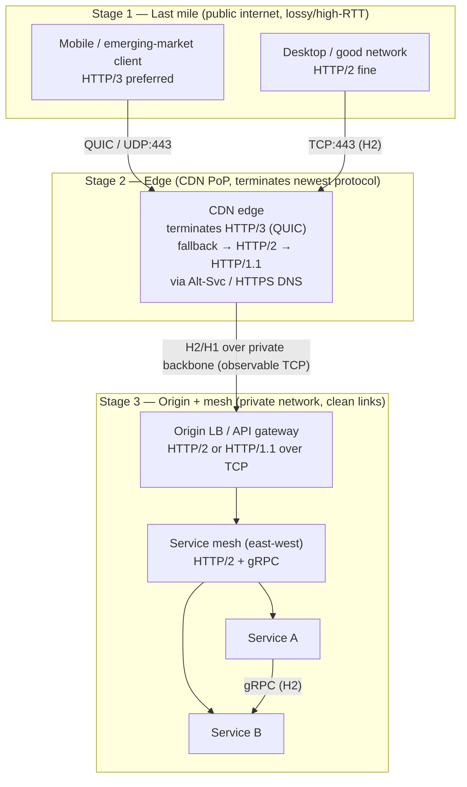

# HTTP Evolution (1.1 / 2 / 3 / QUIC) — Staff / Principal Level

At Staff/Principal level, HTTP versioning stops being a protocol topic and becomes a **fleet strategy** question: which version you terminate where, what it costs in CPU and observability, who is allowed to decide, and how you prove the win with real-user data instead of synthetic benchmarks. This document treats HTTP evolution along the organizational axis — cost, benefit, governance, and rollout — not as more wire-format theory.

## Table of contents

1. [The strategic reframe: versions are a fleet decision](#1-the-strategic-reframe-versions-are-a-fleet-decision)
2. [Cost/benefit of adopting HTTP/2 org-wide](#2-costbenefit-of-adopting-http2-org-wide)
3. [Cost/benefit of adopting HTTP/3 and QUIC org-wide](#3-costbenefit-of-adopting-http3-and-quic-org-wide)
4. [Where to terminate which version: edge vs origin vs mesh](#4-where-to-terminate-which-version-edge-vs-origin-vs-mesh)
5. [The protocol-topology diagram (staged)](#5-the-protocol-topology-diagram-staged)
6. [Per-tier "which HTTP version where" strategy table](#6-per-tier-which-http-version-where-strategy-table)
7. [Vendor, CDN, and proxy support as a gating constraint](#7-vendor-cdn-and-proxy-support-as-a-gating-constraint)
8. [The ossification and observability tradeoff](#8-the-ossification-and-observability-tradeoff)
9. [Protocol governance: ownership, RUM, and when to stop](#9-protocol-governance-ownership-rum-and-when-to-stop)
10. [Rollout playbook and failure modes](#10-rollout-playbook-and-failure-modes)
11. [Staff-level takeaways](#11-staff-level-takeaways)

---

## 1. The strategic reframe: versions are a fleet decision

A junior engineer asks "is HTTP/3 faster?" The honest Staff answer is "faster for *whom*, measured *how*, and paid for by *which budget*?" HTTP/2 and HTTP/3 both deliver real latency wins, but the wins are unevenly distributed across your user base and the costs are unevenly distributed across your engineering org. The strategic job is to route the benefit to the users who need it while containing the cost to the tiers that can absorb it.

Three facts drive every decision below:

- **The benefit is concentrated at the edge and on bad networks.** Head-of-line-blocking elimination (HTTP/2 multiplexing, HTTP/3 stream independence) and QUIC's 0/1-RTT handshake matter most on high-latency, lossy, mobile, and emerging-market links. On a clean 5 ms datacenter link between two of your own services, the wire-level win rounds to zero.
- **The cost is concentrated in engineering and operations.** New protocols mean new CPU profiles (QUIC's userspace stack, per-packet encryption), new failure modes, new tooling gaps, and — critically — **reduced network observability**. Encrypted UDP is harder to inspect than cleartext-framed TCP.
- **The decision surface is large.** "Adopt HTTP/3" is not one decision. It is a matrix of {tier} × {version} × {who terminates it}. Treating it as a single flag is how orgs end up with HTTP/3 to origin servers that gain nothing and a debugging blind spot they didn't budget for.

The rest of this document works that matrix.

## 2. Cost/benefit of adopting HTTP/2 org-wide

HTTP/2 is the *easy* half of this decision and is, for most orgs, a settled default at the edge. But "settled" is not "free," and internal adoption still deserves scrutiny.

**The benefits are real and mostly at the edge:**

- **Multiplexing over one TCP connection** removes the per-domain connection limit and the overhead of many TLS handshakes. For a page pulling dozens of small assets from one origin, this is a measurable first-paint improvement.
- **Header compression (HPACK)** shrinks the redundant, verbose header sets that dominate small API requests — a genuine win for chatty mobile clients.
- **Server push** was the headline feature and has been effectively abandoned (Chrome removed support); do not build strategy around it.

**The costs are modest but non-zero:**

- **TCP head-of-line blocking survives.** HTTP/2 multiplexes streams over *one* TCP connection, so a single lost packet stalls *all* streams until retransmission. On lossy networks, HTTP/2 can be *slower* than HTTP/1.1 with its six parallel connections. This is precisely the problem HTTP/3 exists to solve, and it is why "HTTP/2 everywhere" is not automatically correct.
- **Priority handling is a known weak spot.** The original RFC 7540 priority scheme was complex, poorly implemented, and largely replaced by the simpler RFC 9218 Extensible Priorities. Implementations vary; don't assume your proxy honors client priorities well.
- **Connection coalescing surprises.** HTTP/2 will reuse one connection for multiple hostnames sharing a certificate, which can defeat sharding assumptions and confuse per-host rate limits.

**Where the internal case is weak:** for east-west service-to-service traffic on clean links, HTTP/2's multiplexing win is small in absolute milliseconds. The real reason HTTP/2 dominates *internally* is **gRPC**, which mandates HTTP/2 as its transport. If you run gRPC, you run HTTP/2 in the mesh whether or not you reasoned about it as an "HTTP version decision." That's fine — just know the driver is the RPC framework, not raw latency.

## 3. Cost/benefit of adopting HTTP/3 and QUIC org-wide

HTTP/3 runs over **QUIC**, a userspace transport on top of UDP with TLS 1.3 built in. This is where the cost/benefit analysis gets genuinely hard.

**Benefits — and who actually receives them:**

- **True stream independence.** QUIC eliminates TCP head-of-line blocking: a lost packet stalls only the stream it belonged to, not every concurrent request. This is the single biggest win, and it is **worth the most on lossy, high-latency links** — mobile, congested Wi-Fi, and emerging-market infrastructure.
- **Faster handshakes.** QUIC folds transport and TLS setup into one round trip (1-RTT), and **0-RTT** resumption lets returning clients send data in the first packet. On a 200 ms RTT mobile link, saving a round trip is a *visible* latency reduction.
- **Connection migration.** A QUIC connection is identified by a connection ID, not the 4-tuple, so a client can switch from Wi-Fi to cellular without dropping the connection. This is a real UX win for mobile apps.

These benefits explain why measured RUM improvements from HTTP/3 are disproportionately large in the **p75–p95 tail and in emerging markets**, while the p50 on good networks barely moves.

**Costs — and who pays them:**

- **CPU.** QUIC runs in userspace and encrypts every packet (not just the payload of a framed stream). Without kernel offload (UDP GSO/GRO, and increasingly hardware crypto offload), HTTP/3 can consume **noticeably more CPU per byte** than TCP+TLS, which enjoys decades of kernel and NIC optimization. At CDN-edge scale this is a line item, not a rounding error.
- **UDP is deprioritized and sometimes blocked.** Some middleboxes, corporate firewalls, and mobile carriers throttle or drop UDP. HTTP/3 therefore requires a **robust fallback to HTTP/2 over TCP** (via the `Alt-Svc` header or the HTTPS/SVCB DNS record). You never ship HTTP/3 *instead of* HTTP/2 — you ship it *in addition to*.
- **Observability regression.** This is the cost engineers underestimate. See [§8](#8-the-ossification-and-observability-tradeoff).
- **Operational immaturity.** Fewer engineers can debug QUIC. Load balancers, WAFs, and packet-capture tooling all needed to catch up. The talent and tooling cost is real even when the software supports it.

**The honest summary:** HTTP/3 is a **strong yes at the CDN edge for a global consumer audience**, a **maybe for internal north-south**, and a **usually-no for east-west mesh traffic** on clean networks where the win is invisible and the CPU/observability cost is pure downside.

## 4. Where to terminate which version: edge vs origin vs mesh

The central architectural insight: **you terminate the newest, most user-facing-optimized protocol at the point closest to the user, and you fall back to boring, observable, well-understood protocols behind it.** The version a client negotiates does not need to be the version spoken on every internal hop.

**At the CDN / edge:** terminate **HTTP/3 (QUIC)** for external clients, advertising it via `Alt-Svc` / HTTPS DNS records, with automatic fallback to **HTTP/2** and then **HTTP/1.1**. This is where the last-mile latency win lives. The CDN vendor absorbs the QUIC CPU cost and the connection-migration complexity — a strong argument for buying rather than building the edge.

**Edge → origin:** speak **HTTP/2** or even **HTTP/1.1**. This hop is over clean, high-bandwidth, low-loss networks (often the CDN's private backbone). QUIC's benefits mostly vanish here, while its costs (CPU, observability loss) remain. Keeping this hop on TCP means your origin fleet stays inspectable and cheap. Persistent, pooled HTTP/2 connections from edge to origin are the sweet spot.

**Internal service mesh (east-west):** **HTTP/2**, almost always via **gRPC**. The driver is the RPC framework and multiplexing over long-lived connections, not last-mile latency. Running QUIC in the mesh buys you nothing on a 1 ms link and costs you the ability to trivially packet-capture between services during an incident.

**The load-bearing principle:** protocol choice is **per-hop**, and each hop optimizes for its own network conditions. The client's fancy HTTP/3 connection and the origin's plain HTTP/1.1 connection are both correct — they are solving different problems on different networks.

## 5. The protocol-topology diagram (staged)

The topology is best understood in three stages: what the user connects to, what the edge does, and what happens internally.

Read the diagram as a **cost gradient**: protocol novelty (and the CPU/observability cost that comes with it) is highest at Stage 2, where a vendor absorbs it and the user benefit is highest, and drops to near-zero by Stage 3, where you keep everything boring and inspectable.

## 6. Per-tier "which HTTP version where" strategy table

| Tier | Recommended version | Primary driver | What you gain | What you pay | When to reconsider |
|------|--------------------|----------------|---------------|--------------|--------------------|
| **Public client ↔ CDN edge** | HTTP/3 (QUIC), fall back H2 → H1.1 | Last-mile RUM: mobile & emerging markets | 0/1-RTT, no HoL blocking, connection migration | CDN CPU, `Alt-Svc` complexity, edge observability loss | If audience is desktop-only on good networks, H2 is enough |
| **Edge ↔ origin** | HTTP/2 (or H1.1) over TCP | Clean private link; keep origin inspectable | Multiplexed pooled connections, cheap CPU, full packet visibility | Retains TCP HoL blocking (irrelevant on clean link) | Only move to H3 if this hop crosses a lossy public segment |
| **North-south API gateway** | HTTP/2 | Multiplexing, header compression | Efficient chatty API traffic | Minor priority/coalescing quirks | Rarely — H3 here adds cost without user-visible win |
| **East-west service mesh** | HTTP/2 + gRPC | RPC framework mandate | Long-lived multiplexed streams, gRPC ecosystem | gRPC operational surface | If not on gRPC and links are trivial, H1.1 is fine |
| **Internal batch / bulk transfer** | HTTP/1.1 | Simplicity, throughput | Trivially debuggable, mature tooling | No multiplexing (doesn't matter for bulk) | Almost never |
| **Third-party webhooks / callbacks out** | HTTP/1.1 or H2 (whatever peer supports) | Interop, lowest common denominator | Maximum compatibility | You don't control peer's stack | Match whatever the receiver reliably accepts |

The pattern is deliberate: **newest protocol only where the user's network is bad and a vendor absorbs the cost; boring protocol everywhere the network is good and you own the debugging.**

## 7. Vendor, CDN, and proxy support as a gating constraint

HTTP/3 adoption is frequently **gated not by your ambition but by your dependency chain**. A single component that doesn't speak QUIC can block the whole path or silently degrade you to HTTP/2.

**The components that gate you:**

- **CDN provider.** HTTP/3 at the edge is essentially a *config toggle* on major CDNs today — this is the strongest argument for buying the edge. The vendor has already paid the QUIC CPU-optimization and tooling cost across their whole customer base.
- **Load balancers.** Cloud L7 load balancers vary: some support HTTP/3 to clients, some only to a point. A load balancer that terminates only HTTP/2 caps your external protocol at H2 regardless of client capability.
- **WAF / security appliances.** Many inline security tools historically inspected TCP/TLS and were blind to or incompatible with QUIC. If your WAF can't see HTTP/3, security may *veto* enabling it — a governance conflict, not a technical one.
- **Reverse proxies.** Nginx gained HTTP/3 relatively late and behind a build flag for a while; Envoy, HAProxy, and Caddy each had their own timelines and caveats. "Does our proxy support it" must be verified per-version, not assumed.
- **Client / SDK support.** Browsers broadly support HTTP/3; your **native mobile SDK's HTTP client** may not, or may not enable it by default. Since mobile is exactly where HTTP/3 pays off most, the client library is often the real bottleneck.

**How this shapes rollout:** you enumerate the full path — client SDK → DNS/`Alt-Svc` → CDN → LB → WAF → proxy → origin — and the protocol you can actually deliver is the **minimum capability across that chain**. Rollout sequencing is therefore "upgrade the gating component first," and the gate is usually a security appliance or a mobile SDK, not the servers.

> 🎞️ **See it animated:** [HTTP/1.1 vs HTTP/2 vs HTTP/3 multiplexing & head-of-line blocking](https://http3-explained.haxx.se/)

## 8. The ossification and observability tradeoff

This is the cost that separates a Staff-level analysis from a naïve one. HTTP/3's encryption is not just of payloads — **QUIC encrypts most of the transport header itself**, and it runs over UDP. Two consequences follow.

**Anti-ossification (the intended benefit):** because middleboxes cannot read or "help with" QUIC's internals, they cannot ossify against them the way they did against TCP. TCP evolution stalled for years because firewalls and NATs made assumptions about TCP framing and dropped anything unexpected. QUIC's encrypted, versioned transport is deliberately opaque so it can *keep evolving* without middlebox interference. This is a genuine long-term architectural win.

**Observability regression (the cost you pay for it):** everything that made TCP opaque to middleboxes *also* makes QUIC opaque to **your own tooling**.

- **Passive packet capture is mostly useless.** You can `tcpdump` a QUIC flow, but the sequence numbers, ACKs, and stream framing are encrypted. The rich TCP-level debugging your on-call has relied on for two decades does not translate.
- **Layer-4 middlebox tricks break.** Anything that inferred connection state, retransmit behavior, or per-request boundaries from cleartext TCP/TLS headers now sees an opaque UDP stream.
- **You must move observability up the stack.** Debugging QUIC means **application-level telemetry** (structured logs, distributed traces, and the QUIC-specific `qlog`/`qvis` format) rather than the network layer. If your incident-response muscle memory is packet-capture-first, HTTP/3 quietly degrades your MTTR until you retool.
- **UDP flow analysis in your NDR/security stack** may be weaker than TCP flow analysis, which is exactly why security teams push back.

**The tradeoff, stated plainly:** HTTP/3 trades *your* ability to inspect the wire for *the protocol's* freedom to evolve and *the user's* latency. That trade is clearly worth it at the CDN edge (vendor tooling, huge user benefit) and clearly *not* worth it inside your own mesh, where you gain no latency and lose the packet-capture debugging you actually use during incidents. The observability cost is a first-class reason the internal answer is usually "stay on TCP."

## 9. Protocol governance: ownership, RUM, and when to stop

Someone must **own** the HTTP-version decision, or it fragments: one team enables HTTP/3 on their service, security wasn't consulted, the WAF goes blind, and an incident later nobody remembers why. Governance is the antidote.

**Who owns it.** Protocol strategy belongs to a **platform/networking/edge team**, not to individual product teams. Product teams consume a paved road ("terminate at the edge, we handle the version negotiation"); they do not each pick a transport. The owning team holds three responsibilities: (1) the per-tier version policy in §6, (2) the vendor/proxy capability matrix in §7, and (3) the observability retooling in §8.

**How you measure the win — RUM, not synthetic.** Synthetic benchmarks in a lab will *always* make HTTP/3 look good; they run on clean or artificially-lossy networks you chose. The only honest measure is **Real User Monitoring** segmented by the dimensions where the benefit concentrates:

- Segment by **network type** (cellular vs Wi-Fi vs wired), **geography** (emerging markets vs well-connected regions), and **percentile** (the p75–p95 tail, not p50).
- Watch **connection-establishment time**, **time-to-first-byte**, and **Core Web Vitals (LCP)** — and watch the **HTTP/3 negotiation/fallback rate** so you know how many users actually got H3 versus fell back to H2.
- Guard against regressions: a rise in fallback rate or a p95 that *worsens* for a region signals a middlebox or CPU problem, not a win.

**When the complexity isn't worth it.** Codify explicit "don't bother" criteria so teams aren't tempted to over-adopt:

- **Internal-only traffic on clean links** — the latency win is invisible; keep TCP for observability.
- **Desktop-heavy audiences on good networks** — HTTP/2 captures nearly all the benefit at a fraction of the cost.
- **When you can't retool observability** — shipping HTTP/3 you can't debug is a net negative during incidents.
- **When a gating component (WAF/SDK) blocks the full path** — partial HTTP/3 that silently falls back for most users is complexity without payoff.

Governance turns "should we adopt HTTP/3?" from a religious argument into a **RUM-instrumented, tier-scoped, vendor-gated decision with a named owner** — which is the whole point.

## 10. Rollout playbook and failure modes

A disciplined rollout treats protocol upgrade like any risky infrastructure change: gated, measured, reversible.

1. **Baseline first.** Instrument RUM segmented by network/geo/percentile *before* touching anything. Without a baseline you cannot prove the win, and unproven wins get reverted the first time CPU spikes.
2. **Enable at the edge only.** Turn on HTTP/3 at the CDN for a small traffic slice (a region or a percentage), with `Alt-Svc` fallback intact. Keep edge→origin on HTTP/2. Nothing internal changes.
3. **Verify the fallback path works.** The most common failure: a middlebox drops UDP, and clients that *should* fall back to H2 instead hang or slow down. Explicitly test the "UDP blocked" case; a broken fallback is worse than never enabling H3.
4. **Watch CPU and fallback rate, not just latency.** A latency win that doubles edge CPU cost may still be the right call — but it must be a *decision*, not a surprise on the bill.
5. **Expand by segment.** Roll out to the segments where RUM shows the biggest tail improvement (mobile, emerging markets) first; those are where benefit most exceeds cost.
6. **Leave internal traffic alone** unless a specific hop crosses a lossy public network.

**Failure modes to name in the runbook:**

- **Silent fallback masquerading as success.** Everyone thinks they're on H3; RUM shows 70% negotiated H2. The feature "works" but delivers a fraction of the expected benefit.
- **Observability gap discovered mid-incident.** On-call reaches for `tcpdump`, finds encrypted UDP, and MTTR balloons. Retool *before* rollout, not during the postmortem.
- **CPU regression at scale.** Fine in canary, painful at 100% because per-packet crypto without GSO/GRO offload doesn't amortize. Load-test with realistic connection churn.
- **Security veto after the fact.** WAF can't inspect QUIC; security disables it unilaterally. Involve security in step 1, not step 6.

## 11. Staff-level takeaways

- **Protocol version is a per-hop, per-tier decision, not a global flag.** Terminate the newest protocol closest to the user; speak boring, observable protocols behind it.
- **The benefit of HTTP/2 and HTTP/3 is concentrated on bad networks and at the tail** — mobile, emerging markets, p75–p95. Prove it with segmented RUM, never synthetic benchmarks.
- **HTTP/3 belongs at the CDN edge**, where a vendor absorbs the QUIC CPU cost and the user benefit is highest — and **usually does not belong in your mesh**, where you gain no latency and lose packet-capture debugging.
- **The observability regression is a first-class cost.** Encrypted UDP is opaque to your own tooling; retool to app-level telemetry and `qlog` before you ship, or accept slower incident response.
- **Vendor/CDN/proxy/SDK support gates you**; deliverable protocol is the minimum capability across the whole path, and the gate is usually a security appliance or a mobile SDK, not the servers.
- **Governance is mandatory.** One named owner, one per-tier policy, one RUM measurement standard, and explicit "don't bother" criteria for internal traffic — that's how you get the wins without the fragmentation.

*Next step:* [Interview questions](interview.md)