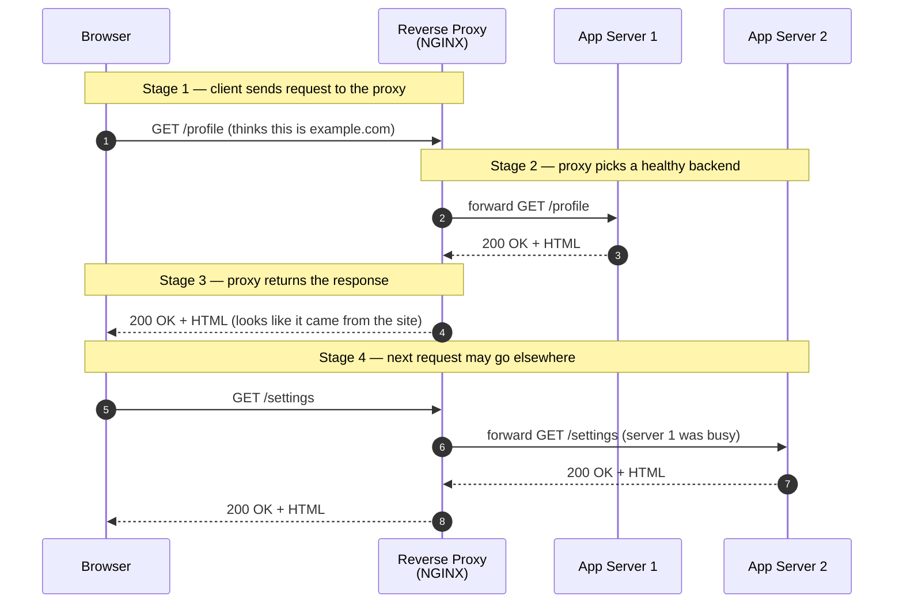
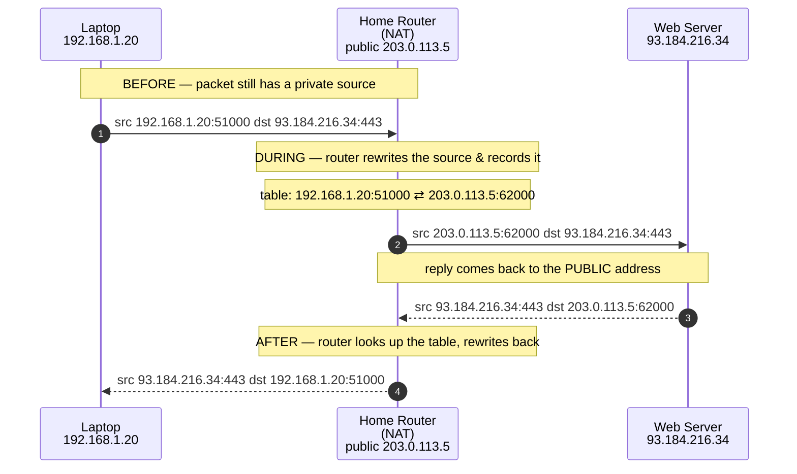

# Network Proxies & NAT — Junior

<!-- level-focus -->
At junior level, focus on this question:

> How can I apply **Network Proxies & NAT** in one small example and prove the result?

Use the smallest realistic scenario that exposes the decision and its failure behavior.
## 1. The one-sentence version

- A **proxy** is a server that sits in the middle of a conversation and passes messages along on someone's behalf. It talks to the outside world *for* one of the two parties.
- **NAT** (Network Address Translation) is a router trick that lets many devices with *private* addresses share **one public address**, rewriting the addresses on packets as they go out and come back.

Both are about **who the outside world actually sees**. A proxy hides *which server (or client)* you are really talking to. NAT hides *how many devices* are actually behind one address.

---

## 2. Why a middleman at all?

Direct connections are simple: your laptop opens a connection straight to a website, and they exchange data. That works, but real networks want more than "it works." They want:

- **Control** — a company may want to block certain sites, or log which employee visited what.
- **Protection** — a website owner does not want the whole internet reaching the app server directly; they want a guard in front.
- **Sharing** — a home has one internet connection (one public address) but ten devices that all need to reach the internet.
- **Speed** — a middleman can keep a **cache** of popular responses and hand them back instantly instead of fetching them again.

A middleman gives you a single place to add these behaviors *without* changing every client or every server. That is the whole appeal: **one chokepoint you control**. Proxies solve the control/protection/speed problems; NAT solves the sharing problem.

---

## 3. Forward proxy — a middleman for clients

A **forward proxy** sits **in front of the clients**. The clients are configured to send their requests *to the proxy* instead of directly to the destination. The proxy then makes the request on their behalf and passes the response back.

From the destination server's point of view, the request came from the **proxy**, not from the real user. The proxy *represents the client* and *hides* who the client really is.

Where you see forward proxies:

- **Corporate web filter** — a company routes all employee web traffic through a proxy that blocks disallowed sites, scans for malware, and logs activity.
- **School or library filters** — same idea, to enforce an acceptable-use policy.
- **Caching proxy** — an ISP or office keeps copies of frequently requested files so repeat requests are served locally and faster.
- **Privacy tools** — some services let a user route traffic through a proxy so websites see the proxy's address, not the user's.

The defining trait: **the client knows it is using a proxy** (it was configured to), and the proxy exists to serve the *client side* of the connection.

```
[ Employee laptop ]  ---->  [ Forward proxy (company) ]  ---->  [ Any website ]
   the real client            represents & filters                sees the proxy,
                              the client                          not the laptop
```

---

## 4. Reverse proxy — a middleman for servers

A **reverse proxy** sits **in front of the servers**. Clients on the internet think they are talking to *the website*, but they are actually talking to the reverse proxy. The proxy then forwards the request to one of the real servers behind it and returns the answer.

From the client's point of view, the reverse proxy *is* the website. The proxy *represents the server* and *hides* the real servers behind it.

Where you see reverse proxies:

- **NGINX / HAProxy in front of app servers** — the classic setup: one reverse proxy accepts all incoming requests and spreads them across several identical app servers.
- **Load balancer** — a reverse proxy that distributes traffic so no single server is overwhelmed.
- **CDN (Content Delivery Network)** — a huge reverse-proxy network (Cloudflare, Fastly, CloudFront) that sits in front of a website, caches its content close to users, and shields the origin.
- **TLS termination** — the reverse proxy handles the HTTPS encryption so the app servers behind it can stay simpler.

The defining trait: **the client does not know it is talking to a proxy** — it just requested `example.com`. The proxy exists to serve the *server side* of the connection.

```
[ Any visitor ]  ---->  [ Reverse proxy (NGINX/CDN) ]  ---->  [ App server 1 ]
  thinks it's             represents the servers,               [ App server 2 ]
  talking to the site     hides & protects them                 [ App server 3 ]
```

---

## 5. A request through a reverse proxy, step by step

Here is a single HTTP request travelling through a reverse proxy that is load-balancing across two app servers. Notice the browser never talks to an app server directly.



What the diagram shows:

- The browser only ever knows about the **proxy**. It never learns that Server 1 and Server 2 exist.
- The proxy is free to send the first request to Server 1 and the second to Server 2 — this is **load balancing**.
- If Server 1 crashes, the proxy simply stops sending it traffic. The browser sees nothing broken. That is a big part of why reverse proxies are everywhere.

---

## 6. Forward vs reverse proxy — comparison

Both are "a proxy," and both physically pass traffic through a middle box. The difference is **which side they represent** and **who knows they exist**.

| Aspect | Forward proxy | Reverse proxy |
| --- | --- | --- |
| Sits in front of | The **clients** | The **servers** |
| Represents / hides | The client (hides who the user is) | The server (hides the real backends) |
| Who is configured to use it | The **client** is set up to point at it | Nobody on the client side — it is transparent |
| The destination server sees | The proxy's address, not the user's | (Client talks to the proxy; backends see the proxy) |
| The client thinks it is talking to | A proxy it chose to use | The real website |
| Typical goal | Filtering, logging, access control, privacy, caching for users | Load balancing, protecting origins, TLS, caching for the site |
| Everyday example | Corporate web filter, school content filter | NGINX in front of app servers, CDN, load balancer |
| Who owns it, usually | The **client's** organization | The **server's** organization |

A memory hook: a **forward** proxy faces **outward on behalf of clients**; a **reverse** proxy faces **inward on behalf of servers**. Same box, opposite job.

---

## 7. NAT — one public address for many devices

Now to the second idea, which is not a proxy at all.

Your home has many devices — phones, laptops, a TV, a game console — but your internet provider usually gives you **one public IP address**. So how do ten devices share one address?

The answer is **NAT (Network Address Translation)**, run by your router. Each device on your home network gets a **private IP** (like `192.168.1.20`) that only means something inside your house. When a device sends a packet to the internet, the router **rewrites the source address** from the private one to the single public one before the packet leaves. When the reply comes back, the router **rewrites it back** to the right private device.

To pull this off, the router keeps a **translation table** (also called a NAT table). Because many devices — or even the same device with many connections — share one public address, the router also tracks the **port numbers** so it can tell the connections apart. This common flavor is called **PAT** (Port Address Translation) or "NAT overload," and it is what almost every home router does.

Why NAT exists:

- **There are not enough public IPv4 addresses** for every device on Earth. NAT lets one address cover a whole household or office.
- It gives a **side benefit of privacy/safety**: unrequested traffic from the internet has no matching table entry, so it does not automatically reach your devices.

---

## 8. NAT translation, before → during → after

Below, laptop `192.168.1.20` opens a connection to a web server at `93.184.216.34`. The home router's public address is `203.0.113.5`. Watch the source address change as the packet crosses the router, and change back on the reply.



Reading the three stages:

- **Before** — the laptop sends a packet whose source is its private address `192.168.1.20`. This address is meaningless on the public internet.
- **During** — the router replaces the source with its own public address `203.0.113.5` (and a chosen port `62000`), and writes a line into its NAT table linking the two.
- **After** — the web server replies to `203.0.113.5:62000` because that is all it ever saw. The router looks up that entry, rewrites the destination back to `192.168.1.20:51000`, and delivers the reply to the correct laptop.

The web server never knew the laptop's private address existed. It only ever talked to the router's public address — which is exactly how ten devices can share one.

---

## 9. Private vs public IP addresses

NAT only makes sense once you know the two kinds of addresses.

| | Private IP | Public IP |
| --- | --- | --- |
| Where it is valid | Only inside a local network | Everywhere on the internet |
| Who assigns it | Your router (usually) | Your internet provider / registry |
| Uniqueness | Reused in millions of homes | Globally unique |
| Example ranges | `10.x.x.x`, `172.16–31.x.x`, `192.168.x.x` | e.g. `203.0.113.5`, `93.184.216.34` |
| Reachable from the internet directly? | No | Yes |

Millions of homes use `192.168.1.1` for their router — that is fine, because private addresses only have to be unique *within one network*. NAT is the bridge that turns "not-unique inside" into "one-unique outside."

---

## 10. How proxies and NAT relate

They are easy to confuse because both sit in the middle and both change what the outside world sees. But they operate at different levels and for different reasons:

- **NAT rewrites addresses on packets.** It does not understand what the traffic *is* — it just swaps source/destination fields so many devices share one public address. It is mostly automatic and invisible.
- **A proxy understands the traffic** (often HTTP requests) and can make decisions about it — cache it, block it, route it to a specific backend, log it, add headers. It is a deliberate service someone runs.

You can absolutely have both at once. A typical request from your work laptop might: leave through a **forward proxy** (company filter), cross a **NAT** router (to reach the internet on a shared public address), and arrive at a website that lives behind a **reverse proxy / CDN**. Three middlemen, three different jobs, one page load.

| | NAT | Proxy |
| --- | --- | --- |
| Works on | IP addresses & ports | Application requests (e.g. HTTP) |
| Main purpose | Share one public address among many devices | Control, protect, balance, or cache traffic |
| Understands the content? | No | Yes |
| Usually configured by | Nobody — router does it automatically | An admin who runs the proxy on purpose |
| Everyday example | Home router | Company filter (forward) / NGINX (reverse) |

---

## 11. Everyday examples you can point to

- **Your home Wi-Fi router** — does NAT for every device in your house. All your gadgets share the one public address your ISP gave you.
- **A company laptop that routes all web traffic through `proxy.company.com:8080`** — that is a **forward proxy** filtering and logging your browsing.
- **`example.com` served through Cloudflare** — Cloudflare is a **reverse proxy / CDN** sitting in front of the real origin server, caching content and shielding it.
- **NGINX spreading traffic across three app servers** — a **reverse proxy** doing load balancing.
- **A school network blocking social media** — a **forward proxy** enforcing policy.
- **Your office having one public IP but 200 employees online** — **NAT (PAT)** letting them all share it.

---

## 12. Common misconceptions

- **"A proxy and NAT are the same thing."** No. NAT rewrites addresses at the packet level and does not read your requests. A proxy is a service that reads and acts on the traffic. They often appear together but do different jobs.
- **"Forward and reverse proxies are opposites of each other's traffic direction."** Both forward requests *outbound to a destination*. The difference is *whose side they represent* (clients vs servers) and *who knows they exist* — not the direction packets flow.
- **"NAT is a firewall."** NAT gives a *side benefit* (unrequested inbound traffic has no table entry) but it is not designed as a security control. A real firewall is a separate, deliberate thing.
- **"A reverse proxy means the site has only one server."** Usually the opposite — a reverse proxy exists precisely so there can be *many* backend servers hidden behind one address.
- **"My private IP is what websites see."** They see your router's *public* IP (after NAT), or a proxy's IP if you use one. Your `192.168.x.x` never leaves your home network.

---

## 13. Key terms

- **Proxy** — a server that relays traffic on behalf of another party, sitting in the middle of a connection.
- **Forward proxy** — a proxy in front of *clients*; represents and hides the client. Clients are configured to use it.
- **Reverse proxy** — a proxy in front of *servers*; represents and hides the backends. Clients think it is the real site.
- **Load balancer** — a reverse proxy that spreads incoming requests across multiple servers.
- **CDN** — a global reverse-proxy network that caches content near users and shields origin servers.
- **NAT (Network Address Translation)** — a router rewriting private addresses to a shared public address (and back).
- **PAT / NAT overload** — the common NAT flavor that also tracks port numbers so many connections share one public IP.
- **Private IP** — an address (`10.x`, `172.16–31.x`, `192.168.x`) valid only inside a local network.
- **Public IP** — a globally unique address reachable from the internet.
- **NAT table** — the router's record linking each private connection to its public-address/port mapping.
- **TLS termination** — a reverse proxy handling HTTPS encryption so backends do not have to.

---

## 14. Quick recap

- A **proxy** is a deliberate middleman for traffic. A **forward** proxy sits in front of **clients** and represents them (corporate filter); a **reverse** proxy sits in front of **servers** and represents them (NGINX, CDN, load balancer).
- The client *knows* it uses a forward proxy but *does not know* about a reverse proxy — to it, the reverse proxy *is* the site.
- **NAT** is a router rewriting **private IPs to one shared public IP**, tracking connections in a table so replies return to the right device. It is why one home connection serves many gadgets.
- NAT works on **addresses and ports** and is automatic; a proxy works on **requests** and is run on purpose. One page load can pass through a forward proxy, NAT, and a reverse proxy — three middlemen, three jobs.

*Next step:* [Middle level](middle.md)

---

## Apply it

1. Choose one small, known input for **Network Proxies & NAT**.
2. Predict the output or observable behavior.
3. Run the smallest example or probe that exercises the concept.
4. Change one input to trigger a failure or boundary case.
5. Explain the evidence using the guide's vocabulary.

## Verify your work

- Record the exact input, command or code path, and output.
- Repeat the probe and confirm the result is consistent.
- Show one expected success and one expected failure.
- Resolve any difference between the prediction and the evidence.

## Review questions

- What problem does Network Proxies & NAT solve in the example?
- Which input changes the observed result, and why?
- What is the smallest useful success check?
- Which beginner mistake would your evidence catch?
