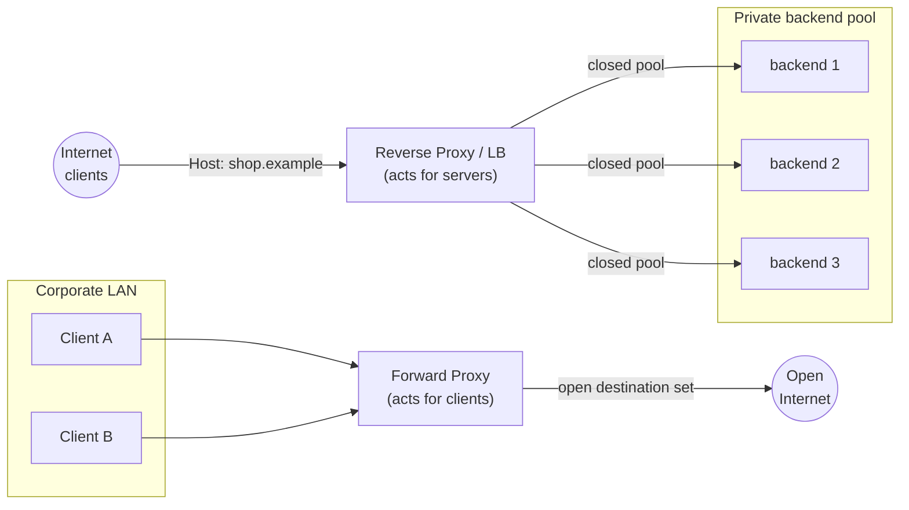
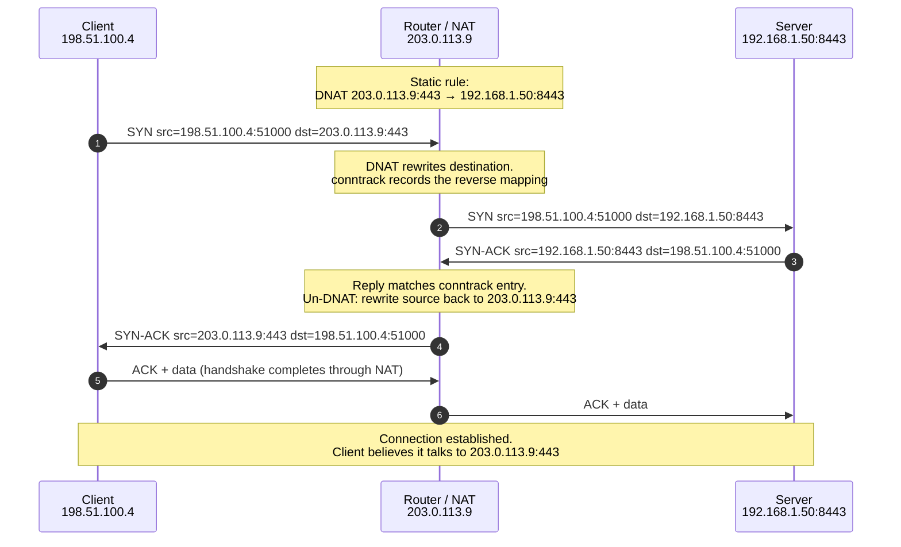

# Network Proxies & NAT — Middle

<!-- level-focus -->
At middle level, focus on this question:

> Where does **Network Proxies & NAT** belong in a maintainable component, and which trade-off selects the design?

Use the smallest realistic scenario that exposes the decision and its failure behavior.
## 1. Forward proxy vs reverse proxy vs load balancer

All three are middleboxes that terminate a client connection and open a new one toward some upstream. The difference is *who they act on behalf of* and *what they know at connection time*.

**Forward proxy.** Acts on behalf of the *client*. The client is configured (explicitly, via `HTTP_PROXY`, or transparently via routing) to send its traffic to the proxy, and the proxy reaches out to arbitrary destinations on the client's behalf. The proxy knows the client; the origin server does not (it sees the proxy's IP). Classic uses: corporate egress control, content filtering, caching outbound web traffic, and anonymizers. The destination set is *open* — a forward proxy can be asked to fetch anything.

**Reverse proxy.** Acts on behalf of the *server*. Clients on the internet believe they are talking to the origin, but they actually terminate at the reverse proxy, which forwards to a fixed, private pool of backends it controls. The client does not know the backend; the backend often does not know the real client (that is §6). The destination set is *closed* — a reverse proxy only routes to backends its operator configured. Classic uses: TLS termination, WAF, request routing by path/host, response caching, and hiding backend topology.

**Load balancer.** A *role*, not a distinct box. A load balancer distributes incoming connections across a pool of equivalent backends using an algorithm (round-robin, least-connections, consistent hashing) plus health checks. The crucial insight: **a reverse proxy that spreads traffic across a backend pool _is_ a load balancer.** The two terms describe overlapping capability sets. What separates a "pure" LB from a reverse proxy is layer and statefulness:

- An **L4 load balancer** operates on TCP/UDP (IP:port). It may not even parse HTTP; it can forward or even DSR (direct server return) packets without terminating the connection. Think of AWS NLB or a bare IPVS setup.
- An **L7 reverse proxy / LB** terminates the connection, parses the application protocol, and can route on Host header, path, cookies, or JWT claims. Think nginx, Envoy, HAProxy in HTTP mode, AWS ALB.

So the honest mental model is a spectrum, not three disjoint boxes: *forward proxy* faces the client and reaches the open internet; *reverse proxy* faces the internet and reaches a closed pool; *load balancing* is the pool-distribution behavior that a reverse proxy (or an L4 box) may add on top.

## 2. The comparison, side by side

| Dimension | Forward proxy | Reverse proxy | Load balancer (as a role) |
|---|---|---|---|
| Acts on behalf of | The client | The server / origin | The server pool |
| Who configures it into the path | The client (env/route/PAC) | The server operator (DNS points at it) | The server operator |
| Destination set | Open (any host) | Closed (fixed backend pool) | Closed (fixed backend pool) |
| Who is hidden | The client, from the origin | The backend topology, from the client | The backend topology |
| Typical layer | L7 (may be L4/SOCKS) | L7 (may terminate TLS) | L4 (IP:port) or L7 |
| Terminates connection? | Yes (or CONNECT tunnel) | Almost always yes | L4: often no (may DSR); L7: yes |
| Sees client IP? | Yes, directly | Yes, at the socket | Yes, at the socket |
| Preserves client IP upstream? | N/A | Only via `X-Forwarded-For`/PROXY protocol | L4 DSR can preserve source IP end-to-end |
| Primary jobs | Egress control, filtering, caching, anonymity | TLS termination, routing, WAF, caching, hiding topology | Distribution, health checks, failover, scaling |
| Failure blast radius | Clients lose internet egress | Whole site is unreachable | Traffic skews or a dead backend keeps receiving |
| Canonical software | Squid, tinyproxy, SOCKS5 | nginx, Envoy, HAProxy, Traefik | HAProxy, IPVS/LVS, Envoy, NLB/ALB |

Read the table as answering one question per row: **"which side of the wire does this box serve?"** Everything else — layer, IP visibility, blast radius — follows from that. If you cannot say whether a box serves clients or servers, you do not yet understand its role.

## 3. NAT variants: SNAT, DNAT, PAT

Network Address Translation rewrites IP addresses (and often ports) as packets cross a boundary, and — critically — records the rewrite in a **connection tracking table** so that reply packets are rewritten back consistently. There are three variants you must be able to distinguish; they differ by *which field* they rewrite and *in which direction* they help.

**SNAT (Source NAT).** Rewrites the *source* address on outbound packets. The canonical case is many private hosts sharing one public IP: as each packet leaves the boundary, its private source `10.0.0.7` is rewritten to the public `203.0.113.9`. Replies arrive addressed to `203.0.113.9` and the conntrack table maps them back to `10.0.0.7`. SNAT enables **outbound sharing**. In Linux, `MASQUERADE` is SNAT to whatever the egress interface's current address happens to be.

**DNAT (Destination NAT).** Rewrites the *destination* address on inbound packets. A packet arriving at public `203.0.113.9:443` is rewritten so its destination becomes private `10.0.0.20:8443`, delivering it to an internal host that has no public address of its own. DNAT enables **inbound reachability** — it is the mechanism behind port forwarding and behind every cloud "public IP → private instance" mapping.

**PAT / NAPT (Port Address Translation, a.k.a. NAT overload).** This is SNAT *plus port rewriting* so that a single public IP can be shared by thousands of internal connections simultaneously. The table key is not just `(private IP, private port)` but the full tuple `(src IP, src port, dst IP, dst port, proto)`, and the box also rewrites the *source port* to keep every mapping unique. This is the everyday home-router case: dozens of devices, one public IP, disambiguated purely by rewritten source ports. When people say "NAT" at home, they almost always mean PAT/NAPT.

| Variant | Field rewritten | Direction it enables | Table key | Everyday example |
|---|---|---|---|---|
| SNAT | Source IP | Outbound sharing | src IP → mapped IP | Datacenter egress via a NAT gateway |
| DNAT | Destination IP (± port) | Inbound reachability | dst IP:port → internal IP:port | Port-forward `:443` to an internal server |
| PAT / NAPT | Source IP **and** source port | Many-to-one outbound | full 5-tuple | Home router, one public IP for all devices |

The subtlety worth internalizing: SNAT and DNAT are not competing choices — a real boundary usually runs **both directions at once**. Outbound traffic gets SNAT/PAT so internal hosts can reach the internet; specific inbound flows get DNAT so chosen services are reachable. The conntrack table is what makes them coherent: an outbound flow's SNAT entry automatically reverses inbound replies, and an inbound DNAT entry automatically reverses the outbound replies of that same flow.

## 4. Port forwarding and DNAT in stages

Port forwarding is DNAT applied to a single, statically-configured destination tuple. Follow one HTTPS request from an internet client to a server sitting behind a home router with public IP `203.0.113.9`, forwarding `:443` to internal `192.168.1.50:8443`.

Three details from the diagram matter in practice:

1. **The rewrite is on the destination inbound, and reversed on the source outbound.** The server never sees `203.0.113.9`; it sees its own `192.168.1.50:8443` as the local address and the *real* client `198.51.100.4` as the peer. So plain DNAT preserves the client's source IP — a fact people forget when debugging.
2. **The reverse mapping is created automatically by conntrack** when the first packet matches the rule. You configure only the forward direction; the return path is derived. Lose the conntrack entry (table overflow, firewall flush, failover to a stateless standby) and the established connection dies even though the static rule is intact.
3. **Only the forwarded port is reachable.** Any inbound packet to `203.0.113.9` on a port with no DNAT rule has no destination and is dropped. This is why "opening a port" on a home router is exactly one DNAT rule.

## 5. Why NAT breaks inbound connections

The defining limitation of SNAT/PAT: **a mapping only exists after an internal host sends the first outbound packet.** The conntrack entry is created by outbound traffic; without it, an inbound packet arriving at the public IP has nowhere to go, because thousands of internal hosts share that one address and the router cannot guess which one you meant.

Concretely: a laptop behind a home router at `10.0.0.7` can freely open connections *out* — the router SNATs each flow and remembers the reverse mapping. But nothing on the internet can open a connection *in* to that laptop, because:

- there is no public address that resolves to it, and
- even hitting the router's public IP on some port yields no mapping (none was pre-created by outbound traffic), so the packet is dropped.

This is the **peer-to-peer problem**: two hosts both behind NAT cannot directly initiate to each other, because each side's inbound packet arrives before any mapping exists on the other side. It underlies why VoIP, gaming, WebRTC, and file-transfer apps need help.

The mitigations, roughly in order of robustness:

- **Static DNAT / port forwarding** (§4): pre-create the inbound mapping by hand. Works, but requires admin access to the NAT box and a stable internal address — impractical for arbitrary peers.
- **UPnP IGD / NAT-PMP / PCP**: the application asks the router to create a temporary port-forward on demand. Convenient, frequently disabled for security.
- **STUN**: the host asks an external server "what does my mapped public IP:port look like?", learns its own external tuple, and shares it out-of-band so a peer can target it — this is **hole punching**. Works for many NAT types by having both sides send outbound packets nearly simultaneously so each creates a mapping the other's packet can then traverse.
- **TURN (relay)**: when hole punching fails (symmetric NATs, CGNAT), both peers connect *outbound* to a shared relay server, which forwards between them. Always works because it only ever uses outbound flows — but it costs bandwidth and adds a hop.

The unifying principle: since NAT only permits flows that begin outbound, **every P2P-through-NAT technique reduces to making both sides initiate outbound** toward a rendezvous point they both can reach.

## 6. The client-IP problem

Whenever a box *terminates* a client connection and opens a *new* connection upstream, the upstream's socket shows the box's address, not the client's. This is true of any terminating reverse proxy or L7 load balancer: from the backend's point of view, every request appears to come from the proxy's IP.

Why this hurts:

- **Access logs** record the proxy IP for every request, making per-client analysis and abuse tracing impossible.
- **Rate limiting and IP allow/deny lists** collapse — one bucket for the whole world, or you block the proxy and take the site down.
- **Geolocation and fraud signals** see the proxy's location, not the user's.
- **Audit and compliance** requirements that mandate recording the originating IP cannot be met.

Note the contrast with plain DNAT (§4), which *preserves* the source IP because it rewrites only addresses and does not terminate the connection. The client-IP problem is specifically a consequence of **connection termination**, which is why it bites reverse proxies and L7 LBs but not L4 pass-through/DSR balancers or simple port forwards. Add a terminating hop and you lose the client IP unless you deliberately carry it forward.

## 7. Recovering the real client IP

Three mechanisms carry the original client address across a terminating hop. They operate at different layers and have different trust and correctness properties.

**`X-Forwarded-For` (XFF).** A de-facto HTTP header. Each proxy *appends* the client IP it saw, building a left-to-right chain: `X-Forwarded-For: <real client>, <proxy1>, <proxy2>`. The leftmost entry is the original client — *if you trust every hop in between*. Because it is a plain, client-writable header, it is trivially spoofable: a malicious client can send `X-Forwarded-For: 1.2.3.4` and, unless your edge overwrites or strips it, that lie propagates. Companion headers `X-Forwarded-Proto` and `X-Forwarded-Host` carry the original scheme and Host.

**`Forwarded` (RFC 7239).** The standardized replacement for the ad-hoc `X-Forwarded-*` set. One header carries structured key-value pairs: `Forwarded: for=198.51.100.4; proto=https; by=203.0.113.9; host=shop.example`. Same trust model as XFF (still HTTP-layer, still appended per hop), but with a real spec, IPv6-safe syntax (bracketed), and room for `by`/`proto`/`host` in one place. Adoption lags XFF, but it is the correct choice for new designs.

**PROXY protocol (v1/v2).** A transport-layer mechanism, not an HTTP header — so it works for *any* TCP/TLS stream, including non-HTTP protocols and connections the proxy does not decrypt. Immediately after the TCP handshake, the proxy prepends a small header announcing the real source/destination `IP:port` before any application bytes. v1 is human-readable ASCII; v2 is binary and also carries TLS metadata (via TLVs). The backend must be configured to expect and parse it — feed PROXY-protocol bytes to a server that isn't expecting them and it will treat the header as garbage request data. This is the standard way HAProxy, AWS NLB, and Envoy preserve client IP when they do *not* terminate HTTP.

| Mechanism | Layer | Scope | Spoofable by client? | Needs backend awareness? |
|---|---|---|---|---|
| `X-Forwarded-For` | HTTP header | HTTP only | Yes, unless edge strips/overwrites | Reads header (must trust chain) |
| `Forwarded` (RFC 7239) | HTTP header | HTTP only | Yes, same as XFF | Reads header (must trust chain) |
| PROXY protocol v1/v2 | TCP preamble | Any TCP/TLS stream | No (added by proxy, not client) | Yes — must be enabled to parse it |

The load-bearing rule for all three: **trust only what your own edge sets.** At the true edge of your infrastructure, overwrite (do not append to) any incoming `X-Forwarded-For`/`Forwarded` so a client cannot inject fake hops; then trust the header only across proxies you operate. Configure the number of *trusted hops* explicitly (nginx `real_ip_recursive` + `set_real_ip_from`, Envoy `xff_num_trusted_hops`) and pick the correct entry from the right end of the chain — off-by-one here is a common, exploitable IP-spoofing bug.

## 8. Putting it together: a request through the whole chain

A single real request often threads several of these mechanisms. Trace a user reaching a service running in a private subnet:

1. **Client → home router (PAT).** The browser opens a TCP connection from `10.0.0.7:52000`. The home router SNAT/PAT-rewrites the source to `203.0.113.9:41xxx`, records the conntrack mapping, and forwards. The origin will see `203.0.113.9`, not `10.0.0.7`.
2. **→ Cloud L4 load balancer.** The connection lands on a public NLB. If it uses DSR or PROXY protocol, the client's *observed* source (`203.0.113.9`) is preserved toward the backend fleet; otherwise the LB's own IP replaces it.
3. **→ L7 reverse proxy (terminates TLS).** Envoy/nginx terminates TLS, becoming the socket peer for the backend. Here the client IP would vanish, so the proxy sets `Forwarded: for=203.0.113.9; proto=https` (or appends to `X-Forwarded-For`) and routes by Host/path to the right service.
4. **→ Backend (reverse proxy also load-balancing).** The reverse proxy picks a healthy backend from the pool (least-connections + health checks — the LB role). The backend reads `Forwarded`/XFF to log the real client, trusting it only because the connection came from the operator's own edge.

Every hop that *terminates* costs a client-IP handoff; every NAT boundary costs a conntrack mapping that must survive for the connection to live. Understanding a production incident ("why does the backend log the LB's IP?", "why did all connections drop when we failed over the NAT gateway?") means knowing exactly which box in this chain rewrote or terminated what.

## 9. Practitioner checklist

- **Name the side.** For any middlebox, state whether it serves clients (forward) or servers (reverse). If it distributes across a pool, it is also load balancing — say so explicitly.
- **Name the direction.** For any NAT rule, state whether it rewrites source (SNAT/PAT, outbound) or destination (DNAT, inbound). A boundary usually does both.
- **Assume PAT at home.** "The NAT" on consumer gear is PAT/NAPT: one public IP, source-port overloading, full-5-tuple table.
- **Expect inbound to fail without a mapping.** If a peer must reach a host behind NAT, you need static DNAT, UPnP/PCP, STUN hole-punching, or a TURN relay — nothing else will initiate inbound.
- **Watch conntrack, not just rules.** Table exhaustion, firewall flushes, and failover to a stateless standby kill *established* flows even when static rules are intact.
- **Recover client IP deliberately.** After any terminating hop, use `Forwarded`/`X-Forwarded-For` for HTTP or PROXY protocol for arbitrary TCP — and configure trusted-hop counts so a client cannot spoof.
- **Overwrite at the edge, trust within.** Strip or overwrite inbound forwarding headers at your true perimeter; trust them only across proxies you operate.

## 10. Key takeaways

- Forward proxy, reverse proxy, and load balancer are overlapping roles distinguished by *which side of the wire they serve*: forward serves clients toward an open internet, reverse serves servers from a closed pool, and load balancing is the pool-distribution behavior a reverse (or L4) box layers on. A reverse proxy that balances a pool simply *is* a load balancer.
- SNAT rewrites source for outbound sharing; DNAT rewrites destination for inbound reachability; PAT/NAPT is SNAT with source-port overloading and is the everyday home case. A real boundary runs both directions, held together by the conntrack table.
- Port forwarding is a single static DNAT rule; it preserves the client's source IP and only exposes the one mapped port.
- NAT breaks inbound connections because mappings exist only after outbound traffic creates them — the root of the peer-to-peer problem, and the reason STUN/TURN/hole-punching all reduce to making both sides initiate outbound.
- Any *terminating* hop hides the real client IP (unlike pass-through DNAT/DSR). Recover it with `X-Forwarded-For`/`Forwarded` (HTTP layer, spoofable, trust the chain) or PROXY protocol (TCP layer, any stream, set by the proxy) — and always overwrite forwarding headers at your edge.

*Next step:* [Senior level](senior.md)

---

## Apply it

1. Find a real component where **Network Proxies & NAT** affects an interface or dependency.
2. Write two plausible choices and the constraint that favors each one.
3. Make the smallest reversible change at that boundary.
4. Exercise the component alone, then exercise the integrated flow.
5. Keep the decision note with the evidence that selected the option.

## Verify your work

- A focused check proves the local behavior.
- An integrated check proves callers and dependencies still agree.
- Logs, traces, compiler output, or benchmarks expose the boundary.
- Reverting the change restores the previous behavior without unrelated edits.

## Review questions

- Which boundary is most affected by Network Proxies & NAT?
- What constraint would make you choose the alternative design?
- How would you isolate a local defect from an integration defect?
- What evidence shows that the change remains maintainable?
