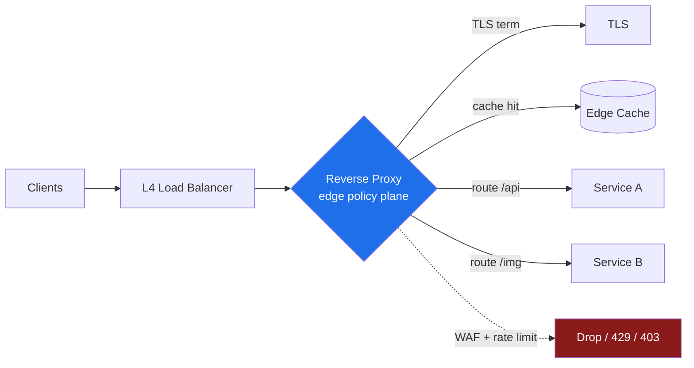
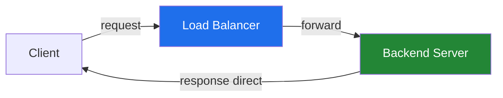

# Network Proxies & NAT — Senior

<!-- level-focus -->
At senior level, focus on this question:

> Which system invariant is affected by **Network Proxies & NAT** under failure, load, and change?

Use the smallest realistic scenario that exposes the decision and its failure behavior.
## 1. The reverse proxy as an architectural chokepoint

A reverse proxy sits in front of your origins and accepts client connections on their behalf. Every request that reaches your services passes through it, which is precisely why it is the highest-leverage box in the system. It is where you can add capability without touching application code — and where a single misconfiguration takes down everything behind it.

The concentration is the whole point. Instead of building TLS, caching, rate-limiting, and routing into every service, you build them once at the edge. The trade-off is a fan-in of blast radius: the proxy is a shared-fate component. A bad regex in a WAF rule, a certificate that expired, a routing table that black-holes `/api`, or a worker pool sized too small — any of these degrades *all* traffic, not one service.

Senior ownership means you reason about the proxy as a *policy plane*, not plumbing. Two questions frame every decision: **what belongs at the edge versus in the service**, and **what is the failure behavior when this responsibility misbehaves**. Caching belongs at the edge because it is a cross-cutting read optimization; business authorization does not, because it needs domain context the proxy lacks. TLS termination belongs at the edge if the internal network is trusted; it moves deeper (or becomes end-to-end) when it is not.



The reverse proxy is a chokepoint you *want* — controlled concentration beats scattered, inconsistent enforcement. But own it like a chokepoint: version its config, test it in CI, roll it out canary-first, and instrument every responsibility below so you can see which one is failing.

## 2. Reverse-proxy responsibility table

Each responsibility is a knob with its own failure mode. Knowing the failure mode is what separates operating a proxy from configuring one.

| Responsibility | What it does | Primary risk / failure mode | Owner-level lever |
|---|---|---|---|
| **TLS termination** | Decrypts client TLS, re-encrypts or forwards plaintext to origin | Expired/mismatched cert takes down all HTTPS; plaintext hop leaks data | Automated cert rotation (ACME), OCSP stapling, cipher policy, expiry alerting ≥30d out |
| **Caching** | Serves cached responses without hitting origin | Cache poisoning, stale writes served, unbounded key cardinality | Cache-key hygiene, `Vary` discipline, TTL + stale-while-revalidate, purge API |
| **Routing (path/host-based)** | Maps `Host`/path to upstream pool | Mis-route → 404s or wrong tenant; catch-all black-holes traffic | Explicit precedence, no greedy catch-all, route tests in CI |
| **Compression** | gzip/br to shrink responses | CPU spikes under load; BREACH/CRIME if mixed with secrets | Compress by content-type, min-size threshold, never over reflected secrets |
| **Rate limiting** | Caps request rate per client/key | Shared counters throttle legit users; keyed on spoofable IP | Token bucket per real identity, distributed counter, `Retry-After` |
| **WAF** | Blocks known-malicious patterns | False positives block real users; ReDoS in rules | Detection→block staged rollout, per-rule metrics, tuned rulesets |
| **Header manipulation** | Adds/strips/rewrites headers | Trusting spoofed `X-Forwarded-For`; leaking internal headers | Strip inbound trust headers at edge, then set authoritatively |
| **Auth offload** | Validates JWT/mTLS/session before origin | Fail-open bypass; stale key cache accepts revoked tokens | Fail-closed default, JWKS refresh, clock-skew bounds |

The table is a checklist you audit against. For every responsibility you enable, ask: *what is its failure mode, and does my monitoring surface it before a user does?* A WAF with no per-rule block-count metric is a WAF you cannot safely tune — you will never know which rule started dropping legitimate checkout requests.

## 3. TLS termination and where it lives

Terminating TLS at the reverse proxy is the common default: one place to manage certificates, one place to enforce cipher policy, and origins that speak plaintext HTTP over a trusted network. The proxy becomes your certificate lifecycle owner, which is a real job — automated issuance and renewal (ACME/Let's Encrypt or an internal CA), OCSP stapling to avoid client-side revocation round-trips, and an expiry alert that fires with weeks of margin, not hours.

The subtlety is *what happens after termination*. Three postures:

- **Edge termination, plaintext inside.** Simplest. Acceptable only when the internal network is genuinely trusted (a VPC with enforced segmentation). The plaintext hop is a real exposure — anyone with a tap or a compromised sidecar reads traffic.
- **TLS re-origination (re-encrypt).** The proxy terminates client TLS, then opens a *new* TLS session to the origin. You get inspection/caching at the edge and encryption on the wire. Costs a second handshake and CPU.
- **TLS passthrough.** The proxy forwards the encrypted bytes without decrypting (SNI-based routing at L4). You lose caching, WAF, and header manipulation because the proxy cannot see the plaintext. Used when compliance forbids decryption in the DMZ.

Senior decision: pick posture by *trust boundary*, not by convenience. If a regulator or threat model says the segment between proxy and origin is untrusted, edge-plaintext is off the table — re-encrypt or push termination to the origin. And whatever you choose, the certificate expiry runbook is non-negotiable; expired certs are one of the most common and most embarrassing full outages.

## 4. Why real-time needs NAT traversal

Most hosts on the internet do not have a public IP. They sit behind NAT — a home router, a corporate firewall, a mobile carrier's CGNAT. NAT rewrites the source IP:port of outbound packets to a shared public mapping and remembers the translation so replies find their way home. This works transparently for client-initiated flows (you connect out, the reply comes back), which is why browsing, APIs, and TCP downloads "just work."

It breaks for **peer-to-peer**. WebRTC — video calls, screen sharing, low-latency game data — wants two browsers to send media *directly* to each other to minimize latency and server cost. But peer A behind NAT has no idea what its public IP:port is, and peer B cannot initiate a connection to A's private `192.168.x.x` address. Neither peer can address the other, and neither NAT will forward an unsolicited inbound packet.

The core problem is threefold: **discovery** (what is my public mapping?), **reachability** (can we punch a hole through both NATs?), and **fallback** (what if the NATs are too restrictive to punch through?). NAT traversal is the machinery that answers all three. STUN handles discovery, hole-punching handles reachability, TURN handles fallback, and ICE orchestrates them into a decision.

The stakes are concrete: get traversal right and calls connect directly with minimal latency and near-zero server bandwidth. Get it wrong and either calls fail to connect at all, or every call relays through your TURN servers — turning a P2P feature into an expensive bandwidth bill.

## 5. STUN, TURN, ICE — the staged handshake

Three protocols, three jobs. **STUN** (Session Traversal Utilities for NAT) is a lightweight query: a peer asks a public STUN server "what source address do you see me coming from?" The server replies with the peer's public IP:port — the *server-reflexive candidate*. That is discovery, and it is cheap.

**Hole punching** uses those discovered candidates: both peers simultaneously send packets to each other's public mapping. Because each has an outbound flow open, each NAT now has a translation entry that accepts the other's inbound packet. For many NAT types this succeeds.

For symmetric NATs and restrictive firewalls, hole punching fails — the NAT allocates a *different* external port per destination, so the mapping the peer learned from STUN is not the mapping used toward its peer. That is when **TURN** (Traversal Using Relays around NAT) steps in: both peers connect *outbound* to a public relay server, and the relay forwards media between them. It always works because both flows are client-initiated, but it costs relay bandwidth and adds a hop of latency.

**ICE** (Interactive Connectivity Establishment) is the orchestrator. Each peer gathers all its candidates — *host* (local IP), *server-reflexive* (via STUN), *relayed* (via TURN) — exchanges them through the signaling channel, then runs connectivity checks on every candidate pair, preferring the lowest-latency path. Direct host-to-host wins if reachable; server-reflexive (hole-punched) next; TURN relay last resort.

```mermaid
sequenceDiagram
    participant A as Peer A (behind NAT)
    participant STUN as STUN Server
    participant SIG as Signaling Server
    participant TURN as TURN Relay
    participant B as Peer B (behind NAT)

    Note over A,B: Stage 1 — Gather candidates
    A->>STUN: Binding request (what's my public IP:port?)
    STUN-->>A: srflx candidate 203.0.113.5:51820
    B->>STUN: Binding request
    STUN-->>B: srflx candidate 198.51.100.9:44100
    A->>TURN: Allocate relay (fallback)
    TURN-->>A: relay candidate 192.0.2.1:3478

    Note over A,B: Stage 2 — Exchange via signaling
    A->>SIG: SDP offer + candidates
    SIG->>B: SDP offer + candidates
    B->>SIG: SDP answer + candidates
    SIG->>A: SDP answer + candidates

    Note over A,B: Stage 3 — ICE connectivity checks
    A-->>B: STUN check to host candidate (fails, private)
    A-->>B: STUN check to srflx (hole punch)
    B-->>A: STUN check to srflx (hole punch)
    Note over A,B: If both succeed → DIRECT path chosen

    Note over A,B: Stage 4 — Fallback if checks fail
    A->>TURN: Relayed media
    TURN->>B: Relayed media
    Note over A,TURN,B: Symmetric NAT → relay used
```

The senior takeaway: **you must provision TURN**, and you must monitor the *relay ratio*. A healthy WebRTC deployment relays only a minority of sessions; if your relay ratio climbs, either your STUN discovery is broken, your candidate gathering is timing out, or your user population shifted toward carrier-grade NAT. Each cause has a different fix, and each un-fixed percentage point of relay is direct bandwidth cost.

## 6. Conntrack limits and NAT port exhaustion

NAT and stateful firewalls remember every flow. On Linux, that memory is the **conntrack** table, and it is finite. Each tracked connection consumes a slot; when the table fills, new connections are dropped with `nf_conntrack: table full, dropping packet`. This is a classic, high-severity production incident because it is invisible until it isn't: everything works, then under load new connections simply fail while established ones continue — a maddeningly partial outage.

Two limits interact:

- **conntrack table size** (`net.netfilter.nf_conntrack_max`). Bound by memory and default kernel sizing. A busy NAT gateway or a Kubernetes node running kube-proxy can blow past defaults during a traffic spike or a retry storm.
- **Ephemeral port range for SNAT.** When many internal clients share one public IP (source NAT), the gateway must allocate a unique source port per `(dst IP, dst port)` tuple. The usable range is ~28,000 ports by default (`ip_local_port_range`). Concentrate enough connections toward a *single* backend (e.g., one shared database or one API endpoint) through one SNAT IP and you exhaust ports — **SNAT port exhaustion** — even though the table is nowhere near full.

The port-exhaustion case is the sharper trap: it is not about total connections but about connections *to the same destination tuple through the same source IP*. A microservice fleet hammering one downstream via a NAT gateway is the textbook trigger.

| Symptom | Root cause | Concrete mitigation |
|---|---|---|
| `nf_conntrack: table full` in dmesg | Table size exceeded | Raise `nf_conntrack_max`; lower TIME_WAIT/UDP timeouts to reclaim slots faster |
| New connections fail, existing OK | Table full OR port exhaustion | Distinguish via `conntrack -C` count vs port allocation metrics |
| Intermittent SNAT failures to one backend | Ephemeral ports exhausted for that tuple | Add SNAT IPs (widen tuple space); connection pooling to reuse flows |
| Slow slot reclamation | TIME_WAIT / long timeouts | Tune `tcp_timeout_time_wait`, `nf_conntrack_udp_timeout` |
| Kubernetes pod-to-service drops | kube-proxy SNAT + conntrack pressure | More node IPs, IPVS mode, or bypass SNAT with pod-native networking |

Own this by **monitoring before you're full**: alert on conntrack utilization (`nf_conntrack_count / nf_conntrack_max`) at 70–80%, and on SNAT port utilization per gateway IP. The two most effective structural fixes are *connection reuse* (pooling and keep-alive collapse many short flows into few long ones, dramatically cutting table pressure) and *widening the tuple space* (more SNAT source IPs so a single hot destination doesn't exhaust one IP's port range). Blindly raising `nf_conntrack_max` treats the symptom; pooling treats the cause.

## 7. Preserving the client IP end-to-end

The moment a request passes through a proxy, the origin sees the *proxy's* IP as the source, not the client's. Client IP matters for rate limiting, geo-routing, fraud detection, audit logs, and abuse response — losing it is losing a security signal. The end-to-end preservation problem has a clean shape and a dangerous trap.

For **L7 (HTTP) proxies**, the convention is the `X-Forwarded-For` (XFF) header: each proxy appends the address it received the connection from, building a chain `client, proxy1, proxy2`. The `Forwarded` header (RFC 7239) is the standardized successor. This works — but XFF is a *client-writable header*, and that is the trap.

An attacker can send `X-Forwarded-For: 1.2.3.4` and, if you trust it blindly, spoof any origin. You will rate-limit the wrong IP, log the wrong actor, and let attackers evade IP bans by forging a fresh address each request. The defense is a strict **trust boundary**:

- At the *outermost* trusted proxy (your own edge), **strip or overwrite** any inbound XFF the client sent. The client's claimed XFF is worthless — the client controls it.
- The edge sets XFF authoritatively from the real TCP source it observed.
- Downstream, trust XFF *only* from your known proxy IPs. Configure the number of trusted hops (e.g., nginx `set_real_ip_from` + `real_ip_recursive`) so you read the correct entry and refuse to trust beyond your infrastructure.

The rule of thumb: **the real client IP is the last untrusted address before your first trusted hop.** Count hops from your edge inward; anything the client can reach and write is not authoritative. Getting the trusted-hop count wrong is a common bug — one hop off and you either read a proxy's IP (breaking rate limits) or trust one client-supplied entry too many (enabling spoofing).

## 8. PROXY protocol for L4 pass-through

XFF only works when the proxy speaks HTTP and can edit headers. **L4 load balancers** (TCP/TLS pass-through) forward bytes without parsing HTTP — there is no header to append. If you terminate TLS at the origin (passthrough), the L4 LB cannot inject XFF at all, and the origin sees only the LB's IP.

The **PROXY protocol** solves this. Before forwarding the connection's payload, the L4 proxy prepends a small, fixed header carrying the original source and destination IP:port. The origin — which must be configured to *expect* PROXY protocol — reads that header first, learns the true client address, then treats the rest of the stream normally.

```
PROXY TCP4 203.0.113.7 198.51.100.2 56324 443\r\n
<...normal TLS/TCP bytes follow...>
```

There are two versions: v1 is human-readable text (shown above); v2 is a compact binary framing preferred for performance and for carrying TLVs (extra metadata like the ALPN or SNI). Both accomplish the same goal: preserve client identity across an L4 hop that cannot see or modify application-layer headers.

The critical operational rule: **PROXY protocol is not optional on either side.** If the sender emits the header but the receiver doesn't expect it, the origin treats `PROXY TCP4 ...` as garbage in the application stream and the connection breaks. If the receiver expects it but the sender doesn't send it, the same failure. And you must *only* accept PROXY protocol from trusted upstreams — an untrusted client sending a forged PROXY header spoofs its source IP exactly like forged XFF. Whitelist the sender IPs, mirroring the L7 trust boundary discipline.

## 9. Direct Server Return (DSR)

In a normal load-balanced flow, both request and response traverse the load balancer: client → LB → backend → LB → client. The LB is on the return path, so it becomes a bandwidth bottleneck — every byte of every response flows back through it. For asymmetric workloads (small requests, large responses — video, downloads, images), this is wasteful; the response volume can dwarf the request volume by orders of magnitude.

**Direct Server Return** breaks the symmetry. The LB forwards the request to a backend, but the backend replies *directly* to the client, bypassing the LB on the return path:



This works at L4 by having the LB forward the packet without rewriting the destination IP (typically via MAC-address rewriting on a shared L2 segment, or IP-in-IP encapsulation), while each backend is configured with the *virtual IP* (VIP) on a loopback so it accepts and responds as if it were the VIP. The client's TCP stack sees replies from the VIP it originally addressed, so the connection is consistent.

The payoff is large: the LB handles only inbound request traffic, so its capacity scales with request rate rather than total response bandwidth. The costs are real constraints: DSR is L4-only (the LB never sees the response, so no L7 features — no response caching, no header rewriting, no content inspection on the way out), it typically requires backends on the same L2 domain or tunneling, and health-checking / connection-state handling gets trickier because the return path is invisible to the LB. Own DSR only when response bandwidth is genuinely the bottleneck and you can live without return-path L7 processing — for high-throughput CDN edges and video delivery it is transformative; for a general API tier it is usually unnecessary complexity.

## 10. Ownership checklist

Operating proxies and NAT at senior altitude means holding all of the following simultaneously:

- **Treat the reverse proxy as a policy plane.** Version its config, test routes in CI, canary rollouts, and instrument every responsibility so you can tell *which* one is failing during an incident.
- **Match each edge responsibility to its failure mode.** For TLS, caching, WAF, rate limiting, and header handling, know what breaks and confirm monitoring surfaces it first.
- **Pick TLS posture by trust boundary.** Edge-plaintext only on trusted segments; re-encrypt or origin-terminate otherwise. Automate cert rotation and alert on expiry weeks out.
- **Provision TURN and watch the relay ratio.** A rising relay percentage is a bandwidth-cost regression with a discoverable root cause — broken STUN, timing-out candidate gathering, or a shift toward CGNAT.
- **Monitor conntrack and SNAT ports before they fill.** Alert at 70–80% utilization; fix causes with connection pooling and more SNAT IPs, not just a larger table.
- **Enforce the client-IP trust boundary.** Strip inbound XFF at your edge, set it authoritatively, trust it only from known proxies, and count trusted hops exactly.
- **Configure PROXY protocol on both ends, from trusted senders only.** It is not optional and it is forgeable — whitelist upstreams.
- **Reach for DSR only when return-path bandwidth is the real bottleneck** and you can forgo L7 processing on responses.

The through-line: proxies and NAT concentrate both capability and risk at the network boundary. Owning them means designing for the failure modes deliberately, instrumenting each responsibility so incidents are diagnosable, and knowing which knob to turn when the pager goes off.

*Next step:* [Professional level](professional.md)

---

## Apply it

1. State the system invariant that **Network Proxies & NAT** must protect.
2. Mark ownership, state, and failure propagation at each boundary.
3. Compare two designs under load, dependency failure, and future change.
4. Define recovery and compatibility behavior before implementation.
5. Test the riskiest assumption with a focused experiment.

## Verify your work

- The experiment supports the design with evidence, not preference.
- Failure injection shows the blast radius and recovery path.
- Compatibility checks cover old and new callers or data.
- Operational signals reveal invariant violations and recovery progress.

## Review questions

- Which invariant must remain true when Network Proxies & NAT fails?
- Where should recovery responsibility live, and why?
- Which assumption deserves an experiment before implementation?
- How can the design evolve without changing every consumer at once?
