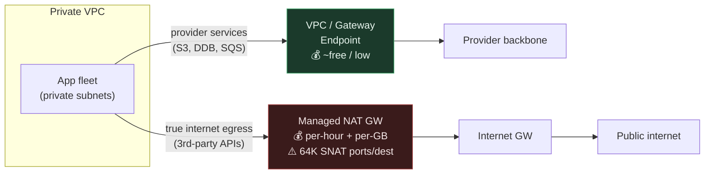
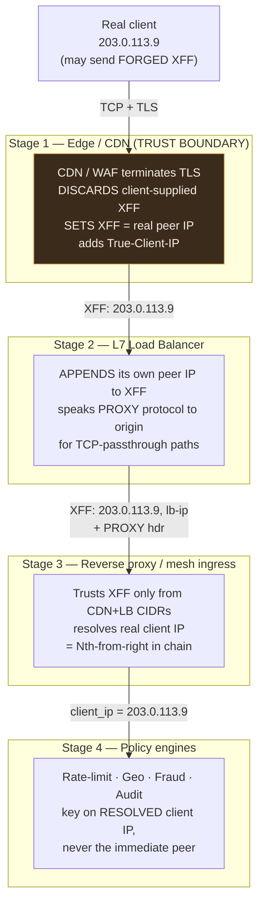

# Network Proxies & NAT — Staff / Principal Level

At staff level, proxies and NAT stop being protocol trivia and become an **infrastructure strategy** with a direct line to your cloud bill, your incident log, and your security posture. The interesting failures here are not "how does NAT rewrite a header" — they are "why did 3% of our outbound API calls start failing at 14:00 on Black Friday," "why did we ban our own load balancer," and "why is the NAT gateway line item the third-largest number on our AWS invoice." This document treats the proxy/NAT layer as an organizational axis: cost ownership, blast radius, trust boundaries, and the multi-year IPv6 migration nobody wants to fund.

*(All pricing below is illustrative — order-of-magnitude, not a quote. Re-derive against your provider's current rate card before making a decision.)*

## Table of Contents

1. [The egress topology is a cost architecture](#1-the-egress-topology-is-a-cost-architecture)
2. [SNAT port exhaustion: the 64K ceiling and how it pages you](#2-snat-port-exhaustion-the-64k-ceiling-and-how-it-pages-you)
3. [Egress cost & failure-mode table](#3-egress-cost--failure-mode-table)
4. [Client-IP preservation as an edge-wide architecture](#4-client-ip-preservation-as-an-edge-wide-architecture)
5. [The staged trust chain](#5-the-staged-trust-chain)
6. [Zero-trust forward-proxy egress control](#6-zero-trust-forward-proxy-egress-control)
7. [CGNAT and the death of IP-as-identity](#7-cgnat-and-the-death-of-ip-as-identity)
8. [IPv6 as a multi-year strategy, not a checkbox](#8-ipv6-as-a-multi-year-strategy-not-a-checkbox)
9. [Governance, ownership, and the staff playbook](#9-governance-ownership-and-the-staff-playbook)
10. [Next step](#next-step)

---

## 1. The egress topology is a cost architecture

Every packet leaving your private network toward the internet takes a path, and each path has a price and a failure mode. At cloud scale the dominant choices are:

- **Managed NAT gateway** — the default. Zero ops, but you pay *per hour* for the gateway to exist *and per GB* for every byte that passes through it, on top of the normal internet data-transfer-out charge. The processing fee is the sneaky one: it applies to traffic that goes to another region, to S3 over the public path, or to a peered VPC — bytes you already pay to move.
- **Self-managed NAT instance** — a plain VM running iptables masquerade. Cheaper per GB at high volume, but now you own the HA story, the failover, the kernel tuning, and the pager.
- **VPC / gateway endpoints (PrivateLink)** — traffic to supported provider services (object storage, queues, secrets, the provider's own APIs) skips the NAT gateway entirely. A gateway endpoint for object storage is typically free; interface endpoints have their own per-hour + per-GB cost but usually far below NAT processing for chatty internal traffic.
- **Direct public IP per instance** — no NAT at all; each node has its own address. Removes the SNAT bottleneck entirely but explodes your attack surface and IP-management overhead, and is a non-starter in most zero-trust designs.

The staff insight: **the cheapest byte is the one that never touches the NAT gateway.** A single line of Terraform adding an S3 gateway endpoint can wipe a five-figure monthly NAT-processing charge, because backup/restore, log shipping, and artifact pulls are often the bulk of "egress" and none of it needs the public internet. Audit *what* is flowing through NAT before you optimize *how much* — most teams discover 60–80% of their NAT bytes are provider-internal and endpoint-eligible.

---

## 2. SNAT port exhaustion: the 64K ceiling and how it pages you

This is the single most misdiagnosed egress incident, so it deserves the mechanics spelled out. When N private hosts share one public IP behind NAT, the gateway distinguishes their connections by **source port**. A TCP/UDP connection is identified by the 5-tuple `(protocol, src IP, src port, dst IP, dst port)`. Behind a single NAT public IP, the `src IP` is fixed and the `dst`/`protocol` are dictated by where you're calling — so the *only* free variable is the source port, a **16-bit field: ~64,512 usable ephemeral ports**.

The exhaustion condition is subtle and staff-critical: the limit is **per unique destination `(dst IP, dst port)` per NAT public IP**. You do not get 64K connections total — you get ~64K *to any one destination endpoint* from a single NAT IP. This is exactly why the incident is mysterious:

- A fleet making many short-lived connections to **one** hot dependency (a payment gateway, a single API endpoint, a shared cache proxy) hits the ceiling on that destination while total connection count looks trivial.
- **TIME_WAIT** holds a port for ~2×MSL (commonly ~120s on Linux, sometimes 240s on the NAT device) *after* the connection closes. A chatty service opening and closing 600 connections/second to one endpoint parks ~72,000 ports in TIME_WAIT — over the ceiling — even though "active" connections are near zero.
- The failure surfaces as `ErrorPortAllocation` in gateway metrics and, to the application, as **connection timeouts or resets that correlate with load but not with the dependency's own health** — so on-call blames the downstream, the downstream blames the network, and everyone loses an hour.

Mitigations, roughly in order of leverage:

1. **Connection reuse / pooling with keep-alive.** The root cause is usually one-connection-per-request. HTTP keep-alive and a properly sized connection pool collapse thousands of ephemeral connections into a handful of long-lived ones. This is the fix that also makes the app faster — do it first.
2. **More public IPs on the NAT.** Each additional IP multiplies the per-destination ceiling. A NAT gateway with M IPs gives ~M×64K per destination. Cloud NAT products let you attach multiple IPs precisely for this.
3. **More NAT gateways, sharded by workload / subnet.** Isolate the chatty tenant onto its own NAT so its exhaustion can't starve everyone else. This is also a blast-radius decision, not just a capacity one.
4. **VPC endpoints for the hot destination.** If the hot dependency is a provider service, route it off NAT entirely — endpoints don't share the SNAT port pool.
5. **Tune TIME_WAIT reuse** (`net.ipv4.tcp_tw_reuse`) on NAT *instances* — not available on managed gateways, and a sharp tool; prefer pooling.

The staff lesson: **SNAT exhaustion is a capacity-planning input, not a surprise.** If you know your peak connections-per-second to any single destination and its connection lifetime, you can compute required ports (`cps × lifetime_seconds`) and provision IPs/gateways before the incident. Bake this into the capacity review for any new high-fan-out egress path.

---

## 3. Egress cost & failure-mode table

Illustrative figures; the point is the *shape* of the trade-offs, not the digits.

| Egress path | Cost shape (illustrative) | Primary failure mode | Blast radius | When to choose |
|---|---|---|---|---|
| **Managed NAT gateway** | ~$0.045/hr + ~$0.045/GB processed + normal transfer-out | SNAT port exhaustion (~64K/dest/IP); single-AZ AZ-failure | AZ-wide if not per-AZ deployed | Default for real internet egress; low ops |
| **NAT gateway, multi-IP** | Same + extra IP cost | Harder to exhaust; still per-dest ceiling ×IPs | Same | Chatty egress to few hot destinations |
| **Per-workload NAT gateways** | Multiplied per-hour base cost | Isolated exhaustion; noisy-neighbor contained | Contained to one workload | Multi-tenant / high-fan-out tenants |
| **Self-managed NAT instance** | VM cost + your ops time; cheaper $/GB at scale | You own HA/failover; kernel/conntrack limits | Instance-wide; DIY failover | Very high sustained GB where processing fee dominates |
| **VPC / gateway endpoint** | Gateway EP often free; interface EP per-hr + per-GB (low) | Service-scoped; no SNAT sharing | Per-service | Provider-service traffic (S3, queues, secrets) |
| **Direct public IP / instance** | IP cost; no processing fee | Attack surface; IP sprawl; no central control | Per-instance | Rare; specialized high-throughput edge nodes |
| **Forward proxy (egress inspection)** | Proxy fleet + inspection compute | Proxy is a SPOF & new exhaustion point | Fleet-wide if under-provisioned | Compliance/DLP mandates outbound inspection |

The row that surprises most teams is **VPC endpoint**: it is frequently the highest-ROI change on the sheet because it removes both a cost line *and* a failure mode at once.

---

## 4. Client-IP preservation as an edge-wide architecture

Every hop that terminates a connection — CDN, WAF, L7 load balancer, reverse proxy, service mesh sidecar — replaces the client's source IP with its own. By the time a packet reaches your rate limiter, geo-router, fraud engine, or audit log, the "source IP" is your own infrastructure unless you deliberately preserve the original. Getting this wrong produces two classic, expensive outcomes:

- **You ban your own proxy.** A rate limiter keyed on the immediate peer IP sees every request coming from the load balancer's handful of IPs, trips the threshold, and blocks *all* traffic. Or an abuse rule bans "the top offender," which is your CDN's egress node, taking down a region.
- **Security and geo make decisions on the wrong IP.** Geo-routing sends everyone to one datacenter; fraud scoring treats every user as the same entity; audit logs are useless for forensics because they all say `10.0.x.x`.

There are two mechanisms, and staff engineers must know *which layer speaks which*:

- **`X-Forwarded-For` (XFF)** — an HTTP header carrying a comma-separated chain of IPs, appended to at each L7 hop. Works only for HTTP-aware proxies. **The chain is attacker-controllable**: a client can send a forged `X-Forwarded-For` before it ever hits your edge. You must therefore configure a **trust chain** — trust the header only from IPs you know are your own proxies, and take the correct client IP by counting inward from the right by the number of trusted hops (never blindly the leftmost value, which is where spoofed entries land).
- **PROXY protocol** — a small header prepended to the TCP stream at connection setup, carrying the original source/dest before any application bytes. It works at L4, so it preserves client IP through TCP/TLS-passthrough proxies where XFF isn't available (raw TCP, TLS you don't terminate at the edge, non-HTTP protocols). Both endpoints must agree to speak it — send PROXY protocol to a listener that doesn't expect it and you corrupt the first request; expect it from a peer that doesn't send it and you break every connection.

The architectural rule: **client-IP preservation is a property of the entire edge path, not of one component.** A single hop that forgets to forward XFF, or resets the trust boundary, silently poisons every downstream decision. This must be owned end-to-end and tested with synthetic requests carrying forged headers.

---

## 5. The staged trust chain

The correct model is a chain of hops where each stage adds to the record and exactly one boundary decides which IPs are trustworthy. The client's original IP must survive from the real internet all the way to the policy engines — and forged values must be discarded at the trust boundary.

The load-bearing detail is **Stage 1 as the trust boundary**: the first hop you control *overwrites* any client-supplied XFF with the true peer address. Everything after appends. Everything before is untrusted. If you misplace this boundary — say, trusting XFF at the reverse proxy without knowing whether the CDN sanitized it — an attacker sets `X-Forwarded-For: 127.0.0.1` and walks through an IP allowlist.

---

## 6. Zero-trust forward-proxy egress control

The mirror image of client-IP preservation on the inbound side is **egress control** on the outbound side. In a zero-trust posture, no workload talks to the internet directly; **all outbound traffic is funneled through an inspected forward proxy**. This buys several things that regulators and security teams increasingly demand:

- **Allowlist-based egress** — a service can reach `api.stripe.com` and nothing else. Exfiltration and command-and-control channels have nowhere to go, because "the internet" is not a reachable destination.
- **DLP (data-loss prevention)** — the proxy inspects payloads (via TLS interception with a corporate CA, where policy and law permit) for secrets, PII, or source code leaving the boundary.
- **Compliance & audit** — a single, complete log of every external destination every workload contacted, which is exactly what PCI/SOC2/regulatory audits ask for.

The staff trade-offs are steep and must be surfaced honestly:

- **The proxy becomes a chokepoint and a SPOF.** All egress now depends on the proxy fleet's availability and capacity. It also becomes *your* SNAT-exhaustion point (see §2) — now concentrated. Size and shard it deliberately.
- **TLS interception breaks certificate pinning** and is a privacy/legal minefield. Some traffic (health, financial, some third-party APIs) must be allow-listed *around* inspection. This is a policy conversation, not a config toggle.
- **Latency and developer friction.** Every new third-party integration needs an allowlist change. Without a self-service, fast-turnaround process, engineers will route around the control — and a bypassed control is worse than none, because it creates false confidence.

Decision rule: **adopt inspected forward-proxy egress when a compliance or threat-model requirement demands it, not by default.** The operational tax is real; justify it with the specific control it satisfies, and invest equally in the self-service allowlist workflow so the control survives contact with delivery pressure.

---

## 7. CGNAT and the death of IP-as-identity

Carrier-Grade NAT (CGNAT) is NAT applied by the *ISP*: thousands of subscribers share a pool of public IPv4 addresses because IPv4 is exhausted. This is invisible to you until you build anything that treats an IP as a user:

- **IP-based rate limiting punishes innocents.** One shared CGNAT IP can front thousands of real users. A per-IP request cap throttles an entire mobile carrier's region because a handful of its subscribers were active. Mobile networks and large corporate/campus NATs are the worst offenders.
- **IP bans are collateral damage.** Blocking an abusive "IP" bans everyone behind that CGNAT pool — potentially a whole city's mobile users — while the abuser rotates to the next shared address anyway.
- **Geo and fraud signals degrade.** A shared IP maps to the carrier's registration point, not the user, and its "reputation" is an average of thousands of unrelated behaviors.

The architectural response is to **stop using IP as identity for anything security-relevant**:

- Key rate limits and abuse detection on **stable identity** — authenticated user ID, session token, device fingerprint, or API key — with IP as a weak secondary signal only.
- For anonymous traffic, combine IP with additional entropy (TLS/JA3 fingerprint, cookie, behavioral signals) rather than trusting IP alone.
- Treat any IP-reputation feed as probabilistic, and never hard-block solely on it.

This is a *design constraint that flows from the internet's plumbing*, and staff engineers should catch it in review whenever they see `rate_limit(key=client_ip)` on a public path.

---

## 8. IPv6 as a multi-year strategy, not a checkbox

IPv6 is the structural fix for the whole address-scarcity chain — no CGNAT, no SNAT port ceiling per address, no NAT-processing cost for the class of traffic that can go native. Its 128-bit space means every host can have a globally routable address, which dissolves several problems in this document at once. But it is a **program**, not a config flag, and staff engineers own the honest roadmap:

- **Dual-stack is the pragmatic destination**, not IPv6-only — the legacy internet is still IPv4 and will be for years. You run both, prefer IPv6 where available, and fall back to IPv4.
- **Egress cost & exhaustion improve where destinations are v6-reachable.** IPv6 egress often bypasses the NAT gateway's per-GB processing entirely (no NAT needed), and there is no per-destination 64K ceiling to plan around. This is a concrete cost argument, not just future-proofing.
- **But your security posture must be re-derived.** Firewall rules, allowlists, WAF configs, and abuse tooling written for 32-bit addresses often silently ignore or mis-handle 128-bit ones — an IPv6-reachable service can be *unintentionally exposed* because the v4 firewall rule doesn't cover it. Every IP-aware control must be audited for v6 parity.
- **CGNAT relief is the user-facing win.** Give (or reach) users native IPv6 and IP-as-identity partially recovers, because addresses are no longer massively shared — though privacy extensions and rotation mean it's still not a stable user key.

The staff framing: treat IPv6 as a **multi-year, dual-stack migration with a per-control audit checklist**, funded incrementally and justified by the cost/exhaustion relief it delivers on your hottest egress paths — not as a big-bang cutover.

---

## 9. Governance, ownership, and the staff playbook

The proxy/NAT layer fails organizationally when **no one owns it end-to-end**. It sits between the networking team, the platform team, and every product team, so each assumes another has it covered. The staff engineer's job is to make it owned, costed, and reviewable:

- **Single owner for the egress topology.** One team owns NAT gateway placement, endpoint policy, and the egress cost line. Make the NAT-processing charge a visible, attributable number — teams optimize what they can see on their own bill.
- **SNAT capacity is a review gate.** Any new high-fan-out egress dependency triggers a port-budget calculation (`cps × lifetime`) and connection-pooling requirement before it ships. Add it to the launch checklist so the 64K ceiling is planned, never discovered.
- **Client-IP preservation is tested, not assumed.** A synthetic probe carrying a forged `X-Forwarded-For` through the full edge path, asserting the policy engines see the real IP and reject the forgery, belongs in continuous integration. The trust boundary (§5) is documented and any new edge hop is reviewed against it.
- **IP-as-identity is a review red flag.** `key=client_ip` on a public, unauthenticated path gets challenged in design review on CGNAT grounds (§7). Push identity to auth/session/device tokens.
- **Forward-proxy egress control is justified by a named requirement**, paired with a self-service allowlist workflow so the control is not routed around.
- **IPv6 has a roadmap with a per-control audit checklist**, funded incrementally against concrete cost/exhaustion relief.

The through-line: at this layer, the expensive mistakes are **quiet correlation bugs** — a cost that grows with traffic, an exhaustion that appears only at peak, a ban that hits your own infrastructure, a rate limit that punishes a whole carrier. None of them show up in a happy-path demo. Staff-level value is designing so these are *provisioned for and tested*, not diagnosed at 2 a.m.

---

## Next step

You now have the strategic, cost- and incident-aware view of the proxy/NAT layer: egress topology as a cost architecture, SNAT exhaustion as a capacity input, edge-wide client-IP preservation, zero-trust egress control, CGNAT's assault on IP-as-identity, and IPv6 as a multi-year program. The interview material pressure-tests these under scenario questions.

*Next step:* [Interview questions](interview.md)
