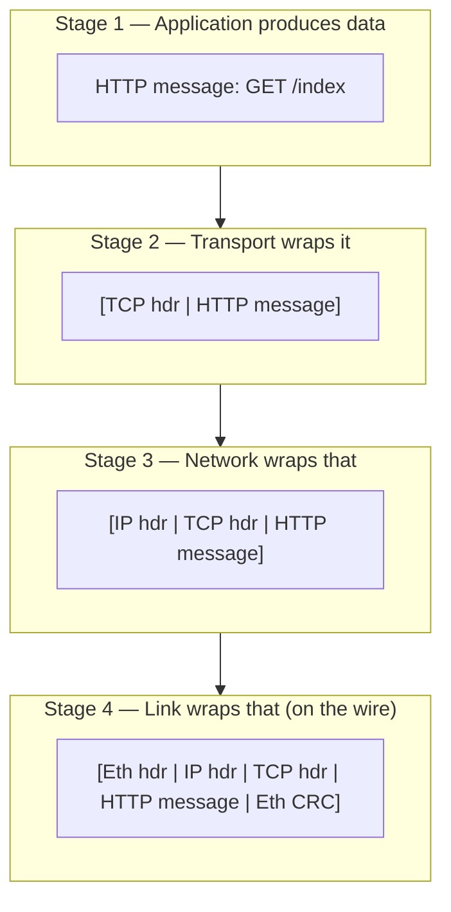

# OSI & TCP/IP Model — Interview Questions

A layered mental model is the vocabulary every networking conversation is built on. These questions move from "name the layers" to "argue about middlebox ossification and who in the org owns which layer." Answer them precisely — vague layer-talk is an instant credibility loss.

## Table of Contents

1. [Junior Questions](#junior-questions)
   - [Q1: Name and order the OSI 7 layers](#q1-name-and-order-the-osi-7-layers)
   - [Q2: What are the 4 TCP/IP layers?](#q2-what-are-the-4-tcpip-layers)
   - [Q3: What does each layer actually do?](#q3-what-does-each-layer-actually-do)
   - [Q4: Where do HTTP, TLS, TCP, IP, Ethernet sit?](#q4-where-do-http-tls-tcp-ip-ethernet-sit)
   - [Q5: What is a port and a socket?](#q5-what-is-a-port-and-a-socket)
2. [Middle Questions](#middle-questions)
   - [Q6: Explain encapsulation and headers](#q6-explain-encapsulation-and-headers)
   - [Q7: OSI vs TCP/IP — what's the difference?](#q7-osi-vs-tcpip--whats-the-difference)
   - [Q8: What is the 5-tuple and why does it matter?](#q8-what-is-the-5-tuple-and-why-does-it-matter)
   - [Q9: What is MTU and what happens when you exceed it?](#q9-what-is-mtu-and-what-happens-when-you-exceed-it)
   - [Q10: How do you debug "the app is slow" by layer?](#q10-how-do-you-debug-the-app-is-slow-by-layer)
3. [Senior Questions](#senior-questions)
   - [Q11: L4 vs L7 load balancing — trade-offs?](#q11-l4-vs-l7-load-balancing--trade-offs)
   - [Q12: Explain Path MTU Discovery and how it breaks](#q12-explain-path-mtu-discovery-and-how-it-breaks)
   - [Q13: Which tool for which layer?](#q13-which-tool-for-which-layer)
   - [Q14: What is the end-to-end principle?](#q14-what-is-the-end-to-end-principle)
   - [Q15: Where does TLS really sit, L4 or L7?](#q15-where-does-tls-really-sit-l4-or-l7)
   - [Q16: How does an L7 proxy break the layer model?](#q16-how-does-an-l7-proxy-break-the-layer-model)
4. [Professional / Deep-Dive Questions](#professional--deep-dive-questions)
   - [Q17: Why does QUIC ride on UDP?](#q17-why-does-quic-ride-on-udp)
   - [Q18: What is middlebox ossification?](#q18-what-is-middlebox-ossification)
   - [Q19: How do encapsulation headers stack in a real overlay network?](#q19-how-do-encapsulation-headers-stack-in-a-real-overlay-network)
   - [Q20: Why can't you cleanly place VPNs and tunnels in the OSI model?](#q20-why-cant-you-cleanly-place-vpns-and-tunnels-in-the-osi-model)
5. [Staff / Judgment Questions](#staff--judgment-questions)
   - [Q21: How do you split network ownership across teams by layer?](#q21-how-do-you-split-network-ownership-across-teams-by-layer)
   - [Q22: When is the layer model a liability?](#q22-when-is-the-layer-model-a-liability)
   - [Q23: Should you terminate TLS at the edge or end-to-end?](#q23-should-you-terminate-tls-at-the-edge-or-end-to-end)

---

## Junior Questions

**Q1: Name and order the OSI 7 layers, bottom to top.**

> Bottom (L1) to top (L7): **Physical, Data Link, Network, Transport, Session, Presentation, Application**. A common mnemonic is "Please Do Not Throw Sausage Pizza Away." Interviewers care that you get the *order* and the *numbers* right, because engineers routinely say "L3" or "L7" as shorthand and expect you to translate instantly: L3 = Network (IP), L4 = Transport (TCP/UDP), L7 = Application (HTTP). Getting L4 and L7 confused is the fastest way to look junior.

**Q2: What are the 4 layers of the TCP/IP model?**

> Bottom to top: **Link (Network Access), Internet, Transport, Application**. The TCP/IP model is the one the real internet is actually built on; OSI is the teaching abstraction. TCP/IP collapses OSI's L1+L2 into one Link layer and merges OSI's L5/L6/L7 into one Application layer. So the mapping is: TCP/IP Link ≈ OSI L1–L2, TCP/IP Internet ≈ OSI L3, TCP/IP Transport ≈ OSI L4, TCP/IP Application ≈ OSI L5–L7.

**Q3: What does each layer actually do, in one sentence?**

> - **L1 Physical** — moves raw bits over a medium (copper, fiber, radio): voltages, light pulses, modulation.
> - **L2 Data Link** — frames bits into addressable units on a *local* network (MAC addresses, Ethernet, Wi-Fi), handles local error detection.
> - **L3 Network** — routes packets across *networks* using logical addresses (IP), hop by hop.
> - **L4 Transport** — delivers data between *processes* end to end (TCP = reliable/ordered, UDP = fire-and-forget), via ports.
> - **L5 Session** — establishes/manages/tears down conversations (rarely a distinct layer in practice).
> - **L6 Presentation** — data format, encoding, encryption/compression (TLS, character sets).
> - **L7 Application** — the protocol the app speaks (HTTP, DNS, SMTP, gRPC).

**Q4: Where do HTTP, TLS, TCP, IP, and Ethernet sit?**

> | Protocol | OSI Layer | TCP/IP Layer | Role |
> |----------|-----------|--------------|------|
> | HTTP / gRPC / DNS | L7 Application | Application | What the app means |
> | TLS | L6 Presentation (ish) | Application | Encrypt/authenticate the byte stream |
> | TCP / UDP | L4 Transport | Transport | Process-to-process delivery |
> | IP (v4/v6) | L3 Network | Internet | Host-to-host routing |
> | Ethernet / Wi-Fi | L2 Data Link | Link | Local frame delivery (MAC) |
> | Cables / radio | L1 Physical | Link | Raw bits |
>
> The honest caveat: TLS doesn't fit OSI cleanly — it runs *on top of* TCP but *below* HTTP, so people put it "between L4 and L7." Say that out loud; it shows you understand the model's limits.

**Q5: What is a port and a socket?**

> A **port** is a 16-bit number (0–65535) that identifies a specific process/service on a host — port 443 for HTTPS, 5432 for Postgres. A **socket** is the OS endpoint of a connection: concretely, the pair `(IP address, port)`. A *connection* is defined by the two sockets on each end plus the protocol. When you `listen()` on port 8080, you have one listening socket; every accepted client gets its own connected socket, all sharing the same local port but distinguished by the remote `(IP, port)`. That distinction is what lets one server hold thousands of simultaneous connections on a single port.

---

## Middle Questions

**Q6: Explain encapsulation and headers as data goes down the stack.**

> Each layer wraps the layer above's data in its own header (and sometimes trailer), treating the upper layer's output as an opaque payload. Sending an HTTP request: the app produces an HTTP message → TCP prepends a segment header (ports, sequence numbers) → IP prepends a packet header (source/dest IP) → Ethernet prepends a frame header (source/dest MAC) plus a trailer (CRC). At each hop the receiver peels headers back off in reverse. This is *encapsulation*, and it's why the layers are independent: IP doesn't care what's inside the segment, Ethernet doesn't care what's inside the packet.

> 🎞️ **See it animated:** [Encapsulation walk-through (Cloudflare Learning)](https://www.cloudflare.com/learning/network-layer/what-is-the-network-layer/)

**Q7: What are the real differences between OSI and TCP/IP?**

> | Dimension | OSI | TCP/IP |
> |-----------|-----|--------|
> | Layers | 7 | 4 |
> | Origin | ISO standard, designed top-down | Grew from real ARPANET implementations |
> | Role today | Teaching / vocabulary | Protocols the internet actually runs |
> | Session/Presentation | Distinct layers | Folded into Application |
> | Physical/Data Link | Distinct | Folded into one Link layer |
> | Prescriptiveness | Strict, protocol-agnostic | Pragmatic, protocol-specific (TCP, IP) |
>
> The one-liner: **OSI is the map, TCP/IP is the territory.** OSI gives us the shared L1–L7 vocabulary; TCP/IP is what your packets obey. In interviews, use OSI numbers to *communicate* and TCP/IP layers to *reason about behavior*.

**Q8: What is the 5-tuple and why does it matter?**

> The 5-tuple is `(source IP, source port, destination IP, destination port, protocol)`. It uniquely identifies a single transport connection/flow. It matters everywhere:
> - **Connection tracking / NAT** — routers and firewalls key their state tables on the 5-tuple.
> - **Load balancing** — an L4 balancer hashes the 5-tuple to pick a backend, keeping a flow pinned to one server.
> - **Firewalls / ACLs** — rules are expressed as 5-tuple matches.
> - **Debugging** — when you `ss -tnp` or read a `conntrack` table, you're reading 5-tuples.
>
> A subtle consequence: two different connections can share four of the five fields and still be distinct because one port differs. This is exactly how a client makes many parallel connections to the same server.

**Q9: What is MTU, and what happens when a packet exceeds it?**

> **MTU** (Maximum Transmission Unit) is the largest L3 payload a link can carry in one frame — classically 1500 bytes on Ethernet. If IP needs to send something larger, one of two things happens:
> - **IPv4** can *fragment* the packet into MTU-sized pieces, reassembled at the destination. Fragmentation is costly and fragile (drop any fragment and the whole datagram is lost).
> - **IPv6** forbids router fragmentation entirely; the *source* must size packets correctly or the router drops them and returns an ICMP "Packet Too Big."
>
> The practical failure mode: a link in the path (a tunnel/VPN adds overhead, dropping effective MTU to ~1400) can't fit your packet, and if the ICMP feedback is blocked you get a **black hole** — small requests work, large ones hang. That's the classic "SSH connects but `ls` on a big dir freezes" symptom.

**Q10: A user says "the app is slow." How do you debug it layer by layer?**

> Work *up* the stack, cheapest checks first:
> - **L1/L2** — is the link up? `ip link`, interface error counters, cable/Wi-Fi signal. Rule out a flapping NIC.
> - **L3** — reachability and routing: `ping` (loss/latency), `traceroute`/`mtr` (where latency appears), check routes and MTU.
> - **L4** — is TCP healthy? `ss -ti` for retransmits, RTT, congestion window; is the port even open? Retransmits point to packet loss below.
> - **L7** — is it the *application*? `curl -w` timing breakdown (DNS vs connect vs TLS vs TTFB), server logs, slow queries.
>
> The discipline is: don't guess at L7 ("maybe the DB is slow") before you've confirmed L3/L4 aren't dropping packets. Each layer eliminates a class of causes.

---

## Senior Questions

**Q11: L4 vs L7 load balancing — what are the trade-offs?**

> An **L4 load balancer** operates on the 5-tuple: it forwards packets/connections without inspecting payload. Fast, cheap, protocol-agnostic, works for anything (TCP/UDP), preserves end-to-end TLS. But it can't route on URL path, headers, or cookies, and can't do per-request retries.
>
> An **L7 load balancer** terminates the connection (often TLS too) and understands the application protocol. It can route `/api` and `/static` to different pools, do sticky sessions by cookie, retry idempotent requests, inject headers, and rate-limit per route. The cost: more CPU (it parses every request), it becomes a TLS termination point, and it must speak the protocol.
>
> | Aspect | L4 | L7 |
> |--------|----|----|
> | Inspects | 5-tuple only | Full request (URL, headers, body) |
> | Cost / latency | Low | Higher (parses each request) |
> | Routing granularity | Per connection | Per request |
> | TLS | Passes through | Usually terminates |
> | Protocols | Any | Must understand the protocol |
> | Retries / rewrites | No | Yes |
>
> Rule of thumb: L4 for raw throughput and non-HTTP traffic; L7 when you need content-aware routing, and often both in series (L4 in front of an L7 fleet).

**Q12: Explain Path MTU Discovery and how it fails.**

> **PMTUD** finds the smallest MTU along the entire path so the source can send packets that never need fragmentation. In IPv4 the source sets the "Don't Fragment" bit; a router whose next link is too small drops the packet and returns **ICMP Type 3 Code 4 (Fragmentation Needed)** carrying the next-hop MTU. The source shrinks and retries. IPv6 works similarly via **ICMPv6 Packet Too Big**.
>
> It fails when a firewall blocks ICMP (a depressingly common misconfiguration). Now the "please shrink" message never arrives, so the source keeps sending oversized DF packets that keep getting silently dropped — a **PMTUD black hole**. The tell-tale symptom is that the connection establishes (small handshake packets fit) but stalls the moment a large payload flows. Mitigations: allow the specific ICMP types through firewalls, or clamp TCP MSS at the tunnel/router (`MSS clamping`) so TCP never proposes a segment too big for the path.

**Q13: Which diagnostic tool maps to which layer?**

> | Layer | Question it answers | Tools |
> |-------|--------------------|-------|
> | L1/L2 | Is the link up? MAC issues? | `ip link`, `ethtool`, `arp`/`ip neigh` |
> | L3 | Can I reach the host? Where's the latency? | `ping`, `traceroute`, `mtr`, `ip route` |
> | L4 | Is the port open? Retransmits? | `ss`, `netstat`, `nc`, `nmap`, `conntrack` |
> | L7 | Is the *protocol* behaving? | `curl -v`, `dig`, `openssl s_client`, browser devtools |
> | Any (wire truth) | What's *actually* on the wire? | `tcpdump`, Wireshark |
>
> The senior move is naming `tcpdump`/Wireshark as the cross-layer ground truth: when a higher-level tool and your assumptions disagree, capture the packets. They don't lie, and they let you read every header from Ethernet up.

**Q14: What is the end-to-end principle and why does it matter?**

> The end-to-end principle says: **put application-specific functions at the endpoints, not in the network core**, unless the core can do it *demonstrably better*. The network's job is to move packets ("dumb pipes"); reliability, ordering, and encryption are the endpoints' responsibility (that's why TCP retransmission and TLS live at the hosts, not the routers).
>
> Why it matters: it's the design philosophy that made the internet scalable and evolvable. Because the core doesn't understand applications, you can invent new L7 protocols without upgrading every router. It's also the principle *violated* by middleboxes (NATs, DPI firewalls, transparent proxies) that peek into or rewrite transport-layer state — and those violations are exactly what make new transport protocols hard to deploy (see QUIC).

**Q15: Does TLS sit at L4 or L7?**

> Neither cleanly — and that's the honest answer. TLS runs *on top of* a reliable transport (TCP, L4) and *below* the application protocol (HTTP, L7). In OSI terms people file it under L6 Presentation because it handles encryption/encoding of the byte stream, but in the TCP/IP model there is no separate slot, so it's just "part of the Application layer's plumbing." Practically, engineers say "TLS terminates here" to mean the point where the encrypted stream is decrypted. What actually matters in an interview is that you can reason about *where* it's terminated (client, edge proxy, or backend) and what that means for who can read the plaintext — not which OSI number you assign it.

**Q16: How does an L7 reverse proxy "break" the clean layer model?**

> A pure layered model imagines each layer talking only to its peer on the other host. An L7 proxy shatters that: it *terminates* the client's TCP connection and TLS session, reads the HTTP request as an application, then opens a *brand new* TCP connection (and maybe TLS) to the backend. There are now two independent L4 connections and two 5-tuples for one logical request. Consequences you must handle: the backend sees the proxy's IP (hence `X-Forwarded-For`), connection reuse/keep-alive is per-hop, and TLS is decrypted at the proxy. This is why "the layers are strictly independent" is a useful *teaching* fiction — real infrastructure deliberately terminates and re-originates lower layers to gain L7 capabilities.

---

## Professional / Deep-Dive Questions

**Q17: Why does QUIC run on top of UDP instead of being its own transport?**

> QUIC needs the reliability, ordering, congestion control, and connection semantics of TCP — but it deliberately builds them *inside* itself, in user space, over UDP. Two reasons drive that choice:
>
> 1. **Deployability past middleboxes.** Firewalls, NATs, and load balancers across the internet only understand TCP and UDP. A genuinely new IP protocol number (like SCTP) gets dropped by huge swaths of the network. UDP is a thin, universally-passed envelope, so QUIC packets survive the path.
> 2. **Evolvability.** TCP lives in the OS kernel, so improving it means shipping kernel updates to billions of devices — years of latency. By running in user space over UDP, QUIC ships with the *application* (the browser), so Google/Cloudflare can iterate the transport on their own release cadence.
>
> QUIC also encrypts almost its entire header (via TLS 1.3, built in), which hides the transport state from middleboxes so they *can't* ossify around it — a direct architectural response to the next question.

**Q18: What is middlebox ossification and why is it a systemic problem?**

> **Ossification** is the internet losing its ability to evolve because middleboxes (NATs, firewalls, DPI, "transparent" proxies) inspect and enforce assumptions about the *contents* of transport headers. Once millions of these boxes assume "TCP options look like X" or "SYN packets carry no data," any protocol that deviates gets mangled or dropped. TCP Fast Open and multipath TCP both stalled partly because middleboxes stripped their options.
>
> This directly violates the end-to-end principle: the core started reading and depending on end-to-end state it had no business touching. The systemic fix QUIC pioneered is **greasing and encryption** — encrypt the transport header so middleboxes literally can't read (and therefore can't ossify around) it, and randomize extensible fields so implementations can't hardcode assumptions. The lesson for architects: if you want a protocol to stay evolvable, don't expose its internals to intermediaries.

**Q19: Walk through how encapsulation headers stack in a real overlay network (e.g. VXLAN in Kubernetes).**

> In an overlay, an inner packet is fully encapsulated inside an outer packet, so you get *nested* stacks — this is where the "clean layers" model gets genuinely deep. For a pod-to-pod packet crossing nodes via VXLAN:
>
> `[Outer Eth | Outer IP | Outer UDP | VXLAN | Inner Eth | Inner IP | Inner TCP | payload]`
>
> The inner frame (the pod's actual L2/L3/L4) is treated as opaque payload by the outer frame. The physical network only ever sees the outer IP/UDP; it routes between *nodes*, oblivious to pods. Two consequences bite in production: (1) the overlay headers (~50 bytes for VXLAN) shrink the effective MTU, so you must lower the pod MTU or you'll hit fragmentation/black-holing (ties back to Q9/Q12); (2) an L4 view of the outer packet shows UDP, hiding the inner TCP — so `tcpdump` on the physical NIC needs VXLAN-aware decoding to reveal the real flow. Encapsulation is recursive, and each nesting adds header overhead and a layer of debugging indirection.

**Q20: Why can't you cleanly assign a layer number to VPNs and tunnels?**

> Because tunnels *encapsulate one layer's traffic inside another layer*, they straddle the model by design. Examples: IPsec encrypts and wraps L3 (it's "L3 over L3"); a VXLAN tunnel carries L2 frames inside L3/L4 UDP ("L2 over L4"); a WireGuard/OpenVPN tunnel carries IP inside UDP; an SSH tunnel carries TCP streams inside an L7 session. The layer model assumes a strict stacking, but a tunnel folds the stack back onto itself — the payload of the outer layer is *another full stack*. The correct interview answer isn't to force a number; it's to describe the tunnel as **"X over Y"** (what's carried / what carries it) and reason about the MTU and visibility consequences of the nesting. Insisting a VPN "is L3" or "is L7" misses that it's fundamentally a recursive construction.

---

## Staff / Judgment Questions

**Q21: How would you split network ownership across teams by layer?**

> Layers make excellent organizational seams because they have clean interfaces. A typical split:
>
> | Layer(s) | Owner | Responsibilities |
> |----------|-------|-----------------|
> | L1–L2 | Data center / cloud infra / NetOps | Physical links, switches, VLANs, cloud VPC wiring |
> | L3 | Network engineering / platform | Routing, subnets, IPAM, peering, BGP, firewalls |
> | L4 | Platform / SRE | Load balancers, connection limits, NAT, service mesh transport |
> | L7 | Application teams + API gateway team | HTTP routing, auth, rate limits, protocol semantics |
>
> The judgment part: the interface between layers must be an explicit contract (e.g., "the platform guarantees L4 reachability and an MTU of N; apps own everything above"). Ownership gaps show up exactly at the seams — MTU black holes (Q12) are painful precisely because they fall between the L3 team ("routing's fine") and the app team ("my code's fine"). Assign someone to *own the seam*, usually via a service mesh or a shared "connectivity" SRE function, or those failures become nobody's job.

**Q22: When does the layer model become a liability rather than a tool?**

> It's a liability whenever the real system deliberately violates layering and the team keeps reasoning as if it doesn't:
> - **Performance work** — kernel bypass (DPDK, io_uring), TLS offload, and QUIC-in-userspace all collapse layer boundaries for speed. Insisting on "L4 stays in the kernel" blocks legitimate designs.
> - **Debugging** — a bug caused by an L7 proxy re-originating L4 connections (Q16) is invisible if you assume connections are end-to-end.
> - **Security** — "we encrypt at L6 so L4 is safe" ignores that a proxy terminating TLS sees plaintext.
> - **Cross-layer optimization** — ECN, MTU sizing, and congestion control need L3/L4 to cooperate, which the strict model discourages.
>
> The mature stance: use layers as *vocabulary and default separation of concerns*, but recognize they're an abstraction that real high-performance and real infrastructure routinely and correctly break. Treating the model as physical law, rather than a lens, leads to wrong root-cause analyses.

**Q23: TLS at the edge vs end-to-end — how do you decide?**

> This is a trust-boundary and threat-model decision, not a layer-diagram one.
>
> **Terminate at the edge (L7 proxy):** you get content-aware routing, WAF inspection, cheap centralized cert management, and offloaded crypto. The cost: traffic between the edge and backends is plaintext (or re-encrypted), so you're trusting your internal network. Fine when the internal network is a controlled, monitored perimeter.
>
> **End-to-end / mTLS to the service:** the backend sees ciphertext until the app decrypts it, so a compromised internal hop can't read data. Required for zero-trust architectures, regulated data (PCI/HIPAA), and multi-tenant meshes. The cost: the edge can't inspect payload (so no L7 routing/WAF on encrypted traffic unless it also terminates), plus per-service cert lifecycle complexity.
>
> The common production answer is **both**: terminate TLS at the edge for L7 features, then *re-encrypt* (edge-to-backend mTLS, often via a service mesh) so no hop carries plaintext. State the trade-off explicitly — "we accept the edge as a plaintext point in exchange for WAF and routing" vs "we pay cert-management cost to keep every hop encrypted." A candidate who names the trust boundary, not just the protocol, is the one thinking at staff level.

---

*Next step:* [TCP vs UDP](../tcp-vs-udp/junior.md)
