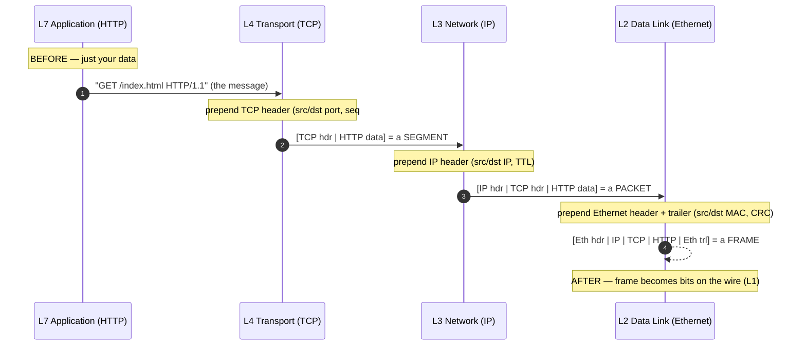
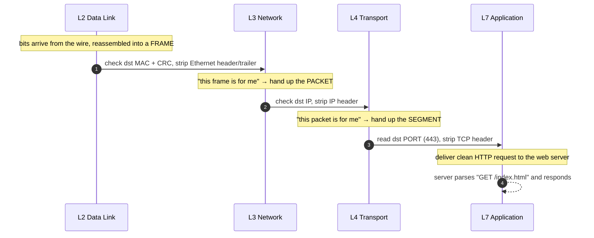

# OSI & TCP/IP Model — Junior

<!-- level-focus -->
At junior level, focus on this question:

> How can I apply **OSI & TCP/IP Model** in one small example and prove the result?

Use the smallest realistic scenario that exposes the decision and its failure behavior.
## 1. Why a Model At All

Sending a message across a network is a genuinely hard problem, and it is really *many* hard problems stacked on top of each other:

- How do we push electrical signals or radio waves down a wire without them turning to noise?
- How do two devices on the same cable take turns without shouting over each other?
- How does a packet find its way across the planet through routers it has never met?
- How do we make sure nothing gets lost, duplicated, or arrives out of order?
- How do two programs agree on what the bytes actually *mean*?

Trying to solve all of these in one giant piece of code would be a nightmare — untestable, unswappable, impossible to reason about. So the industry did what engineers always do with a big problem: they **split it into layers**. Each layer solves exactly one of those questions and offers a clean service to the layer above it, hiding its own messy details.

A **layering model** is just the agreed-upon list of those layers and their responsibilities. It is a *shared vocabulary* more than a rulebook. When someone says "that's a Layer 3 problem" or "the TLS handshake is above TCP," they are pointing at a specific box in this shared picture. Two such pictures dominate networking:

- **OSI** — a 7-layer reference model, great for teaching and precise conversation.
- **TCP/IP** — a 4-layer model that describes how the real Internet is actually built.

You will use OSI's *vocabulary* ("Layer 2", "Layer 7") while running on TCP/IP's *reality*. Both are worth knowing.

---

## 2. The OSI 7 Layers

OSI (Open Systems Interconnection) was standardized by ISO. It has **seven layers**. The classic way to memorize them, top to bottom, is *"All People Seem To Need Data Processing"* — Application, Presentation, Session, Transport, Network, Data Link, Physical. Here is what each does, in one line each:

| # | Layer | One-line job | You can picture it as… |
|---|-------------|-------------------------------------------------------|---------------------------------------|
| 7 | Application | Provides the actual service the user's program wants  | "GET /index.html" — HTTP, DNS lookups |
| 6 | Presentation| Translates, encodes, compresses, encrypts the data    | UTF-8 encoding, TLS encryption, gzip  |
| 5 | Session     | Opens, manages, and tears down conversations          | "keep this dialogue open, resume it"  |
| 4 | Transport   | End-to-end delivery between two programs (ports)       | TCP reliability / UDP speed           |
| 3 | Network     | Routing packets across networks using logical addresses| IP address, choosing the next router |
| 2 | Data Link   | Delivery to the *next hop* on the local link (MAC)     | Ethernet frame to your router         |
| 1 | Physical    | Moving raw bits as signals over a medium              | Voltage on copper, light in fiber, Wi-Fi radio |

A few things to notice right away:

- The layers go **from human-meaningful at the top to physics at the bottom.** Layer 7 knows about "web pages." Layer 1 knows about "was that a 1 or a 0?"
- Each layer talks to the same layer on the *other* machine — a **peer**. Your browser's Layer 7 talks logically to the server's Layer 7, even though the actual bits travel all the way down and back up.
- Layers 1–4 are the "moving data around" layers; layers 5–7 are the "what the data means" layers. In practice, real-world protocols often blur 5, 6, and 7 together — which is exactly why the TCP/IP model collapses them.

Don't over-index on Session and Presentation as separate boxes. In modern systems they rarely exist as distinct layers; TLS (encryption, a "Presentation" concern) runs as a library, and "sessions" are usually handled by cookies or connection state inside the application. Know they exist, know what they *mean*, and move on.

---

## 3. The TCP/IP 4-Layer Model

The TCP/IP model is older in spirit than OSI and far more **descriptive of the real Internet**. It has **four layers**, and it earns its name from its two most important protocols: TCP and IP.

| # | TCP/IP Layer      | Rough OSI equivalent | Core job |
|---|-------------------|----------------------|----------|
| 4 | Application       | OSI 5 + 6 + 7        | Everything the app cares about: protocol, encoding, encryption, sessions |
| 3 | Transport         | OSI 4                | End-to-end delivery between programs — TCP or UDP |
| 2 | Internet          | OSI 3                | Routing packets across networks — IP |
| 1 | Link (Network Access) | OSI 1 + 2        | Getting a frame onto the physical wire to the next hop |

The trade is deliberate. OSI's neat separation of Session/Presentation/Application is *conceptually* clean but rarely matches shipped software, so TCP/IP folds them into one **Application** layer — if you write an HTTP server, you handle the protocol, the encoding, *and* often the TLS setup all in "your program." Likewise, OSI's Physical and Data Link are so tightly coupled in practice (an Ethernet NIC does both) that TCP/IP merges them into a single **Link** layer.

So when people say "the TCP/IP stack," they mean: your app on top, then TCP or UDP, then IP, then whatever puts it on the wire. Four boxes. This is the model that actually runs your `curl` command.

---

## 4. Where Common Things Live

The single most useful thing a junior can memorize is **which layer each familiar name belongs to.** Once "IP is Layer 3, TCP is Layer 4" is automatic, a huge amount of networking suddenly makes sense.

| Thing you've heard of | Layer (OSI) | What it does there |
|-----------------------|-------------|--------------------|
| Copper cable, fiber, Wi-Fi radio | L1 Physical | Carries raw bits as signals |
| **Ethernet**, Wi-Fi (802.11), MAC addresses | L2 Data Link | Frames delivered to the *next hop* on the local network |
| **IP** (IPv4/IPv6), ICMP (ping) | L3 Network | Routing across networks by IP address |
| **TCP**, **UDP**, port numbers | L4 Transport | Program-to-program delivery; reliable (TCP) or fast (UDP) |
| **TLS/SSL** | ~L6 (Presentation) | Encrypts the byte stream above TCP |
| **HTTP**, **DNS**, SMTP, SSH, gRPC | L7 Application | The actual protocol your program speaks |

Two examples to lock it in:

- **A MAC address is Layer 2. An IP address is Layer 3.** Your laptop has both. The MAC (`a4:83:e7:...`) identifies your network card to the router *next to you*. The IP (`192.168.1.42`) identifies your machine to the whole routed network. The MAC changes at every hop; the IP (usually) does not.
- **TCP vs. UDP is a Layer 4 choice.** TCP gives you an ordered, reliable stream (used by HTTP, SSH). UDP gives you fast, connectionless datagrams with no delivery guarantee (used by DNS queries, video calls, gaming). Same layer, opposite trade-offs.

When you debug, this vocabulary tells you *where to look*. "Can't resolve the hostname" is a DNS (L7) problem. "Connection refused" is TCP (L4). "Destination host unreachable" is routing (L3). "No link / cable unplugged" is L1. The layer names are a diagnostic map.

---

## 5. Encapsulation: Headers on the Way Down

Here is the mechanism that makes layering physically real: **encapsulation**. As your data travels *down* the stack, each layer wraps whatever it received from above in its own **header** (and Ethernet adds a trailer too). The layer above becomes an opaque *payload* — the lower layer doesn't know or care what's inside it.

Think of nested envelopes. You write a letter (HTTP). You put it in an envelope addressed to a program (TCP header, with port 443). You put *that* in an envelope addressed to a machine across the Internet (IP header, with the destination IP). You put *that* in an envelope addressed to the next device on your local network (Ethernet header, with the router's MAC). Each envelope only reads its own address label.

The data even gets a new **name** at each layer — the *protocol data unit* (PDU):

Read that diagram as growth: the payload starts small and gains a header at every step down. By the time it reaches Layer 1, your tidy HTTP request is buried inside three or four layers of addressing metadata — and *that whole bundle* is what actually gets converted into voltage or radio and sent.

The vocabulary is worth memorizing because people use it constantly:

| Layer | PDU name | Key header fields added |
|-------|----------|-------------------------|
| L7 Application | Data / Message | (the raw content — HTTP request, DNS query) |
| L4 Transport   | **Segment** (TCP) / Datagram (UDP) | Source port, destination port, sequence number |
| L3 Network     | **Packet** | Source IP, destination IP, TTL, protocol |
| L2 Data Link   | **Frame** | Source MAC, destination MAC, CRC checksum (trailer) |
| L1 Physical    | **Bits** | (none — just the signal) |

So a "segment," a "packet," and a "frame" are not different messages. They are the *same* message wearing more and more envelopes. When a senior says "the packet's TTL expired," they mean the Layer 3 envelope; when they say "a malformed frame," they mean the Layer 2 envelope.

---

## 6. Decapsulation: Headers on the Way Up

The receiving machine does the exact reverse, and this symmetry is the whole point of the design. As bits arrive and travel *up* the stack, each layer reads **its own header**, uses the information, strips the header off, and passes the smaller remaining payload upward. This is **decapsulation**.

Each layer answers one question and then gets out of the way:

- **Layer 2 (Ethernet):** "Is this frame addressed to my MAC, and did the checksum survive?" If yes, unwrap and pass up. If the CRC fails, drop it.
- **Layer 3 (IP):** "Is this packet's destination IP mine?" If yes, unwrap and pass to the transport layer indicated in the header.
- **Layer 4 (TCP):** "Which *port* does this belong to?" Port 443 → hand the data to the web server process listening there. This is how one machine runs many programs at once: the port number routes bytes to the right process.
- **Layer 7 (HTTP):** finally sees a clean, header-free request and does the real work.

The beautiful part: the sender's Layer 3 wrote a header that *only* the receiver's Layer 3 reads and removes. Peers talk to peers. Each layer behaves as if it were speaking directly to its counterpart, blissfully ignorant of everything below.

---

## 7. Mapping Table: OSI ↔ TCP/IP ↔ Protocols

Here is the reference you will come back to. It ties the two models together and pins real protocols to each layer:

| OSI Layer (#) | TCP/IP Layer | PDU | Addressing | Real protocols & examples |
|---------------|--------------|-----|------------|---------------------------|
| 7 Application | Application  | Data | (URLs, hostnames) | HTTP, HTTPS, DNS, SMTP, FTP, SSH, gRPC, WebSocket |
| 6 Presentation| Application  | Data | — | TLS/SSL, JPEG, UTF-8, gzip, JSON serialization |
| 5 Session     | Application  | Data | — | TLS session resumption, cookies, RPC session state |
| 4 Transport   | Transport    | Segment / Datagram | Port number | **TCP**, **UDP**, QUIC |
| 3 Network     | Internet     | Packet | IP address | **IP** (IPv4/IPv6), ICMP, routing (BGP, OSPF) |
| 2 Data Link   | Link         | Frame  | MAC address | **Ethernet**, Wi-Fi (802.11), ARP, PPP |
| 1 Physical    | Link         | Bits   | — | Copper (Cat6), fiber optics, radio, connectors, voltages |

Read it two ways. **Down a column** shows how a whole model stacks up. **Across a row** shows how the same concept has an OSI name, a TCP/IP name, and concrete protocols. Notice how OSI's top three layers all collapse into TCP/IP's single Application layer, and OSI's bottom two collapse into the Link layer — that's the entire difference between the two models in one glance.

---

## 8. Why Layering Actually Matters

This is not academic tidiness. Layering is what let the Internet grow for fifty years without being rebuilt. Three payoffs, each concrete:

**1. Separation of concerns.** Each layer solves one problem and trusts the others to solve theirs. TCP guarantees your bytes arrive in order and complete — so HTTP never has to think about lost packets or retransmission. IP finds a route across the planet — so TCP never has to know the physical path. The web server author writes "read the request, send a response" and inherits reliable, routed, physically-transmitted delivery *for free*.

**2. Swap one layer without touching the others.** This is the killer feature. Because each layer only depends on the *service* the layer below promises — not on *how* it's implemented — you can replace an entire layer and everything above keeps working:

- Your HTTP request runs identically over Ethernet, Wi-Fi, or a 5G cellular link. Layer 7 has no idea which Layer 1/2 carried it. When your laptop hops from Wi-Fi to a cable, the browser doesn't even notice.
- The Internet is slowly migrating from IPv4 to IPv6 — a Layer 3 change. TCP, HTTP, and your app don't need rewriting; the layer boundary absorbs the swap.
- HTTP/3 replaced TCP with QUIC (over UDP) at Layer 4 without changing what web developers write at Layer 7.

**3. Independent evolution and interoperability.** Because the layer *contract* is public and stable, thousands of vendors can build Wi-Fi chips, routers, and browsers independently and they all interoperate. Your Intel network card, Cisco's router, and Google's server were built by companies that never spoke — yet they cooperate perfectly, because each honors the same layer boundaries.

The cost of layering is a little overhead (all those headers) and occasional inefficiency (each layer sometimes redoes work). The industry has decided, overwhelmingly, that this price is worth paying. Every large network you will ever touch is layered.

---

## 9. A Full Walk Through the Stack

Let's tie it all together with a concrete request: your browser loads `https://example.com`. Following it through the stack shows every idea on this page working at once.

1. **DNS first (L7 → down the stack and back).** Before anything, your browser needs an IP. It asks DNS "what's the IP for `example.com`?" That query is itself a tiny UDP message that goes down its own stack, out, and comes back with `93.184.215.14`. Notice: a Layer 7 protocol needed the whole stack beneath it to do its job.

2. **Open a TCP connection (L4).** Your browser tells TCP: "connect to `93.184.215.14` port 443." TCP performs a three-step handshake with the server, establishing a reliable ordered channel. Ports enter here — your side gets a random source port, the server listens on 443.

3. **TLS handshake (~L6).** Because it's HTTPS, TLS now negotiates encryption keys over that TCP connection. From here up, everything is encrypted; from here down, TCP/IP see only opaque ciphertext and don't care.

4. **Send the HTTP request (L7).** Your browser writes `GET / HTTP/1.1\r\nHost: example.com`. This is the *data* at the top of the stack.

5. **Encapsulate on the way down (§5).** TCP wraps it in a segment (ports, sequence number). IP wraps that in a packet (your IP → the server's IP). Ethernet wraps that in a frame (your MAC → your router's MAC). Layer 1 turns the frame into signals.

6. **Cross the network (L3 routing).** Router after router reads *only the IP header*, decides the next hop, rewrites the Layer 2 frame for that hop, and forwards. The IP addresses stay the same end-to-end; the MAC addresses change at every single hop. TTL ticks down by one each time to prevent loops.

7. **Decapsulate at the server (§6).** The server's Ethernet, IP, and TCP layers each check their header, strip it, and pass the payload up. TLS decrypts. The web server finally reads your clean `GET /`.

8. **The response comes back the same way**, reversed, and your browser renders the page.

Every arrow you'd draw in that story lands on a specific layer. That is the payoff of learning the model: a vague "the Internet did something" becomes a precise sequence of layered, nameable steps.

---

## 10. Common Misconceptions

**"OSI is what the Internet uses."** No — the Internet runs on the **TCP/IP** model. OSI is a *reference* model: brilliant for teaching and for its vocabulary ("Layer 3", "Layer 7"), but no real stack has clean, separate Session and Presentation layers. You'll speak OSI's numbers while living in TCP/IP's four layers.

**"A packet, a segment, and a frame are different messages."** They're the *same* data at different layers, wearing different envelopes (§5). Use the right word for the right layer and people will trust that you understand encapsulation.

**"Higher layer number means more important."** Layers aren't ranked by importance; they're ranked by *distance from the physical wire*. Layer 1 is not "beneath" you in worth — without it, nothing above it exists.

**"My IP address identifies my computer to the guy next door on the network."** On a *local* link, delivery uses **MAC addresses** (L2), not IPs. IP is for crossing *between* networks (L3). Both are needed; they operate at different layers.

**"TLS is part of HTTP."** TLS is a separate encryption layer (roughly Presentation) that HTTP happens to sit on top of when you use HTTPS. That's exactly why you can bolt encryption under many different application protocols — layering again.

---

## 11. What to Remember

If you keep just five things from this page:

1. **Two models, one reality.** OSI = 7 layers for precise talk; TCP/IP = 4 layers for how the Internet is actually built. OSI's top 3 fold into TCP/IP's Application; OSI's bottom 2 fold into its Link.
2. **Memorize where things live.** Ethernet = L2, IP = L3, TCP/UDP = L4, HTTP/DNS/TLS = upper layers. This one fact map turns most networking questions into "which layer?"
3. **Encapsulation** is real, physical nesting: each layer down adds its own header, turning Data → Segment → Packet → Frame → Bits. The receiver strips them off in reverse (**decapsulation**).
4. **Peers talk to peers.** Each layer behaves as if it speaks directly to the same layer on the other machine, ignorant of everything below it.
5. **Layering buys you swappability.** Change Wi-Fi to cable, IPv4 to IPv6, TCP to QUIC — and the layers above keep working unchanged. That is why the Internet could evolve for decades without a rewrite.

Get comfortable pointing at a symptom and naming its layer. "Connection refused" → L4. "Host unreachable" → L3. "DNS won't resolve" → L7. Once that reflex is automatic, the rest of networking has a place to hang.

*Next step:* [Middle level](middle.md)

---

## Apply it

1. Choose one small, known input for **OSI & TCP/IP Model**.
2. Predict the output or observable behavior.
3. Run the smallest example or probe that exercises the concept.
4. Change one input to trigger a failure or boundary case.
5. Explain the evidence using the guide's vocabulary.

## Verify your work

- Record the exact input, command or code path, and output.
- Repeat the probe and confirm the result is consistent.
- Show one expected success and one expected failure.
- Resolve any difference between the prediction and the evidence.

## Review questions

- What problem does OSI & TCP/IP Model solve in the example?
- Which input changes the observed result, and why?
- What is the smallest useful success check?
- Which beginner mistake would your evidence catch?
