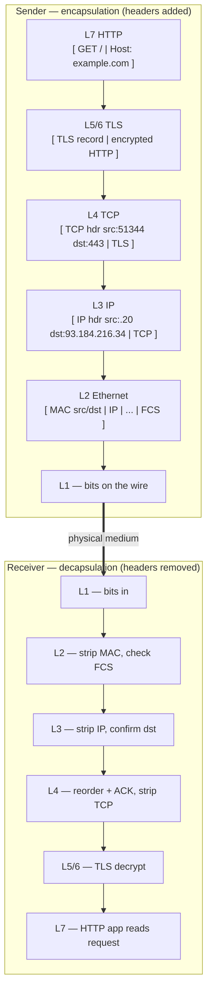

# OSI & TCP/IP Model — Middle

<!-- level-focus -->
At middle level, focus on this question:

> Where does **OSI & TCP/IP Model** belong in a maintainable component, and which trade-off selects the design?

Use the smallest realistic scenario that exposes the decision and its failure behavior.
## 1. The request we will trace

`curl https://example.com` looks like one action. It is actually a stack of at least six protocols cooperating in sequence, each doing exactly one job and handing off to the next. No single layer knows the whole story; each trusts the layer below to deliver its payload and the layer above to make sense of it.

| Concern | Protocol | Layer (OSI) | Layer (TCP/IP) |
|---|---|---|---|
| Name → address | DNS (over UDP/TCP) | L7 application | Application |
| Encrypted session | TLS 1.3 | L5/L6-ish | (rides in Application) |
| The actual request | HTTP/1.1 or HTTP/2 | L7 application | Application |
| Reliable byte stream | TCP | L4 transport | Transport |
| End-to-end delivery | IP | L3 network | Internet |
| Link on this hop | Ethernet / Wi-Fi + ARP | L2 data link | Link |
| Bits on the medium | copper / fiber / radio | L1 physical | Link |

One honest caveat up front, because it trips up every mid-level engineer: **TLS does not map cleanly to a single OSI layer.** The OSI model put "session" at L5 and "presentation" (encoding, encryption) at L6, but the real-world TCP/IP stack has no such boxes. TLS is a library the application calls *after* TCP connects but *before* it sends HTTP bytes — it sits between L4 and L7. Treat "L5/L6" as a rough conceptual label, not a literal wire position. The four-layer TCP/IP model (Link, Internet, Transport, Application) is closer to what actually runs, and it simply folds session, presentation, and application together into one "Application" layer.

The rest of this page walks the request in order. Read it once as a story, then keep the per-layer tables as a reference for the next 2 a.m. incident.

Three framing ideas make the whole trace click:

- **Each layer talks only to its peer.** The sender's TCP header is addressed to the receiver's TCP, not to any router in between. Routers read only up to the layer they need (L3) and pass the rest along untouched. This is why the same packet means different things to different boxes on the path.
- **Layers are strictly stacked, never skipped.** HTTP cannot "reach down" and resend a lost byte — that is TCP's job. TCP cannot pick a route — that is IP's job. When you internalize that each layer has exactly one responsibility, "which layer owns this behavior?" becomes answerable, and so does "which layer is broken?"
- **Encapsulation is data-hiding, applied to networks.** Each layer treats the payload from above as an opaque blob it must merely carry — it never inspects it. That is the same information-hiding principle that governs good software modules, which is why the model composes so cleanly and why you can reason about one layer at a time.

## 2. Step 0 — DNS: turning a name into an address

`curl` cannot open a connection to `example.com` — sockets connect to IP addresses, not to names. So the very first thing that happens, before any of the layers below get involved, is a DNS lookup, and that lookup is itself a full network round trip:

1. `curl` calls `getaddrinfo("example.com", "443")` through libc — a blocking call that hides the whole exchange below.
2. The stub resolver (often `systemd-resolved`, `nscd`, or the OS built-in) sends a **UDP query to port 53** on the configured DNS server.
3. That server is your router at `192.168.1.1:53`, or a public resolver like `8.8.8.8:53` or `1.1.1.1:53`.
4. If the resolver does not already have the answer cached, it recurses: root servers → `.com` TLD servers → the authoritative server for `example.com`.
5. The answer comes back as an **A record** (`93.184.216.34`) and, if available, an **AAAA record** (the IPv6 address), each carrying a TTL.
6. Only now, with an IP in hand, does `getaddrinfo` return and the rest of the stack can begin.

There is a neat inversion worth internalizing here: **DNS is a layer-7 application protocol, yet it must succeed before any of the lower layers can even begin.** The application layer bootstraps the whole descent. DNS normally rides UDP for its low latency and small packets, and falls back to TCP when the response is too large for a single datagram (large record sets, DNSSEC, zone transfers).

This is also the source of the single most misdiagnosed outage. When a user reports "the site is down," run two pings:

```
ping 8.8.8.8        # raw connectivity — is the network reachable at all?
ping example.com    # name resolution — can we translate the name?
```

If the first succeeds and the second fails with *"cannot resolve host"* or *"Name or service not known,"* the network is perfectly healthy and the fault is **DNS (L7)**, not connectivity (L3). That one distinction routinely saves an hour of chasing firewalls that were never the problem.

A few DNS details every mid-level engineer should carry:

- **The lookup is cached at several layers.** The OS keeps a stub cache, the resolver keeps its own, and each record carries a TTL that dictates how long it may be reused. A stale cached record is why "it works on my machine but not on the new box" after a DNS change — one cache expired, the other did not.
- **`curl` resolves via the system resolver, not by talking to `8.8.8.8` directly.** So `/etc/resolv.conf`, `/etc/hosts`, and `nsswitch.conf` all influence the answer. A single line in `/etc/hosts` can override the entire internet for that name — useful for testing, dangerous when forgotten.
- **A and AAAA are both requested.** On a dual-stack host, `curl` may try IPv6 first and silently fall back to IPv4 (Happy Eyeballs). "Only fails over IPv6" is a real and common class of bug hiding behind a name that "resolves fine."

Diagnose the lookup itself with `dig example.com A +short` — it shows the raw answer, the TTL, and which server responded, none of which `ping` reveals.

Quick DNS triage, in order:

- `dig example.com` returns an answer → resolution works; the problem is below L7.
- `dig @8.8.8.8 example.com` works but your default resolver does not → your local resolver or `resolv.conf` is misconfigured, not the record.
- `dig +trace example.com` walks root → TLD → authoritative → shows exactly where the chain breaks (an expired delegation, a dead authoritative server).

## 3. Step 1 — the socket and the 5-tuple

Once `curl` has an IP address, it asks the kernel for a **socket** and connects. A socket is the operating system's handle for one endpoint of one conversation. Internally, the kernel identifies every active flow — and demultiplexes every arriving packet to the correct process — by a **5-tuple**:

```
(protocol, source IP, source port, destination IP, destination port)
```

For our request the tuple looks like:

```
(TCP, 192.168.1.20, 51344, 93.184.216.34, 443)
```

Each field earns its place:

- The **destination port** `443` is *well-known*: it declares "HTTPS server, talk to me." The service defined the port; the client merely dialed it.
- The **source port** `51344` is *ephemeral* — the kernel picks an unused high port (the Linux default range is `32768–60999`) so that reply packets can be routed back to this exact `curl` process and no other.
- The **protocol** field genuinely matters. `TCP:443` and `UDP:443` are two *different* flows on the same host. QUIC (HTTP/3) runs over `UDP:443` and coexists peacefully with classic `TCP:443` precisely because the protocol field disambiguates them.

The 5-tuple is the quiet workhorse of the entire internet. It is why **one server IP can serve millions of clients simultaneously** — every client differs in at least its source IP or source port — and why **one client can hold dozens of connections to the same server** at once, each on a different ephemeral port. It is also the exact unit that NAT tables, stateful firewalls (`conntrack`), and load balancers key their state on. When a long-idle connection mysteriously dies, a firewall somewhere evicted this tuple from its table to reclaim memory; the fix is usually a TCP keepalive that touches the tuple often enough to keep it warm.

Inspect the live tuples on your own machine:

```
ss -tnp state established '( dport = :443 )'
# State  Recv-Q Send-Q   Local Address:Port    Peer Address:Port   Process
# ESTAB  0      0        192.168.1.20:51344    93.184.216.34:443   users:(("curl",pid=4821))
```

A short worked scenario makes the tuple's power concrete. Suppose a machine behind NAT opens two connections to the same web server:

- Flow A: `(TCP, 10.0.0.5, 40001, 93.184.216.34, 443)`
- Flow B: `(TCP, 10.0.0.5, 40002, 93.184.216.34, 443)`

Four of the five fields are identical; only the **source port** differs, and that alone is enough for the kernel to keep the two responses separate. When these packets cross a NAT gateway, the gateway rewrites the source IP (and possibly the source port) and records the translation in its `conntrack` table — keyed, again, on the 5-tuple. Return packets are matched against that table and rewritten back. This is why:

- **Port exhaustion is real.** A single client IP behind NAT can hold at most ~64k simultaneous connections *to one destination IP:port*, because that is how many distinct source ports exist. Behind carrier-grade NAT, thousands of subscribers share that budget.
- **`conntrack` table limits cause mysterious drops.** When a busy firewall's connection table fills, *new* connections are dropped while existing ones keep working — a signature that looks like "the service randomly rejects some users."

## 4. Step 2 — TCP handshake (L4)

Before a single HTTP or TLS byte can flow, TCP must build a reliable channel with the **three-way handshake**:

1. **Client → Server:** `SYN` (seq = x) — "I want to talk; here is my starting sequence number."
2. **Server → Client:** `SYN, ACK` (seq = y, ack = x + 1) — "Agreed, and here is mine; I acknowledge yours."
3. **Client → Server:** `ACK` (ack = y + 1) — "Confirmed. We are synchronized."

Why *three* and not two? Because each side must both *send* its own initial sequence number and *confirm receipt* of the other's — and the middle `SYN, ACK` cleverly combines the server's send with its acknowledgment, so three packets suffice instead of four. The random initial sequence numbers are a security measure: predictable ones would let an off-path attacker inject data into the stream.

After that third packet the connection is `ESTABLISHED` and both directions may send data. TCP's whole reason for existing at L4 is to turn the unreliable packet delivery of IP into a **reliable, ordered byte stream**: it numbers every byte, retransmits anything that goes missing, reassembles out-of-order segments, applies flow control via the receiver's advertised window, and applies congestion control to decide how fast it is safe to push.

Two failure signatures at L4 are worth memorizing because they tell you completely different things:

- **`SYN` sent, nothing comes back** → the connection eventually **times out**. This almost always means a firewall is silently *dropping* your packets, or the host is entirely down. `curl` hangs for many seconds, then reports *"Connection timed out."*
- **`SYN` → `RST`** → the host answered, but the port is **closed** — nothing is listening. `curl` reports *"Connection refused"* almost instantly.

*Refused* and *timed out* are not synonyms. Refused means a live host actively rejected you (fast); timed out means nobody answered at all (slow). That one difference tells you whether the machine is up, which is the first fork in any transport-layer investigation.

A useful reflex: when you see `TIME-WAIT`, ask "who closed first?" — the side that initiates the close pays the `TIME-WAIT` cost (typically 60 s on Linux) so that stray late packets from the old connection cannot be misread by a new one reusing the same tuple. It is protective, not a leak. `CLOSE-WAIT`, by contrast, is the *other* side waiting for *your* app to call `close()` — that one is on you.

The canonical L4 test tool is `nc` (or old-school `telnet`):

```
nc -vz example.com 443
# Connection to example.com (93.184.216.34) 443 port [tcp/https] succeeded!
```

If that succeeds, TCP is healthy and any remaining fault lives *above* L4 — in TLS or in the application. You have just cut the search space in half.

Two more L4 realities that separate a mid-level engineer from a junior:

- **The handshake is where round-trip latency first bites.** Every one of the three packets crosses the network. On a 100 ms-RTT link, the handshake alone costs ~100 ms *before* TLS or HTTP even start — which is why connection reuse (keep-alive, connection pools) matters so much for throughput.
- **`ESTABLISHED` is only one of ~11 TCP states.** `SYN-SENT`, `SYN-RECV`, `TIME-WAIT`, `CLOSE-WAIT`, `FIN-WAIT` and friends each tell a story. A pile of sockets stuck in `CLOSE-WAIT` means *your* application opened connections and never called `close()` — a resource leak, not a network fault. A pile in `TIME-WAIT` is normal on the side that closed first, but too many can exhaust ephemeral ports. Read them with `ss -tan | awk '{print $1}' | sort | uniq -c`.

## 5. Step 3 — IP routing and ARP (L3 and L2)

Each TCP segment is handed down to IP (L3), whose job is to decide **how to move this packet toward `93.184.216.34`**. The kernel consults its routing table:

```
ip route get 93.184.216.34
# 93.184.216.34 via 192.168.1.1 dev eth0 src 192.168.1.20
```

The destination is not on the local subnet, so the packet must be sent to the **default gateway** (`192.168.1.1`) — the router that knows how to reach the wider internet. But IP is an end-to-end abstraction, whereas actual delivery happens **one physical hop at a time** at L2. To place the packet on the wire, the machine needs the gateway's **MAC address**, which it discovers with **ARP** (Address Resolution Protocol, L2):

1. **Broadcast request:** "Who has `192.168.1.1`? Tell `192.168.1.20`." — sent to the broadcast MAC `ff:ff:ff:ff:ff:ff` so every device on the LAN sees it.
2. **Unicast reply:** "`192.168.1.1` is at `aa:bb:cc:11:22:33`." — only the gateway answers.

The result is cached in the ARP table (`ip neigh`) so the broadcast is not repeated for every packet — entries age out after a few minutes of silence, at which point the next packet triggers a fresh ARP.

Now the Ethernet frame can be addressed and sent. This exposes the single most important layering insight in all of networking:

> **The L3 destination IP stays constant end-to-end (`93.184.216.34`), but the L2 destination MAC changes at every single hop.**

Each router along the path strips the incoming frame, reads the IP header, decides the next hop, and **rewraps the same packet in a brand-new frame** with a new source and destination MAC. The IP payload never changes; only the link-layer envelope is replaced hop after hop. Meanwhile the IP header's **TTL** (time-to-live) decrements by one at each router; if it ever reaches zero the packet is discarded and an ICMP "time exceeded" message is returned to the sender. That mechanism is exactly how `traceroute` maps the path — it sends packets with deliberately tiny TTLs and watches which router complains at each distance.

Debug L3 with `ping` (does the host answer at all?) and `traceroute`/`mtr` (where along the path does delivery break?). If `ping 192.168.1.1` — your own gateway — fails, you are stuck at the very first hop and nothing above L3 has any chance of working. Fix that before looking anywhere else.

Two ARP-and-routing pitfalls worth naming:

- **A poisoned or stale ARP cache silently misdelivers frames.** If two hosts claim the same IP, or an attacker answers ARP requests they should not, your frames go to the wrong MAC and the connection "works intermittently." Inspect the cache with `ip neigh`; a neighbor stuck `INCOMPLETE` means the ARP reply never came — an L2 problem masquerading as an L3 outage.
- **Same-subnet traffic skips the gateway entirely.** If the destination *is* on your local subnet, there is no default-gateway hop: the kernel ARPs for the destination directly and sends one frame. This is why "I can reach the database but not the internet" points straight at the gateway or its route, not at the local NIC.

## 6. Step 4 — TLS: the session that HTTP rides on

TCP has now given us a reliable pipe, but it is a **plaintext** pipe — anyone on the path could read it. Because the URL is `https://`, `curl` performs a **TLS handshake** over that pipe *before* sending a single byte of HTTP. With TLS 1.3 this takes just one round trip:

1. **ClientHello** — the client offers its supported cipher suites, a key-share for the key exchange, and critically the **SNI** (`server_name = example.com`).
2. The SNI matters because a server hosting hundreds of sites on one IP must know *which certificate* to present before it can respond — and SNI travels in the clear, which is why "which site" is visible to the network even though the content is not.
3. **ServerHello + Certificate + Finished** — the server picks a cipher suite, returns its certificate chain, sends its own key-share, and signals it is done.
4. Both sides independently derive the same symmetric session keys from the two key-shares (an ephemeral Diffie–Hellman exchange, so past traffic stays safe even if the server's long-term key later leaks — "forward secrecy").
5. `curl` verifies that the certificate chains up to a trusted root CA, that it has not expired, and that its name matches `example.com`.
6. The client's **Finished** message seals the handshake, and application data may now flow encrypted.

From this point on, everything — including the HTTP request and response — is encrypted. This is the "session/presentation-ish" work of the stack: the cryptography (presentation, L6) plus the notion of a keyed session that outlives any individual TCP segment (session, L5).

The TLS-layer failures are distinct from everything below and are easy to misattribute:

- **Certificate expired, self-signed, or name mismatch** → `curl` reports *"SSL certificate problem"*. Note that TCP connected *perfectly* — the fault is purely at TLS, above L4.
- **No shared cipher or protocol version** → the handshake fails outright even though the port is wide open and accepting connections.

Debug TLS specifically — not with `ping` or `nc`, which cannot see this layer at all — but with:

```
openssl s_client -connect example.com:443 -servername example.com
```

It prints the negotiated protocol version, the entire presented certificate chain, and the precise point at which verification succeeds or fails, ending in a line like `Verify return code: 0 (ok)`.

A subtlety that catches people: **an *incomplete* chain fails only on some clients.** If the server forgets to send an intermediate certificate, browsers that happen to have cached that intermediate succeed, while `curl` and freshly-installed machines fail with *"unable to get local issuer certificate."* The bug is not "sometimes broken" — it is a missing intermediate that only some clients can paper over. `openssl s_client` shows the exact chain the server sent, which is how you catch it.

## 7. Step 5 — HTTP (L7) and the trip back up

Only now does the actual request travel out — encrypted inside the TLS session, carried by TCP, routed by IP, framed by Ethernet:

```
GET / HTTP/1.1
Host: example.com
User-Agent: curl/8.4.0
Accept: */*
```

The `Host` header is what lets one IP and port serve many *virtual hosts* at L7. Note the elegant division of labor:

- The TLS **SNI** (L5/6) chose which *certificate* to present.
- The HTTP **`Host`** (L7) chooses which *application or vhost* handles the request.
- The **IP + port** (L3/L4) merely got the bytes to the machine.

Three different layers, three different selectors, all serving the same goal of multiplexing many sites onto one address. When they disagree — SNI says one site, `Host` says another — servers must decide which wins, and mismatches here are a classic source of routing and security surprises (domain fronting being the notorious example).

The server replies with `HTTP/1.1 200 OK`, a set of response headers, and the HTML body. Then the entire journey runs **in reverse — decapsulation.** The server's NIC receives the frames; L2 verifies the checksum and strips the Ethernet header; L3 confirms the packet is addressed to this host and strips the IP header; L4 reassembles the TCP segments into an ordered byte stream and acknowledges them; TLS decrypts the payload; and finally L7 hands clean plaintext HTTP to the application. **Every layer removes exactly the header that its peer added on the other side** — a perfectly symmetric mirror of the send path. `curl` prints the body, and the socket eventually closes with a graceful `FIN`/`ACK` teardown.

It is worth seeing what "L7" actually buys you over the raw byte stream that TCP delivers. TCP hands up *a stream of bytes with no boundaries* — it has no idea where one HTTP message ends and the next begins. HTTP imposes that structure itself:

- **HTTP/1.1** delimits messages with headers, a blank line, and either a `Content-Length` or `Transfer-Encoding: chunked`. Get that framing wrong (a proxy that miscounts the length) and you get **request smuggling** — two parties disagreeing on where a message ends.
- **HTTP/2** multiplexes many logical requests over one TCP connection using binary *frames* and *stream IDs*, so a slow response no longer blocks the others queued behind it (head-of-line blocking at L7 is gone — though TCP-level head-of-line blocking remains, which is exactly what HTTP/3 over QUIC fixes by moving to UDP).

The practical takeaway: when you run `curl -v`, the lines prefixed `>` are the request headers *you* sent and the lines prefixed `<` are the response headers the server sent — that is the L7 conversation in the clear, sitting on top of everything the lower layers did silently to get those bytes across.

## 8. Encapsulation and decapsulation, staged

Each layer wraps the data from the layer above inside its own header — nested envelopes, each addressed to its own peer. The diagram stages the packet *growing* on the way down and being *peeled* on the way up. A router in the middle would only ever descend to L3; it never opens the TCP or TLS envelopes, which is precisely why a router cannot read your HTTP headers but a reverse proxy can.



Read it top-to-bottom on the left (headers accreting), across the medium, then top-to-bottom on the right (headers falling away). The application payload is identical at both ends; only the wrappers come and go.

A concrete way to feel this: capture the same request with `tcpdump -i eth0 -v host example.com and port 443` and you will literally see the nested headers in each packet — the Ethernet frame on the outside, the IP header inside it, the TCP header inside that, and an opaque TLS blob where the HTTP would be (because it is encrypted). If you switch to a plain-`http://` request, that innermost blob becomes readable HTTP text. Seeing the layers stacked in a real capture, once, is worth more than any diagram — it turns "the seven layers" from a memorized list into something you can point at on the wire.

The size overhead of all this framing is small and fixed: roughly 14 bytes of Ethernet, 20 of IP, 20 of TCP, plus TLS record overhead — about 54+ bytes of headers per packet. On a 1500-byte frame that is ~3.6% overhead, which is why very small packets (a one-byte keystroke over SSH) are so inefficient relative to their payload, and why bulk transfers try to fill frames to the MTU.

For quick reference, here is exactly what each layer contributes to the outgoing packet and what its peer uses it for on the way in:

| Layer | Header it adds | Key fields | The peer uses it to… |
|---|---|---|---|
| L7 HTTP | request/response headers | method, path, `Host`, status | route and interpret the request |
| L5/6 TLS | TLS record header | content type, version, length | frame and decrypt the payload |
| L4 TCP | TCP header (20 B) | src/dst port, seq, ack, flags | order, acknowledge, demultiplex to a process |
| L3 IP | IP header (20 B) | src/dst IP, TTL, protocol | route hop-by-hop to the destination host |
| L2 Ethernet | frame header + FCS | src/dst MAC, EtherType, checksum | deliver on this link, detect corruption |
| L1 | none (encoding) | — | put bits on the physical medium |

Notice that each header is meaningful only to its own peer: the receiving TCP reads the TCP header, the receiving IP reads the IP header, and neither cares about the other's fields. That strict separation is what lets you swap Wi-Fi for Ethernet (change L1/L2) without touching TCP or HTTP at all — the layers are genuinely independent, which is the whole reason the model has survived fifty years of changing hardware.

## 9. MTU: why 1500 bytes matters

Ethernet's default **MTU (Maximum Transmission Unit)** is **1500 bytes** — the largest IP packet a single frame can carry. This unassuming number quietly governs how all of your data gets chopped up:

- During the handshake, TCP negotiates an **MSS (Maximum Segment Size)**, typically `MTU − 40` = **1460 bytes** for IPv4 (subtracting a 20-byte IP header and a 20-byte TCP header). Because TCP never emits a segment larger than the MSS, TCP data on a clean path is **never fragmented** — the transport layer self-limits by design.
- A packet larger than the *path* MTU must either be **fragmented** (split across multiple frames and reassembled at the destination) or dropped. Fragmentation is both slow and fragile: lose any single fragment and the entire original packet is lost, forcing a full retransmit.

Where fragmentation still bites even though TCP self-limits:

- **UDP has no MSS.** A DNS-over-UDP response, a QUIC packet, or a custom UDP protocol can exceed the MTU and *will* be fragmented (or dropped if DF is set). This is a real reason large DNS answers fail on paths that mishandle fragments.
- **Tunnels stack overhead.** Each layer of encapsulation (VPN inside VPN, or VXLAN in a datacenter) subtracts more bytes. Two tunnels can quietly push the effective MTU below 1400, and only the largest packets fail — the maddening "small requests fine, big ones hang" pattern again.
- **IPv6 forbids on-path fragmentation entirely.** Routers may not fragment; the sender *must* do PMTUD. That makes a blocked ICMPv6 "packet too big" message an even harder failure than in IPv4.

**PMTUD (Path MTU Discovery)** is how a sender learns the *smallest* MTU anywhere along the path. It sets the *Don't Fragment* (DF) bit on its packets; if some router along the way needs a smaller packet, it drops the oversized one and returns an **ICMP "fragmentation needed" (type 3, code 4)** message carrying the next-hop MTU. The sender reads that and shrinks its segments. This feedback loop is where one of networking's most maddening bugs is born:

> A firewall blocks **all** ICMP "to be safe." Now PMTUD's feedback message can never get back to the sender. Small requests work perfectly; large responses — a heavy page, a file download — **hang forever**, because the oversized packets are silently dropped and the sender never learns to shrink. This is an **MTU black hole**, and it masquerades convincingly as an application bug even though it is pure L3.

MTU also drops below 1500 on tunnels, which subtract their own encapsulation overhead. Getting these wrong produces the classic "SSH connects and lets me type, but any command with large output stalls" symptom.

| MTU concept | Typical value | Why it matters |
|---|---|---|
| Ethernet MTU | 1500 bytes | Standard frame payload ceiling |
| IPv4 TCP MSS | 1460 bytes | 1500 − 20 (IP) − 20 (TCP) |
| PPPoE MTU | 1492 bytes | 8 bytes of PPPoE overhead |
| WireGuard MTU | ~1420 bytes | VPN encapsulation overhead |
| IPsec MTU | ~1400 bytes | Cipher + ESP header overhead |
| Jumbo frames | up to 9000 bytes | Datacenter LANs; higher throughput per interrupt |

Diagnose a path MTU problem with a *do-not-fragment* ping, shrinking the size until it passes:

```
ping -M do -s 1472 example.com   # 1472 payload + 28 (IP+ICMP) = 1500
# If -s 1472 fails but -s 1400 succeeds, the path MTU is below 1500 somewhere.
```

When you cannot fix the ICMP blockage (someone else's firewall), the pragmatic workaround is **MSS clamping**: a router or firewall rewrites the MSS value inside the `SYN` packet down to a safe number, forcing both endpoints to use smaller segments from the start so PMTUD is never needed. VPN gateways do this routinely (`iptables ... --clamp-mss-to-pmtu`). It is a hack, but it is the standard hack, and recognizing "the symptom is an MTU black hole, the fix is MSS clamping" is a genuine mid-level milestone.

One last mental model: **MTU is about the largest packet a *link* accepts; MSS is about the largest segment *TCP* will send.** MTU is an L2/L3 property of each hop; MSS is an L4 negotiation derived from it. They are related but live at different layers — confusing them is why people "fix" an MTU problem by changing an application setting and see nothing improve.

## 10. Debugging by layer: which layer is broken?

The single most valuable field skill in networking is **bisecting the stack**. Start at the bottom, climb upward, and stop at the *first* layer that fails — the fault lives *there*, and every layer above it is a red herring. This turns a vague "it's down" into a precise, one-command-per-layer diagnosis.

| Layer | The question to ask | Tool | "It works" means | Failure signature |
|---|---|---|---|---|
| L1 physical | Is the link up? | `ip link`, `ethtool` | `state UP`, carrier detected | `NO-CARRIER`, cable unplugged |
| L2 link | Do I know the next-hop MAC? | `ip neigh` (ARP cache) | neighbor is `REACHABLE` | `INCOMPLETE`, ARP timeouts |
| L3 network | Can I reach the host's IP? | `ping`, `traceroute`, `mtr` | replies with a valid TTL | 100% loss; path dies at hop N |
| L4 transport | Is the port open? | `nc -vz`, `telnet`, `ss` | `succeeded` / connection opens | timeout (dropped) vs refused (RST) |
| L5/6 TLS | Does the handshake + cert verify? | `openssl s_client` | `Verify return code: 0 (ok)` | expired cert, name mismatch, no cipher |
| L7 application | Does the app answer correctly? | `curl -v`, browser devtools | `HTTP/1.1 200` with expected body | `500`/`404`, wrong body, DNS failure |

A worked example. The ticket says *"The API is down."* Bisect it:

- `ping api.example.com` → **replies.** L3 is fine; it is not connectivity, and DNS clearly resolves.
- `nc -vz api.example.com 443` → **succeeded.** L4 is fine; the port is open and something is listening.
- `openssl s_client -connect api.example.com:443` → **`Verify return code: 0`.** TLS is fine.
- `curl -v https://api.example.com/health` → **`HTTP/1.1 502 Bad Gateway`.**

Conclusion, in four commands: network, transport, and TLS are all healthy; the fault is squarely at **L7**. The load balancer is up, but the backend it proxies to is failing. You go fix the application, and you never touch the firewall, DNS, or cabling. Without bisecting, "the API is down" sends a whole team randomly poking at every layer at once.

The inverse discipline matters just as much: if `ping` fails but you *know* the server is serving traffic to other clients, suspect an **ICMP-blocking firewall** (a deliberate network policy) *before* concluding the host is down. Never diagnose L3 with `ping` alone in an environment that is hostile to ICMP — reach for `nc` on a known-open TCP port instead.

Some field heuristics that flow directly from the bisect discipline:

- **Times out vs. refused vs. reset mid-stream** tell three different stories. *Timeout* = packets dropped (firewall or dead host). *Refused* = host up, nothing listening (L4 `RST` on connect). *Reset mid-stream* = something killed an established connection (an idle-timeout on a NAT/firewall, or the server crashing) — an L4 event that looks like an L7 flake.
- **"Works from my laptop, fails from the server"** almost always means a *policy* difference (security group, egress firewall, DNS split-horizon), not a code difference. Reproduce the failing side's exact `curl` from the failing host before touching the application.
- **"Slow, not broken"** is its own diagnosis. `mtr` over 60 seconds shows *where* latency and loss accumulate; a single hop with 40% loss but 0% at the final hop is often just a router deprioritizing ICMP — not real loss. Read the *last* hop's loss, not an intermediate one's.
- **Escalate only after you have named the layer.** "The API is slow" handed to the network team with no layer named wastes everyone's time; "TLS handshake takes 2 s, TCP connect is 20 ms" points them at exactly one thing.

One command does most of the layer-timing work for you. `curl` can print exactly how long each phase took:

```
curl -w 'dns:%{time_namelookup} connect:%{time_connect} tls:%{time_appconnect} ttfb:%{time_starttransfer}\n' \
     -o /dev/null -s https://example.com
# dns:0.004 connect:0.031 tls:0.068 ttfb:0.140
```

Read it as cumulative timestamps and the layers fall right out:

- `time_namelookup` — DNS finished (L7 bootstrap).
- `time_connect − time_namelookup` — the TCP handshake (L4).
- `time_appconnect − time_connect` — the TLS handshake (L5/6).
- `time_starttransfer − time_appconnect` — server think-time before the first byte (L7).

A single line of output tells you which layer owns the latency, without a packet capture. If `tls` is huge but `connect` is tiny, you have a TLS problem, not a network one — the coordinate system, delivered by one flag.

## 11. L4 vs L7 devices see different things

The recurring architecture question — "should this be an L4 or an L7 load balancer?" — is really a question about **which headers the device is allowed to read**, and that follows directly and inevitably from the encapsulation model in §8. A device can only act on the layers it has decapsulated.

An **L4 load balancer** (AWS NLB, Linux IPVS, HAProxy in TCP mode) operates purely on the **5-tuple**. It sees source and destination IP and port and forwards the raw TCP stream through. It decapsulates only down to L4, so it **cannot** read the HTTP path, the `Host` header, or a cookie, and it does not terminate TLS. That makes it fast, protocol-agnostic (it will balance *any* TCP or UDP service, not just HTTP), and completely blind to application semantics.

An **L7 load balancer / reverse proxy** (nginx, Envoy, AWS ALB) **terminates the TCP connection and usually TLS**, then parses the HTTP request. Now it can route by path (`/api` → service A, `/img` → service B), read `Host` for virtual hosting, inject `X-Forwarded-For`, retry idempotent requests, and enforce per-user rate limits. The price is that it must speak the application protocol and shoulder the cryptographic work of terminating TLS.

Trace the *same* client packet through each and the difference becomes physical:

- **Through an L4 balancer:** the packet arrives, the box reads the 5-tuple, hashes it to pick a backend, rewrites the destination (and forwards), and never looks past the TCP header. The backend sees a TCP connection that appears to come from the client (or the balancer, depending on mode). One connection in, one connection out — a splice.
- **Through an L7 proxy:** the client's TCP connection *terminates at the proxy*. The proxy completes its own TLS handshake with the client, decrypts, reads `GET /api/orders HTTP/1.1`, decides `/api` → orders-service, then opens a **separate** TCP (and possibly TLS) connection to that backend and replays the request — often adding `X-Forwarded-For` and `X-Request-ID`. Two independent connections, bridged at L7.

That is why an L7 proxy can retry a failed request (it holds the whole request in memory) while an L4 balancer cannot (it only ever saw an opaque byte stream), and why L7 adds latency and CPU that L4 does not.

| Capability | L4 device | L7 device |
|---|---|---|
| Reads IP + port (5-tuple) | Yes | Yes |
| Reads HTTP path / `Host` header | No | Yes |
| Terminates TLS | No (passthrough) | Yes (typically) |
| Route by URL / cookie | No | Yes |
| Protocols handled | Any TCP/UDP | HTTP(S), gRPC, WebSocket |
| Relative latency / cost | Lower | Higher |
| Modifies request headers | No | Yes |

The layering principle behind the whole table: **a device can only act on the layers it has decapsulated.** The router in §8 stops at L3, so it routes by IP but is oblivious to ports. An L4 balancer stops at L4, so it knows ports but not URLs. An L7 proxy climbs all the way to the top and can rewrite anything it likes. Knowing exactly where a box stops in the stack tells you precisely what it can and cannot do — and, incidentally, explains why the `X-Forwarded-For` header has to exist at all: the L7 proxy terminates the connection and thereby hides the client's real IP from the backend, so it re-injects that address as an L7 header the backend can trust.

This layering lens resolves a whole family of real-world design questions at a glance:

- **"Why can't my L4 load balancer do path-based routing?"** Because paths live in the HTTP request line at L7, and an L4 device never opened the L7 envelope. If you need path routing, you need an L7 proxy — full stop.
- **"Why does my backend see the load balancer's IP instead of the real client?"** Because an L7 proxy *is* the TCP peer from the backend's perspective; the original 5-tuple ended at the proxy. `X-Forwarded-For` (L7) or the PROXY protocol (a thin L4 shim) carries the real client address forward.
- **"Can a firewall block a specific URL?"** Only if it terminates TLS and reads L7 — a plain L3/L4 firewall sees an encrypted blob to `:443` and can block the whole host but not one path. This is why URL filtering requires a TLS-terminating proxy, with all the trust and privacy implications that carries.
- **"Where should I terminate TLS?"** Wherever you first need to read L7. Terminate at the edge L7 proxy for path routing and caching; keep it end-to-end (L4 passthrough) when the backend must see the raw certificate or when you cannot trust the proxy with plaintext.

Each of these is the *same* question — "which layer is this box allowed to read?" — asked in a different costume.

Putting the whole request on one timeline makes the cost of each layer visible. For a cold `curl https://example.com` on a 30 ms-RTT link, roughly:

- **DNS lookup** — ~1 RTT if uncached (0 ms if cached). L7 bootstrapping.
- **TCP handshake** — 1 RTT (~30 ms). The `SYN`/`SYN-ACK`/`ACK` exchange at L4.
- **TLS 1.3 handshake** — 1 RTT (~30 ms). Certificate and key-share at L5/6. (TLS 1.2 costs 2 RTT here — a real reason to prefer 1.3.)
- **HTTP request/response** — 1 RTT plus server think-time. The actual L7 work.

That is three to four round trips *before the first byte of HTML arrives*, which is exactly why keep-alive, connection pooling, TLS session resumption (0-RTT), and putting content on a CDN close to the user all matter so much. Every one of those optimizations is really "remove a round trip from one specific layer." When you can point at a waterfall in browser devtools and say "that gap is the TLS handshake, that gap is server think-time," you are reading the stack fluently — which is the entire point of this level.

## 12. Mental checklist

The core ideas, one line each:

- One request is many protocols in sequence: **DNS → socket → TCP handshake → IP/ARP routing → TLS → HTTP**, then perfect-mirror decapsulation on the way back.
- Every flow is a **5-tuple**; the ephemeral source port is what demultiplexes replies back to the right process.
- The **destination IP is end-to-end; the destination MAC is per-hop.** ARP resolves the *next hop*, never the final host.
- TLS sits **between TCP and HTTP** — a certificate error means L4 already succeeded, so stop looking any lower.
- The **1500-byte MTU** silently shapes everything; blocked ICMP breaks PMTUD and creates black holes where large transfers hang while small ones sail through.
- **MTU is a link property; MSS is a TCP negotiation.** They live at different layers; do not confuse the fix.
- **Debug bottom-up and stop at the first failing layer:** `ping` (L3), `nc` (L4), `openssl s_client` (TLS), `curl -v` (L7). The first failure names the culprit.
- A device only understands the layers it decapsulates — and that single fact is the whole difference between an L4 and an L7 load balancer.
- **Latency is paid per layer, per round trip.** Removing a round trip (keep-alive, TLS resumption, CDN) is the highest-leverage optimization there is.

And the mistakes that separate a shaky diagnosis from a clean one:

| Symptom | Wrong conclusion | Right layer / cause |
|---|---|---|
| Name won't resolve, IP pings fine | "Network is down" | DNS (L7), not connectivity |
| Connection refused instantly | "Firewall is dropping us" | Host up, nothing listening (L4 `RST`) |
| Connection times out | "Port is closed" | Packets dropped — firewall or dead host |
| Large downloads hang, small work | "Application bug" | MTU black hole — blocked ICMP breaks PMTUD (L3) |
| SSL error, but nc succeeds | "Server is down" | Certificate/chain problem (TLS), L4 was fine |
| Works in browser, fails in curl | "curl is weird" | Missing intermediate cert in the chain |
| Backend sees the proxy's IP | "Load balancer is misconfigured" | L7 proxy terminated the connection — use `X-Forwarded-For` |
| Sockets pile up in `CLOSE-WAIT` | "Network congestion" | Your app forgot to `close()` — resource leak, not L3/L4 |

A compact drill you can run against any incident:

1. Does the name resolve? (`dig`) — if not, stop: it's DNS.
2. Does the IP answer? (`ping`, or `nc` if ICMP is blocked) — if not, stop: it's L3.
3. Is the port open? (`nc -vz`) — if not, stop: it's L4.
4. Does TLS verify? (`openssl s_client`) — if not, stop: it's TLS.
5. Does the app return the right thing? (`curl -v`) — if not, it's L7.

Run them in order, stop at the first failure, and you have both the layer and the tool in under a minute.

Carry the coordinate system, not the trivia. If you can name the layer, the tool and the fix follow almost automatically — and "name the layer first" is the single habit that most distinguishes an engineer who *understands* the network from one who merely *uses* it.

*Next step:* [Senior level](senior.md)

---

## Apply it

1. Find a real component where **OSI & TCP/IP Model** affects an interface or dependency.
2. Write two plausible choices and the constraint that favors each one.
3. Make the smallest reversible change at that boundary.
4. Exercise the component alone, then exercise the integrated flow.
5. Keep the decision note with the evidence that selected the option.

## Verify your work

- A focused check proves the local behavior.
- An integrated check proves callers and dependencies still agree.
- Logs, traces, compiler output, or benchmarks expose the boundary.
- Reverting the change restores the previous behavior without unrelated edits.

## Review questions

- Which boundary is most affected by OSI & TCP/IP Model?
- What constraint would make you choose the alternative design?
- How would you isolate a local defect from an integration defect?
- What evidence shows that the change remains maintainable?
