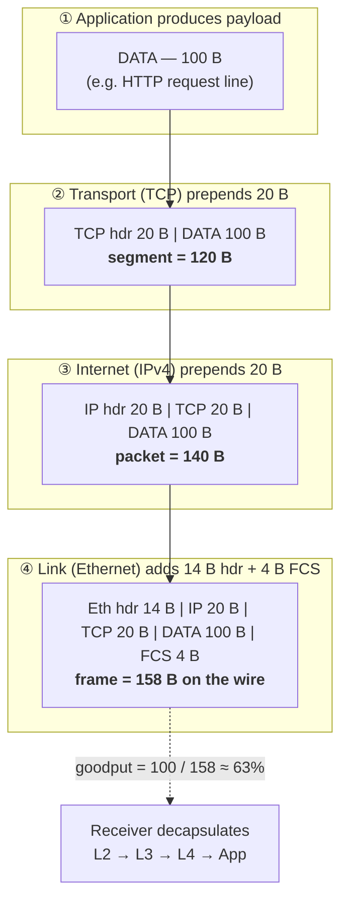

# OSI & TCP/IP Model — Theory and Formal Foundations

<!-- level-focus -->
At professional level, focus on this question:

> How should teams adopt and operate **OSI & TCP/IP Model — Theory and Formal Foundations** with measurable outcomes and limited coordination?

Use the smallest realistic scenario that exposes the decision and its failure behavior.
## 1. Layering as a Formal Abstraction

A protocol layer *N* is defined by three things, and only three things:

1. **A service interface** offered upward to layer *N+1* — the set of primitives (e.g. `SEND`, `RECEIVE`, `CONNECT`, `CLOSE`) and their semantics.
2. **A peer protocol** spoken horizontally with the same layer on the remote host — the message formats and rules that govern the header layer *N* prepends.
3. **A dependency** on the service interface exposed *upward* by layer *N−1*.

The critical formal property is **information hiding**: layer *N+1* may only rely on the *service interface* of layer *N*, never on its internal mechanism. TCP promises "reliable, ordered byte stream"; it does not promise retransmission timers, cumulative ACKs, or a specific congestion-control algorithm. Because the promise is stated abstractly, the mechanism is free to change — Reno → CUBIC → BBR — without breaking a single application. This is Parnas-style modularity applied to distributed systems: the interface is the *invariant*, the implementation is the *variable*.

Layering buys three things:

- **Substitutability.** Any layer whose implementation satisfies the interface is interchangeable. IP over Ethernet, Wi-Fi, or a carrier-pigeon link (RFC 1149, only half a joke) all present the same "best-effort datagram" service upward.
- **Independent evolution.** Layers version on separate clocks. IPv4 → IPv6 is a layer-3 change that leaves TCP untouched.
- **Bounded reasoning.** An engineer debugging a TLS handshake reasons about layers 4–7 and treats layer 3 as "packets arrive, possibly reordered, possibly dropped."

The cost is equally formal, and the rest of this document is about paying it: **per-layer header overhead**, **duplicated function** (both TCP and the link layer may do error detection), and the **temptation to violate the boundary** for performance or expedience. A layer model is only worth its overhead when the boundaries are respected; a stack full of layer violations has all the cost of layering and none of the substitutability.

---

## 2. The End-to-End Principle

The single most important design argument in networking is Saltzer, Reed, and Clark's *End-to-End Arguments in System Design* (ACM TOCS, 1984). The claim is precise:

> A function can be correctly and completely implemented only with the knowledge and help of the application standing at the endpoints of the communication system. Providing that function as a feature of the communication system itself is not possible. Therefore, providing that questioned function as a feature of the communication system itself is not always sensible.

The canonical example is **careful file transfer**. Host A wants to move a file to host B such that the bytes on B's disk match A's disk. Suppose the network guarantees reliable delivery hop-by-hop. That still does not solve the problem: the file could be corrupted by A's disk on read, by a buffer in an intermediate gateway, by B's memory before the write, or by B's disk on write. The *only* check that covers the whole path is an **end-to-end checksum** computed by application A over the original bytes and re-verified by application B after the write. Once that end-to-end check exists, per-hop reliability is redundant for *correctness*.

Two consequences follow, and they are the load-bearing insight of the internet's architecture:

- **Reliability belongs at the edges.** The network layer offers *best-effort* delivery; TCP, running on the end hosts, layers reliability on top. The routers in the middle are stateless with respect to any given connection — they do not retransmit, do not reassemble, do not track sequence numbers. This is why the IP core scales.
- **Security belongs at the edges.** Confidentiality and integrity that must survive an untrusted network can only be guaranteed by encryption computed at the endpoints (TLS, end-to-end encrypted messaging). Link-layer encryption protects one hop; it cannot protect against a compromised relay.

The principle is not absolute — it is an *argument*, weighted against performance. Per-hop reliability can still be worthwhile as a *performance optimization*: a lossy Wi-Fi link retransmits locally (802.11 ARQ) because recovering a dropped frame over one hop is far cheaper than letting TCP time out and retransmit end-to-end across the whole path. The rule is therefore: **put the function at the endpoint for correctness; add a lower-layer version only as an optimization, and only if it demonstrably helps.** A lower layer must never be the *sole* implementer of an end-to-end guarantee.

---

## 3. Why OSI (7) and TCP/IP (4) Diverged

Two models describe the same territory with different numbers of layers. This is not an accident of taxonomy — it reflects two opposite methodologies.

**OSI** was a *reference model*, designed top-down by committee (ISO, late 1970s–1980s) to be complete and rigorous before implementation. It defines seven layers, cleanly separating **Session** (dialog control, checkpoint/resync) and **Presentation** (encoding, encryption, serialization) as first-class layers.

**TCP/IP** was *running code first*. It grew out of the ARPANET, standardized through RFCs by people shipping implementations. It has four layers, and it deliberately does *not* carve out session or presentation as separate strata — those functions were absorbed into applications and libraries. HTTP manages its own session semantics (cookies, keep-alive); TLS handles its own presentation-layer encryption; JSON/Protobuf libraries handle serialization inside the app.

The famous quip captures it: "OSI was the model everyone learned; TCP/IP was the model everyone ran." OSI's layers 5 and 6 turned out not to correspond to a clean, reusable boundary in practice, so real systems collapsed them.

| Aspect | OSI (7-layer reference model) | TCP/IP (4-layer running model) |
|---|---|---|
| Origin | ISO committee, top-down, spec-first | ARPANET/IETF, bottom-up, code-first |
| Layer count | 7 | 4 (sometimes 5, splitting Link/Physical) |
| Layer 7 Application | Application | Application (absorbs OSI 5–7) |
| Layer 6 Presentation | Presentation (encoding, encryption) | — folded into app / TLS |
| Layer 5 Session | Session (dialog, checkpoint) | — folded into app protocols |
| Layer 4 Transport | Transport | Transport (TCP, UDP) |
| Layer 3 Network | Network | Internet (IP) |
| Layer 2 Data Link | Data Link | Link (Ethernet, Wi-Fi) |
| Layer 1 Physical | Physical | (part of Link) |
| Reliability placement | Prescribed per-layer | End-to-end (transport), per the E2E argument |
| Adoption outcome | Reference/teaching vocabulary | The internet |

The lasting value of OSI is **vocabulary**: engineers say "layer 3 device" (router), "layer 4 load balancer" (routes on TCP/UDP port), "layer 7 gateway" (routes on HTTP path) because the OSI numbering is a shared coordinate system. But the *architecture* the internet actually runs is the four-layer TCP/IP stack, with the end-to-end principle as its organizing law.

---

## 4. Header Formats and Sizes

Every layer prepends a header. Knowing the exact fixed sizes is what lets you reason about goodput. These are the minimum (no-options) sizes for the ubiquitous protocols:

| Protocol | Layer | Fixed header | Key fields | Notes |
|---|---|---|---|---|
| Ethernet II | Link (L2) | **14 B** | Dst MAC (6), Src MAC (6), EtherType (2) | +4 B FCS trailer; +4 B if 802.1Q VLAN tag |
| IPv4 | Internet (L3) | **20 B** | Version/IHL, Total Length, TTL, Protocol, Src/Dst IP (4+4) | 20–60 B with options; IHL counts 32-bit words |
| IPv6 | Internet (L3) | **40 B** | Traffic Class, Flow Label, Next Header, Hop Limit, Src/Dst (16+16) | Fixed 40 B, no options in base header |
| TCP | Transport (L4) | **20 B** | Src/Dst Port (2+2), Seq (4), Ack (4), Flags, Window, Checksum | 20–60 B with options (MSS, SACK, timestamps, window scale) |
| UDP | Transport (L4) | **8 B** | Src Port (2), Dst Port (2), Length (2), Checksum (2) | Minimal by design |

Two derived quantities matter constantly in system design:

- **MTU (Maximum Transmission Unit):** the largest L3 payload a link carries. Classic Ethernet MTU is **1500 B**. Jumbo frames raise it to ~9000 B inside data centers.
- **MSS (Maximum Segment Size):** the largest TCP *payload*. Over Ethernet with IPv4: `MSS = MTU − IPv4(20) − TCP(20) = 1460 B`. With TCP timestamps enabled (+12 B of options), effective MSS drops to 1448 B. Over IPv6: `1500 − 40 − 20 = 1440 B`.

The takeaway: a full-size Ethernet frame carrying TCP data spends **54 bytes of headers** (14 + 20 + 20) to deliver **1460 bytes of payload**. That fixed 54-byte tax is the anchor for all overhead math below. UDP's smaller 8-byte header is precisely why latency-sensitive and high-fan-out protocols (DNS, QUIC, RTP, gaming) prefer it — every byte of header is a byte not spent on payload, and for small messages the header *dominates*.

---

## 5. Encapsulation and the Overhead Math

Encapsulation is the mechanical realization of layering: as a message descends the stack, each layer wraps the PDU from above with its own header (and sometimes trailer). The receiver reverses the process (decapsulation), each layer stripping its own header and handing the payload up.



**The goodput formula.** For a single packet, useful throughput as a fraction of wire throughput is:

```
goodput = payload / (payload + headers)
```

With the fixed 54-byte TCP/IPv4/Ethernet header tax (ignoring FCS and inter-frame gap for clarity):

| Payload | Frame size (payload + 54) | Goodput | Interpretation |
|---|---|---|---|
| 40 B (bare ACK-ish) | 94 B | 43% | More than half the wire is header |
| 100 B | 154 B | 65% | Small request — heavy overhead |
| 512 B | 566 B | 90% | Getting efficient |
| 1460 B (MSS) | 1514 B | **96%** | Full frame — near-optimal |

**Why small packets waste bandwidth.** The header cost is *fixed per packet*, so it amortizes only when the payload is large. A workload of 40-byte messages (think chatty RPC, unbatched telemetry, per-keystroke traffic) can burn 50%+ of link capacity on headers *and* — worse — saturate the packets-per-second (pps) limit of NICs, switches, and software before it ever approaches the bits-per-second limit. This is the quantitative justification for **batching, Nagle's algorithm, and TCP segmentation offload (TSO/GSO)**: coalesce many small writes into few large frames so the 54-byte tax is paid once per 1460 bytes instead of once per 40.

**Tunneling multiplies the tax.** Every layer of encapsulation adds another header. A VXLAN-encapsulated packet in a Kubernetes overlay carries: outer Ethernet (14) + outer IP (20) + UDP (8) + VXLAN (8) + inner Ethernet (14) + inner IP (20) + inner TCP (20) = **104 bytes of headers** before payload. This is why overlay MTUs are lowered (e.g. to 1450 or 1400) to leave room, and why MTU mismatches in overlays produce maddening, size-dependent connection hangs.

---

## 6. Layer Boundaries as Interfaces and State Machines

A layer boundary is an **interface**, and the protocol at each layer is a **state machine**. TCP is the textbook example: its connection lifecycle is a finite-state machine (RFC 793/9293) that the transport layer enforces on both endpoints independently.

The point for a systems architect is not to memorize the diagram but to understand what the *interface contract* implies:

- **The service interface upward is minimal and abstract.** The socket API (`connect`, `send`, `recv`, `close`) exposes none of the states above. An application never sees `SYN_RCVD`; it sees `connect()` block and then return. The state machine is *encapsulated* — that is the whole value.
- **State lives at the endpoints, not the middle.** Both hosts run this FSM independently and reconcile via the header fields (flags, seq/ack numbers). No router holds connection state. This is the end-to-end principle expressed as a state machine: the *only* places that know a "connection" exists are the two edges.
- **The interface is where mismatches surface.** `TIME_WAIT` exhaustion, half-open connections after a crash (one side thinks `ESTABLISHED`, the other has no state), and the cost of the three-way handshake (one full RTT before data flows) are all consequences of a *distributed* state machine coordinating over an unreliable medium. TCP Fast Open and QUIC's 0-RTT are attempts to shave that handshake RTT while preserving the contract.

Understanding a protocol as `(interface, peer protocol, state machine)` is what lets you predict its failure modes without reading the RFC line by line: you ask *what state can each endpoint be in, what messages transition it, and what happens when a message is lost or arrives after a crash.*

---

## 7. Layer Violations and Leaky Abstractions

A **layer violation** occurs when a layer depends on, or manipulates, information that belongs to another layer. The abstraction *leaks* (Spolsky's "Law of Leaky Abstractions"): the promise that you can reason about a layer in isolation quietly fails.

The archetypal violation is **NAT (Network Address Translation)**. NAT is a layer-3 device that, to function, must rewrite **layer-4** port numbers (to disambiguate multiple internal hosts behind one public IP) and even reach into **layer-7** payloads for protocols that embed IP addresses in their body (classic FTP `PORT` command, SIP). NAT thereby:

- **Breaks the end-to-end principle.** There is no longer a globally unique, end-to-end addressable endpoint; the internal host is unreachable from outside without hole-punching, STUN/TURN, or explicit port forwarding. Peer-to-peer connectivity becomes a research problem (ICE) rather than a socket call.
- **Couples layers that were supposed to be independent.** A "layer 3" box now must parse and rewrite layer 4 and sometimes layer 7. Add a new transport protocol and NAT boxes won't pass it, because they were written to understand only TCP and UDP.

More generally, **middleboxes** — NATs, firewalls, transparent proxies, load balancers, DPI appliances, "TCP accelerators" — sit in the path and inspect or modify fields above their nominal layer. Each one that parses TCP options, rewrites sequence numbers, or strips unknown flags creates a *dependency of the network on the current header format*. That dependency is the mechanism of **ossification**: once millions of boxes assume TCP looks a certain way, changing TCP breaks in the field even though both endpoints agree.

The costs of layer violations are concrete:

- **Lost substitutability.** You can no longer swap a layer's implementation, because something downstream reads its internals.
- **Fragile evolution.** New extensions get silently dropped or mangled. Measurements (e.g. by the IETF's tcpm/QUIC groups) found that new TCP options and even new TCP flags fail to traverse a non-trivial fraction of internet paths.
- **Debugging across boundaries.** A leaked abstraction means a bug at layer 7 might actually be a middlebox mangling layer 4 — the reasoning boundary you relied on is gone.

The engineering lesson mirrors §2: layer violations are sometimes *pragmatically necessary* (NAT bought the IPv4 internet a decade of address-space breathing room), but each one is a debt paid in lost evolvability. The internet's inability to deploy IPv6 quickly, or to change TCP, is the compounded interest on that debt.

---

## 8. Ossification and Why QUIC Hides in UDP

Ossification is the endgame of §7: because middleboxes read and enforce the *current* wire format of TCP, the transport layer has become effectively un-evolvable in the open internet. Any attempt to change TCP's header, add a flag, or introduce a new IP-protocol number risks packets being dropped by a firewall that "doesn't recognize" them. The network has calcified around what it can already parse.

QUIC is the architectural response, and it is a masterclass in working *with* the theory:

1. **It runs over UDP.** UDP is the one transport middleboxes already pass (it carries DNS, so blocking it breaks the internet). By encapsulating a brand-new reliable, multiplexed, congestion-controlled transport inside UDP datagrams, QUIC gets a new transport past boxes that would have blocked a new IP protocol number. From the network's viewpoint it is "just UDP."
2. **It encrypts almost everything, including transport metadata.** QUIC's packet number, ACKs, and connection control are inside the TLS-1.3-encrypted payload. A middlebox *cannot* read or rewrite sequence numbers because it cannot decrypt them. This is deliberate: **encryption is used to enforce the layer boundary.** What the middlebox cannot see, it cannot ossify.
3. **It exposes a tiny, explicitly-versioned invariant surface.** Only a minimal set of fields (a few header bits, the connection ID, version) are visible on the wire, and the design assumes anything left visible *will* eventually be misused, so it is kept deliberately small and versioned.

The pattern is profound: the end-to-end principle says function belongs at the endpoints; ossification is what happens when the middle *seizes* function it was never supposed to have; and QUIC reclaims the endpoints' authority by **cryptographically hiding the transport from the middle**. It moves the entire transport state machine into user space (so it can evolve on app release cadence, not OS-kernel cadence) and behind encryption (so the network cannot depend on its internals). It is the end-to-end argument, re-asserted with cryptography as the enforcement mechanism.

> 🎞️ **See it animated:** [The TCP/IP Guide — Encapsulation & the OSI/TCP-IP layers](http://www.tcpipguide.com/free/t_DataEncapsulationandtheTCPIPProtocolStackDatagramsF-2.htm)

The overhead trade is real and worth stating: UDP+QUIC pays a slightly larger header than bare TCP and does connection setup in user space, but it *earns* deployability and 0-RTT resumption — a net win precisely because it sidesteps the ossified middle rather than fighting it.

---

## 9. Synthesis: Design Rules That Fall Out of the Theory

The formal treatment above collapses into a handful of rules you can apply without re-deriving them:

- **Place a function at the endpoint for correctness; add a lower-layer copy only as a measured optimization.** Never let a lower layer be the *sole* owner of an end-to-end guarantee (Saltzer–Reed–Clark, §2).
- **Respect the interface, not the implementation.** Depend on a layer's *service contract*, never its internal fields. The moment you parse another layer's header for logic, you have created an ossification point (§6, §7).
- **Do the byte accounting.** Know the 54-byte TCP/IPv4/Ethernet tax and the `goodput = payload/(payload+headers)` formula. Batch small writes; a workload of tiny packets loses to headers and to pps limits long before bps limits (§5).
- **Watch MTU across every encapsulation.** Each tunnel (VXLAN, WireGuard, IPsec) subtracts from usable payload; mismatches cause size-dependent hangs (§5).
- **Expect the middle to ossify anything it can read.** If you design a protocol you want to evolve, minimize and encrypt the on-wire invariant surface — the QUIC lesson (§8).
- **Use OSI numbering as vocabulary, TCP/IP as architecture.** "Layer 4 vs layer 7 load balancer" is a useful shorthand; the four-layer end-to-end stack is what actually runs (§3).

Layering is worth its overhead exactly as long as its boundaries are honored. Every violation trades a little short-term expediency for a permanent loss of evolvability — and the internet's hardest architectural problems (IPv6 adoption, transport evolution) are the accumulated bill.


---

## Apply it

1. Define the user or business outcome that **OSI & TCP/IP Model — Theory and Formal Foundations** should improve.
2. Assign one owner for code, contracts, operations, and incidents.
3. Split delivery into reversible increments that produce evidence early.
4. Publish responsibilities, escalation paths, and compatibility windows.
5. Stop or expand only when the agreed measures support that decision.

## Verify your work

- Each increment has an owner, rollback path, and observable exit condition.
- Adoption, reliability, delivery time, and coordination cost are measured.
- Incident and migration exercises prove that responsibility is executable.
- The old path is removed only after telemetry proves it is unused.

## Review questions

- Which measurable outcome justifies investing in OSI & TCP/IP Model — Theory and Formal Foundations?
- Which team owns the full lifecycle and incident response?
- What reversible increment produces the earliest useful evidence?
- Which exit condition proves that migration or adoption is complete?
