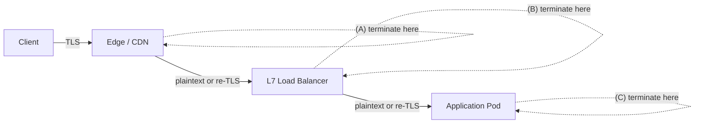
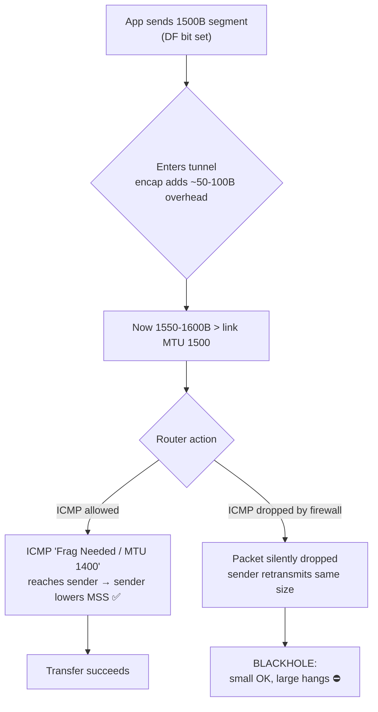
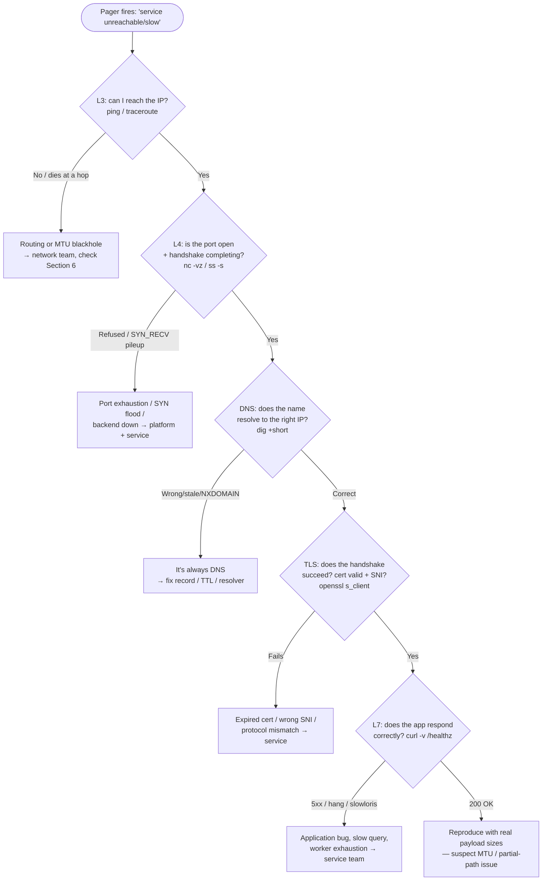

# OSI & TCP/IP Model — Senior

<!-- level-focus -->
At senior level, focus on this question:

> Which system invariant is affected by **OSI & TCP/IP Model** under failure, load, and change?

Use the smallest realistic scenario that exposes the decision and its failure behavior.
## 1. The Model as an Ownership Map

The OSI seven-layer model is a teaching abstraction; the TCP/IP four-layer model (Link, Internet, Transport, Application) is what actually ships. As a senior you use the layers not to recite them but to answer one question fast: *"Which layer owns the thing that just broke, and which team owns that layer?"*

The load-bearing mapping in practice:

- **L2 (Link)** — Ethernet, ARP, MAC learning, VLANs. Owned by the network/cloud fabric. You rarely touch it, but broadcast storms and ARP failures live here.
- **L3 (Internet)** — IP, routing, ICMP, subnets, MTU. Owned by network/platform. Routing blackholes and MTU problems live here.
- **L4 (Transport)** — TCP/UDP, ports, connection state, SYN/ACK. Owned by platform + service. Port exhaustion, SYN floods, and connection-pool sizing live here.
- **L7 (Application)** — HTTP, gRPC, TLS payload, DNS-as-app-protocol. Owned by the service team. Routing on hostnames and paths, retries, slowloris, and most business logic live here.

The senior instinct is to **push each concern to the highest layer that has enough context to make the decision correctly, then no higher.** Routing on a URL path needs L7 context; routing on raw throughput can stay at L4. Encryption of user data needs L7 semantics to know *what* to protect but rides L4/L6 mechanics to do it. Getting this altitude right is 80% of good network design.

A concrete tell that a team has the wrong mental model: they file a "the API is slow" ticket to the application team when the real cause is L3 asymmetric routing or an L4 SYN backlog. The rest of this document is about not being that team.

---

## 2. L4 vs L7: What Each Can and Cannot Route On

A load balancer is the sharpest place to see the layer tradeoff, because the *same box* can operate at L4 or L7 with radically different capabilities and costs.

An **L4 load balancer** forwards TCP/UDP connections. It sees the 5-tuple (src IP, src port, dst IP, dst port, protocol) and nothing above it. It cannot read a URL, a header, or a cookie — those are inside an opaque byte stream (and if TLS is in play, an encrypted one). It is cheap, fast, connection-oriented, and largely stateless per packet.

An **L7 load balancer** terminates the connection, parses the application protocol (HTTP/gRPC), and then makes decisions on hostname, path, method, headers, and cookies. It can retry idempotent requests, rewrite paths, inject headers, do sticky sessions by cookie, and multiplex HTTP/2 streams. It costs more CPU (it terminates TLS and buffers requests) and holds more state.

| Capability                          | L4 (Transport)                          | L7 (Application)                                    |
|-------------------------------------|-----------------------------------------|----------------------------------------------------|
| Routing key                         | 5-tuple (IP + port + proto)             | Hostname, path, method, headers, cookies           |
| Sees inside TLS                     | No (encrypted bytes are opaque)         | Yes — it terminates TLS                             |
| Per-request routing                 | No (per-connection only)                | Yes (each HTTP request routed independently)       |
| HTTP/2 & gRPC stream awareness      | No (one long connection = one backend)  | Yes (splits streams across backends)               |
| Content-based / canary by header    | No                                      | Yes (route `x-canary: true` to new fleet)          |
| Retry / hedging on failed request   | No (can't tell request boundaries)      | Yes (idempotent request retry)                     |
| Path/host rewrite, header injection | No                                      | Yes                                                |
| Sticky sessions                     | By source IP hash only                  | By cookie / consistent hashing on app identity     |
| Preserves client source IP          | Yes (DSR / L4 passthrough)              | No by default (needs `X-Forwarded-For` / PROXY)    |
| Throughput / latency cost           | Very low                                | Higher (TLS + parse + buffer)                       |
| WAF / auth / rate-limit by user     | No                                      | Yes                                                |
| Works for non-HTTP TCP (SMTP, DB)   | Yes                                     | No (needs a known app protocol)                    |

The senior takeaways:

- **If the routing decision depends on request content, you must be at L7 — full stop.** No amount of L4 cleverness reads a path.
- **If you need to preserve the exact client IP end-to-end without a proxy protocol, or you're proxying a non-HTTP protocol, L4 is your only clean option.**
- **HTTP/2 and gRPC quietly break naive L4.** A single long-lived HTTP/2 connection carries many streams; an L4 LB pins that whole connection to one backend, so all your multiplexed requests hit one server and load-balancing "stops working." This is a classic senior gotcha — the fix is an L7 (or gRPC-aware) proxy that balances per-stream.
- **A tiered design is common and correct:** an L4 LB at the very edge (cheap, absorbs volume, preserves IP, survives L7 restarts) fronting an L7 mesh/ingress that does the smart routing. Don't feel obligated to pick one.

---

## 3. Placing the Concern: A Decision Framework

Given any cross-cutting concern, ask three questions to find its home layer:

1. **What context does the decision need?** If it needs the request path, header, or user identity, it's L7. If it needs only endpoints and bytes, L4 or lower suffices.
2. **What's the blast radius of getting it wrong at this layer?** Lower layers are shared by everything; a mistake there takes down *all* services, not one. Push risky, service-specific logic up.
3. **Who can observe and fix it in an incident?** Put the concern where the owning team has visibility. A retry policy buried in an L4 device that the app team can't see or change is a liability.

Applying this:

- **Retries and timeouts** — L7. They need request boundaries and idempotency knowledge the transport layer doesn't have. (TCP retransmits at L4, but *application* retries belong at L7.)
- **Rate limiting per user/tenant** — L7 (needs identity). Coarse connection-rate limiting can be L4 as a DDoS backstop.
- **Health checks** — layer-matched: an L4 TCP-connect check tells you the port is open, not that the app is healthy. Prefer an L7 check (`GET /healthz`) so you don't route traffic to a process that accepts connections but returns 500s.
- **Encryption in transit** — mechanics ride L4-L6 (TLS), but *policy* (what to encrypt, cert rotation, mTLS identity) is an L7/platform decision.
- **Observability** — you want it at every layer, because triage crosses layers (Section 7).

---

## 4. TLS Termination Placement and the Visibility Tradeoff

Where you terminate TLS is one of the highest-leverage architecture decisions in the whole stack, because **wherever TLS terminates is the first place anything can read the request** — and everything upstream of that point is blind.

Three canonical placements:

**(A) Terminate at the edge / CDN.** Lowest client latency (TLS handshake ends close to the user), centralized cert management, WAF and DDoS scrubbing can inspect plaintext. **Cost:** traffic inside your network past the edge is plaintext unless you re-encrypt; you trust the whole internal path. Compliance regimes (PCI, HIPAA) often forbid plaintext internal hops, forcing re-encryption anyway.

**(B) Terminate at the L7 load balancer / ingress.** The common default. The LB sees plaintext to make routing/WAF/rate-limit decisions, and you can re-encrypt to the backend (TLS passthrough to the app is then off the table since the LB already decrypted). Good balance of visibility and control.

**(C) Terminate at the application (or use end-to-end / passthrough TLS).** Maximum confidentiality — nothing between client and app reads the payload. Required for true end-to-end encryption and some zero-trust models. **Cost:** your L7 LB is now blind. It cannot route on path, cannot run a WAF, cannot do L7 health checks or per-request retries — it's demoted to an L4 device. This is the visibility tradeoff in its starkest form: **more confidentiality means less mid-path intelligence.**

The senior framing: **TLS termination point = visibility boundary.** Draw it on your architecture diagram. For each thing you want to do to traffic (route, inspect, rate-limit, cache, WAF), it must happen *at or after* the point where TLS is terminated. If security requires end-to-end TLS *and* you need L7 routing, you're forced into either (a) mTLS re-encryption at each hop (LB terminates, re-encrypts to backend) or (b) moving the smart routing into the app / a sidecar that lives inside the trust boundary. A service mesh (Envoy sidecars doing mTLS) is the mainstream answer: TLS is end-to-end at the pod level, but the sidecar — inside the pod's trust boundary — still gives you L7 routing and observability.

> 🎞️ **See it animated:** [The TLS 1.3 Handshake, byte by byte](https://tls13.xargs.org/)

---

## 5. Layer-Specific Failure Modes

Each layer fails in characteristic ways. Recognizing the *signature* of a failure is what lets you skip layers during triage instead of bisecting blindly.

**L2 — ARP failures and broadcast storms.** A missing or stale ARP entry means a host can't resolve a neighbor's MAC and packets silently drop on-subnet. A **broadcast storm** — often a switching loop without spanning-tree protection, or a misbehaving NIC — floods the segment with broadcast frames, saturating links and CPUs until the whole L2 domain grinds to a halt. Signature: *everything on one subnet degrades simultaneously, regardless of application.* In cloud you rarely own L2, but overlay networks (VXLAN) and misconfigured security groups produce L2-flavored "can't reach the neighbor" symptoms.

**L3 — routing blackholes and MTU blackholes.** A bad route, asymmetric routing (SYN goes one way, SYN-ACK returns another and gets dropped by a stateful firewall), or a blackhole route sends packets into the void with no ICMP back. Signature: *some destinations unreachable while others are fine; traceroute dies at a specific hop.* MTU blackholes (Section 6) are a special, nasty L3 case.

**L4 — SYN floods and port exhaustion.** A **SYN flood** fills the server's SYN backlog with half-open connections (SYN sent, ACK never completes), starving legitimate handshakes — mitigated with SYN cookies. **Ephemeral port exhaustion** happens when one host opens so many outbound connections that it runs out of the ~28k default ephemeral ports (or floods the conntrack table / a NAT gateway), and new connections fail with "cannot assign requested address." Signature: *connections refused or timing out under load, `netstat` shows huge `TIME_WAIT` or `SYN_RECV` counts.* This is the classic failure of a client-side connection pool that's too large or a service that opens a fresh connection per request instead of reusing.

**L7 — slowloris and payload attacks.** **Slowloris** holds many connections open by sending HTTP headers one byte at a time, never completing a request, exhausting the server's worker/connection slots with almost no bandwidth. It defeats naive per-request thread models and is invisible to L4 rate limiting (the connections look legitimate). Signature: *server out of worker slots, but bandwidth and CPU are low.* Mitigation is an L7 proxy with header/body timeouts and connection caps. Other L7 modes: large-payload / decompression bombs, and application-level infinite loops that hold a connection.

| Layer | Failure mode              | Signature                                        | Primary mitigation                          |
|-------|---------------------------|--------------------------------------------------|---------------------------------------------|
| L2    | Broadcast storm / ARP     | Whole subnet degrades, app-agnostic              | STP/loop-guard, storm control               |
| L3    | Routing / MTU blackhole   | Some dests dead; traceroute dies at a hop        | Route audit, PMTUD fix, MSS clamp           |
| L4    | SYN flood                 | `SYN_RECV` piling up, handshakes fail            | SYN cookies, backlog tuning                 |
| L4    | Port / conntrack exhaust  | "Cannot assign requested address", `TIME_WAIT`   | Connection reuse, pool sizing, more NAT IPs |
| L7    | Slowloris                 | Workers exhausted, CPU/bandwidth low             | Header/body timeouts, connection caps       |

---

## 6. MTU, Fragmentation, and PMTUD Blackholes

This is the single most under-diagnosed cross-layer bug, and it earns its own section because the symptom lies to you.

The **MTU** (Maximum Transmission Unit) is the largest L3 packet a link will carry — 1500 bytes on standard Ethernet. When a packet is too big for the next link, one of two things happens:

- **IPv4:** if the "Don't Fragment" (DF) bit is clear, a router fragments it; if DF is set (which TCP sets, to enable PMTUD), the router *drops* it and sends back an ICMP "Fragmentation Needed" message telling the sender the correct MTU.
- **IPv6:** routers never fragment; the source must discover the path MTU via ICMPv6 "Packet Too Big."

**Path MTU Discovery (PMTUD)** depends entirely on those ICMP messages getting back to the sender. And here's the trap: **overzealous firewalls and security groups routinely drop all ICMP.** When they do, the sender never learns the packet was too big. It keeps retransmitting the same oversized packet, which keeps getting silently dropped. This is a **PMTUD blackhole.**

The signature is unmistakable once you've seen it and baffling before: **the connection establishes fine, small requests and responses work perfectly, but large responses hang forever.** Why? The TCP handshake and small packets fit under the MTU. The first *full-size* data segment — a big response body, a large POST, a TLS certificate chain — exceeds the tunnel MTU, gets DF-dropped, and the ICMP that would fix it is filtered. The app sees a stalled transfer, not an error.

Tunnels and VPNs make this the default rather than the edge case, because encapsulation *reduces* the effective MTU:

Root cause: an IPsec/GRE/WireGuard/VXLAN header eats 20–100 bytes, so the payload MTU inside the tunnel is smaller than 1500, yet endpoints still emit 1500-byte packets assuming DF-PMTUD will correct them — and it can't, because ICMP is filtered somewhere on the path.

**The senior fixes, in order of preference:**

1. **MSS clamping** (a.k.a. "MSS fix"). On the tunnel/router, rewrite the TCP Maximum Segment Size option in SYN packets down to fit the tunnel MTU (e.g., clamp to path MTU minus 40). This makes both endpoints negotiate a segment size that fits, so no oversized packet is ever sent and no ICMP is needed. This is the standard, robust cure — it doesn't rely on the broken ICMP path.
2. **Lower the interface MTU** on the tunnel endpoints to the real path MTU. Simple but blunt.
3. **Actually allow ICMP** type 3 code 4 (IPv4) / ICMPv6 Packet Too Big through firewalls — the *correct* fix that people break in the name of "security." Blindly dropping all ICMP is an anti-pattern; PMTUD needs it.
4. **Enable PMTUD blackhole detection** on the OS, which probes with progressively smaller segments when a connection stalls.

The diagnostic reflex: when you hear "works for small, hangs for large," or "curl of the login page is fine but downloading the report freezes," suspect MTU *before* you suspect the application. Confirm with `ping -M do -s 1472 <host>` (IPv4: 1472 payload + 28 header = 1500) and step the size down to find the real path MTU; a `tcpdump` showing repeated retransmits of same-sized large segments with no ACKs seals it.

---

## 7. The Layered Mental Model for Incident Triage

The two most useful aphorisms in on-call networking:

- **"It's always DNS."** So many "the service is down" incidents bottom out at a stale record, a failed resolver, a TTL that outlived a failover, or split-horizon DNS returning the wrong answer. DNS is an L7 application protocol that *everything* depends on before it does anything else, which is why it's the silent first domino.
- **"It's a lower layer than you think."** Engineers reflexively debug at the layer they own — the app. Nine times out of ten the app is a victim, not the cause. Discipline yourself to start low and climb.

Triage by walking *up* the stack, only ascending once the layer below is proven healthy. Each rung has a cheap, decisive test:

Why this order beats intuition:

- **You fail fast at the cheapest layer.** A one-second `ping`/`traceroute` can rule out (or pin) an entire class of causes before you ever read an application log.
- **You avoid the confirmation-bias trap** of debugging the app because that's your codebase. The stack-walk forces you past your comfort zone.
- **DNS and TLS sit between L4 and L7 in practice** even though the textbook puts DNS at L7 — treat them as explicit rungs because they're the two most common real-world culprits and each has a one-line decisive test (`dig +short`, `openssl s_client -connect host:443 -servername host`).
- **The "reproduce with real payload sizes" terminal step** is where the Section 6 MTU bug hides — a health check passes, so you declare victory, but the real request carries a big body and blackholes.

The senior habit is to **narrate the layer you're on** during an incident bridge: "L3 is clean, L4 handshake completes, DNS resolves correctly, TLS is valid — so we're above the transport, this is application or payload-size." That sentence alone hands off correctly to the right team and stops five people from debugging the wrong layer in parallel.

---

## 8. Owner and Decision Altitude

Layer ownership maps to organizational ownership, and the senior's job is to make sure each concern is decided at the altitude where the deciding team has both the context and the authority.

| Concern                        | Home layer | Deciding owner              | Decision altitude                     |
|--------------------------------|------------|-----------------------------|---------------------------------------|
| Subnet / VLAN / routing design | L2/L3      | Network / cloud platform    | Platform architecture                 |
| MTU / MSS clamp on tunnels     | L3/L4      | Network + VPN owner         | Platform, reviewed by service on incidents |
| L4 LB, DDoS/SYN backstop       | L4         | Platform / edge team        | Platform standard, per-service opt-in |
| L7 routing, canary, WAF        | L7         | Service + platform ingress  | Service owns rules, platform owns engine |
| TLS termination point          | L4-L7      | Security + platform         | Architecture decision (write it down) |
| Retries / timeouts / hedging   | L7         | Service team                | Service owns; platform sets defaults  |
| Rate limits per tenant         | L7         | Service (policy) + platform | Service defines, platform enforces    |
| Connection pool sizing         | L4         | Service team                | Service, informed by port/conntrack limits |
| Health check semantics         | L4 vs L7   | Service team                | Service (choose L7 check on purpose)  |

Two altitude anti-patterns to police:

- **Too low.** A retry policy or rate limit baked into an L4 device the service team can't see or change. When it misbehaves, the owning team is blind. Push service-specific logic up to L7 where its owner can observe and tune it.
- **Too high.** Every service reinventing TLS, mTLS identity, and connection handling in application code, when a mesh sidecar or shared ingress should own the mechanics. Push undifferentiated plumbing *down* into the platform.

The rule of thumb: **mechanics belong in the platform (low, shared, uniform); policy belongs with the service (high, specific, owned).** TLS *mechanics* (handshakes, cert rotation, cipher suites) → platform/mesh. TLS *policy* (which internal hops may be plaintext, which endpoints require mTLS) → security architecture. Routing *engine* → platform ingress. Routing *rules* (this path canaries to v2) → service. When you can't cleanly separate mechanic from policy, that's the signal to draw the boundary explicitly in a design doc rather than let it default to whoever touched it last.

---

## 9. Senior Checklist

- [ ] Every routing decision is at the lowest layer that has enough context — and you can name why it's there.
- [ ] Content-based routing (path/header/cookie) lives at L7; you haven't tried to fake it at L4.
- [ ] HTTP/2 and gRPC traffic is balanced per-stream (L7 or gRPC-aware), not pinned per-connection by a naive L4 LB.
- [ ] The **TLS termination point is drawn on the architecture diagram** and treated as the visibility boundary; everything you do to traffic happens at or after it.
- [ ] Where end-to-end TLS is required *and* L7 routing is needed, a mesh sidecar (or per-hop re-encryption) resolves the tension — not a blind L4 LB pretending to route.
- [ ] Tunnels/VPNs have **MSS clamping** configured; you don't rely on unfiltered ICMP for PMTUD.
- [ ] Firewalls/security groups allow ICMP "Fragmentation Needed" / "Packet Too Big" — you've verified this, not assumed it.
- [ ] Health checks are **L7 where correctness matters** (`/healthz`), not just an L4 TCP-connect.
- [ ] Connection pools are sized against ephemeral-port and conntrack limits; connections are reused, not opened per request.
- [ ] There are SYN-flood (SYN cookies) and slowloris (header/body timeouts) mitigations in front of every internet-facing service.
- [ ] The team triages **bottom-up** (L3 → L4 → DNS → TLS → L7), narrates the current layer on incident bridges, and reproduces with **real payload sizes** before declaring victory.
- [ ] Each cross-cutting concern's owner and decision altitude is explicit: mechanics down in the platform, policy up with the service.

---

*Next step:* [Professional level](professional.md)

---

## Apply it

1. State the system invariant that **OSI & TCP/IP Model** must protect.
2. Mark ownership, state, and failure propagation at each boundary.
3. Compare two designs under load, dependency failure, and future change.
4. Define recovery and compatibility behavior before implementation.
5. Test the riskiest assumption with a focused experiment.

## Verify your work

- The experiment supports the design with evidence, not preference.
- Failure injection shows the blast radius and recovery path.
- Compatibility checks cover old and new callers or data.
- Operational signals reveal invariant violations and recovery progress.

## Review questions

- Which invariant must remain true when OSI & TCP/IP Model fails?
- Where should recovery responsibility live, and why?
- Which assumption deserves an experiment before implementation?
- How can the design evolve without changing every consumer at once?
