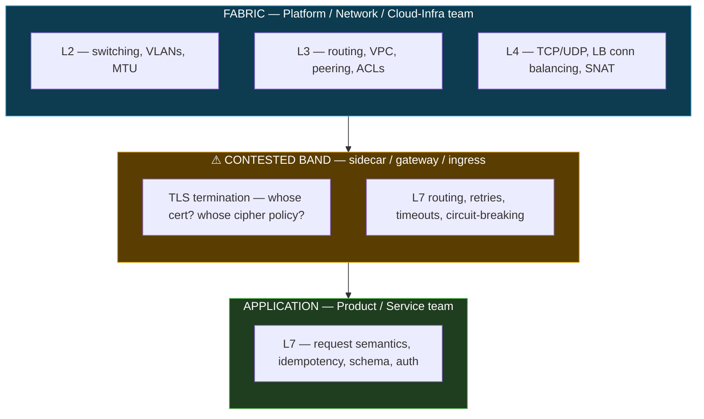
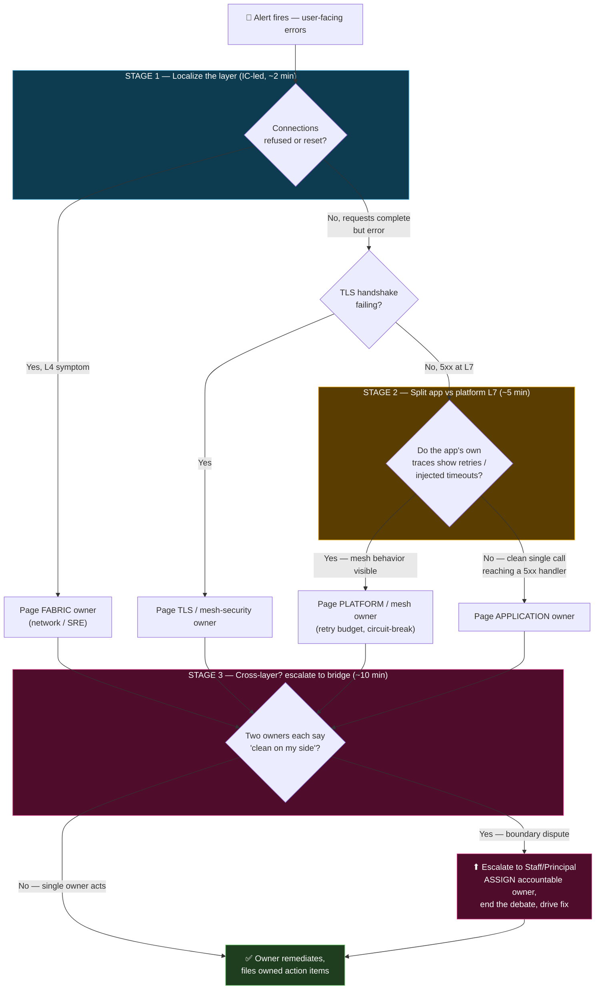

# OSI & TCP/IP Model — Staff / Principal Level

The layered network model is usually taught as physics and packet formats. At Staff/Principal altitude it is something else entirely: an **org chart in disguise**. Every layer boundary is a place where one team's responsibility ends and another's begins, where a vendor contract is drawn, where a build-vs-buy decision was made, and where — during an incident — someone points at the layer below them and says "not mine." This document treats the stack as a **separation-of-concerns axis across teams and vendors**, and shows how you use it to draw ownership, run incident reviews, and reason about platform abstractions that inevitably leak.

## Table of Contents

1. [The Stack Is an Org Chart](#1-the-stack-is-an-org-chart)
2. [Where the Fabric Ends and the App Begins](#2-where-the-fabric-ends-and-the-app-begins)
3. [Ownership by Layer — the Table Staff Engineers Actually Draw](#3-ownership-by-layer--the-table-staff-engineers-actually-draw)
4. [The Layer as Shared Vocabulary in Incident Reviews](#4-the-layer-as-shared-vocabulary-in-incident-reviews)
5. [Standardization vs Leaky Abstractions](#5-standardization-vs-leaky-abstractions)
6. [Case Study: the L7 Retry Storm the Platform Hid](#6-case-study-the-l7-retry-storm-the-platform-hid)
7. [Build vs Buy at Each Layer](#7-build-vs-buy-at-each-layer)
8. [The Cost of a Cross-Layer Incident Nobody Owns](#8-the-cost-of-a-cross-layer-incident-nobody-owns)
9. [Staged Cross-Team Triage & Escalation](#9-staged-cross-team-triage--escalation)
10. [Principal-Level Heuristics](#10-principal-level-heuristics)
11. [Anti-Patterns](#11-anti-patterns)

---

## 1. The Stack Is an Org Chart

Conway's Law runs both directions. Your architecture mirrors your communication structure — and your *network stack* mirrors your *team structure* so precisely that you can often reverse-engineer an org from its ownership diagram. Consider what actually happens as a byte travels:

- A NIC and a switch move a frame (L2). Owned by a **network engineering** or **cloud infra** team.
- A router forwards a packet across subnets (L3). Same team, or a **cloud networking** function that owns VPCs, route tables, peering.
- A load balancer terminates a connection and picks a backend (L4). Ownership starts to blur — sometimes infra, sometimes a **platform/SRE** team.
- A proxy inspects a header, retries a request, enforces a timeout (L7). Now it's **platform** or the **application** team.

The layers were designed for *separation of concerns in packet processing*. Organizations reuse that exact seam as the boundary for **separation of concerns in ownership**, because it's the cleanest cut available: each layer has a well-defined interface to the one above and below, so responsibilities can be handed off with a contract instead of a conversation.

The trap: the OSI boundary is clean *on paper* and fuzzy *in production*. The place where "the network's job" ends and "the app's job" begins is not a crisp L4/L7 line — it wanders depending on your mesh, your cloud provider, and which team was understaffed the quarter the boundary was drawn. That wandering seam is where un-owned outages live.

## 2. Where the Fabric Ends and the App Begins

The single most consequential boundary in a modern distributed system is the one between the **fabric** (L2–L4: the network, the VPC, the LB, the connection substrate) and the **application** (L7: the request, the header, the business semantics).

Classically:

- **Below L4 is the platform/network team's world.** They guarantee that a TCP connection *can* be established between two IPs, that packets are routed, that the LB is healthy, that MTU is sane, that TLS terminates. Their SLO is phrased in connectivity and throughput: "the fabric is up."
- **At L7 is the app team's world.** They own what the request *means*: idempotency, retries, timeouts, status-code semantics, payload schemas. Their SLO is phrased in request success: "the endpoint returns correct answers fast."

The problem is that modern infrastructure has smeared a huge amount of L7 concern *downward* into the fabric. A service mesh sidecar, an API gateway, an L7 load balancer, an ingress controller — these all make **application-layer decisions** (route on header, retry on 503, circuit-break, inject fault) while being **operated by the platform team**. The platform now owns a slice of L7 behavior that the app team can neither see nor control, and the app team owns L7 semantics that the platform's retries can silently violate.

That is the ambiguous boundary. It is where the sentence "the mesh retried it, so it's the app's idempotency bug" and the sentence "the app returned a 503, so it's the mesh's retry policy" are *both true and neither is owned.*

The staff-level move is to make the contested band **explicitly owned** — usually by a named platform team with a written contract about what L7 behavior it applies by default and how apps opt out.

## 3. Ownership by Layer — the Table Staff Engineers Actually Draw

Every mature platform org has some version of this table, whether written down or lived tribally. Writing it down is a Staff deliverable, because the un-written rows are exactly where 3 AM finger-pointing happens.

| Layer | Concrete artifact | Default owner | Vendor / build-buy | Failure the owner is on the hook for | Classic boundary dispute |
|-------|-------------------|---------------|--------------------|--------------------------------------|--------------------------|
| L1 physical | Cabling, NIC, transceivers, DC power | Cloud provider (buy) | Always buy in cloud | Link down, flapping port | None (fully abstracted by cloud) |
| L2 data link | Switch, VLAN, MTU, MAC learning | Cloud networking / netops | Buy (VPC) or build (on-prem fabric) | Broadcast storm, MTU black-hole | MTU mismatch → app sees "random" hangs |
| L3 network | Routing, VPC, subnets, peering, NACL, BGP | Cloud infra / network eng | Buy (managed VPC) vs build (own routers) | Route blackhole, asymmetric routing | Egress DNS/route change breaks an app call nobody attributes to routing |
| L4 transport | TCP/UDP, conn-level LB, NAT, SNAT ports | Platform / SRE | Managed NLB (buy) vs self-run LB (build) | SNAT port exhaustion, conn resets | "Connection reset" — app blames LB, LB blames backend saturation |
| TLS (5/6-ish) | Cert issuance, cipher policy, mTLS, rotation | Platform security / mesh team | Managed cert (buy) vs own PKI (build) | Expired cert, weak cipher, handshake fail | Whose cert expired — the app's or the sidecar's? |
| L7 infra | Gateway, ingress, mesh sidecar routing/retry/timeout | **Platform (contested)** | Mesh (Istio/Linkerd), managed API GW | Retry storm, wrong route, timeout mismatch | The core dispute — see §6 |
| L7 app | Request semantics, idempotency, schema, authZ | Application / product team | Build (always) | Bad response, non-idempotent handler, schema drift | App's non-idempotency + platform's retries = duplicate writes |

Two rules make this table useful rather than decorative:

1. **Every row has exactly one accountable owner** (RACI's "A"), even if many teams are "responsible." An outage with two accountable owners has zero.
2. **The contested L7-infra row is named, not implied.** If your mesh applies default retries, *that policy is a product with an owner and a changelog*, not an ambient property of the network.

## 4. The Layer as Shared Vocabulary in Incident Reviews

The most underrated value of the model at Staff level is not technical — it's **linguistic**. In a war room with 15 responders from 6 teams, the fastest way to converge is to *name the layer*. "Is this L4 or L7?" is a triage question that instantly halves the responder set and points at an owner.

- "Connections are being **refused**" → L4 → the LB/transport owner leads, the app team stands down.
- "Connections **establish** but requests **500**" → L7 → the app team leads, the fabric team provides evidence it's clean and stands down.
- "TLS handshake fails for *some* clients" → the 5/6 band → cert/cipher owner leads.

This is why disciplined incident commanders open with layer questions. The layer name is a **coordination primitive**: it aligns responders faster than any dashboard, because it maps a symptom directly onto an owner in the table above. A responder who says "the app is broken" has said nothing actionable; a responder who says "we see SYNs but no SYN-ACKs from the backend pool" has named L4, indicted the fabric, and cleared five app engineers to go back to bed.

The failure mode: an org that has never agreed on the layer vocabulary. Then the incident review becomes a semantic argument ("what do you mean 'the network'?") layered on top of a technical one, and mean-time-to-ownership balloons. Establishing the vocabulary is cheap prevention with an outsized payoff.

## 5. Standardization vs Leaky Abstractions

The whole promise of layering is **standardized interfaces**: the app writes to a socket and doesn't care about BGP; the platform routes packets and doesn't care about JSON schemas. Every good platform doubles down on this — a service mesh is precisely an attempt to *hoist L4–L7 cross-cutting concerns (retries, timeouts, mTLS, observability, traffic-shifting) out of every app and into a shared platform layer that teams inherit for free.*

When it works, it's the highest-leverage thing a platform team can do: one team encodes best-practice L7 behavior once, and 300 services get retries, mTLS, and golden metrics without writing a line. That is separation of concerns paying its dividend.

But **all abstractions leak** (Spolsky's law), and the cost of a leak is proportional to how much the abstraction hid. The mesh hides a *lot* of L7. So when it leaks, it leaks catastrophically, and it leaks *into a team that doesn't own the abstraction and can't see inside it.* The app team inherited a behavior it didn't write, can't observe, and now has to debug through an interface designed to hide exactly the thing that's broken.

The staff-level tension is a genuine trade-off, not a solved problem:

| | Push concern into the platform layer (mesh/sidecar) | Keep concern in the app (library/code) |
|---|---|---|
| Consistency | High — one policy, all services | Low — every team reinvents |
| Time-to-adopt for a new service | Near zero (inherit) | High (re-implement) |
| Visibility to app team when it breaks | Low — behavior is "magic" | High — it's their code |
| Blast radius of a bad default | Huge — every service at once | Contained — one service |
| Who debugs a leak | App team, through an opaque layer | The team that wrote it |
| Change-management surface | One config, fleet-wide | Per-service deploys |

Neither column is correct. The principal decision is *which specific concerns* to hoist and *how loudly they announce themselves when they leak*. A hoisted concern must ship with **observability that survives the leak**: if the mesh retries, the app's traces must show the retry, or you've built a beautiful abstraction that is un-debuggable at exactly the moment debugging matters.

## 6. Case Study: the L7 Retry Storm the Platform Hid

The canonical cross-layer incident. It is worth internalizing because it recurs in every mesh-adopting org.

**Setup.** The platform team enables a sensible default in the mesh: retry any request that fails with a 5xx, up to 3 times, because transient failures are common and retries improve success rates. The app team is never told the exact policy — that's the *point* of the abstraction. Services inherit it for free.

**Trigger.** Service B, a downstream, gets slow under load and starts returning 503s. Service A calls B.

**The storm.** Every 503 from B triggers 3 retries from A's sidecar. So B, *already overloaded*, now receives **3–4× the traffic** it was struggling with. It gets slower, returns more 503s, which trigger more retries. The retries are stacked: if there's a chain A→B→C, retries multiply *per hop* — a single user request can fan out to `3 × 3 × 3 = 27` requests at the leaf. This is a **retry storm**, and it converts a small overload into a full collapse of the dependency chain.

**The ownership vacuum.** In the war room:

- The **app team for B** says: "We're returning 503s correctly — we're overloaded. This is a capacity problem, that's the platform's fabric SLO." (True.)
- The **app team for A** says: "We didn't write any retries. Our code makes *one* call." (Also true — the retries live in the sidecar.)
- The **platform team** says: "Retries are a standard resilience default; the app should be idempotent and handle load. This is an app design issue." (Also arguably true.)

Every statement is correct and no one owns the incident, because the *behavior that caused it* (retry amplification) lives in the contested L7-infra row that was never explicitly owned. The abstraction leaked, and it leaked into a gap in the org chart.

**The staff-level fixes** — technical and organizational, both required:

- Technical: **retry budgets** (cap retries as a % of total traffic, not per-request), **exponential backoff with jitter**, **circuit breaking** so A stops calling a failing B, and **retry-attempt propagation** so downstream hops don't re-retry an already-retried request.
- Organizational: the mesh retry policy becomes an **owned product** in the table (§3), with a changelog, a default that is *documented to every app team*, and traces that make retries *visible in the app's own dashboards* so the abstraction announces its leaks.

The lesson is not "meshes are bad." It's that hoisting an L7 concern into the platform layer transferred a failure mode into an ownership gap, and closing that gap is a Staff responsibility that no dashboard does for you.

## 7. Build vs Buy at Each Layer

Every layer is independently a build-vs-buy decision, and the model gives you a clean axis to reason about it. The heuristic: **buy the layers where you have no differentiating advantage and the failure modes are well-understood; build only where owning the layer is a competitive edge or the managed option can't meet your constraints.**

| Layer | "Buy" (managed) | "Build" (own it) | When building is justified |
|-------|-----------------|------------------|----------------------------|
| L2/L3 fabric | Cloud VPC, managed routing | Own routers, BGP, on-prem DC fabric | Regulatory data locality; scale where cloud egress cost dominates; latency floors cloud can't hit |
| L4 load balancing | Cloud NLB/ALB | Self-run L4 LB (e.g. IPVS, custom) | Extreme connection scale, custom balancing, protocol quirks the managed LB won't do |
| TLS / PKI | Managed certs (ACM, Let's Encrypt automation) | Own CA, custom cipher policy, mTLS PKI | mTLS everywhere, strict crypto compliance, air-gapped envs |
| L7 gateway/mesh | Managed API GW, hosted mesh | Self-run Istio/Envoy/custom proxy | Deep custom routing, sovereignty over data plane, cost at fleet scale |
| L7 app logic | — | Always build | Always — this is your product |

Two principal-level cautions:

1. **Buying a layer does not remove the ownership row — it changes the owner to a vendor.** When AWS's NLB has a bad hour, *you still own the incident to your users*; you've merely traded a team you can page for a status page you can only watch. The build-vs-buy decision is really a decision about *which failures you can fix yourself versus which you can only escalate and wait on.* For a Tier-0 service, that difference can dominate the cost model.
2. **Mixed ownership across a single request path is the expensive case.** If a request traverses your-own-fabric → bought-LB → your-mesh → your-app, an incident may require four different escalation paths (two internal teams, one vendor, one open-source community). The *number of distinct owners on the critical path* is itself a reliability risk, independent of each component's quality. Minimizing owner-count on Tier-0 paths is a legitimate architectural goal.

## 8. The Cost of a Cross-Layer Incident Nobody Owns

The dollar cost of a cross-layer incident is not the outage minutes alone — it's **outage minutes multiplied by time-to-ownership.** A single-layer incident with a clear owner resolves fast: the owner is paged, the owner acts. A cross-layer incident with an ambiguous boundary spends its most expensive minutes in *negotiation*, not remediation.

The cost structure of the "nobody owns it" incident:

- **Detection is fine** — alerting fires normally.
- **Triage is slow** — no one can name the layer, so no one knows who leads.
- **Diagnosis is adversarial** — each team invests effort proving it's *not them* (defensive forensics) rather than *fixing it*, because being the owner has career cost in a blame culture. This is the single biggest multiplier, and it's an *organizational*, not technical, cost.
- **Remediation is delayed** until someone senior forces ownership — often the Staff/Principal engineer, whose actual job in the room is to *assign the layer and end the debate.*
- **The post-incident action items are un-owned too**, so the same incident recurs — the most expensive outcome of all.

The quantifiable Staff insight: **you can drive down MTTR by driving down time-to-ownership, and time-to-ownership is a function of how well your ownership table is drawn and how blameless your culture is.** Two orgs with identical technology can have 5× different incident costs purely from how crisply their layer boundaries map to accountable owners. The boundary table in §3 is not documentation hygiene — it is a direct lever on incident cost.

## 9. Staged Cross-Team Triage & Escalation

When a cross-layer incident hits, the layer model drives a *staged* triage that converges on an owner fast. The goal of each stage is to **eliminate layers and their owners** until one accountable team remains.

The critical design feature is **Stage 3**: the explicit acknowledgment that some incidents *are* cross-layer and land in a boundary dispute. The org's response to that is not more debate — it's a pre-agreed escalation to a role empowered to *assign* ownership. In healthy orgs this role is a Staff/Principal engineer or the incident commander with a mandate: "when the boundary is contested, I pick the owner, and the retro decides if that was right." Making that authority explicit *before* the incident is what collapses time-to-ownership from hours to minutes.

## 10. Principal-Level Heuristics

- **Draw the ownership table before you need it.** The un-written rows are precisely where un-owned outages live. Reviewing it quarterly catches boundary drift (a new mesh feature that silently moved an L7 concern into the platform).
- **Name the contested band explicitly.** L7-infra (gateway/mesh/sidecar) is the highest-value and highest-ambiguity row. Give it a named owner, a policy changelog, and default behaviors documented to every app team.
- **Hoist a concern into the platform only if it can announce its own leaks.** A hoisted L7 behavior (retry, timeout, fault-inject) *must* be visible in the app team's own traces, or you've built an un-debuggable abstraction that fails at the worst moment.
- **Count owners on the critical path.** For Tier-0 request paths, the number of distinct accountable owners (internal teams + vendors + OSS communities) is itself a reliability risk. Minimize it.
- **Buy layers you don't differentiate on — but know you've traded a pageable team for a status page.** Managed doesn't remove the ownership; it changes the failure from "we fix it" to "we escalate and wait."
- **Optimize time-to-ownership, not just MTTR.** In cross-layer incidents, the expensive minutes are negotiation, not remediation. Blameless culture + a crisp boundary table is a direct lever on incident cost.
- **Use the layer name as your first triage question.** "L4 or L7?" halves the responder set and points at an owner faster than any dashboard.

## 11. Anti-Patterns

- **The two-accountable-owner boundary.** Any row in the ownership table with two "A"s effectively has zero. During an incident it produces the adversarial-forensics stall. Fix: exactly one accountable owner per row.
- **The invisible mesh default.** Platform enables fleet-wide retries/timeouts/circuit-breaking that app teams can neither see nor opt out of, with no changelog. The first time an app team learns the policy exists is during the retry-storm post-mortem.
- **"The network is fine" without evidence.** A fabric owner declaring innocence without producing L4 evidence (SYN/SYN-ACK counts, LB conn metrics, reset counts) doesn't clear the layer — it just moves the argument. Every "not me" must ship proof.
- **Vendor-as-owner denial.** Treating a managed layer (cloud LB, managed cert) as "not our problem" during an incident. The vendor owns the *fix*; you still own the *incident to your users*, including comms and mitigation.
- **Layer vocabulary drift.** Different teams meaning different things by "the network" or "the platform." Turns every incident review into a semantics argument on top of the technical one. Fix: agree the shared vocabulary once, use it in every retro.
- **Un-owned action items.** The cross-layer incident closes without a single accountable owner for its follow-ups, guaranteeing recurrence — the most expensive anti-pattern of all, because you pay for the same outage twice.

---

*Next step:* [Interview questions](interview.md)
