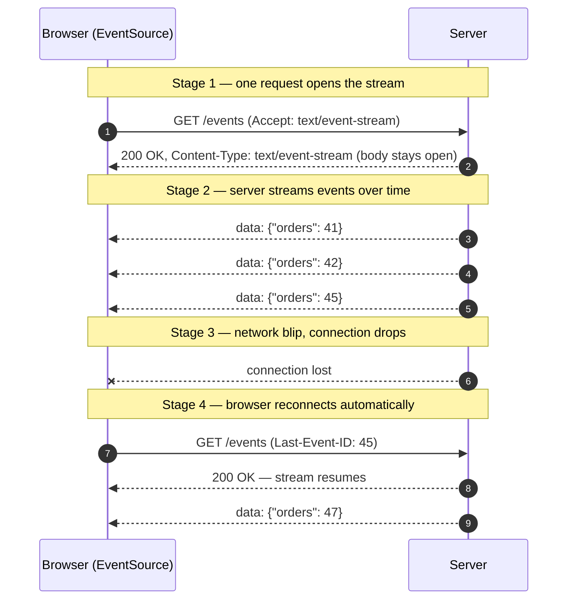
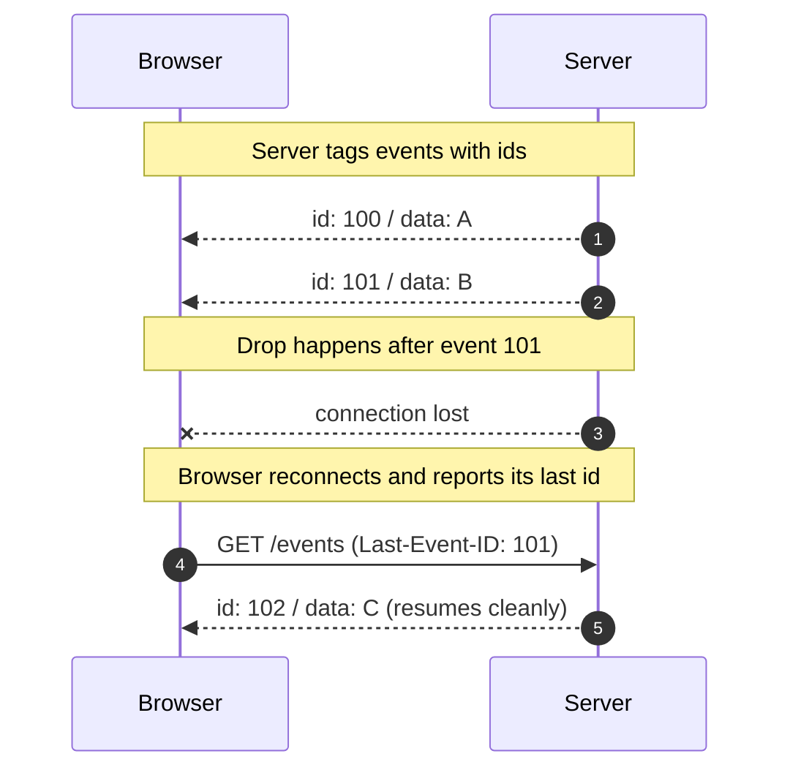

# Server-Sent Events (SSE) — Junior

<!-- level-focus -->
At junior level, focus on this question:

> How can I apply **Server-Sent Events (SSE)** in one small example and prove the result?

Use the smallest realistic scenario that exposes the decision and its failure behavior.
## 1. The one-sentence idea

**SSE lets a server send a continuous stream of events to a browser over a single, long-lived HTTP request — one direction only, from server to client.**

Everything else on this page is a detail of that one sentence. The client asks once ("give me the stream"), and the server replies not with a single page but with an **open pipe** it keeps writing into: event, event, event, for as long as the connection lives.

The direction matters. With SSE the **server talks, the client listens**. If your feature is "the client needs to know when something happens on the server" — a new notification, a changed score, a build finishing — SSE fits perfectly. If the client also needs to send a stream of messages back over the same channel, SSE is the wrong tool (that's WebSockets).

---

## 2. The problem SSE solves

The web was built around **request/response**: the browser asks, the server answers, the connection closes. That works for loading a page. It does **not** work when the *server* is the one with news.

Imagine a dashboard that should show live order counts. With plain HTTP the browser has no way to be "told" — it can only ask. So developers make it ask over and over:

- Ask every 5 seconds. Most answers are "nothing changed." Wasteful, and updates lag by up to 5 seconds.
- Ask more often to reduce lag → even more wasted requests and server load.

This repeated asking is called **polling**, and it is the baseline SSE improves on. SSE flips the model: the browser asks **once**, and the server sends updates **the moment they happen**, with no repeated requests and no polling delay.

Because SSE rides on ordinary HTTP, it works through the same infrastructure you already have — proxies, load balancers, HTTPS, cookies, auth headers. There is no special protocol upgrade to configure.

---

## 3. How SSE works over HTTP

An SSE connection is just an HTTP request whose response **never finishes** (until either side closes it). Here is the whole lifecycle.

1. The browser sends a normal `GET` request, adding the header `Accept: text/event-stream`.
2. The server responds `200 OK` with `Content-Type: text/event-stream` and then **does not close the response body**.
3. The server writes events into the open body over time. Each event is a small block of text ending in a blank line.
4. The browser reads each block as it arrives and fires a JavaScript event.
5. If the connection drops, the browser **automatically reconnects** and the server resumes sending.

The staged diagram below shows one request producing many events over time.



The important insight: from the network's point of view, this is **one HTTP response that keeps growing**. There is no new protocol. A proxy that understands HTTP understands SSE.

---

## 4. The `EventSource` API in a few lines

The browser ships a built-in object called `EventSource` that handles all the hard parts — opening the request, parsing events, and reconnecting. You do not write any of that yourself.

```javascript
const source = new EventSource("/events");

source.onmessage = (event) => {
  // event.data is the text the server sent
  const update = JSON.parse(event.data);
  console.log("New value:", update.orders);
};

source.onerror = (err) => {
  // The browser will retry on its own; usually you just log.
  console.warn("SSE connection issue, will auto-retry", err);
};
```

That is a complete, working SSE client. Three things are worth noting:

- `new EventSource("/events")` immediately opens the connection.
- `onmessage` fires **once per event** the server sends — not once total.
- You never call "connect again." The browser reconnects for you.

**Named events.** A server can label events with a `event:` field so different message types go to different handlers:

```javascript
source.addEventListener("price", (e) => updatePrice(JSON.parse(e.data)));
source.addEventListener("alert", (e) => showAlert(e.data));
```

Here `source.onmessage` catches *unnamed* events, while `addEventListener("price", …)` catches events the server tagged as `event: price`. This lets one stream carry several kinds of update cleanly.

To stop listening, call `source.close()`.

---

## 5. The `text/event-stream` wire format

The magic is not in a binary protocol — it is a tiny, readable **text format**. Each event is one or more lines of `field: value`, followed by a **blank line** that marks the end of the event.

The most common event is just data:

```
data: hello world

```

(Note the empty line after it — that blank line is what tells the browser "this event is complete, fire it now.")

A richer event can use several fields:

```
event: price
id: 42
data: {"symbol": "ACME", "price": 19.95}
retry: 3000

```

Here is what each field means:

| Field   | Purpose                                                                 |
| ------- | ----------------------------------------------------------------------- |
| `data:` | The message payload. This is what shows up as `event.data`.             |
| `event:`| A name/type for the event. Routed to a matching `addEventListener`.     |
| `id:`   | An identifier the browser remembers and sends back on reconnect.        |
| `retry:`| How long (in ms) the browser should wait before reconnecting.           |
| `:`     | A line starting with a colon is a **comment**, often used as a keep-alive ping. |

A few rules that trip up beginners:

- The payload after `data:` is always **text**. To send an object, `JSON.stringify` it on the server and `JSON.parse` it on the client.
- A **blank line ends the event**. Forgetting it means the browser buffers forever and nothing fires.
- Multiple `data:` lines in one event are joined with newlines — handy for multi-line messages.
- SSE is **text only**. It cannot carry raw binary frames (that is a WebSocket strength).

---

## 6. Automatic reconnection, built in

This is SSE's quietly brilliant feature and a big reason to prefer it over hand-rolling with plain `fetch`.

If the connection drops — Wi-Fi hiccup, laptop sleep, proxy timeout, server restart — the browser **reconnects on its own**. You write no retry loop, no exponential backoff, no "am I still connected?" checks. The `EventSource` object does it.

Two mechanisms make reconnection smooth:

**1. The `retry:` field.** The server can tell the browser how long to wait before reconnecting. Send `retry: 5000` and the browser waits 5 seconds after a drop. Without it, browsers use a sensible default (commonly a few seconds).

**2. The `Last-Event-ID` header.** If the server tags events with `id:`, the browser remembers the **last id it received**. When it reconnects, it sends that id back automatically in the `Last-Event-ID` request header. A well-written server reads this header and **resumes from where the client left off**, so no events are missed during the gap.



The takeaway for a junior engineer: **resilience is free** with SSE, but resumability (not losing events across a drop) only works if *your server sends `id:` and honors `Last-Event-ID`*. Sending the id is your job; retrying is the browser's.

---

## 7. SSE vs WebSockets vs polling

These three are the usual candidates whenever you need "live" updates in a browser. They solve overlapping problems with very different trade-offs.

| Aspect                | Polling (short-poll)            | SSE                                  | WebSockets                           |
| --------------------- | ------------------------------- | ------------------------------------ | ------------------------------------ |
| Direction             | Client asks, server answers     | **Server → client only**             | **Both directions**                  |
| Underlying protocol   | Plain HTTP, many requests       | Plain HTTP, **one long request**     | Upgraded protocol (`ws://`)          |
| Connection            | Opened & closed repeatedly      | One persistent connection            | One persistent connection            |
| Real-time?            | Delayed by the poll interval    | Yes, near-instant                    | Yes, near-instant                    |
| Auto-reconnect        | N/A (you re-ask anyway)         | **Built in**                         | Manual — you write the retry logic   |
| Data type             | Text/JSON per response          | Text only (UTF-8)                    | Text **and** binary                  |
| Browser API           | `fetch` / `setInterval`         | `EventSource` (built in)             | `WebSocket`                          |
| Works through proxies | Always                          | Usually (it's just HTTP)             | Sometimes needs extra config         |
| Complexity            | Simple but wasteful             | **Simple**                           | More moving parts                    |
| Best for              | Rare, infrequent checks         | One-way live feeds                   | Chat, games, collaborative editing   |

How to read this table:

- **Polling** is the easiest to reason about but wastes requests and adds latency. Fine for "check for updates every few minutes"; poor for anything that feels live.
- **SSE** hits a sweet spot: real-time, dead simple client code, free reconnection, and it runs over the HTTP stack you already have. Its one hard limit is that it is **one-way** and **text-only**.
- **WebSockets** are the most powerful — full duplex, binary-capable — but you pay for it with more setup, no built-in reconnect, and occasional proxy friction. Reach for them only when you genuinely need the client to stream data back.

A useful rule of thumb: **if only the server has news, use SSE. If both sides constantly talk, use WebSockets. If updates are rare, polling is fine.**

---

## 8. When to use SSE (and when not to)

SSE shines whenever the server needs to push a steady flow of updates and the client mostly just watches.

**Great fits:**

- **Live notifications** — "you have a new message," "someone mentioned you." The server pushes; the bell icon lights up.
- **News, sports scores, and price feeds** — a stream of small updates flowing outward to many readers.
- **Progress updates** — a long job (video export, report generation, file import) emitting `20%… 60%… done`.
- **Log and status tailing** — streaming log lines or deploy status into a browser console view.
- **Live dashboards** — metrics, order counts, active users refreshing in real time without polling.
- **AI/chat token streaming** — many LLM chat UIs stream the answer token-by-token over SSE.

**Poor fits (prefer WebSockets):**

- **Chat where the user sends many messages** — two-way, so WebSockets.
- **Multiplayer games / collaborative editing** — low-latency, high-frequency, bidirectional.
- **Sending binary data** — SSE is text only.

**Poor fits (prefer plain HTTP/polling):**

- **Rare updates** — if something changes once an hour, a periodic check is simpler than holding a connection open.

One practical caveat to be aware of (details come in later levels): browsers limit how many concurrent SSE connections a single domain can hold over the older HTTP/1.1. Over HTTP/2 this limit is far more generous. You do not need to solve this now — just know it exists.

---

## 9. A tiny server example

To make it concrete, here is a minimal SSE endpoint in Node.js. The pattern is the same in any language: set the right headers, then keep writing `data:` blocks.

```javascript
// GET /events
function handleEvents(req, res) {
  res.writeHead(200, {
    "Content-Type": "text/event-stream",  // the SSE content type
    "Cache-Control": "no-cache",          // don't let proxies cache the stream
    "Connection": "keep-alive",           // keep the socket open
  });

  let count = 0;
  const timer = setInterval(() => {
    count++;
    res.write(`id: ${count}\n`);          // event id (for reconnect resume)
    res.write(`data: ${JSON.stringify({ tick: count })}\n\n`); // note the blank line!
  }, 1000);

  // Stop writing when the client disconnects.
  req.on("close", () => clearInterval(timer));
}
```

Points to memorize:

- The `Content-Type: text/event-stream` header is what makes it SSE.
- Every event ends with `\n\n` (the blank line).
- **Do not** call `res.end()` while you still want to stream — that closes the pipe.
- Always clean up (here, `clearInterval`) when the client disconnects, or you leak work sending events into a dead connection.

Paired with the four-line `EventSource` client from [section 4](#4-the-eventsource-api-in-a-few-lines), that is a complete live feed.

---

## 10. Common beginner mistakes

- **Forgetting the blank line.** Each event *must* end with an empty line (`\n\n`). Without it, the browser waits forever and `onmessage` never fires. This is the number-one SSE bug.
- **Calling `res.end()` too early.** That closes the stream. For SSE you keep the response open and just keep `write`-ing.
- **Expecting two-way traffic.** You cannot send messages *up* the SSE channel. The client uploads via normal separate HTTP requests (or you switch to WebSockets).
- **Sending objects directly.** `data:` is text. `JSON.stringify` on the server, `JSON.parse` on the client.
- **Proxy or gzip buffering.** Some proxies buffer responses and hold events back. Setting `Cache-Control: no-cache` and disabling response buffering for the endpoint usually fixes "events arrive in a burst instead of live."
- **No keep-alive.** On idle streams, send a comment line (`: ping\n\n`) every 15–30 seconds so intermediaries don't kill the "silent" connection as timed-out.
- **Not honoring `Last-Event-ID`.** If you want gap-free resume after a drop, your server must read that header and replay missed events. Otherwise reconnection works, but a few events may be lost.

---

## 11. Key terms

- **SSE (Server-Sent Events)** — a browser standard for one-way server→client streaming over HTTP.
- **`EventSource`** — the built-in browser API that opens an SSE stream and auto-reconnects.
- **`text/event-stream`** — the MIME content type that identifies an SSE response.
- **Event** — one text block ending in a blank line; may include `data:`, `event:`, `id:`, `retry:` fields.
- **`data:`** — the payload of an event (always text).
- **`id:` / `Last-Event-ID`** — the id the server assigns to an event, echoed back by the browser on reconnect to enable resume.
- **`retry:`** — server-suggested delay before the browser reconnects after a drop.
- **Keep-alive comment** — a line starting with `:`, sent to hold an idle connection open.
- **Polling** — repeatedly asking the server for updates; the model SSE replaces.
- **WebSockets** — a full-duplex alternative for when both sides need to stream.

---

## Apply it

1. Choose one small, known input for **Server-Sent Events (SSE)**.
2. Predict the output or observable behavior.
3. Run the smallest example or probe that exercises the concept.
4. Change one input to trigger a failure or boundary case.
5. Explain the evidence using the guide's vocabulary.

## Verify your work

- Record the exact input, command or code path, and output.
- Repeat the probe and confirm the result is consistent.
- Show one expected success and one expected failure.
- Resolve any difference between the prediction and the evidence.

## Review questions

- What problem does Server-Sent Events (SSE) solve in the example?
- Which input changes the observed result, and why?
- What is the smallest useful success check?
- Which beginner mistake would your evidence catch?
