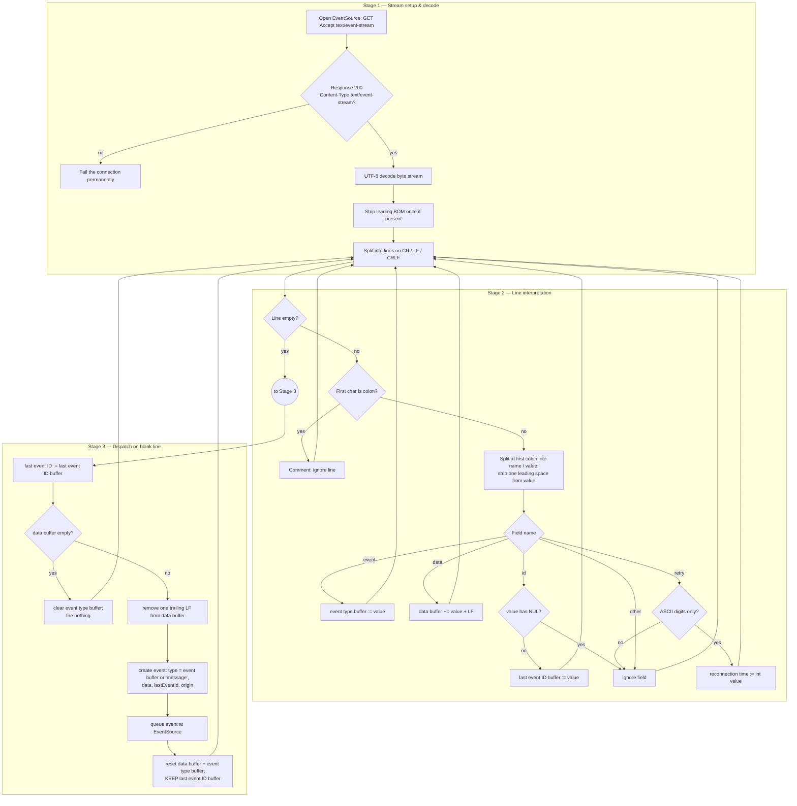

# Server-Sent Events (SSE) — Theory and Formal Foundations

<!-- level-focus -->
At professional level, focus on this question:

> How should teams adopt and operate **Server-Sent Events (SSE) — Theory and Formal Foundations** with measurable outcomes and limited coordination?

Use the smallest realistic scenario that exposes the decision and its failure behavior.
## 1. The Wire Format: `text/event-stream`

An SSE response is an ordinary HTTP response whose entity body is streamed incrementally and never ends under normal operation. The server-side contract is minimal:

- Status `200 OK`.
- `Content-Type: text/event-stream`.
- The body **must** be encoded as UTF-8. The spec fixes this: the byte stream is decoded with a UTF-8 decoder, with no negotiation via `charset`. A `charset` parameter on the content type is ignored.
- No `Content-Length`; the body is delivered with chunked transfer encoding (HTTP/1.1) or as an open stream (HTTP/2, HTTP/3).

The body is a sequence of **events**, each event a sequence of **lines**, each line a **field** or a comment or a blank separator. The grammar is line-oriented and, crucially, resilient: a parser that encounters something it does not recognize ignores it rather than aborting. This "ignore what you don't understand" posture is what lets SSE evolve without versioning and lets intermediaries pass unknown fields through harmlessly.

A minimal exchange:

```
GET /stream HTTP/1.1
Host: api.example.com
Accept: text/event-stream

HTTP/1.1 200 OK
Content-Type: text/event-stream
Cache-Control: no-cache
Connection: keep-alive

: this is a comment, keeps the connection warm

event: price
data: {"symbol":"ACME","px":42.10}
id: 4711

data: line one
data: line two

```

Two events are shown, separated by blank lines. The first carries an event type (`price`), a data payload, and an event ID. The second is a default-typed (`message`) event whose data spans two lines.

The parsing rules that turn these bytes into API events are the substance of SSE, and they are specified with unusual precision.

## 2. The Stream Parsing Algorithm, Precisely

The WHATWG HTML specification defines SSE parsing as a two-phase algorithm operating on the decoded UTF-8 character stream: **stream decoding / line splitting**, then **line interpretation**.

**Byte-order mark.** If the stream begins with a UTF-8 BOM (`U+FEFF`), it is stripped once, at the very start, by the decoder. A BOM appearing anywhere else is a normal character and is *not* stripped — which for a field name means the name won't match `event`/`data`/`id`/`retry` and the line is ignored.

**Line splitting.** The stream is divided into lines. A line is terminated by any one of three sequences, and the parser treats them identically:

- U+000D U+000A (CR LF)
- U+000A (LF alone)
- U+000D (CR alone)

The parser must handle a CR arriving at the end of one network chunk and the LF at the start of the next as a *single* CR LF terminator — line boundaries are a property of the logical character stream, not of TCP segment or HTTP chunk boundaries. This is the single most common place naive hand-rolled parsers break.

**Line interpretation.** Each complete line is processed by the following rules, in order:

1. If the line is **empty** (zero length), *dispatch the event* (Section 3) and reset the per-event buffers.
2. If the line **starts with U+003A `:`**, the line is a **comment**. Ignore it entirely.
3. If the line **contains a `:`**, split at the *first* colon. The text before it is the **field name**; the text after it is the **value**. If the value begins with a single U+0020 SPACE, remove that one space (and only one).
4. If the line contains **no `:`**, the entire line is the field name and the value is the empty string.

Then the (field name, value) pair is processed by the field-name switch in Section 3. Field names that are not `event`, `data`, `id`, or `retry` are ignored — the pair is silently dropped. Note there is no unescaping, no quoting, no JSON awareness at the transport layer: `data:` values are opaque strings, concatenated verbatim.

A subtle consequence of rule 3: a comment line is exactly a line whose *first* character is `:`, so its field name would be empty. Servers exploit this to send keep-alive pings (`:\n` or `: heartbeat\n`) that reset intermediary idle timers without producing any client-visible event.

## 3. Field Semantics and the Dispatch Rules

Four field names are meaningful. Everything else is ignored. Their processing rules and dispatch effects:

| Field | Value handling | Effect on parser state | Effect on dispatch |
|-------|----------------|------------------------|--------------------|
| `event` | Opaque string | Sets the **event type buffer** to the value | Determines the `type` of the dispatched event (the JS event name); if empty at dispatch, defaults to `message` |
| `data` | Opaque string | **Appends** the value to the **data buffer**, then appends a single U+000A LF | Data buffer (minus one trailing LF) becomes `event.data` |
| `id` | Opaque string, but a value containing U+0000 NULL is ignored | Sets the **last event ID buffer** (persists across events) | Becomes the connection's *last event ID*, echoed on reconnect |
| `retry` | Must be ASCII digits only | If all digits, parse as base-10 integer and set the **reconnection time**; otherwise ignore | No effect on the current event; changes future reconnect delay |

Two accumulation subtleties deserve emphasis:

- **`data` accumulates with an appended newline per field line.** Three consecutive `data:` lines produce a buffer of `line1\nline2\nline3\n`. On dispatch the parser removes the *last* trailing LF, yielding `line1\nline2\nline3`. A lone `data:` with empty value still appends a `\n`, so `data:\n\n` dispatches an event whose `.data` is the empty string — not "no event."
- **`id` persistence is orthogonal to event boundaries.** The last event ID buffer is *not* cleared when an event is dispatched. It persists so that if the connection drops, the client knows the ID of the most recently *identified* event, even if later events omitted `id`.

**The dispatch procedure**, triggered on a blank line:

1. Set the connection's *last event ID* string to the last event ID buffer. (This is what will be sent on reconnect — set here, once, per dispatch.)
2. If the **data buffer is empty**, clear the event type buffer and return **without** firing any event. (A stray blank line, or an event with only an `id:` and no `data:`, produces no DOM event.)
3. Remove the final trailing LF from the data buffer if present.
4. Create an event named by the event type buffer (or `message` if empty), with `.data` = data buffer, `.lastEventId` = the connection's last event ID, `.origin` = the stream's origin.
5. Queue the event to fire at the `EventSource` object.
6. Reset the data buffer and event type buffer to empty. (The last event ID buffer is *retained*.)

Step 2 is the formal reason "you can't send an event with no data" — the parser refuses to dispatch it. Step 6 is the formal reason the ID sticks while data and type reset.

## 4. The Parse-and-Dispatch State Machine (Staged)

The following diagram stages the algorithm across its three natural phases: **stream setup and decode**, **per-line interpretation**, and **per-event dispatch**. Each phase feeds the next; the reconnection path (Section 5) re-enters at Stage 1.



The loop structure — every terminal state returns to `E` (the line reader) — makes the incremental, unbounded nature of the stream explicit. There is no "end state" in normal operation; termination is an error path (Section 5).

## 5. Reconnection Semantics, Formally

SSE's headline feature over a bare streaming fetch is **automatic reconnection with resumption context**, defined by the spec as a precise procedure. Three pieces of state cooperate:

**The reconnection time.** A non-negative integer, in milliseconds, with a user-agent-defined default (commonly a few seconds). It is mutable only by a well-formed `retry:` field. The server thus *advises* the client's retry delay in-band, rather than the client hard-coding it.

**The last event ID.** The string set during dispatch (Section 3). It is the client's memory of where the stream logically stopped.

**The reconnection procedure**, invoked whenever the connection drops (network error, server closes the body, idle timeout) *and* the failure is not a permanent one:

1. Queue a task to fire an `error` event and set `readyState` to `CONNECTING`.
2. Wait for a duration of *at least* the reconnection time. The spec permits the UA to wait longer — this is the hook for exponential backoff and jitter. (The spec does not mandate exponential growth; it mandates a floor and permits any larger, implementation-chosen delay. Real UAs apply increasing delays under repeated failure to avoid retry storms.)
3. If the connection was still `CONNECTING` when the wait ends, issue a new request to the same URL.
4. On this new request, **if the last event ID string is not empty**, include the header `Last-Event-ID` with that value, UTF-8 encoded.

**Permanent-failure cases that stop reconnection entirely** (the spec *fails the connection* rather than reconnecting):

- Response status is not `200`.
- `Content-Type` is not `text/event-stream`.
- A redirect resolves to a non-HTTP(S) scheme, or the request is otherwise not resumable.
- The `EventSource` is `close()`d by script.

Everything else — a dropped TCP connection, a proxy 504 mid-stream (received *after* a valid `200` was already streaming? no — a fresh 504 on the *reconnect* request is a non-200 and is permanent), a server that ends the body cleanly — is a *soft* failure that triggers the reconnection procedure.

The contract is therefore: **the client will keep coming back, on a delay the server can tune, announcing where it last was.** What happens with that announcement is entirely the server's responsibility — the spec says nothing about it, which is the crux of Section 6.

## 6. Resume Guarantees and Their Limits

The `Last-Event-ID` header is the *only* resumption primitive the protocol provides, and it is purely advisory. The spec's guarantee is:

> On reconnect, the server is *told* the ID of the last event the client successfully parsed and dispatched.

That is the entire guarantee. Everything that constitutes "reliable delivery" is application logic the server must build on top:

- **The server must assign monotonic, meaningful IDs.** If the server never sends `id:`, `Last-Event-ID` is never populated and resumption is impossible — every reconnect is a cold start.
- **The server must retain a buffer of past events keyed by ID.** On reconnect it reads `Last-Event-ID`, locates that position, and replays everything after it. If it has no such buffer (or the buffered window has aged out), the client silently misses events. There is no negative acknowledgment, no gap detection at the protocol level.
- **"Last successfully dispatched" is weaker than "last received."** The ID is updated *at dispatch time* (on the blank line). An event whose bytes arrived but whose terminating blank line did not is *not* reflected in the last event ID — which is actually the correct behavior for at-least-once replay: the server will resend it.

The resulting delivery semantics are **at-least-once, and only if the server cooperates**. The client may see a replayed event twice (it dispatched it, but the connection dropped before the *next* event advanced the ID marker on the server's side, or the server's cursor is coarser than per-event). SSE therefore pushes idempotency onto the consumer: events should be safe to reprocess, or carry enough identity (their own `id`) for the application to deduplicate.

Two hard limits worth internalizing:

1. **No ordering guarantee across reconnects beyond what the server enforces.** Within one connection, TCP/stream ordering holds. Across a reconnect, order is whatever the server's replay logic produces.
2. **`Last-Event-ID` is a request header, so it only travels on the *reconnect* request.** There is no mid-stream acknowledgment channel from client to server — SSE is strictly unidirectional server→client for its data plane. Any client→server signaling rides separate HTTP requests.

## 7. HTTP/2 and HTTP/3 Interactions

SSE was designed in the HTTP/1.1 era, and its most cited historical weakness — the **six-connections-per-origin** browser limit — is a property of HTTP/1.1, not of SSE. Because each `EventSource` holds one TCP connection open indefinitely, six open streams to an origin exhausts the pool and blocks all other requests to that origin. This is real and painful under HTTP/1.1.

**Under HTTP/2, the problem disappears.** HTTP/2 multiplexes many independent *streams* over a single TCP connection. Each `EventSource` becomes one HTTP/2 stream, not one TCP connection. The practical ceiling rises to the connection's `SETTINGS_MAX_CONCURRENT_STREAMS` (commonly 100+), and it is shared with normal requests instead of monopolizing sockets. For any real deployment, **serving SSE over HTTP/2 is the baseline recommendation** precisely because it neutralizes the connection-count objection.

The interactions to reason about at HTTP/2:

- **Per-stream flow control.** HTTP/2 has both connection-level and stream-level flow-control windows. A slow SSE consumer that does not read its stream will exhaust that stream's window; the server's writes to *that stream* block, but other streams on the connection continue. Backpressure is thus isolated per subscriber, which is a genuine improvement over HTTP/1.1 where a stalled response blocks the whole connection.
- **Head-of-line blocking, refined.** HTTP/2 removes *application-level* HOL blocking between streams — a stalled SSE stream does not block sibling requests. But it does *not* remove *transport-level* HOL blocking: all HTTP/2 streams ride one TCP connection, so a lost TCP segment stalls *every* stream until retransmission. A dropped packet affecting the SSE stream also delays unrelated requests sharing the connection.

**HTTP/3 (over QUIC) closes that last gap.** QUIC provides independent, ordered byte streams with *per-stream* loss recovery. A lost packet carrying SSE data delays only that SSE stream; other QUIC streams are unaffected. QUIC also brings connection migration (survives client IP/port changes, e.g. Wi-Fi to cellular) and 0-RTT resumption, both of which reduce the frequency and cost of SSE reconnects. The `EventSource` API and the `text/event-stream` grammar are entirely unchanged across HTTP versions — SSE is transport-version-agnostic by construction, because it is defined at the content-type layer.

One caveat that survives all versions: **intermediary buffering.** Reverse proxies and CDNs that buffer response bodies (to enable compression, WAF inspection, or response caching) will defeat streaming by holding the body until it "completes" — which for SSE is never. Deployment requires disabling proxy buffering on the SSE path (e.g. `X-Accel-Buffering: no` for nginx) and ensuring no `Content-Encoding` that buffers. This is orthogonal to HTTP version.

## 8. Transport Comparison Matrix

The following matrix compares SSE with the three transports it is most often weighed against, along the axes that actually drive the decision.

| Property | SSE (`EventSource`) | WebSocket | HTTP long-poll | HTTP/2 server push |
|----------|--------------------|-----------| ---------------|--------------------|
| **Directionality** | Server → client only (data plane) | Full duplex | Client-initiated, one response per poll | Server → client, tied to a request |
| **Framing / protocol** | Content type + line grammar over HTTP | Custom binary framing after `Upgrade` handshake | Plain HTTP request/response | HTTP/2 `PUSH_PROMISE` + pushed streams |
| **Handshake** | None — ordinary GET | `Upgrade: websocket`, 101 switch | None | Server-driven, no client API |
| **Payload** | UTF-8 text only | Text *or* binary | Any (text/binary) | Any |
| **Auto-reconnect** | Built in, spec-defined, tunable via `retry:` | None — app must implement | Implicit (client re-polls) | N/A |
| **Resume context** | `Last-Event-ID` header (advisory) | App-defined | App-defined | None |
| **Multiplexing / conn limit** | HTTP/1.1: 6/origin; HTTP/2+: per-stream, no practical limit | 1 TCP per socket (no browser 6-cap) | Consumes a request slot per outstanding poll | Multiplexed on HTTP/2 conn |
| **HOL blocking** | App-HOL removed by HTTP/2; TCP-HOL removed only by HTTP/3 | Same TCP/QUIC HOL characteristics | Each poll independent (no cross-poll HOL) | Inherits HTTP/2 stream isolation; TCP-HOL remains |
| **Infra friendliness** | High — plain HTTP, proxies/CDNs mostly transparent (if buffering disabled) | Lower — `Upgrade` sometimes blocked by proxies/LBs | Highest — indistinguishable from normal HTTP | Deprecated in practice; disabled by major browsers |
| **Server cost model** | 1 long-lived response per client | 1 long-lived socket per client | Repeated request setup/teardown | Push cache pressure; largely abandoned |
| **Standardized by** | WHATWG HTML (server-sent events) | RFC 6455 | Convention, no dedicated RFC | RFC 7540 (deprecated for push) |

Reading the matrix as a decision guide: choose **SSE** when the data flow is genuinely one-directional (feeds, notifications, progress, log tailing, LLM token streaming), you want reconnection and resumption for free, and you value HTTP-native infrastructure compatibility. Choose **WebSocket** when you need low-latency *bidirectional* messaging or binary frames (games, collaborative editing, trading order entry). **Long-poll** survives only as a fallback where neither of the above is permitted. **HTTP/2 server push** is a historical footnote — Chrome removed support and it is not a general server→client streaming mechanism; it does not compete with SSE.

## 9. Failure Modes and Spec Corner Cases

A principal-level reading demands attention to the edges the algorithm handles by design:

- **CR/LF split across chunks.** As stressed in Section 2, a CR ending one network buffer and an LF beginning the next form a single terminator. A parser that flushes lines per-chunk will emit a spurious empty line (premature dispatch) and then an empty line again. The spec's line-splitter operates on the logical character stream, not chunks.
- **Comment as keep-alive.** `:` lines produce no events and reset intermediary idle timers. Omitting them lets idle proxies (typically 30–120 s) silently drop the connection, forcing a reconnect the client experiences as a stall of up to the reconnect delay. A heartbeat comment every ~15–30 s is standard hygiene.
- **`data:`-less events fire nothing.** Sending only `id:` and a blank line advances the last event ID buffer *silently* — useful for checkpointing a cursor without a user-visible event, since the dispatch procedure returns early when the data buffer is empty. This is a legitimate protocol technique, not a bug.
- **`id:` with NUL is ignored.** A value containing U+0000 does not update the last event ID buffer — a defensive rule preventing header-injection-shaped values from corrupting the reconnect header.
- **Non-digit `retry:`.** Silently ignored; the previous reconnection time stands. There is no error surfaced.
- **BOM only at the very start.** A BOM emitted after the first byte is a literal `U+FEFF` character — it will prefix a field name and cause that line to be ignored. Servers must never re-emit BOMs mid-stream.
- **Trailing-LF removal is exactly one.** `data:x\ndata:\n\n` yields `.data` = `"x\n"` — one trailing newline preserved (from the empty `data:` line's appended LF, minus the single removed terminator). Off-by-one here is a frequent application bug when servers assume `data` is trimmed.

## 10. Design Consequences

The formal structure of SSE dictates a small set of non-negotiable engineering rules:

1. **Always send `id:` if you want resumability**, and build a server-side replay buffer keyed by ID with a bounded retention window. Without both, reconnection is a cold start and events are lost on every drop.
2. **Treat delivery as at-least-once.** Make event handlers idempotent, or deduplicate on the application's own event identity. The protocol will replay; it will not deduplicate for you.
3. **Tune `retry:` from the server** to match your reconnect-storm tolerance, and rely on the UA to add backoff/jitter — but do not assume a specific curve; the spec only guarantees a floor.
4. **Serve over HTTP/2 or HTTP/3.** This eliminates the six-connection limit (HTTP/2) and TCP head-of-line blocking (HTTP/3) without any change to your event stream.
5. **Disable intermediary buffering** on the SSE path and emit periodic comment heartbeats to survive idle-timeout proxies.
6. **Encode everything as UTF-8 text.** Binary must be base64-framed inside `data:`, paying a ~33% size penalty — if you need real binary, that is a signal to reconsider WebSocket.

SSE's elegance is that its entire semantics reduce to a deterministic parsing automaton plus a deliberately thin resumption contract. Its limits — text-only, unidirectional, application-owned reliability — are the direct, predictable cost of that simplicity. When your problem is server→client streaming over plain HTTP with cheap reconnection, no other transport is as economical to reason about or to operate.

Reference: WHATWG HTML Living Standard, "Server-sent events" section, which defines the `EventSource` interface, the `text/event-stream` interpretation, the stream reconnection procedure, and the `Last-Event-ID` header.

## 11. Next Step

Having established the spec-level foundations — the parsing automaton, the reconnection contract, and the transport comparison — the staff-level treatment turns to operating SSE at scale: fan-out fabric, per-subscriber backpressure and memory accounting, replay-buffer sizing and cursor design, connection-count budgeting behind load balancers, and the organizational decision framework for SSE versus WebSocket across a fleet.


---

## Apply it

1. Define the user or business outcome that **Server-Sent Events (SSE) — Theory and Formal Foundations** should improve.
2. Assign one owner for code, contracts, operations, and incidents.
3. Split delivery into reversible increments that produce evidence early.
4. Publish responsibilities, escalation paths, and compatibility windows.
5. Stop or expand only when the agreed measures support that decision.

## Verify your work

- Each increment has an owner, rollback path, and observable exit condition.
- Adoption, reliability, delivery time, and coordination cost are measured.
- Incident and migration exercises prove that responsibility is executable.
- The old path is removed only after telemetry proves it is unused.

## Review questions

- Which measurable outcome justifies investing in Server-Sent Events (SSE) — Theory and Formal Foundations?
- Which team owns the full lifecycle and incident response?
- What reversible increment produces the earliest useful evidence?
- Which exit condition proves that migration or adoption is complete?
