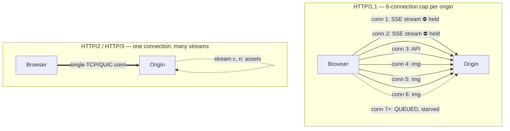
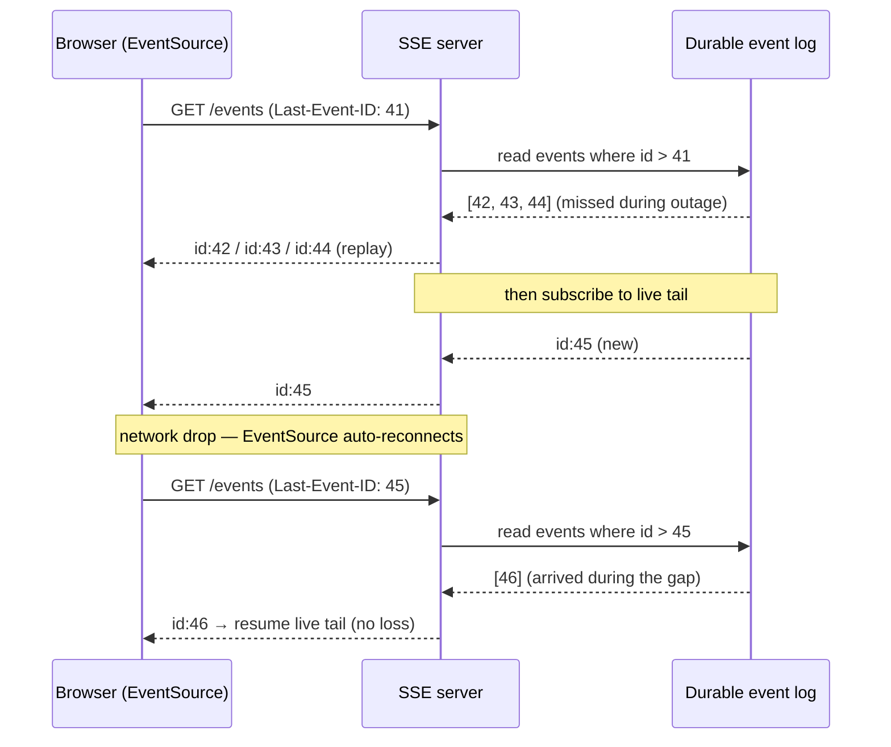
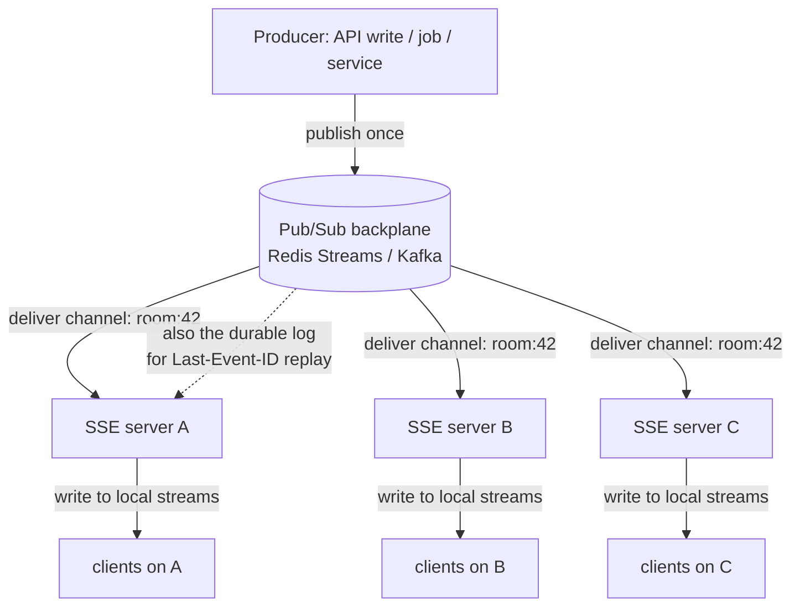

# Server-Sent Events (SSE) — Senior

<!-- level-focus -->
At senior level, focus on this question:

> Which system invariant is affected by **Server-Sent Events (SSE)** under failure, load, and change?

Use the smallest realistic scenario that exposes the decision and its failure behavior.
## 1. The core operational truth: it's a response that never ends

An SSE stream is a single HTTP GET whose response body is `Content-Type: text/event-stream` and simply never closes. The server writes `data:` lines, terminates each event with a blank line, and flushes. The client's `EventSource` parses events incrementally and — critically — reconnects automatically when the socket drops.

Everything painful about SSE follows from that one fact. HTTP intermediaries assume responses are finite: they buffer to compute `Content-Length`, they gzip a whole body before sending, they enforce read/idle timeouts, they cap concurrent connections per origin. A finite response tolerates all of this invisibly. An infinite streaming response gets **held, chunked wrong, timed out, or silently swallowed** by the exact same machinery.

So the senior mental model is: *SSE is not a new protocol; it is a discipline of keeping a plain HTTP response streaming, unbuffered, and alive across every hop between origin and browser.* Own the hops, and SSE is the simplest real-time transport there is. Ignore one hop, and you get the classic bug report — "it works on localhost, it works through curl, but in staging the client receives nothing for two minutes and then a flood."

---

## 2. Proxy and CDN buffering — the number-one SSE outage

The single most common SSE failure in production is an intermediary that **buffers the response body**. The origin is happily flushing events every second; the proxy holds them, waiting to fill a buffer or complete the response before forwarding. From the client's perspective the stream is dead, then bursts.

There are four distinct buffering hazards, and you must neutralize all of them:

**1. Reverse-proxy response buffering.** nginx buffers upstream responses by default via `proxy_buffering on`. For an SSE location you must turn it off, and — because you often can't touch every nginx config in the path — emit the de-facto standard header `X-Accel-Buffering: no` from the origin, which nginx honors per-response.

```nginx
location /events {
    proxy_pass http://app_upstream;
    proxy_buffering off;          # do not accumulate the upstream body
    proxy_cache off;              # never cache a live stream
    proxy_set_header Connection ''; # keep upstream keep-alive clean for HTTP/1.1
    proxy_http_version 1.1;
    proxy_read_timeout 1h;        # don't kill an idle-but-alive stream
    chunked_transfer_encoding on;
}
```

**2. Compression.** gzip/br compressors buffer input to build compression blocks. Applied to a stream, they can hold your events until enough bytes accumulate. Disable compression on the SSE route (`Content-Encoding: identity`, or exclude `text/event-stream` from the compressor). If you *must* compress, use a streaming codec with an explicit flush after every event — most stacks don't do this correctly, so the safe default is off.

**3. CDN caching and buffering.** A CDN in front of your origin is the worst offender: it may cache the response (serving one user's stream to another, or a stale empty body), buffer to compute a length, or terminate the connection at an edge idle timeout. Mark the route no-store, `Cache-Control: no-cache, no-transform` (the `no-transform` blocks edge compression/rewriting), and configure the CDN to pass through / bypass for that path. Many teams simply route SSE around the CDN entirely.

**4. The output stack in your own app.** Framework response buffers, template engines, and even the language runtime can buffer. You must explicitly `flush()` after each event and disable any output buffering (`X-Accel-Buffering: no` also disables PHP-FPM buffering, for example).

The defensive response header set that survives most intermediaries:

| Header | Value | Why |
|---|---|---|
| `Content-Type` | `text/event-stream` | Triggers `EventSource` parsing; signals "stream" to some proxies |
| `Cache-Control` | `no-cache, no-transform` | Prevents caching and edge rewrites/compression |
| `Connection` | `keep-alive` | HTTP/1.1 only; keep socket open |
| `X-Accel-Buffering` | `no` | Disables nginx/FPM response buffering per-response |
| `Content-Encoding` | `identity` | Opts the stream out of gzip/br buffering |

Two operational habits close the loop. First, send a **heartbeat comment** (`: keepalive\n\n`) every 15–30 s: SSE comment lines are ignored by the parser but reset idle timers on proxies, load balancers, and NAT devices that would otherwise reap a "silent" connection. Second, **verify through the real edge, not localhost** — the entire class of bug is invisible until traffic crosses the proxy that buffers. curl with `-N` (no buffering) against the production hostname, watching for events to arrive one-per-second rather than in a burst, is the canonical smoke test.

---

## 3. The HTTP/1.1 six-connection cap and why HTTP/2/3 changes the calculus

Historically the strongest argument *against* SSE was a browser limit, not a protocol flaw. Under **HTTP/1.1, browsers cap concurrent connections to a single origin at roughly six.** An SSE stream permanently consumes one of those six for its entire lifetime. Open two or three streams (say, one per open tab, plus a third feature using SSE) and you have starved the origin: normal fetches for images, API calls, and navigation queue behind the held-open streams. The infamous symptom is "the app hangs in a background tab" because that tab's SSE connection is one of six, and the foreground tab can't get a socket.

**HTTP/2 dissolves this problem.** H2 multiplexes many logical streams over a *single* TCP connection. The six-connection-per-origin limit is replaced by a much larger per-connection concurrent-stream limit (`SETTINGS_MAX_CONCURRENT_STREAMS`, commonly 100+). An SSE stream is now one multiplexed stream sharing the same socket as all your other requests — no head-of-line blocking at the connection level for the browser, no starvation. **HTTP/3** takes it further: streams are independent at the QUIC layer, so a lost packet on one stream no longer stalls the others (H2's transport-level HOL blocking is gone), and connection migration survives network changes — a real win for mobile clients holding a stream across Wi-Fi/cellular handoff.

This is the key senior reason SSE is more attractive *today* than its reputation suggests: the old show-stopper was an artifact of HTTP/1.1, and modern deployments are H2/H3 by default at the edge.



Two caveats keep you honest. First, the cap moves, it doesn't vanish: on the **server** side, each H2 stream still costs memory and counts against `MAX_CONCURRENT_STREAMS`; a client can exhaust a server's per-connection stream budget with many SSE subscriptions, so bound the number of streams you open per client. Second, **you must actually terminate H2/H3 at the tier the client connects to** — if your edge speaks H2 to the browser but your internal proxy downgrades to HTTP/1.1 to the app, the app-side per-connection accounting reverts to 1.1 semantics. Confirm the whole path, or at least that the browser↔edge hop is H2/H3.

---

## 4. Reconnection and resume: Last-Event-ID plus a durable log

`EventSource` reconnects automatically after a drop — that is a feature and a trap. Automatic reconnection means clients recover from transient network blips for free. But a naive server that just resumes streaming *new* events **loses every event that occurred during the disconnect window**. For notifications this may be tolerable; for an activity feed, order status, or financial ticker it is a correctness bug.

SSE provides the resume primitive: the `id:` field. When the server tags each event with a monotonic `id`, the browser remembers the last one it saw. On reconnect, `EventSource` sends the header **`Last-Event-ID: <value>`** automatically. Your server reads it and **replays everything after that id before resuming the live tail.**

For replay to be possible, those events must still exist somewhere — a **durable, ordered event log** keyed by the id: a Redis Stream, a Kafka topic/partition, a Postgres append table, whatever fits your durability and retention needs. The id must be a stable cursor into that log (a stream offset, sequence number, or `partition:offset`), not a random UUID.



Design details that separate a working resume from a broken one:

- **IDs must be monotonic and meaningful.** Use the log's native offset. Then "everything after `Last-Event-ID`" is a single range read, not a scan.
- **Bound the replay window.** If a client was gone for hours and asks for a 6-hour backlog, don't stream 500k events on reconnect. Cap replay to the log's retention; if the cursor is older than retention, send a `reset`/`resync` event telling the client to re-fetch state via a normal REST snapshot, then resume the tail. This is the standard "snapshot + stream" pattern.
- **Tune `retry:`.** The server can send a `retry: <ms>` field to set the client's reconnect delay. Add jitter server-side and consider increasing it under load — a fleet reconnecting in lockstep after a deploy is a self-inflicted thundering herd.
- **Idempotent replay.** Because a client may reconnect and receive an id it already applied (races at the boundary), make client-side application idempotent by id.

The payoff: SSE gives you at-least-once, ordered, resumable delivery over plain HTTP with almost no client code — the browser's built-in reconnection does the hard part, and `Last-Event-ID` + a log does the rest. This is a genuine advantage over raw WebSocket, where you'd hand-roll the entire reconnect-and-resume protocol.

---

## 5. Scaling with a pub/sub backplane

A single SSE server can hold tens of thousands of streams (they're cheap — see §6), but you run many app instances behind a load balancer, and any given client's stream lands on *one* of them. When an event is produced — by a different request, a background job, or another service — it must reach **every server holding a relevant subscriber**, wherever that subscriber's stream happens to be pinned. This is the identical fan-out problem you solve for WebSocket, and the identical solution applies: a **pub/sub backplane**.

The producer publishes an event **once** to a broker (Redis Pub/Sub, Redis Streams, Kafka, NATS). Every SSE server instance subscribes to the relevant channels. When the broker delivers, each instance fans the event out to the local streams whose subscription matches. No instance needs to know where any client lives; the broker is the rendezvous.



Owner-level considerations for the backplane:

- **Merge the backplane and the durable log where you can.** Redis Streams and Kafka are *both* a pub/sub transport and an ordered, offset-addressable log. Using one system for live fan-out *and* `Last-Event-ID` replay (§4) removes a whole class of consistency bugs versus stitching "Redis Pub/Sub for live + Postgres for replay." Redis *Pub/Sub* alone is fire-and-forget with no retention — fine for the live tail, useless for replay, so pair it with Streams if you go Redis.
- **Channel granularity is a real trade-off.** Fan-out per topic/room means each server subscribes only to channels its local clients care about — efficient, but requires dynamic subscribe/unsubscribe as clients come and go. A single firehose channel is simpler but forces every server to receive and filter every event; at high event rates that filtering cost dominates. Choose based on event rate × fan-out.
- **The backplane is now a shared failure domain.** If the broker stalls, all real-time delivery stalls. Size it, monitor consumer lag, and decide the degradation contract: do clients get stale-but-alive streams, or do you close streams so `EventSource` reconnects and re-syncs from a snapshot?
- **Servers are stateless; connections are not.** The client↔server TCP connection is inherently sticky for its lifetime, but no *session state* lives on the server — it's all derived from the subscription and the log. That keeps deploys and autoscaling simple: drain by closing streams, and clients transparently reconnect (with `Last-Event-ID`) to a surviving instance.

---

## 6. Connection and memory cost at fleet scale

SSE's cost profile is the same shape as any long-lived connection: **you pay per concurrent client, not per message.** Each stream is one open socket held for the client's entire session. That cost is real and must be capacity-planned, but it is modest — an idle SSE stream is close to free on a modern event-loop server.

The dominant costs to model:

- **File descriptors / sockets.** One per client. 100k concurrent streams = 100k FDs on the instance holding them. Raise `ulimit -n` and kernel `fs.file-max`; these caps, not CPU, are usually what you hit first.
- **Per-connection memory.** Read/write buffers, TLS session state, and your app's per-subscriber bookkeeping (subscription set, last id). Budget a few KB to low tens of KB per idle connection depending on stack and buffer sizes; multiply by peak concurrency. This — not throughput — sets how many clients an instance holds.
- **Ephemeral ports and NAT/LB conntrack.** Long-lived connections pin entries in load-balancer connection tables and NAT devices. A fleet of SSE clients can exhaust conntrack or LB connection budgets before it exhausts the app. Size the LB for *concurrent held connections*, not requests/sec.
- **The heartbeat has a cost too.** A 20 s keepalive across 100k clients is 5k writes/sec of pure overhead. Cheap, but not zero — pick the longest interval that still beats your shortest intermediary idle timeout.

The correct comparison to WebSocket here is: **nearly identical.** Both are one long-lived connection per client with per-connection memory and FD cost; SSE is if anything marginally *cheaper* because it's unidirectional (no incoming-frame parsing, no ping/pong protocol machinery — just writes and the browser's own reconnect). The connection-cost argument does not favor WebSocket. What favors WebSocket is bidirectionality and binary framing, not resource efficiency.

---

## 7. When SSE beats WebSocket — and when it doesn't

The senior decision is not "SSE vs WebSocket" as a religion; it's a fit test against the traffic shape and the operational surface you're willing to own.

**SSE wins when the data flow is fundamentally one-way: server → client.** Live feeds, notifications, dashboards, progress/status streams, log tailing, LLM token streaming, price tickers, "someone changed X, re-render" nudges. For these, SSE is the *lower-operational-cost* choice because it rides plain HTTP end to end:

- **It's just HTTP.** Your existing auth (cookies, bearer tokens, mTLS), your existing L7 load balancers, WAF, CORS, and observability all apply unchanged. WebSocket's `Upgrade` handshake often needs special LB/proxy/WAF configuration and separate auth plumbing.
- **Reconnection and resume are built in.** `EventSource` auto-reconnects; `Last-Event-ID` gives you resumable delivery for free. With WebSocket you build that yourself.
- **It's simpler to reason about.** Text events, no framing protocol, no half-open-connection ambiguity, trivial to debug with `curl -N`.

**WebSocket wins when you genuinely need low-latency, high-frequency client → server messages** on the same connection: multiplayer games, collaborative editing (cursors/keystrokes), interactive terminals, voice/video signaling, chat where typing indicators and messages flow both ways at speed. SSE is text-only (browser `EventSource` can't send binary or do a bidirectional channel), and pairing SSE-down with POST-up works for occasional client sends but is clumsy for chatty duplex traffic.

| Dimension | SSE | WebSocket |
|---|---|---|
| Direction | Server → client only | Full duplex |
| Client → server sends | Separate HTTP requests | Same connection |
| Protocol | Plain HTTP (`text/event-stream`) | `Upgrade` from HTTP, own framing |
| Payload | UTF-8 text only | Text or binary |
| Auto-reconnect | Built into `EventSource` | Build it yourself |
| Resume after drop | `Last-Event-ID` (built in) | Build it yourself |
| Auth / infra reuse | Uses existing HTTP auth, LB, WAF, CORS | Often needs WS-aware LB/WAF/auth |
| HTTP/1.1 origin cap | 6 conns/origin (mitigated by H2/H3) | 6-conn cap does **not** apply |
| HTTP/2/3 multiplexing | Yes — shares one connection | Not multiplexed over H2 (RFC 8441 rarely deployed) |
| Debuggability | `curl -N`, plain text | Needs WS tooling |
| Per-client cost | One long-lived conn | One long-lived conn (≈ same) |
| Backpressure/binary | Weak (text, no native flow control) | Strong |

**Decision heuristic:**

- One-way, mostly text, want to reuse HTTP infra and get reconnect/resume free → **SSE.**
- Frequent, low-latency, or binary client→server messages → **WebSocket.**
- Mostly one-way with rare client actions → **SSE + regular POSTs** is a perfectly good, boring, robust choice.
- One caveat that can flip the decision: under HTTP/1.1 with no H2 available and clients opening multiple streams, SSE's per-origin connection cap can starve the page — either fix the transport (get H2/H3 to the browser) or reach for WebSocket, which the cap doesn't touch. Note the mirror-image asymmetry: SSE is multiplexed over H2/H3, WebSocket effectively is not (RFC 8441 exists but is barely deployed), so at high H2 adoption SSE's connection story is actually the *better* one.

---

## 8. Ownership checklist

You own an SSE feature end to end when you can answer these without hedging:

- **Buffering:** Is buffering disabled at every hop — app output, reverse proxy (`proxy_buffering off` / `X-Accel-Buffering: no`), compression (`no-transform`, `identity`), and CDN (no-store / bypass)? Have you verified through the *real* edge with `curl -N`, seeing events arrive incrementally rather than in a burst?
- **Keepalive:** Do you send heartbeat comments more often than the shortest idle timeout on any proxy/LB/NAT in the path?
- **Transport:** Is the browser↔edge hop HTTP/2 or HTTP/3, so the 6-connection-per-origin cap can't starve the page? Do you bound streams-per-client so you don't exhaust the server's per-connection stream budget?
- **Resume:** Does every event carry a monotonic `id` that is a real offset into a durable, ordered log? On reconnect, do you read `Last-Event-ID`, replay the gap, cap the replay window, and fall back to a snapshot+resync when the cursor is past retention?
- **Fan-out:** Does a producer publish once to a backplane that every instance subscribes to? Is the backplane also your replay log, or have you consciously accepted two systems? Do you monitor consumer lag and define the degradation contract when it stalls?
- **Capacity:** Have you sized FDs (`ulimit -n`), per-connection memory × peak concurrency, and LB/conntrack for *held connections*, not requests/sec?
- **Fit:** Did you choose SSE because the flow is one-way and you want HTTP-native auth/infra plus free reconnect — and not defaulted to WebSocket out of habit for a one-way feed?

Get these seven right and SSE is the calmest real-time transport you can run: a plain HTTP response, kept flowing, fanned out, and resumable — with the browser doing the reconnect work for you.

---

*Next step:* [Professional level](professional.md)

---

## Apply it

1. State the system invariant that **Server-Sent Events (SSE)** must protect.
2. Mark ownership, state, and failure propagation at each boundary.
3. Compare two designs under load, dependency failure, and future change.
4. Define recovery and compatibility behavior before implementation.
5. Test the riskiest assumption with a focused experiment.

## Verify your work

- The experiment supports the design with evidence, not preference.
- Failure injection shows the blast radius and recovery path.
- Compatibility checks cover old and new callers or data.
- Operational signals reveal invariant violations and recovery progress.

## Review questions

- Which invariant must remain true when Server-Sent Events (SSE) fails?
- Where should recovery responsibility live, and why?
- Which assumption deserves an experiment before implementation?
- How can the design evolve without changing every consumer at once?
