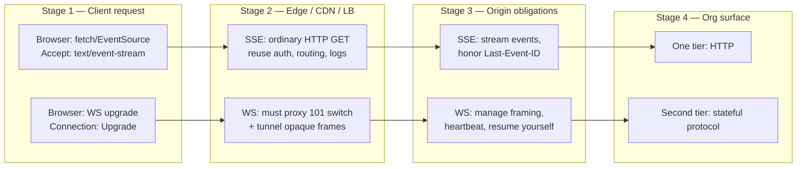
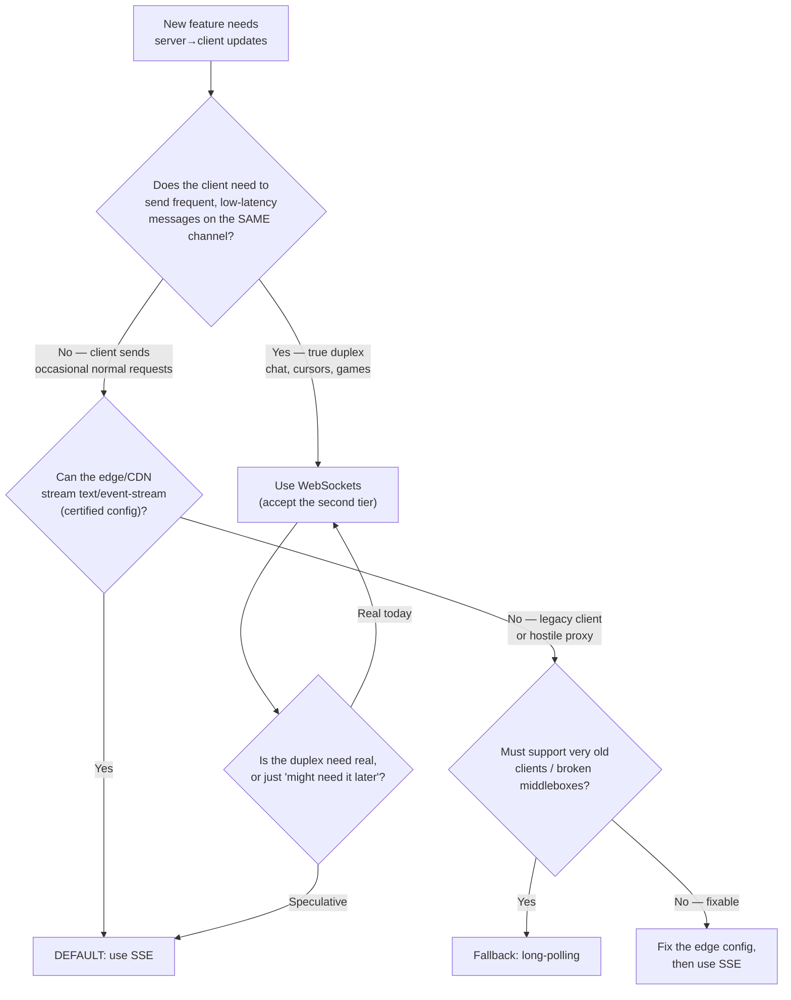

# Server-Sent Events (SSE) — Staff / Principal Level

At staff scope the question is never "how does an `EventSource` work." It is: *should SSE be the organization's default transport for server→client push, and what does defaulting to it buy or cost the fleet?* This is a platform decision — it shapes how many transport tiers your infrastructure, on-call, and product teams must reason about. The engineering merits of SSE are settled elsewhere; here we argue the **operational-simplicity case at org scale**, the **proxy/CDN fleet concern**, the **cost profile**, and a **decision framework** teams can apply without escalating to you every time.

## Table of contents

1. [The staff framing: transport tiers are an org liability](#1-the-staff-framing-transport-tiers-are-an-org-liability)
2. [The operational-simplicity argument](#2-the-operational-simplicity-argument)
3. [Proxy and CDN compatibility as a fleet concern](#3-proxy-and-cdn-compatibility-as-a-fleet-concern)
4. [Cost profile: one long-lived connection, simpler tier](#4-cost-profile-one-long-lived-connection-simpler-tier)
5. [SSE vs WebSockets: the org-default tradeoff table](#5-sse-vs-websockets-the-org-default-tradeoff-table)
6. [The decision framework: which transport for which product](#6-the-decision-framework-which-transport-for-which-product)
7. [The LLM-streaming era: how token streaming made SSE mainstream again](#7-the-llm-streaming-era-how-token-streaming-made-sse-mainstream-again)
8. [Rollout: standardizing SSE as a paved road](#8-rollout-standardizing-sse-as-a-paved-road)
9. [Failure modes and the anti-patterns to govern against](#9-failure-modes-and-the-anti-patterns-to-govern-against)
10. [Staff takeaways](#10-staff-takeaways)

---

## 1. The staff framing: transport tiers are an org liability

Every distinct transport your organization runs is a standing tax. It is a protocol your load balancers must be configured for, a set of edge cases your on-call must recognize at 3 a.m., a code path in your observability pipeline, a section in your security review, and a mental model every new engineer must acquire before they can debug a production incident. Transports do not amortize cleanly the way a shared library does — each one drags its own health-check semantics, its own timeout matrix, its own reconnection story, and its own failure signatures.

The default posture of many teams is to reach for WebSockets the moment "real-time" appears in a spec. That instinct quietly commits the org to a second transport tier alongside plain HTTP request/response: a tier with an upgrade handshake, a separate framing protocol, sticky-session requirements, and a client/server library surface that most of your fleet does not otherwise touch. If 90% of your "real-time" needs are actually **one-way server→client push** — notifications, live dashboards, progress bars, feeds, LLM token streams — then you have paid for a bidirectional, stateful protocol to solve a unidirectional problem.

SSE's staff-level pitch is that it is **not a new tier**. It is an HTTP response with `Content-Type: text/event-stream` that never finishes. It rides everything you already operate. The strategic value is not that any single SSE endpoint is better than the equivalent WebSocket — for a given feature they are close — but that adopting SSE as the *default* keeps your transport surface at "HTTP, plus WebSockets where genuinely required" instead of "HTTP, plus WebSockets everywhere, plus the operational debt that follows."

---

## 2. The operational-simplicity argument

The core claim: **for one-way push, SSE has a smaller cognitive and operational surface than WebSockets because it reuses infrastructure you have already hardened.** Concretely:

- **Same auth.** An SSE stream is a GET request. Your existing cookie/session auth, bearer-token middleware, and API gateway authorization apply unchanged. WebSockets carry auth in the upgrade request but then leave the HTTP request/response model — many gateways can authenticate the handshake but cannot enforce per-message policy, so teams bolt on a parallel auth path. With SSE there is no parallel path.
- **Same load balancers.** L7 load balancers route `text/event-stream` as ordinary HTTP. No `Upgrade`/`Connection` header handling, no protocol-switch config, no separate listener. WebSockets require the LB to proxy the 101 Switching Protocols handshake and then tunnel opaque bytes, which some managed LBs support only with specific settings or tiers.
- **Same observability.** Your access logs already record the request. Status codes, latency-to-first-byte, request IDs, and trace propagation all work because it is HTTP. A WebSocket connection appears in logs as a single long-lived 101 with no per-message visibility unless you build it.
- **No upgrade-handshake edge cases.** There is no 101 that a middlebox might reject, no `Sec-WebSocket-*` negotiation, no protocol-downgrade-under-proxy surprise. SSE either streams or returns a normal HTTP error your clients already handle.
- **Built-in reconnection.** The browser `EventSource` reconnects automatically and replays `Last-Event-ID` so the server can resume. With raw WebSockets, reconnection, backoff, and resume are yours to build correctly — and they are a common source of thundering-herd incidents.

The following staged diagram contrasts what each transport asks of your infrastructure as a request flows edge-to-origin.

The asymmetry is the whole argument. SSE's column collapses into "HTTP you already run." WebSockets' column adds obligations at every stage — each of which is fine in isolation and expensive as a fleet-wide default.

---

## 3. Proxy and CDN compatibility as a fleet concern

The single most common way SSE fails in production is not in your code — it is a proxy or CDN that **buffers** the response instead of **streaming** it. A buffering intermediary holds bytes until it thinks the response is "complete," which for a never-ending stream means the client sees nothing, then a timeout. At org scale this is not a one-off bug; it is a *fleet configuration standard* you must own and publish, because every team that ships an SSE endpoint will hit it otherwise.

The buffering hazards to standardize against:

- **Response buffering / proxy buffering.** Reverse proxies (nginx `proxy_buffering on` is the classic) and some CDNs accumulate the body. The fix is a known set of directives — `X-Accel-Buffering: no` for nginx, disabling compression buffering, and choosing CDN behaviors that pass through streamed responses. This must live in a shared config module, not in each team's tribal memory.
- **Compression.** Gzip/brotli at the edge can buffer to build a compression window. Either disable compression for `text/event-stream` or use streaming-friendly settings. SSE payloads are text and compress well, so teams *want* it on — governance is deciding this once.
- **Idle/read timeouts.** Every hop (LB, CDN, proxy) has an idle-connection timeout. A silent SSE stream that sends nothing for longer than the smallest timeout in the path gets killed. The org standard is a **heartbeat comment** (`: keep-alive\n\n`) at an interval below the tightest timeout, plus a documented, aligned timeout matrix across tiers.
- **HTTP/2 concurrency limits.** Over HTTP/1.1 the browser's ~6-connections-per-host cap means a handful of open SSE streams can starve the rest of the page. Over HTTP/2 (and HTTP/3) many streams multiplex on one connection, which is why the org default should pair SSE with HTTP/2 at the edge. This is a real, historically painful constraint that HTTP/2 largely retires — but only if your edge terminates HTTP/2 to the client.

Because CDN behavior varies by provider and by product tier, the fleet concern is to **certify** which of your CDN configurations stream `text/event-stream` end-to-end and publish that as the supported path. The table below captures the shape of what that certification records (verify each against your own provider's current docs and your own config — vendor defaults change).

| Intermediary class | Default behavior for a never-ending body | What the org must standardize |
|---|---|---|
| Reverse proxy (nginx/Envoy) | Often buffers unless told otherwise | Disable response buffering for the stream; `X-Accel-Buffering: no`; align read timeouts |
| Cloud L7 load balancer | Streams, but has an idle timeout | Raise/align idle timeout above heartbeat interval; confirm no response buffering tier |
| CDN (pull/proxy) | Varies — some stream, some buffer dynamic responses | Certify per provider; mark streamed-through path as the only supported one; bypass caching for the stream |
| Compression layer | May buffer to fill a window | Decide once: disable for `event-stream`, or use streaming-safe compression |

The point for a staff engineer: treat "does our edge stream SSE" as a **platform capability with a known-good configuration**, not a per-service investigation. One certified config, one shared module, one documented timeout matrix — that is the entire cost of making SSE safe fleet-wide, and it is far smaller than the recurring cost of teams rediscovering buffering the hard way.

---

## 4. Cost profile: one long-lived connection, simpler tier

SSE does **not** escape the fundamental cost of push: **one long-lived TCP connection per connected client.** A dashboard with 100k concurrent viewers holds 100k open connections whether you use SSE or WebSockets. Anyone who sells SSE as "cheaper connections" is confusing it with something else. The connection-count arithmetic — file descriptors, memory per connection, kernel socket state, the need for connection-oriented autoscaling and graceful-drain on deploy — is essentially identical to WebSockets.

Where SSE is genuinely cheaper is the **tier**, not the connection:

- **No second stateful fleet.** You are not standing up, sizing, and on-calling a separate WebSocket gateway layer with its own scaling characteristics. SSE connections terminate on your normal HTTP servers (tuned for many idle connections), sharing capacity planning, deploy tooling, and runbooks with the rest of your HTTP fleet.
- **Simpler horizontal scaling.** Because it is HTTP, SSE inherits your existing L7 autoscaling and routing. The hard part — fanning out a message to N connected clients across M servers — is the *same* backplane problem for both transports (a pub/sub layer like Redis, NATS, or Kafka distributes events to whichever server holds each client). SSE does not make fan-out cheaper; it makes the *edge* cheaper by not adding a tier.
- **Head-of-line and multiplexing.** Under HTTP/2 many SSE streams share one connection, reducing per-client socket overhead versus HTTP/1.1. Be aware of HTTP/2 head-of-line blocking under packet loss for a single connection carrying many streams; HTTP/3/QUIC addresses this at the transport layer. This is a real tradeoff to weigh, but it is an edge-tuning decision, not a reason to change transports.

The cost-honest summary: **SSE and WebSockets cost the same in connections and in fan-out infrastructure; SSE costs less in operational tiers.** Your savings are in headcount attention and cognitive load, which at org scale are the expensive resources — not in the raw connection accounting.

---

## 5. SSE vs WebSockets: the org-default tradeoff table

This is the table to bring to an architecture review when someone proposes "let's just use WebSockets for everything." It compares the two as *organizational defaults*, not as isolated features.

| Dimension | SSE as default | WebSockets as default |
|---|---|---|
| Directionality | Server→client only (client speaks via normal HTTP requests) | Full duplex |
| Transport tiers added to org | Zero — it is HTTP | One stateful tier with its own ops |
| Auth model | Reuses HTTP auth end-to-end | Handshake auth; per-message policy is DIY |
| Load balancer support | Any L7 LB, no special config | Needs upgrade proxying; sometimes a paid tier |
| CDN/proxy compatibility | Works if buffering disabled (certifiable) | Often bypasses CDN entirely; separate path |
| Observability | Native HTTP logs/traces/metrics | Opaque 101; per-message visibility is DIY |
| Reconnection | Built into `EventSource` + `Last-Event-ID` | You build backoff, resume, dedup |
| Message framing | Text `event-stream`, UTF-8, line-based | Binary or text frames, you define schema |
| Client complexity | Native `EventSource`; near-zero | Library + connection lifecycle management |
| Fan-out backplane | Same pub/sub problem | Same pub/sub problem |
| Connection cost | 1 long-lived conn/client | 1 long-lived conn/client (same) |
| Best fit | Notifications, feeds, dashboards, progress, LLM tokens | Chat, collaborative editing, games, live cursors, RPC-over-socket |
| HTTP/2 behavior | Multiplexes many streams on one conn | N/A (its own protocol) |
| Failure signature | Ordinary HTTP error the client handles | Silent drop / handshake reject; needs custom handling |

The pattern the table exposes: WebSockets win exactly one row that matters structurally — **directionality** — and lose or tie almost everywhere else on operational grounds. So the org default should follow directionality: use the bidirectional tool only when you actually need bidirectionality.

---

## 6. The decision framework: which transport for which product

Give teams a rule they can apply without asking you. The default is **SSE for one-way push, WebSockets reserved for true bidirectional/low-latency, long-poll as the legacy fallback.** Encode it as a short decision path, not prose, so it survives contact with a product deadline.

The framework's teeth are in two guard questions:

1. **"Same channel, frequent, low-latency client→server?"** This is the only thing that should pull a team to WebSockets. A chat app, a collaborative document, a multiplayer cursor, a trading terminal placing orders — these genuinely need the client to push on the persistent connection. A notification feed, a build-log tailer, a progress bar, an LLM response — these do not; the client made one request and now only receives.
2. **"Real duplex or speculative?"** The most common bad WebSocket adoption is "we *might* need bidirectional later." Staff engineers should push back: you can always add a WebSocket endpoint for the one feature that needs it, later, without having paid the tier tax for every feature in between. Do not buy the expensive default on speculation.

Long-poll's role is deliberately narrow: it is the **legacy fallback** for environments where streaming is impossible — ancient clients, corporate proxies that buffer everything, or a network you do not control. It is strictly worse (a request per message, latency, connection churn) and should never be a *default*, only a graceful degradation path.

---

## 7. The LLM-streaming era: how token streaming made SSE mainstream again

For years SSE was the "forgotten" web standard — shipped in browsers, rarely reached for, overshadowed by WebSockets in every real-time discussion. The generative-AI wave reversed that almost overnight, and understanding why is useful for staff-level pattern recognition.

Token streaming is a **textbook one-way push**: the client sends one request (the prompt), and the server streams back a long sequence of tokens as they are generated. There is no client→server traffic on that channel after the initial request — the interaction is exactly the shape SSE was designed for. So the dominant LLM APIs adopted SSE as their streaming wire format: a `text/event-stream` response where each chunk is an event, terminated by a sentinel. This made SSE the de facto standard for a workload that suddenly every product wanted to ship.

The strategic lessons for an org default:

- **The mainstream use case validated the default.** The highest-visibility real-time feature of the era — streaming AI responses — is unidirectional, and the industry converged on SSE for it rather than WebSockets. That is strong external evidence for the "default to SSE for one-way" posture.
- **Tooling caught up.** Because major LLM providers stream over SSE, HTTP clients, proxies, gateways, and observability tools across the ecosystem improved their streaming support. The certified-CDN concern from §3 got easier precisely because everyone now needs to stream `event-stream` bodies. The paved road you build benefits from industry momentum.
- **It generalizes.** Any "generate progressively and show it live" feature — long report generation, incremental search results, agent step-by-step traces, live transcription — inherits the same shape and the same transport choice. Teach teams to recognize the pattern: *if the client asks once and then only receives, it is SSE-shaped.*
- **The caveat.** LLM streaming often layers structured protocol semantics (partial JSON, tool-call deltas, done markers) on top of SSE frames. That framing is application-level and is your schema to define and version — SSE gives you the transport, not the message contract. Govern that contract like any API.

---

## 8. Rollout: standardizing SSE as a paved road

Making SSE an org default is a platform-engineering exercise, not a memo. The deliverables:

- **A certified edge configuration.** One shared, versioned config (or IaC module) that disables response buffering, sets `X-Accel-Buffering: no` where relevant, aligns idle timeouts above the heartbeat interval, terminates HTTP/2 to the client, and documents the compression decision. Teams consume it; they do not re-derive it.
- **A shared server helper.** A small library or middleware that sets the correct headers (`Content-Type: text/event-stream`, `Cache-Control: no-cache`, `Connection: keep-alive`), emits heartbeats on a timer, formats events (`id:`, `event:`, `data:`), and honors `Last-Event-ID` for resume. Consistency here is what makes the fleet's SSE endpoints debuggable.
- **A fan-out reference.** Document the standard backplane (Redis/NATS/Kafka pub-sub → per-server delivery to held connections) so teams do not each invent it. This is the genuinely hard part and the place to invest a reusable component.
- **A resume/idempotency contract.** Event IDs and `Last-Event-ID` replay must be part of the standard so reconnection is correct across the fleet, not per-team.
- **A deploy/drain runbook.** Long-lived connections mean deploys drop clients. Standardize graceful drain (stop accepting new streams, let clients reconnect elsewhere, bounded shutdown window) and connection-aware autoscaling so a routine deploy is not a reconnection storm.
- **An observability standard.** Metrics for concurrent streams, connection age, reconnection rate, and time-to-first-event; alerts on reconnection spikes (the leading indicator of an edge-buffering or timeout regression).

The test of success is that a product team can ship a compliant SSE endpoint by consuming the paved road, with no bespoke infra work and no architecture review — and that when it breaks, the failure signature and the runbook are the same as everyone else's.

---

## 9. Failure modes and the anti-patterns to govern against

The recurring SSE failures at org scale, and the governance response to each:

- **The buffering intermediary.** Symptom: client connects, receives nothing, times out. Cause: a proxy/CDN/compression layer buffering the stream. Governance: the certified edge config (§3) and an alert on abnormally high time-to-first-event.
- **The mismatched timeout matrix.** Symptom: streams die at a suspiciously round interval (30s, 60s). Cause: an idle timeout somewhere in the path shorter than the heartbeat. Governance: publish and enforce the aligned timeout matrix; heartbeat below the tightest hop.
- **HTTP/1.1 connection starvation.** Symptom: opening a few streams freezes the rest of a page. Cause: the ~6-per-host connection cap. Governance: mandate HTTP/2 termination at the edge for SSE.
- **The reconnection storm.** Symptom: a deploy or origin blip produces a synchronized reconnect spike that overwhelms the origin. Cause: no jittered backoff, no `Last-Event-ID` resume, all clients reconnecting at once. Governance: standard client backoff-with-jitter and server-side resume; connection-aware capacity headroom.
- **WebSockets-by-reflex.** Symptom: a bidirectional tier stood up for a one-way feature. Cause: "real-time" triggered a WebSocket reach. Governance: the decision framework (§6) as the required first artifact in any real-time design.
- **SSE for genuine duplex.** The inverse anti-pattern: forcing a chat or collaborative-editing feature onto SSE plus a side-channel of POSTs, reinventing a worse WebSocket. Governance: honor the framework's first guard question — real duplex is exactly what WebSockets are *for*.

The staff instinct is symmetry: default to SSE, but do not let "default" become dogma. The framework exists precisely so teams pick the *bidirectional* tool when the problem is genuinely bidirectional — the goal is fewer transport tiers, not zero WebSockets.

---

## 10. Staff takeaways

- **Transport tiers are an org-wide liability**, not a per-feature choice. Every tier taxes infra, on-call, security, and onboarding. Minimize tiers deliberately.
- **SSE's value is that it is not a new tier.** It rides existing HTTP auth, load balancers, and observability, with no upgrade-handshake edge cases — a smaller cognitive and operational surface than WebSockets for the common one-way case.
- **Proxy/CDN buffering is the fleet concern.** Own a certified, streamed-through edge configuration and an aligned timeout matrix as a platform capability, so teams never rediscover buffering the hard way.
- **Be cost-honest.** SSE holds one long-lived connection per client, same as WebSockets, and does not make fan-out cheaper. The savings are in operational tiers and attention, which at scale are the expensive resources.
- **Default to SSE for one-way push, reserve WebSockets for true bidirectional/low-latency, keep long-poll as a narrow legacy fallback.** Encode this as a decision path teams apply without escalation.
- **The LLM-streaming era validated the default.** Token streaming is one-way push, the industry standardized on SSE for it, and the surrounding tooling improved — momentum you can build the paved road on.
- **Ship it as a paved road:** certified edge config, shared server helper, fan-out reference, resume contract, drain runbook, and an observability standard. Success is teams shipping compliant endpoints with no bespoke infra and a shared failure signature.

*Next step:* [Interview questions](interview.md)
