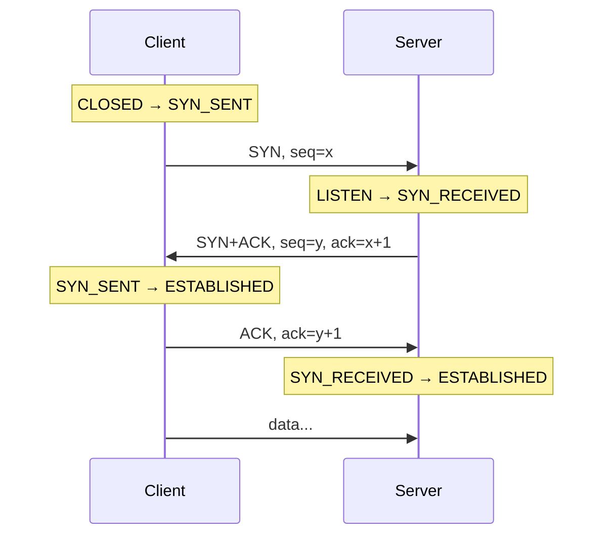

# TCP vs UDP — Interview Questions

A staged bank of interview questions on the two dominant transport protocols. Answers favor specific mechanics and arithmetic over hand-waving. Work top to bottom; each tier assumes the one before it.

## Table of Contents

1. [Junior Questions](#junior-questions)
2. [Middle Questions](#middle-questions)
3. [Senior Questions](#senior-questions)
4. [Professional / Deep-Dive Questions](#professional--deep-dive-questions)
5. [Staff / Judgment Questions](#staff--judgment-questions)

---

## Junior Questions

**Q1: In one paragraph, what is the core difference between TCP and UDP?**

> TCP is a *connection-oriented, reliable, byte-stream* protocol: it establishes a session with a handshake, numbers every byte, retransmits what is lost, delivers data in order, and slows down when the network is congested. UDP is a *connectionless, unreliable, message (datagram)* protocol: it fires individual packets with no handshake, no acknowledgements, no ordering, and no congestion control. TCP gives you a clean stream at the cost of latency and state; UDP gives you a thin, near-zero-overhead pipe and hands every reliability decision back to you. Neither is "better" — they trade the same coins in opposite directions.

**Q2: Which protocol has more header overhead, and by how much?**

> UDP has a fixed **8-byte** header (source port, destination port, length, checksum). TCP has a **minimum 20-byte** header and commonly 32–40 bytes once options like timestamps, SACK-permitted, and window scale are present. So per packet, TCP costs 12–32 more header bytes. On a 1500-byte Ethernet frame that is noise (~2%), but for tiny, high-frequency messages — a game position update, a DNS query — the ratio matters, and it is one reason those workloads lean UDP.

**Q3: Name three protocols built on TCP and three built on UDP.**

> TCP: HTTP/1.1 and HTTP/2, TLS (and thus HTTPS), SMTP, SSH, classic FTP — anything where losing bytes silently would corrupt meaning. UDP: DNS (small request/response, cheap to retry), DHCP, NTP, most real-time media (VoIP/RTP, video conferencing), and QUIC/HTTP-3. The pattern: TCP for correctness-critical bulk or long-lived sessions, UDP for small, latency-sensitive, or loss-tolerant traffic.

**Q4: What does "reliable delivery" actually mean in TCP, and how is it achieved?**

> Reliable means every byte the sender submits either arrives at the receiver exactly once, in order, or the connection is torn down with an error — the application never silently loses data. Mechanically: each byte has a sequence number, the receiver returns cumulative ACKs for the highest contiguous byte received, and the sender keeps unacknowledged data in a retransmission buffer with a timer. If an ACK does not arrive before the retransmission timeout (RTO) — or duplicate ACKs signal a gap — the sender resends. A checksum on every segment catches corruption. UDP does none of this; a lost datagram is simply gone.

**Q5: Does UDP guarantee that packets arrive in the order they were sent?**

> No. UDP has no sequence numbers and no reordering buffer, so datagrams can arrive out of order, duplicated, or not at all, and the receiver sees them in whatever order the network delivers them. If your application needs order over UDP — as media and QUIC do — you add your own sequence numbers and a reassembly buffer. That is precisely the "you build it yourself" cost of choosing UDP.

---

## Middle Questions

**Q6: Walk through the TCP three-way handshake and explain why it is three messages, not two.**

> The handshake synchronizes initial sequence numbers (ISNs) in both directions before any data flows:

> Two messages (SYN, SYN+ACK) would prove the client can reach the server and the server can reach the client, but the *server would never learn that its own ISN `y` was received*. The third message — the client's ACK of `y+1` — closes that loop. Both endpoints now agree on both starting sequence numbers, so retransmission and ordering work from the first data byte. Three is the minimum number of one-way messages that lets each side confirm the other received its sequence number.

**Q7: Why are TCP initial sequence numbers randomized instead of starting at 0?**

> Two reasons. First, *security*: a predictable ISN lets an off-path attacker guess valid sequence numbers and inject or reset a connection (the classic Mitnick-style spoofing / RST attack). RFC 6528 mandates ISNs derived from a per-connection hash plus a clock, so they are unpredictable. Second, *correctness across connection reincarnation*: if the same four-tuple (src IP, src port, dst IP, dst port) is reused shortly after a prior connection, randomized ISNs plus TIME_WAIT reduce the chance that a straggling old segment is accepted as valid data in the new connection.

**Q8: What is TCP flow control and how does it differ from congestion control?**

> Flow control protects the *receiver* from being overrun; congestion control protects the *network*. Flow control is the receive window (`rwnd`): the receiver advertises, in every ACK, how much buffer space it has left, and the sender must not have more than `rwnd` unacknowledged bytes in flight. If the receiver is slow to read, `rwnd` shrinks toward zero and the sender stalls (the "zero window" state), later probed back open. Congestion control is a separate, sender-side estimate (`cwnd`) of how much the *path* can absorb. The sender is limited by `min(rwnd, cwnd)` — whichever bottleneck is tighter wins.

**Q9: What is TIME_WAIT, and why does it last 2·MSL?**

> When the side that sends the final ACK closes (the *active closer*), it enters TIME_WAIT and lingers there for **2·MSL** (Maximum Segment Lifetime; MSL is conventionally 2 minutes on paper, often 30–60s in practice, so TIME_WAIT is ~1–4 minutes). Two jobs: (1) if that final ACK is lost, the peer will retransmit its FIN, and we must still be around to re-ACK it — otherwise the peer hangs. (2) It lets any old, delayed segments from *this* connection drain out of the network so they cannot be mistaken for data in a new connection reusing the same four-tuple. The 2·MSL bound = one MSL for a stray segment to reach the peer + one MSL for the peer's retransmitted FIN to come back.

**Q10: Compare TCP and UDP across the dimensions that matter for choosing one.**

> | Dimension | TCP | UDP |
> |---|---|---|
> | Connection | Handshake (1 RTT before data) | None (0 RTT) |
> | Delivery | Reliable, retransmitted | Best-effort, may drop |
> | Ordering | Guaranteed, in-order stream | None |
> | Data model | Byte stream (no message boundaries) | Datagrams (preserve boundaries) |
> | Flow control | Yes (rwnd) | No |
> | Congestion control | Yes (cwnd, AIMD) | No (you build it) |
> | Header | 20–40 bytes | 8 bytes |
> | Head-of-line blocking | Yes, within the stream | No (each datagram independent) |
> | Multicast/broadcast | No | Yes |
> | Typical use | Bulk transfer, RPC, web, DB | Media, DNS, gaming, telemetry, QUIC |

**Q11: You send two 600-byte `write()` calls over one TCP connection. How many "messages" does the receiver see, and what does that tell you?**

> Undefined — the receiver might read 1200 bytes in one `recv()`, or 600 + 600, or 900 + 300. TCP is a *byte stream with no message framing*; `write()` boundaries are not preserved. This is the classic bug where developers assume one send equals one receive. If you need message boundaries over TCP you must impose your own framing — length prefixes, delimiters, or a framed protocol like HTTP/2. UDP, by contrast, preserves boundaries: one `sendto()` of 600 bytes arrives as exactly one 600-byte datagram (or not at all).

---

## Senior Questions

**Q12: Explain TCP slow start and AIMD. Why "additive increase, multiplicative decrease"?**

> A connection cannot know the path capacity up front, so it probes. **Slow start**: begin with a small congestion window (`cwnd` ≈ 10 MSS today) and roughly double it every RTT (exponential) until either loss occurs or `cwnd` reaches the slow-start threshold `ssthresh`. After that, **congestion avoidance** takes over with **AIMD**: on each RTT without loss, add ~1 MSS (additive increase — cautious probing); on loss, cut `cwnd` roughly in half (multiplicative decrease — retreat fast). The asymmetry is deliberate: it is provably fair and stable. If every flow increases additively and backs off multiplicatively, competing flows converge toward an equal share of the bottleneck. Multiplicative increase would oscillate wildly; additive decrease would react to congestion far too slowly.

**Q13: Contrast CUBIC and BBR as congestion-control algorithms.**

> CUBIC (Linux default since 2.6.19) is **loss-based**: it treats packet loss as the congestion signal and grows `cwnd` along a cubic curve that plateaus near the last loss point, then probes past it. It fills buffers until they overflow, so on deep buffers it induces *bufferbloat* — high latency even when throughput is fine. BBR (Google) is **model-based**: it continuously estimates the path's bottleneck bandwidth and minimum RTT and paces sending to `bandwidth × min-RTT`, aiming to sit at the "knee" of full throughput with minimal queueing. BBR keeps latency low and shrugs off random (non-congestion) loss, which is why Google deploys it for YouTube and QUIC. The tension: BBR can be aggressive toward CUBIC flows sharing a link, and early versions had fairness issues that BBRv2/v3 work to correct.

**Q14: State the Mathis throughput bound and use it with numbers.**

> For a loss-based TCP flow, the classic Mathis approximation is:
>
> `throughput ≈ MSS / (RTT × √p)`
>
> where `p` is the packet-loss probability. It captures a brutal fact: throughput scales with `1/RTT` and `1/√p`. Plug in MSS = 1460 B, RTT = 100 ms, p = 0.01 (1% loss):
>
> `throughput ≈ 1460 × 8 / (0.1 × √0.01) = 11680 / (0.1 × 0.1) = 11680 / 0.01 ≈ 1.17 Mbps`
>
> A single classic TCP flow across a 100 ms path at 1% loss caps around ~1 Mbps *regardless of link capacity*. Drop loss to 0.01% (p = 0.0001) and √p falls 10×, so throughput rises 10× to ~11.7 Mbps. This is why long-fat networks need either many parallel flows, larger MSS, or loss-tolerant algorithms like BBR, and why a "fast" link with a little loss underperforms so badly.

**Q15: What is head-of-line (HOL) blocking in TCP, and how does QUIC eliminate it?**

> TCP delivers a single in-order byte stream. If one segment is lost, every byte *behind* it is held in the receiver's buffer — even if those later bytes already arrived intact — until the gap is retransmitted and filled. When you multiplex many logical streams over one TCP connection (HTTP/2), a single lost packet on one stream stalls *all* streams: that is transport-level HOL blocking. QUIC runs over UDP and implements **independent streams with per-stream flow control and ordering**. A lost packet only blocks the specific stream(s) whose bytes it carried; other streams keep being delivered. QUIC also folds the TLS and transport handshakes together (1-RTT, or 0-RTT on resumption) and migrates connections across IP changes via a connection ID rather than the four-tuple.

**Q16: What is Nagle's algorithm, what is TCP_NODELAY, and when do they fight?**

> Nagle's algorithm batches small writes: if there is already unacknowledged data in flight, it holds the next small chunk until the outstanding data is ACKed or a full MSS accumulates. It exists to stop a flood of tiny "tinygram" packets (think one keystroke per packet in telnet). `TCP_NODELAY` disables it — send immediately. The infamous interaction is **Nagle + delayed ACKs**: the receiver's delayed-ACK timer (up to ~40–200 ms) waits to piggyback the ACK, while Nagle waits for that very ACK before sending the next small write. The result is a periodic ~40 ms stall on request/response protocols. For latency-sensitive RPC and interactive traffic, set `TCP_NODELAY`; for bulk transfer where you already send full segments, leave Nagle on.

---

## Professional / Deep-Dive Questions

**Q17: A service opens millions of short-lived outbound connections and starts failing with "cannot assign requested address." Diagnose it.**

> This is **ephemeral port exhaustion** compounded by TIME_WAIT. A connection is identified by the four-tuple (src IP, src port, dst IP, dst port). For outbound connections to a *fixed* destination (one IP, one port), only the source port varies, and it is drawn from the ephemeral range — on Linux `net.ipv4.ip_local_port_range`, default ~28,000 ports (32768–60999). Each closed connection where *you* were the active closer sits in TIME_WAIT for up to 2·MSL. If you close 28k connections faster than TIME_WAIT drains, you run out of source ports and new connects fail with EADDRNOTAVAIL.
>
> Arithmetic: 28,000 ports ÷ 60 s TIME_WAIT ≈ **~470 new connections/sec** sustainable *per destination* before exhaustion. Fixes, in order of preference: (1) **connection pooling / keep-alive** so you reuse connections instead of churning them — this is the real fix; (2) widen `ip_local_port_range`; (3) add more source IPs or destination endpoints to multiply the tuple space; (4) enable `tcp_tw_reuse` (safe for outbound with timestamps) — but *not* the deprecated `tcp_tw_recycle`, which breaks behind NAT. Shrinking MSL is a last resort that weakens TIME_WAIT's correctness guarantees.

**Q18: How does SACK improve on cumulative ACKs, and why does it matter on lossy paths?**

> Plain cumulative ACKs report only the highest *contiguous* byte received. If bytes 1–1000 arrive, then 2001–3000 arrive but 1001–2000 is lost, the receiver keeps ACKing 1000 — the sender learns a gap exists (via duplicate ACKs) but not the *shape* of it, so with a single cumulative ACK it may retransmit everything after the gap. **Selective ACK (SACK)** adds a TCP option listing the non-contiguous blocks actually received ("I have 1–1000 and 2001–3000"). Now the sender retransmits *only* the missing 1001–2000. On paths with multiple losses per window this dramatically cuts wasteful retransmission and speeds recovery. It is a negotiated option (SACK-permitted in the SYN) and, combined with fast retransmit / fast recovery, is why modern TCP tolerates moderate loss far better than the textbook Reno.

**Q19: What breaks when you put TCP behind a stateless L4 load balancer, and how do L4 vs L7 LBs differ here?**

> An **L4 load balancer** routes by four-tuple without understanding the payload; a TCP connection is a long-lived, stateful thing, so the LB must consistently send every packet of a given connection to the *same* backend for its entire life — otherwise the backend sees mid-stream segments for a connection it never handshook and sends a RST. This demands per-connection flow state (or consistent hashing on the tuple) in the LB, and it constrains rebalancing: you cannot move an in-flight TCP connection to a new backend without breaking it, so scaling in/out drains rather than reshuffles. Direct Server Return (DSR) and Maglev-style consistent hashing exist precisely to keep this state cheap and stable. An **L7 (HTTP) LB** terminates TCP itself, so it can pool backend connections, retry idempotent requests on a *different* backend, and load-balance per-*request* rather than per-connection — at the cost of terminating TLS and doing more work per byte. UDP complicates L4 further: there is no connection, so "stickiness" for a logical session (e.g., a QUIC flow) must hash on something stable like the QUIC connection ID, not the four-tuple, since QUIC deliberately survives IP/port changes.

**Q20: Reason about the latency cost of TCP+TLS versus QUIC for a fresh connection on a 50 ms-RTT path.**

> Count round trips before the first application byte flows.
>
> - **TCP + TLS 1.3**: 1 RTT for the TCP handshake, then 1 RTT for the TLS 1.3 handshake = **2 RTT = 100 ms** before the first request. (TLS 1.2 was 2 RTT for TLS alone → 3 RTT total.)
> - **QUIC (HTTP/3), fresh**: transport + crypto handshake fused = **1 RTT = 50 ms**.
> - **QUIC, resumed (0-RTT)**: application data rides *with* the first packet = **0 RTT** for the request, at the cost of replay risk that must be handled by only sending idempotent data in 0-RTT.
>
> So QUIC halves cold-start latency versus TCP+TLS 1.3 and can eliminate it on resumption. Multiply by however many connections a page opens and the aggregate win is large — this, plus no HOL blocking, is the core case for HTTP/3.

---

## Staff / Judgment Questions

**Q21: You are designing a real-time multiplayer game's netcode. Argue for UDP, and enumerate exactly what you must build yourself.**

> For a fast-twitch game, TCP's reliability is actively *harmful*: a lost position update that TCP dutifully retransmits arrives too late to matter, yet it HOL-blocks every fresher update behind it — you get a "rubber-banding" freeze-then-jump. UDP lets a dropped packet stay dropped so the next, newer state gets through immediately. The catch is that UDP hands you a blank slate; on top of it you must build:
>
> 1. **Sequencing** — your own packet numbers to detect loss, reordering, and duplicates.
> 2. **Selective reliability** — reliable for chat/inventory/join events, unreliable for position/velocity, because retransmitting stale state is pointless.
> 3. **Congestion / rate control** — UDP has none, and an unmetered UDP flood is a bad network citizen and can be dropped by ISPs; you must pace and back off.
> 4. **Fragmentation handling** — keep messages under path MTU (~1200 B to be safe) or reassemble yourself; you cannot rely on IP fragmentation.
> 5. **Connection semantics, keepalives, and NAT traversal** — heartbeats to keep NAT bindings alive, plus timeout/reconnect logic.
> 6. **Encryption/auth** — no built-in TLS; DTLS or a custom scheme.
>
> In practice teams reach for a library (ENet, GameNetworkingSockets, QUIC) rather than reimplement all six. The judgment is recognizing that "use UDP" is really "use UDP *and* re-earn the parts of TCP you actually need."

**Q22: A team proposes migrating all internal microservice RPC from HTTP/2-over-TLS to HTTP/3 (QUIC). How do you evaluate it?**

> I would not rubber-stamp it. The wins are real but mostly favor *lossy, high-RTT, mobile/last-mile* paths: no transport HOL blocking, faster handshakes, connection migration. Inside a data center — sub-millisecond RTT, near-zero loss, fat links — TCP+HTTP/2 rarely suffers HOL blocking and the handshake cost is negligible, so QUIC's flagship benefits barely apply. Meanwhile the costs are concrete:
>
> - **CPU**: QUIC does encryption and congestion control in *user space* per packet, so it historically burns 2–3× the CPU of kernel TCP for the same throughput. At east-west volumes that is a real bill.
> - **Observability & middleboxes**: QUIC encrypts most of the transport header, so existing L4 LBs, firewalls, and packet-capture tooling that inspect TCP state go blind; you re-tool monitoring.
> - **Maturity & ops**: fewer battle-tested libraries, different tuning knobs, UDP often deprioritized/rate-limited by network gear.
>
> Verdict: strong candidate for *edge / client-facing* traffic where loss and RTT are high; weak justification for *internal east-west* RPC where the environment already neutralizes TCP's weaknesses. I would pilot at the edge, measure tail latency and CPU, and let data — not novelty — drive the internal decision.

**Q23: Under sudden congestion, how do TCP and a naive UDP flow behave differently, and why does that matter systemically?**

> A TCP flow *senses* congestion (loss or delay) and multiplicatively cuts its window, so many TCP flows sharing a bottleneck cooperatively converge toward a fair, stable share — the network self-regulates. A naive UDP flow has no such reflex; it sends at whatever rate the application dictates regardless of loss. Systemically this is dangerous: unresponsive UDP flows can starve well-behaved TCP flows (congestion collapse in the worst case), because TCP keeps politely backing off while UDP keeps blasting. This is exactly why "just use UDP for everything" is naive at scale, why routers deploy fair-queueing/AQM (CoDel, FQ-CoDel) to police non-responsive flows, and why any serious UDP protocol (QUIC, WebRTC, media) is expected to implement congestion control that is at least *TCP-friendly*. Choosing UDP means inheriting responsibility for being a good network citizen, not escaping it.

**Q24: When would you deliberately keep a long-lived TCP connection pool over reconnecting per request, and what are the failure modes of pooling?**

> Keep pooled, long-lived connections whenever handshake cost is a meaningful fraction of the work: high-RTT paths (each connect is 1 RTT TCP + 1 RTT TLS you pay repeatedly), high request rates (avoid ephemeral-port/TIME_WAIT exhaustion — see Q17), and anywhere connection setup dominates a small payload (RPC, DB access). Pooling amortizes the handshake, keeps `cwnd` warm (a fresh connection restarts in slow start and is slow for its first RTTs), and caps the tuple churn. But pools have their own failure modes: (1) **stale connections** silently half-closed by an intervening NAT/firewall idle-timeout — you send into a black hole until a keepalive or health check catches it; (2) **poor balancing** — a long-lived pool pinned to one backend does not rebalance when you scale out, so new capacity sits idle (an L7 LB or periodic connection cycling helps); (3) **head-of-line and correlated failure** — reusing few connections concentrates risk, so one bad connection stalls many requests. The senior move is to pool *and* add idle timeouts, keepalives, health checks, and bounded connection lifetimes so the pool self-heals rather than accumulating zombies.

---

*Next step:* [TLS & HTTPS](../tls-and-https/junior.md)
