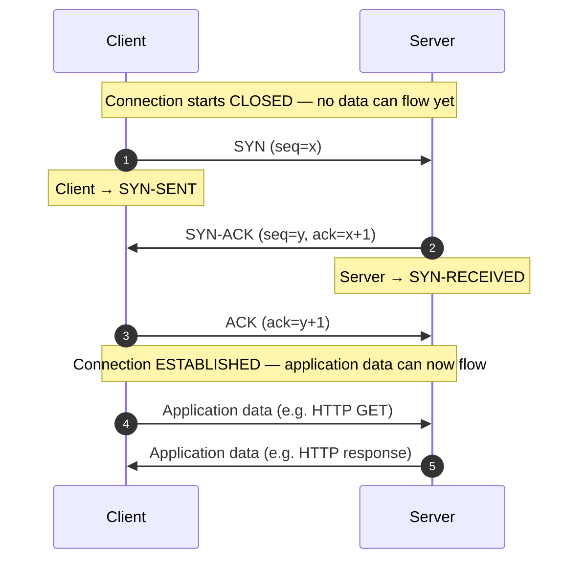

# TCP vs UDP — Junior

<!-- level-focus -->
At junior level, focus on this question:

> How can I apply **TCP vs UDP** in one small example and prove the result?

Use the smallest realistic scenario that exposes the decision and its failure behavior.
## The one-sentence summary

**TCP is a phone call. UDP is a postcard.**

When you make a phone call, you first dial, the other person picks up, and you both say "hello" — you've established a *connection*. From then on, everything you say arrives in the order you said it, and if the line crackles, you say "sorry, what?" and the other person repeats. That's TCP: reliable, ordered, but you pay for the setup and the back-and-forth.

When you drop a postcard in a mailbox, you write the address, let go, and walk away. No handshake. Maybe it arrives, maybe it doesn't. If you send ten postcards, they might arrive out of order, or one might get lost, and you'd never know. That's UDP: no setup, no guarantees, but nothing slows you down.

Hold that image. Everything below is a detail of that one comparison.

---

## Connection-oriented vs connectionless

This is the root difference from which everything else grows.

**TCP is connection-oriented.** Before a single byte of your actual data moves, the two machines perform a handshake to agree that they're both ready to talk. They establish shared state — sequence numbers, buffer sizes, and window information — that both sides remember for the whole conversation. Think of it as opening a session. When you're done, they close it politely too (a separate teardown).

**UDP is connectionless.** There is no handshake and no shared session state. Each UDP message (called a **datagram**) is completely independent. The sender just stamps a destination address and port on the datagram and hands it to the network. It doesn't wait for the receiver to say "ready." It doesn't even confirm the receiver exists. Every datagram is a fresh, standalone envelope that knows nothing about the ones before or after it.

Here's the practical consequence: with TCP, both endpoints *know* they're in a conversation and can track its health. With UDP, the network has no memory of who's talking to whom. That statelessness is a burden lifted — and a safety net removed.

---

## The TCP 3-way handshake

Before TCP carries any application data, it runs a three-message ritual called the **3-way handshake**. Its job is to let both sides agree on **initial sequence numbers** (the counters TCP uses to order and track bytes) and confirm that each side can both send *and* receive.

The three steps are named after the flags in the TCP header:

1. **SYN** — the client says "I want to talk. My starting sequence number is *x*." (SYN = *synchronize*.)
2. **SYN-ACK** — the server replies "Got it, I acknowledge *x*. My starting sequence number is *y*." (One packet doing two jobs: it acknowledges the client and synchronizes the server.)
3. **ACK** — the client says "Got your *y*, thanks." Now the connection is **ESTABLISHED** and real data can flow.

Why three and not two? Because both directions must be confirmed. The client proves it can reach the server (SYN → SYN-ACK), and the server proves it can reach the client (SYN-ACK → ACK). Two messages would only verify one direction.

Here's the exchange, staged step by step:

Notice the cost hiding in that diagram: **one full round trip** passes before any useful data moves. On a connection where a round trip takes 100 milliseconds, that's 100ms of pure setup latency before your request even leaves. This is why "keep the connection open and reuse it" is a recurring theme in performance work — you pay the handshake once and amortize it over many requests.

---

## What TCP gives you

TCP does a remarkable amount of work on your behalf. When you write bytes into a TCP socket, you get four guarantees back — for free, as far as your application code is concerned.

**1. Guaranteed delivery.** TCP numbers every byte it sends. The receiver sends back **acknowledgements (ACKs)** confirming what it got. If the sender doesn't hear an ACK within a timeout, it assumes the data was lost and **retransmits** it. Your data will arrive, or TCP will keep trying until it either succeeds or gives up and tells you the connection is broken. It never silently loses a byte and pretends everything is fine.

**2. In-order delivery.** The internet does not guarantee packets arrive in the order they were sent — they can take different routes and overtake each other. TCP fixes this. Because every byte is numbered, the receiver reassembles them into the exact order the sender wrote them, buffering early arrivals until the gaps fill in. Your application reads a clean, ordered stream, as if the network were a perfect pipe.

**3. Retransmission.** As mentioned above, lost data is automatically resent. You never write retry logic for a dropped packet — TCP handles it beneath you.

**4. Flow control.** A fast sender can overwhelm a slow receiver, flooding a buffer that can't be emptied fast enough. TCP prevents this with a **sliding window**: the receiver constantly tells the sender "I have room for *N* more bytes right now." The sender never sends more than the receiver can hold. (TCP also does **congestion control** — slowing down when the *network* itself is overloaded — but flow control is the receiver-facing half you'll meet first.)

Put together, TCP gives you a **reliable, ordered byte stream**. That phrase is worth memorizing, because it's the exact promise TCP makes and the exact promise UDP does not.

---

## What TCP costs you

None of that reliability is free. TCP's guarantees come with three real costs, and a senior engineer chooses TCP knowing them.

**Setup latency.** The 3-way handshake burns one full round trip before any data flows, as we saw. For a short-lived request over a long-distance link, the handshake can dominate the total time.

**Overhead.** Every TCP segment carries a header of at least 20 bytes (often more with options), plus the machinery of sequence numbers, ACKs, and window updates flowing in both directions. For tiny messages, that bookkeeping can weigh more than the payload itself. TCP also keeps per-connection state in memory on both ends, which limits how many connections a single server can hold.

**Head-of-line blocking.** This is the subtle one. Because TCP delivers bytes *strictly in order*, a single lost packet stalls *everything behind it*. Suppose packets 1, 2, 3, 4, 5 are sent and packet 2 is lost. Packets 3, 4, 5 may have already arrived — but TCP will not hand them to your application until packet 2 is retransmitted and received, because that would break the in-order promise. Everyone waits at the head of the line for the one straggler. This "head-of-line delay" is exactly the wrong trade-off for real-time media, where a slightly-late video frame is useless anyway and you'd rather skip it than freeze the whole stream.

That last cost is the single best reason UDP exists.

---

## UDP: fire and forget

UDP is defined almost entirely by what it *doesn't* do. It takes your data, wraps it in a tiny header, and hands it to IP. That's it.

- **No handshake.** The first datagram carries real data. Zero setup latency.
- **No acknowledgements.** The sender never learns whether the datagram arrived.
- **No retransmission.** Lost datagrams stay lost. The protocol doesn't notice or care.
- **No ordering.** Datagrams may arrive out of order, and UDP delivers them in whatever order they show up.
- **No flow or congestion control.** UDP sends as fast as you tell it to, whether or not the receiver or network can keep up.

The UDP header is only **8 bytes** (source port, destination port, length, checksum) — less than half of TCP's minimum. There's no per-connection state to track, so a single server can serve enormous numbers of clients cheaply.

This sounds reckless, and for many jobs it would be. But "fire and forget" is a feature when you value **freshness and speed over completeness**. In a live video call, if a chunk of audio is lost, retransmitting it is pointless — by the time the retry arrives, that moment of speech is a half-second in the past and would only make you sound delayed. UDP lets the application skip it and keep the conversation live. UDP also hands you a blank canvas: if you *do* want some reliability, you can build exactly the pieces you need on top (this is precisely what modern protocols like QUIC do — reliable, ordered streams built over UDP to escape TCP's head-of-line blocking).

The mental model: **TCP is a managed stream; UDP is a raw pipe you can shape yourself.**

---

## When to use each

The choice comes down to one question: **is losing a message worse than delaying every message?**

- If **correctness and completeness matter most** — every byte must arrive, in order — choose **TCP**. A missing byte in a downloaded file or a bank transaction is unacceptable; waiting an extra moment is fine.
- If **timeliness matters most** — fresh data now beats complete data late — choose **UDP**. A dropped video frame is invisible; a frozen stream is not.

Here's how that plays out in real systems:

**Reach for TCP when you're building:**

- **Web and APIs (HTTP/HTTPS)** — you cannot render a web page from a half-downloaded, out-of-order HTML file. HTTP/1 and HTTP/2 run on TCP.
- **File transfer (FTP, SFTP, downloads)** — a file must arrive byte-for-byte identical.
- **Email (SMTP, IMAP, POP3)** — a message with missing paragraphs is corrupt.
- **Database connections and SSH** — every command and result must be exact and ordered.

**Reach for UDP when you're building:**

- **DNS lookups** — a name query is a single tiny request/response; the handshake overhead would double the cost of a lookup that takes one datagram each way. If it's lost, just ask again.
- **Video and voice calls (VoIP), live streaming** — real-time media where a late packet is worthless. Skip it and stay live.
- **Online multiplayer games** — the game needs the *latest* player position, not a retransmitted stale one. The next update supersedes the lost one anyway.
- **Real-time telemetry, discovery, and heartbeats** — high-frequency, loss-tolerant signals where speed and low overhead win.

A useful sanity check: if you'd rather have **the truth eventually** pick TCP; if you'd rather have **something now** pick UDP.

---

## The comparison table

| Property | TCP | UDP |
|---|---|---|
| Connection | Connection-oriented (handshake first) | Connectionless (no setup) |
| Reliability | Guaranteed delivery + retransmission | Best-effort; lost data stays lost |
| Ordering | Strictly ordered byte stream | Unordered; datagrams independent |
| Setup latency | ~1 round trip (3-way handshake) | Zero — first packet carries data |
| Header size | 20+ bytes | 8 bytes |
| Flow / congestion control | Yes (sliding window, congestion control) | No — sends as fast as told |
| Head-of-line blocking | Yes — one loss stalls everything behind | No — each datagram stands alone |
| Data unit | Byte stream (segments) | Message (datagram) |
| Per-connection server state | Yes (limits scale) | Minimal (scales cheaply) |
| Speed | Slower (guarantees cost time) | Faster (no guarantees to enforce) |
| Best for | Correctness & completeness | Timeliness & low latency |
| Typical uses | Web, APIs, file transfer, email, SSH | DNS, VoIP, live streaming, games |

Read this table not as trivia to memorize but as a decision tool. Every row is a trade-off, and the "right" answer flips depending on whether your application prizes *never losing data* or *never waiting*.

---

## A mental model that sticks

When you're deciding which protocol to use — or reading a system design and trying to understand a choice someone else made — run this three-question checklist:

1. **Does every byte have to arrive?** If yes → lean TCP. If "mostly is fine" → UDP is viable.
2. **Does the data go stale?** If a late message is worthless (audio, video, live position) → lean UDP. If a late message is still valuable (a file, an email) → TCP.
3. **How chatty is the exchange?** One tiny request and reply (like DNS) → the TCP handshake is pure overhead, favoring UDP. A long conversation of many messages → the handshake amortizes to nothing, favoring TCP.

Notice how the same answers keep pointing the same way. That's the sign you've internalized the trade-off rather than memorized a list.

---

## Common misconceptions

**"UDP is unreliable, so it's bad."** UDP isn't *broken* — it's *bare*. It removes guarantees on purpose so you don't pay for what you don't need. On a clean network, most UDP datagrams arrive just fine; the point is that UDP doesn't spend time and bandwidth *ensuring* it.

**"TCP is always slower."** TCP is slower to *start* (the handshake) and can stall on packet loss (head-of-line blocking). But once established on a good link, TCP moves large amounts of data very efficiently. "Slower" is about latency and setup, not raw throughput.

**"You must pick one and it's final."** Many systems use both. A game might use TCP for login and the item shop (must be exact) and UDP for movement updates (must be fresh). DNS traditionally uses UDP for small queries but falls back to TCP for large responses. Choose per *type of data*, not per application.

**"UDP has no error checking at all."** UDP includes an optional checksum that detects corrupted datagrams — but if corruption is found, the datagram is simply dropped, not repaired or resent. It catches errors; it doesn't fix them.

---

## Key takeaways

- **TCP is connection-oriented, reliable, and ordered** — a "reliable byte stream." It costs a handshake round trip, per-packet overhead, and head-of-line blocking on loss.
- **UDP is connectionless and best-effort** — a raw, message-based pipe. No setup, no guarantees, minimal overhead, maximum speed.
- The **3-way handshake** (SYN → SYN-ACK → ACK) establishes TCP's shared state and consumes one full round trip *before* data flows.
- TCP gives you **delivery, ordering, retransmission, and flow control**; UDP gives you **none of these and gets out of the way**.
- **Use TCP** for web, APIs, file transfer, email, and SSH — anything where every byte must arrive intact and in order.
- **Use UDP** for DNS, VoIP, live streaming, and games — anything where fresh data now beats complete data late.
- The deciding question is always: **is losing a message worse than delaying every message?**

*Next step:* [Middle level](middle.md)

---

## Apply it

1. Choose one small, known input for **TCP vs UDP**.
2. Predict the output or observable behavior.
3. Run the smallest example or probe that exercises the concept.
4. Change one input to trigger a failure or boundary case.
5. Explain the evidence using the guide's vocabulary.

## Verify your work

- Record the exact input, command or code path, and output.
- Repeat the probe and confirm the result is consistent.
- Show one expected success and one expected failure.
- Resolve any difference between the prediction and the evidence.

## Review questions

- What problem does TCP vs UDP solve in the example?
- Which input changes the observed result, and why?
- What is the smallest useful success check?
- Which beginner mistake would your evidence catch?
