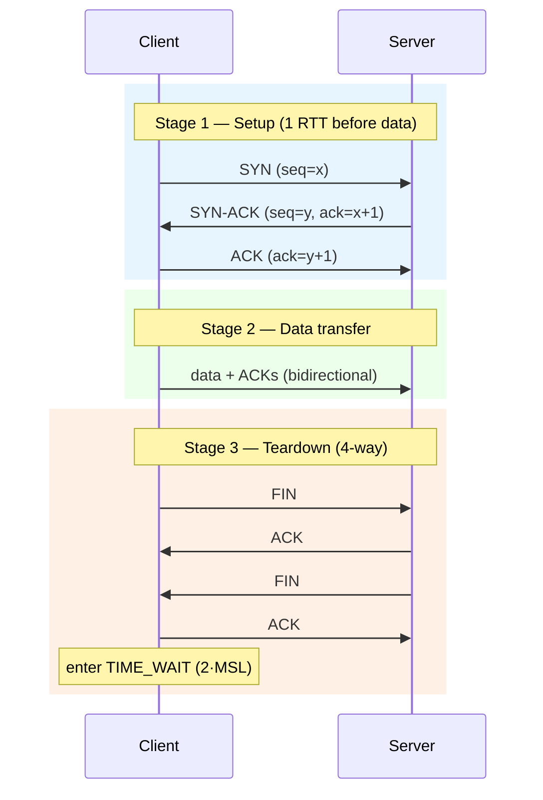
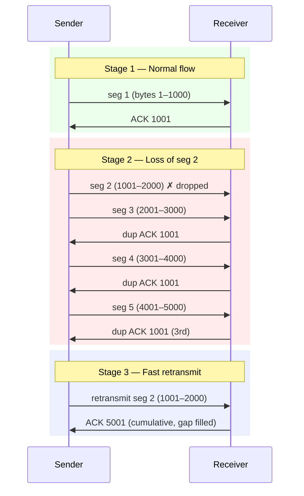

# TCP vs UDP — Middle

<!-- level-focus -->
At middle level, focus on this question:

> Where does **TCP vs UDP** belong in a maintainable component, and which trade-off selects the design?

Use the smallest realistic scenario that exposes the decision and its failure behavior.
## 1. The connection lifecycle: handshake to teardown

A TCP connection is a state machine on both ends, and every byte you send passes through it. Nothing moves until both sides agree that a connection exists, and cleanup is as choreographed as setup.

Connection setup is the **three-way handshake**. The client sends a `SYN` carrying its initial sequence number (ISN); the server replies with `SYN-ACK`, acknowledging the client's ISN and offering its own; the client sends a final `ACK`. Only now — after one full round trip — can application data flow. This is why a TCP request to a distant server has a floor of one RTT of latency before the first byte of your payload leaves, on top of any TLS handshake stacked above it.

Teardown is the **four-way handshake**. Each direction of the connection is closed independently because TCP is full-duplex: the side that is done sending sends a `FIN`, the peer `ACK`s it, and later the peer sends its own `FIN`, which the first side `ACK`s. Between the two FINs a connection can be "half-open" — one side has stopped writing but is still reading. This is the mechanism behind a graceful shutdown: your server stops accepting new writes but drains what the client is still sending.

The practical takeaway: connection setup and teardown are not free. A protocol that opens a new connection per request (naïve HTTP/1.0, some misconfigured clients) pays a full RTT of handshake latency and accumulates teardown state on every call. Connection reuse — keep-alive, pooling — exists precisely to amortize this.

## 2. Why TIME_WAIT exists and why it bites you

After the side that initiated the close sends its final `ACK`, it does not vanish. It enters **TIME_WAIT** and stays there for twice the Maximum Segment Lifetime (`2·MSL`, commonly 60 seconds total on Linux, `MSL` = 30s). Two reasons justify this apparently wasteful wait:

- **Reliable teardown.** If that final `ACK` is lost, the peer retransmits its `FIN`. The socket in TIME_WAIT is still around to re-`ACK` it. Without TIME_WAIT, the re-sent `FIN` would hit a closed port and provoke an `RST`, and the peer would log a spurious error.
- **Stale segment prevention.** The `2·MSL` wait guarantees that any delayed, duplicated segment from this connection has expired from the network before the same 4-tuple (source IP, source port, dest IP, dest port) can be reused. Otherwise a wandering old segment could be misinterpreted as data on a new, unrelated connection reusing the same ports.

The bite: TIME_WAIT lands on **whichever side initiated the close**. A busy service that closes connections to a small set of backends can exhaust ephemeral ports, because each closed connection ties up a 4-tuple for a minute. Symptoms are `cannot assign requested address` or connection failures under load while CPU is idle. Mitigations, roughly in order of preference:

- **Reuse connections** (pooling, keep-alive) so you open far fewer.
- Make the **other side initiate the close** where the protocol allows, moving TIME_WAIT off your hot path.
- On Linux, `net.ipv4.tcp_tw_reuse = 1` lets outbound connections safely reuse TIME_WAIT sockets for *new outbound* connections when timestamps are on. (Avoid the long-removed `tcp_tw_recycle`; it broke NAT.)

TIME_WAIT is not a bug to eliminate — it is correctness insurance. Treat exhaustion as a signal that you are opening too many connections, not that the timer is wrong.

## 3. Reliability machinery: sequence numbers and ACKs

TCP presents a byte stream, but underneath it ships discrete segments over an unreliable network that can drop, reorder, and duplicate them. The abstraction is rebuilt from three primitives.

**Sequence numbers** count *bytes*, not packets. Every byte in the stream has a number, starting from the ISN chosen during the handshake. A segment's header carries the sequence number of its first byte. This lets the receiver place bytes at the correct offset even if segments arrive out of order, and lets it detect gaps.

**Cumulative ACKs** are the receiver's report. An `ACK` with value `N` means "I have received every byte up to but not including `N` — send me `N` next." Crucially it is cumulative: one `ACK` confirms all bytes below its value. If the receiver has bytes 1–1000 and 2001–3000 but is missing 1001–2000, it can still only `ACK` 1001 — the cumulative scheme cannot express "I also have the later chunk." That gap is what **selective acknowledgment (SACK)**, a widely deployed option, fixes: SACK blocks tell the sender exactly which non-contiguous ranges arrived, so it retransmits only the true hole instead of everything after it.

The sender keeps unacknowledged bytes in a **retransmission buffer** and cannot free them until they are ACKed — this is why a stalled receiver eventually backs pressure all the way up into the sender's `write()` calls blocking. Reliability is not magic; it is bookkeeping plus buffers plus timers.

## 4. Retransmission: timeouts and fast retransmit

A sent segment is only "delivered" once acknowledged. When an ACK doesn't come, TCP retransmits — but *how it decides to* matters enormously for latency.

**Retransmission Timeout (RTO).** The sender maintains a smoothed estimate of the round-trip time (SRTT) and its variance (RTTVAR), per Jacobson/Karels, and sets `RTO ≈ SRTT + 4·RTTVAR`. If a segment goes unacknowledged past its RTO, it is resent. On repeated loss the RTO **exponentially backs off** (doubles each time). RTO is the safety net — but it is slow, often clamped to a minimum around 200 ms–1 s, so a single tail-loss recovered by RTO can add hundreds of milliseconds.

**Fast retransmit** is the fast path that avoids waiting for the timer. When a segment is lost but later segments arrive, the receiver keeps sending the *same* cumulative ACK (a duplicate ACK) for each out-of-order arrival, effectively saying "still waiting for that byte." The sender treats **three duplicate ACKs** as strong evidence of loss — not mere reordering — and retransmits the missing segment immediately, without waiting for the RTO. Combined with SACK, the sender can retransmit precisely the missing range and keep the pipe full.

The lesson for practitioners: **loss detection speed dominates tail latency.** Fast retransmit recovers in roughly one RTT; RTO recovery costs the clamped timer. This is why lone packet losses at the very end of a short flow (no later segments to trigger duplicate ACKs) are so painful — there is nothing to trigger fast retransmit, so you fall back to the slow RTO path. Small, latency-sensitive requests suffer disproportionately from tail loss.

## 5. Flow control: the receive window

Flow control answers one question: *is the receiver keeping up?* It protects a slow receiver from a fast sender overrunning its buffer.

Every ACK carries a **receive window (rwnd)** — the number of additional bytes the receiver is currently willing to accept beyond the last ACKed byte. The sender must never have more unacknowledged data in flight than the advertised rwnd. If the receiving application stops reading (`recv()` not called), the OS buffer fills, the advertised window shrinks toward zero, and the sender is forced to stop. When the application drains the buffer, a **window update** re-opens it.

A window that hits zero triggers **zero-window probing**: the sender periodically pokes the receiver to learn when space frees up, since window updates themselves can be lost. Two classic pathologies live here — **silly window syndrome** (tiny window advertisements causing tiny, inefficient segments, mitigated by Nagle's algorithm and delayed ACKs) and interactions between Nagle and delayed-ACK that add latency to small request/response exchanges (which is why latency-sensitive protocols set `TCP_NODELAY`).

Flow control is strictly a two-party contract between sender and receiver. It knows nothing about the network in between — that is congestion control's job, and conflating the two is a common misconception.

## 6. Congestion control: slow start and AIMD

Flow control protects the *receiver*; **congestion control** protects the *network*. It is the sender's self-imposed limit, governed by a second window kept entirely on the sender: the **congestion window (cwnd)**. The actual amount in flight is `min(rwnd, cwnd)`.

- **Slow start.** A new connection has no idea how much bandwidth is available, so it starts small (an initial `cwnd` of ~10 segments today) and grows *exponentially* — roughly doubling `cwnd` every RTT — until it either fills the pipe, hits a threshold (`ssthresh`), or detects loss. "Slow" refers to the small starting point, not the growth rate.
- **AIMD — Additive Increase, Multiplicative Decrease.** Once past slow start, `cwnd` grows *linearly* (add roughly one segment per RTT — congestion avoidance) and, on detecting loss, is *cut multiplicatively* (classically halved). Additive increase probes gently for spare capacity; multiplicative decrease backs off hard when the network signals trouble. This asymmetry is what makes many TCP flows converge toward a fair share of a shared link.

The practical consequence is that **short connections never reach full speed.** A connection that transfers a few tens of KB may spend its entire life in slow start, never exiting into steady state. This is a core argument for connection reuse and for larger initial windows: a warmed-up connection has already grown its `cwnd`, so the next request rides a wide pipe instead of restarting from ten segments. It also explains why throughput on a fresh connection over a high-latency link ramps up visibly rather than snapping to line rate. (Modern algorithms like CUBIC and BBR change the growth curve, but the two-window mental model — receiver limit vs. network limit — still holds.)

## 7. Ordering and head-of-line blocking

TCP delivers bytes to the application **in order**, no exceptions. The receiver buffers out-of-order segments internally, but it will not hand *any* byte past a gap to your `read()` until the gap is filled. This in-order guarantee is a feature — and, in one specific way, a liability.

**Head-of-line (HOL) blocking:** if segment 2 of a stream is lost, segments 3, 4, and 5 may already be sitting in the receiver's buffer, fully intact — but the application cannot see them until the retransmission of segment 2 arrives and closes the gap. One lost packet stalls everything queued behind it.

For a single logical stream (a file download) this is exactly what you want. The problem appears when you **multiplex independent streams over one TCP connection**. HTTP/2 does this: many concurrent requests share a single TCP connection. A packet lost for *one* response stalls delivery of *all* the multiplexed responses, because TCP has no notion of the independent streams above it — it just sees one byte sequence with a gap. This is TCP-level HOL blocking, and it is precisely the pain QUIC was designed to remove: QUIC runs over UDP and implements independent streams with per-stream ordering, so a loss in one stream does not block the others.

The mental model to keep: **TCP gives you one ordered pipe. If your application has many independent things to say, they will queue behind each other's losses.** Whether that is acceptable is an application-design question, not a networking detail.

## 8. UDP: a thin datagram layer

UDP is close to the minimum viable transport. Its header is 8 bytes: source port, destination port, length, checksum. That is the entire feature set — port-based demultiplexing so datagrams reach the right socket, and an optional integrity check. There is no handshake, no sequence numbers, no ACKs, no windows, no retransmission, no ordering, no connection state.

What this buys you:

- **No setup latency.** The first datagram carries payload; there is no RTT lost to a handshake.
- **Message boundaries preserved.** One `sendto()` is one datagram is one `recvfrom()`. Unlike TCP's byte stream, UDP never merges or splits your messages — valuable for message-oriented protocols.
- **No head-of-line blocking.** Each datagram is independent; a lost one blocks nothing.
- **Broadcast and multicast** — one-to-many delivery TCP cannot express.
- **Full control.** You decide what reliability, ordering, and congestion behavior to implement — or to skip.

What this costs you: **everything else.** Datagrams can be lost, duplicated, reordered, or dropped silently when a buffer overflows, with no notification. UDP also does nothing about congestion, which is a responsibility, not a freedom — a UDP flood that ignores congestion signals is antisocial to the network and to itself. Datagrams larger than the path MTU get IP-fragmented, and if any fragment is lost the whole datagram is lost, so well-behaved UDP protocols keep payloads under ~1200 bytes to stay within a safe MTU.

UDP is the right choice when *your application already tolerates loss* (a lost frame of live audio is better replaced by the next frame than by a stalled retransmission), or when *you can build smarter reliability than TCP's one-size-fits-all* — which is exactly what QUIC, DNS, QUIC-based HTTP/3, and game netcode do.

## 9. What you must build yourself on UDP

Choosing UDP is choosing to reimplement the parts of TCP you need — and only those. The engineering value is selectivity: a game can retransmit *only the latest world-state* and drop stale updates, something TCP can never do because it insists on delivering every byte in order. But you are now on the hook for the machinery. This table is the checklist.

| Guarantee | TCP gives it free | On UDP you must build |
|---|---|---|
| **Reliability (no loss)** | ACKs + retransmission | Your own ACK/NAK scheme, sequence numbers, retransmit timers; or accept loss deliberately |
| **Ordering** | In-order byte delivery | Sequence numbers + a reorder buffer; or design order-independent messages |
| **Deduplication** | Handled by sequence numbers | Track received sequence numbers to discard duplicates |
| **Flow control** | Receive window | Your own rate signaling so you don't overrun a slow peer |
| **Congestion control** | slow start + AIMD | A congestion controller — mandatory to be a good network citizen |
| **Connection state / liveness** | Handshake + FIN, keepalives | Application-level session setup, heartbeats, timeout/teardown |
| **Message framing** | You add it (stream has none) | Free — datagrams preserve boundaries |
| **Integrity** | Checksum (mandatory) | UDP checksum (optional on IPv4, present on IPv6) |
| **Path MTU / fragmentation** | Handled by TCP segmentation | Keep payloads ≤ safe MTU (~1200B) yourself |
| **Security / encryption** | TLS layers on top | DTLS or QUIC's built-in crypto |

Two archetypes make the trade concrete:

- **Game netcode.** Position updates are only useful if fresh. On a lost packet, TCP would retransmit the stale position and block the newer one behind it (HOL blocking); the game instead runs on UDP, numbers its state snapshots, and simply ignores anything older than what it already has. It builds *partial* reliability — reliable for the "you picked up the item" event, unreliable for the "player is at (x,y)" stream — which is impossible to express in a single TCP connection.
- **QUIC.** QUIC is essentially a full reliable, congestion-controlled, encrypted, multi-stream transport rebuilt on UDP. Its motivation is everything above: independent streams without TCP's HOL blocking, a handshake fused with TLS to cut setup RTTs, and connection migration across IP changes (a phone switching Wi-Fi to cellular keeps the same connection) — none of which the ossified, kernel-bound TCP could evolve to do. QUIC is the proof that "UDP is unreliable" is a starting point, not a verdict.

The rule of thumb: reach for UDP when you can articulate *which* TCP guarantee you are deliberately dropping or replacing, and why the alternative is better. If the answer is "I just want it faster," you almost certainly want TCP with tuning (keep-alive, `TCP_NODELAY`, larger initial windows), not a hand-rolled protocol you will spend years debugging.

## 10. Connection state cost

TCP's guarantees are backed by **per-connection state on both endpoints**: sequence numbers, window sizes, RTT estimates, retransmission buffers, timers, and the socket's slot in the OS. This has direct capacity implications.

- **Memory.** Each connection holds send and receive buffers (kernel socket buffers, often tens to hundreds of KB each). A server holding a million idle-but-open connections can spend many gigabytes purely on buffers — the classic C10K/C10M scaling wall.
- **File descriptors and ephemeral ports.** Every connection consumes an fd and, on the client side, an ephemeral port from a finite range (~28k by default on Linux). This — plus TIME_WAIT holding tuples — is what caps how many outbound connections a single client IP can sustain.
- **Half-open and idle connections.** A connection whose peer vanished without a clean FIN sits open until keepalives or an application timeout reap it. Load balancers, NATs, and firewalls also expire idle flows on their own timers — which is why long-lived idle TCP connections need periodic keepalives to survive middleboxes.

UDP has **no connection state in the kernel** — the "socket" is just a demultiplexing endpoint. A single UDP socket can serve millions of peers, because there is no per-peer TCB (Transmission Control Block). That is a real advantage for massive fan-out (DNS resolvers, some telemetry ingestion). The catch, again: any per-peer state you *need* (who is this client, what have they acknowledged) now lives in *your* application memory, and you own its lifecycle and cleanup. You did not eliminate the state cost; you moved it up the stack where you control it.

This is the deepest way to frame the whole comparison: **TCP and UDP differ in where the complexity lives.** TCP puts it in the kernel, uniform and battle-tested but inflexible and stateful. UDP hands it to you, flexible and stateless at the transport but only as good as what you build.

## 11. Practitioner heuristics

A compressed decision guide, grounded in everything above:

- **Default to TCP.** Correct reliability, ordering, and congestion control are genuinely hard; TCP's are decades-hardened. Reach for UDP only with a specific, articulated reason.
- **Reuse connections.** Pooling and keep-alive amortize handshake RTTs, dodge repeated slow start, and shrink TIME_WAIT and port pressure. This single practice fixes most "TCP is slow" complaints.
- **Set `TCP_NODELAY` for small, latency-sensitive request/response traffic** to sidestep Nagle/delayed-ACK interactions; leave it off for bulk throughput.
- **Watch tail latency, not just averages.** A lone tail-loss recovered by RTO adds hundreds of milliseconds to an otherwise fast request; enable SACK and prefer newer congestion controllers.
- **If you multiplex many independent streams, HOL blocking is your enemy** — that is the case for HTTP/3 / QUIC over UDP, not for hand-rolling your own.
- **When you do pick UDP, walk the table in §9 and decide each row explicitly:** which guarantee you keep, replace, or drop. The rows you skip without deciding are the ones that page you at 3 a.m.
- **Measure the state budget.** Connection count × buffer size, fd limits, and ephemeral port range are hard ceilings; know them before you promise concurrency numbers.

TCP and UDP are not "reliable vs. fast." They are "guarantees you rent from the kernel" vs. "a blank transport you must furnish yourself." Pick based on which guarantees you need and where you want the complexity to live.

---

*Next step:* [Senior level](senior.md)

---

## Apply it

1. Find a real component where **TCP vs UDP** affects an interface or dependency.
2. Write two plausible choices and the constraint that favors each one.
3. Make the smallest reversible change at that boundary.
4. Exercise the component alone, then exercise the integrated flow.
5. Keep the decision note with the evidence that selected the option.

## Verify your work

- A focused check proves the local behavior.
- An integrated check proves callers and dependencies still agree.
- Logs, traces, compiler output, or benchmarks expose the boundary.
- Reverting the change restores the previous behavior without unrelated edits.

## Review questions

- Which boundary is most affected by TCP vs UDP?
- What constraint would make you choose the alternative design?
- How would you isolate a local defect from an integration defect?
- What evidence shows that the change remains maintainable?
