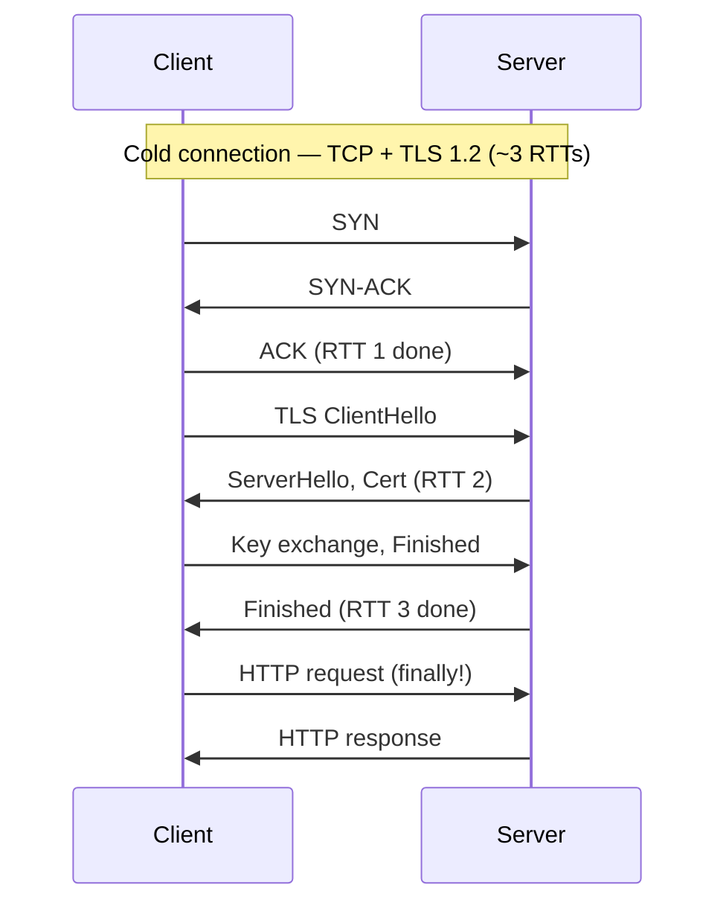
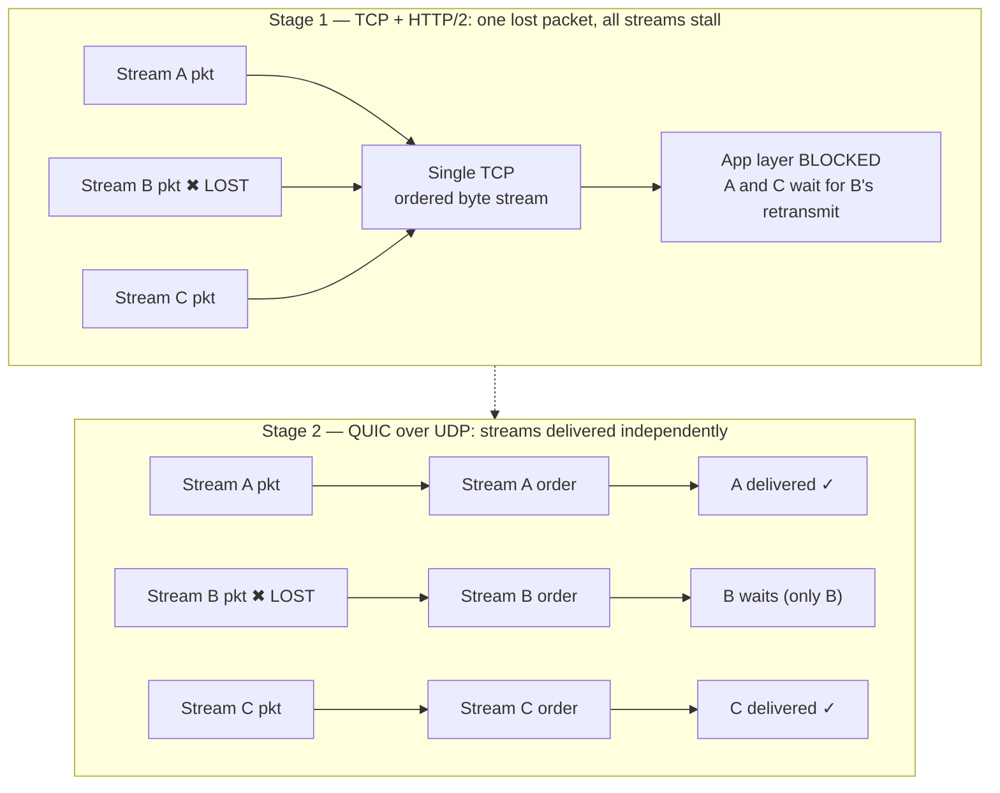

# TCP vs UDP — Senior

<!-- level-focus -->
At senior level, focus on this question:

> Which system invariant is affected by **TCP vs UDP** under failure, load, and change?

Use the smallest realistic scenario that exposes the decision and its failure behavior.
## 1. Selecting transport by requirement

Transport selection is a mapping from three requirements to one decision. Everything else is second-order.

- **Loss tolerance.** Can the application discard a datagram and keep functioning, or does every byte need to arrive? A video decoder can conceal a lost frame; a bank ledger cannot lose a transaction. If your data has no meaning when partially delivered, you need reliable delivery — either TCP or a reliability layer over UDP.
- **Latency sensitivity.** What is the tail-latency budget, and how does a single loss affect it? TCP's in-order guarantee means one lost segment *stalls every byte behind it* until retransmission — roughly one RTT of head-of-line stall. For a 40 ms RTT link, a single loss injects a ~40 ms hiccup into an otherwise fine stream. If your p99 budget is tighter than "one RTT of stall per loss," in-order TCP is working against you.
- **Ordering.** Do consumers require bytes in the exact order sent, or can they process out-of-order and reassemble themselves? Ordering and reliability are separable: QUIC gives you reliable-but-independently-ordered streams; raw UDP gives you neither; TCP couples them tightly.

The trap juniors fall into is treating this as "TCP is safe, UDP is fast." It is not. TCP is *convenient* because the kernel does reliability, ordering, congestion control, and flow control for you. UDP is a blank check: you get a best-effort datagram pipe and you owe the network every guarantee your application needs. Choosing UDP is choosing to *rebuild* the parts of TCP you actually need — and only those parts — because the ones you don't need are hurting you.

Concretely, reach for **TCP** when: the data is a byte stream with no natural message boundaries, you need reliable in-order delivery, and a per-loss RTT stall is acceptable (bulk transfer, RPC, databases, most HTTP/1.1 and HTTP/2). Reach for **UDP** when: messages are independent and self-contained, you can tolerate or conceal loss, you need multicast/broadcast, or you are building your own transport (QUIC, real-time media, DNS, game state, telemetry). Reach for **QUIC** when you want TCP's reliability *and* multiplexing but cannot afford cross-stream head-of-line blocking (HTTP/3, low-latency multiplexed RPC over lossy mobile links).

## 2. The requirement → transport decision table

Use this as the artifact you paste into a design doc. It maps a requirement profile to a recommended transport and the reasoning.

| Requirement profile | Loss tolerance | Latency budget | Ordering need | Recommended transport | Why |
|---|---|---|---|---|---|
| Bulk file transfer, backups | none | loose (throughput-bound) | strict | **TCP** | Kernel congestion control + in-order delivery is exactly the job; loss cost amortizes over long transfer |
| RPC / request-response API | none | moderate (single logical exchange) | per-request | **TCP** (HTTP/1.1, gRPC over H2) | One request = one stream; no cross-stream HOL if one request per connection |
| Multiplexed API, many concurrent requests | none | tight p99 | per-stream | **QUIC / HTTP/3** | Independent stream delivery avoids one lost packet stalling unrelated requests |
| Live video / voice (real-time) | high (conceal loss) | very tight (<150 ms mouth-to-ear) | per-frame, drop stale | **UDP** (RTP/WebRTC) | Retransmit is useless if the frame's play-out deadline has passed; drop and move on |
| Live video (buffered streaming) | none | loose (seconds of buffer) | strict | **TCP** (HLS/DASH over HTTP) | Buffer absorbs retransmit latency; reliability wins |
| Game state / positional updates | high (newest wins) | very tight | none (last value wins) | **UDP** | Old positions are worthless; ordering is irrelevant, only freshness matters |
| DNS query | low (retry whole query) | tight (single small exchange) | none | **UDP** (fall back to TCP for large responses) | One packet each way; connection setup would dominate cost |
| Metrics / logs telemetry | high (sampling acceptable) | loose | none | **UDP** (StatsD) or **TCP** (if lossless required) | If dropped samples are acceptable, UDP avoids backpressure into the app |
| Financial transactions | none | moderate | strict | **TCP** (+ app-level idempotency) | Every message matters, order matters; correctness dominates latency |
| Mobile / lossy-link multiplexed traffic | none | tight | per-stream | **QUIC / HTTP/3** | Connection migration + independent streams shine when packet loss is common |

The two rows worth arguing over in a review are the multiplexed ones. If a single connection carries many logical streams and loss is non-trivial, TCP's single ordered byte stream becomes a liability — that is the QUIC/HTTP/3 signal, developed in sections 7 and 8.

## 3. TCP tuning knobs that matter

Choosing TCP is not the end of the decision — an untuned TCP connection can be an order of magnitude slower than a tuned one on the same link. These are the knobs a senior engineer reaches for, and what each one actually changes.

**Nagle's algorithm and `TCP_NODELAY`.** Nagle coalesces small writes: it holds back a small segment until the previous one is ACKed, to avoid flooding the network with tiny packets. Great for a telnet session, poison for a latency-sensitive RPC that writes a small request and waits for a reply. The failure mode is Nagle interacting with delayed-ACK: your sender withholds a small segment waiting for an ACK, and the receiver withholds the ACK (up to ~40 ms) waiting for data to piggyback on — a mutual standoff that injects tens of milliseconds of latency into every small exchange. Set `TCP_NODELAY` on interactive/RPC sockets to disable Nagle. Rule of thumb: any protocol that does request→response with small messages wants `TCP_NODELAY` on.

**Keepalive.** TCP keepalive probes an idle connection to detect a dead peer. Defaults are famously useless — Linux waits `tcp_keepalive_time` (default 7200 s = 2 hours) before the first probe. For pooled connections behind NAT/LB gateways that silently drop idle flows after a few minutes, two hours means your pool fills with zombie connections that fail on next use. Tune `SO_KEEPALIVE` on plus `TCP_KEEPIDLE` / `TCP_KEEPINTVL` / `TCP_KEEPCNT` (or application-level heartbeats) to detect death in seconds-to-minutes, not hours.

**Buffer sizes and the bandwidth-delay product (BDP).** TCP throughput is capped by `window / RTT`. To saturate a link you need the in-flight window to be at least the BDP:

```
BDP (bytes) = bandwidth (bytes/sec) × RTT (sec)
```

For a 1 Gbps link with 80 ms RTT: `125,000,000 × 0.080 = 10 MB`. If the socket send/receive buffer caps the window below 10 MB, you leave bandwidth on the table no matter how fat the pipe is. Linux auto-tuning (`tcp_rmem`/`tcp_wmem`) handles most cases, but for high-BDP "long fat networks" (cross-region, satellite) you may need to raise the ceilings. The common senior mistake is *manually* setting `SO_SNDBUF`/`SO_RCVBUF`, which disables auto-tuning and pins you to a fixed (often too-small) window — usually leave auto-tuning on and only raise the max.

**`SO_REUSEADDR` / `SO_REUSEPORT`.** `SO_REUSEADDR` lets a listener bind to a port still held in `TIME_WAIT` from a prior process — essential for a service that must restart without waiting out `TIME_WAIT`. `SO_REUSEPORT` (Linux 3.9+) lets multiple sockets bind the *same* port with kernel-level load balancing across them — the standard way to scale accept() across worker processes/threads without a single-accept-thread bottleneck.

| Knob | Symptom it fixes | Cost / risk |
|---|---|---|
| `TCP_NODELAY` | ~40 ms latency spikes on small RPCs (Nagle/delayed-ACK standoff) | More small packets on the wire; irrelevant for bulk |
| Aggressive keepalive | Pool full of dead connections after idle NAT/LB timeout | Extra probe traffic; must match LB idle timeout |
| Raised buffer max (BDP) | Throughput capped well below link on high-RTT paths | Higher per-connection memory; multiply by connection count |
| `SO_REUSEADDR` | "Address already in use" on fast restart | None meaningful for a single listener |
| `SO_REUSEPORT` | accept() bottleneck limiting connection rate | Uneven distribution possible under skewed load |

## 4. Connection overhead at scale

The cost of a TCP connection is not the bytes it carries — it is the round trips and kernel state it consumes before it carries anything.

**Handshake RTTs.** A plain TCP connection costs one RTT (SYN → SYN-ACK → ACK; the client can send data on the third packet). Add TLS 1.2 and you pay two more RTTs; TLS 1.3 cuts that to one, and 0-RTT resumption to zero for resumed sessions. So a cold HTTPS connection over TLS 1.2 costs ~3 RTTs before the first byte of the actual request. On a 100 ms transcontinental RTT, that is ~300 ms of pure setup latency — before your server does any work. This is why connection *reuse* is not an optimization, it is a correctness-of-latency requirement.



**Connection pooling.** The fix for repeated setup cost is to amortize it: keep a pool of warm connections and hand them to requests. This is the single highest-leverage tuning decision for a client talking to a hot backend. Pool sizing is a balance — too small and requests queue waiting for a free connection (head-of-line at the pool level); too large and you exhaust ephemeral ports, backend accept queues, and memory. Size the pool from Little's Law: `connections ≈ arrival_rate × avg_request_duration`. A client issuing 500 req/s with 20 ms mean service time needs roughly `500 × 0.020 = 10` concurrent connections at steady state, with headroom for bursts.

**Ephemeral port exhaustion.** Each outbound TCP connection from a client to a *single* destination (dst IP, dst port) consumes one ephemeral source port. The ephemeral range is finite — Linux default `ip_local_port_range` is roughly 28,000–32,000 ports. A client hammering one backend with short-lived connections can exhaust its source ports and start failing to connect, even though the machine is nearly idle. The tuple that must be unique is (src IP, src port, dst IP, dst port); adding destinations or source IPs multiplies your headroom, but connection reuse is the real fix.

**conntrack limits.** Stateful firewalls, NAT boxes, and Kubernetes nodes (kube-proxy in iptables mode) track every flow in the kernel's `nf_conntrack` table. Each connection is a table entry; the table has a max (`nf_conntrack_max`). When it fills, new connections are dropped with cryptic `nf_conntrack: table full, dropping packet` errors and packet loss that looks like a network problem but is a capacity problem. High-churn short-lived connections blow through conntrack far faster than long-lived pooled ones — another argument for pooling and for watching `nf_conntrack_count` as a first-class metric on any NAT/LB node.

## 5. TIME_WAIT and port exhaustion at LB scale

`TIME_WAIT` deserves its own section because it is where connection overhead turns into a scaling wall, and where senior engineers get burned.

When a TCP connection closes, the side that sends the final `FIN` (the *active closer*) holds the socket in `TIME_WAIT` for `2 × MSL` — on Linux, a fixed 60 seconds. This is not a bug; it exists so that delayed duplicate segments from the closed connection cannot be misdelivered into a new connection that happens to reuse the same 4-tuple, and so the final ACK can be retransmitted if lost. The cost: each `TIME_WAIT` socket pins its 4-tuple for a full minute after the connection is already done.

At load-balancer scale this compounds fast. Imagine an LB proxying to a backend pool where the LB is the active closer. If the LB opens **short-lived** connections to a single backend IP:port, every close parks a (LB IP, ephemeral port, backend IP, backend port) tuple in `TIME_WAIT` for 60 s. With only ~28,000 ephemeral ports and each held 60 s, you cap out at roughly **28,000 / 60 ≈ 466 new connections per second to that one backend** before you run out of source ports — regardless of CPU or bandwidth. That is a shockingly low ceiling for a busy LB, and it manifests as connection failures under load that vanish when traffic drops.

The senior toolkit for this, in order of preference:

- **Reuse connections (keep-alive / pooling).** The best `TIME_WAIT` is the one you never create. Long-lived pooled connections mean you close orders of magnitude fewer sockets. This is almost always the right first move.
- **Make the *other* side the active closer** where the protocol allows, so `TIME_WAIT` accumulates where there is more headroom (e.g., let clients close, not the server).
- **Widen the tuple space.** Spread across more backend IPs/ports or add source IPs; the 4-tuple uniqueness constraint means more destinations linearly increase capacity.
- **`net.ipv4.tcp_tw_reuse = 1`** lets the kernel safely reuse a `TIME_WAIT` socket for a *new outbound* connection when timestamps prove the old segments are stale. This is the safe, supported knob for outbound-heavy hosts (LBs, proxies).
- **Do not use `tcp_tw_recycle`.** It was removed from Linux 4.12 precisely because it broke connections from clients behind NAT (shared timestamp state). If you find it in an old runbook, treat that runbook as radioactive.

The meta-lesson: `TIME_WAIT` exhaustion is almost never solved by fighting `TIME_WAIT` itself. It is solved by *creating fewer connections* — which loops back to pooling and keep-alive as the architectural answer.

## 6. UDP plus application-level reliability

Choosing UDP means signing up to rebuild whatever guarantees your application actually needs, and *only* those. The point is not to reimplement TCP badly — it is to pick a smaller, cheaper subset because the full TCP contract is hurting you.

What TCP gives you, itemized so you can decide what to re-add:

- **Reliability** — retransmission of lost data.
- **Ordering** — bytes delivered in send order.
- **Flow control** — don't overwhelm a slow receiver.
- **Congestion control** — don't overwhelm the network.
- **Connection state** — handshake, teardown, framing.

A real-time media stack over UDP typically re-adds *some* reliability (retransmit only packets whose play-out deadline hasn't passed — anything stale is dropped, because a late frame is worthless), keeps *congestion control* (you must be a good network citizen; unmanaged UDP floods are how you cause packet loss for everyone including yourself), and *deliberately drops ordering* (freshest data wins). Sequence numbers still ride along, but only to detect loss and reorder within a small window — not to stall for missing data.

Two hard-won cautions when building on UDP:

1. **You still owe congestion control.** UDP with no backoff is antisocial and self-defeating: under congestion, blasting harder just increases loss. Real UDP protocols (QUIC, WebRTC, QUIC-based media) implement congestion control that is at least as considerate as TCP's. Skipping it is the single most common way homegrown UDP protocols melt a network.
2. **Watch MTU and fragmentation.** A UDP datagram larger than the path MTU (~1500 bytes on Ethernet, less over tunnels/VPNs) gets IP-fragmented, and losing *any* fragment loses the whole datagram — amplifying loss. Keep application datagrams under the path MTU (a common safe target is ~1200 bytes to survive tunnels) and do your own fragmentation/reassembly at the app layer if you need larger messages.

The reason all of this matters is the setup for the next two sections: once you find yourself building reliability, ordering, congestion control, and connection state *back* on top of UDP, you have essentially decided to build a transport protocol. The industry already did — it's called QUIC — and it exists to solve a problem TCP structurally cannot.

## 7. Head-of-line blocking and why QUIC exists

TCP delivers a single, strictly-ordered byte stream. That guarantee is exactly what makes it unable to multiplex well. If you carry ten independent logical streams inside one TCP connection (as HTTP/2 does), and a single packet is lost, the kernel *cannot* deliver bytes for stream 7 to your application until the lost packet is retransmitted — even if stream 7's data already arrived intact — because doing so would violate in-order delivery of the byte stream. One lost packet stalls *all ten streams*. This is **transport-level head-of-line (HOL) blocking**, and it is the fatal flaw of running multiplexed protocols over TCP.

HTTP/2 solved *application-level* HOL blocking (HTTP/1.1's problem, where one slow response blocks the whole connection) by multiplexing streams. But because it still rides on one TCP connection, it re-exposed the problem one layer down: application streams are independent, but the TCP byte stream underneath is not. On a clean network you never notice. On a lossy mobile link, HTTP/2's multiplexing can perform *worse* than HTTP/1.1's parallel connections, because HTTP/1.1's separate TCP connections isolate loss to one connection while HTTP/2 concentrates all streams behind one shared point of failure.

QUIC's core insight: move the transport *into user space over UDP*, and make streams first-class at the transport layer so each stream has its own delivery order. A lost packet for stream 3 stalls only stream 3; streams 1, 2, and 4 keep flowing. QUIC bundles this with TLS 1.3 baked in (1-RTT or 0-RTT setup instead of TCP+TLS's 2–3 RTTs) and connection IDs that survive IP changes (so a phone switching Wi-Fi→cellular keeps its connection instead of reconnecting from scratch).



The staged diagram is the whole argument on one screen: TCP funnels every stream through one ordered pipe, so any loss stalls the pipe. QUIC gives each stream its own ordered lane over the same UDP flow, so loss is contained to the stream it hit.

## 8. When HOL blocking drives the move to HTTP/3

HTTP/3 is HTTP semantics carried over QUIC. The move from HTTP/2 (over TCP) to HTTP/3 (over QUIC) is not a blanket "newer is better" decision — it is a targeted response to specific conditions. Make it when the evidence points there, not by default.

**Move to HTTP/3 when:**

- **Loss is non-trivial and multiplexing is heavy.** Mobile networks, congested Wi-Fi, satellite, and long-tail international users see enough packet loss that transport HOL blocking measurably inflates p95/p99. If your clients are phones and your pages fire dozens of parallel requests, HTTP/3's independent streams pay off directly.
- **Connection migration matters.** Users roaming between networks (cellular ↔ Wi-Fi) benefit from QUIC's connection IDs surviving IP changes — no reconnect, no re-handshake, no dropped in-flight requests.
- **Setup latency dominates.** Many short sessions to distant servers make TCP+TLS's 2–3 RTT handshake a large fraction of total time; QUIC's 1-RTT (or 0-RTT resumption) is a direct win.

**Stay on HTTP/2 (or even HTTP/1.1) when:**

- **Your paths are clean and low-loss** (data-center-internal, wired, short-RTT). With near-zero loss, transport HOL blocking almost never fires, so QUIC's headline benefit is dormant — and you pay real costs elsewhere.
- **You are throughput-bound, not latency-bound.** UDP-based QUIC historically has higher CPU cost per byte (user-space stacks, less kernel/NIC offload than mature TCP), so for bulk transfer TCP can win on efficiency.
- **Middleboxes are hostile.** Some networks throttle or block UDP, or rate-limit it aggressively. HTTP/3 clients keep a TCP-based fallback exactly because UDP is not universally welcome.

The senior framing: HTTP/3 is not a replacement for TCP everywhere — it is the right tool when you have **multiplexed traffic over lossy, high-RTT, roaming links**. That describes the public internet edge for consumer apps almost perfectly, and describes an internal RPC mesh on a clean 10 GbE fabric almost not at all. Deploy it at the edge, measure p99 against your HTTP/2 baseline on real client networks, and keep the TCP fallback. If the numbers don't move, you didn't have the problem QUIC solves.

## 9. Decision altitude and ownership

Where these decisions get made, and who owns them, matters as much as the technical content.

- **Transport selection (TCP vs UDP vs QUIC)** is an *architecture-level* call made once per protocol/service and documented in a design doc or ADR. It is expensive to change later because it leaks into client libraries, load balancers, firewalls, and observability. Get it right at design time; the decision table in section 2 is the artifact.
- **TCP tuning (Nagle, keepalive, buffers, `SO_REUSE*`)** is a *service-level* concern owned by the team running the service. It is tunable at deploy time and should be captured as configuration with documented rationale, not as folklore in someone's head. Every non-default socket option deserves a comment explaining which symptom it fixes.
- **`TIME_WAIT` / port / conntrack limits** are *platform/SRE-level* concerns that surface as capacity ceilings. They are owned jointly: the service team controls connection *churn* (pool vs. short-lived), the platform team controls kernel limits and LB configuration. When a "network problem" turns out to be conntrack-full or port-exhausted, that is the seam where these two ownerships meet — and it is where a senior engineer earns trust by diagnosing it correctly instead of blaming the network.

Quantify your decisions in reviews. "We chose HTTP/3 for the mobile edge" is an opinion; "on our client fleet, 4% of requests traverse links with >1% loss, where HTTP/2 p99 is 380 ms vs HTTP/3 210 ms, a 45% tail reduction, at +12% edge CPU" is a decision. The altitude you operate at as a senior is the altitude where numbers replace preferences.

## 10. Key takeaways

- Transport choice falls out of three requirements: **loss tolerance, latency budget, ordering**. Map them explicitly; don't reason from "TCP safe, UDP fast."
- Choosing UDP means **rebuilding the parts of TCP you need and only those** — and you still owe congestion control and MTU discipline.
- TCP tuning is real leverage: **`TCP_NODELAY`** for small-RPC latency, **aggressive keepalive** for pooled connections behind NAT/LB, **buffers sized to the BDP** for high-RTT throughput, **`SO_REUSEADDR`/`SO_REUSEPORT`** for restarts and accept scaling.
- Connection cost is **RTTs and kernel state**, not bytes: a cold TCP+TLS 1.2 handshake is ~3 RTTs; **pooling and keep-alive** are the primary defense.
- **`TIME_WAIT` at LB scale** caps you near `ephemeral_ports / 60s ≈ 466 conn/s` to one backend; the fix is **fewer connections** (pool/reuse), `tcp_tw_reuse`, and widening the tuple space — never `tcp_tw_recycle`.
- **Transport HOL blocking** is TCP's structural limit for multiplexed traffic: one lost packet stalls every stream on the connection.
- **QUIC/HTTP/3** exists to give each stream its own delivery order over UDP, plus faster setup and connection migration — deploy it at the **lossy, high-RTT, roaming edge**, keep a TCP fallback, and prove the p99 win with real client data.

---

*Next step:* [Professional level](professional.md)

---

## Apply it

1. State the system invariant that **TCP vs UDP** must protect.
2. Mark ownership, state, and failure propagation at each boundary.
3. Compare two designs under load, dependency failure, and future change.
4. Define recovery and compatibility behavior before implementation.
5. Test the riskiest assumption with a focused experiment.

## Verify your work

- The experiment supports the design with evidence, not preference.
- Failure injection shows the blast radius and recovery path.
- Compatibility checks cover old and new callers or data.
- Operational signals reveal invariant violations and recovery progress.

## Review questions

- Which invariant must remain true when TCP vs UDP fails?
- Where should recovery responsibility live, and why?
- Which assumption deserves an experiment before implementation?
- How can the design evolve without changing every consumer at once?
