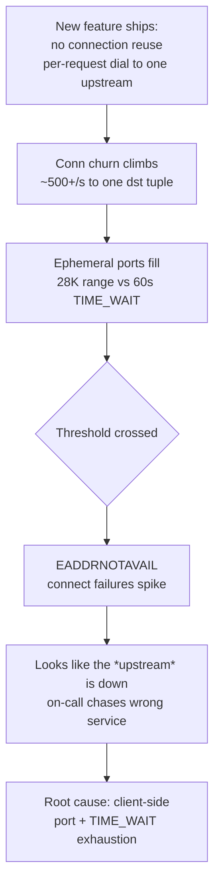
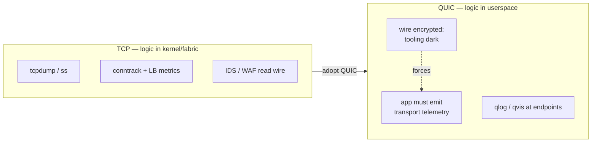
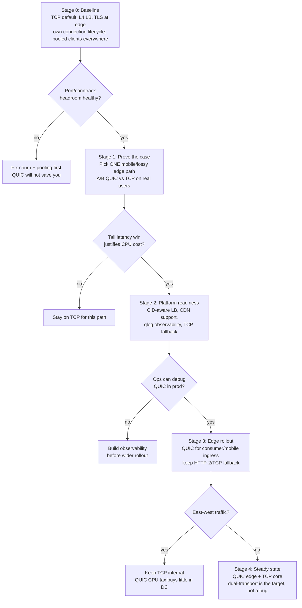

# TCP vs UDP — Staff / Principal Level

At Staff and Principal scope, TCP vs UDP stops being a socket-option decision made per service and becomes a *platform commitment* the whole fleet inherits. The interesting numbers are not RTT or window size — they are the count of concurrent connections your edge holds, the size of the conntrack table on every hop, the number of ephemeral ports you have left, and how much of your observability tooling silently assumes cleartext-inspectable TCP. This page treats transport as long-lived architecture and cost, not as protocol theory.

## Table of Contents

1. [The framing: transport is a platform decision](#1-the-framing-transport-is-a-platform-decision)
2. [The cost of connection management at fleet scale](#2-the-cost-of-connection-management-at-fleet-scale)
3. [TIME_WAIT and ephemeral-port exhaustion as an incident class](#3-time_wait-and-ephemeral-port-exhaustion-as-an-incident-class)
4. [Load-balancer implications: L4 TCP vs UDP](#4-load-balancer-implications-l4-tcp-vs-udp)
5. [When to adopt QUIC / HTTP-3 org-wide](#5-when-to-adopt-quic--http-3-org-wide)
6. [The operability and observability tradeoff](#6-the-operability-and-observability-tradeoff)
7. [A staged migration and decision framework](#7-a-staged-migration-and-decision-framework)
8. [Failure modes and cost table](#8-failure-modes-and-cost-table)
9. [What to standardize as a platform team](#9-what-to-standardize-as-a-platform-team)
10. [Staff-level takeaways](#10-staff-level-takeaways)

---

## 1. The framing: transport is a platform decision

Every app team that ships a service inherits the transport your platform blessed. If the default is TCP with an L4 load balancer terminating TLS at the edge, that is what a hundred teams get for free — connection reuse, health checks, `tcpdump` on any hop, and a mature retry story. If you switch the default to QUIC/HTTP-3, every one of those teams inherits userspace UDP, a CPU tax on the edge fleet, and a debugging experience where their existing tooling goes dark.

The Staff mistake is to evaluate transport per service. A single team benchmarking QUIC on their mobile path and finding a 15% tail-latency win is a real result — but it is not a mandate to flip the fleet default. The Principal question is the *aggregate* one: what does this transport cost across the fleet in memory, CPU, port budget, LB capacity, on-call load, and vendor lock-in, amortized over the years the decision will live?

Three properties make transport a platform-level concern rather than a per-service one:

- **It is sticky.** Once teams build health checks, dashboards, and runbooks around a transport, changing it is a multi-quarter migration, not a config flip.
- **It is shared-fate.** Conntrack tables, ephemeral ports, and LB connection slots are *fleet* resources. One noisy service can exhaust them for everyone on the same host or edge node.
- **It shapes tooling.** The transport dictates whether your L4 LBs, WAFs, IDS, and packet-capture pipelines can see anything useful.

## 2. The cost of connection management at fleet scale

TCP's per-connection state is cheap in isolation and ruinous in aggregate. A single idle connection is a few kilobytes of kernel socket buffers plus an entry in every stateful device on the path. Multiply by the fleet.

Consider an edge tier fronting ten million concurrent long-lived connections (mobile clients, streaming, chat, push). Rough envelope per connection:

| Resource | Per connection (idle) | At 10M connections |
| --- | --- | --- |
| Kernel socket + minimal buffers | ~10–20 KB | ~100–200 GB RAM |
| Conntrack entry (each stateful hop) | ~300 B | ~3 GB per hop |
| Application/session object (heap) | 1–50 KB | 10 GB–500 GB |
| File descriptor | 1 fd | 10M fds (tune `nofile`, `nr_open`) |
| TLS session state | 4–20 KB | 40–200 GB |

The lesson is that **connection count, not request rate, is the scaling axis for the edge.** A service doing 10K req/s over 10M idle-mostly connections is a memory and conntrack problem, not a throughput problem. You size those hosts by RAM and conntrack, and you cap connections per host so a single overloaded box does not become an OOM cascade.

`nf_conntrack` deserves specific attention. It is a per-host hash table (`nf_conntrack_max`) shared by *everything* on the box. When it fills, the kernel drops new flows and logs `nf_conntrack: table full, dropping packet` — a symptom that looks like random connection failures and is trivially caused by one chatty sidecar or a health-check storm. At fleet scale you either raise the ceiling and buckets deliberately, disable conntrack on hot paths (`NOTRACK`), or move to conntrack-free load balancing (Maglev/DSR-style). Treating conntrack as an unbounded free resource is how you get a 3 a.m. page.

Connection *churn* is a second cost axis independent of concurrency. A service that opens and closes a connection per request pays the three-way handshake, slow-start, and — the killer at scale — the TIME_WAIT tax on every close, covered next.

## 3. TIME_WAIT and ephemeral-port exhaustion as an incident class

This is the single most common transport-related production incident, and it recurs because the failure is silent until a threshold, then total.

When a TCP endpoint actively closes a connection, it holds the tuple in **TIME_WAIT** for `2 × MSL` (typically 60 s on Linux) so that stray delayed segments cannot corrupt a new connection reusing the same four-tuple. The active closer pays this cost. For a service-to-service caller, "active closer" is usually the *client side*, and the client is bounded by its **ephemeral port range** — roughly `net.ipv4.ip_local_port_range`, about 28,000 ports by default.

The arithmetic that bites: a client making connections to a *single* destination (one dst IP + dst port) can hold at most ~28K four-tuples before it runs out of source ports, and each closed one is stuck in TIME_WAIT for 60 s. That caps you at roughly **28,000 / 60 ≈ 470 new connections per second to one upstream** before you exhaust ports and start seeing `EADDRNOTAVAIL` / `cannot assign requested address`. A busy API gateway calling one backend blows through that easily.

The recurring incident pattern:

Why it keeps happening: the caller and the *cause* are different services, so the page points at the healthy upstream. The durable fixes are architectural, not tuning knobs:

- **Reuse connections** — connection pooling / HTTP keep-alive / HTTP-2 multiplexing turns N connections into a handful. This is the real fix and it removes the churn entirely.
- **Widen the tuple space** — spreading load across multiple destination IPs/ports multiplies the available four-tuples; this is one reason LBs and service meshes matter.
- **`tcp_tw_reuse`** (client side) lets new outbound connections reuse a TIME_WAIT slot when timestamps prove safety. Useful; not a substitute for pooling. Avoid the long-deprecated/removed `tcp_tw_recycle`, which broke NAT'd clients.
- **Raise `ip_local_port_range`** — buys headroom, not a fix.

Principal framing: TIME_WAIT exhaustion is a *design smell that connection lifecycle was never owned*. The platform should ship pooled clients by default so app teams never write per-request dialing in the first place. UDP/QUIC sidesteps TIME_WAIT entirely (no four-tuple teardown state), which is a genuine — if narrow — point in its favor.

## 4. Load-balancer implications: L4 TCP vs UDP

Load balancing is where the transport choice becomes most expensive and least reversible, because the LB tier is shared platform infrastructure.

An **L4 TCP load balancer** is connection-oriented by nature. It must pin each connection to a backend for the connection's life (stickiness), because TCP state lives on one backend. Classic designs hold per-connection state in the LB, which caps concurrent connections at the LB's memory and makes the LB a stateful, failover-sensitive component. Modern designs (Maglev-style consistent hashing, **Direct Server Return / DSR**) push return traffic straight from backend to client, bypassing the LB on the response path — critical when responses dwarf requests (video, downloads). DSR only works cleanly for L4; once you terminate TLS and inspect L7 you give it up.

A **UDP load balancer** is fundamentally harder because UDP is connectionless — there is no handshake or FIN to mark session boundaries, so the LB must *infer* sessions (typically by hashing the 5-tuple) and rely on idle timeouts to garbage-collect them. This matters enormously for QUIC: a QUIC connection can migrate across client IP/port (Wi-Fi→cellular) and survive, but a naive 5-tuple-hashing UDP LB will re-hash the migrated packets to a *different* backend and break the connection. QUIC's answer is the **Connection ID (CID)**: LBs must route on CID, not the 5-tuple, which requires CID-aware load balancing — newer, less mature, and not universally supported by commodity LBs.

| Concern | L4 TCP LB | UDP / QUIC LB |
| --- | --- | --- |
| Session boundary | Explicit (SYN/FIN) | Inferred (5-tuple + idle timeout) |
| Stickiness | Connection-pinned, well understood | Must route on QUIC CID, not 5-tuple |
| Client migration (Wi-Fi↔cellular) | Breaks (new connection) | Survives — *if* CID-aware routing |
| DSR / return-path offload | Mature (Maglev, IPVS DR) | Possible but less standard |
| Health checking | TCP connect / L7 probe | App-level probe; no cheap connect check |
| Vendor / appliance support | Universal | Partial, newer, uneven |

The Principal takeaway: adopting QUIC org-wide is *first* a load-balancer program, and only *second* an application change. If your LB tier cannot route on Connection ID and offer connection-migration continuity, QUIC delivers a worse experience than TCP, not a better one.

## 5. When to adopt QUIC / HTTP-3 org-wide

QUIC (RFC 9000) and HTTP-3 move the reliability, ordering, and congestion-control machinery out of the kernel's TCP stack and into **userspace over UDP**, bundling TLS 1.3 into the handshake. The wins and the costs are both structural, and the org decision turns on *your traffic mix*, not on the protocol's merits in the abstract.

**Where QUIC clearly wins:**

- **Lossy, high-RTT, mobile networks.** QUIC eliminates TCP head-of-line blocking across streams (a lost packet stalls only its own stream, not all of them) and cuts handshake round-trips (1-RTT, 0-RTT resumption). On packet-loss-prone cellular paths, tail latency improves meaningfully.
- **Connection migration.** Surviving a network change without re-establishing the connection is a real UX win for mobile-first products.
- **Faster connection setup** for short-lived, many-origin browsing patterns.

**What it costs the org:**

- **CPU.** Userspace UDP with per-packet processing and userspace crypto is markedly more CPU-expensive than kernel TCP with hardware TSO/GRO and TLS offload. At CDN/edge scale this is a real capacity line item — you provision more cores per gigabit. Optimizations (UDP GSO, `sendmmsg`, kernel eBPF/XDP offload) narrow the gap but do not close it.
- **LB and CDN support** — see §4; you need CID-aware routing.
- **Observability gaps** — see §6; UDP is harder to inspect.
- **Middlebox and firewall reality.** Some networks throttle or block UDP/443; robust deployments keep a **TCP/HTTP-2 fallback**, so you now run and maintain *two* transports, not one.

The decision is workload-shaped, not fashion-shaped:

- **Adopt aggressively** at the edge/CDN for consumer, mobile-heavy, lossy-network traffic where tail latency is a revenue metric. This is where Google, Meta, and Cloudflare invested first.
- **Adopt cautiously or not at all** for east-west, datacenter-internal service-to-service traffic. Inside the DC, packet loss is low, RTT is sub-millisecond, TCP head-of-line blocking barely bites, and QUIC's CPU tax buys almost nothing — you pay for benefits you cannot realize. gRPC-over-HTTP/2/TCP remains the right internal default for most orgs.
- **Never** flip the fleet default to QUIC to "modernize." Modernization that raises CPU cost and blinds your tooling for east-west traffic is a net negative.

## 6. The operability and observability tradeoff

This is the tradeoff Staff engineers most consistently underweight, and it is the one that generates the most on-call pain post-adoption.

TCP is *battle-tested and inspectable*. Thirty years of tooling assumes it: `tcpdump`, `ss`, `netstat`, conntrack counters, LB connection metrics, IDS/IPS signatures, WAFs, and every packet-capture pipeline in your incident-response toolkit read TCP state natively. When a TCP service misbehaves, an on-call engineer has a deep, familiar toolbox.

QUIC deliberately encrypts most of the transport header, including acknowledgments and much of the connection metadata, inside TLS. That is *by design* — it prevents middlebox ossification and improves privacy. The operational consequence is that your passive network tooling goes largely dark:

- **Packet capture is far less useful** — the transport is encrypted, so you cannot read RTT, loss, retransmits, or flow state off the wire without endpoint keys.
- **L4 middleboxes (WAF, IDS) lose visibility** unless they terminate the connection, which reintroduces the head-of-line and CPU costs QUIC was meant to avoid.
- **You must instrument at the endpoints** — `qlog`/`qvis` and application-emitted telemetry become the *only* source of transport truth. Observability logic moves from the network into userspace, which means every app must be built to emit it, and the platform must standardize the schema.

The general principle: **TCP/UDP push protocol logic into the kernel and the network fabric where shared tooling can see it; QUIC pushes it into userspace where only the application can.** That is a fundamental relocation of operational responsibility from the platform to every app team. It is not wrong — it is a real tradeoff you must staff for. Adopting QUIC without first building endpoint-side transport observability (qlog collection, per-stream metrics, connection-migration events) means your first QUIC incident will be debugged blind.

## 7. A staged migration and decision framework

Never flip a fleet default in one move. Treat transport adoption as a staged program with explicit gates, each of which must pass before the next.

The decision heuristics that fall out of this:

- **Fix connection lifecycle before considering QUIC.** If TIME_WAIT and pooling are unsolved, QUIC is a distraction — you are trying to fix a discipline problem with a protocol.
- **QUIC at the edge, TCP in the core** is the correct steady state for most orgs. Accept dual transport as the destination, not a migration artifact to be eliminated.
- **Observability is a gate, not a follow-up.** No wide rollout until on-call can debug the new transport.
- **Keep the TCP fallback forever.** UDP blocking on hostile networks is not a transient; it is a permanent property of the internet.

## 8. Failure modes and cost table

| Failure mode | Transport | Trigger | Blast radius | Durable fix |
| --- | --- | --- | --- | --- |
| Ephemeral-port / TIME_WAIT exhaustion | TCP | Per-request dialing to one upstream, no pooling | Client service; misattributed to upstream | Connection pooling; spread dst tuples; `tcp_tw_reuse` |
| `nf_conntrack` table full | TCP/UDP | Connection storm, chatty sidecar, health-check flood | Whole host — all flows drop | Raise/size conntrack; NOTRACK hot paths; conntrack-free LB |
| Memory blowup at edge | TCP | Millions of idle long-lived connections | Edge tier OOM cascade | Cap conns/host; size by RAM; offload state |
| QUIC connection breaks on network change | UDP/QUIC | 5-tuple-hashing LB, not CID-aware | Every migrating mobile client | CID-aware load balancing |
| Blind QUIC incident | UDP/QUIC | No endpoint telemetry, wire encrypted | Extended MTTR on any transport issue | qlog/qvis + app-emitted transport metrics |
| UDP blocked on hostile network | UDP/QUIC | Middlebox/firewall drops UDP/443 | Segment of users cannot connect | Automatic TCP/HTTP-2 fallback |
| Edge CPU capacity shortfall | UDP/QUIC | Userspace crypto + per-packet processing | Higher $/gigabit at scale | UDP GSO/`sendmmsg`, XDP/eBPF offload, capacity planning |
| DSR lost on QUIC | UDP/QUIC | Return-path offload not standard | LB return-path capacity pressure | Provision LB egress; CID-aware DSR where available |

## 9. What to standardize as a platform team

The Staff/Principal deliverable is not a protocol opinion — it is a set of paved-road defaults that make the right transport choice automatic for app teams:

- **Ship pooled, keep-alive clients as the default library.** The single highest-leverage intervention: it eliminates the TIME_WAIT incident class before app teams can create it.
- **Own conntrack and port budgets as fleet resources.** Monitor `nf_conntrack_count / nf_conntrack_max` and ephemeral-port utilization as first-class SLIs with alerts *before* exhaustion, not after.
- **Make TCP + L4 LB + edge-terminated TLS the default paved road.** It is the lowest-surprise, most inspectable choice for the overwhelming majority of services.
- **Gate QUIC behind CID-aware LBs and endpoint observability.** Offer QUIC as an opt-in edge capability for mobile-facing teams once the platform can route and debug it — never as an ungoverned free-for-all.
- **Keep TCP fallback mandatory and automatic.** Bake it into the edge, not into each app.
- **Publish the decision framework (§7) so teams self-serve.** The goal is that a team can determine "do I need QUIC?" without a Staff engineer in the room.

## 10. Staff-level takeaways

- **Transport is a platform commitment, not a per-service tuning choice.** The whole fleet inherits your default, and changing it later is a multi-quarter migration.
- **Connection count, not request rate, is the edge scaling axis.** Millions of TCP connections cost RAM, conntrack, fds, and LB slots long before they cost throughput.
- **TIME_WAIT / ephemeral-port exhaustion is a recurring, misattributed incident class** whose real fix is owning connection lifecycle (pooling), not kernel tuning.
- **Load balancing is where transport becomes least reversible.** QUIC adoption is a load-balancer program (CID-aware routing, migration continuity) before it is an application change.
- **Adopt QUIC at the mobile/lossy edge, keep TCP in the datacenter core.** QUIC's tail-latency wins are real where loss and RTT are high; its CPU tax buys almost nothing east-west.
- **The observability shift is the underweighted cost.** QUIC relocates transport logic from inspectable kernel/fabric into userspace — gate rollout on endpoint telemetry, or debug your first incident blind.
- **Dual transport is the destination, not a defect.** QUIC edge + TCP core + permanent TCP fallback is the correct steady state for most organizations.

*Next step:* [Interview questions](interview.md)
