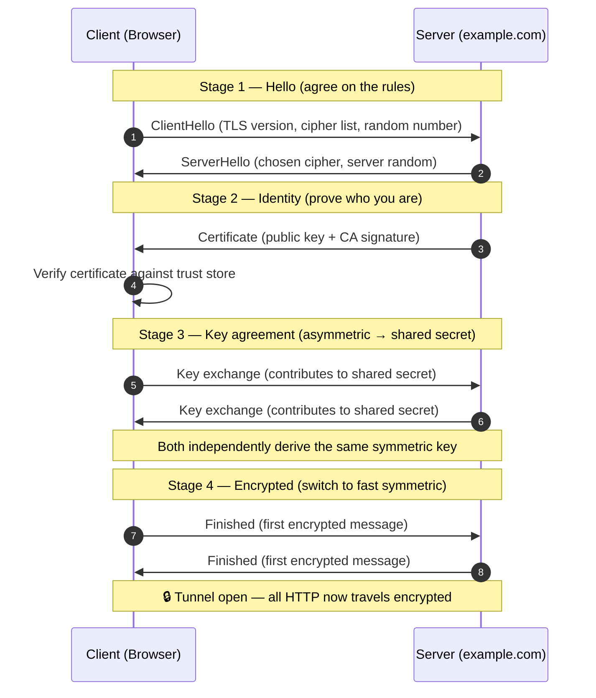

# TLS & HTTPS — Junior

<!-- level-focus -->
At junior level, focus on this question:

> How can I apply **TLS & HTTPS** in one small example and prove the result?

Use the smallest realistic scenario that exposes the decision and its failure behavior.
## 1. The problem: the web is a public road

When you type a message and hit send, it does not travel down a private wire that runs from your laptop directly to the server. It is broken into small packets and handed off from machine to machine, like a letter passing through many post offices. At every hop, someone with access to the equipment can, in principle:

- **Read** the letter (open the envelope and see the contents).
- **Change** the letter (rewrite a sentence before passing it on).
- **Impersonate** the recipient (pretend to be the bank you meant to reach).

This is not paranoia. On open Wi-Fi, capturing traffic from other people on the network takes a free tool and a few minutes. An attacker who sits between you and the server is called a **man-in-the-middle** (MITM). The whole point of HTTPS is to make the public road behave like a private, sealed tunnel — even though the road itself never changes.

**HTTPS** = **HTTP** (the ordinary language browsers and servers speak) running **inside a protected tunnel**. That tunnel is built by a protocol called **TLS** (Transport Layer Security). You will still hear the older name **SSL**; SSL is the obsolete ancestor of TLS, but people say "SSL certificate" out of habit. When you see "SSL" today, mentally translate it to "TLS."

So the mental model is a stack:

```
Your data  (a login form, a JSON API call, an image)
   ↓ carried by
HTTP        (the request/response format)
   ↓ wrapped inside
TLS         (the encrypted, authenticated tunnel)
   ↓ sent over
TCP/IP      (the internet's packet delivery)
```

HTTPS is simply the top three layers glued together. The `S` is the TLS tunnel.

---

## 2. HTTP vs HTTPS

Plain **HTTP** sends everything as readable text over the wire. If you type your password into an `http://` page, the password crosses the network in the clear — anyone on the path can copy it letter for letter. **HTTPS** sends the same HTTP messages, but only after wrapping them in a TLS tunnel, so an eavesdropper sees only scrambled bytes.

Here is a side-by-side comparison of what actually differs:

| Aspect | HTTP | HTTPS |
| --- | --- | --- |
| URL scheme | `http://` | `https://` |
| Default port | 80 | 443 |
| Can an eavesdropper read your data? | Yes, in plain text | No, it's encrypted |
| Can data be tampered with silently? | Yes | No, tampering is detected |
| Do you know you reached the real server? | No | Yes, verified by certificate |
| Padlock in the address bar? | No | Yes |
| Needs a certificate? | No | Yes |
| Passwords / cards / cookies safe? | No — exposed | Yes — protected in transit |
| SEO & browser treatment | Marked "Not secure" | Preferred, no warning |
| Typical setup cost today | None | Free (Let's Encrypt) |

The two protocols carry the *same* HTTP content — the same `GET /login`, the same headers, the same HTML. HTTPS does not change what is sent; it changes **who can see it** and **whether you can trust it**. That is the entire difference, and it is why modern browsers now flag every plain `http://` page as **Not secure**.

---

## 3. The three guarantees TLS gives you

TLS provides exactly three protections. Memorize these three words — everything else is detail.

**1. Confidentiality (nobody can read it).**
The data is encrypted, so anyone watching the network sees only scrambled bytes. Your password, session cookie, and credit-card number look like random noise to a MITM. This is the guarantee most people think of first, and it is the reason "encryption" is the word people associate with HTTPS.

**2. Integrity (nobody can change it undetected).**
Each chunk of data carries a cryptographic checksum (called a **MAC** or an authentication tag). If an attacker flips even a single bit — say, changing an amount from `$10` to `$1000` — the checksum no longer matches and the receiver rejects the message. You cannot silently rewrite encrypted TLS traffic; tampering is *detected*, not just discouraged.

**3. Authentication (you're talking to the real server).**
Before any secrets are exchanged, the server proves its identity by presenting a **certificate** signed by a trusted authority. This stops an attacker from impersonating `bank.com`. Without authentication, encryption alone would be useless: you might be perfectly, privately, encrypting your password straight to the attacker.

A helpful way to remember why all three matter together:

- Encryption without authentication = a private conversation with a stranger wearing your bank's uniform.
- Authentication without encryption = you know who you're talking to, but everyone can hear you shout your password across the room.
- Encryption + authentication without integrity = a sealed, addressed envelope that a postman can still swap pages inside.

You need all three at once. TLS delivers all three in one protocol.

---

## 4. The padlock: what it does and doesn't mean

The padlock icon in the address bar is one of the most misunderstood symbols on the internet. Let's be precise.

**What the padlock DOES mean:**

- The connection to *this website* is encrypted (confidentiality).
- The data hasn't been tampered with in transit (integrity).
- The server presented a certificate that your browser trusts, and the certificate matches the domain in the address bar (authentication).

**What the padlock does NOT mean:**

- **It does not mean the website is honest or safe.** A phishing site at `paypa1-login.com` (note the digit `1`) can get a valid certificate for its own domain in minutes and show a padlock. The padlock says "your connection to this site is private" — not "this site is trustworthy."
- **It does not mean the company is legitimate.** Certificates prove control of a *domain name*, not the good character of the people behind it.
- **It does not protect data after it arrives.** Once your data reaches the server, TLS is done. If that server stores passwords in plain text or gets hacked, the padlock never helped.

The single most important habit for a junior engineer — and for any user — is: **the padlock tells you the connection is secure, but you still have to check that the domain name is the one you actually meant.** Encryption to the wrong site is worthless. Read the domain, not just the lock.

---

## 5. Certificates and Certificate Authorities

Authentication (guarantee #3) rests on **certificates**. Understanding them at a high level is the heart of "how does my browser trust a site."

### What a certificate is

A **TLS certificate** is a small digital document that says, in effect:

> "The public key below belongs to the owner of the domain `example.com`, and this claim is vouched for by a Certificate Authority named `X`, valid until March 2027."

It bundles together:

- the **domain name** it's issued for (e.g. `example.com`),
- the server's **public key** (more on public keys in the next section),
- an **expiry date**,
- the name of the **Certificate Authority (CA)** that issued it,
- and the CA's **digital signature** over all of the above.

### What a Certificate Authority is

A **Certificate Authority (CA)** is a trusted organization — such as Let's Encrypt, DigiCert, or Google Trust Services — whose entire business is verifying that whoever asks for a certificate for `example.com` actually controls `example.com`. When they're satisfied, they *sign* the certificate. That signature is the CA saying: "I vouch for this."

### Why your browser believes any of this

Your operating system and browser ship with a built-in list of a few hundred CAs they trust, called the **trust store** (or root store). These are installed by Apple, Microsoft, Mozilla, and Google after auditing each CA. When a site sends its certificate, your browser checks a **chain of trust**:

```
Root CA  (in your browser's trust store, pre-installed and trusted)
   │  signs
Intermediate CA
   │  signs
example.com's certificate  ← the site presents this
```

Your browser walks up the chain until it reaches a root it already trusts. If every signature checks out **and** the domain matches **and** the certificate hasn't expired **and** it hasn't been revoked, the browser accepts it. If any link fails, you get the scary full-page warning ("Your connection is not private").

The clever part: your browser has never met `example.com` before, yet it can trust it instantly — because it trusts the CA, and the CA vouches for the site. Trust is *delegated*, not established from scratch on every visit. This is exactly how a passport works: you trust a stranger's identity because you trust the government that issued their passport, not because you personally verified them.

---

## 6. Symmetric vs asymmetric keys

To follow the handshake in the next section, you need one idea about keys. There are two families of cryptography, and TLS uses **both**, each for what it's good at.

**Symmetric keys:** one shared secret key both encrypts and decrypts, like a single house key that locks and unlocks the same door. Symmetric encryption is **very fast**, so it's ideal for the bulk of your data. The problem: both sides must already share the secret key — and you can't just send it over the open network, because anyone watching would grab it.

**Asymmetric keys:** a matched **pair** — a **public key** anyone can see and a **private key** the server keeps secret. Data locked with the public key can only be unlocked with the private key. This solves the delivery problem beautifully — you can hand out your public key to the whole world — but it's mathematically **slow**, too slow to encrypt megabytes of web traffic.

TLS combines the strengths of both: it uses **slow asymmetric cryptography just once, at the start, to safely agree on a shared symmetric key**, and then switches to **fast symmetric encryption for all the actual data**. Asymmetric to establish trust and exchange a secret; symmetric to do the heavy lifting. That single sentence captures the core design of every TLS handshake.

---

## 7. The TLS handshake, step by step

Before any real data flows, the client (your browser) and the server run a short negotiation called the **handshake**. Its job is to accomplish, in order: agree on the rules, prove the server's identity, agree on a shared symmetric key, and then start encrypting. Here it is as a staged sequence — read the numbered steps top to bottom.



Reading the four stages in plain language:

- **Stage 1 — Hello.** The client says "hi, here are the TLS versions and encryption methods (ciphers) I support, plus a random number I generated." The server picks the strongest option both sides support and replies with its own random number. This is just agreeing on a common language.
- **Stage 2 — Identity.** The server sends its **certificate**. The client verifies it using the chain of trust from section 5: is it signed by a CA I trust, does the domain match, is it still valid? If not, the handshake stops and you see a warning. This is where **authentication** happens.
- **Stage 3 — Key agreement.** Using **asymmetric** cryptography and the random numbers from Stage 1, both sides perform a key-exchange dance (modern TLS uses a method called Diffie-Hellman) that lets them independently compute the **same shared symmetric key** — without ever sending that key across the network. An eavesdropper who saw every message still cannot derive the key.
- **Stage 4 — Encrypted.** Both sides send a `Finished` message, encrypted with the new symmetric key, to confirm the handshake wasn't tampered with. From this point on, the fast symmetric key encrypts every HTTP request and response. The tunnel is open.

> 🎞️ **See it animated:** [The Illustrated TLS 1.3 Connection](https://tls13.xargs.org/)

The whole handshake usually completes in a fraction of a second, and browsers reuse the result across many requests, so you don't pay this cost on every click. TLS 1.3 (the current version) streamlines it further, but the four conceptual stages — hello, identity, key agreement, encrypted — are the durable mental model.

---

## 8. Never send passwords over plain HTTP

Everything above leads to one non-negotiable rule for anyone building software: **never transmit passwords, tokens, cookies, or any sensitive data over plain HTTP.**

Walk through what happens on `http://` when a user logs in:

1. The browser puts the password into the request body as **readable text**.
2. That request travels through the router, the ISP, and every hop in between — **unencrypted**.
3. Anyone on the path (a snooping Wi-Fi neighbor, a compromised router, a malicious ISP) can **copy the password verbatim**. No decryption needed; it's already plain text.
4. Because there's no authentication either, a MITM can even serve a **fake login page** and harvest credentials directly, and the user has no way to know.

"Hashing the password in the browser first" does **not** save you — the attacker who captured the hash can often just replay it, and you've built complexity for no real gain. The only correct fix is to run the whole exchange inside TLS, i.e. over HTTPS.

Practical rules of thumb for a junior engineer:

- **Serve your entire site over HTTPS**, not just the login page. A single plain-HTTP page can leak a session cookie that hands over the whole logged-in account.
- **Redirect HTTP to HTTPS** and turn on **HSTS** (a header that tells browsers "always use HTTPS for this domain from now on"), so an attacker can't quietly downgrade users to HTTP.
- **Never disable certificate verification** in your HTTP client "to make the error go away." That flag switches off authentication — exactly the protection that stops MITM attacks. Fix the certificate instead.
- **Treat mixed content as a bug**: an HTTPS page that loads a script or image over HTTP reopens the hole for that resource.

Getting HTTPS is no longer a cost excuse: **Let's Encrypt** issues trusted certificates for free and automates renewal. There is no defensible reason to ship a login form over plain HTTP in 2026.

---

## 9. Common misconceptions

A short list of confusions worth clearing up early, because they trip up almost every beginner:

- **"HTTPS means the site is safe."** No — it means the *connection* is private and the domain is authenticated. A scam site can be perfectly HTTPS. Safety of the *content* is a separate question.
- **"The padlock means the company is verified."** No — it means the domain is verified. Anyone who controls a domain can get a certificate for it.
- **"HTTPS encrypts everything about my request."** Mostly — it hides the URL path, headers, cookies, and body. But the **domain name** you're visiting and your **IP address** are still visible to the network (the server's IP and, historically, the hostname). HTTPS hides *what you do on* a site, not always *which site* you visited.
- **"TLS protects my data on the server."** No — TLS protects data **in transit**. Once it arrives, security depends on how the server stores and handles it. TLS and at-rest protection are different problems.
- **"SSL and TLS are different things I need both of."** No — TLS is the modern version of SSL. All the old SSL versions are broken and disabled. "SSL certificate" is just a legacy name for a TLS certificate.
- **"Self-signed certificates are fine for production."** No — a self-signed certificate isn't vouched for by any CA in the trust store, so browsers reject it. It's useful only for local development.

---

## Apply it

1. Choose one small, known input for **TLS & HTTPS**.
2. Predict the output or observable behavior.
3. Run the smallest example or probe that exercises the concept.
4. Change one input to trigger a failure or boundary case.
5. Explain the evidence using the guide's vocabulary.

## Verify your work

- Record the exact input, command or code path, and output.
- Repeat the probe and confirm the result is consistent.
- Show one expected success and one expected failure.
- Resolve any difference between the prediction and the evidence.

## Review questions

- What problem does TLS & HTTPS solve in the example?
- Which input changes the observed result, and why?
- What is the smallest useful success check?
- Which beginner mistake would your evidence catch?
