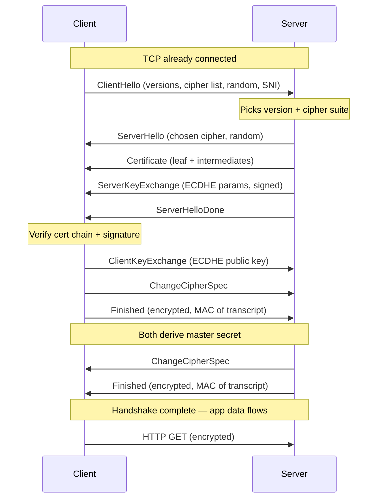
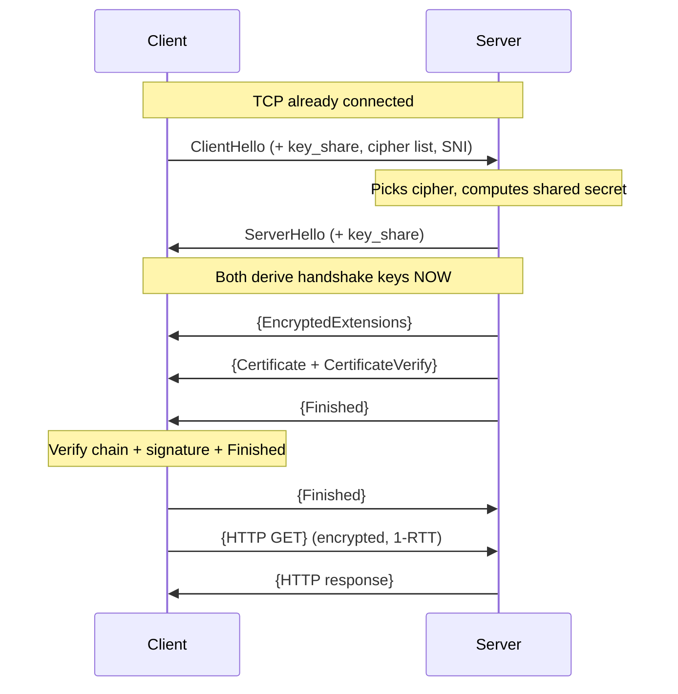
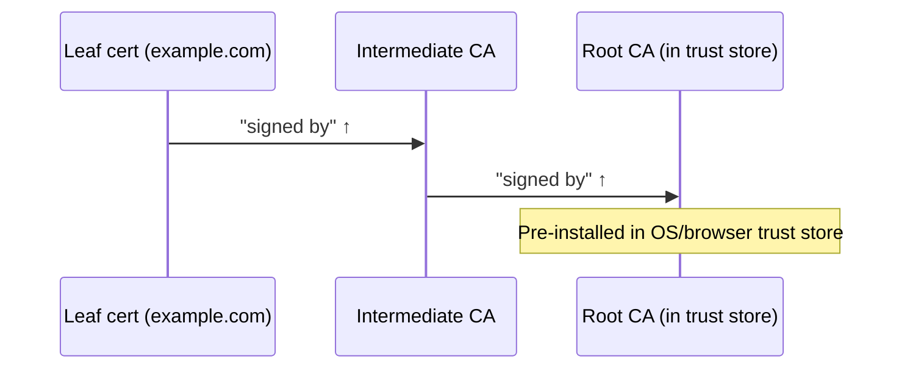
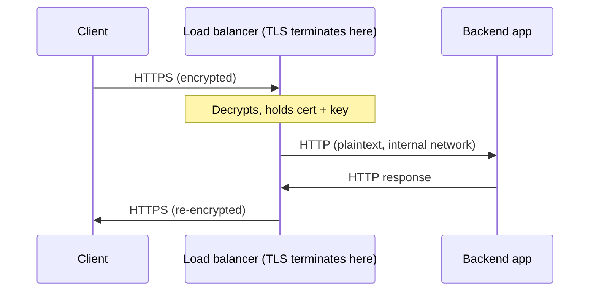

# TLS & HTTPS — Middle

<!-- level-focus -->
At middle level, focus on this question:

> Where does **TLS & HTTPS** belong in a maintainable component, and which trade-off selects the design?

Use the smallest realistic scenario that exposes the decision and its failure behavior.
## 1. The handshake's job

Before a single byte of your HTTP request is protected, the client and server run a **handshake**: a short, structured conversation that must accomplish three things at once.

- **Agree on parameters.** Which TLS version, which cipher suite, which key-exchange group. Both sides support a range; the handshake picks the strongest option they share.
- **Authenticate the server.** The client must be convinced it is talking to the real `example.com` and not an impostor. This is the job of certificates and the chain of trust.
- **Establish shared keys.** By the end, both sides hold identical symmetric keys that no eavesdropper could have derived, even one recording every packet.

The subtle part is that authentication and key establishment are woven together. It is not enough to derive a shared secret with *someone*; you must derive it with the party who proved ownership of the certificate. TLS 1.2 and TLS 1.3 achieve this differently, and the difference is why 1.3 is both faster and safer.

Everything below assumes TCP is already connected. The handshake rides on top of that connection; QUIC folds TLS into the transport, but the cryptographic logic is the same.

---

## 2. TLS 1.2 handshake, step by step

A full TLS 1.2 handshake takes **two round trips** before application data flows. Walk through it in order.



**Round trip 1 — negotiation and the server's material.**

- **ClientHello.** The client opens with its supported TLS versions, an ordered list of cipher suites it accepts, a 32-byte random value, and extensions. The most important extension is **SNI** (Server Name Indication), which carries the hostname in the clear so a server hosting many sites knows which certificate to present.
- **ServerHello.** The server replies with its single chosen cipher suite (from the client's list), its own 32-byte random, and a session identifier.
- **Certificate.** The server sends its certificate chain: the leaf plus any intermediates. The client will verify this chain against its trusted roots.
- **ServerKeyExchange.** For (EC)DHE suites, the server sends its ephemeral Diffie-Hellman public key and **signs it** with the private key matching the certificate. This signature is what ties the key exchange to the authenticated identity.
- **ServerHelloDone.** A marker: "I'm finished talking for now."

**Round trip 2 — the client responds and both sides confirm.**

- **ClientKeyExchange.** The client sends its half of the key-exchange material. Both sides now combine the two randoms and the shared DH secret into the **master secret**, from which all traffic keys are derived.
- **ChangeCipherSpec.** "Everything after this is encrypted with the new keys."
- **Finished.** An encrypted message containing a MAC over the entire handshake transcript so far. If an attacker tampered with any earlier plaintext message (like the cipher list), the transcripts won't match and the handshake aborts. The server sends its own ChangeCipherSpec and Finished in return.

Only after the server's Finished arrives can the client send its HTTP request. Two round trips of latency — noticeable on high-RTT links — is the price, and the reason TLS 1.3 exists.

---

## 3. Cipher suites: reading the negotiation

A **cipher suite** is a bundle of algorithms chosen together. Reading its name tells you exactly what protects your traffic. A TLS 1.2 suite:

```
TLS_ECDHE_RSA_WITH_AES_128_GCM_SHA256
 │    │     │        │       │      │
 │    │     │        │       │      └─ PRF/hash: SHA-256
 │    │     │        │       └──────── mode: GCM (AEAD)
 │    │     │        └──────────────── bulk cipher: AES-128
 │    │     └───────────────────────── authentication: RSA certificate
 │    └─────────────────────────────── key exchange: ephemeral ECDH
 └──────────────────────────────────── protocol: TLS
```

This reads as: exchange keys with ephemeral elliptic-curve Diffie-Hellman, authenticate the server with an RSA-signed certificate, encrypt bulk data with AES-128 in GCM mode (an AEAD that provides both confidentiality and integrity), and use SHA-256 for the key-derivation function.

Names to recognize in the wild:

| Cipher suite | Key exchange | Auth | Cipher/mode | Notes |
|---|---|---|---|---|
| `TLS_ECDHE_RSA_WITH_AES_128_GCM_SHA256` | ECDHE | RSA | AES-128-GCM | Modern, forward-secret, AEAD |
| `TLS_ECDHE_ECDSA_WITH_AES_256_GCM_SHA384` | ECDHE | ECDSA | AES-256-GCM | Faster signatures via ECDSA |
| `TLS_ECDHE_RSA_WITH_CHACHA20_POLY1305_SHA256` | ECDHE | RSA | ChaCha20-Poly1305 | Preferred on CPUs lacking AES-NI |
| `TLS_RSA_WITH_AES_128_CBC_SHA` | RSA (static) | RSA | AES-128-CBC | Legacy — no forward secrecy, avoid |

The client offers a list in preference order, but the **server's preference usually wins** when configured with `ssl_prefer_server_ciphers on` (nginx) — a deliberate choice so operators can enforce policy rather than trusting client ordering. Disabling static-RSA and CBC suites is standard hardening.

---

## 4. Key exchange: RSA vs (EC)DHE and forward secrecy

The single most important property of a key exchange is **forward secrecy**: if the server's long-term private key is stolen tomorrow, can an attacker decrypt traffic they recorded yesterday?

**Static RSA key exchange (legacy).** The client generates the pre-master secret, encrypts it with the server's RSA *public* key from the certificate, and sends it. Only the server's private key can decrypt it. Simple — but fatal: an attacker who records the handshake and later obtains the private key can decrypt that recorded pre-master secret and every session ever protected by that key. **No forward secrecy.**

**(EC)DHE key exchange (modern).** Both sides generate *ephemeral* Diffie-Hellman key pairs, exchange the public halves, and combine them into a shared secret. The ephemeral private keys are discarded after the handshake. The certificate's private key is used only to *sign* the exchange (proving identity), never to derive the secret. Stealing the long-term key later lets an attacker impersonate the server going forward, but **cannot decrypt past recorded traffic** — the ephemeral keys are gone.

The "EC" prefix means the DH math runs over elliptic curves (typically `X25519` or `secp256r1`), which are dramatically faster and smaller than classic finite-field DH for equivalent security. This is why nearly all modern suites are ECDHE. TLS 1.3 removes static RSA entirely: forward secrecy is no longer optional.

---

## 5. TLS 1.3: the 1-RTT handshake

TLS 1.3 redesigned the handshake around a key insight: the client can *guess* the key-exchange parameters and send its share immediately, saving a full round trip.



The braces `{ }` mark messages encrypted under the handshake keys — in TLS 1.3, everything after ServerHello is encrypted, including the server's certificate. Contrast with 1.2, where the certificate travels in plaintext.

What changed:

- **The ClientHello already carries a `key_share`.** The client offers its ephemeral (EC)DHE public key for the group it expects the server to choose (usually `X25519`). If it guessed right, key exchange completes in one round trip.
- **The server responds with its own `key_share`** in the ServerHello. Both sides derive keys immediately and encrypt the rest of the handshake.
- **Certificate and CertificateVerify are encrypted.** CertificateVerify is a signature over the transcript, replacing the 1.2 ServerKeyExchange signature.
- **Only AEAD suites remain.** No CBC, no static RSA, no RC4. The suite names shrink: `TLS_AES_128_GCM_SHA256`, `TLS_AES_256_GCM_SHA384`, `TLS_CHACHA20_POLY1305_SHA256`. Note the missing key-exchange and auth fields — those are now negotiated separately via extensions, so the suite only names the AEAD and hash.

If the client guesses the group wrong, the server sends a **HelloRetryRequest** naming the group it wants, costing one extra round trip — a rare fallback, but worth knowing when a handshake looks unexpectedly slow.

---

## 6. TLS 1.2 vs 1.3 side by side

| Aspect | TLS 1.2 | TLS 1.3 |
|---|---|---|
| Round trips (full) | 2-RTT | 1-RTT |
| Round trips (resumed) | 1-RTT | 1-RTT or 0-RTT |
| Key exchange | RSA or (EC)DHE | (EC)DHE only |
| Forward secrecy | Optional (suite-dependent) | Always |
| Certificate encrypted? | No (plaintext) | Yes |
| Cipher modes | CBC, GCM, ChaCha20 | AEAD only (GCM, ChaCha20) |
| Suite name encodes | KX + auth + cipher + hash | cipher + hash only |
| Legacy/weak algorithms | Present, must disable | Removed from spec |
| Downgrade protection | Weak | Built into transcript hash |

The practical read: TLS 1.3 is faster **and** simpler **and** safer, with almost nothing to configure — the dangerous knobs were removed. When you can require 1.3, do; keep 1.2 enabled only for older clients that cannot negotiate 1.3.

---

## 7. Certificates and chains

A certificate is a signed statement binding a **public key** to an **identity** (a hostname). Your browser doesn't trust a certificate because it's valid on its own — it trusts it because a chain of signatures leads back to a **root** it already trusts.



- **Leaf (end-entity) certificate.** Names your domain, contains your public key, valid for a short period (90 days with Let's Encrypt). Signed by an intermediate.
- **Intermediate CA.** A working certificate the CA uses day to day. Signed by the root. There may be more than one intermediate.
- **Root CA.** A self-signed certificate whose private key is kept offline in an HSM. Its public certificate ships pre-installed in operating-system and browser **trust stores**.

The client validates by walking up: leaf signed by intermediate, intermediate signed by root, root present in the trust store. It also checks that each certificate is unexpired, that the hostname matches, and (via CRL/OCSP) that none has been revoked.

**The single most common production mistake** is forgetting to serve the intermediate. Roots are pre-installed, but intermediates are not — the server must send the full chain (leaf + intermediates) so the client can complete the path. Symptoms: works in your browser (which cached the intermediate from another site) but fails in `curl`, mobile apps, or from a fresh machine. `openssl s_client -connect host:443 -showcerts` reveals what the server actually sends; SSL Labs will flag "chain issues."

---

## 8. SNI, SAN, and wildcards

Three certificate features answer "which name does this cert cover, and how does the server know which cert to send?"

- **SNI (Server Name Indication).** A TLS extension in the ClientHello carrying the target hostname *in the clear*. Without it, a server with many virtual hosts on one IP wouldn't know which certificate to present before the HTTP `Host` header arrives — a chicken-and-egg problem, since the cert is needed to encrypt, but the encryption hides the hostname. SNI breaks the deadlock. (Because it's plaintext, it leaks which site you're visiting; **Encrypted Client Hello** is the emerging fix.)
- **SAN (Subject Alternative Name).** The list of hostnames a certificate is valid for. A single cert can carry `example.com`, `www.example.com`, and `api.example.com` in its SAN list. Modern clients ignore the old Common Name field entirely and validate **only** against SAN — a cert with no SAN entry for the hostname fails, regardless of CN.
- **Wildcard certificates.** A SAN entry like `*.example.com` matches any single label: `www.example.com`, `api.example.com`. It does **not** match the apex `example.com` (add that explicitly) and does **not** match multiple levels (`a.b.example.com`). Wildcards simplify subdomain sprawl but concentrate risk — one stolen key covers every subdomain.

A common pattern: a wildcard `*.example.com` plus an explicit `example.com` SAN entry on the same cert covers the apex and all first-level subdomains.

---

## 9. Session resumption and 0-RTT

The full handshake is expensive — asymmetric crypto and round trips. **Resumption** lets a returning client skip most of it by reusing keying material from a prior session.

**TLS 1.2 mechanisms:**

- **Session IDs.** The server assigns an ID and caches the session state server-side. On reconnect, the client presents the ID; if the server still has it, they resume in 1-RTT. Problem: caching state across a fleet of load-balanced servers requires a shared cache.
- **Session tickets.** The server encrypts the session state with a key only it knows and hands the ticket to the client to store. On reconnect the client presents the ticket; the server decrypts it and resumes — **no server-side state**, which scales cleanly across a fleet (as long as all servers share the ticket-encryption key).

**TLS 1.3** unifies these into **PSK (pre-shared key) resumption** via a ticket the server issues after the handshake, and adds a fast path:

- **0-RTT (early data).** On resumption, the client can send application data — like an HTTP GET — *in its very first flight*, before the handshake completes, encrypted with a key derived from the ticket. Zero round trips of latency for the first request. Powerful for repeat visits.

**The 0-RTT replay caveat is critical.** Because early data is sent before the server proves liveness, an attacker who captures the 0-RTT packet can **replay** it. If that request was a non-idempotent state change (`POST /transfer`, `POST /order`), the replay executes it twice. Therefore 0-RTT must be restricted to **idempotent, safe requests** (GET with no side effects). Servers and CDNs enforce this — Cloudflare, for example, only allows 0-RTT on GET/HEAD and strips it otherwise. Never enable 0-RTT for state-changing endpoints without application-level replay protection.

| Mechanism | TLS ver | Server state | Round trips | Replay risk |
|---|---|---|---|---|
| Full handshake | 1.2 / 1.3 | — | 2 / 1 | None |
| Session ID | 1.2 | Yes (cache) | 1 | None |
| Session ticket | 1.2 | No | 1 | None |
| PSK resumption | 1.3 | No | 1 | None |
| 0-RTT early data | 1.3 | No | 0 | Yes — idempotent only |

---

## 10. TLS termination: where decryption happens

**TLS termination** is the point in your infrastructure where the encrypted connection is decrypted and plaintext HTTP emerges. Choosing that point is an architecture decision with security and operational trade-offs.

**Termination at the edge (most common).** A load balancer, reverse proxy, or CDN holds the certificate and private key, decrypts incoming TLS, and forwards **plaintext HTTP** to backend servers over a trusted internal network.

- Backends never touch TLS — no cert management, less CPU per request.
- Certificate renewal happens in one place.
- The load balancer can read headers and route intelligently (path-based routing, WAF inspection).
- **Trade-off:** traffic between the balancer and backends is unencrypted. Fine inside a trusted VPC; unacceptable across untrusted networks or compliance boundaries.



**TLS re-encryption (end-to-end).** The load balancer terminates the client's TLS, then opens a *new* TLS connection to the backend. Plaintext exists only momentarily inside the balancer's memory. Required when internal traffic crosses zones you don't fully trust or when regulations demand encryption in transit everywhere.

**TLS passthrough.** The load balancer forwards the raw encrypted stream without decrypting; the backend terminates TLS itself. The balancer can route on SNI but cannot read HTTP headers. Used when the backend must own the certificate (some SaaS multi-tenant setups) or for strict end-to-end secrecy where even the balancer shouldn't see plaintext.

The right choice depends on your trust boundaries. Edge termination is the default for most web apps; re-encryption or a service mesh with mutual TLS is standard when "trusted internal network" is not a safe assumption.

---

## 11. Practitioner checklist

- **Serve the full chain.** Leaf + all intermediates. Verify with `openssl s_client -showcerts` from a clean machine, not just your browser.
- **Prefer TLS 1.3, allow 1.2, disable everything older.** SSLv3, TLS 1.0/1.1 are dead.
- **Require forward secrecy.** Enable only ECDHE suites; drop static-RSA and CBC.
- **Validate against SAN, not CN.** Ensure every hostname you serve is in the SAN list.
- **Watch wildcard scope.** Add the apex explicitly; remember wildcards match one label only.
- **Gate 0-RTT to idempotent requests.** Never let a replayed 0-RTT packet trigger a state change.
- **Know your termination point.** Document where plaintext exists and whether the network there is actually trusted.
- **Automate renewal.** Short-lived certs (90 days) demand ACME automation; expired certs are the most common outage.

---

## 12. Key takeaways

- The handshake does three jobs at once: **negotiate parameters, authenticate the server, and establish shared keys** — and it binds authentication to the key exchange so you share secrets with the proven identity.
- **TLS 1.2 is 2-RTT**; **TLS 1.3 is 1-RTT** because the client sends its key share in the ClientHello, and 1.3 encrypts the certificate and removes every weak algorithm.
- **Forward secrecy** comes from ephemeral (EC)DHE key exchange; static RSA has none and is gone in 1.3.
- **Certificate validation walks the chain** leaf → intermediate → root; the classic failure is not serving the intermediate.
- **SNI** picks the cert (in the clear), **SAN** lists the valid names (CN is ignored), and **wildcards** cover one label but not the apex.
- **Resumption** (session IDs, tickets, PSK) skips the expensive handshake; **0-RTT** reaches zero latency but is replayable — restrict it to safe, idempotent requests.
- **TLS termination** decides where decryption happens; edge termination is simplest, re-encryption and passthrough protect traffic past the balancer.

*Next step:* [Senior level](senior.md)

---

## Apply it

1. Find a real component where **TLS & HTTPS** affects an interface or dependency.
2. Write two plausible choices and the constraint that favors each one.
3. Make the smallest reversible change at that boundary.
4. Exercise the component alone, then exercise the integrated flow.
5. Keep the decision note with the evidence that selected the option.

## Verify your work

- A focused check proves the local behavior.
- An integrated check proves callers and dependencies still agree.
- Logs, traces, compiler output, or benchmarks expose the boundary.
- Reverting the change restores the previous behavior without unrelated edits.

## Review questions

- Which boundary is most affected by TLS & HTTPS?
- What constraint would make you choose the alternative design?
- How would you isolate a local defect from an integration defect?
- What evidence shows that the change remains maintainable?
