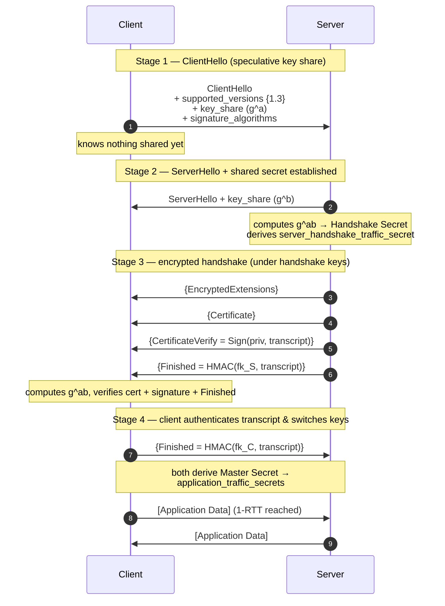
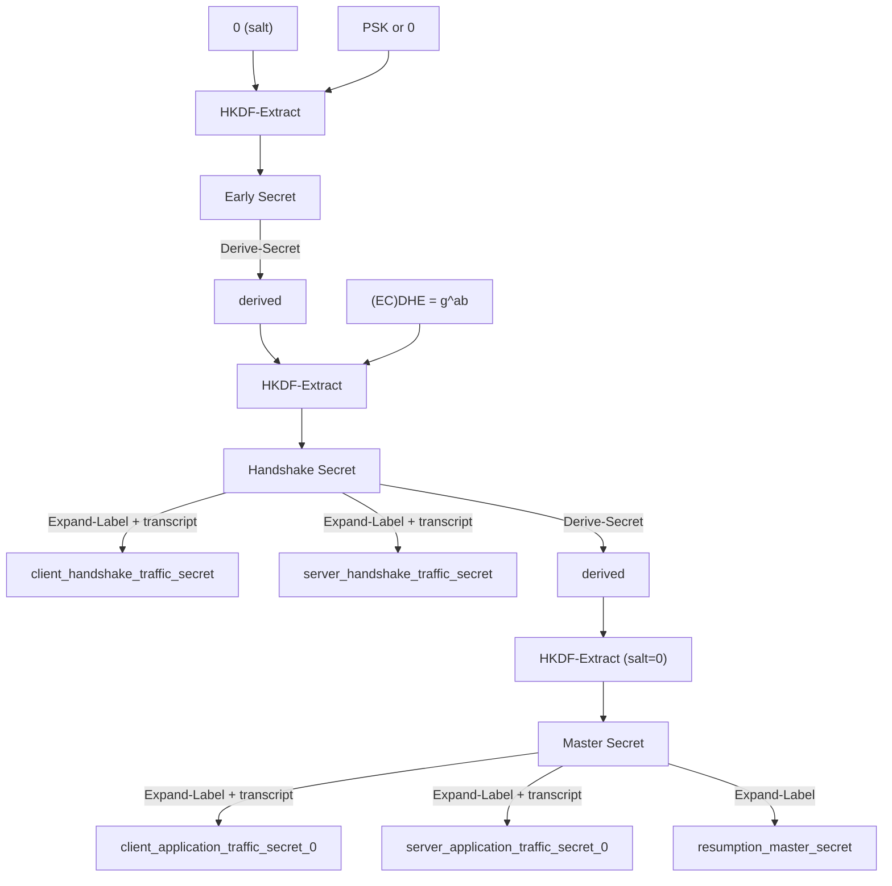

# TLS & HTTPS — Theory and Formal Foundations

<!-- level-focus -->
At professional level, focus on this question:

> How should teams adopt and operate **TLS & HTTPS — Theory and Formal Foundations** with measurable outcomes and limited coordination?

Use the smallest realistic scenario that exposes the decision and its failure behavior.
## 1. The security model and threat surface

The adversary TLS defends against is the **Dolev–Yao attacker**: an active man-in-the-middle who fully controls the network. It can read, drop, reorder, replay, and inject packets, and it may run its own TLS endpoints. It cannot break the underlying primitives (it cannot factor RSA moduli, solve discrete logs, or forge signatures without the private key) and it cannot read memory inside honest endpoints. Security is *conditional* on those hardness assumptions.

Against this attacker, a correct handshake must produce a shared secret that the attacker cannot compute, bind that secret to an *authenticated peer identity*, and bind the whole negotiation (versions, cipher suites, extensions) so that no in-flight tampering goes undetected. The formal goal researchers prove about TLS 1.3 is **Authenticated Key Exchange (AKE) security** plus **channel security** of the record layer — captured in analyses using the ACCE model and mechanized proofs (Tamarin, ProVerif) that ran *alongside* the RFC 8446 design, a first for a mainstream protocol.

Two properties deserve names up front, because the rest of the document turns on them:

- **Forward secrecy (FS):** compromise of a long-term private key *tomorrow* must not decrypt sessions recorded *today*.
- **Downgrade resistance:** an attacker who can strip or rewrite negotiation messages must not be able to force endpoints onto a weaker algorithm than both independently support.

## 2. Key exchange: finite-field and elliptic-curve Diffie–Hellman

Diffie–Hellman lets two parties derive a shared secret over a public channel. Both agree on a cyclic group `G` of prime order `q` with generator `g`. Alice picks a secret exponent `a`, sends `g^a`; Bob picks `b`, sends `g^b`. Each computes `(g^b)^a = (g^a)^b = g^{ab}`. The eavesdropper sees `g`, `g^a`, `g^b` but recovering `g^{ab}` requires solving the **Computational Diffie–Hellman (CDH)** problem — believed hard when the **Discrete Logarithm Problem (DLP)** is hard in `G`.

**Finite-field DH (FFDHE):** `G` is the multiplicative group of integers modulo a large prime `p` (2048–4096 bits for adequate security). TLS 1.3 removed arbitrary client-chosen groups — a source of the Logjam attack — and mandates named groups from RFC 7919 (`ffdhe2048`, `ffdhe3072`, …).

**Elliptic-curve DH (ECDHE):** `G` is the group of points on an elliptic curve over a finite field; the "exponentiation" is scalar point multiplication `a·P`. The best known attack on well-chosen curves is generic (Pollard's rho, `O(√q)`), so a 256-bit curve (`secp256r1`, or the Montgomery curve **X25519**) delivers ~128-bit security against a ~3072-bit FFDHE group — roughly an order of magnitude less computation and smaller messages. X25519 additionally has a constant-time, misuse-resistant design that eliminates whole classes of implementation bugs (invalid-curve, twist attacks). In practice ECDHE with X25519 dominates TLS 1.3 deployments.

The trailing **E** in DHE/ECDHE stands for **ephemeral**: a fresh `a`, `b` per handshake. That single letter is the entire basis of forward secrecy, addressed next.

## 3. Forward secrecy and the death of static-RSA key exchange

TLS 1.2 offered two families of key exchange:

1. **Static RSA:** the client generates the premaster secret, encrypts it under the server's *long-term* RSA public key from the certificate, and sends it. The server decrypts with its long-term private key.
2. **(EC)DHE:** an ephemeral Diffie–Hellman exchange, signed by the server's long-term key for authentication.

The static-RSA mode has a fatal property: the *only* secret protecting the session is the server's long-term private key. An attacker who **records ciphertext today** and **later obtains that key** — through a Heartbleed-style memory leak, a subpoena, a stolen HSM, or a decade of cryptanalysis — can decrypt *every past session* it ever captured. There is no forward secrecy whatsoever.

(EC)DHE breaks that link. Authentication still comes from the long-term key (the server *signs* its ephemeral share), but the *shared secret* comes from the ephemeral exponents `a` and `b`, which honest endpoints **erase from memory immediately after the handshake**. Compromising the long-term signing key later lets an attacker impersonate the server in *future* handshakes, but it yields nothing about `g^{ab}` from a recorded past session, because `a` and `b` are gone. This is **perfect forward secrecy (PFS)** — "perfect" meaning the guarantee holds even against total long-term-key compromise.

RFC 8446 makes the consequence structural: **TLS 1.3 removed static RSA (and static DH) key exchange entirely.** Every 1.3 handshake is (EC)DHE-based, so *forward secrecy is mandatory, not optional*. You cannot configure a 1.3 server into a non-FS mode. This is the single largest security upgrade in the protocol's history, and it is enforced by *removal* rather than by policy — the strongest form of enforcement.

## 4. AEAD ciphers and the record protocol

Once a shared secret exists, bulk data is protected by the **record protocol**. TLS 1.3 permits *only* **AEAD** (Authenticated Encryption with Associated Data) ciphers. AEAD fuses encryption and integrity into one primitive with one key, eliminating the error-prone "encrypt then MAC vs MAC then encrypt" choices that produced Lucky-13, POODLE, and padding-oracle attacks in earlier versions (all of which used a separate CBC-mode cipher plus HMAC).

An AEAD is a pair of functions:

- `Seal(key, nonce, plaintext, aad) → ciphertext || tag`
- `Open(key, nonce, ciphertext || tag, aad) → plaintext OR ⊥`

`Open` returns failure (`⊥`) if the tag does not verify — meaning any bit-flip in ciphertext, tag, nonce, or associated data is detected and the record is rejected. The two AEADs that dominate TLS 1.3:

- **AES-GCM** — AES in counter mode for confidentiality, GHASH (a polynomial MAC over GF(2¹²⁸)) for integrity. Extremely fast where AES-NI hardware instructions exist. Its Achilles heel is **nonce reuse**: repeating a `(key, nonce)` pair with GCM is catastrophic — it leaks the GHASH authentication key and enables forgeries. TLS 1.3's deterministic nonce construction (below) exists precisely to make reuse impossible.
- **ChaCha20-Poly1305** — a stream cipher plus a Wegman–Carter MAC. No S-box lookups, so it is **constant-time in software** and immune to cache-timing side channels; it outruns AES-GCM on CPUs without AES-NI (mobile, embedded). Preferred by mobile clients.

**The TLS 1.3 nonce construction** is a small, elegant piece of engineering. Each direction has a 64-bit **sequence number** starting at 0, incremented per record. The per-record nonce is `write_iv XOR sequence_number` (left-padded), where `write_iv` is a static value from the key schedule. Because the sequence number never repeats within a key's lifetime and is never transmitted, nonces are unique *by construction* and require no explicit nonce field on the wire. The associated data (AAD) is the record header (type, legacy version, length), binding the metadata to the ciphertext.

TLS 1.3 also **encrypts the record content type** and hides most handshake metadata: post-`ServerHello`, every record on the wire has the outer type `application_data`, so a passive observer cannot distinguish handshake, alert, and data records — a real traffic-analysis improvement over 1.2.

## 5. The TLS 1.3 handshake, formally

The headline change is **1-RTT**: the client sends application data one round trip after `ClientHello`, versus two in TLS 1.2. This is achieved by *speculating*. The client guesses which groups the server supports and sends its ephemeral **key share(s)** in the very first flight, inside the `key_share` extension of `ClientHello`. If the guess is right, the server can complete key agreement immediately.

The staged diagram below shows the message flow, when each secret becomes derivable, and when each side can start encrypting.

Reading the stages: braces `{...}` mark records encrypted under **handshake** keys; brackets `[...]` mark **application** keys. Note two subtleties that give TLS 1.3 its strength:

1. **`CertificateVerify` signs the entire handshake transcript hash**, not just a nonce. The server proves possession of the certificate's private key *and* attests to everything negotiated so far. This is the linchpin of downgrade resistance (Section 9).
2. **The `Finished` message is an HMAC over the transcript** using a key derived from the handshake secret. Because it depends on both the secret *and* the full message history, a `Finished` verification failure means either the shared secret differs (active MITM without the key) or the transcript was tampered with. It is the handshake's integrity checkpoint.

If the client's speculative group guess is wrong, the server responds with a `HelloRetryRequest` naming an acceptable group; the client resends `ClientHello` with a matching share. This costs one extra round trip but is the *only* case where 1.3 falls back to 2-RTT.

## 6. The key schedule: HKDF-Extract and HKDF-Expand

TLS 1.3 replaced the ad-hoc PRF of earlier versions with a disciplined chain built entirely on **HKDF** (RFC 5869), the extract-and-expand HMAC-based KDF. Two operations recur:

- `HKDF-Extract(salt, IKM) → PRK` — condenses input keying material into a fixed-length pseudorandom key. Used to fold each new secret into the chain.
- `HKDF-Expand-Label(secret, label, context, len) → key` — TLS 1.3's labelled wrapper around `HKDF-Expand`, producing named keys deterministically from a parent secret.

The schedule threads three inputs — a **PSK** (or zeros), the **(EC)DHE shared secret**, and the running **transcript hash** — into a cascade of secrets:

Three design properties follow directly from this structure:

- **Key separation.** Every traffic key is derived with a distinct label and mixes in the transcript hash at the point it is generated. Handshake keys and application keys are cryptographically independent; leaking one does not reveal the other.
- **Transcript binding.** Because `Derive-Secret` incorporates the running transcript, the *values* of the application keys depend on the exact sequence of handshake messages. Any tampering changes the keys, and the peer's `Finished`/decryption fails.
- **Key update.** From `application_traffic_secret_0`, a `KeyUpdate` message ratchets to `_1`, `_2`, … via `HKDF-Expand-Label`. This bounds the volume of data under any single key and gives forward secrecy *within* a long-lived connection.

## 7. 0-RTT and the replay problem

TLS 1.3 introduces **0-RTT** ("early data"): on a *resumed* session, the client can send application data in its very first flight, before the handshake completes, encrypted under a key derived from a pre-shared key (PSK) obtained during a prior connection. Latency drops to zero round trips for the first byte — a large win for repeat visits.

The security cost is fundamental and cannot be fully removed. 0-RTT data is protected *only* by the PSK and carries **no forward secrecy** and, critically, **no replay protection**. Because early data is not part of the live (EC)DHE exchange, an attacker who captures the 0-RTT flight can **retransmit it to the server**, possibly many times. The server, seeing a valid PSK-authenticated ciphertext, may process it more than once.

RFC 8446 is explicit that anti-replay for 0-RTT is the *application's* responsibility, and prescribes mitigations:

- **Restrict 0-RTT to idempotent requests.** A replayed `GET` is (usually) harmless; a replayed `POST /transfer-money` is not. Applications must gate which requests are eligible for early data.
- **Single-use / bounded-window tickets.** Servers track consumed PSK tickets (a strike register) or bind early data to a freshness window using the ticket age, rejecting duplicates within a time window. This is imperfect across a server fleet, where shared state is expensive.

The correct engineering stance: **treat 0-RTT as an optimization for safe, replayable, non-state-changing requests only**, and disable it where you cannot reason about replay. The rest of the connection — post-handshake — regains full forward secrecy because it *is* backed by the fresh ECDHE exchange.

## 8. Certificate chain validation

Key exchange gives you a secret shared with *someone*. Authentication proves *who*. That proof is an **X.509 certificate chain** anchored in a trust store of root Certificate Authorities. Validation is a distinct, error-prone process with four independent pillars — a failure in any one is a full authentication failure.

**Path building.** The presented end-entity (leaf) certificate names an issuer. The verifier constructs a chain from the leaf up through zero or more intermediate CAs to a root already present in the local trust store. Path building is a *search*, not a lookup: servers may send certificates out of order or omit intermediates (requiring AIA fetching), and multiple valid paths may exist. A robust verifier tries alternatives rather than failing on the first dead end.

**Signature verification.** For each link, the child certificate's signature must verify under the parent's public key. This chains cryptographic trust from a root you decided to trust down to the leaf. The signature also covers the certificate's contents, so nothing inside can be altered without detection.

**Constraint checking.** Each certificate carries constraints that *must* be honoured:

- **Validity period** — `notBefore`/`notAfter`; expired certificates are rejected.
- **Basic Constraints** — `CA:TRUE` and an optional `pathLenConstraint`; a leaf certificate cannot masquerade as a CA and issue further certificates.
- **Key Usage / Extended Key Usage** — a certificate marked for email signing cannot authenticate a TLS server.
- **Name constraints** — an intermediate CA can be restricted to issue only within a DNS subtree (e.g. only `*.example.com`), a powerful containment tool for delegated CAs.
- **Identity match** — the requested hostname must match a **Subject Alternative Name** (SAN) entry. The legacy Common Name is no longer trusted by modern clients. This is the check that stops a valid certificate for `evil.com` from authenticating `bank.com`.

**Revocation.** A certificate can be valid-by-signature yet *revoked* (key compromised, mis-issued). Revocation is checked via **CRLs** (bulk revocation lists) or **OCSP** (per-certificate online queries). Because live OCSP leaks browsing to the CA and adds latency, **OCSP stapling** has the server fetch and attach a signed, time-stamped OCSP response during the handshake; **OCSP Must-Staple** lets a certificate *demand* a valid staple, hard-failing if absent — closing the "soft-fail" gap where clients ignore unreachable revocation servers.

## 9. Downgrade and attack resistance

A protocol is only as strong as its *weakest reachable configuration*. A downgrade attack coerces peers who both support strong crypto into using weak crypto. TLS's history is largely a history of downgrade and construction flaws; understanding them explains 1.3's design by contrast.

- **BEAST (2011)** — a chosen-plaintext attack against TLS 1.0's *predictable CBC IVs*, letting an attacker decrypt secrets like session cookies. Fixed conceptually by unpredictable per-record IVs — and structurally by 1.3 removing CBC entirely in favour of AEAD.
- **CRIME (2012)** — exploited **TLS-level compression**: because compressed length leaks how much a secret and attacker-chosen data share, an adversary could recover cookies byte by byte. TLS 1.3 **removed compression** from the record protocol outright.
- **POODLE (2014)** — a padding-oracle attack that worked by *downgrading* clients to SSL 3.0 and abusing its underspecified CBC padding. It is the canonical argument for **downgrade resistance** and for retiring legacy versions.
- **Heartbleed (2014)** — not a protocol flaw but an OpenSSL implementation bug in the heartbeat extension that leaked adjacent process memory, including long-term private keys. Its lasting lesson is *why forward secrecy matters*: with static-RSA sessions, a leaked key retroactively decrypts recorded traffic; with mandatory ECDHE, the damage is bounded to impersonation going forward.

TLS 1.3 hardens against downgrade with layered, cryptographic mechanisms:

1. **Version via extension, not the record field.** The legacy `ClientHello.legacy_version` is frozen at `0x0303` (1.2) for middlebox compatibility; the *real* version is negotiated in the `supported_versions` extension. Because that extension is covered by the transcript and thus by `CertificateVerify` and `Finished`, an attacker cannot strip it without invalidating the signature and MAC.
2. **The downgrade sentinel.** A 1.3-capable server that negotiates 1.2 or below writes a specific, well-known byte pattern into the last 8 bytes of `ServerHello.random`. A genuine 1.3 client that then finds itself on 1.2 detects the sentinel and aborts — a MITM cannot forge it because the server's signature covers the random.
3. **Whole-transcript signing.** `CertificateVerify` signs the hash of *every* prior handshake message. Any tampering with cipher suites, groups, or extensions changes the transcript, breaking the signature — turning downgrade into an integrity failure the client detects.
4. **Aggressive removal.** SSL 2/3, RC4, static RSA, CBC, TLS-level compression, renegotiation, and custom DH groups are all *gone*. The attack surface shrank because the weak options were deleted, not merely deprecated.

## 10. TLS 1.2 vs 1.3: security-property comparison

| Property | TLS 1.2 | TLS 1.3 (RFC 8446) |
|---|---|---|
| Forward secrecy | Optional (only with (EC)DHE suites) | **Mandatory** — static RSA/DH removed |
| Handshake latency | 2-RTT | **1-RTT**; 0-RTT on resumption |
| Cipher constructions | AEAD, CBC+HMAC, RC4 | **AEAD only** (AES-GCM, ChaCha20-Poly1305, AES-CCM) |
| Static-RSA key exchange | Supported | **Removed** |
| Record-layer compression | Allowed (enabled CRIME) | **Removed** |
| CBC / padding oracles | Present (Lucky13, POODLE, BEAST) | **Eliminated** (no CBC) |
| Version negotiation | Record `version` field, spoofable | `supported_versions` extension, transcript-bound + downgrade sentinel |
| Key derivation | Custom PRF | **HKDF** extract-and-expand key schedule |
| Handshake confidentiality | Cert & extensions sent in cleartext | Encrypted after `ServerHello` |
| Renegotiation | Supported (attack surface) | **Removed** (replaced by `KeyUpdate` / post-handshake auth) |
| Cipher-suite count | 300+ registered, many weak | 5 recommended AEAD suites |
| Formal analysis pre-standardization | No | Yes (Tamarin, ProVerif, ACCE proofs) |
| 0-RTT replay exposure | N/A | Present — application-level mitigation required |

The pattern is unmistakable: TLS 1.3's security improvements come predominantly from **subtraction**. It removed static RSA, CBC, compression, renegotiation, RC4, and hundreds of cipher suites. Every removal deleted a class of attacks. What remained was then *proven* secure with mechanized tools before publication.

## 11. Mental model and closing synthesis

Hold four load-bearing ideas:

- **Ephemeral is everything.** The single letter `E` in ECDHE is the whole of forward secrecy. TLS 1.3 makes it non-optional by deleting every non-ephemeral key exchange, so a future key compromise cannot retroactively decrypt today's recorded traffic.
- **One AEAD, one key, one nonce discipline.** Fusing encryption and integrity into an AEAD, driven by a deterministic per-record nonce, erased the padding-oracle and MAC-ordering family of bugs. The record layer's job is confidentiality, integrity, and metadata hiding — nothing else.
- **The transcript is the anchor.** `CertificateVerify` signs it, `Finished` MACs it, the key schedule mixes it into every derived secret. Downgrade, injection, and tampering all become the *same* failure: the transcript no longer matches, so signatures and keys diverge and the handshake aborts.
- **Security by subtraction.** 1.3's leap forward is mostly deletions — static RSA, CBC, compression, renegotiation, weak suites — each closing a historical attack (Heartbleed's retroactive decryption, CRIME, POODLE, Lucky13). Fewer options, formally verified, is stronger than many options, carefully configured.

When you operate TLS in production, this theory becomes checklist: prefer X25519 ECDHE, require AEAD, enforce 1.3 (or 1.2 with only (EC)DHE + AEAD suites), staple OCSP with Must-Staple where feasible, restrict 0-RTT to idempotent requests, and validate the full certificate chain — path, signatures, constraints, SAN match, and revocation — as five independent gates, any of which failing is a hard failure.

> 🎞️ **See it animated:** [The Illustrated TLS 1.3 Connection](https://tls13.xargs.org/)

---

---

## Apply it

1. Define the user or business outcome that **TLS & HTTPS — Theory and Formal Foundations** should improve.
2. Assign one owner for code, contracts, operations, and incidents.
3. Split delivery into reversible increments that produce evidence early.
4. Publish responsibilities, escalation paths, and compatibility windows.
5. Stop or expand only when the agreed measures support that decision.

## Verify your work

- Each increment has an owner, rollback path, and observable exit condition.
- Adoption, reliability, delivery time, and coordination cost are measured.
- Incident and migration exercises prove that responsibility is executable.
- The old path is removed only after telemetry proves it is unused.

## Review questions

- Which measurable outcome justifies investing in TLS & HTTPS — Theory and Formal Foundations?
- Which team owns the full lifecycle and incident response?
- What reversible increment produces the earliest useful evidence?
- Which exit condition proves that migration or adoption is complete?
