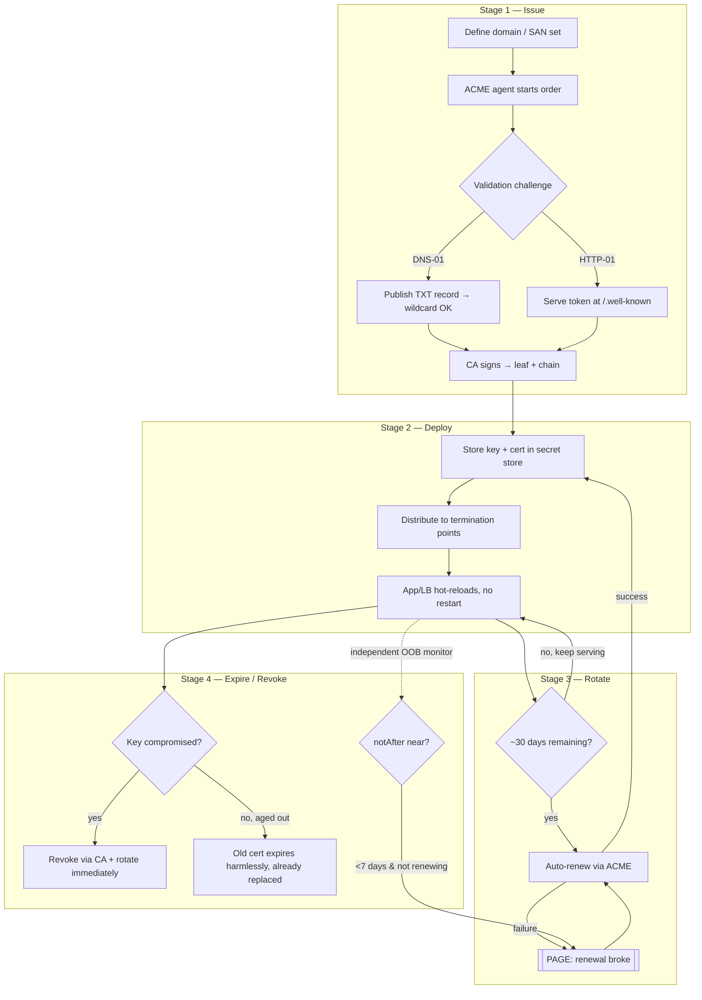

# TLS & HTTPS — Senior

<!-- level-focus -->
At senior level, focus on this question:

> Which system invariant is affected by **TLS & HTTPS** under failure, load, and change?

Use the smallest realistic scenario that exposes the decision and its failure behavior.
## 1. Termination architecture: where the handshake dies

Every HTTPS request terminates its TLS handshake at exactly one hop first — the point where ciphertext becomes plaintext and the private key must live. Choosing that point is the single most consequential TLS decision an owner makes, because it dictates who holds keys, where you can inspect traffic, and how many certs you operate.

The three canonical termination points:

- **Edge / CDN.** TLS terminates at the CDN's global PoPs (CloudFront, Fastly, Cloudflare). The client's handshake completes close to them (low RTT), and the CDN forwards to your origin over a second connection. You often don't hold the public-facing private key at all — the CDN does.
- **Load balancer.** TLS terminates at your L7 LB (ALB, Envoy, NGINX, HAProxy). Keys live on the LB fleet; backends receive plaintext HTTP over a trusted internal network.
- **Application.** TLS terminates in the app process itself. Keys live on every app instance. Maximum end-to-end confidentiality, maximum operational cost.

The tradeoff is **visibility vs. blast radius vs. reach**. Terminating early (edge) buys you the shortest client handshake RTT and centralized cert management, but the CDN sees plaintext and you multiply the number of trust boundaries. Terminating late (app) keeps plaintext off every intermediary but forces cert distribution to thousands of processes and pays the handshake RTT at your origin's distance from the user.

| Terminate where? | Client handshake RTT | Who holds the private key | Plaintext visible to | Cert count to manage | Best for |
|---|---|---|---|---|---|
| **Edge / CDN** | Lowest (PoP near user) | CDN (or you, uploaded) | CDN, LB, app | 1 logical cert, CDN-managed | Public web, static + dynamic at scale |
| **Load balancer** | Medium (LB region) | LB fleet | LB, app, internal net | Few (per LB / per SAN set) | Standard backend services |
| **Application** | Highest (origin distance) | Every app instance | App only | Many (per instance/pod) | Regulated data, zero-trust internal |
| **Passthrough (L4)** | At app | App only | App only | Many | End-to-end e2e, SNI routing without decrypt |

A subtlety that trips teams: **L4 passthrough** (the LB routes by SNI or IP without decrypting) is not "terminating at the LB" — the handshake flows through to the app. You get app-held keys with LB-level routing, but you lose L7 features (path routing, header inspection, WAF) at the LB because it never sees plaintext.

## 2. Re-encryption to origin and the visibility tradeoff

Terminating at the edge or LB leaves a second leg: edge/LB → origin. Three postures:

1. **Plaintext to origin.** The LB decrypts and forwards HTTP over the internal network. Fastest, simplest, and acceptable **only** if that network is genuinely trusted (a private VPC with no lateral-movement risk). In a zero-trust world this is increasingly unacceptable — a compromised host anywhere on the path sniffs everything.
2. **Re-encrypt (TLS to origin).** The LB re-establishes a fresh TLS connection to the backend. The origin presents its own cert; the LB verifies it. Traffic is encrypted on both legs but decrypted-then-reencrypted at the LB, so the LB still sees plaintext.
3. **Passthrough / e2e.** No intermediary ever sees plaintext.

The **visibility vs. security tradeoff** is fundamental and unavoidable: any hop that can inspect, route on headers, apply a WAF, cache, or compress the response *must* see plaintext. You cannot have a WAF and true end-to-end encryption simultaneously at that hop. Owners resolve this deliberately: terminate at the edge to get WAF/caching/DDoS scrubbing, then **re-encrypt to origin** so the *inter-datacenter* leg is protected even though the edge is a trusted-and-inspecting party. "Full (strict)" mode in CDN parlance means exactly this — re-encrypt *and* verify the origin cert against a real CA, not a self-signed one. "Full" without "strict" (encrypt but don't verify) is a common misconfiguration that defeats the point: it stops passive sniffing but not an active MITM.

## 3. Certificate management as a system

The move from junior to senior thinking is treating certificates as a **managed inventory with a lifecycle**, not artifacts you copy onto boxes. A cert has issuance, deployment, monitoring, rotation, and revocation phases, and each needs an owner and automation.

**Issuance via ACME.** The ACME protocol (RFC 8555), popularized by Let's Encrypt, automates the domain-validation-to-cert flow. Your agent (certbot, `lego`, `cert-manager`, Caddy's built-in) proves control of the domain via an HTTP-01, DNS-01, or TLS-ALPN-01 challenge, and the CA returns a signed cert. Let's Encrypt certs are **90-day** by design — short lifetimes force automation and shrink the damage window of a leaked key. DNS-01 is the challenge of choice at scale: it validates control of the DNS zone (not a specific server), so it supports **wildcards** (`*.svc.example.com`) and works for hosts with no inbound HTTP.

**Automated rotation.** The point of ACME is that renewal is a cron job, not a ticket. A healthy setup renews at ~30 days remaining (2/3 through a 90-day life), leaving a wide margin to retry if the CA is briefly unreachable. In Kubernetes, `cert-manager` reconciles `Certificate` resources continuously and rotates the backing Secret in place; well-designed apps watch the Secret and reload without a restart.

**Expiry monitoring — the independent check.** Automation fails silently. The renewal cron can break, the ACME account can hit rate limits, the DNS challenge can start failing after a zone migration. So you need a *second, independent* system that does nothing but connect to your endpoints, read the leaf cert's `notAfter`, and alert. Crucially, this monitor must run **out-of-band** from the renewal pipeline — if the same broken thing renews and checks, you learn nothing. Alert thresholds are tiered: warn at 21 days, page at 7, scream at 2.

## 4. The expired-cert outage and how to never have one

The classic outage: a cert expires, every client refuses the connection, and the whole service is dark — simultaneously, everywhere, because expiry is a wall-clock event unrelated to load. It has taken down Microsoft Teams, Spotify, and the California COVID data pipeline, among many. It's insidious because nothing degrades gradually; the service is 100% healthy at 23:59 and 100% down at 00:00.

Why it keeps happening despite automation:

- **The renewal job broke months ago** and no one noticed because the cert was still valid — no signal until the cliff.
- **A cert was issued manually** for a one-off (an internal admin panel, a partner integration) and never entered the automated inventory.
- **The monitor checked the wrong endpoint** — it watched the edge cert while the origin cert (behind re-encryption) quietly expired.
- **Clock skew or a mid-chain intermediary** expired — the AddTrust root expiry in 2020 broke services whose leaf certs were fine but whose chain terminated in an expired root.

The senior discipline: (1) **zero manually-issued certs** — everything flows through the automated inventory, discoverable by scanning your own IP/hostname space; (2) **monitor the full chain**, leaf *and* intermediates, at every termination point including origin; (3) **make renewal loud on failure** — a renewal that fails to renew must page, not just log; (4) **short lifetimes** so a stuck pipeline surfaces in days, not the moment before a 1-year cliff. Short certs are a feature: they turn a rare catastrophic event into a frequent, well-rehearsed automated one.

## 5. Certificate lifecycle, staged

Read the diagram as two independent loops converging on safety: the **renewal loop** (Stage 3) keeps certs fresh, and the **out-of-band monitor** (dotted arrow into Stage 4) exists precisely to catch the case where the renewal loop has silently died. The `PAGE` node is reachable from both — belt and suspenders.

## 6. mTLS for service-to-service identity

Public HTTPS authenticates the *server* to the *client*. Inside a fleet, you often need the reverse too: service A must prove *it is A* to service B, and B to A. That's **mutual TLS** — both peers present certs and both verify. mTLS turns the network from a trust boundary ("anything inside the VPC is trusted") into a place where **identity is proven per-connection**, which is the foundation of zero-trust networking.

What mTLS gives you that a bearer token or API key does not: the credential is bound to the transport, so a stolen request can't be replayed from elsewhere without the private key; and identity is established at connection setup, before any application byte flows, so authz can be enforced at L4/L7 uniformly rather than reimplemented in every service.

The operational cost is real: you now manage certs for *every service*, they must rotate frequently (hours to days, not months, because these are internal and cheap to reissue), and every service needs a trust bundle to validate peers. Doing this by hand across hundreds of services is untenable — which is why mTLS in practice means a control plane, not manual cert files.

| Dimension | Public server-auth TLS | Service-to-service mTLS |
|---|---|---|
| Who authenticates | Server only | Both peers |
| Cert lifetime | 90 days typical | Hours to days |
| Cert count | Per public hostname | Per workload identity |
| Issuing CA | Public CA (Let's Encrypt) | Private CA / mesh CA |
| Identity encodes | DNS name (SAN) | Workload identity (SPIFFE ID) |
| Rotation driver | ACME cron | Control plane, continuous |

## 7. SPIFFE and the service mesh

**SPIFFE** (Secure Production Identity Framework For Everyone) standardizes *what* a workload identity is: a **SPIFFE ID** — a URI like `spiffe://example.com/ns/payments/sa/charge-worker` — carried in the SAN field of an X.509 SVID (SPIFFE Verifiable Identity Document). The identity is the workload's role, not its IP or hostname, which is exactly right in a world where pods are ephemeral and IPs churn.

A **service mesh** (Istio, Linkerd, Consul) operationalizes this. Sidecar proxies (or a per-node agent) intercept all service traffic, and a mesh CA mints short-lived SVIDs for each workload, rotating them automatically every few hours. The application code stays *ignorant of TLS entirely* — the sidecar does the handshake, presents the SVID, verifies the peer, and enforces authorization policy ("charge-worker may call ledger, nothing else"). This is the payoff: mTLS everywhere with zero cert-handling code in your services, and rotation so frequent that a leaked key is worthless within hours.

The owner's decision is not *whether* mTLS is good — it is — but whether the operational weight of a mesh is justified. For a handful of services, a private CA with `cert-manager`-issued certs and explicit peer verification may be enough. Past a few dozen services with dynamic scheduling, a mesh (or a dedicated SPIFFE/SPIRE deployment) is usually the lower-toil path.

## 8. Performance: handshake cost, resumption, 0-RTT

TLS costs latency at connection setup, and setup happens constantly on the modern web. Understanding the RTT budget is core to owning it.

- **TLS 1.3 full handshake: 1 RTT** before application data flows (down from 2 in TLS 1.2). On a 60 ms cross-region path that's 60 ms of pure setup before the request is even sent — plus the TCP handshake underneath (another RTT) if not using QUIC.
- **Session resumption (0.5–1 RTT).** After a first handshake, the server can hand the client a **session ticket** (or, in 1.3, a PSK). On reconnect the client presents it and skips the certificate exchange and key negotiation. This is the single biggest handshake win for repeat clients — mobile apps, browsers revisiting, service-to-service pools.
- **0-RTT (early data).** TLS 1.3 lets a resuming client send application data *in the very first flight*, alongside the resumption PSK — zero handshake RTT before the request. The catch: 0-RTT data is **replayable**, because the server hasn't yet proven freshness. Restrict 0-RTT to idempotent requests (GETs); never let a 0-RTT payload trigger a non-idempotent side effect like a payment. Most stacks gate this behind an explicit opt-in for exactly this reason.
- **Connection reuse.** The cheapest handshake is the one you don't do. HTTP keep-alive, HTTP/2 multiplexing over one connection, and pooled backend connections amortize a single handshake over thousands of requests. For service-to-service traffic, a persistent connection pool matters far more than resumption tuning.

**OCSP stapling** is a performance feature as much as a security one — covered next — because it removes a synchronous third-party lookup from the handshake critical path.

## 9. Revocation: CRL, OCSP, and stapling

Certs sometimes must die before they expire: a key leaked, a domain changed hands, a mis-issuance. Revocation is how a client learns "don't trust this cert anymore," and it is one of the messiest corners of TLS.

- **CRL (Certificate Revocation List).** The CA publishes a signed list of revoked serials. Clients download it and check membership. The list grows unbounded and is stale between publishes — clients cache it for hours or days, so a freshly-revoked cert stays trusted until the next fetch. Impractical at web scale as a per-handshake check.
- **OCSP (Online Certificate Status Protocol).** The client asks the CA's responder "is *this one* serial still good?" in real time. Fresher than CRLs, but it adds **a synchronous round-trip to a third party** on the handshake path — latency the user pays, and a privacy leak (the CA learns which sites you visit). Worse, browsers historically **soft-fail**: if the OCSP responder is down, they proceed anyway, which quietly guts revocation as a security control.
- **OCSP stapling.** The elegant fix: the *server* periodically fetches its own OCSP response from the CA, caches it, and **staples** it into the TLS handshake. The client gets a fresh, CA-signed "still valid" proof with zero extra round-trip and no privacy leak — the CA never sees the client. This is the standard senior-level configuration; enable stapling everywhere it's supported. **OCSP Must-Staple** goes further: a cert extension that tells clients "a valid staple is required — hard-fail if absent," closing the soft-fail hole. Use it where your serving stack reliably staples, because a stapling outage then becomes a serving outage.

The industry trend is telling: OCSP is being deprecated (Let's Encrypt is ending OCSP in favor of CRLs and short lifetimes). The deeper lesson for owners — **short-lived certificates are the real revocation strategy**. If a cert lives 90 days (or 3 days, for mTLS), the window during which revocation even matters shrinks toward irrelevance. Rotation beats revocation.

## 10. HSTS and TLS policy

**HSTS (HTTP Strict Transport Security)** is a response header — `Strict-Transport-Security: max-age=31536000; includeSubDomains; preload` — that tells the browser "for this domain, *never* speak plaintext HTTP again; upgrade every request to HTTPS before it leaves." It closes the SSL-stripping attack window where a first plaintext request can be intercepted and downgraded.

Owner-level decisions in that header:

- **`max-age`** — the duration the browser enforces HTTPS-only. Start short (minutes) during rollout so a misconfiguration is recoverable, then ramp to a year once confident. A long `max-age` on a broken TLS setup **locks users out** with no override — this is a genuine self-inflicted outage vector.
- **`includeSubDomains`** — extends the policy to *every* subdomain. Only set it when you're certain every subdomain, including internal-facing ones someone might expose, serves valid HTTPS.
- **`preload`** — submits your domain to a list baked into browsers, so HTTPS is enforced on the *very first* visit, before any HSTS header is seen. Removal from the preload list takes months to propagate. Treat preload as near-permanent.

Broader TLS policy the owner sets fleet-wide: minimum protocol version (**TLS 1.2 floor, 1.3 preferred**; disable 1.0/1.1 and SSLv3 entirely), an approved cipher suite list (forward-secret ECDHE suites, AEAD ciphers, no RC4/3DES/CBC-legacy), and certificate key policy (RSA-2048+ or ECDSA P-256). Codify this as configuration-as-code applied uniformly, and scan for drift — one legacy LB still accepting TLS 1.0 undermines the whole fleet and shows up in every compliance audit.

## 11. Decision checklist

When you own TLS for a system, these are the questions to answer explicitly:

- **Where does the handshake terminate**, and does that hop *need* to see plaintext (WAF/cache/routing)? If not, why is it terminating there?
- **Is the edge→origin leg encrypted**, and do you *verify* the origin cert (full-strict), or merely encrypt without verification (false comfort)?
- **Is every cert in an automated inventory**, or does a manually-issued cert lurk somewhere waiting to expire unmonitored?
- **Does an independent, out-of-band monitor** check `notAfter` on the full chain at every termination point — and page (not log) on both expiry-approaching and renewal-failed?
- **For internal traffic, is identity proven** (mTLS/SPIFFE) or merely assumed from network location?
- **Is OCSP stapling on**, and are you leaning on short lifetimes rather than real-time revocation?
- **Is HSTS deployed with a ramp plan**, and does your minimum-TLS-version policy have zero drift across the fleet?

Get these right and TLS becomes invisible infrastructure — which is exactly the goal. The best-run TLS is the kind nobody thinks about, because it never expired, never leaked plaintext where it shouldn't, and never required a human at 3 a.m.

*Next step:* [Professional level](professional.md)

---

## Apply it

1. State the system invariant that **TLS & HTTPS** must protect.
2. Mark ownership, state, and failure propagation at each boundary.
3. Compare two designs under load, dependency failure, and future change.
4. Define recovery and compatibility behavior before implementation.
5. Test the riskiest assumption with a focused experiment.

## Verify your work

- The experiment supports the design with evidence, not preference.
- Failure injection shows the blast radius and recovery path.
- Compatibility checks cover old and new callers or data.
- Operational signals reveal invariant violations and recovery progress.

## Review questions

- Which invariant must remain true when TLS & HTTPS fails?
- Where should recovery responsibility live, and why?
- Which assumption deserves an experiment before implementation?
- How can the design evolve without changing every consumer at once?
