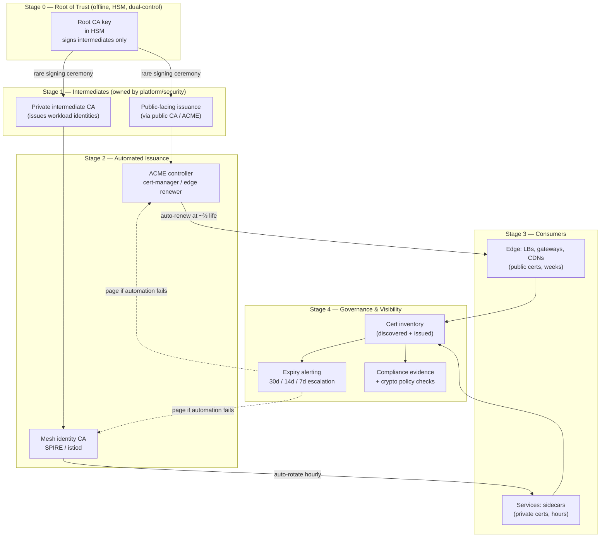

# TLS & HTTPS — Staff / Principal Level

At Staff level, TLS stops being a protocol you configure and becomes a *fleet-wide risk surface you own*. Nobody remembers the cipher suite that caused an outage. Everybody remembers the day the certificate expired, the site went dark for four hours, and the postmortem revealed that a spreadsheet — updated by an engineer who left eight months ago — was the entire renewal process. This document treats PKI as an organizational reliability program: certificate expiry as a recurring outage class, root-of-trust as a governance asset, mTLS as a migration you have to run, and crypto-agility as the property that lets you survive the next deprecation without a heroic weekend.

## Table of Contents

1. [Certificate Expiry as an Outage Class](#1-certificate-expiry-as-an-outage-class)
2. [Manual vs Automated Cert Management: The Risk Table](#2-manual-vs-automated-cert-management-the-risk-table)
3. [PKI Strategy: Public Edge vs Private Interior](#3-pki-strategy-public-edge-vs-private-interior)
4. [Root-of-Trust Ownership and Key Custody (HSMs)](#4-root-of-trust-ownership-and-key-custody-hsms)
5. [mTLS and Service Mesh as an Org Program](#5-mtls-and-service-mesh-as-an-org-program)
6. [Staged PKI & Rotation Governance](#6-staged-pki--rotation-governance)
7. [Crypto-Agility and Compliance](#7-crypto-agility-and-compliance)
8. [Making Cert Inventory and Expiry Visible Org-Wide](#8-making-cert-inventory-and-expiry-visible-org-wide)
9. [Staff Judgment Checklist](#9-staff-judgment-checklist)
10. [Next Step](#10-next-step)

---

## 1. Certificate Expiry as an Outage Class

Expired certificates are not a random category of incident — they are a *recurring class* with a predictable failure mode, a predictable blast radius, and a predictable root cause. The industry has an unbroken record of high-profile, multi-hour outages caused by a single certificate that nobody renewed: payment gateways, telecom voicemail, cloud consoles, streaming platforms, government portals. The pattern is always the same. A cert with a hard expiry timestamp, a renewal process that depended on a human remembering, and a human who did not.

Why does manual renewal *always eventually fail*? Because it is a Poisson process against human reliability. Each cert has an independent renewal event. With `N` certs and a per-event miss probability `p`, the probability that *at least one* is missed over a period trends toward 1 as `N` grows:

```
P(at least one miss) = 1 - (1 - p)^N
```

At `N = 500` certs and a generous `p = 0.002` per renewal, you still expect a miss roughly 63% of the time across the fleet's renewal cycles. Humans do not scale against independent recurring deadlines. Turnover erases institutional memory. Calendar reminders get snoozed. The one person who "owns TLS" goes on leave the week a wildcard expires. This is not a discipline problem you can train away — it is a systemic property.

The expiry outage is also uniquely nasty for three reasons:

- **It fails closed and total.** Unlike a slow degradation, an expired cert flips clients from "working" to "hard TLS error" instantly and globally. There is no graceful fallback; browsers and libraries refuse the handshake by design.
- **It fails at the worst layer.** Load balancers, API gateways, internal service edges, and database TLS all break at once if they share a cert or CA. A single expired *intermediate* CA cert can dark an entire product line.
- **It is invisible until it fires.** A cert that expires in 40 days looks identical to one that expires in 4 hours unless you are actively measuring remaining lifetime.

The Staff-level mandate is therefore not "renew certs carefully." It is: **eliminate the human from the renewal path, and make remaining lifetime a first-class, alerted metric.** Concretely — mandate ACME-based automated issuance/renewal (`Let's Encrypt`, `ZeroSSL`, ACME-capable private CAs) for everything that can use it, build a fleet inventory that no cert can escape, and alert on remaining-days *long* before expiry with escalating severity.

The CA/Browser Forum has been steadily shortening maximum public certificate lifetimes (from years, to 398 days, and on a published path toward ~47-day maximums). This is deliberate: shorter lifetimes force automation, because no organization can manually renew certs every few weeks. Read the trend as the industry removing your option to do this by hand. Design for it now.

## 2. Manual vs Automated Cert Management: The Risk Table

The business case for automation is not "it's tidier." It is a direct reduction in a known outage class, plus lower steady-state cost. Frame it in risk and dollars, because that is the language that gets it funded.

| Dimension | Manual (spreadsheet + calendar + human) | Automated (ACME / mesh CA / cert-manager) |
|---|---|---|
| **Renewal trigger** | Human memory, ticket, calendar reminder | Controller reconciles on a timer, renews at ~⅔ of lifetime |
| **Failure mode** | Silent miss → total outage at expiry | Renewal retries; alert only if automation itself fails |
| **Expiry-outage probability** | Grows toward 1 as fleet grows | Near-zero; failure requires the automation *and* alerting to break |
| **Scales to N certs** | No — labor is linear in N, reliability degrades | Yes — one controller handles thousands |
| **Feasible cert lifetime** | Long only (annual); short lifetimes impossible by hand | Short (days/weeks) — smaller key-compromise window |
| **Mean time to rotate on compromise** | Days (manual reissue across hosts) | Minutes (trigger reconcile / re-issue) |
| **Auditability** | Stale, out-of-band, trust-me | Declarative state; issuance logged, inventory queryable |
| **Key exposure** | Private keys copied to laptops, wikis, tickets | Keys generated in-place; never leave the node/HSM |
| **Cost profile** | Cheap per-cert, expensive per-incident (a 4-hr outage dwarfs a year of tooling) | Upfront platform cost, near-zero marginal cost per cert |
| **Bus factor** | The one person who "knows the process" | Codified, reviewable, on-call-transferable |
| **Compliance posture** | Evidence gathered manually before each audit | Continuous, exportable evidence |

The one honest counter-argument for manual: a *tiny* fleet (single-digit certs) with a mature team may run manually for a while. But that fleet grows, the team turns over, and the process rots. The Staff move is to build the paved road *before* you have 500 certs, not after the outage that proves you needed it.

## 3. PKI Strategy: Public Edge vs Private Interior

The single most clarifying architectural decision in enterprise PKI is drawing the line between the **public trust boundary** (anything a browser, mobile app, or third party validates) and the **private trust boundary** (service-to-service traffic inside your perimeter). They have different requirements, different CAs, and different owners.

**Public edge — use public CAs.** Anything terminating traffic from a device you do not control must present a cert chaining to a CA in the public root stores shipped by browsers and operating systems. You cannot make the world trust your homegrown root, and you should not try. Use public CAs via ACME for all internet-facing endpoints, CDNs, and public APIs. The trust anchor is owned by the CA and the root programs; your job is issuance automation and hostname coverage.

**Private interior — use a private/internal CA.** For mTLS between your own services, a public CA is the wrong tool: it costs money per cert, rate-limits you, publishes your internal hostnames to Certificate Transparency logs, and couples your internal rotation cadence to an external party. Instead, stand up an internal CA (`step-ca`, HashiCorp Vault PKI, AWS Private CA, or a mesh's built-in CA like Istio's `istiod` / Linkerd's identity) and distribute *your* root to *your* workloads. You own the root, the policy, the lifetime, and the revocation.

| Aspect | Public CA (edge) | Private CA (interior) |
|---|---|---|
| **Trust anchor** | Browser/OS root stores | Your own root, distributed to workloads |
| **Who validates** | External clients, browsers, partners | Your own services/sidecars |
| **CT log exposure** | Yes (hostnames public) | No |
| **Cost per cert** | Free (ACME) to paid | Compute + operational only |
| **Rotation cadence** | Bound by CA policy (short) | You choose (can be very short — hours) |
| **Revocation** | CRL/OCSP (weak in practice) | Short lifetimes + your own control plane |
| **Right for** | Ingress, public APIs, CDNs | mTLS, mesh, internal gRPC, DB TLS |

A common failure is using a public CA for internal service-to-service traffic "because it's easy." It works until you hit rate limits during a mass rotation, or a compliance reviewer asks why your internal service names are enumerable in public CT logs. Separate the domains from day one.

## 4. Root-of-Trust Ownership and Key Custody (HSMs)

Your private root CA key is the most sensitive secret in the company. Anyone who holds it can mint a valid identity for *any* internal service and impersonate it undetectably. That single key is worth more than most databases. Treat its custody accordingly.

**Root-of-trust ownership must be explicit.** Name the team that owns the root — usually platform/security engineering, not an application team. Ownership means: they hold the key material, they define issuance policy, they approve intermediate CAs, they run the audit. A root with no named owner is a root nobody rotates and everybody assumes someone else is watching.

**Never use the root directly.** The root CA signs a small number of **intermediate CAs** and then goes offline (or stays locked in an HSM used only for the rare intermediate-signing ceremony). Day-to-day issuance is done by intermediates. This limits blast radius: if an intermediate is compromised, you revoke *it* and re-issue under a fresh intermediate without burning the root and re-bootstrapping trust across every workload.

**Key custody belongs in an HSM.** Root and high-value intermediate private keys should be generated inside and never exported from a Hardware Security Module — cloud KMS/HSM (`AWS CloudHSM`, `GCP Cloud HSM`, `Azure Managed HSM`) or on-prem FIPS 140-2/3 devices for regulated environments. The HSM guarantees the key material cannot be copied out even by an operator; signing is done *inside* the boundary. For a private root this is not gold-plating — it is the difference between "revoke one cert" and "the entire internal trust fabric is potentially forged and we can't prove it isn't."

The signing ceremony for the root (and for issuing new intermediates) should be a documented, dual-control, audited procedure — multiple authorized operators, recorded, offline network, quorum to access the HSM. This is the one place in PKI where deliberate, human, *manual* process is correct: it happens rarely, it is high-stakes, and speed is irrelevant.

## 5. mTLS and Service Mesh as an Org Program

Mutual TLS — where both client and server present certificates — is how you get authenticated, encrypted service-to-service identity at scale. Adopting it fleet-wide is not a config flag; it is a multi-quarter program with an owner, a migration path, and an ongoing operational burden. The naïve "just turn on mTLS" fails because every service now needs a cert, those certs need constant rotation, and a rotation bug takes down internal traffic just like an expiry does.

**Who runs the CA.** The mesh needs an identity control plane that issues short-lived workload certs (SPIFFE/SPIRE identities, or a mesh's built-in issuer). This is a platform-owned service, on the critical path of *all* internal traffic — treat its availability like a tier-0 dependency. If the CA control plane is down and certs expire before it recovers, internal traffic breaks. Design for CA high availability and for cert lifetimes long enough to survive a control-plane blip.

**Rotation cadence.** The whole point of mesh identity is *short-lived* certs — often hours to a day — rotated automatically by the sidecar/agent. Short lifetimes make revocation almost irrelevant (a compromised key is useless in hours) and force the rotation machinery to be exercised constantly, so it never bit-rots. Contrast with edge certs measured in weeks; interior certs can be measured in hours precisely because rotation is fully automated and continuously proven.

**The migration path is the hard part.** You cannot flip mTLS on globally. The staged path:

1. **Deploy sidecars in permissive mode** — accept both plaintext and mTLS, so nothing breaks while proxies roll out.
2. **Achieve full mesh coverage** — every service has an identity and a sidecar; measure the percentage of traffic already flowing over mTLS.
3. **Enforce per-namespace/service** — flip to strict mode where coverage is 100%, service by service, watching error budgets.
4. **Global strict** — reject non-mTLS traffic fleet-wide; permissive mode becomes a violation, not a default.

**The operational burden is real and permanent.** New failure modes appear: clock skew rejecting valid certs, trust-bundle propagation lag when you rotate the CA, sidecar CPU/latency overhead, debugging "connection refused" that is actually an identity mismatch. Budget for it. The payoff — cryptographic service identity, encryption-in-transit everywhere, and a foundation for zero-trust authorization — is worth it, but only if the org signs up for the ongoing cost, not just the launch.

## 6. Staged PKI & Rotation Governance

The following shows the full trust hierarchy and the automated rotation loop that keeps the fleet from ever reaching an expiry outage. Note where humans belong (rare, dual-control root ceremonies) and where they must never be (routine renewal).



Governance decisions that must be *written down and owned*, not left implicit:

- **Rotation cadence per tier.** Edge: bound by public CA policy (renew well before the deadline). Interior/mesh: short (hours–day). Root: only when policy or compromise demands, via ceremony.
- **Who can request a cert / identity.** Issuance policy scoped so an application team cannot mint an identity for a service it does not own.
- **What "renew early" means.** Automation renews at a fraction of lifetime (e.g., ⅔), leaving a wide buffer so a transient failure has many retries before expiry.
- **Escalation on automation failure.** The alert that matters most is not "cert expired" — it is "renewal has failed twice and expiry is in 14 days." That is the signal a human is needed, while there is still ample time.

## 7. Crypto-Agility and Compliance

**Crypto-agility** is the organizational capability to change cryptographic primitives — protocol versions, cipher suites, key algorithms, CAs — *quickly and without a heroic project*. It is the property you wish you had the day a primitive is deprecated or broken. You build it before you need it, because the alternative is a fire drill under a compliance or vulnerability deadline.

**Deprecating TLS 1.0 / 1.1.** These are dead: forbidden by PCI-DSS, distrusted by browsers, and removed from major libraries. If you cannot answer "what percentage of our traffic is still on TLS 1.0/1.1 and which clients?" you lack the visibility to deprecate safely. The agile org has already instrumented protocol version at the edge, can identify laggard clients, and can flip minimums per endpoint. TLS 1.2 is the floor; TLS 1.3 is the target (faster handshake, forward secrecy mandatory, weak options removed).

**Post-quantum readiness.** A sufficiently large quantum computer would break today's key-exchange (RSA, classical ECDH) — and "harvest now, decrypt later" means adversaries may be recording encrypted traffic today to decrypt once that capability exists. The pragmatic path is **hybrid key exchange** (a classical curve *combined with* a post-quantum KEM such as ML-KEM / Kyber, standardized as `X25519MLKEM768`), already shipping in major browsers and TLS stacks. You do not need to migrate tomorrow, but you need the *agility* to adopt hybrid key exchange when your stack supports it — which again means centralized control over cipher/curve configuration, not per-service snowflakes.

**Compliance as a forcing function.** PCI-DSS mandates strong crypto and prohibits known-weak protocols/ciphers. FedRAMP requires FIPS 140-validated cryptographic modules (which constrains your HSM, libraries, and cipher choices). SOC 2 and ISO 27001 expect documented key management and rotation. These are not obstacles — they are leverage. "We need this to keep our FedRAMP authorization" funds the crypto-agility program that also happens to prevent your next outage. The Staff move is to satisfy compliance *as a byproduct* of good centralized crypto governance, so an audit is an export, not a scramble.

The through-line: agility requires **centralization of crypto policy**. If every service hardcodes its own cipher list and TLS minimum, you cannot move the fleet. If policy lives in the mesh, the edge config, and the CA, you change it in one place and reconcile everywhere.

## 8. Making Cert Inventory and Expiry Visible Org-Wide

You cannot manage what you cannot see, and the certs that cause outages are precisely the ones nobody knew existed — the forgotten internal service, the vendor appliance, the cert someone hand-installed on a VM two reorgs ago. **Discovery is as important as issuance.** Certs enter the fleet through paths your automation does not control, so inventory must be built from *observation*, not just from your issuer's records.

Two complementary sources feed a single inventory:

- **Issued** — every cert your ACME controllers and mesh CA hand out, recorded declaratively. This covers the paved road.
- **Discovered** — active scanning of your own IP space, load balancers, internal endpoints, and Certificate Transparency logs (for public certs issued under your domains, including ones issued *without* your process — a shadow-IT and mis-issuance signal). This catches everything off the paved road.

Reconcile the two. Anything *discovered but not issued* by your automation is a risk: an un-managed cert that will expire manually. The goal is to shrink that set to zero — every cert either flows through automation or is on a tracked exception with an owner and a deadline.

**Expiry must be a metric, dashboarded and alerted.** Export `cert_expiry_seconds` (remaining lifetime) per cert to your metrics system, tagged with owner/team/environment. Then:

- **Dashboard** the fleet's expiry distribution — a single view where any cert dropping toward the danger zone is obvious, sortable by remaining days and owning team.
- **Alert with escalating severity** — informational at 30 days, warning at 14, page at 7, and a distinct high-severity alert if *automated renewal has failed* (the actionable signal). Tie each alert to the owning team, not a central "TLS person," so ownership is distributed and the bus factor is high.
- **Attribute every cert to a team.** An expiry alert with no owner is an outage waiting for the on-call to guess. Ownership tags turn "someone's cert is expiring" into "*your* cert is expiring."

The organizational win is cultural as much as technical: when expiry is visible on a dashboard every team sees, and alerts route to the owning team, certificate expiry stops being a surprise. It becomes routine, boring, and — most importantly — handled by machines with humans as the escalation path, not the primary mechanism.

## 9. Staff Judgment Checklist

- **Treat expiry as an outage class, not a task.** The correct target is zero human involvement in routine renewal; humans are the escalation path when automation fails, with days of buffer.
- **Mandate ACME/automation before the fleet is large.** Build the paved road ahead of the outage that would justify it. Short public-cert lifetimes are coming whether you automate or not.
- **Separate public edge from private interior.** Public CAs for anything a browser validates; your own HSM-rooted private CA for service-to-service. Never leak internal hostnames to CT logs.
- **Own the root explicitly, custody it in an HSM, use intermediates for daily work.** The root is the crown jewel; the one place manual, dual-control ceremony is correct.
- **Run mTLS as a program, not a flag.** Permissive → coverage → per-service strict → global strict. Budget for the permanent operational burden; the mesh CA is a tier-0 dependency.
- **Build crypto-agility now.** Centralize crypto policy so you can deprecate TLS 1.0/1.1, raise minimums, and adopt hybrid post-quantum key exchange without a per-service migration.
- **Make compliance a byproduct.** PCI/FedRAMP requirements should fall out of good governance, exportable on demand.
- **Inventory by discovery, not just issuance.** Reconcile discovered-vs-issued, drive un-managed certs to zero, dashboard expiry, and route alerts to owning teams.

The organizations that never make headlines for a cert-expiry outage are not the ones with more disciplined engineers. They are the ones who took the human out of the loop, made every cert visible with a named owner, and treated their internal trust fabric as infrastructure worth an HSM and a program — not a spreadsheet.

## 10. Next Step

You now have the organizational frame: PKI as risk, expiry as an outage class, mTLS as a program, and crypto-agility as survival. The interview material tests whether you can reason through these trade-offs under pressure — the failure modes, the migration sequencing, and the "why not just X" pushback.

*Next step:* [Interview questions](interview.md)
