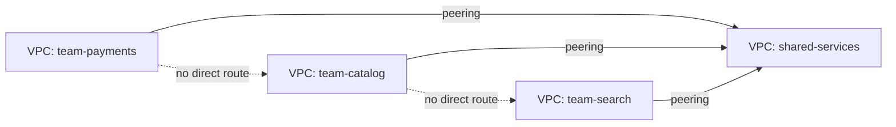

# Cloud Network Architecture (VPC) — Senior

<!-- level-focus -->
At senior level, focus on this question:

> As an organization moves from one application VPC to several VPCs that need to reach each other, what invariants must the network design hold onto to keep isolation and blast radius meaningful, and what evidence would reveal that the design is quietly failing before an incident forces the answer?

Use the smallest realistic scenario that exposes the decision and its failure behavior.

---

## Core Concept 1 — Invariants That Must Survive Growth

A single-VPC design (the middle-level scenario) has boundaries that are easy to reason about because everything is in one place. The moment a second VPC enters the picture — a second product, an acquired team, a separate environment that must talk to a shared service — some invariants have to be stated explicitly, because nothing in the platform enforces them automatically:

- **No transitive trust through peering.** VPC peering connections are point-to-point and non-transitive: if VPC A peers with VPC B, and VPC B peers with VPC C, A cannot reach C through B unless a separate A–C peering connection exists. Teams that assume transitivity design a mesh they think is fully connected and it silently isn't — the fix is not "add more peering connections everywhere," it's deciding on purpose whether the topology should be a full mesh, a hub, or partial.
- **No CIDR overlap between anything that might ever need to route to each other.** Two VPCs with overlapping CIDR blocks (both `10.0.0.0/16`, say) cannot be peered at all without an application-level workaround, because a route to an overlapping range is ambiguous. This invariant has to be protected *before* VPCs are created, not fixed after, because re-addressing a live VPC's CIDR is disruptive.
- **The most sensitive tier never gains a new path to the internet as a side effect of a routing change made for an unrelated reason.** A route table edit intended to let a new VPC reach a shared service subnet must not, as a side effect, put a route to that subnet in a route table that also has an internet gateway route — because that would expose the shared service to the internet through the new VPC's edge.
- **Every account/VPC boundary that claims to be a security boundary must actually block traffic, not just organize billing.** It's easy to create separate VPCs per environment (dev/staging/prod) for organizational clarity while leaving broad peering or a shared transit gateway route table that lets dev reach prod's database. The invariant is: an environment boundary that's supposed to be a security boundary needs its routing and security groups audited as if it were one, not assumed safe because it's a separate VPC.

## Core Concept 2 — Peering vs. Transit Gateway: A Real Architectural Trade-off

| | VPC Peering | Transit Gateway (or equivalent hub) |
|---|---|---|
| Topology | Point-to-point, non-transitive | Hub-and-spoke, transitive across attached VPCs |
| Scaling to N VPCs | O(N²) connections for full mesh | O(N) attachments |
| Centralized routing control | No — each peering pair manages its own routes | Yes — route tables live on the hub, one place to audit |
| Cross-region | Supported, but still non-transitive | Supported, often with a single hub design |
| Cost model | No hourly charge for the connection itself, data-transfer charges apply | Hourly charge per attachment plus data processing, in addition to data-transfer charges |
| Right fit | A handful of VPCs with stable, well-known relationships | A growing number of VPCs, especially with a "shared services" VPC (logging, CI runners, identity) everyone needs to reach |

The senior-level judgment isn't "transit gateway is more modern, always use it." A two-VPC relationship that will very likely stay a two-VPC relationship is well served by a simple peering connection — introducing a hub for two nodes adds an attachment cost and a new component to operate for no topological benefit. The trade-off flips once a third VPC needs to reach both of the first two: that's the point where peering's O(N²) growth and non-transitivity start costing more (in connections to individually reason about) than a hub's centralized route table costs in hourly fees.

The diagram above is the failure mode made visible: `team-payments` and `team-catalog` both peer with `shared-services`, but that does not connect them to each other — the dotted lines don't exist as routes. If `team-payments` genuinely needs to reach `team-catalog` directly, that requires its own peering connection or a move to a transit gateway; assuming the shared VPC provides that path is exactly the non-transitivity mistake from Core Concept 1.

## Core Concept 3 — Failure Modes and Recovery

| Failure mode | How it manifests | Recovery / mitigation |
|---|---|---|
| CIDR overlap discovered late | Two VPCs that must be connected (post-acquisition, or a new shared-services rollout) can't be peered without re-addressing one of them | Central IP address planning *before* VPC creation is the real fix; after the fact, options are limited to re-IP'ing (disruptive) or routing through a NAT-translation layer |
| NAT gateway AZ failure | All outbound traffic from private subnets in that AZ (patching, external API calls) stops, while the rest of the region is fine | One NAT gateway per AZ (from the middle-level pattern) contains the failure to a single AZ instead of the whole region |
| Route table drift from manual changes | A route added by hand during an incident (e.g., a temporary internet-gateway route for emergency debugging) never gets removed, quietly widening a boundary | Route tables should be managed by infrastructure-as-code with drift detection, so manual changes are visible and reversible, not silent |
| Security group or NACL rule sprawl | Years of "just allow this one more thing" rules accumulate; nobody can say confidently what a boundary actually permits anymore | Periodic audit against the *intended* boundary (what should this tier be reachable from) rather than the *actual* rule set, plus automated policy checks (for example, a rule that flags any security group allowing inbound 22/3389 from `0.0.0.0/0`) |
| Peering mesh becomes unmanageable | N VPCs need pairwise connectivity; the number of peering connections and route table entries to audit grows quadratically | Migrate the shared-connectivity portion of the mesh to a transit gateway, keeping point-to-point peering only for the handful of relationships that are genuinely two-party |

## Core Concept 4 — Evidence, Not Preference

A senior-level design decision should be checkable against something observable, not just "this feels more secure":

- **VPC Flow Logs** (or the equivalent traffic-metadata log for your provider) reveal what traffic actually flows across a boundary, which is the ground truth for whether a security group or NACL rule is still needed, over-permissive, or under-permissive. A rule nobody's traffic has matched in months is a candidate for removal; traffic hitting a boundary and getting rejected in a way that shouldn't be happening is a candidate for investigation.
- **Reachability analysis** (path-tracing tools that answer "can resource X reach resource Y on port Z, and through which hops") turns "we believe this is isolated" into a checkable claim, and can be run against the deployed configuration without generating real traffic.
- **Infrastructure-as-code diffs** on route tables, security groups, and peering/transit-gateway attachments are the audit trail for *why* a boundary changed, which manual console changes don't provide.
- **CIDR allocation records** (even a simple central spreadsheet or an IP address management tool) are the evidence that prevents the overlap failure mode — checked at VPC-creation time, not discovered at peering time.

## Realistic Cross-Component Scenario

Two previously separate product lines, `payments` (VPC `10.0.0.0/16`) and `catalog` (VPC `10.1.0.0/16`), both need to reach a newly built `shared-logging` VPC. `payments` and `catalog` do not need to reach each other. A third VPC, `search` (VPC `10.0.0.0/16` — chosen independently by a different team, and it overlaps `payments`), is slated to join within the quarter.

The senior-level design questions this scenario forces:

1. **Peering or transit gateway for the logging relationship?** Two spokes today, a third on the way, and "more spokes eventually" is a near-certainty for shared logging — this is exactly the profile that favors a transit gateway over building two peering connections now and unwinding them later.
2. **What do we do about `search`'s CIDR collision with `payments`?** This has to be resolved before `search` can attach to the same hub as `payments` — either `search` gets re-addressed before it's attached to anything else (cheapest time to fix it), or it stays isolated, which likely isn't acceptable long-term.
3. **Does the transit gateway route table give `payments` and `catalog` a path to each other by accident?** A hub's route table must be scoped per-attachment (route table associations and propagations) so that spokes which shouldn't talk to each other don't get a route just because they both attach to the same hub — this is the "does an environment boundary actually block traffic" invariant from Core Concept 1, applied to a real hub design.

## Questions That Expose Weak Assumptions Before Implementation

- If this VPC's CIDR needs to double next year, is there contiguous address space to grow into, or will growth require a second, non-contiguous block?
- If two of these VPCs are peered today, what happens the day a third VPC needs to reach both — has anyone decided whether that's a peering-mesh future or a transit-gateway migration?
- Who owns the shared-services or transit-gateway account, and what is the process for another team to request an attachment or a new CIDR allocation?
- If someone adds a manual route table entry during a production incident, is there a mechanism that will surface and eventually revert that change, or does it silently become permanent?

## Apply it

1. For a scenario with three VPCs — `orders` (`10.0.0.0/16`), `inventory` (`10.1.0.0/16`), and a new `shared-observability` VPC that both must send logs and metrics to — decide and justify whether to use VPC peering or a transit gateway, given that a fourth VPC is expected to join within six months.
2. Write out the CIDR blocks you'd assign to avoid overlap for all three (plus headroom for the fourth), and state the rule you're following to avoid collisions.
3. Identify one failure mode from the Core Concept 3 table that applies most directly to this scenario, and write two sentences on how you would detect it before it causes an incident.
4. Draft the route-table-scoping requirement (in words, not a config file) that ensures `orders` and `inventory` do not gain a path to each other purely because they both attach to `shared-observability`'s hub.
5. Write the one question from the list above that you would ask first in a design review for this scenario, and explain in one sentence why it's the highest-leverage question to ask before anything is built.

## Verify your work

- Your peering-vs-transit-gateway decision explicitly accounts for the fourth VPC joining within six months, not just the current three.
- Your CIDR assignments have no overlapping ranges and you can state the allocation rule (e.g., "each VPC gets a distinct /16 from a reserved /8 block") in one sentence.
- Your chosen failure mode and detection method are specific to this scenario (naming the actual VPCs or resources involved), not a generic restatement of the table.
- Your route-table-scoping answer correctly identifies that hub attachment alone does not imply mutual reachability, and states what would have to be true for `orders` and `inventory` to reach each other.

## Review questions

- Why is VPC peering non-transitive, and what design mistake does assuming transitivity lead to?
- What invariant does CIDR planning protect, and why is it much cheaper to enforce before VPC creation than after?
- At what point does a transit gateway become a better fit than a growing mesh of point-to-point peering connections, and why?
- What evidence would tell you a security group or NACL rule set has drifted from the boundary it was originally meant to enforce?
