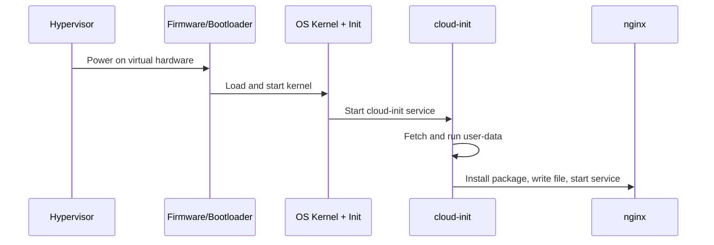

# Virtual Machine — Junior

<!-- level-focus -->
At junior level, focus on this question:

> Given a base VM image and a small bootstrap script, can you launch a running instance, watch it boot into a working service, and explain what each stage of that boot did?

Use the smallest realistic scenario that exposes the decision and its failure behavior.

---

## Core Concept 1 — Vocabulary: Hypervisor, Image, Instance, Snapshot

Five words get used loosely. Keep them apart:

- **Hypervisor** — the layer of software (or firmware) that creates and runs virtual machines on top of physical hardware. It presents each VM with virtualized CPU, memory, disk, and network devices, and enforces the boundary between VMs sharing the same physical host. Examples: KVM, Xen, VMware ESXi — and the managed hypervisors behind AWS EC2, Google Compute Engine, and Azure VMs.
- **VM image** — a file (or set of files) containing a full disk: a bootloader, an operating system kernel, and a root filesystem. A cloud provider's public image catalog (an AWS AMI, a GCP image, an Azure managed image) is a library of these, ready to boot.
- **Instance** — a running VM, booted from an image. The image is the template; the instance is the live, addressable thing with its own IP, its own disk state, its own running processes.
- **Snapshot** — a point-in-time copy of an instance's disk. Snapshots back up running state and can themselves be turned into new images.
- **cloud-init** — the near-universal first-boot agent that reads provider-supplied metadata (a "user-data" script or YAML document) and runs it once, early in boot, before anything else on the machine gets a chance to run. It is how you configure a freshly booted instance without building a custom image for every variation.

The relationship in one line: **a hypervisor runs instances booted from images, an instance's disk can be snapshotted, and cloud-init is what turns a generic image into your specific, working machine on first boot.**

## Core Concept 2 — What a Hypervisor Isolates, Compared to a Container

A VM and a container both give a process something that looks like its own machine, but they draw the isolation boundary at a different layer, and that difference has concrete consequences you can measure.

| | Virtual machine | Container |
|---|---|---|
| Isolation boundary | Hardware-level — each VM has its own virtualized kernel, its own kernel memory, enforced by the hypervisor | OS-level — containers on the same host share one kernel, isolated by namespaces and cgroups |
| What runs inside | A full OS: its own kernel, init system, drivers | Just the application and its userspace dependencies; the kernel is borrowed from the host |
| Typical boot/start time | Tens of seconds (boots a full kernel, runs init, then cloud-init) | Under a second to a few seconds (starts a process in existing namespaces) |
| Density per physical host | Lower — each VM's kernel and OS overhead cost real memory and CPU | Higher — many containers share one kernel's overhead |
| Blast radius of a kernel-level compromise | Contained to that one VM by the hypervisor boundary | A kernel exploit can potentially cross container boundaries on the same host |

Nothing here makes one universally "better" — it explains why a VM is the right unit when you need a strong, hardware-enforced isolation boundary or a specific full OS underneath a workload, and why a container is the right unit when you need many identical, fast-starting, densely packed instances of the same application. Later levels build the decision framework; at junior level, the point is simply to know which boundary you are looking at when someone says "instance" and which one when they say "container."

## Core Concept 3 — Anatomy of Launching a VM: Image Plus Bootstrap

A minimal, realistic launch has two inputs: a base image, and a bootstrap script the platform hands to cloud-init. Here is a cloud-init user-data document that turns a stock Ubuntu 22.04 image into a machine serving a web page:

```yaml
#cloud-config
package_update: true
packages:
  - nginx
write_files:
  - path: /var/www/html/index.html
    content: |
      <html><body>hello from cloud-init</body></html>
runcmd:
  - systemctl enable nginx
  - systemctl start nginx
```

Read it top to bottom the way cloud-init executes it:

| Directive | What it does |
|---|---|
| `package_update: true` | Refreshes the package index before installing anything |
| `packages: [nginx]` | Installs the nginx package using the distribution's package manager |
| `write_files` | Writes a file to an exact path with exact content, before `runcmd` executes |
| `runcmd` | Runs shell commands, in order, after packages and files are in place |

Launching an instance from this is one command against a cloud provider's API or CLI:

```bash
aws ec2 run-instances \
  --image-id ami-0abcd1234efgh5678 \
  --instance-type t3.micro \
  --user-data file://bootstrap.yaml \
  --key-name my-keypair \
  --tag-specifications 'ResourceType=instance,Tags=[{Key=Name,Value=hello-vm}]'
```

The image (`ami-...`) supplies the OS; the user-data file supplies what makes this particular instance yours. Change the user-data and relaunch, and you get a differently configured machine from the exact same base image — you never touched the image itself.

## Core Concept 4 — The Boot Sequence You Can Observe

A VM's boot is a real sequence with real, checkable stages, not a black box:



Two logs make this sequence visible after the fact rather than something you have to trust blindly:

```bash
# Confirm the instance is running and get its public address
aws ec2 describe-instances --instance-ids i-0123456789abcdef0 \
  --query 'Reservations[0].Instances[0].[State.Name,PublicIpAddress]'

# SSH in and read cloud-init's own record of what it did
ssh ubuntu@<public-ip> 'cloud-init status --wait; sudo tail -50 /var/log/cloud-init-output.log'
```

`cloud-init status --wait` blocks until first-boot configuration finishes and reports `done` or `error`; `/var/log/cloud-init-output.log` shows the actual stdout/stderr of every `runcmd` step, in order — the single most useful file for a junior engineer debugging "the VM came up but the service isn't there."

## Common Mistakes

1. **Confusing the image with the instance.** Editing a running instance's files by hand and expecting a *new* instance launched from the same image to have that change. The image is the frozen template; changes made after boot live only on that one instance's disk unless you snapshot and re-image it.

2. **Forgetting user-data only runs on first boot.** Rebooting an existing instance does not re-run cloud-init's `runcmd` steps by default. Expecting a change to `bootstrap.yaml` to take effect on an already-running instance is a common source of "I updated the script but nothing changed."

3. **Not checking `cloud-init status` before assuming failure.** A service that isn't reachable a few seconds after `run-instances` returns is often still mid-boot — a VM's start time is measured in tens of seconds, not milliseconds, because it boots a real kernel before cloud-init even starts.

4. **Skipping the log when something silently fails.** A typo in a package name or a `runcmd` command that exits non-zero often leaves the VM "running" with no obvious external symptom besides "the service just isn't there" — `/var/log/cloud-init-output.log` shows exactly which step failed and why.

5. **Using an oversized instance type by default.** Picking a large instance type "to be safe" for a workload that a `t3.micro` or equivalent burstable small instance handles fine wastes budget with no benefit; right-sizing is revisited more rigorously at middle level, but even at junior level, starting from the smallest instance type that plausibly fits the workload and measuring is the correct default.

6. **Leaving test instances running.** Unlike a container that exits and frees resources when stopped, a VM instance keeps being billed and keeps existing until explicitly stopped or terminated — forgetting to `terminate-instances` after an exercise is the most common way to leave a stray cost behind.

## Apply it

1. Pick any cloud provider's free or lowest-cost small instance type and a current LTS Linux base image (for example, Ubuntu 22.04 or Amazon Linux 2023).
2. Write a cloud-init user-data document that installs a web server and writes a static HTML page containing your name, following the structure in Core Concept 3.
3. Launch one instance from the base image with your user-data attached, using the smallest instance type available.
4. Once the instance shows `running`, SSH in, run `cloud-init status --wait`, and confirm it reports `done`. If it reports `error`, read `/var/log/cloud-init-output.log` and fix the failing step.
5. Curl the instance's public IP from outside the machine and confirm you get back the exact HTML you wrote — then terminate the instance.

## Verify your work

- `cloud-init status --wait` reports `done`, not `error`, after connecting to the instance.
- `curl http://<public-ip>/` (or the equivalent port) returns the exact content you wrote in `write_files`, not a default web server page.
- `/var/log/cloud-init-output.log` shows every `runcmd` step you wrote executing with no non-zero exit visible in the output.
- You can point to the specific line in the boot sequence (Core Concept 4) where a failure would have shown up if a package name had been misspelled.
- The instance is terminated when you're done, confirmed by `describe-instances` showing its state as `terminated` or the instance no longer listed as running.

## Review questions

- What is the difference between a VM image and a running instance?
- Why does rebooting an existing VM not re-run the cloud-init script that configured it originally?
- Why does a VM typically take tens of seconds to become reachable while a container starts in under a second?
- Where would you look first if an instance shows as `running` but the service you configured isn't responding?
