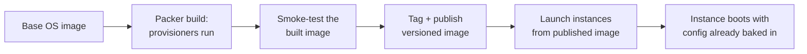

# Virtual Machine — Middle

<!-- level-focus -->
At middle level, focus on this question:

> When a workload's isolation, licensing, or driver needs put it in tension with a container-first platform, how do you decide whether it actually belongs on a VM, and how do you turn that decision into a versioned, reproducible image instead of a hand-configured snowflake instance?

Use the smallest realistic scenario that exposes the decision and its failure behavior.

---

## Core Concept 1 — The VM-or-Container Decision, as a Real Evaluation

At junior level the isolation-boundary table (hypervisor vs. namespaces) explains *what* differs. At middle level the job is deciding, for a specific workload, which boundary it needs — and that decision should be made against concrete criteria, not habit or whichever platform the team already knows best.

| Criterion | Points toward VM | Points toward container |
|---|---|---|
| Kernel-level requirement | Needs a specific kernel version/module, custom kernel parameters, or a different OS than the host fleet runs | Runs fine on whatever kernel the container host provides |
| Licensing | Per-core or per-socket licensed software (some commercial databases, some enterprise software) that is priced or supported around a dedicated machine boundary | Open licensing, or licensing indifferent to the hosting boundary |
| Specialized hardware | Needs GPU passthrough, an FPGA, or another device best exposed at the hypervisor level with full driver control | Needs no specialized device, or the platform's device-passthrough for containers already covers it |
| Compliance boundary | A regulatory or contractual requirement demands hardware-level tenant isolation, not shared-kernel isolation | Shared-kernel isolation is acceptable for the workload's data sensitivity |
| Density and elasticity | Workload is long-running, singular, and doesn't need to scale to many identical replicas quickly | Workload benefits from starting many identical, fast, densely packed instances |
| Team familiarity and existing tooling | The workload is a third-party appliance shipped only as a VM image | The team already owns Dockerfiles, a registry, and orchestration for this class of workload |

None of these alone is decisive; the decision is the sum. A batch machine-learning training job needing full GPU passthrough and a specific CUDA-compatible kernel module is a strong VM case even though it's a single Python process — the constraint is the driver, not the application. A stateless HTTP API with no special hardware or licensing needs is a weak VM case even if "we already have EC2 automation" — familiarity is the weakest criterion on this list and should not outvote the others.

## Core Concept 2 — A Golden-Image Pipeline, Not a Hand-Configured Instance

The junior-level workflow — boot a stock image, bootstrap it with cloud-init — is fine for a one-off exercise. It stops being maintainable the moment more than one instance needs to exist with the same configuration, because cloud-init reruns nothing after first boot: every instance drifts independently from that point on, and there is no single artifact you can point to and say "this is what version 12 of our web-tier VM looked like."

A **golden image** fixes this by moving configuration out of "what happens after boot" and into "what is baked into the image before anything boots." Packer is the standard tool for this:

```hcl
# web-tier.pkr.hcl
source "amazon-ebs" "web_tier" {
  ami_name      = "web-tier-{{timestamp}}"
  instance_type = "t3.micro"
  region        = "us-east-1"
  source_ami_filter {
    filters = {
      name = "ubuntu/images/*ubuntu-jammy-22.04-amd64-server-*"
    }
    owners      = ["099720109477"]
    most_recent = true
  }
  ssh_username = "ubuntu"
}

build {
  sources = ["source.amazon-ebs.web_tier"]

  provisioner "shell" {
    script = "provision-nginx.sh"
  }

  provisioner "shell" {
    inline = ["sudo apt-get -y upgrade", "sudo cloud-init clean"]
  }
}
```

The pipeline this belongs to, end to end:



Two consequences follow directly from this shape. First, every instance launched from image version 12 is identical by construction — there is no "it worked on the instance I hand-configured last Tuesday" drift, because nothing is configured after the image is built except environment-specific values (an instance's own hostname, secrets pulled at boot, its position in a load balancer). Second, rolling out a change means building and publishing a *new* image version and replacing instances, not SSHing into existing ones — which is the same "replace, don't mutate" discipline that makes containers reliable, applied one layer down the stack.

## Core Concept 3 — Sizing Is a Decision With a Change Cost, Not a Default

Picking an instance type is not a one-time guess to get "safely large enough." It has a measurable change cost that differs sharply by direction:

- **Resizing an existing instance** (changing its instance type) typically requires stopping it, which is real downtime for anything not behind a load balancer with spare capacity — unlike a container's resource requests, which a scheduler can often adjust or reschedule without the same all-or-nothing stop.
- **Over-provisioning by default** ("give it an `m5.2xlarge` to be safe") has a real, recurring cost with no corresponding benefit if the workload never approaches that ceiling — VMs are billed for the instance type regardless of utilization, so slack capacity is pure waste, not a free safety margin.
- **Under-provisioning** shows up as a specific, checkable symptom, not a vague "it feels slow": CPU steal time on burstable instance families, memory pressure triggering the OOM killer, or disk I/O throttling on a network-attached volume once its baseline IOPS allowance is exhausted.

The testable middle-level practice is to size from a load test against the actual workload — start from the smallest plausible instance type, run a representative load, and watch CPU/memory/disk-IOPS metrics for the specific ceiling that gets hit first, then move up exactly one size and re-test. This is slower than guessing "large," but it produces a sizing decision backed by evidence instead of preference, and it is cheap to repeat the next time the workload's shape changes.

## Core Concept 4 — Verification at Two Levels

**Image build level (unit-equivalent):** the Packer build itself should fail closed. A provisioner script that exits non-zero should fail the build before an image is ever published:

```bash
packer build web-tier.pkr.hcl
# Build succeeds only if every provisioner exits 0; a failed
# provisioner aborts before an AMI is registered.
```

Add an explicit smoke test as its own provisioner step, run against the instance Packer is building, before it's converted into a published image:

```bash
#!/usr/bin/env bash
set -euo pipefail
systemctl is-active --quiet nginx
curl -sf http://localhost/health | grep -q '"status":"ok"'
```

**Integrated-flow level:** launching a real instance from the *published* image and exercising it exactly as junior-level Core Concept 4 does — `cloud-init status --wait`, then an external `curl` — still matters, because the smoke test above ran on the instance Packer built, which is not always byte-identical to what a fresh launch produces (an AMI registration step, a differently sized root volume, or a security group difference can all change behavior between "the instance Packer tested" and "the instance a team actually launches"). Treat the Packer-build smoke test as catching build-time regressions early and cheaply, and the fresh-launch check as the one that actually proves the published artifact works.

## Core Concept 5 — Under- and Over-Application Signals

The over-application signal is reaching for a VM out of habit for a workload that has none of the Core Concept 1 criteria in its favor — a stateless service with no licensing or driver constraint, deployed as a hand-launched instance because "that's how we've always done it," while the rest of the platform has moved to containers. This quietly recreates configuration drift and slow, all-or-nothing deploys for a workload that didn't need either.

The under-application signal is the opposite: forcing a workload with a real VM-level requirement into a container anyway, and then fighting the platform to get there — privileged containers with broad host access to reach a device the platform doesn't cleanly pass through, or elaborate sidecar workarounds for a licensing boundary that a VM would have satisfied directly. When a workload needs constant special-casing to fit the container platform, that recurring cost is itself evidence for revisiting Core Concept 1's table, not a sign to keep pushing harder on the container-first default.

## Core Concept 6 — Incremental Adoption

Moving a fleet of hand-configured snowflake VMs to a golden-image pipeline in one pass is unnecessary risk on infrastructure other teams already depend on. A workable order:

1. Pick one instance class (the web tier is a good first candidate — stateless, well understood, has an existing health check) and write a Packer template that reproduces its *current* configuration, without changing anything about it yet.
2. Build the image, launch one instance from it side by side with an existing hand-configured instance, and diff their configuration and behavior until they match.
3. Route a small fraction of traffic to instances launched from the golden image, watch it under real load, then cut the rest over.
4. Only after one instance class has round-tripped safely through the pipeline, extend it to the next — each new class validates the pipeline mechanics independently of any given service's specifics.

## Common Mistakes

- **Treating "we already have VM automation" as a sufficient reason to keep a workload on VMs.** Familiarity is real but is the weakest criterion in Core Concept 1's table — it should not outweigh a clear container-first case.
- **Publishing an image without a smoke test in the build itself.** A build that only checks "did every command exit 0" can still publish an image where the service it configured never actually starts.
- **Resizing production instances without a load-tested basis.** Picking a bigger instance type because an incident felt CPU-bound, without confirming CPU was actually the bottleneck, wastes money on a size increase that doesn't address the real ceiling.
- **Letting instances launched from a golden image drift after boot.** If engineers still SSH in and hand-patch running instances "just this once," the golden image stops being the source of truth and the fleet regresses to snowflakes with extra steps.
- **Skipping the fresh-launch integrated check because the Packer build's own smoke test passed.** The environment the image was built in and the environment it's launched into are not guaranteed identical.

## Apply it

1. Take a workload you control that currently boots from a stock image plus a cloud-init script, and write a Packer template that bakes the same configuration directly into a new image instead.
2. Add a smoke-test provisioner to the Packer build that fails the build if the service isn't active and its health endpoint doesn't return the expected response.
3. Build the image, then launch a fresh instance from the *published* result and run the same external health check against it — confirm it passes independently of the build-time smoke test.
4. Pick one workload from your own environment and run it through Core Concept 1's table explicitly, writing down which criteria point toward VM and which toward container, and what your conclusion is.
5. For one running instance, run a load test at its current size, identify the first metric that hits a ceiling (CPU steal, memory pressure, or disk IOPS), and decide — with that evidence — whether to resize up, down, or leave it as is.

## Verify your work

- The Packer build fails (non-zero exit, no image registered) when you deliberately break the smoke-test provisioner.
- A freshly launched instance from the published image passes the same external health check the smoke test checks internally, without any post-boot manual configuration.
- You can point to the specific criterion in Core Concept 1's table that drove your VM-or-container conclusion for the workload you evaluated, not just a preference.
- Your sizing decision is backed by a named metric and its observed ceiling (CPU steal time, memory pressure, or IOPS throttling), not a guess.
- Two instances launched from the same image version are configuration-identical when diffed, with no drift introduced by manual post-boot changes.

## Review questions

- Why is "the team already has VM tooling" the weakest criterion when deciding whether a workload belongs on a VM or in a container?
- What specific problem does a golden-image pipeline solve that a cloud-init script applied at first boot does not?
- Why can a Packer build's own smoke test pass while a freshly launched instance from the published image still fails?
- What concrete, measurable signal should drive an instance-sizing decision, and what does it look like to make that decision without one?
