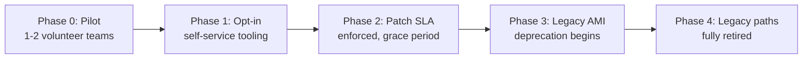

# Virtual Machine — Professional

<!-- level-focus -->
At professional level, focus on this question:

> When you're standing up an organization-wide VM image governance program across dozens of independently owned teams, how do you decompose the rollout into increments that let teams keep shipping while central ownership and patch SLAs take hold, and what evidence tells you the program is working rather than just adding process?

Use the smallest realistic scenario that exposes the decision and its failure behavior.

---

## Core Concept 1 — Splitting Ownership So No Team Carries VM Internals They Don't Need

At senior level, the golden-image pipeline is one team's architecture problem. At professional level, that pipeline has to serve dozens of teams who should not each need to understand hypervisor isolation, Packer provisioners, or CVE-scanning tooling just to run a VM. The ownership split has to be explicit:

| Concern | Owner | Why here |
|---|---|---|
| Base layer (OS, hardening, monitoring agent, patch cadence) | Central platform team | One team absorbing kernel-CVE response and compliance baselines once is far cheaper than forty teams each doing it independently and inconsistently |
| Build pipeline and tooling (Packer templates, scanning, canary automation) | Central platform team | The mechanics of "how an image gets built and validated" are infrastructure, not a workload concern |
| Workload-specific image layer (what a service needs on top of the base) | Workload team | Only the workload team knows what their service actually requires; centralizing this would make the platform team a bottleneck for every application-level change |
| Instance fleet operation for their service | Workload team | The team running the service is the team who should feel its operational cost and act on its alerts |
| Patch SLA and deprecation timeline | Central platform team, negotiated with workload teams | An SLA only works as a shared contract, not something declared unilaterally and discovered by surprise |

The design principle underneath this split is cognitive load: a workload team should be able to say "we need Redis and this config file" and get a working image, without needing to know what a CIS benchmark is or how the base layer's kernel gets patched. That's the platform team's job, offered as a paved path, not a mandate that requires everyone to become an infrastructure expert first.

## Core Concept 2 — Decomposing the Rollout Into Reversible, Observable Increments

Migrating forty teams' worth of hand-managed VM fleets onto a centrally governed golden-image platform in one cutover is exactly the kind of initiative that fails quietly for months before anyone can say why. The professional-level discipline is defining phases in advance, each with its own entry criteria, exit criteria, and rollback option:

| Phase | Entry criteria | Exit criteria (evidence, not calendar date) | Rollback if it stalls |
|---|---|---|---|
| 0 — Pilot | Platform team has a working base layer and build pipeline | Pilot teams' fleets run on golden images with zero drift incidents for a defined observation window | Pause; fix pipeline gaps the pilot exposed before inviting more teams |
| 1 — Opt-in | Pilot succeeded; self-service docs and extension points exist | A meaningful share of teams have adopted voluntarily, with platform-team ticket volume per adopting team trending down, not up | Slow invitation pace; address whichever friction is driving low voluntary adoption |
| 2 — SLA enforced | Adoption broad enough that the SLA is meaningful, not aspirational | Fleet-wide patch compliance within SLA window, measured, not assumed | Extend the grace period for teams with a documented blocker rather than penalizing them |
| 3 — Legacy deprecation | SLA phase stable; remaining hand-managed fleets identified and small in number | Remaining legacy instances are a known, shrinking, individually tracked list | Extend the deprecation window for any team with a real dependency, rather than forcing a break |

Each phase's exit criterion is a measured condition, not a date on a roadmap — a phase that hasn't produced its evidence yet isn't done, regardless of how long it's been running. This is what keeps the rollout reversible: at any point, the answer to "should we proceed to the next phase" is answerable from data already being collected, not from a sense that enough time has passed.

## Core Concept 3 — Migration, Governance, and Coordination Risks

**Migration risk.** Forty teams' existing hand-managed fleets did not fail before; they worked, however informally. A migration that breaks a team's existing deploy workflow to get them onto the new platform trades a known-working process for an unproven one, on the platform team's timeline rather than the workload team's. The mitigation is a parallel-run period: a team's legacy fleet keeps running exactly as before while its new golden-image fleet is validated independently, and cutover happens only once the new fleet has demonstrated equivalent behavior under real traffic — never as a same-day replace-and-hope.

**Governance and compliance risk.** A patch SLA tied to a compliance framework (an internal security policy, or an external audit requirement) is only credible if it's actually measured and actually enforced — a documented SLA that nobody checks compliance against is worse than no SLA, because it creates false confidence for whoever relies on it during an audit or an incident review. This means the fleet-age and drift audits from senior-level design (Core Concept 2 and 6 of the senior guide) have to exist as a running, reported metric before the SLA is treated as real, not introduced after the fact to backfill a claim already made.

**Coordination risk: the platform team becoming a bottleneck.** The single most common way this kind of program fails is subtle — not open rejection, but every workload-specific customization requiring a ticket to the platform team, so teams queue behind a small central team for changes they should be able to make themselves. The structural fix is a documented, self-service extension contract: a clear, tested way for a workload team to add their own layer on top of the base image without platform-team involvement for anything that doesn't touch the base layer itself. If teams are still filing tickets for routine workload-layer changes a few months into Phase 1, that ticket volume is itself the signal the extension contract is incomplete — not a signal to hire more platform engineers to keep up with the queue.

## Core Concept 4 — Outcome Measures and Evidence-Based Exit Conditions

A program like this needs measures the organization actually tracks, not ones stated once in a kickoff document and never revisited:

- **Share of fleet-instance-hours running on golden images versus hand-managed instances** — the core adoption metric; it should move in one direction as phases progress, and a stall is a signal worth investigating rather than waiting out.
- **Mean time to patch a fleet-wide critical vulnerability, end to end** — from disclosure to every instance running the patched image version, across the whole governed fleet. This is the number that actually justifies the program's existence; a governance program that hasn't measurably shortened this compared to the pre-program baseline hasn't yet earned its coordination cost.
- **Ticket volume per adopting team, over time** — a rising trend per team is the earliest signal of the bottleneck risk in Core Concept 3, well before it shows up as open frustration.
- **Number of remaining hand-managed instances, tracked individually** — not a vague "most teams have migrated," but a specific, shrinking, named list, so Phase 3 exit criteria are checkable rather than asserted.
- **Drift and age-audit findings, fleet-wide** — the same invariant-checking practice from senior-level design, rolled up organization-wide, so "is this actually working" has a real answer independent of anecdote.

Each of these needs a baseline captured *before* the program starts — patch time under the old, decentralized process, for instance — because "faster than before" is only demonstrable against a number that was actually measured beforehand, not one estimated after the fact to make the program look successful.

## Core Concept 5 — Cross-Team Contracts and Accountability

The relationship between the platform team and every workload team is a two-way contract, not a one-way mandate, and both directions need to be explicit:

- **The platform team commits to:** a defined patch SLA for the base layer, a documented and tested self-service extension path, advance notice before any base-layer change that could break dependent images, and a deprecation window long enough for a workload team to migrate deliberately rather than scramble.
- **Workload teams commit to:** keeping their workload-specific image layer building against a current, supported base-layer version within the deprecation window, using the self-service extension path rather than requesting platform-team exceptions for routine changes, and reporting drift or fleet age findings rather than letting them accumulate silently.

When a workload team genuinely cannot meet the SLA — a legacy dependency that can't be rebuilt against the current base layer yet — the contract needs an explicit escalation and extension process, not a silent exception nobody tracks. An extension that's negotiated, time-boxed, and recorded keeps the overall program's compliance picture honest; an untracked exception quietly turns the "fleet-wide patch compliance" metric from Core Concept 4 into a number nobody can actually trust.

## A Sustained-Delivery Scenario Across Quarters

The rollout above is not a single project with a single delivery date — it's sustained delivery across quarters, and the plan itself has to adapt as evidence comes in:

1. **Quarter 1 (Phase 0):** two volunteer teams pilot the golden-image pipeline. The pilot surfaces that teams need a documented way to add a workload-specific package without filing a ticket — the self-service extension contract from Core Concept 3 didn't exist yet in a usable form. Phase 1 does not begin until this gap is closed, even though the calendar quarter has ended.
2. **Quarter 2 (Phase 1):** opt-in adoption opens broadly. Ticket volume per adopting team is watched weekly; a rising trend for three consecutive weeks in one org unit triggers a direct investigation rather than waiting for a quarterly review — the metric is checked on a cadence tight enough to catch the bottleneck risk while it's still small.
3. **Quarter 3 (Phase 2):** the patch SLA is enforced for teams that have adopted, with a grace period for the remainder. Mean-time-to-patch is measured against the Quarter 0 baseline for the first time — the program's actual value becomes a real, comparable number instead of an assumption.
4. **Quarter 4 (Phase 3):** legacy deprecation begins for the shrinking, individually tracked list of hand-managed fleets, each with its own negotiated migration timeline rather than a single organization-wide deadline.

The plan changing between quarters — pausing Phase 1 to fix the extension contract, tightening the ticket-volume review cadence — is not the program failing; it's the evidence-based exit condition from Core Concept 2 doing exactly what it's for. A plan that proceeded on schedule regardless of what the metrics showed would be the actual failure mode here.

## Common Mistakes

- **Setting a calendar-based rollout schedule instead of evidence-based exit conditions.** A phase that "should be done by now" but hasn't produced its exit evidence is not done, and proceeding anyway defers the real risk instead of resolving it.
- **Measuring adoption only in aggregate.** An organization-wide adoption percentage can hide a bottleneck concentrated in a few teams whose ticket volume is quietly climbing.
- **Introducing the patch SLA before the self-service extension contract exists.** Enforcing a compliance timeline on teams who still have to file a ticket for routine changes guarantees the platform team becomes the bottleneck the SLA depends on not existing.
- **Treating an unmet SLA as a violation to penalize rather than a signal to investigate.** A team missing the SLA because of an untracked legacy dependency needs a negotiated extension process, not punishment that pushes the exception further underground.
- **Not capturing a pre-program baseline.** Without a measured "before" number for patch time or adoption, the program's own success claim later is unverifiable.

## Apply it

1. For an organization (real or realistic) with multiple teams running VM fleets independently, write the ownership-split table from Core Concept 1 explicitly — what the central platform team owns versus what each workload team owns.
2. Define the phased rollout from Core Concept 2 with a concrete, measurable exit criterion for each phase — not a target date, a condition you could check against real data.
3. Design the self-service extension contract from Core Concept 3: what, specifically, can a workload team change about their image without a platform-team ticket, and what requires one.
4. Pick two of the outcome measures from Core Concept 4, and define exactly how each would be measured and what the pre-program baseline would need to be, before the program starts.
5. Write the two-way contract from Core Concept 5 as a short document: what the platform team commits to, what workload teams commit to, and what the escalation path is when a team can't meet the SLA.

## Verify your work

- Every phase in your rollout plan has an exit criterion stated as a measurable condition, not a date.
- Your ownership-split table assigns every concern to exactly one owner, with no concern implicitly shared or unassigned.
- Your self-service extension contract would let a workload team make a routine workload-layer change without a platform-team ticket, verified by walking through a concrete example change.
- You can name the pre-program baseline for at least one outcome measure, and explain how you'd get it before rollout starts.
- Your escalation path for an unmet SLA produces a tracked, time-boxed extension, not a silent, unrecorded exception.

## Review questions

- Why does enforcing a patch SLA before a self-service extension path exists tend to make the platform team the bottleneck it's trying to avoid?
- Why is a calendar-based phase schedule a weaker design than an evidence-based exit condition for each phase?
- What risk does an unmeasured, untracked SLA exception create that a negotiated, time-boxed extension does not?
- Why does a rising per-team ticket volume matter more than a stable organization-wide adoption percentage?
