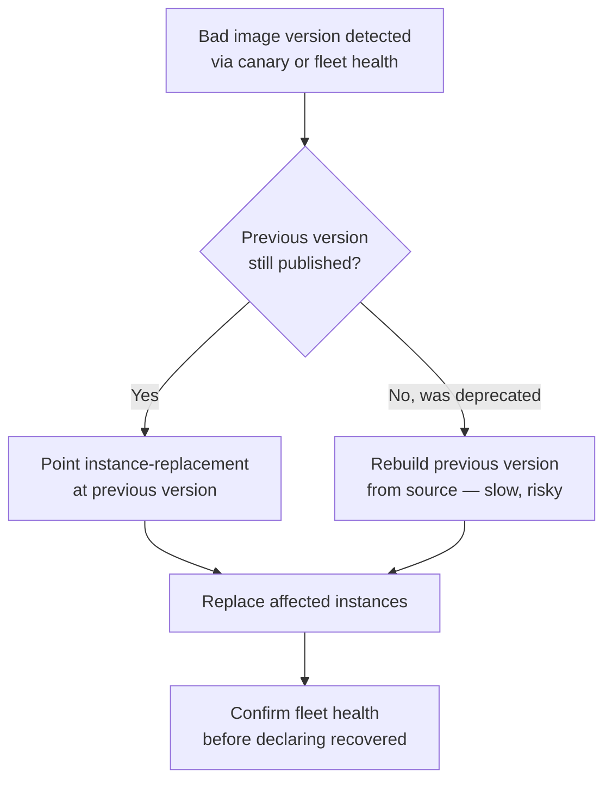

# Virtual Machine — Senior

<!-- level-focus -->
At senior level, focus on this question:

> When a fleet of VMs must keep running for years while the base image underneath it evolves, what invariants does the image-and-instance lifecycle have to hold, and what evidence would tell you the design is safe before you bet a production rollout on it?

Use the smallest realistic scenario that exposes the decision and its failure behavior.

---

## Core Concept 1 — Drawing the VM Platform's Boundary

A VM fleet sits between several systems that senior-level design has to keep cleanly separated, because conflating them is where most fleet-wide incidents start:

- **Image build and versioning** — owned by the VM platform itself: what goes into a golden image, how it's versioned, how it's tested before publish.
- **Instance provisioning** — owned by infrastructure-as-code (Terraform, CloudFormation, or equivalent): which instance type, how many, in which subnet, from which image version. The VM platform publishes image versions; IaC decides which version a given environment consumes and when.
- **Instance replacement at runtime** — owned by an autoscaling group or equivalent fleet manager: replacing an unhealthy instance, or rolling a fleet from one image version to the next.
- **Placement across physical hosts** — owned by the hypervisor/cloud scheduler, largely invisible to the platform team except through the failure modes it produces (Core Concept 3).

The senior-level discipline is refusing to let these blur. A common failure pattern is a team that builds image versioning logic *into* their Terraform (string-matching AMI names, for instance) instead of treating "the current recommended image version" as a boundary the image pipeline publishes and IaC simply consumes as an input. That coupling means every image update requires a Terraform change reviewed and applied by whoever owns the IaC repo, turning what should be an image-pipeline concern into a cross-team dependency for every patch.

## Core Concept 2 — The Invariants a Fleet Depends On

Three invariants make a VM fleet reasoned-about rather than merely running:

1. **Every running instance is traceable to an exact image version and build provenance.** Given any instance ID, you can answer "which image version, built from which commit, with which provisioners, at what time" without guessing. Without this, a fleet-wide incident investigation starts with "we don't actually know what's running."
2. **No instance is ever mutated in place as the mechanism for change.** Configuration changes happen by building a new image version and replacing instances, never by SSHing into a running fleet and patching it live. The moment "just SSH in and fix it" becomes an accepted change path, the traceability invariant above silently breaks — the running instance no longer matches any image version that exists.
3. **No instance exceeds a maximum age without explicit justification.** An instance running an image version old enough to predate the last several security patch cycles is itself a finding, independent of whether anything has gone wrong yet — this is what turns patching from a reactive scramble into a bounded, routine process.

These invariants matter most exactly when they're inconvenient — under incident pressure, when hand-patching a live instance feels faster than rebuilding and replacing it. Holding them under that pressure, and having a recovery path fast enough that the temptation doesn't arise, is the actual senior-level responsibility; stating them is the easy part.

## Core Concept 3 — Failure Modes Specific to the VM Boundary

| Failure mode | Why it's different from the container case | What limits the blast radius |
|---|---|---|
| A bad image version rolled out fleet-wide | VM instance replacement is slower per-instance than container replacement (a VM reboot/replace is measured in tens of seconds to minutes versus sub-second container restarts), so a bad rollout stays partially deployed longer, widening the window where some instances run the bad version and others don't | Canary a small instance count first, gate the wider rollout on canary health, keep the previous image version launchable without rebuilding it |
| Physical host failure | A single physical host runs many VMs at once; its failure takes all of them down simultaneously, not gradually | Spread the fleet across multiple host-failure domains (availability zones, placement groups) so no single host failure removes the whole fleet's capacity at once |
| Noisy-neighbor resource contention | Two VMs on the same physical host with a hypervisor that doesn't fully isolate CPU cache or I/O bandwidth can each affect the other's performance without either being individually overloaded | Instance types and hosting models with stronger resource guarantees (dedicated instances, reserved capacity) where the workload's tail latency actually depends on it |
| Drift between an instance's live state and its image version | An instance whose disk was hand-patched now silently diverges from what its image version claims to represent | Alert on instances whose uptime or file-hash fingerprint indicates in-place modification since boot; treat any detected drift as a finding requiring replacement, not remediation in place |

None of these are exotic — they're the direct, predictable consequence of the isolation boundary discussed at junior and middle level (a whole kernel and OS per instance, scheduled onto shared physical hardware) showing up as operational risk rather than as a definition.

## Core Concept 4 — Recovery: What Rolling Back Actually Requires

Rolling back a bad image version is only fast if the previous version was never made unlaunchable. The recovery path that senior-level design has to guarantee in advance:

The branch that matters is the one senior-level design should make structurally impossible: deprecating an image version immediately once a newer one ships, leaving no fast path back if the new version turns out to be broken. Retaining the last several published versions, each independently launchable without a rebuild, is what keeps recovery a replacement operation instead of a rebuild-under-pressure.

## Core Concept 5 — Evolution: Image Lineage Over Years, Not One Rollout

A fleet's base image does not stay static, and treating each rebuild as an isolated event loses the ability to reason about what changed between any two points in time. A workable lineage:

- A **common base layer** (OS, security baseline, monitoring agent, standard hardening) is rebuilt on a fixed cadence — for example, whenever a new base OS security patch set ships — and versioned independently of any specific workload.
- **Workload-specific images** build from a pinned version of the base layer, adding only what that workload needs, the same way a container image builds `FROM` a pinned base rather than `FROM latest`.
- A **deprecation policy** with a defined window (for example, a base layer version stays launchable for a fixed number of patch cycles after a newer one ships) gives teams pinned to an older version enough runway to migrate deliberately, rather than discovering their image was deleted out from under them.

The failure this structure prevents is a workload image that was built once, years ago, against a base layer version nobody remembers, that nobody can safely rebuild because the base layer that specific image depended on no longer exists anywhere. That is the VM-fleet equivalent of an undocumented, unreproducible production dependency, and it is exactly what versioned, retained base layers are for.

## Core Concept 6 — Evidence That Validates the Design, Not Preference

A senior-level design decision here is backed by observable evidence, gathered before it's trusted with production traffic:

- **Canary boot success rate** — launch a small number of instances from a new image version in a real environment and confirm they reach a healthy state, before any wider rollout begins.
- **Boot-time regression tracking** — a new image version that takes measurably longer to reach a healthy state than the previous one is a real signal (a provisioner change, a new package, a slower initialization step), not something to dismiss as noise.
- **Vulnerability scan results on the built image, before publish** — a scan step in the build pipeline that fails the build (or at minimum flags it loudly) on a newly introduced high-severity finding is what turns "we think our images are patched" into a checked claim.
- **Chaos/failure-injection results** — deliberately terminating a fraction of a fleet's instances and confirming automated replacement restores capacity within an expected window is evidence the recovery path in Core Concept 4 actually works, not just that it was designed to.
- **Fleet-wide age and drift audits** — a periodic report of every instance's age and whether its live state matches its claimed image version turns the invariants in Core Concept 2 into something checked on a schedule, not asserted once and forgotten.

## Core Concept 7 — A Cross-Component Scenario: A Kernel CVE Lands

A critical kernel CVE is disclosed, affecting the base OS six independently owned services build their VM images from. The architecture built above determines whether this is a routine, bounded response or a fire drill:

1. The base layer is rebuilt with the patched kernel, versioned, and run through its own build-time vulnerability scan and canary boot check — this step touches nothing service-specific.
2. Each of the six workload-specific images rebuilds against the new base layer version — because they were pinned to a base version rather than tracking "latest" implicitly, this is a mechanical, parallelizable step per service, not six independent investigations into what changed.
3. Each service canaries a small instance count from its rebuilt image, watching the same health signals Core Concept 6 defines, before its fleet-wide replacement begins.
4. Instance replacement proceeds fleet by fleet, gated on each canary's health — a service whose canary shows a regression halts its own rollout without blocking the other five.
5. A fleet-wide audit afterward confirms no instance anywhere is still running the pre-patch base layer, closing the loop on the age invariant from Core Concept 2 rather than assuming the rollout succeeded because no one complained.

The reason this stays bounded is entirely upstream design: pinned base-layer versions made "rebuild everyone" mechanical instead of exploratory, retained previous versions made each service's rollout independently reversible, and a defined health signal made "safe to proceed" a checked fact instead of a guess.

## Trade-offs Among Plausible Approaches

| Approach | When it's the right call | What it costs |
|---|---|---|
| Fully immutable fleet, image-replace for every change | Fleet is large enough, or change frequent enough, that build-and-replace tooling pays for itself; strong compliance/audit requirements | Upfront investment in a build pipeline and replacement automation; slower to apply an urgent one-line config fix than SSH would be |
| Long-lived "pet" VMs with in-place patching | A small number of specialized, low-change-frequency instances (an internal appliance, a single legacy system) where building full image tooling isn't worth it yet | Traceability and the "no in-place mutation" invariant are given up deliberately; drift risk is accepted, not eliminated |
| Shared base layer across all workload images | Many services share the same OS/security baseline and patch cadence | A base layer bug or regression affects every dependent image at once — requires the canary-and-gate discipline in Core Concept 7 to contain |
| Fully independent images per service, no shared base | Workloads have genuinely divergent OS or patching requirements | Every security patch becomes N independent rebuilds instead of one shared rebuild plus N mechanical dependent rebuilds |

None of these is categorically correct; each is a defensible choice for a specific fleet size, change frequency, and compliance posture. What is not defensible is picking one implicitly, by accretion, without having asked which trade-off the fleet is actually making.

## Questions That Would Expose a Weak Assumption Here

- Given any running instance right now, can you actually name its image version and build provenance, or would answering that require guessing?
- If the image version published an hour ago turns out to be broken, is the previous version still launchable without a rebuild, right now?
- Does any instance in this fleet exist that nobody could safely rebuild today, because the base layer it depends on is gone?
- Is there a documented, faster-than-rebuild path to recovery that doesn't involve someone SSHing into a live instance under pressure?

## Common Mistakes

- **Letting IaC encode image-selection logic instead of consuming a published version.** This turns every image update into a cross-team IaC change instead of an image-pipeline concern.
- **Deprecating an old image version the moment a new one ships.** This removes the fast rollback path exactly when it's most likely to be needed.
- **Treating a shared base layer as a convenience without the canary discipline to match.** A shared base layer's whole value — patch once, apply everywhere — is also its whole risk, and skipping per-service canaries turns a shared efficiency into a shared blast radius.
- **Auditing fleet age and drift only after an incident.** These are exactly the invariants that are cheap to check on a schedule and expensive to discover are already broken during an incident.
- **Confusing "we haven't had an incident" with "the recovery path works."** Without a chaos/failure-injection test, an untested rollback path is a hypothesis, not a verified capability.

## Apply it

1. For a VM fleet you have access to (or a realistic one you design on paper), write down, for any given instance, whether you could currently answer "which image version, built from what, when" without guessing — if not, identify the missing piece of provenance tracking.
2. Design the base-layer/workload-image lineage described in Core Concept 5 for a fleet with at least three dependent services sharing one base layer, including an explicit deprecation window.
3. Walk through the Core Concept 7 scenario for your design: a critical base-layer CVE lands — write out each step your architecture would actually take, and where it would stall if a piece (pinning, canary health signal, retained previous version) were missing.
4. Pick one invariant from Core Concept 2 and design a scheduled audit that would catch a violation of it within a bounded time window, not only during an incident.
5. Run a small-scale version of the chaos check in Core Concept 6: terminate one instance in a test fleet and time how long automated replacement takes to restore capacity, then compare that time against what an incident response would actually tolerate.

## Verify your work

- You can answer, for any instance in your fleet or design, its exact image version and build provenance without guessing.
- Your design retains at least the previous published image version in an independently launchable state at all times.
- Walking through the CVE scenario in Core Concept 7 against your design produces a bounded, mechanical sequence of steps, not an open-ended investigation.
- A scheduled audit in your design would surface an aged or drifted instance before an incident does, not only after.
- Your chaos-test timing result is a real number you measured, not an assumed one.

## Review questions

- Why does deprecating an old image version immediately after a new one ships remove the fastest available rollback path?
- Why does a shared base layer across services multiply the value of a canary check rather than make it optional?
- What specific evidence distinguishes "this recovery path works" from "we haven't needed it yet"?
- Why does coupling image-version selection into IaC logic turn a routine patch into a cross-team change?
