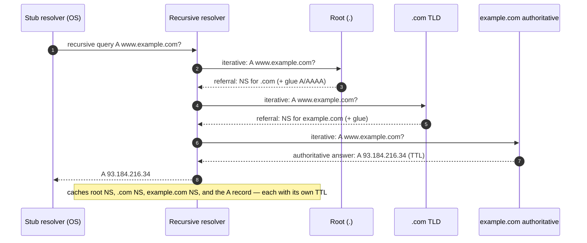

# DNS Resolution Flow — Interview

A staged bank of senior-level interview questions on how a name becomes an IP address — the recursive/authoritative split, the root→TLD→authoritative walk, glue, the 512-byte truncation cliff and EDNS0, DNSSEC's effect on the flow, cold-vs-warm latency, and two open-ended design/debug scenarios. Answers favor exact mechanics and arithmetic over hand-waving.

## Table of Contents

1. [Q1: Recursive vs iterative resolution](#q1-what-is-the-difference-between-recursive-and-iterative-resolution)
2. [Q2: Full resolution walk for a cold cache](#q2-walk-me-through-resolving-wwwexamplecom-from-a-completely-cold-cache)
3. [Q3: Core mechanics recap table](#q3-give-me-a-one-screen-recap-of-the-actors-and-record-types-involved)
4. [Q4: What are glue records and why are they needed](#q4-what-are-glue-records-and-why-are-they-necessary)
5. [Q5: Root and TLD servers — who runs them, how are they found](#q5-there-are-13-root-server-addresses--is-the-internet-limited-to-13-machines)
6. [Q6: The 512-byte limit and EDNS0](#q6-why-does-the-512-byte-udp-limit-matter-and-what-is-edns0)
7. [Q7: Truncation, TC bit, and TCP fallback](#q7-what-happens-when-a-response-does-not-fit-walk-the-tc-bit-path)
8. [Q8: How caching and TTL shape the flow](#q8-how-do-ttls-and-negative-caching-change-what-actually-hits-the-network)
9. [Q9: DNSSEC's effect on the resolution flow](#q9-how-does-dnssec-change-the-resolution-flow)
10. [Q10: Cold vs warm latency budget](#q10-put-numbers-on-cold-vs-warm-resolution-latency)
11. [Q11: CNAME chains and their cost](#q11-what-does-a-cname-chain-cost-during-resolution)
12. [Q12: 0x20, source-port randomization, cache poisoning](#q12-what-defenses-live-in-the-resolution-flow-against-cache-poisoning)
13. [Q13: Scenario — design a recursive resolver](#q13-scenario-design-a-recursive-resolver-for-a-large-mobile-app-backend)
14. [Q14: Scenario — debug slow DNS](#q14-scenario-users-report-the-app-is-slow-and-you-suspect-dns-how-do-you-debug)
15. [Q15: DoH/DoT and where encryption sits in the flow](#q15-where-do-doh-and-dot-sit-in-the-flow-and-what-do-they-change)
16. [Q16: Anycast and how it changes "which server answers"](#q16-how-does-anycast-change-which-server-answers-and-why-does-it-help)

---

## Q1: What is the difference between recursive and iterative resolution?

> These are two *modes* used in the same lookup, by different actors. A **stub resolver** (the OS library on the client) asks its configured **recursive resolver** a single *recursive* query: "give me the final answer for `www.example.com`, do whatever it takes." The recursive resolver then does *iterative* resolution against the server hierarchy: it queries a root server, which does **not** recurse but *refers* it to the `.com` TLD servers; it queries a TLD server, which refers it to `example.com`'s authoritative servers; it queries an authoritative server, which returns the answer. Iterative = "here's a referral, go ask them yourself." Recursive = "I'll chase the whole chain for you and hand back the final record."
>
> The asymmetry is deliberate: root and TLD servers serve enormous fan-in and cannot afford to hold per-client state or chase referrals — so they only ever refer. The recursive resolver absorbs that work and, crucially, the caching, so the hierarchy above it stays cheap.

## Q2: Walk me through resolving `www.example.com` from a completely cold cache.

> Reading the name **right to left** (root is the empty label after the final dot), the recursive resolver walks down the tree, caching each answer:



> Key points an interviewer wants to hear: (1) the resolver already knows the **root server addresses** from a bundled *root hints* file, so step 2 needs no bootstrap lookup; (2) each referral comes back as `NS` records plus, when the nameserver name is *in-bailiwick*, **glue** `A`/`AAAA` records so you don't need a side lookup to reach it; (3) every hop's answer is cached under its TTL, so the second visitor to `.com` skips the root, and the second visitor to `example.com` skips both root and TLD. The cold path is 4 round trips from the resolver's perspective; the warm path is 1 (stub→resolver→cache).

## Q3: Give me a one-screen recap of the actors and record types involved.

> | Actor | Role | Recurses? | Holds state / cache? | Typical count |
> |---|---|---|---|---|
> | Stub resolver | OS library (`getaddrinfo`) | Asks recursively | Small OS cache | 1 per host |
> | Recursive resolver | Does the iterative walk | No (it *drives* iteration) | Yes — the big cache | 1 per network / public (8.8.8.8, 1.1.1.1) |
> | Root server | Refers to TLD | No — refers only | No per-query state | 13 addresses, anycast |
> | TLD server | Refers to authoritative | No — refers only | No per-query state | per TLD |
> | Authoritative server | Holds the zone, gives the answer | No — answers | Serves zone data | per domain |
>
> | Record | Purpose in the flow |
> |---|---|
> | `NS` | Delegation — names the servers authoritative for a zone (the "referral") |
> | `A` / `AAAA` | The actual IPv4 / IPv6 address answer, and the glue for `NS` targets |
> | `SOA` | Zone apex metadata; its `MINIMUM` field sets the **negative-cache** TTL |
> | `CNAME` | Alias — restarts resolution at the canonical name |
> | `DS` / `DNSKEY` / `RRSIG` | DNSSEC: delegation signer, signing keys, signatures |
> | `OPT` (pseudo-record) | EDNS0 — advertises larger UDP buffer, flags, extensions |

## Q4: What are glue records and why are they necessary?

> Glue solves a **circular dependency**. Suppose `example.com`'s nameserver is `ns1.example.com`. The `.com` TLD server, when delegating, says "ask `ns1.example.com`" — but to reach `ns1.example.com` you'd need to resolve *inside* `example.com`, which is exactly the zone you're trying to reach. You can't resolve the nameserver's address using the very zone it serves. So the parent zone (`.com`) stores the `A`/`AAAA` records for `ns1.example.com` as **glue** alongside the `NS` delegation and returns them in the *additional* section of the referral, breaking the cycle.
>
> Glue is only needed for **in-bailiwick** nameservers (the NS name lives under the delegated zone). If `example.com` uses `ns1.cloudflare.com`, no glue is required — the resolver resolves `ns1.cloudflare.com` through the normal `.com`→`cloudflare.com` path, which doesn't depend on `example.com`. A subtle interview follow-up: glue records are **not authoritative** in the parent — they're a convenience copy, and the authoritative zone's own `A` records are the source of truth. Stale glue is a classic cause of "I updated my nameserver IP but it's still broken."

## Q5: There are 13 root server addresses — is the internet limited to 13 machines?

> No. There are **13 root server *identities*** (`a.root-servers.net` through `m.root-servers.net`), a number capped historically so a full root referral fits in a 512-byte UDP packet. But each identity is served by **anycast**: hundreds of physical instances worldwide advertise the same IP, and routing sends you to the topologically nearest one. So "13" is 13 *addresses*, backed by 1,500+ actual servers.
>
> The resolver learns these 13 addresses from a **root hints** file shipped with the resolver software. Root hints are only a bootstrap: on startup the resolver queries a hinted root for the *current* `NS` set of `.` (a priming query) and caches the authoritative answer. The same "well-known bootstrap → refers down" pattern repeats: roots refer to TLDs, TLDs refer to authoritatives.

## Q6: Why does the 512-byte UDP limit matter, and what is EDNS0?

> Classic DNS over UDP (RFC 1035) caps a message at **512 bytes**. That was fine in 1987 but is far too small today: a referral with many `NS` records plus IPv4 and IPv6 glue, or any DNSSEC-signed response (which carries bulky `RRSIG` and `DNSKEY` records), routinely exceeds 512 bytes. Without a fix, every such response would truncate and force a slow TCP retry.
>
> **EDNS0** (RFC 6891) is the escape hatch. The resolver includes a pseudo-`OPT` record in its query that advertises a larger acceptable UDP payload — commonly **1232 bytes** (a modern, fragmentation-safe default) up to 4096 (older default). It also carries extended flags like the **DO bit** ("DNSSEC OK — send me signatures") and extensions like Client Subnet. Without EDNS0, DNSSEC is effectively unusable because signed responses can't fit. So EDNS0 is the enabling layer for both large modern referrals and the entire DNSSEC flow — that's why the detail matters, not for its own sake but because it gates everything that made DNS bigger than 1987 assumed.

## Q7: What happens when a response does not fit? Walk the TC bit path.

> If a server can't fit the answer within the client's advertised UDP buffer, it sends back a response with the **TC (truncated) flag set** and (typically) an empty or partial answer. On seeing `TC=1`, the resolver **retries the same query over TCP** (port 53), where DNS messages are length-prefixed and can be arbitrarily large. This costs an extra round trip *plus* a TCP handshake — so it's a latency and load hit you want to avoid.
>
> ```mermaid
> stateDiagram-v2
>     [*] --> UDP_query
>     UDP_query --> Fits: response ≤ buffer
>     UDP_query --> Truncated: response > buffer (TC=1)
>     Fits --> [*]: done, 1 RTT
>     Truncated --> TCP_retry: reopen over TCP:53
>     TCP_retry --> [*]: done, +handshake +RTT
> ```
>
> The modern mitigation is: advertise a **sane EDNS0 buffer (~1232)** so most responses fit UDP without risking IP fragmentation (fragmented UDP is dropped by many middleboxes and is a cache-poisoning vector), and accept TCP fallback only for the genuinely large responses. Around 2020, resolver and authoritative operators coordinated "DNS Flag Day 2020" to standardize the 1232-byte default precisely to reduce both truncation *and* fragmentation.

## Q8: How do TTLs and negative caching change what actually hits the network?

> The whole hierarchy survives only because most queries never leave the recursive resolver. Every positive answer carries a **TTL**; the resolver serves it from cache until it expires. Critically, the *referrals* are cached too — root `NS` (TTLs of days), TLD `NS`, and zone `NS` — so a resolver that has been up for minutes almost never talks to a root or TLD server. That's why root traffic is a tiny fraction of global DNS despite every name "starting" at the root.
>
> **Negative caching** (RFC 2308) caches *absence*: an `NXDOMAIN` or empty answer is cached for the duration of the zone's `SOA MINIMUM` field (bounded by the SOA record's own TTL). Without it, a typo'd or nonexistent name queried in a loop would hammer authoritative servers. The interview trap: a **low TTL costs you latency and load** (more cold walks) but **buys agility** (fast failover / record changes); a **high TTL** is cheap and fast but makes changes slow to propagate. You lower TTLs *before* a planned migration, then raise them back.

## Q9: How does DNSSEC change the resolution flow?

> DNSSEC adds a **chain of trust** validated top-down, alongside the normal referral walk. Each signed zone has a `DNSKEY`; its records are signed producing `RRSIG` records; and the *parent* zone publishes a `DS` record (a hash of the child's key-signing key) that vouches for the child. Validation walks the same root→TLD→authoritative path, but at each delegation the resolver also fetches the `DS` from the parent and the `DNSKEY`/`RRSIG` from the child and checks that they chain up to a **trust anchor** — the root zone's public key, which the resolver is preconfigured with.
>
> ```mermaid
> sequenceDiagram
>     autonumber
>     participant R as Validating resolver
>     participant Root as Root (.)
>     participant TLD as .com
>     participant Auth as example.com
>     R->>Root: DNSKEY . (trust anchor validates this)
>     R->>Root: DS com? (signed by root)
>     Root-->>R: DS com + RRSIG
>     R->>TLD: DNSKEY com? (hash matches DS com)
>     R->>TLD: DS example.com?
>     TLD-->>R: DS example.com + RRSIG
>     R->>Auth: DNSKEY + A www.example.com + RRSIG
>     Note over R: A record's RRSIG verified by DNSKEY, which matches parent DS, which chains to root anchor
> ```
>
> Effects on the flow: (1) **more records and bytes** per step → EDNS0 is mandatory and TCP fallback is more likely; (2) **more work** (signature verification, extra `DS`/`DNSKEY` fetches) → higher CPU and sometimes extra RTTs on cold paths, though answers are cached like anything else; (3) authenticated denial of existence uses `NSEC`/`NSEC3` records so even an `NXDOMAIN` is provable. DNSSEC provides **integrity and authenticity, not confidentiality** — it does not encrypt the query (that's DoH/DoT's job). A validation failure yields `SERVFAIL`, which in practice is a common "why is this domain unreachable from validating resolvers only" incident.

## Q10: Put numbers on cold vs warm resolution latency.

> **Warm (cache hit):** the answer is in the recursive resolver's cache. The client sees roughly stub→resolver RTT only — on a public resolver reached via anycast, often **1–20 ms**, and for OS-cached entries effectively 0. This is the overwhelmingly common case.
>
> **Cold (full walk):** the resolver must do the root→TLD→authoritative iteration, each hop a separate RTT to a possibly distant server:
>
> | Hop | Typical RTT (anycast/nearby) | Notes |
> |---|---|---|
> | Stub → recursive | 1–20 ms | Often on-net or anycast |
> | Recursive → root | 5–30 ms | Usually already cached; rarely hit |
> | Recursive → TLD | 10–50 ms | Often cached after first name in TLD |
> | Recursive → authoritative | 20–150 ms | The variable one; depends on the operator's footprint |
>
> A genuinely cold walk is commonly **50–200 ms**, occasionally more if the authoritative servers are far or slow, plus extra RTTs for CNAME chases, TCP fallback, or DNSSEC. The lever that matters most is the **authoritative server's anycast footprint and location**, because roots/TLDs are almost always cache-warm. This is why cutover to a poor DNS provider shows up as a p99 latency regression on first-page-load — cold DNS sits on the critical path before the TCP+TLS handshake even starts.

## Q11: What does a CNAME chain cost during resolution?

> A `CNAME` says "this name is an alias for that canonical name." When a resolver looking up `www.example.com` gets back `www.example.com CNAME lb.provider.net`, it must **restart resolution** for `lb.provider.net` — potentially another full walk if that name is in a different zone and not cached. Chains stack: `www` → `lb.provider.net` → `edge.cdn.net` → `A` record can be three lookups deep. Well-behaved authoritative servers *chase and return the chain* in one response when it's in-zone, but cross-provider chains often can't be pre-resolved and cost real RTTs.
>
> Two senior notes: (1) you **cannot** put a CNAME at a zone **apex** (`example.com` itself) because the apex must coexist with `SOA`/`NS` records and a CNAME forbids other records at that name — hence provider hacks like ALIAS/ANAME/CNAME-flattening that resolve the target authoritatively and serve an `A`. (2) Long chains are a latency and reliability liability: each link is another cache miss risk and another party who can break you.

## Q12: What defenses live in the resolution flow against cache poisoning?

> The threat: an off-path attacker races the real authoritative server to inject a forged answer into the resolver's cache. A UDP DNS reply is accepted if it matches the **query ID (16 bits)** and the transaction tuple. Sixteen bits is guessable, so the flow adds entropy:
>
> - **Source-port randomization** — the resolver uses a random ephemeral source port per query, so the attacker must also guess ~16 bits of port, raising the bar from 2^16 to ~2^32 (Kaminsky-attack mitigation, RFC 5452).
> - **0x20 / DNS case randomization** — the resolver randomizes the *case* of the queried name (`wWw.eXampLe.CoM`); authoritative servers echo the exact case, so each query letter adds a bit of unpredictable entropy an off-path attacker must match.
> - **Bailiwick checking** — a resolver only accepts records the responding server is authorized to answer for; a `.com` server can't inject an answer for `bank.example.org`.
> - **DNSSEC** — the cryptographic end of this spectrum: forged records fail signature validation and are rejected regardless of ID/port guessing.
>
> These are layers, not alternatives: port + 0x20 raise the guessing cost for the unsigned majority of the internet; DNSSEC eliminates the class entirely for signed zones.

## Q13: Scenario — design a recursive resolver for a large mobile-app backend.

> Frame it around the flow you now understand. **Goals:** low p99 lookup latency, high hit rate, resilience, and no cross-tenant leakage.
>
> - **Topology:** run a fleet of caching recursive resolvers close to the app fleet (same region/AZ), fronted by anycast or a local VIP so every service instance's stub resolver hits a nearby cache. Don't send every pod straight to 8.8.8.8 — you lose caching locality and add WAN RTT to the critical path.
> - **Two-tier cache:** per-host stub cache (or a local caching sidecar) for the hottest names, backed by the shared resolver fleet. This keeps warm lookups sub-millisecond and shields the fleet.
> - **Cache sizing & TTL policy:** honor authoritative TTLs but consider a **minimum TTL floor** for hot internal names and **negative-cache tuning** so a burst of `NXDOMAIN` (e.g., a misconfigured client) can't stampede authoritatives. Optionally **prefetch** popular records shortly before expiry so users never eat a cold walk.
> - **EDNS0:** advertise a 1232-byte buffer to dodge fragmentation while still fitting most responses in UDP; fall back to TCP correctly.
> - **DNSSEC validation:** enable it (integrity), but plan for `SERVFAIL` handling and monitoring since a broken upstream signature will now take a name down.
> - **Resilience:** multiple upstream/root paths, health checks, and *serve-stale* (RFC 8767) — if authoritatives are unreachable, serve a slightly expired record rather than fail, buying availability during upstream outages.
> - **Observability:** track hit ratio, cold-walk rate, per-tier RTT, `SERVFAIL`/`NXDOMAIN` rates, and TCP-fallback ratio. A rising TCP-fallback or cold-walk rate is an early warning of a config or upstream problem.

## Q14: Scenario — users report the app is slow and you suspect DNS. How do you debug?

> Work the flow **top-down**, isolating which hop is slow, and separate *resolution latency* from *"the answer is wrong."*
>
> 1. **Reproduce and time it.** `dig +stats www.example.com` gives the query time and which server answered. Compare against the same name from a warm resolver — if warm is fast and cold is slow, it's a caching/first-hit issue; if both are slow, suspect the resolver or authoritative.
> 2. **Bypass the cache to see the cold path.** `dig +trace www.example.com` performs the iterative walk yourself, showing the RTT and referral at root, TLD, and authoritative — you'll see exactly which delegation is slow or returns a referral to unreachable nameservers.
> 3. **Check the authoritative directly.** `dig @ns1.example.com www.example.com` — if the authoritative itself is slow or far (no nearby anycast instance), that's your answer; the fix is a better DNS provider or geo-distributed NS.
> 4. **Look for truncation / fallback.** A high TCP-fallback rate or `TC=1` responses (visible in resolver metrics or `dig +tcp` behavior) means responses exceed the UDP buffer — often DNSSEC bloat or too-small EDNS0 → tune the buffer.
> 5. **Check TTLs and CNAME depth.** A very low TTL forces constant cold walks; a deep cross-provider CNAME chain adds RTTs. `dig` shows the chain and the remaining TTL.
> 6. **Rule out validation.** A `SERVFAIL` only on validating resolvers = a DNSSEC signature/expiry problem; `dig +cd` (checking disabled) that suddenly succeeds confirms it.
> 7. **Confirm it's DNS at all.** Time a request with the IP hardcoded (skipping DNS). If it's fast, DNS is on the critical path; if it's still slow, DNS was a red herring and the latency is in TCP/TLS/app.
>
> The mental model: DNS latency lives *before* the connection, so it inflates first-request/first-page tail latency; a slow authoritative or constant cold walks are the usual culprits, and `dig +trace` is the single most useful tool for pinpointing which hop.

## Q15: Where do DoH and DoT sit in the flow, and what do they change?

> **DoT** (DNS over TLS, port 853) and **DoH** (DNS over HTTPS, port 443) encrypt the **stub → recursive resolver** hop only. They wrap the query in TLS so an on-path observer can't read or tamper with it — providing **confidentiality** the plaintext UDP hop never had. They do **not** encrypt the resolver's *iterative* walk to root/TLD/authoritative (that's still classic DNS), and they are **orthogonal to DNSSEC**: DNSSEC authenticates the *data* end-to-end via signatures; DoH/DoT encrypt the *channel* on the first hop. You can have either, both, or neither.
>
> Trade-offs an interviewer probes: DoH runs on 443 and looks like HTTPS, making it hard for networks to block or monitor DNS (a feature for privacy, a headache for enterprise policy). DoT on its own port is easier to allow/deny explicitly. Both add TLS setup cost on the first hop, largely amortized by connection reuse.

## Q16: How does anycast change "which server answers," and why does it help?

> **Anycast** advertises the same IP address from many geographically distributed locations; BGP routes each client to the topologically nearest instance. In DNS it's used at every tier — root servers, TLD servers, big authoritative providers, and public recursive resolvers (8.8.8.8, 1.1.1.1) all anycast their addresses.
>
> Why it matters to the flow: (1) it collapses the **RTT** of each hop by putting a server near the client, which is exactly what shrinks the cold-walk latency budget from Q10; (2) it provides **DDoS resilience and failover** — attack traffic is absorbed locally and a dead site is simply withdrawn from BGP, redirecting clients to the next-nearest instance with no config change; (3) it lets "13 root addresses" scale to thousands of machines (Q5). The one subtlety: anycast is per-*packet* routing, so it works cleanly for stateless UDP DNS; for the rarer TCP-fallback case, a route flap mid-connection can break the session, which is one more reason to keep responses UDP-sized.

---

*Next step:* [DNS Record Types — Junior](../02-record-types/junior.md)
