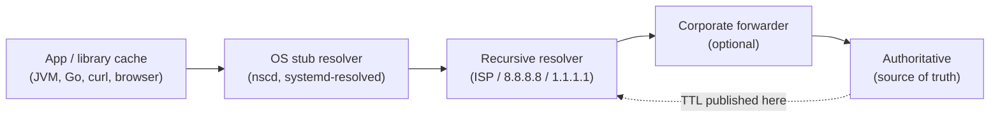

# DNS Caching & TTL — Interview

DNS caching questions separate candidates who have *operated* DNS from those who have only *configured* it. The interviewer is probing one core insight: **TTL is the only knob you control, and every caching layer between you and the user can make a bad answer stickier but never fresher.** These questions build from "what is TTL" to the scenario that ends most rounds — "you changed a record and some users still hit the old IP; explain."

## Table of Contents

1. [Q1: What does TTL mean on a DNS record?](#q1-what-does-ttl-mean-on-a-dns-record)
2. [Q2: What are the layers that cache a DNS answer?](#q2-what-are-the-layers-that-cache-a-dns-answer)
3. [Q3: Why does "DNS propagation" take time — what actually propagates?](#q3-why-does-dns-propagation-take-time--what-actually-propagates)
4. [Q4: Why must you lower TTL *before* a migration, not during it?](#q4-why-must-you-lower-ttl-before-a-migration-not-during-it)
5. [Q5: Why can't you force-flush the world's caches?](#q5-why-cant-you-force-flush-the-worlds-caches)
6. [Q6: What is negative caching and where does its TTL come from?](#q6-what-is-negative-caching-and-where-does-its-ttl-come-from)
7. [Q7: How does TTL relate to load on your authoritative servers?](#q7-how-does-ttl-relate-to-load-on-your-authoritative-servers)
8. [Q8: Resolvers ignore your TTL — how, and both directions?](#q8-resolvers-ignore-your-ttl--how-and-both-directions)
9. [Q9: What is serve-stale and what does it trade?](#q9-what-is-serve-stale-and-what-does-it-trade)
10. [Q10: Is real failover time equal to the TTL? Walk the math.](#q10-is-real-failover-time-equal-to-the-ttl-walk-the-math)
11. [Q11: What is a thundering herd at TTL expiry and how is it avoided?](#q11-what-is-a-thundering-herd-at-ttl-expiry-and-how-is-it-avoided)
12. [Q12: Scenario — you changed an A record and 5% of users still hit the old IP. Why?](#q12-scenario--you-changed-an-a-record-and-5-of-users-still-hit-the-old-ip-why)
13. [Q13: Positive vs negative TTL — quick comparison](#q13-positive-vs-negative-ttl--quick-comparison)
14. [Q14: What TTL would you set for an apex A record behind DNS failover, and why?](#q14-what-ttl-would-you-set-for-an-apex-a-record-behind-dns-failover-and-why)
15. [Q15: How do you make a DNS cutover safe end-to-end?](#q15-how-do-you-make-a-dns-cutover-safe-end-to-end)

---

## Q1: What does TTL mean on a DNS record?

> TTL (Time To Live) is a per-record field, in **seconds**, that tells any resolver holding the answer how long it may serve that answer from cache before it must re-query authoritative. A TTL of 300 means "you may reuse this answer for up to 5 minutes."
>
> Two precisions that separate a strong answer:
> 1. TTL is an **upper bound**, not a fixed duration. A resolver that cached the answer 299 s ago re-queries in 1 s; one that cached it 1 s ago holds it for 299 more. Across a large population the mean residual is ≈ TTL/2, but the **tail is the full TTL** — and your SLO lives in the tail.
> 2. TTL is set at the **authoritative** zone but *enforced* by whoever caches the answer. You publish an intention; the ecosystem interprets it (see Q8).

---

## Q2: What are the layers that cache a DNS answer?

> A DNS answer is cached at *every* hop, and each layer adds residency you don't control:



> - **Application / library cache** — worst offender. Browsers pin resolutions per connection; older JVMs cached forever (`networkaddress.cache.ttl=-1`); connection pools (gRPC channels, DB pools, keep-alive) never re-resolve until the socket is torn down.
> - **OS stub resolver** — `nscd`, `systemd-resolved`, Windows DNS Client cache locally.
> - **Recursive resolver** — the big one: ISP, corporate, or public (8.8.8.8, 1.1.1.1). This is where "the world" caches your record and where TTL is nominally honored.
> - **Forwarders** — enterprise middle-boxes that may re-cache or clamp.
> - **Authoritative** — the only layer that is *not* a cache; it is the source of truth.
>
> Key takeaway: the recursive resolver honors your TTL, but the layers *above* it (OS, app, connections) are frequently TTL-unaware and add residual on top.

---

## Q3: Why does "DNS propagation" take time — what actually propagates?

> "Propagation" is a misleading word. Authoritative servers get the new record essentially **immediately** (an authoritative update is instant; a zone push to secondaries is seconds). Nothing "propagates outward" to resolvers.
>
> What actually causes the delay is **cache expiry**: resolvers around the world are still serving the *old* answer they cached earlier, and they will keep doing so until their copy hits its TTL and they re-query. So the visible "propagation time" is really "**how long the old answer's TTL lets stale copies live**" — bounded by the TTL that was in effect *when those copies were cached* (which is the old TTL, not the new one — this is the trap in Q4).
>
> Strong-answer phrasing: *"DNS doesn't push; it expires. Propagation time = the residual life of already-cached answers, governed by the TTL in effect when they were cached."*

---

## Q4: Why must you lower TTL *before* a migration, not during it?

> Because the **old TTL governs the old answers**. Lowering TTL from 3600 to 60 one hour before a cutover does nothing for the answers already cached under the 3600 s value — those copies keep their full hour of life. You changed the future, not the present.
>
> Correct discipline: lower the TTL at least **one old-TTL-period ahead** — in practice 24–48 h ahead to also absorb resolver clamping and slow-refreshing caches. Sequence:
> 1. **T-48h:** drop TTL from 3600 → 60. Old copies begin expiring; new copies cache at 60 s.
> 2. **T-0:** by now virtually everyone holds a 60 s copy. Perform the cutover — worst-case stale window is now ~60 s, not an hour.
> 3. **T+stable:** raise TTL back up to reclaim caching benefits (load, cost, resilience).
>
> The classic incident is "we lowered TTL to 60 s one hour before the cutover" — the long tail of clients keeps hitting the decommissioned endpoint for a full hour after cutover.

---

## Q5: Why can't you force-flush the world's caches?

> Because you have **no control channel to other people's resolvers.** DNS caching is pull-based and passive: a resolver caches an answer and independently counts down its own TTL. There is no protocol message you can send authoritative-side that says "evict what you cached." You can flush *your own* resolver, and you can ask a few public providers via their flush pages, but you cannot reach the millions of ISP, corporate, and mobile-carrier resolvers your users traverse.
>
> The operational consequence: **prevention beats reaction, because reaction is essentially impossible.** Once a wrong answer (or a wrong *negative* answer — see Q6) is cached across the internet, it lives out its TTL no matter how fast you fix authoritative. This is why short TTLs are the *only* real lever for limiting the blast radius of a mistake, and why you keep negative TTLs small.

---

## Q6: What is negative caching and where does its TTL come from?

> Negative caching (RFC 2308) stores the *absence* of an answer — an **NXDOMAIN** (name does not exist) or **NODATA** (name exists, requested type does not) — so resolvers stop hammering authoritative for names that legitimately don't resolve.
>
> The critical detail interviewers want: the negative answer's TTL is **not** any record's TTL (there is no record). It is derived from the **SOA MINIMUM** field, bounded by the SOA record's own TTL (per RFC 2308).
>
> Why this is a sharp edge: if a deploy bug or a failed zone transfer briefly makes a *valid* name return NXDOMAIN, every resolver that queried during that window caches the negative answer for the SOA minimum — potentially hours. You fix the zone in seconds; affected users stay broken for the full negative TTL, and you cannot flush them (Q5). The amplification factor is `negative_TTL / incident_duration` — a 2-minute mistake with a 1-hour SOA minimum is a 30× outage for unlucky clients.
>
> Mitigation: keep **SOA MINIMUM small** (300–900 s), publish zones atomically/validated, and never let a live name go transiently NXDOMAIN.

---

## Q7: How does TTL relate to load on your authoritative servers?

> Inversely, and this is the whole economic model of DNS. Each **caching resolver** re-queries authoritative about **once per TTL**, regardless of how many clients sit behind it. So:
>
> ```
> authoritative_QPS  ≈  number_of_unique_resolvers / TTL
> ```
>
> A resolver fronting 10 M users hits you *once per TTL* for a given name, not 10 M times. Halving the TTL roughly doubles authoritative QPS; a 5 s TTL vs a 300 s TTL is a ~60× difference in query load. Practical consequences:
> - **Managed DNS is billed per query** — dropping a hot apex from 300 s to 20 s can multiply your DNS bill ~15× for negligible failover benefit if resolvers clamp anyway.
> - **Caching is a load shield / DDoS buffer** — low TTL thins it.
>
> Heuristic: default to the **highest TTL your change/failover needs tolerate**, and lower it *temporarily* around known change windows.

---

## Q8: Resolvers ignore your TTL — how, and both directions?

> Your published TTL is a request, not a guarantee. Resolvers clamp it in **both** directions:
> - **TTL floor (minimum caching):** many resolvers refuse very low TTLs to protect their hit rate and upstream load. A resolver enforcing a 30 s (or 300 s) floor turns your 5 s TTL into 30 s. So a single-digit-second TTL often buys nothing but query load.
> - **TTL cap (maximum caching):** RFC 2308 advises capping absurdly large TTLs so a fat-fingered `2^31−1` doesn't pin an answer for 68 years.
> - **Early eviction:** a 24 h TTL entry can be evicted early under LRU cache pressure — high TTL *permits* long residency, it doesn't guarantee it.
>
> The gotcha both ways: the floor slows your **failover** (low TTL ignored) *and* slows your **correction** during an incident (a bad answer cached under a floored TTL is stuck for that floor). Test against the resolver population your users actually traverse (public + carrier + large-ISP), not your own faithful recursive server.

---

## Q9: What is serve-stale and what does it trade?

> Serve-stale (RFC 8767, "Serving Stale Data to Improve DNS Resiliency") lets a resolver return a **previously cached, now-expired** answer when it can't reach authoritative to refresh it. The explicit trade: a slightly stale answer beats *no* answer when authoritative is unreachable (DDoS, partition, provider outage).
>
> Mechanics: on a query for an expired name, the resolver first tries to refresh; if authoritative doesn't respond within a short client timeout (RFC 8767 suggests ~1.8 s), it serves the stale answer (typically with a short TTL like 30 s) and keeps retrying in the background. Expired entries are retained for a bounded window (default guidance ~1–3 days).
>
> The mirror-image risk interviewers love: if you just **failed over to a new IP** and authoritative then goes unreachable, serve-stale may pin clients to the **old** IP — extending an outage you thought you'd fixed. So: serve-stale optimizes against *authoritative outages*, not against *needing a fresh answer*. Know which failure you're buying insurance for.

---

## Q10: Is real failover time equal to the TTL? Walk the math.

> No — TTL is only one term, and it's a *floor* on how bad failover can be, never a ceiling on how good. Effective failover time is a sum of independent delays:
>
> ```
> effective_failover_time ≈
>       health_check_detection        (interval × failed samples)
>     + authoritative_publish_latency  (record update + zone push)
>     + resolver_cache_residual        (≤ published TTL, subject to floor)
>     + client_cache_residual          (OS + app + library caches)
>     + connection_drain               (keep-alive / pools ignore DNS)
> ```
>
> Worked example: health check 10 s × 3 failures = 30 s; publish ≈ 10 s; TTL 60 s worst-case resolver residual; OS/app cache 30–60 s; long-lived connections re-resolve only on teardown (minutes). Naive read: "60 s TTL = 60 s failover." Honest worst case: `30 + 10 + 60 + 60 + drain ≈ 160 s+`, with a long tail from pooled connections that ignore DNS entirely.
>
> This is why DNS failover alone is unfit for tight RTOs, and why serious designs pair it with connection draining, client retries that force fresh resolution, and sub-DNS failover (anycast VIP).

---

## Q11: What is a thundering herd at TTL expiry and how is it avoided?

> When many resolvers cache the same popular record at nearly the same instant — common after a global TTL lowering, a cold-cache event, or a campaign launch — their copies **expire together**, producing a synchronized burst of authoritative queries every TTL seconds. Lower TTL makes the herd more frequent; correlated caching makes each spike sharper.
>
> Mitigations, by leverage:
> - **Prefetch (async re-fetch):** resolvers refresh a popular entry *before* it expires (e.g., when a query arrives with <10% of TTL left), so clients always hit cache and refresh is decoupled from expiry. A modestly higher TTL gives prefetch room to work.
> - **Serve-stale:** covers the gap if a refresh momentarily fails.
> - **Jitter:** desynchronize expiries so they don't align on a single instant.
> - **Raise TTL for hot, stable records:** fewer expiries is the cheapest herd fix.
>
> Modern trend: prefetch + serve-stale make *higher* baseline TTLs safer, so best practice is higher baseline TTLs with disciplined, time-boxed lowering — not permanently low TTLs "just in case."

---

## Q12: Scenario — you changed an A record and 5% of users still hit the old IP. Why?

> This is the capstone. Give a **layered differential**, not one cause — a great answer enumerates why *5%* and not 0% or 100%, then how to confirm and mitigate. Ranked by likelihood:
>
> 1. **Old TTL still counting down.** The change is minutes old but old copies were cached under the *previous* (higher) TTL and haven't expired. If TTL was 3600 s and it's been 10 minutes, most old copies are still valid. → *Wait one old-TTL-period; verify the change was made with an already-low TTL (Q4).*
> 2. **Long-lived connections / pooled sockets.** Keep-alive HTTP, gRPC channels, DB pools, and TTL-ignoring libraries (old JVM `cache.ttl=-1`) never re-resolved — they're glued to the old IP until the socket tears down. This alone explains a persistent single-digit-percent tail. → *Drain the old endpoint gracefully; force reconnects; don't hard-kill the old IP.*
> 3. **Resolver TTL floor.** A carrier or public resolver clamped your low TTL up to 30–300 s, so those users' copies live longer than you intended (Q8).
> 4. **OS / app / browser stub caches** holding the old answer past the resolver's expiry.
> 5. **serve-stale** returning the old IP if authoritative was briefly unreachable during/after the change (Q9).
> 6. **Anycast / GeoDNS variation** — a subset of users hit a different authoritative POP or a lagging secondary that hadn't received the zone update yet.
>
> **How to confirm:** query multiple public + carrier resolvers directly and inspect the *remaining* TTL each returns (a decreasing TTL confirms cache countdown; a floored TTL confirms clamping). Check whether the old-IP hits correlate with long-lived connections (server access logs by connection age).
>
> **Why exactly 5%:** it's the intersection of clamped resolvers + sticky connections + slow-refreshing OS/app caches — a *tail*, which is precisely why TTL bounds the mean but the tail runs to the full TTL and beyond. **Mitigation:** keep the old endpoint alive and draining (never instantly dead), and next time pre-lower the TTL 24–48 h ahead so this tail is seconds, not the previous TTL.

---

## Q13: Positive vs negative TTL — quick comparison

> Interviewers use this to check you know negative caching isn't governed by record TTL.

| Aspect | Positive TTL | Negative TTL |
|---|---|---|
| Caches | An existing answer (A/AAAA/CNAME/MX…) | An *absence* — NXDOMAIN or NODATA |
| Value comes from | The record's own TTL field | **SOA MINIMUM** (bounded by SOA TTL), RFC 2308 |
| Set where | Per record | Per zone (SOA), applies to all negative answers |
| Failure mode | Stale-but-valid answer served too long | A live name stuck "not found" after a transient bug |
| Recommended range | Role-based: 30–60 s (failover) … hours (stable) | Small: 300–900 s to bound outage blast radius |
| Can you flush it globally? | No (Q5) | No — and it's more dangerous because it *hides* a working name |

---

## Q14: What TTL would you set for an apex A record behind DNS failover, and why?

> **30–60 s**, and I'd justify the number rather than reflexively going lower:
> - Failover requires the change to reach clients fast, so TTL must be low — but **going below ~30 s buys little** because many resolvers enforce a 30–60 s floor (Q8); a 5 s TTL just multiplies authoritative QPS and cost (Q7) without improving real failover.
> - I'd pair it with the honesty of Q10: DNS failover at 60 s TTL still means ~160 s+ real recovery once you add detection, client caches, and connection drain. For tight RTOs I'd push failover *below* DNS — an anycast VIP or load-balancer health-based failover — and use DNS for coarse steering only.
> - Records that are **not** failover-critical (NS: 24–48 h; stable CDN-fronted endpoints: 300–3600 s; MX: 1–4 h) get high TTLs to reclaim caching benefits. TTL is assigned **per record by role**, never one global number.

---

## Q15: How do you make a DNS cutover safe end-to-end?

> A checklist answer signals operational maturity:
> 1. **Pre-lower TTL 24–48 h ahead** (Q4) and *verify* propagation by polling multiple public/carrier resolvers for the remaining TTL before cutting.
> 2. **Keep the old endpoint alive and draining** through and after the cutover — never decommission on the same clock as the DNS change; the tail (Q12) needs the old IP to keep working.
> 3. **Cut over**, then watch old-IP traffic decay in server logs; expect a tail from sticky connections and clamped resolvers, not an instant drop.
> 4. **Force reconnects** where you can (short server-side keep-alive, connection-max-age) to shake loose pooled clients.
> 5. **Never risk a transient NXDOMAIN** — publish atomically and validate the zone so you don't trigger sticky negative caching (Q6).
> 6. **Raise TTL back up** once stable to reclaim cache load-shielding and cost (Q7).
> 7. **Know serve-stale's edge** (Q9): if authoritative wobbles right after cutover, some resolvers may serve the old IP a while longer — account for it rather than being surprised.
>
> The unifying principle: *the value you publish is an upper bound on your intentions and a lower bound on your regret.* Every caching layer can only make a bad answer stickier, never fresher — so lower TTL deliberately and early, keep negative TTLs short, and never let DNS caching be the only thing standing between a failure and your users.

---

*Next step:* [GeoDNS & Anycast — Junior](../05-geodns-and-anycast/junior.md)
