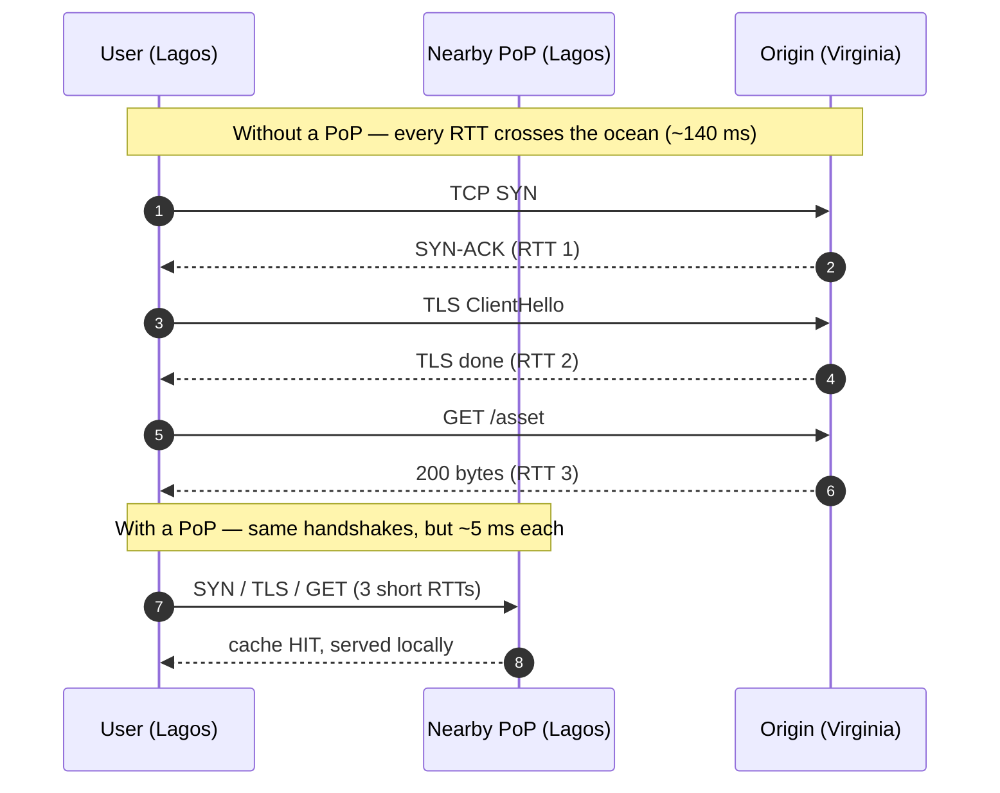
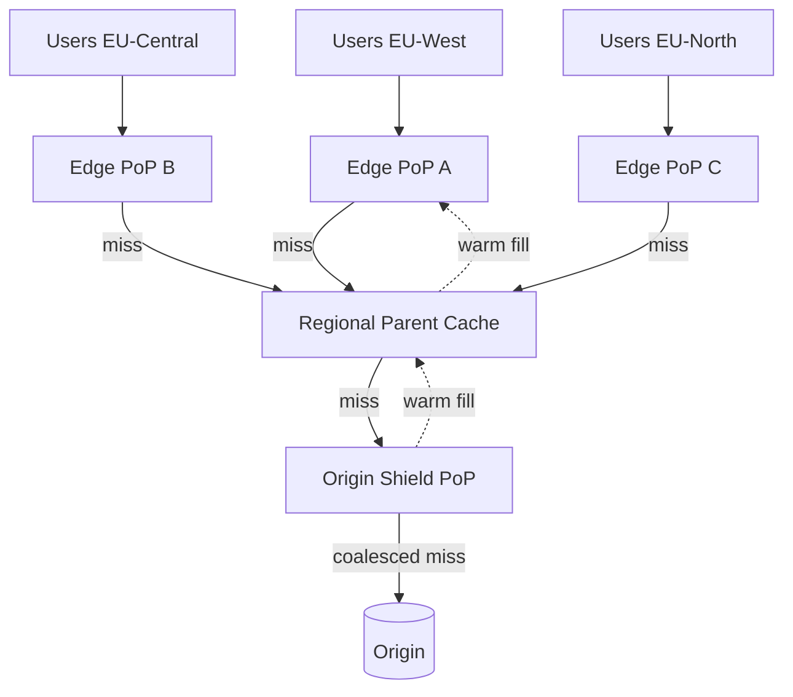
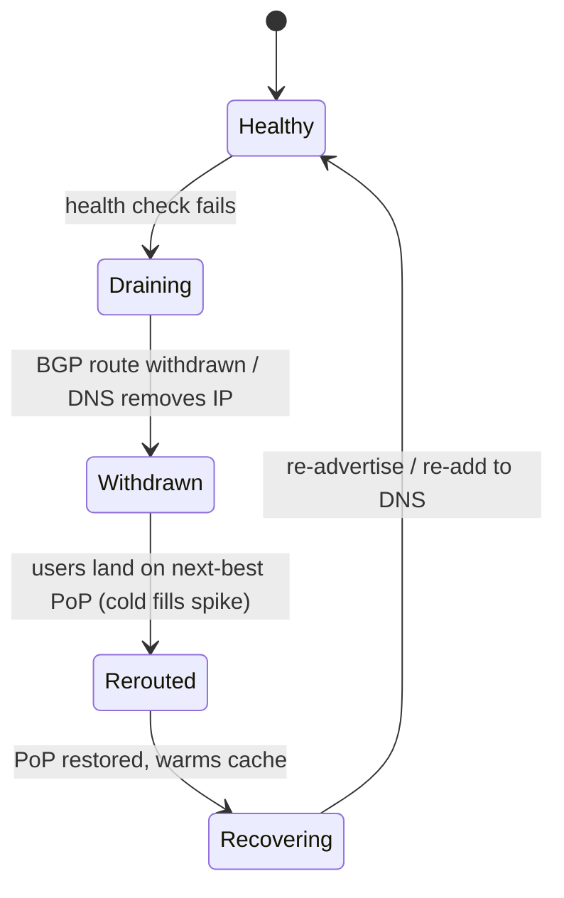

# Edge Locations — Interview

A question bank on **edge locations / Points of Presence (PoPs)** — the physical anchor of a CDN. Answers favor concrete mechanics and arithmetic (RTT, hit-ratio, PoP counts) over slogans. Work top to bottom; later questions assume the earlier mental model.

## Table of Contents

1. [Q1: What is a PoP / edge location?](#q1-what-is-a-pop--edge-location)
2. [Q2: Why does proximity reduce latency?](#q2-why-does-proximity-reduce-latency)
3. [Q3: How does a user actually reach the *nearest* PoP?](#q3-how-does-a-user-actually-reach-the-nearest-pop)
4. [Q4: Anycast vs GeoDNS — what breaks with each?](#q4-anycast-vs-geodns--what-breaks-with-each)
5. [Q5: What is cache fragmentation across PoPs?](#q5-what-is-cache-fragmentation-across-pops)
6. [Q6: What is tiered caching + origin shield, and why does it raise hit-ratio?](#q6-what-is-tiered-caching--origin-shield-and-why-does-it-raise-hit-ratio)
7. [Q7: Quantify the hit-ratio gain from a mid-tier.](#q7-quantify-the-hit-ratio-gain-from-a-mid-tier)
8. [Q8: What runs at the edge, and what should NOT?](#q8-what-runs-at-the-edge-and-what-should-not)
9. [Q9: What happens when a PoP fails?](#q9-what-happens-when-a-pop-fails)
10. [Q10: Why isn't "more PoPs" always better?](#q10-why-isnt-more-pops-always-better)
11. [Q11: Edge vs regional vs origin — how do you place a cache tier?](#q11-edge-vs-regional-vs-origin--how-do-you-place-a-cache-tier)
12. [Q12: How does a PoP's internal cache stay coherent on purge?](#q12-how-does-a-pops-internal-cache-stay-coherent-on-purge)
13. [Q13: How do you measure whether a PoP is doing its job?](#q13-how-do-you-measure-whether-a-pop-is-doing-its-job)
14. [Q14: Scenario — cut global latency for a read-heavy site.](#q14-scenario--cut-global-latency-for-a-read-heavy-site)
15. [Q15: When would you deliberately NOT use edge caching?](#q15-when-would-you-deliberately-not-use-edge-caching)

---

## Q1: What is a PoP / edge location?

> A **Point of Presence (PoP)** is a physical facility — a rack or cage inside a carrier-neutral colocation or an ISP's data center — where a CDN places servers, network gear, and interconnects close to end users. An **edge location** is the caching layer inside a PoP: the reverse-proxy cache servers that terminate the user's TCP/TLS connection and serve content. One PoP peers with local ISPs and IXPs so that a request from, say, a Lagos user rides only a few network hops before hitting a warm cache, instead of traversing an ocean to the origin. Mental model: the origin is *one* authoritative copy; PoPs are *hundreds* of replicated, ephemeral, geographically scattered copies of the hot subset of that content. The PoP is where "the internet gets short" for that user.

## Q2: Why does proximity reduce latency?

> Because latency is dominated by **round-trip time (RTT)**, and RTT is bounded below by the **speed of light in fiber** (~200,000 km/s, roughly ⅔ of c) plus per-hop queuing and serialization. A packet cannot beat physics: New York ↔ London is ~5,600 km, so a *one-way* light-in-fiber floor is ~28 ms, an RTT floor of ~56 ms — before any router touches it. Real measured RTT is typically 70–90 ms. Moving the serving node from London to a PoP inside the user's own city collapses that geographic RTT to single-digit milliseconds.
>
> The multiplier is that most protocols need **several round trips before the first byte**: DNS, TCP handshake (1 RTT), TLS 1.3 handshake (1 RTT), then the HTTP request/response (1 RTT). A cold connection can cost 3–4 RTTs. At 80 ms RTT that is ~240–320 ms of pure waiting; at 5 ms it is ~15–20 ms. Proximity does not just shave one hop — it shaves *every* handshake round trip, which is why "time to first byte" improves super-linearly.

## Q3: How does a user actually reach the *nearest* PoP?

> Two mechanisms, usually layered:
>
> 1. **Anycast BGP routing.** The CDN advertises the *same* IP prefix from every PoP. The global BGP routing fabric naturally delivers each user's packets to the topologically nearest advertisement. The user does nothing; the network decides. Steering happens at the IP layer, per-packet, and re-converges automatically when a PoP withdraws its route.
> 2. **DNS-based steering (GeoDNS / EDNS Client Subnet).** The CDN's authoritative DNS returns *different* answers depending on where the resolver (or, with ECS, the client subnet) sits, handing back the IP of a PoP chosen by geography, latency measurements, and current load. Steering happens once per DNS TTL, not per packet.
>
> Note "nearest" means **lowest network latency**, which is not the same as fewest kilometers — a badly-peered close PoP can be slower than a well-peered distant one, so mature CDNs steer on **real-time latency and health**, not raw geography.

## Q4: Anycast vs GeoDNS — what breaks with each?

> Both answer "which PoP?" but at different layers with different failure modes.

| Dimension | Anycast (BGP) | GeoDNS / DNS steering |
|---|---|---|
| Layer / granularity | Network layer, per-packet | DNS layer, per-resolver, per-TTL |
| Who chooses the PoP | Internet routing fabric | CDN's authoritative DNS logic |
| Failover speed | Seconds (BGP re-converges on route withdrawal) | Bounded by DNS TTL + resolver caching |
| Accuracy of "nearest" | Topological, not always latency-optimal | Only as good as resolver→user mapping |
| Classic failure mode | **Mid-session PoP flap** — a route change can move an *in-flight* TCP connection to a different PoP, resetting it | Users behind a **distant public resolver** (e.g. an 8.8.8.8 without ECS) get mapped to the resolver's location, not their own |
| Load control | Coarse — hard to bleed traffic off one PoP | Fine — can weight/shift answers per PoP |

> In practice large CDNs combine them: **anycast to land in a region + health-checked DNS or session-stickiness to pick the exact PoP**, using ECS to fix the "public resolver hides the real user" problem. Anycast is favored for connectionless/short flows (DNS itself) and where fast failover matters; DNS steering is favored where fine-grained load balancing and stickiness matter.

## Q5: What is cache fragmentation across PoPs?

> A CDN has *N* independent PoPs, and each fills its cache **only from the traffic it personally sees**. So a hot object may be cached in Frankfurt and Tokyo but cold in São Paulo — the first São Paulo request is still a miss even though the object is "popular globally." This is **cache fragmentation**: the object population is split across N caches, so the *per-PoP* request rate for any given object is 1/N of the global rate. Since cache hit-ratio depends on how often an object is re-requested **before it is evicted**, slicing the request stream N ways lowers each PoP's effective hit-ratio and forces N independent cold-fill fetches to the origin for the *same* object.
>
> This is why naïvely adding PoPs can *increase* origin load: more shards → thinner request stream per shard → more misses per shard → more origin fetches. The fix is **tiered caching** (Q6), which reintroduces a shared upstream cache so PoPs can hit each other's fills instead of each stampeding the origin.

## Q6: What is tiered caching + origin shield, and why does it raise hit-ratio?

> **Tiered caching** inserts a middle cache layer between the edge PoPs and the origin. Instead of `edge → origin`, the path becomes `edge → regional parent cache → origin`. Many nearby edge PoPs share the same parent, so a miss at any edge is served by the parent if *any* sibling edge already populated it — the object is fetched from origin **once per region**, not once per edge.
>
> **Origin shield** is the extreme case: designate **one** PoP (near the origin) as the single upstream that every other tier must go through. The origin then sees, in the ideal case, **exactly one fetch per object per TTL**, regardless of how many edges exist. It also collapses concurrent misses via **request coalescing** — 10,000 simultaneous edge misses for a just-expired object become one origin request, defeating the "cache stampede / thundering herd" on expiry.
>
> Why hit-ratio rises: it **de-fragments** the request stream (Q5). Each object's re-request rate at the parent is the *sum* of all its children's rates — much higher, so it stays resident and hot. The parent absorbs the misses the edges would otherwise have leaked to origin.

## Q7: Quantify the hit-ratio gain from a mid-tier.

> Take a toy model. Suppose 100 edge PoPs, a single object requested **10,000 times/day globally**, and a cache that evicts an object if it isn't re-requested within some window. Assume, for illustration, that a PoP keeps the object hot only if it sees ≥ 500 requests/day for it.
>
> - **Flat (no tier):** each edge sees 10,000 / 100 = **100 req/day** for the object — below the 500 threshold, so it keeps getting evicted → most requests miss → up to ~100 origin fetches/day (one cold-fill per edge per eviction cycle).
> - **With a regional parent per ~10 edges (10 parents):** each parent aggregates 1,000 req/day — above threshold, stays hot. Origin now sees ~**10 fetches/day** (one per parent). Edge misses are served warm by the parent, so *user-perceived* latency is still local-ish (edge↔parent RTT, not edge↔origin).
> - **With an origin shield:** the shield aggregates all 10,000 req/day, trivially hot. Origin sees ~**1 fetch/day** per TTL. **~99% origin offload** vs the flat case.
>
> The lesson: hit-ratio at any tier is governed by *request density per object per cache*. Tiering raises density by summing child streams, so origin offload can jump from "long tail leaks constantly" to "one fetch per TTL." Real numbers depend on the object's popularity (Zipf) and TTL, but the direction is always: **fewer, fatter upstream caches → higher hit-ratio → lower origin load.**

## Q8: What runs at the edge, and what should NOT?

> **Good at the edge** (stateless or read-mostly, latency-sensitive, small compute): TLS termination, static/cacheable responses, HTTP header rewriting, redirects, A/B bucketing, auth-token validation (JWT verify), bot filtering, request routing, image resizing on cacheable variants, ESI/edge-side assembly of mostly-static fragments. These win because they run in a datacenter ~5 ms from the user and cut round trips to origin.
>
> **Bad at the edge** (stateful, strongly-consistent, data-gravity-bound): the primary transactional database, anything needing a global lock or read-your-writes consistency, large working sets that don't fit edge memory, and heavy compute that would be cheaper centralized. Edge compute runs in **hundreds of locations**, so any state you put there is either N-way replicated (consistency + cost pain) or a cache of central truth. Rule of thumb: **push computation to the edge only when it's a pure function of the request plus small, eventually-consistent state.** The tradeoff is cost and cold-starts multiplied by PoP count, and debugging/observability across hundreds of ephemeral runtimes.

## Q9: What happens when a PoP fails?

> The CDN must **remove the failed PoP from the steering pool and redirect its users to the next-best healthy PoP** — and it must happen faster than users notice.
>
> - **Under anycast:** the failing PoP **withdraws its BGP route**; the internet re-converges within seconds and packets flow to the next-nearest advertisement automatically. No client change needed. Risk: in-flight TCP connections tied to the old PoP reset and must reconnect.
> - **Under DNS steering:** health checks mark the PoP down and the authoritative DNS **stops returning its IP**; new lookups get a healthy PoP. Recovery is bounded by **DNS TTL + resolver caching**, so TTLs are kept low (e.g. 20–60 s) for fast failover, trading extra DNS query volume for agility.
>
> Two second-order effects to name: (1) the surviving PoPs inherit the failed PoP's traffic and its **cold cache** for that traffic, so origin load spikes transiently — tiered caching/shield buffers this; (2) capacity headroom must exist on neighbors, or failover just moves the outage. Good designs keep every PoP below ~60–70% utilization precisely so a neighbor's failure doesn't cascade.

## Q10: Why isn't "more PoPs" always better?

> Because PoP count has diminishing returns and real counter-effects:
>
> 1. **Latency floor.** Once a PoP is within ~10–20 ms of the user, adding a closer one saves maybe 3–5 ms — imperceptible for most content. The big win is going from 100 ms → 15 ms, not 15 ms → 12 ms.
> 2. **Cache fragmentation (Q5).** More PoPs → thinner per-PoP request stream → lower per-PoP hit-ratio → *more* origin fetches, unless you offset it with tiering. Past a point, another PoP *raises* origin load and cost.
> 3. **Cost and operations.** Each PoP is real estate, hardware, peering contracts, and an operational surface (deploys, monitoring, security patching) multiplied by N.
> 4. **Steering accuracy.** More PoPs make "pick the truly nearest" harder and increase the chance of mis-steering.
>
> The mature answer: **place PoPs where users and good peering actually are** (dense IXPs, large eyeball networks), and cover the long tail with **tiered caching** rather than raw PoP proliferation. A CDN with 100 well-placed, well-tiered PoPs beats one with 400 poorly-tiered ones.

## Q11: Edge vs regional vs origin — how do you place a cache tier?

| Tier | Distance to user | Working set it holds | Optimizes for | Typical hit-ratio role |
|---|---|---|---|---|
| **Edge PoP** | ~1–20 ms | Hottest, smallest slice (per-locale) | User-perceived latency, TLS/RTT reduction | Serves the popular head fast |
| **Regional parent** | ~10–40 ms | Warm mid-tail, aggregated over many edges | De-fragmenting edge misses, absorbing regional demand | Catches edge misses before origin |
| **Origin shield** | Near origin | Everything cacheable, one shared copy | Origin offload, stampede/coalescing | ~1 origin fetch per object per TTL |
| **Origin** | Anywhere (authoritative) | Full truth, uncacheable + dynamic | Correctness, writes | Last resort; ideally rarely hit |

> Decision rule: put a tier where the **request density justifies it**. Edges serve latency; parents and shields serve *hit-ratio and origin protection*. If your origin offload is already >99%, a deeper tier is wasted complexity. If it's 80% and origin is straining, add a parent/shield before adding PoPs.

## Q12: How does a PoP's internal cache stay coherent on purge?

> A PoP isn't one box — it's a fleet of cache servers, often sharded by a **consistent hash of the object key** so each object lives on a predictable subset of nodes (bounding fan-out and duplication within the PoP). Coherence on change is handled two ways:
>
> - **TTL expiry (passive):** objects carry a freshness lifetime; on expiry the edge revalidates upstream (`If-None-Match` / `If-Modified-Since`) and gets a cheap `304` or a fresh copy. This is eventual and requires no global coordination.
> - **Active purge / invalidation:** when content changes before its TTL, the control plane **broadcasts a purge** (by URL, by tag/surrogate-key, or wildcard) to every PoP; each PoP evicts or marks-stale the matching entries. Propagation is typically seconds globally. Tag-based purge is what lets "invalidate everything touching product 123" work without listing every URL.
>
> The tension: aggressive short TTLs = fresher but more revalidation traffic; long TTLs + purge-on-write = high hit-ratio but you must reliably fan out purges to *all* PoPs. Missed purges are the classic "why is Tokyo still serving the old banner?" bug.

## Q13: How do you measure whether a PoP is doing its job?

> Four signals, and the arithmetic behind each:
>
> - **Cache hit-ratio** = hits / (hits + misses), measured **per PoP and per tier**. A high edge hit-ratio means users get local latency; a high *shield* hit-ratio means the origin is protected. Track them separately — a 95% edge ratio can still hammer origin if the 5% misses aren't de-fragmented.
> - **Origin offload** = 1 − (origin fetches / total requests). This is the business-critical number: it's what caps origin cost and load.
> - **Edge latency (TTFB / p50, p95, p99)** per PoP. Regressions localize a mis-peered or overloaded PoP.
> - **PoP-level error rate & saturation** (5xx, connection resets, CPU/bandwidth utilization). Utilization creeping toward 100% predicts the failover cascade in Q9.
>
> The interview-grade point: a single global hit-ratio hides fragmentation. You need the **per-PoP and per-tier breakdown** to know whether a low origin offload is a caching-config problem, a fragmentation problem, or an uncacheable-content problem.

## Q14: Scenario — cut global latency for a read-heavy site.

> **Brief:** A read-heavy site (static pages, images, JS/CSS, some JSON APIs; 95% reads) serves users worldwide from a single origin in Virginia. Global p95 TTFB is ~400 ms. Cut it.
>
> **Diagnosis first.** 400 ms for far-flung users is almost entirely **geographic RTT × handshake count** (Q2). The origin isn't slow; the *distance* is. So the lever is proximity + caching, not a faster origin.
>
> **Plan, in priority order:**
> 1. **Front everything with a CDN using anycast + health-checked steering** so each user lands on a nearby PoP (Q3). This alone kills most handshake-RTT cost for cacheable content.
> 2. **Make static assets cacheable and long-TTL'd** (`Cache-Control: public, max-age=...`, immutable hashed filenames), with **purge-on-deploy** by surrogate key (Q12). These now serve from edge memory at ~5–15 ms.
> 3. **Add tiered caching + an origin shield** (Q6) so the fragmented long-tail and cache-fills don't stampede Virginia; target >99% origin offload. This also stabilizes latency during PoP failover (Q9).
> 4. **For the read-heavy JSON APIs**, cache **idempotent GETs** at the edge with short TTLs (5–30 s) + stale-while-revalidate, and use **ECS-aware GeoDNS** so even API DNS resolves to a near PoP. Where per-user, use **edge compute to validate the JWT and assemble mostly-static fragments** (Q8) without a round trip to origin.
> 5. **Keep writes and strongly-consistent reads on the origin path** — do not cache them (Q15). Route those the short way via anycast, but they still pay one WAN RTT; that's acceptable at 5% of traffic.
>
> **Expected outcome:** cacheable content drops from ~400 ms to ~15–40 ms p95 (edge-served); uncacheable dynamic requests improve modestly (fewer handshake RTTs via terminated-at-edge TLS + warm origin connections). Global p95 collapses because 95% of traffic stops crossing oceans. **Measure with per-PoP hit-ratio + origin offload** (Q13) to prove it and to find the PoPs still leaking to origin.

## Q15: When would you deliberately NOT use edge caching?

> When the content is **user-specific, write-heavy, or must be strongly consistent** — the edge's whole value (serve a shared cached copy from far away) evaporates or becomes a correctness hazard:
>
> - **Authenticated, per-user responses** with no shared cacheability (a bank balance, a personalized dashboard) — caching risks serving one user's data to another; at best you cache per-user, which fragments to near-zero hit-ratio.
> - **Rapidly-changing or real-time data** (live prices, inventory counts) where even a few seconds of staleness is wrong — TTLs would have to be so short the cache barely helps.
> - **Writes / mutations** — POST/PUT/DELETE must reach the authoritative origin; edge caching them is meaningless or dangerous.
> - **Strong read-your-writes needs** — a user who just posted must see it immediately; an eventually-consistent edge copy violates that.
>
> The nuanced answer: you rarely turn the CDN *off* — you still route these through it for TLS termination, DDoS absorption, and short-RTT connectivity via anycast. You just mark them **`no-store` / `private`** so the edge proxies without caching. The judgment is *what to cache*, not *whether to have PoPs*.

---

*Next step:* [CDN Security — Junior](../05-cdn-security/junior.md)
