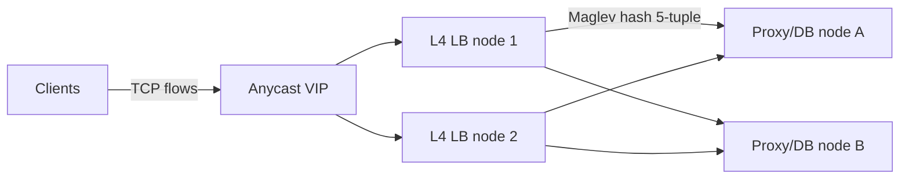

# Layer 4 Load Balancing — Interview

Fast, dense Q&A for a Layer 4 (transport-layer) load balancing interview. Answers are crisp; skim the TOC, then read the questions that expose gaps.

## Table of Contents

1. [Q1: What is a Layer 4 load balancer?](#q1-what-is-a-layer-4-load-balancer)
2. [Q2: Why is L4 faster and more scalable than L7?](#q2-why-is-l4-faster-and-more-scalable-than-l7)
3. [Q3: What is a "flow" and how does an L4 LB pick a backend?](#q3-what-is-a-flow-and-how-does-an-l4-lb-pick-a-backend)
4. [Q4: Explain NAT-mode load balancing.](#q4-explain-nat-mode-load-balancing)
5. [Q5: Explain DSR (Direct Server Return) and when to use it.](#q5-explain-dsr-direct-server-return-and-when-to-use-it)
6. [Q6: How is the client's real IP preserved in L4? What is the PROXY protocol?](#q6-how-is-the-clients-real-ip-preserved-in-l4-what-is-the-proxy-protocol)
7. [Q7: What breaks flow consistency when the LB fleet changes, and how do you fix it?](#q7-what-breaks-flow-consistency-when-the-lb-fleet-changes-and-how-do-you-fix-it)
8. [Q8: What is Maglev hashing and why not plain consistent hashing?](#q8-what-is-maglev-hashing-and-why-not-plain-consistent-hashing)
9. [Q9: What is TLS passthrough vs TLS termination at L4?](#q9-what-is-tls-passthrough-vs-tls-termination-at-l4)
10. [Q10: L4 vs L7 — when do you pick L4?](#q10-l4-vs-l7--when-do-you-pick-l4)
11. [Q11: What happens to live connections when an L4 LB node fails?](#q11-what-happens-to-live-connections-when-an-l4-lb-node-fails)
12. [Q12: How do health checks work at L4, and what can they miss?](#q12-how-do-health-checks-work-at-l4-and-what-can-they-miss)
13. [Q13: Scenario — load balance a non-HTTP workload (WebSocket / database proxy).](#q13-scenario--load-balance-a-non-http-workload-websocket--database-proxy)
14. [Q14: How does ECMP relate to L4 load balancing?](#q14-how-does-ecmp-relate-to-l4-load-balancing)
15. [Q15: What are common failure/misconfiguration modes to watch for?](#q15-what-are-common-failuremisconfiguration-modes-to-watch-for)

---

## Q1: What is a Layer 4 load balancer?

> An L4 load balancer distributes traffic based on **transport-layer** information — source IP, source port, destination IP, destination port, and protocol (TCP/UDP). It operates on **packets and connections**, not on application messages. It never parses the payload: it does not read HTTP paths, headers, cookies, or gRPC methods. A decision is made **once per connection** (per flow), then every packet of that flow is forwarded to the same backend.
>
> Mental model: L4 is a smart, stateful packet forwarder that maps `(client, port)` → `backend`. L7 is a proxy that understands the conversation. Examples of L4 LBs: AWS Network Load Balancer, Google Maglev, Linux IPVS, Katran (XDP/eBPF).

---

## Q2: Why is L4 faster and more scalable than L7?

> Because it does less per packet. An L7 proxy must terminate the client TCP connection, run the TLS handshake, reassemble the byte stream, parse the application protocol, then open a **second** connection to the backend — it sits fully in the data path buffering both sides. An L4 LB only inspects the packet header and rewrites/forwards; it can run in the kernel (IPVS) or even the NIC/XDP layer (Katran, Maglev), avoiding userspace copies entirely.

| Dimension | L4 | L7 |
|-----------|-----|-----|
| Inspection unit | Packet / flow header | Full application message |
| TCP connections | One end-to-end flow (or transparent) | Two (client↔LB, LB↔backend) |
| TLS | Passthrough (no keys needed) | Usually terminated (holds keys) |
| Per-request routing | No (per-flow only) | Yes (path/header/cookie) |
| Throughput | Millions of pps; near line-rate | Bound by parsing + buffering |
| CPU per byte | Very low | High |
| Where it runs | Kernel / eBPF / NIC | Userspace proxy |

> The trade: L4 gives you raw throughput and protocol-agnosticism; L7 gives you content-based routing at CPU cost.

---

## Q3: What is a "flow" and how does an L4 LB pick a backend?

> A **flow** is a single transport connection, identified by the **5-tuple**: `(src IP, src port, dst IP, dst port, protocol)`. The LB must send *every* packet of one flow to the *same* backend — otherwise a mid-stream packet lands on a server with no matching TCP state and gets an RST. Backend selection is done by **hashing the 5-tuple** (or a subset) onto the backend set. Because the same tuple always hashes the same way, selection is deterministic and stateless per packet — no lookup table strictly required if the hash is consistent.
>
> Contrast: round-robin per *packet* would be catastrophic; L4 does round-robin/hash per *connection*.

---

## Q4: Explain NAT-mode load balancing.

> In **NAT (Network Address Translation)** mode the LB rewrites the destination IP (and often the source IP) of inbound packets and forwards them to the chosen backend. Return traffic must route **back through the LB**, which reverses the translation so the client sees replies coming from the virtual IP (VIP) it originally contacted.

```mermaid
sequenceDiagram
    autonumber
    participant C as Client
    participant LB as L4 LB (NAT)
    participant B as Backend
    C->>LB: 1. SYN → VIP:443 (src=C)
    Note over LB: hash 5-tuple → pick Backend
    LB->>B: 2. rewrite dst=Backend; fwd (SNAT src=LB)
    B-->>LB: 3. reply → src=Backend, dst=LB
    Note over LB: reverse NAT: src=VIP, dst=C
    LB-->>C: 4. reply appears from VIP
```

> Pros: simple, backends need no special config, works across subnets. Cons: **the LB is on both the request AND response path** — it becomes a bandwidth bottleneck for reply-heavy traffic (video, downloads), and it must hold per-flow NAT state.

---

## Q5: Explain DSR (Direct Server Return) and when to use it.

> **DSR** (a.k.a. direct routing) removes the LB from the return path. Inbound packets go LB → backend, but the backend replies **directly to the client**, bypassing the LB. This is done by preserving the client IP and configuring each backend to accept and answer for the VIP.
>
> Mechanics: the VIP is bound on a **loopback (non-ARP) interface** on every backend so it responds for the VIP but does not advertise it. The LB forwards the packet unchanged at L2 (MAC rewrite) or via IP tunneling (IPIP/GRE). The backend sends the reply with `src = VIP` straight to the client, whose kernel accepts it because it matches the connection it opened.

```mermaid
sequenceDiagram
    autonumber
    participant C as Client
    participant LB as L4 LB (DSR)
    participant B as Backend (VIP on loopback)
    C->>LB: 1. request → VIP (src=C)
    LB->>B: 2. forward (MAC/tunnel), dst still VIP
    Note over B: process; src=VIP
    B-->>C: 3. reply DIRECTLY to client (bypasses LB)
```

> Use DSR for **asymmetric, reply-heavy traffic** (streaming, large downloads) where return bandwidth would swamp the LB. Cost: more complex setup (loopback VIP, ARP suppression, no L7 features), and the LB can no longer see or shape the return path.

---

## Q6: How is the client's real IP preserved in L4? What is the PROXY protocol?

> It depends on mode:
> - **DSR / plain forwarding / IP-tunnel modes** keep the original source IP intact — the backend sees the real client IP natively. This is a strong reason to choose DSR when client IP matters.
> - **NAT / SNAT modes** replace the source IP with the LB's IP so return traffic routes back. The backend then sees only the LB's address, losing the client IP.
>
> When SNAT hides the client IP but the backend still needs it (geo, rate limiting, audit, allow-lists), use the **PROXY protocol** (HAProxy). The LB prepends a small header to the **start of the TCP stream** carrying the original `src IP:port` and `dst IP:port`; the backend parses this header before treating the rest as application data.

```text
PROXY protocol v1 (human-readable) header, sent once at connection open:
  PROXY TCP4 203.0.113.7 198.51.100.2 56324 443\r\n
  ^proto ^fam ^client-ip ^proxy-ip   ^cport ^dport
v2 is a binary variant (lower overhead, supports TLVs).
```

> Key point: PROXY protocol is **not** an HTTP feature — it works for any TCP protocol, which is why L4 uses it instead of `X-Forwarded-For` (an L7/HTTP header the L4 LB can't inject). Both LB and backend must be configured for it; otherwise the backend mis-parses the header as payload.

---

## Q7: What breaks flow consistency when the LB fleet changes, and how do you fix it?

> The danger: you run **multiple LB nodes** (behind ECMP/anycast). Each node independently maps flows → backends by hashing. If a node is added or removed, or the backend set changes, and the mapping function is naive (e.g., `hash(5-tuple) % N`), then **existing flows get remapped** to a different backend → the packet hits a server with no TCP state → **RST**, connection dropped.
>
> Two independent consistency requirements:
> 1. **Same-flow-same-backend across all LB nodes** — any node handling a given flow must pick the same backend (ECMP can spray a flow's packets across LB nodes, or reroute after a node dies).
> 2. **Minimal disruption on membership change** — adding/removing an LB node or backend should remap as few *existing* flows as possible.
>
> Fixes: use **consistent hashing** (or Maglev hashing) so that `%N`-style full remapping is avoided; combine with a **per-flow connection-tracking table** so already-established flows keep hitting their pinned backend even if the hash result would now differ (connection tracking wins over hash for known flows). Google's Maglev pairs consistent hashing with flow tracking to survive both LB churn and backend churn.

---

## Q8: What is Maglev hashing and why not plain consistent hashing?

> **Maglev** is Google's software L4 LB; its hashing scheme is designed for two goals ring-based consistent hashing handles poorly at scale: **even load distribution** and **minimal disruption**, using a compact **lookup table** instead of a ring.
>
> How it differs:
> - Classic ring consistent hashing needs many **virtual nodes** to get balanced load, and lookups walk the ring.
> - Maglev builds a fixed-size permutation **lookup table** (e.g., 65537 entries) where each backend claims roughly equal slots. A flow's 5-tuple hash indexes directly into the table → O(1). When a backend leaves, only its slots are reassigned, so **almost all flows keep their backend**.
>
> Result: better load evenness than a small vnode ring and constant-time lookup, which matters when you're doing millions of packets per second. Maglev also runs a **per-connection tracking table** on top, so established flows are pinned even during table rebuilds.

> 🎞️ **See it animated:** [Consistent hashing](https://www.toptal.com/big-data/consistent-hashing)

---

## Q9: What is TLS passthrough vs TLS termination at L4?

> **TLS passthrough** (the natural L4 mode): the LB forwards encrypted bytes untouched; the **backend** holds the certificate and completes the TLS handshake. The LB never decrypts, never sees plaintext, and needs no private keys. This preserves **end-to-end encryption** and keeps the LB simple and fast.
>
> **TLS termination** (an L7-ish capability, sometimes offered by L4 LBs like NLB with TLS listeners): the LB decrypts, then re-encrypts (or forwards plaintext) to backends. It now needs the private key and CPU for crypto.

| Aspect | Passthrough (L4) | Termination |
|--------|------------------|-------------|
| Who holds cert/key | Backend | LB |
| LB sees plaintext | No | Yes |
| End-to-end encryption | Yes | No (LB is a break point) |
| Content-based routing | No | Possible (with SNI/L7) |
| CPU on LB | Minimal | High (crypto) |
| Cert rotation blast radius | Per backend | Central (LB) |

> Note: a pure L4 LB can still do **SNI-based routing** by peeking at the unencrypted SNI field in the TLS `ClientHello` without terminating — a common middle ground for routing HTTPS by hostname while staying passthrough.

---

## Q10: L4 vs L7 — when do you pick L4?

> Pick **L4** when you need **throughput, low latency, protocol-agnosticism, or end-to-end TLS** and you do **not** need to route on application content.

> Choose L4 when:
> - The protocol is **not HTTP** — raw TCP/UDP, database wire protocols, MQTT, custom binary, gaming, VoIP, DNS.
> - You need **line-rate throughput** and minimal added latency (millions of pps).
> - You want **end-to-end TLS** with no decryption at the edge (regulatory/security).
> - You need to preserve the **client source IP** cheaply (DSR).
> - You want **long-lived connections** pinned to a backend (WebSocket, gRPC streams).
>
> Choose L7 when: you need path/header/cookie routing, per-request load balancing across a connection, HTTP retries, header rewriting, request-level observability, WAF, or blue/green by URL. Common pattern: **L4 in front for scale + TLS pass-through, L7 behind it for smart routing** — the two are complementary, not either/or.

---

## Q11: What happens to live connections when an L4 LB node fails?

> It depends on **where the connection state lives**.
>
> - If the LB is **stateful** (NAT with a per-flow table) and that state is **not shared/replicated**, losing the node loses the NAT mappings → all its in-flight connections **break** and must be re-established by clients.
> - If the LB is effectively **stateless / deterministic** — backend selection is a pure function of the 5-tuple (consistent/Maglev hash) — then a surviving node can recompute the *same* backend for an existing flow, so ECMP rerouting the flow to another LB node keeps it alive **as long as the backend set and hash are unchanged**.
>
> The subtle failure: even with deterministic hashing, if the **backend set** also changed (a backend died) at the same moment, a remapped flow may pick a different backend and reset. That's why production L4 LBs add **connection tracking** so known flows survive membership churn, and use **graceful connection draining** on planned removals (stop new flows, let existing flows finish). Interview soundbite: *L4 failover is transparent only for flows whose backend can be re-derived identically; otherwise TCP resets.*

---

## Q12: How do health checks work at L4, and what can they miss?

> L4 health checks operate at the transport level: TCP **connect** checks (can I open a socket to `backend:port`?) or lightweight probes. If the TCP handshake succeeds within the timeout, the backend is marked healthy and stays in the hash/rotation.
>
> What they miss: a backend can **accept TCP connections while the application is broken** — returning 500s, deadlocked, out of DB connections, or serving stale data. L4 can't tell, because it doesn't parse the response. Mitigations: configure **application-aware health checks** where supported (many L4 LBs allow an HTTP or custom probe as the health check even while data-plane traffic stays L4), and rely on backend-side readiness signals. Also tune thresholds: too-aggressive checks flap; too-lax checks send traffic to zombies.

---

## Q13: Scenario — load balance a non-HTTP workload (WebSocket / database proxy).

> **Problem:** distribute a workload that L7 HTTP LBs handle poorly — e.g., a WebSocket fleet with long-lived bidirectional connections, or a read-replica database proxy over a binary wire protocol.
>
> **Why L4 fits:**
> - The connections are **long-lived**; you want each pinned to one backend for its lifetime, which is exactly L4's per-flow model. An L7 proxy would add double-termination overhead per connection with no routing benefit after the upgrade/handshake.
> - The DB wire protocol (PostgreSQL/MySQL/Redis) isn't HTTP; an HTTP L7 LB can't parse it. L4 forwards raw bytes.
> - You may need **end-to-end TLS** to the database — passthrough keeps keys off the LB.
>
> **Design:**



> Key decisions:
> - **Backend selection:** hash the 5-tuple with Maglev/consistent hashing so adding a node reshuffles minimal flows; add **connection tracking** so an established WebSocket/DB session never migrates mid-life.
> - **Client IP:** if the DB proxy needs the real client IP for auth/allow-lists, use **DSR** (native client IP) or **PROXY protocol** over the SNAT path.
> - **TLS:** passthrough to keep it end-to-end; backends hold the certs.
> - **Draining:** on deploy, mark a backend draining — stop hashing new flows to it, let existing long-lived connections finish, then remove it. Because sessions are long-lived, **plan for slow drain windows** (minutes, not seconds).
> - **UDP variant:** for a UDP workload (QUIC, DNS, game traffic) there's no connection, so "flow stickiness" relies purely on the 5-tuple hash; make sure the hash includes ports so different clients spread evenly.
>
> **Gotcha to mention:** WebSocket over HTTP *upgrades* from HTTP — an L7 LB can route the initial handshake by path but must then behave like L4 for the upgraded stream. If you have no per-path routing need, skipping L7 entirely and going pure L4 is simpler and faster.

---

## Q14: How does ECMP relate to L4 load balancing?

> **ECMP (Equal-Cost Multi-Path)** is routing-layer load spreading: routers hash a packet's 5-tuple to choose among several equal-cost next hops. In modern L4 designs, an **anycast VIP** is advertised by many LB nodes; routers ECMP-spread incoming flows across those nodes. So ECMP balances traffic **across the LB tier itself**, and each LB node then balances **across backends**.
>
> The catch that ties back to Q7: ECMP hashing is stateless and can re-pick a different LB node when the set of next hops changes (a node up/down). That's fine **only if** every LB node deterministically maps a given flow to the same backend — hence the pairing of ECMP + Maglev/consistent hashing + connection tracking. ECMP gives horizontal scale of the LB layer; consistent hashing preserves correctness when ECMP reshuffles.

---

## Q15: What are common failure/misconfiguration modes to watch for?

> - **`%N` hashing** for backend selection → every backend add/remove remaps most flows → mass RSTs. Use consistent/Maglev hashing.
> - **Unshared NAT state** → LB node death drops all its flows. Use deterministic selection + connection tracking.
> - **PROXY protocol mismatch** → LB sends the header but backend doesn't expect it (or vice-versa); backend parses IP data as application bytes → garbage/handshake failure. Enable on both sides.
> - **DSR without loopback VIP / ARP suppression** → backends don't accept VIP traffic, or two hosts ARP for the same IP → intermittent drops.
> - **TCP-connect-only health checks** → traffic sent to app-broken but socket-open backends. Add app-level probes.
> - **Idle-timeout mismatch** → LB flow-table times out a long-lived (WebSocket/DB) connection before the app does; enable TCP keepalives and align timeouts.
> - **No connection draining on deploy** → rolling backend restarts reset live flows. Drain first.
> - **Hash asymmetry / poor tuple choice** → traffic skews to a few backends (e.g., hashing on src IP only behind a big NAT). Include ports in the hash.

*Next step:* [Layer 7 Load Balancing — Junior](../04-layer-7-load-balancing/junior.md)
