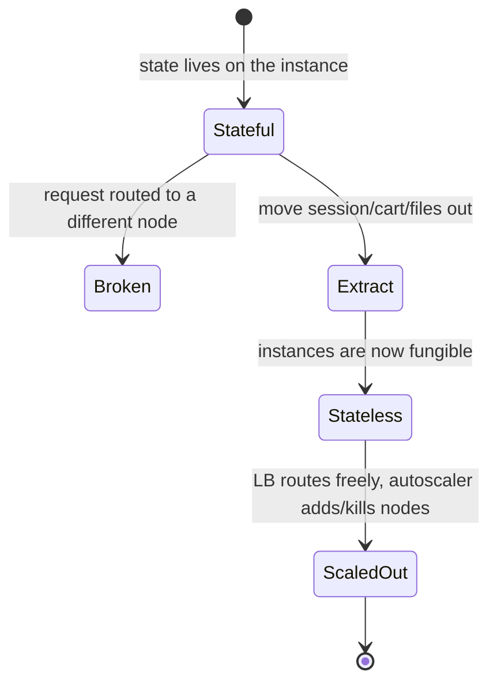
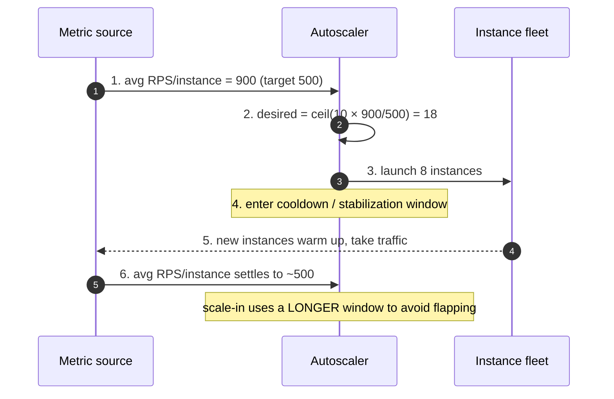
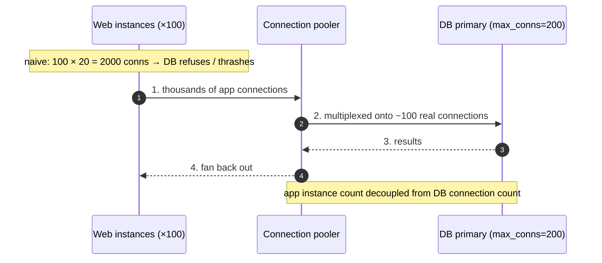
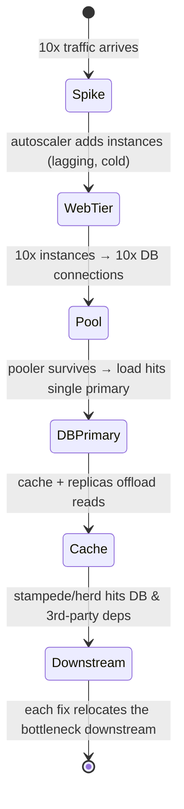

# Horizontal Scaling — Interview

Horizontal scaling means adding *more* machines behind a load balancer rather than buying a
*bigger* machine. It is the default answer to "how do we handle more traffic," but the naive
version ("just add instances") hides the hard parts: statelessness is a precondition, the
database is usually the real ceiling, autoscaling misconfigured oscillates or amplifies
outages, and multiplying instances can *cause* failures (connection-pool exhaustion, cache
stampedes, thundering herds). These questions probe whether you can reason about the limits —
Amdahl's Law and the Universal Scalability Law — and diagnose *what breaks first* when a tier
is scaled out, not just recite "add more boxes."

## Table of Contents
1. [Q1: What is horizontal scaling and how does it differ from vertical scaling?](#q1-what-is-horizontal-scaling-and-how-does-it-differ-from-vertical-scaling)
2. [Q2: Why does statelessness enable horizontal scaling?](#q2-why-does-statelessness-enable-horizontal-scaling)
3. [Q3: Sticky sessions vs an external session store — trade-offs?](#q3-sticky-sessions-vs-an-external-session-store--trade-offs)
4. [Q4: How does autoscaling work — metrics, cooldown, oscillation?](#q4-how-does-autoscaling-work--metrics-cooldown-oscillation)
5. [Q5: You scale the web tier out infinitely — why doesn't throughput scale linearly?](#q5-you-scale-the-web-tier-out-infinitely--why-doesnt-throughput-scale-linearly)
6. [Q6: Amdahl's Law vs the Universal Scalability Law — what's the difference?](#q6-amdahls-law-vs-the-universal-scalability-law--whats-the-difference)
7. [Q7: Why is the database usually the real bottleneck, and what do you do about it?](#q7-why-is-the-database-usually-the-real-bottleneck-and-what-do-you-do-about-it)
8. [Q8: Adding web instances made the database fall over. Why?](#q8-adding-web-instances-made-the-database-fall-over-why)
9. [Q9: What is a scale-in thundering herd and how do you avoid it?](#q9-what-is-a-scale-in-thundering-herd-and-how-do-you-avoid-it)
10. [Q10: How do you handle cold-start on newly launched instances?](#q10-how-do-you-handle-cold-start-on-newly-launched-instances)
11. [Q11: How do you decide between scaling up and scaling out?](#q11-how-do-you-decide-between-scaling-up-and-scaling-out)
12. [Q12: What autoscaling metric should you actually scale on?](#q12-what-autoscaling-metric-should-you-actually-scale-on)
13. [Q13: How do you prevent autoscaling from amplifying an outage?](#q13-how-do-you-prevent-autoscaling-from-amplifying-an-outage)
14. [Q14: Scenario — scale a web tier for a 10x traffic spike. What breaks first?](#q14-scenario--scale-a-web-tier-for-a-10x-traffic-spike-what-breaks-first)
15. [Q15: How do you scale a genuinely stateful tier horizontally?](#q15-how-do-you-scale-a-genuinely-stateful-tier-horizontally)
16. [Q16: How do you capacity-plan and load-test a horizontally scaled tier?](#q16-how-do-you-capacity-plan-and-load-test-a-horizontally-scaled-tier)

---

## Q1: What is horizontal scaling and how does it differ from vertical scaling?

> **Horizontal scaling (scale-out)** = add more *nodes* of the same size and spread load across
> them, typically behind a load balancer. **Vertical scaling (scale-up)** = give a single node
> more resources (CPU, RAM, faster disk). The distinction that matters in an interview: they
> have different *ceilings and failure profiles*, not just different costs.
>
> Vertical scaling is trivial (no code change, one big box, strong consistency stays easy) but
> hits a hard physical ceiling — the biggest instance you can buy — and that box is a single
> point of failure. Horizontal scaling is theoretically unbounded and gives you redundancy
> (lose one of N nodes, lose 1/N of capacity, not the service), but it demands that the
> workload be *distributable* — which forces statelessness, load balancing, and distributed-
> systems concerns (consistency, coordination, partial failure).

| Dimension | Vertical (scale-up) | Horizontal (scale-out) |
|---|---|---|
| How | Bigger machine | More machines |
| Ceiling | Largest instance available | Effectively unbounded (until a shared tier caps you) |
| Fault tolerance | Single point of failure | Redundant — lose 1/N on a node death |
| Code impact | None | Must be stateless / distributable |
| Cost curve | Super-linear (big boxes cost a premium) | ~Linear per node (until coordination overhead bites) |
| Downtime to resize | Usually a reboot | Rolling — no full downtime |
| New failure modes | — | Network partitions, coordination, herds, pool exhaustion |

The pragmatic answer: scale *up* first because it's cheap and simple, then scale *out* once you
approach the vertical ceiling or need redundancy for availability.

---

## Q2: Why does statelessness enable horizontal scaling?

> Because scale-out puts a load balancer in front of N interchangeable instances, and any
> request can land on any instance. If instance A holds state (a user's session, an in-memory
> cart, an upload buffer) and the *next* request from that user goes to instance B, B has no
> idea about it — the request breaks. A **stateless** service keeps no client-specific state
> between requests locally; every instance can serve every request identically. That's what
> makes instances *fungible*, which is the whole point: the LB can route freely, autoscaling
> can add/kill nodes at will, and a dead node loses no user data.
>
> "Stateless" doesn't mean the *system* has no state — it means the *service tier* pushes state
> outward to a shared, purpose-built store: sessions → Redis/DB, files → object storage (S3),
> durable data → the database, coordination → the LB or a coordination service. The app
> instances become pure request processors. This is exactly why the classic advice is "make the
> web tier stateless and scale it horizontally; keep the state in a tier you scale deliberately."

---

## Q3: Sticky sessions vs an external session store — trade-offs?

> Both solve "how does a user's session survive across many instances," but they pull in
> opposite directions on the statelessness axis.
>
> **Sticky sessions (session affinity)** — the LB pins a given client to one backend (via a
> cookie or a hash of the client IP), so state can stay in that instance's memory. It's the
> *lazy* fix: no code change, low latency (state is local). The costs are severe at scale: it
> breaks even load distribution (a whale user or an unlucky hash overloads one node), and it
> makes the node *stateful again* — if that instance dies or is scaled in, every pinned user
> loses their session. It also fights autoscaling, because you can't freely drain a node.
>
> **External session store** — session state lives in a shared store (Redis, Memcached, or the
> DB); every instance reads/writes it, so instances stay stateless and fungible. Costs: a
> network round-trip per request (latency + a new dependency), and the store itself becomes a
> tier you must scale and make highly available. This is the *correct* answer for
> horizontally scaled systems.

| | Sticky sessions | External session store |
|---|---|---|
| State location | In-instance memory | Shared store (Redis/DB) |
| Instances stay fungible? | No | Yes |
| Load distribution | Uneven (pinning skews it) | Even |
| Node death impact | Pinned users lose session | No user impact |
| Autoscaling / draining | Fights it | Clean |
| Latency | Lowest (local) | +1 network hop |
| New dependency | None | The store (must be HA) |

> Interview tip: sticky sessions are acceptable as a *bridge* (e.g., before you've externalized
> state) or where the state is huge and per-request fetch is too costly, but the durable answer
> for scale-out is "externalize the state and keep the tier stateless."

---

## Q4: How does autoscaling work — metrics, cooldown, oscillation?

> An autoscaler runs a control loop: **observe a metric → compare to a target → compute the
> desired instance count → add or remove instances → wait**. The canonical algorithm (used by
> Kubernetes' HPA and cloud target-tracking) is proportional:
> `desired = ceil(current × currentMetric / targetMetric)`. If current average CPU is 80% and
> the target is 40% with 10 pods, desired = `ceil(10 × 80/40)` = 20.
>
> Three concepts you must name:
> - **Metric** — what you scale on. CPU is the default but often wrong (see Q12); prefer a
>   metric that tracks user-facing load: requests-per-second per instance, in-flight
>   concurrency, or queue depth.
> - **Cooldown / stabilization window** — after a scaling action, wait before acting again, so
>   the fleet's metrics can settle. Without it, the loop reacts to its own not-yet-stabilized
>   effects.
> - **Oscillation (flapping)** — the fleet repeatedly scales up then down (up → metric drops →
>   scale down → metric spikes → scale up …), thrashing capacity and paying cold-start cost each
>   cycle. Cures: asymmetric behavior (scale out fast, scale in *slow*), a longer scale-down
>   stabilization window, a dead-band/tolerance around the target, and target-tracking on a
>   smooth metric rather than a spiky one.

---

## Q5: You scale the web tier out infinitely — why doesn't throughput scale linearly?

> Because no real workload is 100% parallelizable, and because every added node introduces
> *coordination* and *contention* on shared resources. Two laws capture this:
>
> **Amdahl's Law** says speedup is capped by the serial fraction. If a fraction `s` of the work
> is inherently serial (must go through one place — a shared DB write, a global lock, a leader),
> then max speedup ≤ `1/s` no matter how many nodes you add. If even 5% of request handling
> serializes on the database, you can never exceed ~20× throughput, however many web nodes you
> deploy.
>
> **The Universal Scalability Law (USL)** is worse and more realistic: beyond a point, adding
> nodes makes throughput *decrease*, because **crosstalk/coherency** cost (nodes coordinating
> with each other and with shared state — cache-line bouncing, lock contention, distributed-
> consistency chatter) grows quadratically. There's an optimal node count; past it you're paying
> more and getting less.
>
> Practically: the web tier scales nearly linearly *only* while every request stays independent
> and touches no contended shared resource. The moment requests converge on one thing — the
> primary database, a distributed lock, a single hot partition — that thing sets the real
> ceiling, and adding web nodes just pushes more load onto it (see Q7/Q8).

---

## Q6: Amdahl's Law vs the Universal Scalability Law — what's the difference?

> Both model diminishing returns from parallelism, but USL adds a term Amdahl ignores.
>
> - **Amdahl** models only **contention** (the serial fraction). Speedup rises and then
>   *plateaus* at `1/s`. It is monotonic — more nodes never *hurt*, they just stop helping.
> - **USL** adds a **coherency/crosstalk** term for the cost of keeping N nodes consistent with
>   each other. Because that cost grows with the number of *pairs* of nodes (∝ N²), the throughput
>   curve rises, peaks, and then **declines**. USL predicts a concrete "you've added too many
>   nodes" point.

| | Amdahl's Law | Universal Scalability Law |
|---|---|---|
| Models | Serial fraction (contention) | Contention **+** coherency (crosstalk) |
| Curve shape | Rises, then plateaus at 1/s | Rises, peaks, then **falls** |
| More nodes ever hurt? | No (just stop helping) | Yes, past the peak |
| Real-world fit | Optimistic | More realistic for distributed systems |
| Takeaway | There's a ceiling | There's an *optimal* node count |

> Use this to push back on "just add more instances": the interviewer wants to hear that you
> know scale-out has a shape, and that the fix beyond the peak is *reducing shared contention*
> (sharding, caching, async), not adding nodes.

---

## Q7: Why is the database usually the real bottleneck, and what do you do about it?

> Because the web tier is (correctly) stateless and fungible — it scales out cheaply — while the
> database is *stateful* and usually a **single writable primary**. Every web instance you add
> sends more load to that one primary. The web tier's job was essentially to funnel work *to* the
> DB, so scaling web nodes just concentrates pressure on the tier that can't trivially scale out.
> In Amdahl/USL terms, the DB is your serial fraction.
>
> The playbook, roughly in order of effort:
> 1. **Cache reads** — put Redis/Memcached (or a CDN for edges) in front; most workloads are
>    read-heavy, and cache hits never touch the DB.
> 2. **Read replicas** — fan reads out to N replicas, send writes to the primary. Scales reads
>    horizontally; introduces replication lag (read-your-writes concerns).
> 3. **Connection pooling / a pooler** (PgBouncer, ProxySQL) — the DB has a hard cap on concurrent
>    connections; a pooler multiplexes many app connections onto few DB ones (see Q8).
> 4. **Shard / partition writes** — split data across independent primaries by a shard key so
>    write throughput scales out too. This is the heaviest lift and adds cross-shard query pain.
> 5. **Async / CQRS / queues** — take non-critical writes off the synchronous path (write to a
>    queue, process later) so a spike doesn't hammer the primary in real time.

---

## Q8: Adding web instances made the database fall over. Why?

> The classic **connection-pool exhaustion** failure. Each web instance keeps its own local pool
> of DB connections (say 20). With 10 instances that's 200 connections; autoscale to 100
> instances and it's 2,000 — but Postgres/MySQL have a hard `max_connections` cap (often a few
> hundred), and each connection costs the DB real memory and scheduler overhead. Past the cap,
> new connections are refused; below it, thousands of mostly-idle backend processes thrash the
> DB even though few are doing useful work. So scaling the *stateless* tier detonated the
> *stateful* one — a textbook example of the web tier not being the bottleneck.
>
> Fixes:
> - **A connection pooler in front of the DB** (PgBouncer in transaction mode, ProxySQL) —
>   multiplexes thousands of app-side connections onto a small, fixed set of real DB connections.
>   This decouples app instance count from DB connection count, which is the key idea.
> - **Cap per-instance pool size** and size the *total* (instances × pool) to stay under the DB's
>   safe limit — the total is what matters, not the per-instance number.
> - **Cache and read replicas** so fewer requests reach the primary at all.

---

## Q9: What is a scale-in thundering herd and how do you avoid it?

> Two distinct herds show up around scaling; name both.
>
> **Scale-in herd (connection churn):** when the autoscaler *removes* instances, every
> connection those instances held is dropped at once. All those clients reconnect
> simultaneously, and the surviving instances take a synchronized spike of new connections,
> TLS handshakes, and re-authentication — which can push them over their own limit and trigger
> *more* scaling churn. It's worst when instances are terminated abruptly instead of drained.
> Cures: **connection draining / graceful shutdown** (stop sending new requests, let in-flight
> ones finish, close gently, deregister from the LB first), terminate a *few at a time* not in a
> batch, and add **jitter** so clients don't all reconnect on the same tick.
>
> **The broader thundering herd:** any event that makes many clients act in lockstep — a cache
> entry expiring so every request hits the DB at once (cache stampede), or a fleet all retrying a
> failed dependency at the same instant. General cures: **jitter** (randomize timers/backoff),
> **request coalescing / single-flight** (one request refills the cache, others wait for it),
> and **exponential backoff with jitter** on retries.

---

## Q10: How do you handle cold-start on newly launched instances?

> A freshly launched instance is *not* immediately at full capacity: it boots the OS/runtime,
> pulls the container image, initializes the app (JIT warmup for JVM/V8, class loading),
> establishes connection pools, and starts with **cold local caches**. If the LB routes full
> traffic to it the instant it's "up," it responds slowly or errors, and its first DB queries all
> miss cache — right when you scaled *because* you're already under load. This is the cruel
> timing of reactive autoscaling: capacity arrives late and arrives cold.
>
> Mitigations:
> - **Health checks that gate LB registration** — distinguish *liveness* (process up) from
>   *readiness* (warmed, pools filled, dependencies reachable). Only send traffic once *ready*.
> - **Slow-start / connection ramp-up** at the LB — feed a new instance a gradually increasing
>   share of traffic instead of an instant full slice.
> - **Cache warming** — prefetch hot keys on startup, or rely on a *shared* cache so a new
>   instance isn't starting from an empty local one.
> - **Provision ahead of demand** — predictive/scheduled scaling and headroom (scale at 60% not
>   95%) so instances are warm *before* the spike; keep a warm pool for burst.
> - **Faster starts** — slim images, lazy-load non-critical work, avoid heavyweight init.

---

## Q11: How do you decide between scaling up and scaling out?

> Reason about ceiling, availability, and workload shape rather than dogma.
>
> **Scale up when:** you're well below the largest instance; the workload is hard to distribute
> (a single-writer DB, an in-memory graph, something that needs strong local consistency); you
> want zero code change fast; or per-node coordination overhead would eat the gains (USL peak is
> low). Vertical is the cheapest lever early on.
>
> **Scale out when:** you're near the vertical ceiling; you need **redundancy** (no single box
> can be a SPOF for an HA target); load is spiky and you want elastic, pay-for-what-you-use
> capacity; or the tier is already stateless and fungible so scale-out is nearly free.
>
> In practice most systems do **both**: scale up individual nodes to a sensible, cost-effective
> size, then scale that unit out horizontally. The web tier scales out; the database scales up
> first, then out via replicas/sharding when forced. The honest interview answer is "start
> vertical for simplicity, move horizontal for the ceiling and for availability — and note that
> availability alone can force scale-out even when one big box would handle the load."

---

## Q12: What autoscaling metric should you actually scale on?

> The metric must be a **leading, per-instance proxy for user-facing load** — one that rises
> *before* users feel pain and maps cleanly to "add one instance."
>
> - **CPU utilization** — the default, and often misleading. A tier can be latency-bound while
>   I/O-waiting at low CPU (so you never scale though users suffer), or CPU-bound on background
>   GC/compaction unrelated to request load (so you scale for nothing). Fine for genuinely
>   CPU-bound compute; weak for typical I/O-bound web services.
> - **Requests-per-second / concurrency per instance** — usually the best for stateless web
>   tiers: it directly reflects offered load and target-tracks cleanly.
> - **Queue depth / backlog** — the right signal for worker/consumer tiers: scale to keep the
>   backlog (or per-message wait) under target. Directly ties instance count to work waiting.
> - **p99 latency** — a good *guardrail* but a laggy and noisy *trigger* (it spikes only once
>   you're already saturated), so use it to alert, not usually as the sole scaling input.
>
> The senior point: scale on the metric that is *causal* for your bottleneck. A queue-backed
> worker should scale on backlog, not CPU; an API tier on RPS/concurrency, not CPU.

---

## Q13: How do you prevent autoscaling from amplifying an outage?

> Autoscaling is a feedback loop, and feedback loops can turn a small fault into a large one.
> Failure patterns and their guards:
>
> - **Retry storm feedback:** a dependency slows → requests pile up → latency/CPU rises →
>   autoscaler adds instances → more clients hammer the slow dependency → it degrades further.
>   Autoscaling *fed the fire*. Guards: circuit breakers, timeouts + bounded retries with
>   backoff+jitter, and load shedding so you fail fast instead of queueing.
> - **Metric collapse:** scale on a metric that goes *quiet* during an incident (e.g., healthy
>   requests drop because everything is erroring) and the autoscaler may scale *down* mid-outage.
>   Guard: scale on offered/attempted load, and cap scale-in during elevated error rates.
> - **Runaway scale-out / cost blowout:** a bug or attack drives a metric up and the autoscaler
>   launches unbounded instances. Guard: hard **max-instance caps**, budget alarms.
> - **Flapping** (Q4): asymmetric policies (out fast, in slow) plus stabilization windows.
> - **Cold-start during the very spike you're scaling for** (Q10): provision headroom, predictive
>   scaling, warm pools.
>
> Overarching principle: autoscaling handles *capacity*, not *failure*. Pair it with resilience
> patterns (breakers, shedding, backpressure) so the loop can't amplify an incident.

---

## Q14: Scenario — scale a web tier for a 10x traffic spike. What breaks first?

> The trap answer is "add 10× the web instances." The web tier is the *easy* part; the failure
> propagates to whatever it depends on. Walk the chain in the order things actually break:
>
> 1. **Autoscaler lag + cold start** — reactive scaling reacts *after* load rises, and new
>    instances arrive cold (Q10). For the first minutes you're under-capacity with slow, cache-
>    cold nodes. First mitigations: pre-provision/pre-warm ahead of a known spike, keep headroom.
> 2. **Connection-pool exhaustion at the DB** — 10× web instances = ~10× DB connections; you blow
>    past `max_connections` and the DB starts refusing/thrashing (Q8). This is usually **what
>    breaks first** once the web tier does scale. Fix: connection pooler, capped per-instance
>    pools sized against the DB's total.
> 3. **Database primary saturation** — even with pooling, the single writable primary is the
>    serial fraction (Q7). Reads: cache + replicas. Writes: shard, or shed/queue non-critical
>    writes.
> 4. **Cache stampede / thundering herd** — a spike expiring hot keys sends a synchronized flood
>    to the DB (Q9). Fix: request coalescing/single-flight, jittered TTLs, pre-warm hot keys.
> 5. **Downstream dependencies & shared services** — a third-party API, auth service, or the LB's
>    own connection limits become the next ceiling. Fix: rate limits, bulkheads, load shedding.
>
> The senior framing: **scaling the stateless tier just relocates the bottleneck to the next
> shared, stateful resource.** Name that chain — pool → DB primary → cache → downstream — and you
> demonstrate you understand horizontal scaling is a *system* property, not a per-tier knob.

---

## Q15: How do you scale a genuinely stateful tier horizontally?

> When the data itself must scale out (you can't just externalize it — it *is* the state), you
> distribute the state and accept distributed-systems trade-offs:
>
> - **Partitioning / sharding** — split the keyspace across independent nodes by a shard key
>   (hash or range). Each node owns a slice, so writes scale out. Costs: cross-shard queries and
>   transactions are hard, and a bad key creates **hot shards**. **Consistent hashing** minimizes
>   data movement when nodes are added/removed.
> - **Replication** — copy each shard to multiple nodes for read scale-out and fault tolerance;
>   pay with replication lag and consistency choices (sync vs async, read-your-writes).
> - **Leader/follower vs leaderless** — a single writer per shard keeps writes simple but caps
>   write throughput per shard; leaderless/multi-writer scales writes but forces conflict
>   resolution.
> - **CAP/consistency posture** — once state is distributed across nodes that can be partitioned
>   from each other, you must choose your behavior under partition (CP vs AP). This is the price
>   of scaling state horizontally that you don't pay when scaling a stateless tier.
>
> The contrast to draw: stateless tiers scale out *for free* (fungible instances); stateful tiers
> scale out by taking on partitioning, replication, and consistency complexity — which is exactly
> why the standard architecture is "keep the app tier stateless, and scale the state tier
> deliberately."

---

## Q16: How do you capacity-plan and load-test a horizontally scaled tier?

> Turn "add more boxes" into numbers.
>
> 1. **Find single-instance capacity.** Load-test *one* instance to its knee — the RPS/concurrency
>    at which p99 latency or error rate crosses your SLO. That's your per-node budget (e.g., 500
>    RPS/instance). Test to the *knee*, not to failure; you run below it.
> 2. **Compute instance count with headroom.** `instances = peak_RPS / per_instance_capacity`,
>    then add headroom (target ~60–70% utilization, not 95%) so you can absorb spikes and cold-
>    start lag, plus N+1/N+2 for node failures.
> 3. **Validate that a *shared* tier can take it.** Multiply out DB connections (instances ×
>    pool), cache throughput, and downstream QPS — confirm the DB, pooler, cache, and third
>    parties survive the fleet at target size. This is where naive plans fail (Q8).
> 4. **Load-test the whole fleet**, including autoscaling behavior: does it scale out fast enough
>    for your ramp, does it flap, does scale-in drain gracefully, does the DB pooler hold?
> 5. **Set autoscaling from the data** — target the per-instance metric (Q12) at the utilization
>    that leaves headroom, with a max-cap for safety (Q13).
>
> The point to land: capacity planning for scale-out is dominated by the *shared* tier's limits,
> not the stateless tier's — you plan the web tier with arithmetic, and you plan the database,
> pooler, and cache with care, because that's where the ceiling actually lives.

---

> 🎞️ **See it animated:** [Consistent hashing](https://www.toptal.com/big-data/consistent-hashing)

*Next step:* [Global Server Load Balancing — Junior](../07-global-server-load-balancing/junior.md)
