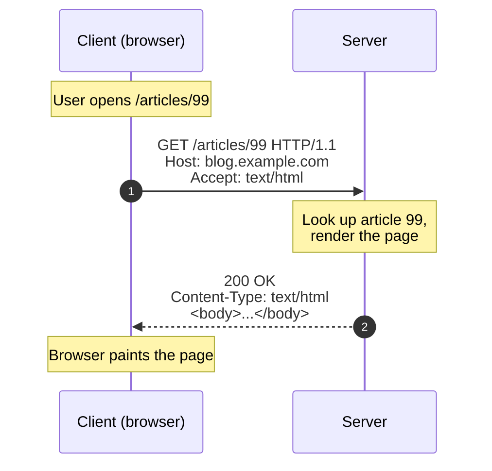
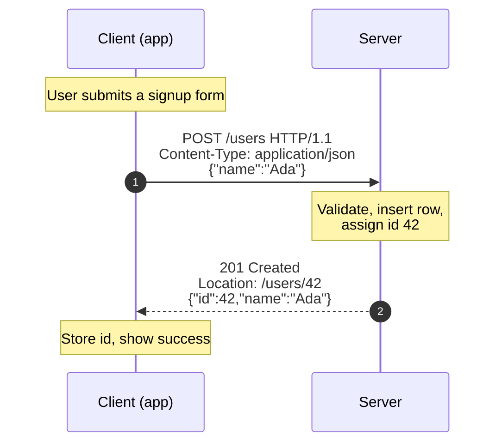

# HTTP — Junior

<!-- level-focus -->
At junior level, focus on this question:

> How can I apply **HTTP** in one small example and prove the result?

Use the smallest realistic scenario that exposes the decision and its failure behavior.
## 1. The one-sentence model

**HTTP is a request/response protocol: a *client* sends a message asking for something, and a *server* sends exactly one message back.**

Everything else is detail on top of that shape. Four facts fall out of it:

- **The client always starts.** A server never speaks first — it waits, receives a request, and answers. (This is why "the server pushing to the browser" needs extra machinery like WebSockets or SSE, covered later in §9.)
- **One request → one response.** Each request gets its own reply. There is no partial answer and no reply without a request.
- **It is text-based in spirit.** An HTTP message is human-readable: a first line, some `Header: value` lines, a blank line, then an optional body. You can read it with your eyes. (HTTP/2 and HTTP/3 compress and binary-encode this on the wire, but the *meaning* — the fields below — is unchanged.)
- **It is a contract, not a transport.** HTTP defines the *meaning* of methods, statuses, and headers. TCP/QUIC (from §5) handles actually moving the bytes.

Hold onto "client asks, server answers, one for one." The rest of this page is just filling in what goes in each message.

## 2. Anatomy of a request

A request has up to four parts. Only the first line is mandatory.

```http
POST /users HTTP/1.1              ← 1. request line: METHOD  PATH  VERSION
Host: api.example.com            ← 2. headers (metadata, key: value)
Content-Type: application/json
Content-Length: 27
                                 ← blank line separates headers from body
{"name": "Ada", "age": 36}       ← 3. body (optional; the payload you send)
```

| Part | Example | What it means |
|------|---------|---------------|
| **Method** | `POST` | The *verb* — what you want to do (fetch, create, update, delete) |
| **Path** | `/users` | The *resource* — what you want to act on |
| **Version** | `HTTP/1.1` | Which rules apply |
| **Headers** | `Content-Type: application/json` | Metadata about the request or body |
| **Body** | `{"name": "Ada"}` | The actual data you're sending (absent for a plain GET) |

The **method + path** together answer "what do you want done, and to what?" — for example, "`POST` (create) a new `/users`."

## 3. Anatomy of a response

A response mirrors the request but starts with a **status code** instead of a method.

```http
HTTP/1.1 201 Created             ← 1. status line: VERSION  CODE  REASON
Content-Type: application/json   ← 2. headers
Location: /users/42
                                 ← blank line
{"id": 42, "name": "Ada"}        ← 3. body (the answer, if any)
```

| Part | Example | What it means |
|------|---------|---------------|
| **Version** | `HTTP/1.1` | Same protocol version |
| **Status code** | `201` | A 3-digit number saying how it went |
| **Reason phrase** | `Created` | Human-friendly label for the code (informational only) |
| **Headers** | `Location: /users/42` | Metadata about the response |
| **Body** | `{"id": 42, ...}` | The result — data, an HTML page, an error message, or nothing |

The **status code** is the single most important field in a response: it tells the client whether to celebrate, retry, fix its request, or give up (see §7).

## 4. Walking through a GET

`GET` means "give me a representation of this resource." It carries no body — everything the server needs is in the path and headers.



Read it top to bottom:

1. The user navigates to `/articles/99`.
2. The client sends a **request line** (`GET /articles/99`) plus headers. `Accept: text/html` tells the server "I'd like HTML back."
3. The server finds the article and builds a response.
4. It replies with **`200 OK`** and the HTML in the body.
5. The browser renders it.

No body went *up* (nothing to send), and a body came *down* (the page). That asymmetry is normal for reads.

## 5. Walking through a POST

`POST` means "here is some data — process it, usually creating something new." Now the client sends a body.



The differences from the GET:

- The request **has a body** (`{"name":"Ada"}`), and `Content-Type` declares what that body is.
- The server *changes state* — it inserts a new user.
- The response is **`201 Created`**, and the `Location` header tells the client *where the new thing lives* (`/users/42`), so it can fetch it later with a `GET`.

`GET` reads; `POST` writes. That distinction drives almost every API decision you'll make.

## 6. Methods: the verbs

There are a handful of common methods. Learn these five first — they map cleanly onto "create, read, update, delete."

| Method | Intent | Has body? | Typical success | Analogy |
|--------|--------|-----------|-----------------|---------|
| `GET` | Read a resource | No | `200 OK` | Reading a page |
| `POST` | Create / submit / process | Yes | `201 Created` / `200 OK` | Filling out a new form |
| `PUT` | Replace a resource entirely | Yes | `200 OK` / `204 No Content` | Overwriting a whole file |
| `PATCH` | Update part of a resource | Yes | `200 OK` | Editing one field |
| `DELETE` | Remove a resource | Usually no | `204 No Content` | Throwing something out |

The distinction that trips up beginners is **`PUT` vs `PATCH`**: `PUT` sends the *complete* new version of the resource and replaces it wholesale; `PATCH` sends only the *changed fields*. If you `PUT` a user with just `{"name":"Bob"}`, a strict server may treat every field you omitted as cleared. `PATCH` touches only what you send.

Methods are a *convention the server chooses to honor*, not a law — technically a server could delete data on a `GET`. Doing so is a serious bug, because the whole ecosystem (browsers, caches, crawlers) assumes methods mean what §10 says they mean.

## 7. Status codes: the five classes

Every response carries a 3-digit code. You don't memorize all of them — you memorize the **first digit**, which tells you the *class* of outcome.

| Class | Range | Meaning | Common examples |
|-------|-------|---------|-----------------|
| **1xx** | Informational | "Still working, hold on" | `100 Continue` (rare to handle by hand) |
| **2xx** | Success | "It worked" | `200 OK`, `201 Created`, `204 No Content` |
| **3xx** | Redirection | "Look elsewhere" | `301 Moved Permanently`, `304 Not Modified` |
| **4xx** | Client error | "*You* got it wrong" | `400 Bad Request`, `401 Unauthorized`, `403 Forbidden`, `404 Not Found`, `429 Too Many Requests` |
| **5xx** | Server error | "*We* got it wrong" | `500 Internal Server Error`, `503 Service Unavailable` |

The single most useful mental split is **4xx vs 5xx**:

- **4xx = the client's fault.** The request was malformed, unauthenticated, forbidden, or aimed at something that doesn't exist. Retrying the *same* request won't help — the client must change something.
- **5xx = the server's fault.** The request was reasonable, but the server failed to fulfill it. Here retrying *might* succeed once the server recovers.

Getting this right matters in real systems: monitoring dashboards, retry logic, and load balancers all branch on whether an error is 4xx or 5xx. Returning `500` for a user typo (should be `400`), or `200` for a failure (a "lying" success), corrupts every tool that reads your status codes.

## 8. Headers: metadata for both sides

Headers are `Key: Value` lines carrying metadata — data *about* the request or response, not the payload itself. A few you'll meet constantly:

- **`Host`** (request) — which site you're addressing; lets one server host many domains.
- **`Content-Type`** (both) — what format the *body* is in (`application/json`, `text/html`, …). Without it the other side is guessing.
- **`Content-Length`** (both) — how many bytes the body is.
- **`Accept`** (request) — what formats the client *would like* back.
- **`Authorization`** (request) — who you are / your credentials (covered in depth in later security sections).
- **`Location`** (response) — where a newly created or moved resource lives.
- **`Cache-Control`** (both) — how long this may be reused before re-fetching.

Rule of thumb: **the body is the *what*; headers are the *about*.** "Here is JSON" — the JSON is the body, `Content-Type: application/json` is the header describing it.

## 9. Statelessness

HTTP is **stateless**: each request is self-contained, and the server is not required to remember anything about previous requests from the same client.

Concretely, if you send request A ("log me in") and then request B ("show my profile"), the server does **not** automatically know B came from the same person as A. Request B must *carry its own proof* — typically a cookie or an `Authorization` header established during A. Every request stands on its own.

Why this design is a feature, not a limitation:

- **Any server can handle any request.** Because requests don't depend on server-side memory, a load balancer can send your next request to a *different* machine and it still works. This is the foundation of horizontal scaling (§8).
- **Simplicity and resilience.** A server can crash and restart without losing "conversation state," because there was none to lose.

The cost is that identity/context must be re-sent (or re-looked-up) on every request. Sessions, tokens, and cookies exist precisely to reconstruct continuity *on top of* a stateless protocol — the protocol itself stays forgetful.

## 10. Safe and idempotent methods

Two properties classify what a method *promises*. They look similar but mean different things.

- **Safe** = the method does not change server state; it's read-only. `GET` is safe. This is why a browser can prefetch links or a crawler can hit every `GET` on your site without consequence — a safe request must never delete or create anything.
- **Idempotent** = making the *same* request N times has the *same effect* as making it once. The result on the server is identical whether it arrives one time or five.

| Method | Safe? | Idempotent? | Why it matters |
|--------|-------|-------------|----------------|
| `GET` | Yes | Yes | Free to cache, prefetch, retry |
| `PUT` | No | Yes | "Set to this value" — repeating lands on the same value |
| `DELETE` | No | Yes | Deleting twice ends in the same state: gone |
| `PATCH` | No | Not guaranteed | Depends on the change (e.g. "increment by 1" is not idempotent) |
| `POST` | No | No | Two `POST`s usually create *two* records |

Idempotency is the property you reach for when networks get flaky. If a request times out and you don't know whether it landed, you can safely **retry an idempotent request** — worst case, nothing extra happens. Retrying a `POST` blindly might create a duplicate order. That's why "create" endpoints often need extra care (idempotency keys, covered later) while "replace" and "delete" endpoints are naturally retry-safe.

## 11. Content types

The same URL can return different *formats*. `Content-Type` (also called the MIME type) tells the receiver how to interpret the bytes in the body.

| `Content-Type` | Contains | Seen in |
|----------------|----------|---------|
| `text/html` | A web page | Browser navigation |
| `application/json` | Structured data | Most REST APIs |
| `text/plain` | Raw text | Logs, simple responses |
| `application/x-www-form-urlencoded` | Encoded form fields | HTML `<form>` submits |
| `multipart/form-data` | Files + fields | File uploads |
| `image/png`, `application/pdf` | Binary files | Downloads |

Two directions to keep straight:

- On a **request** with a body, `Content-Type` says "here's what I'm *sending* you."
- On a **response**, `Content-Type` says "here's what I'm *giving* you back."
- `Accept` (request only) is the client's *wish list*: "I'd prefer JSON." The server may honor it or return its default.

Getting `Content-Type` wrong is a classic bug: send JSON but label it `text/plain`, and the receiving app may refuse to parse it. The label must match the bytes.

## 12. Common mistakes

- **Using `GET` to change data.** "`GET /deleteUser?id=5`" is a trap: crawlers, prefetchers, and caches will fire it and wreck your data. Reads use `GET`; writes use `POST`/`PUT`/`PATCH`/`DELETE`.
- **Returning `200 OK` for a failure.** A body that says `{"error": "not found"}` under a `200` lies to every client and monitor. Match the status code to the truth: `404`, `400`, `500`.
- **Confusing 4xx and 5xx.** A user's bad input is `400` (their fault), not `500` (yours). This distinction drives retries and alerting.
- **Forgetting statelessness.** Assuming "the server remembers I logged in" without sending a cookie/token — the server has no memory of it.
- **Mislabeling the body.** Sending JSON without `Content-Type: application/json`, so the other side can't parse it.

---

## Apply it

1. Choose one small, known input for **HTTP**.
2. Predict the output or observable behavior.
3. Run the smallest example or probe that exercises the concept.
4. Change one input to trigger a failure or boundary case.
5. Explain the evidence using the guide's vocabulary.

## Verify your work

- Record the exact input, command or code path, and output.
- Repeat the probe and confirm the result is consistent.
- Show one expected success and one expected failure.
- Resolve any difference between the prediction and the evidence.

## Review questions

- What problem does HTTP solve in the example?
- Which input changes the observed result, and why?
- What is the smallest useful success check?
- Which beginner mistake would your evidence catch?
