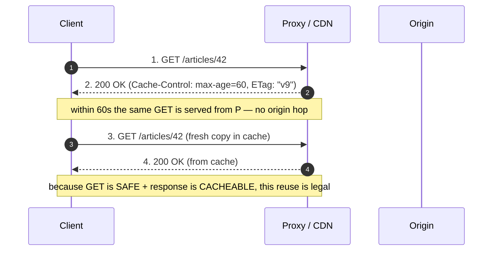
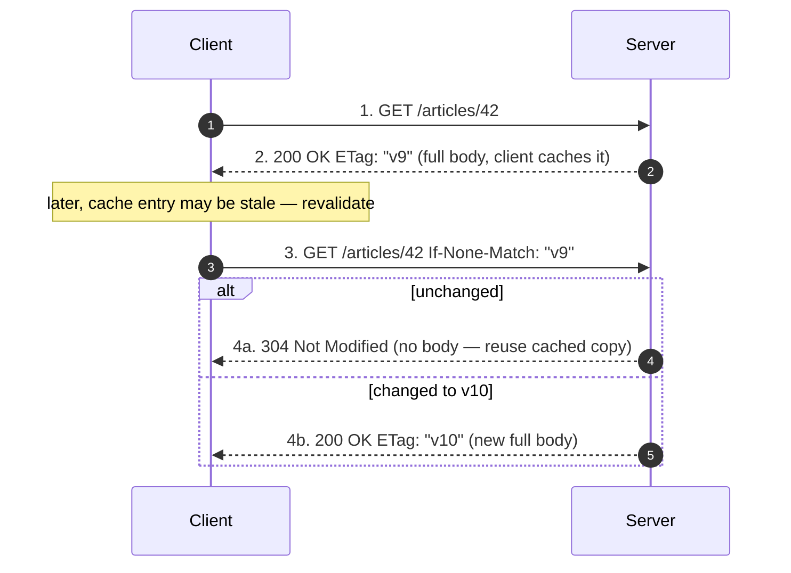

# HTTP — Middle

<!-- level-focus -->
At middle level, focus on this question:

> Where does **HTTP** belong in a maintainable component, and which trade-off selects the design?

Use the smallest realistic scenario that exposes the decision and its failure behavior.
## 1. The HTTP Semantic Model

HTTP is defined by **semantics** — the meaning of methods, status codes, and header fields —
which are stable across every transport version. RFC 9110 (*HTTP Semantics*, 2022) is now the
single normative source; it replaced the older RFC 7230–7235 split. When you design an API you are
designing against these semantics, not against a wire format. Get the semantics right and any client
— curl, a browser, a CDN, a proxy — behaves predictably.

Three properties drive almost every design decision:

- **Safe** — the method is "read-only" from the client's intent: it does not request a state change.
  `GET`, `HEAD`, `OPTIONS`, `TRACE` are safe. Crawlers, prefetchers, and link-scanners assume they
  can call safe methods freely, so **never mutate state on a `GET`**.
- **Idempotent** — issuing the request N times has the same effect on server state as issuing it
  once. This is what makes **retries safe**. `GET`, `HEAD`, `PUT`, `DELETE`, `OPTIONS` are idempotent;
  `POST` and `PATCH` are not (in general).
- **Cacheable** — the response may be stored and reused by a shared or private cache. Cacheability is
  a property of the *response* (status + headers), but methods gate it: `GET`/`HEAD` are cacheable by
  default, `POST` responses only when explicitly marked.

A single mental model ties them together:



The takeaway: safety, idempotency, and cacheability are not academic labels — they are the contract
that lets caches, proxies, and retry logic act without asking you.

---

## 2. Methods — Safe, Idempotent, Cacheable

| Method | Purpose | Safe | Idempotent | Cacheable | Has request body |
|--------|---------|------|------------|-----------|------------------|
| `GET` | Retrieve a representation | ✅ | ✅ | ✅ | No (ignored) |
| `HEAD` | Like GET, headers only, no body | ✅ | ✅ | ✅ | No |
| `OPTIONS` | Query allowed methods / CORS preflight | ✅ | ✅ | ❌ | No |
| `POST` | Create subordinate / process | ❌ | ❌ | ⚠️ only if marked | Yes |
| `PUT` | Replace target resource entirely | ❌ | ✅ | ❌ | Yes |
| `PATCH` | Apply partial modification | ❌ | ❌* | ❌ | Yes |
| `DELETE` | Remove the resource | ❌ | ✅ | ❌ | Optional |

\* `PATCH` (RFC 5789) is not idempotent in general (e.g. a JSON-Patch `add` to an array appends each
time). You *can* make a given PATCH idempotent by design (e.g. set fields to absolute values), but
the method carries no such guarantee, so clients must not blindly retry it.

**PUT vs POST — the decision that trips people up.** Use `PUT` when the **client** chooses the URI
and sends the full resource (`PUT /users/1234`); a repeat is harmless because it overwrites with the
same bytes. Use `POST` when the **server** assigns the identity (`POST /users` → server mints
`/users/1234`); a naive repeat creates a second user. That is exactly why `POST` needs an
idempotency key when the network is unreliable:

```http
POST /orders HTTP/1.1
Host: api.example.com
Content-Type: application/json
Idempotency-Key: 5f3e9c2a-8b41-4d6e-9f0a-1c2d3e4f5a6b

{ "sku": "WIDGET-1", "qty": 2 }
```

The server records the key with its result; a retried request with the same key returns the original
`201` instead of creating a duplicate order. `Idempotency-Key` is a convention (popularized by
Stripe), not a standardized header, but it is the standard way to bolt idempotency onto `POST`.

**PATCH vs PUT.** `PUT` replaces the whole representation — omitted fields are cleared. `PATCH` sends
a *delta*. Two common bodies: `application/merge-patch+json` (RFC 7386 — send only changed fields;
`null` means "delete this field") and `application/json-patch+json` (RFC 6902 — an ordered op list).
Advertise which you accept via `Accept-Patch` on the `OPTIONS`/`405` response.

---

## 3. Status Codes You Actually Send

Status classes: **2xx** success, **3xx** redirection/conditional, **4xx** client error (the request
is wrong — do not retry unchanged), **5xx** server error (the server failed — retrying may work).
The class is a routing signal for clients, caches, and monitors; picking the wrong class is a bug.

| Code | Name | Send it when… | Client should… |
|------|------|---------------|----------------|
| `200` | OK | Successful `GET`/`PUT`/`PATCH` with a body | Use the body |
| `201` | Created | `POST`/`PUT` created a resource | Read `Location` for the new URI |
| `204` | No Content | Success with **no body** (e.g. `DELETE`, or `PUT` you don't echo) | Not parse a body |
| `301` | Moved Permanently | Resource has a new canonical URI, forever | Update stored links; cacheable |
| `304` | Not Modified | Conditional GET and the cached copy is still fresh | Reuse its cached body |
| `400` | Bad Request | Malformed syntax / unparseable body | Fix the request |
| `401` | Unauthorized | No or invalid credentials | Authenticate (see `WWW-Authenticate`) |
| `403` | Forbidden | Authenticated but not allowed | Stop; auth won't help |
| `404` | Not Found | No such resource (or hide existence) | Stop |
| `409` | Conflict | Request conflicts with current state (edit race, version clash) | Re-read, reconcile, retry |
| `422` | Unprocessable Content | Syntax OK but **semantically** invalid (validation failed) | Fix field-level errors |
| `429` | Too Many Requests | Rate limit exceeded | Back off per `Retry-After` |
| `500` | Internal Server Error | Unhandled server bug | Retry cautiously / alert |
| `503` | Service Unavailable | Overloaded or in maintenance | Retry after `Retry-After` |

Distinctions that matter in practice:

- **401 vs 403.** `401` means *"I don't know who you are"* — the response **must** include a
  `WWW-Authenticate` header naming the scheme. `403` means *"I know who you are and you still can't"*.
  Sending `401` when the real problem is authorization leaks a false hint that better credentials
  exist; sending `403` when a token is missing hides the fact that logging in would fix it.
- **400 vs 422.** `400` is for requests the server cannot even parse (broken JSON, missing required
  header). `422` (RFC 9110 adopted it from WebDAV) is for well-formed requests that fail *business*
  validation — `email` is present and is valid JSON but is not a valid email. Reserving `422` for
  validation lets clients render field-level errors without guessing.
- **404 vs 403 for hiding.** To avoid confirming a resource exists to an unauthorized caller, return
  `404` instead of `403`. This is a deliberate information-hiding trade-off.
- **429 / 503 with `Retry-After`.** Both are the server saying "not now." Always pair them with
  `Retry-After` (seconds, or an HTTP-date) so well-behaved clients back off instead of hammering you.

**Redirects are not interchangeable.** `301` (permanent) and `308` are cacheable and tell clients to
rewrite links; `302`/`307` (temporary) must not update stored links. `307`/`308` additionally
**preserve the method and body** on redirect, whereas historically `301`/`302` let clients rewrite a
`POST` into a `GET`. For an API, prefer `308`/`307` when you must redirect a non-GET.

---

## 4. The Headers That Matter

Headers carry the metadata that makes the same body mean different things. The ones a middle-level
engineer must know cold:

- **`Content-Type`** — the media type of the body, e.g. `application/json`, `text/html; charset=utf-8`,
  `application/octet-stream`. Servers dispatch on it; clients parse by it. A missing or wrong
  `Content-Type` is a top cause of "my POST body is empty" bugs, because the framework never picked a
  parser. Include `charset` for text types.
- **`Accept`** — client-side content negotiation: *"I can handle these media types, in this
  preference order."* `Accept: application/json;q=1.0, text/*;q=0.5`. The server picks the best match
  and echoes it in `Content-Type`; if it can serve none, it returns `406 Not Acceptable`. Related
  negotiation headers: `Accept-Encoding` (gzip/br), `Accept-Language`.
- **`Authorization`** — carries credentials. `Authorization: Bearer <token>` for OAuth2/JWT;
  `Authorization: Basic <base64(user:pass)>` for HTTP Basic (only over TLS). This is the header the
  server reads to answer 401 vs 403.
- **`Cache-Control`** — the primary caching directive on both requests and responses.
  `max-age=300` (fresh for 300s), `no-cache` (may store but must revalidate before use),
  `no-store` (never persist — use for anything sensitive), `private` (only the end-user's browser may
  cache), `public` (shared caches/CDNs may cache). This header, not the older `Expires`, is how you
  control caches today.
- **`ETag`** — an opaque **entity tag** identifying a specific version of a representation
  (`ETag: "9c1a-v3"`). It powers conditional requests (§6). Strong (`"abc"`) means byte-for-byte
  identical; weak (`W/"abc"`) means semantically equivalent.
- **`Location`** — the URI of a newly created resource (`201`) or the target of a redirect (`3xx`).
  A `201` without a `Location` is an incomplete "created" response.
- **`Content-Length`** vs **`Transfer-Encoding: chunked`** — how the body's length is framed; see §5.

A representative response tying several together:

```http
HTTP/1.1 201 Created
Location: https://api.example.com/orders/8842
Content-Type: application/json; charset=utf-8
Content-Length: 61
Cache-Control: no-store
ETag: "8842-1"

{ "id": 8842, "sku": "WIDGET-1", "qty": 2, "status": "pending" }
```

`no-store` here is deliberate: an order confirmation is user-specific and must not sit in a shared
cache.

---

## 5. Content-Length vs Transfer-Encoding: chunked

The receiver must know **where the body ends**. HTTP offers two framings, and they are mutually
exclusive — sending both is a request-smuggling vector that compliant servers reject.

- **`Content-Length: N`** — you know the exact byte count up front and put it in the header. The
  receiver reads exactly N bytes. Simplest and required when the full body is buffered.
- **`Transfer-Encoding: chunked`** — you *don't* know the total size when you start sending (you are
  streaming a generated report, a proxied upstream, a live export). The body is sent as a series of
  size-prefixed chunks terminated by a zero-length chunk.

```http
HTTP/1.1 200 OK
Content-Type: application/json
Transfer-Encoding: chunked

1b
{"event":"start","seq":1}
20
{"event":"row","id":100,"v":"x"}
0

```

Each chunk begins with its length in **hexadecimal** (`1b` = 27 bytes), then the data, then CRLF.
The trailing `0` chunk signals end-of-body. Chunked framing is what enables streaming responses
without buffering the whole payload — the origin can emit rows as it reads them, and the client can
start processing before the response completes. Note: `Transfer-Encoding` is a hop-by-hop property of
HTTP/1.1; HTTP/2 and HTTP/3 have their own framing and do not use this header (another reason it is a
transport detail, but the *semantic* — "streamed, length unknown in advance" — is what you design
around).

---

## 6. Conditional Requests: ETag, Last-Modified, 304

Conditional requests let a client say *"only do this if the resource is (still) in the state I
think."* Two uses dominate: **cheap cache revalidation** and **optimistic concurrency control**.

**Cache revalidation (read path).** The server tags a representation with `ETag` (and/or
`Last-Modified`). Next time, the client sends `If-None-Match: "<etag>"`. If the resource is
unchanged, the server returns **`304 Not Modified` with no body** — the client reuses its cached copy.
Only when it changed does the full `200` body come back. This turns a full transfer into a tiny header
exchange.



**Optimistic concurrency (write path).** To prevent the classic "last write wins / lost update" race,
the client reads a resource, keeps its `ETag`, and sends `If-Match: "<etag>"` on the update. If
someone else changed the resource in between, the tag no longer matches and the server returns
**`412 Precondition Failed`** (or `409 Conflict` if you prefer to surface it as a business conflict).
The client must re-read and reconcile.

```http
PUT /articles/42 HTTP/1.1
If-Match: "v9"
Content-Type: application/json

{ "title": "Updated title", "body": "..." }
```

> Response is `200`/`204` if the current version is still `"v9"`, else `412 Precondition Failed`.

`Last-Modified` + `If-Modified-Since` / `If-Unmodified-Since` are the date-based equivalents. Prefer
`ETag` — it is exact and works for sub-second changes and content-defined versioning; `Last-Modified`
has one-second granularity and can miss same-second edits.

---

## 7. Range Requests: Partial Content

Range requests let a client fetch **part** of a representation — essential for resumable downloads,
media seeking, and paging through large binary objects. The server advertises support with
`Accept-Ranges: bytes`. The client asks with a `Range` header:

```http
GET /video/movie.mp4 HTTP/1.1
Range: bytes=1048576-2097151
```

A successful partial response is **`206 Partial Content`**, echoing what was actually sent via
`Content-Range` and the length of just this slice via `Content-Length`:

```http
HTTP/1.1 206 Partial Content
Accept-Ranges: bytes
Content-Range: bytes 1048576-2097151/52428800
Content-Length: 1048576
Content-Type: video/mp4

<...1 MiB of bytes...>
```

`Content-Range: bytes 1048576-2097151/52428800` reads as "bytes 1,048,576 through 2,097,151 of a
52,428,800-byte total." Key behaviors:

- **Resumable downloads.** A client that got 40% of a file and lost the connection re-requests
  `Range: bytes=<already-received>-` to continue instead of restarting.
- **Conditional ranges.** Pair `Range` with `If-Range: "<etag>"` so a resumed download aborts (falls
  back to a full `200`) if the file changed underneath you — you never stitch together two versions.
- **Unsatisfiable range.** If the requested range lies past the end of the resource, the server
  returns **`416 Range Not Satisfiable`** with a `Content-Range: bytes */<total>` telling the client
  the real size.
- **Multiple ranges** are allowed (`Range: bytes=0-99,200-299`), answered with a
  `multipart/byteranges` body — rarely needed; single ranges cover most cases.

---

## 8. Where Request State Lives: Cookies vs Tokens

HTTP is **stateless** — each request stands alone; the server does not remember the last one. To
associate requests with a session or a user, you attach state to every request. Two dominant
approaches:

**Cookies (`Set-Cookie` / `Cookie`).** The server issues a cookie; the browser stores it and sends it
back automatically on every matching request. The value is typically an opaque session ID pointing at
server-side state.

```http
Set-Cookie: sid=8f3a...; HttpOnly; Secure; SameSite=Lax; Path=/; Max-Age=3600
```

The attributes are the security surface: `HttpOnly` (JS cannot read it — blunts XSS token theft),
`Secure` (sent only over TLS), `SameSite` (`Lax`/`Strict`/`None` — the primary CSRF mitigation),
`Path`/`Domain` (scope), `Max-Age`/`Expires` (lifetime). Because browsers attach cookies
automatically, cookie-authenticated state-changing endpoints need CSRF protection (`SameSite`, or a
double-submit/synchronizer token).

**Tokens (usually `Authorization: Bearer <jwt>`).** The client stores a token (often a JWT) and
**explicitly** attaches it on each request. The server validates the signature/claims without
server-side session lookup (self-contained) — good for stateless, horizontally-scaled APIs and
cross-domain / mobile / service-to-service calls where cookies are awkward.

| Dimension | Cookie (session ID) | Bearer token (JWT) |
|-----------|---------------------|--------------------|
| Sent by | Browser, automatically | Client, explicitly per request |
| Server state | Session store lookup (stateful) | Self-contained; verify signature (stateless) |
| CSRF exposure | Yes — needs `SameSite`/CSRF token | No (not auto-attached) |
| XSS exposure | Low if `HttpOnly` | Higher if stored in JS-readable storage |
| Revocation | Easy (delete server session) | Hard (must expire or maintain a denylist) |
| Cross-origin / mobile | Awkward | Natural fit |

The practical guidance: **cookies with `HttpOnly; Secure; SameSite` for browser-first web apps**
(you get automatic sending and easy revocation), **bearer tokens for APIs, mobile, and
service-to-service** (you get statelessness and cross-domain reach). Deeper token lifecycle —
refresh rotation, revocation, key rotation — is a senior-level concern.

---

## 9. Middle Checklist
- [ ] Every method used matches its semantics: no mutation on `GET`; server-assigned IDs use `POST`,
  client-chosen URIs use `PUT`.
- [ ] Non-idempotent `POST`/`PATCH` on unreliable paths carry an `Idempotency-Key`.
- [ ] Status codes distinguish 400 (parse) vs 422 (validation) and 401 (who?) vs 403 (allowed?).
- [ ] `429`/`503` always ship a `Retry-After`; `401` always ships `WWW-Authenticate`.
- [ ] `201` responses include `Location`; sensitive responses set `Cache-Control: no-store`.
- [ ] Read paths expose `ETag`/`Cache-Control` so caches and clients can revalidate with `304`.
- [ ] Write paths accept `If-Match` for optimistic concurrency (→ `412` on stale writes).
- [ ] Large/binary resources advertise `Accept-Ranges: bytes` and honor `Range`/`If-Range`.
- [ ] Streamed responses use `Transfer-Encoding: chunked` (H1) rather than buffering the whole body.
- [ ] Cookie auth sets `HttpOnly; Secure; SameSite`; token auth is used for APIs/mobile/service calls.

> **Sources:** RFC 9110 *HTTP Semantics*; RFC 5789 (PATCH); RFC 6902 / RFC 7386 (JSON Patch / merge-patch);
> MDN Web Docs, *HTTP* reference. Cite these, not blog restatements.

*Next step:* [HTTP — Senior](senior.md)

---

## Apply it

1. Find a real component where **HTTP** affects an interface or dependency.
2. Write two plausible choices and the constraint that favors each one.
3. Make the smallest reversible change at that boundary.
4. Exercise the component alone, then exercise the integrated flow.
5. Keep the decision note with the evidence that selected the option.

## Verify your work

- A focused check proves the local behavior.
- An integrated check proves callers and dependencies still agree.
- Logs, traces, compiler output, or benchmarks expose the boundary.
- Reverting the change restores the previous behavior without unrelated edits.

## Review questions

- Which boundary is most affected by HTTP?
- What constraint would make you choose the alternative design?
- How would you isolate a local defect from an integration defect?
- What evidence shows that the change remains maintainable?
